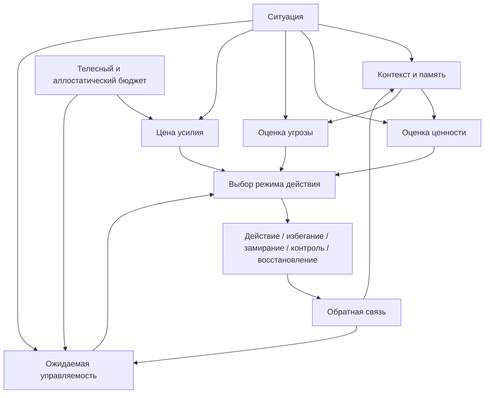

# Карта понятий и пробелов

## Назначение

Эта заметка фиксирует понятийный каркас учебника и места, где текущих материалов пока недостаточно для самодостаточного учебного текста.

Карта нужна для двух вещей:

- не забыть важные темы, которые должны быть раскрыты до конца;
- не начать писать гладкий текст поверх незакрытых дыр в модели.

## Центральная модель

Эта схема должна стать одной из сквозных схем учебника. Все ключевые главы должны возвращаться к ней и постепенно уточнять ее.

## Словарь базовых понятий

| Понятие | Краткое рабочее определение | Где раскрывать впервые | Что нельзя оставлять неясным |
| --- | --- | --- | --- |
| Когнитивное инженерство | Проектирование условий, в которых мышлению, вниманию, памяти, мотивации и действию легче работать точно, устойчиво и воспроизводимо. | Глава 2 | Отличие от тайм-менеджмента, productivity hacks, биохакинга и психотерапии. |
| Внешний контур мышления | Заметки, журналы, карты, ритуалы и артефакты, которые удерживают состояние задачи вне рабочей памяти. | Главы 4-6 | Разница между дневником, TODO-листом, конспектом и рабочим журналом. |
| Состояние задачи | Текущее понимание цели, контекста, фактов, неизвестного, гипотез, проверок и следующего шага. | Глава 4 | Почему состояние задачи нельзя заменить списком действий. |
| Рабочий журнал | Снимок состояния задачи, который помогает входить, продолжать и возвращаться к сложной работе. | Глава 5 | Что именно фиксировать на входе, выходе и после проверки гипотезы. |
| Мотивационное состояние | Временная конфигурация организма и среды, задающая вероятность запуска и удержания действия. | Глава 7 | Почему это не просто желание или настроение. |
| Ценность | Ожидаемая полезность результата: предметная, социальная, статусная, смысловая, телесная. | Глава 7 | Различие между "цель важна" и "действие доступно". |
| Цена усилия | Субъективная стоимость действия: физическая, когнитивная, эмоциональная, социальная, идентичностная. | Глава 11 | Почему цена усилия зависит от контекста и управляемости. |
| Угроза | Ожидаемый вред: ошибка, стыд, отвержение, потеря контроля, боль, перегруз, бессилие. | Главы 8-9 | Почему угроза может быть неосознанной и телесной. |
| Управляемость | Ожидаемая способность действия изменить исход. | Глава 10 | Отличие от вероятности успеха и уверенности в себе. |
| Избегание | Семейство политик действия, направленных на предотвращение ожидаемого вреда. | Глава 9 | Разница между безопасностью как ценностью и избеганием как режимом. |
| Преодоление | Управляемый цикл трудности, действия, обратной связи, корректировки и следа роста. | Глава 19 | Почему преодоление не равно страданию или насилию над собой. |
| Аллостатический бюджет | Рабочее обозначение текущей и прогнозируемой регуляторной емкости организма. | Глава 11 | Не превращать в буквальный "бак энергии". |
| Выгорание | Профессиональный феномен хронического рабочего стресса, истощения, дистанции и снижения эффективности. | Главы 23-25 | Не смешивать с депрессией, усталостью, скукой или временным перегрузом. |
| Boreout | Истощение через хронический недогруз, нехватку смысла, вызова и включенности. | Глава 24 | Отличие от burnout и обычной скуки. |
| Нейромедиатор | Химический посредник и регулятор режимов работы нервной системы. | Глава 14 | Не использовать как простую кнопку поведения. |
| ИИ как усилитель | Использование ИИ после собственной постановки задачи для проверки, расширения и обратной связи. | Главы 26-27 | Разница между усилением способности и обходом мышления. |
| Инженерное лидерство | Проектирование командной среды, где людям понятнее действовать, учиться, влиять и восстанавливаться. | Главы 28-30 | Не сводить к харизме, контролю или "мотивации сотрудников". |

## Понятийные зависимости

Порядок ввода понятий должен быть таким:

1. Задача, контекст, внимание, память.
2. Внешний контур мышления и рабочий журнал.
3. Ценность, угроза, цена усилия, обратная связь.
4. Области мотивации: достижение, принадлежность, влияние, безопасность.
5. Режимы действия: приближение, усилие, исследование, избегание, замирание, контроль, восстановление.
6. Управляемость и опыт преодоления.
7. Нейрофизиологические контуры.
8. Нейромедиаторы и гормоны.
9. Выгорание, восстановление и границы самостоятельной работы.
10. ИИ и лидерство как применения модели.

Нельзя вводить нейромедиаторы до объяснения параметров выбора. Нельзя обсуждать выгорание как "поломку дофамина". Нельзя говорить о лидерстве как о мотивации людей, пока не введены контекст задачи, управляемость, автономия и обратная связь.

## Карта пробелов

| Зона | Что уже есть | Что нужно добавить до готовой главы | Приоритет |
| --- | --- | --- | --- |
| Определение когнитивного инженерства | Навигатор и статья про рабочий журнал дают рабочее ядро. | Четкое сравнение с соседними практиками: тайм-менеджмент, GTD, productivity, биохакинг, психотерапия, когнитивная эргономика. | Высокий |
| Внешний контур мышления | Есть сильный материал про рабочий журнал и туманные задачи. | Нужны примеры разных рабочих журналов: баг, архитектура, обучение, исследование, управленческий трек. | Высокий |
| Мотивационная модель | Есть серия статей I, I.5, II, III. | Нужно учебное упрощение без потери точности: меньше статьи, больше лестницы понятий, упражнений и диаграмм. | Высокий |
| Управляемость | Есть сильная часть III. | Нужны простые бытовые и инженерные примеры отличия управляемости от вероятности успеха. | Высокий |
| Цена усилия и энергия | Есть модель в части II/III и productivity-framework. | Нужно аккуратно связать физическую, когнитивную, социальную и идентичностную цену с практикой. | Высокий |
| Нейрофизиология | Есть большие черновики и научная редакция. | Нужно сделать учебную подачу: сначала контуры и функции, потом структуры, потом медиаторы; убрать перегруз аббревиатурами в ранних главах. | Высокий |
| Биохимия и "гормоны радости" | Есть заметки по нейромедиаторам и новые статьи. | Нужно явно разобрать популярные мифы: дофамин как удовольствие, серотонин как счастье, окситоцин как доверие, кортизол как зло. | Высокий |
| Обучение и память | Есть большой курс GeekBrains и техники самообразования. | Нужно выбрать только то, что поддерживает cognitive engineering: чанки, recall, сон, интерливинг, метакогниция, перенос. | Средний |
| Прокрастинация | Есть нейротренинг и материалы по мотивации. | Нужна единая диагностическая глава: высокая угроза, низкая управляемость, дорогой вход, недогруз, перегруз, легкая награда. | Высокий |
| Опыт преодоления | Есть сильная статья. | Нужны упражнения и критерии прогресса: как увидеть рост способности действовать, а не просто "перетерпел". | Высокий |
| Выгорание | Есть хорошие атомы и связки. | Нужна цельная учебная глава, связывающая burnout, boreout, дистресс, стадии и восстановление с мотивационной моделью. | Высокий |
| Продуктивность | Есть старый productivity-framework. | Нужно переупаковать старые практики в современную рамку, отделить полезное от старых формулировок "ресурсности". | Средний |
| ИИ | Есть материал в "Опыт преодоления". | Нужно больше практических правил: как просить ИИ, когда сначала думать самому, как проверять результат. | Средний |
| Лидерство | Есть TL Matrix, IT M-Start, TEAMLEAD. | Нужно санитаризированно перевести в общую модель без чувствительной рабочей конкретики. | Средний |
| Практикум | Пока есть фрагменты. | Нужны кейсы с единой схемой разбора и упражнениями. | Высокий |
| Иллюстрации | Есть отдельные mermaid-диаграммы в статьях. | Нужна единая визуальная система: сквозные схемы, диаграммы частей, диагностические развилки и case maps. | Высокий |

## Карта темных пятен

Эти темы нельзя закрывать общими словами:

- отличие усталости, выгорания, депрессии, скуки, перегруза и "нет мотивации";
- связь дофамина с мотивацией без фразы "дофамин — гормон удовольствия";
- как именно обратная связь меняет управляемость;
- почему избегание иногда активно и продуктивно выглядит снаружи;
- почему трудность полезна только при частичной управляемости;
- когда ИИ усиливает мышление, а когда обходит его;
- как применять модель к людям в команде без манипуляции;
- почему визуальные схемы должны объяснять, а не украшать.

## Проверка перед написанием главы

Перед написанием каждой главы нужно ответить:

1. Какие понятия глава вводит впервые?
2. Какие понятия она использует из предыдущих глав?
3. Какую схему или таблицу она должна дать читателю?
4. Какой пример покажет тему на живой задаче?
5. Какой вопрос читатель должен уметь разобрать после главы?
6. Какие популярные упрощения или ошибки нужно предотвратить?
