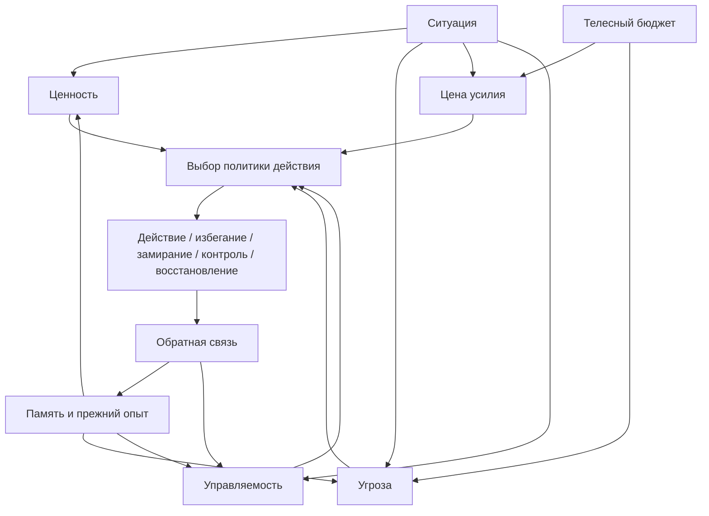
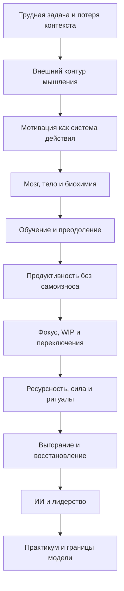
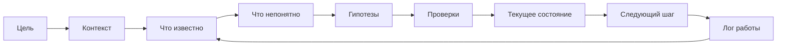
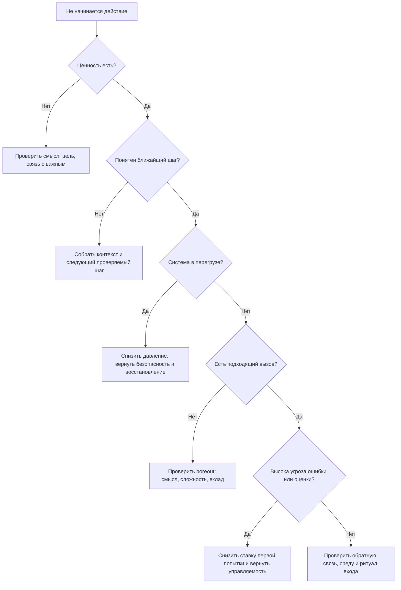
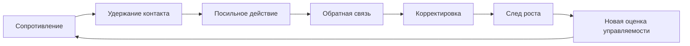
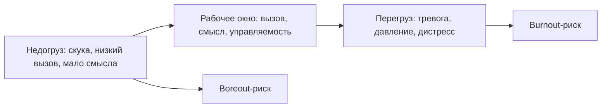
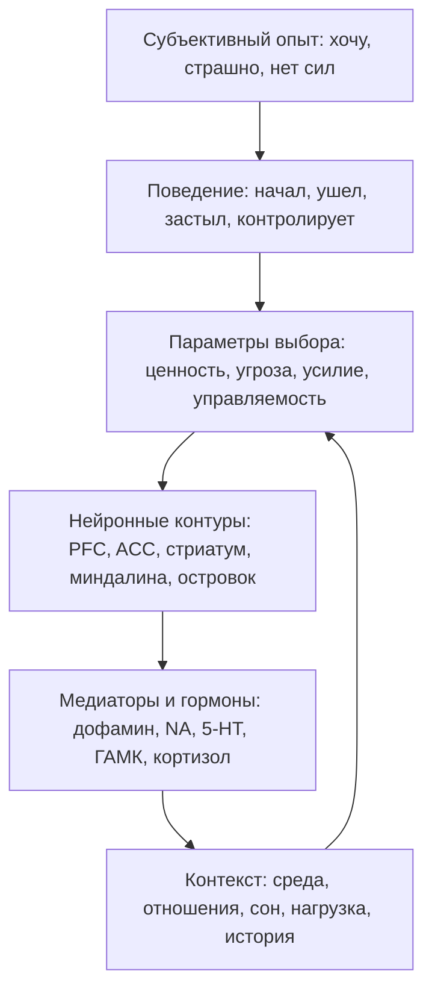
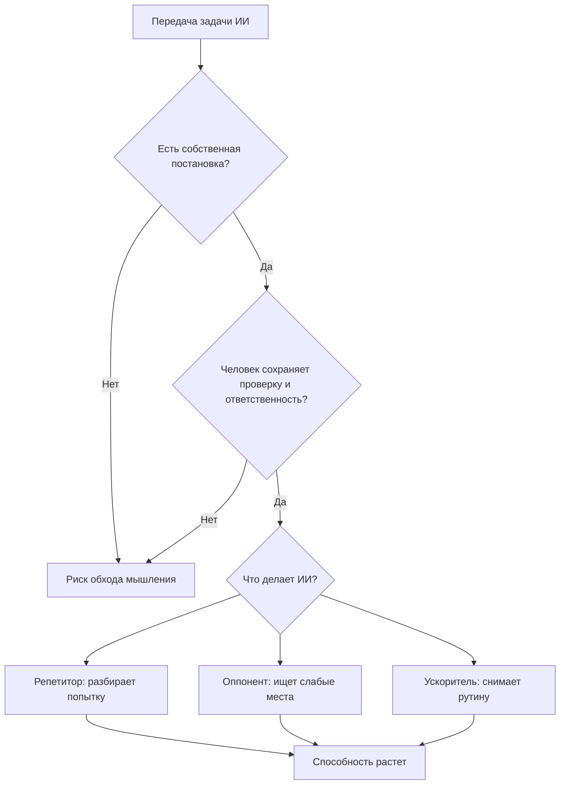

# Визуальная система учебника

## Назначение

Учебник "Когнитивное инженерство" должен постоянно сопровождаться хорошими иллюстрациями и диаграммами. Визуальный слой здесь не декоративный. Он нужен, чтобы читатель видел структуру сложной темы: уровни, циклы, причинные связи, развилки диагностики, последовательность практик и границы модели.

Если схема не помогает понять, принять решение, удержать структуру или увидеть связь между частями, ее не нужно добавлять.

## Принципы визуального слоя

1. Схема объясняет одну мысль, а не пытается вместить всю книгу.
2. Визуальная опора появляется до того, как читатель теряет структуру.
3. Одинаковые понятия изображаются одинаково во всем учебнике.
4. Таблицы используются для различений, диаграммы потоков — для процессов, карты — для отношений, диагностические деревья — для выбора действия.
5. Сложная научная схема должна иметь простую подпись: что смотреть, что важно, где граница применимости.
6. Нельзя добавлять "красивую сложность" ради ощущения глубины.

## Типы визуальных материалов

| Тип | Для чего нужен | Где применять |
| --- | --- | --- |
| Сквозная модель | Показывает центральную систему учебника. | В начале книги и при переходах между частями. |
| Диаграмма потока | Показывает последовательность: вход, оценка, действие, обратная связь. | Мотивация, рабочий журнал, преодоление, восстановление. |
| Диагностическая развилка | Помогает выбрать интерпретацию или следующий шаг. | Прокрастинация, выгорание, потеря мотивации, ИИ-режимы. |
| Матрица различений | Разводит похожие понятия. | Усталость/выгорание/депрессия, ценность/управляемость, burnout/boreout. |
| Карта понятий | Показывает зависимости между терминами. | В начале частей и сложных глав. |
| Схема уровней | Разводит субъективный опыт, параметры выбора, нейронные контуры и биохимию. | Нейрофизиология и границы доказательности. |
| Кейсовая карта | Применяет модель к реальной ситуации. | Практикум, лидерство, работа с ИИ. |
| Мини-шпаргалка | Помогает повторить главу. | В конце глав и частей. |

## Сквозные схемы учебника

### 1. Центральная модель действия

Назначение: показывать, что действие рождается не из одной мотивации, а из конфигурации ценности, угрозы, усилия, управляемости, тела, памяти и обратной связи.

Где использовать: главы 3, 7, 10, 11, 19, 23, 31.



### 2. Лестница учебника

Назначение: показывать маршрут читателя от бытовой проблемы к полной модели.

Где использовать: вступление, навигация по учебнику, глава 36.



### 3. Рабочий журнал задачи

Назначение: показывать, что журнал хранит состояние вычисления, а не просто список дел.

Где использовать: главы 4-6, 31-32.



### 4. Развилка "нет мотивации"

Назначение: не дать смешать распад прогноза, перегруз, недогруз, страх, усталость и отсутствие ценности.

Где использовать: главы 7, 18, 23-25, 29.



### 5. Цикл преодоления

Назначение: показать, что преодоление — это обучение управляемости, а не страдание.

Где использовать: главы 10, 19, 26-27.



### 6. Окно полезной нагрузки

Назначение: показать, почему продуктивность падает и при перегрузе, и при недогрузе.

Где использовать: главы 15, 23-25, 30.



### 7. Уровни объяснения

Назначение: удерживать дисциплину между переживанием, поведением, параметрами, контурами и биохимией.

Где использовать: главы 12-14, 34-35.



### 8. ИИ: усиление или обход

Назначение: помочь читателю выбрать режим работы с ИИ.

Где использовать: главы 26-27.



## Минимальная визуальная норма по главам

| Главы | Обязательная визуальная опора |
| --- | --- |
| 1-3 | Лестница учебника, центральная модель человека как системы. |
| 4-6 | Схема рабочего журнала, пример заполненного журнала, ритуал входа/выхода. |
| 7-11 | Центральная модель действия, развилка мотивации, матрица ценность/угроза/управляемость. |
| 12-15 | Схема уровней объяснения, карта контуров мозга, таблица нейромедиаторов без мифов, окно полезной нагрузки. |
| 16-19 | Схема чанка, цикл обучения, цикл преодоления, карта прокрастинации. |
| 20-22 | Схема рабочего потока, WIP-карта, таблица ритуалов и ресурсов. |
| 23-25 | Стадии выгорания, burnout/boreout матрица, протокол восстановления. |
| 26-27 | Развилка ИИ: усиление или обход, схема ответственности. |
| 28-30 | Карта лидерской среды, мотивационный интерфейс задачи, командная WIP-схема. |
| 31-36 | Диагностическая карта, кейсовые карты, маршруты чтения учебника. |

## Требования к каждой визуальной опоре

У каждой схемы должны быть:

- название;
- место в главе;
- вопрос, на который она отвечает;
- короткое объяснение после схемы;
- связь с текстом: схема должна быть разобрана, а не просто вставлена;
- проверка на самостоятельность: читатель должен понять основную мысль схемы без перечитывания всей главы.

## Что не подходит

Нельзя использовать:

- схемы ради красоты;
- однотипные "mindmap" на каждую тему без учебной функции;
- картинки, которые повторяют текст, но не добавляют структуры;
- диаграммы с десятью стрелками без объяснения главного маршрута;
- псевдонаучные изображения мозга, которые создают ложную точность;
- визуальные метафоры вместо объяснения механизма.

## Следующий шаг

Реестр визуальных материалов создан в [[06-Реестр-визуальных-материалов]].

Теперь следующий шаг — не проверка наличия схем, а визуальная редактура качества:

```text
глава -> главная схема -> вопрос читателя -> объяснение после схемы -> риск ложной точности -> статус
```

Этот реестр должен стать gate перед переводом глав из `ready-for-review` в `done`: если глава сложная и ее визуальная опора не помогает понять механизм, выбрать действие или удержать различение, глава получает визуальный хвост `needs-visual-quality-pass`.
