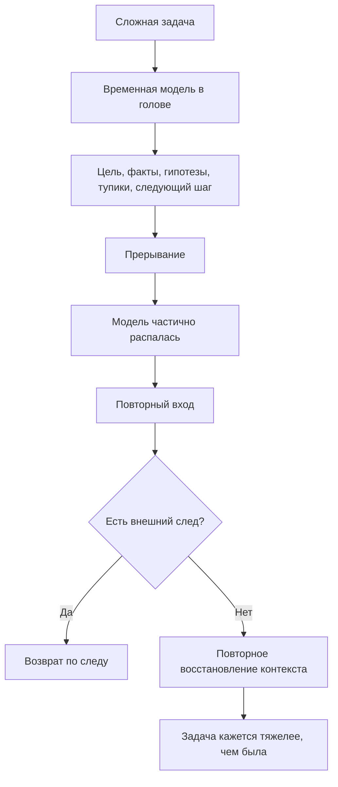

# Глава 1. Проблема: человек теряет не только время, но и состояние мысли

## Зачем начинается именно отсюда

Сложная интеллектуальная работа часто ломается не там, где ее принято ругать.

Не в календаре. Не в отсутствии красивой системы задач. Не всегда в лени, слабой дисциплине или плохой мотивации.

Иногда человек открывает задачу и видит перед собой не задачу, а остатки задачи: тикет, файл, заметку, несколько ссылок, фрагмент переписки, логи, старое ощущение "я уже почти понял". Но самого понимания под рукой нет. Вчера или на прошлой неделе внутри была собранная рабочая модель: что происходит, какие варианты уже проверены, где слабое место, что нужно сделать следующим. Сегодня эта модель распалась.

В такой момент теряется не только время. Теряется состояние мысли.

Сначала нужно назвать сам сбой. Иначе легко выбрать неправильное средство: давить на дисциплину, заводить еще один список дел, искать мотивацию, хотя реальная проблема в том, что рабочая модель задачи не пережила прерывание.

## Узнаваемая сцена

Представим обычную ситуацию.

Есть задача с неопределенностью. Например, сервис иногда создает запись в одной системе, но не создает связанный объект во второй. Ошибка не воспроизводится каждый раз. Нужно понять, где теряется состояние: событие не доходит, внешний вызов падает, таймаут обрабатывается неверно, повторная обработка не работает или состояние меняется в неправильном порядке.

В первый день работа идет тяжело, но продвигается. Ты находишь несколько логов, смотришь один успешный и один неуспешный сценарий, формулируешь гипотезу, исключаешь один тупик, почти доходишь до следующей проверки.

Потом начинается обычная жизнь сложной работы:

- встреча;
- ревью;
- срочный вопрос;
- другая задача;
- конец дня;
- выходные;
- перерыв на сон;
- несколько часов в другом контексте.

Через некоторое время ты возвращаешься. Открываешь тот же тикет, тот же код, те же логи. Формально все на месте. Но внутри уже нет собранной картины.

Остались обрывки:

- "там был какой-то timeout";
- "кажется, событие не терялось";
- "я смотрел correlation_id, но какой именно?";
- "кажется, следующий шаг был в обработке ошибки";
- "почему я решил не смотреть тот вариант?";
- "с чего теперь начать?"

Первые полчаса или час уходят не на новое продвижение, а на восстановление прежнего состояния. Внешне это может выглядеть как раскачка, прокрастинация или медленный старт. По сути это другая работа: повторная сборка контекста.

## Что именно теряется

У сложной задачи есть внешнее существование: тикет, файлы, документы, сообщения, логи, тесты. Но во время работы у нее появляется и внутреннее состояние: временная модель в голове человека.

Эта модель содержит не только "что надо сделать". Она содержит:

- зачем задача существует;
- что уже известно;
- какие факты подтверждены;
- какие места остаются туманными;
- какие гипотезы кажутся сильными;
- какие варианты уже проверены и отброшены;
- какие ограничения нельзя нарушить;
- где остановилась мысль;
- какой следующий шаг был выбран.

Пока человек работает, все это кажется доступным. Но доступность не равна надежному хранению. Временная модель держится на внимании, рабочей памяти, свежих следах и связи между фрагментами. После прерывания часть этой связности распадается.

Поэтому человек может помнить отдельные детали и все равно потерять состояние задачи. Он помнит слова, но не ход рассуждения. Помнит файл, но не причину, почему пришел именно туда. Помнит гипотезу, но не ее силу. Помнит, что что-то уже проверял, но не помнит результат проверки.

Это важное различение:

```text
память о фрагментах задачи != сохраненное состояние задачи
```

Сохраненное состояние задачи — это не набор случайных следов. Это связная рабочая картина, по которой можно продолжить действие.

## Потеря времени, мотивации и контекста — разные вещи

Когда работа не начинается, легко сказать: "я потерял время". Это иногда правда, но слишком грубо. Под одним ощущением могут лежать разные сбои.

| Что кажется | Что может происходить | Какой тип ответа нужен |
| --- | --- | --- |
| "Я теряю время" | Время уходит на восстановление контекста, а не на новое действие. | Сохранять состояние задачи между подходами. |
| "У меня нет мотивации" | Ценность есть, но вход слишком дорогой или угрожающий. | Снизить цену входа, сделать первый шаг управляемым. |
| "Я не знаю, что делать" | Следующее действие не выделено из тумана. | Сформулировать первый проверяемый шаг. |
| "Я опять ничего не понимаю" | Распалась рабочая модель задачи. | Восстановить или заранее сохранить контекст. |
| "Я туплю" | Рабочая память перегружена разрозненными фрагментами. | Вынести структуру наружу и собрать ее на внешней опоре. |

Эти состояния могут сочетаться. Потеря контекста может снижать мотивацию: задача начинает казаться тяжелее, чем она была. Низкая мотивация может мешать восстанавливать контекст. Усталость может усиливать оба эффекта.

Но для учебника важно не смешивать все в одно слово. Если человек потерял именно состояние задачи, дополнительная самокритика не помогает. Полезна конструкция, которая помогает снижать вероятность этой потери.

## Почему списка дел часто недостаточно

Список дел хорошо работает, когда действие понятно и не требует большой модели.

```text
- отправить письмо
- оплатить счет
- обновить зависимость
- назначить встречу
```

Для таких задач полезно просто не забыть действие.

Но туманная задача устроена иначе. Запись вида:

```text
- разобраться с интеграцией
```

сохраняет только верхнюю оболочку. Она не отвечает на вопросы:

- почему интеграция сломалась;
- что уже проверено;
- какая гипотеза сейчас главная;
- какой сценарий был успешным;
- какой сценарий был неуспешным;
- где лежат нужные логи;
- что уже точно не причина;
- какой шаг безопасно сделать первым.

Для сложной задачи нужен не только список действий. Нужен снимок состояния понимания.

Сравним две записи.

Первая:

```text
Разобраться с промежуточным состоянием объекта.
```

Вторая:

```text
Цель: понять, почему объект иногда остается в промежуточном состоянии.
Факты: событие приходит, запись в базе создается, объект во второй системе иногда не создается.
Проверено: событие не теряется до обработчика.
Текущая гипотеза: timeout внешнего вызова обрабатывается после изменения состояния.
Следующий шаг: открыть код перехода состояния и проверить ветку обработки timeout.
```

Обе записи относятся к одной задаче. Но только вторая возвращает человека в ход работы. Она не просто напоминает, что задача существует. Она восстанавливает рабочую позицию.

## Временная модель задачи

Чтобы точнее говорить о проблеме, введем термин.

**Временная модель задачи** — это собранное на время работы представление о том, что происходит в задаче, что уже известно, что неизвестно, какие объяснения проверяются и какой шаг имеет смысл сделать дальше.

Она временная по двум причинам.

Во-первых, она нужна для текущего действия. Человек собирает ее, чтобы прямо сейчас думать, проверять, сравнивать, принимать решение.

Во-вторых, она не гарантированно сохраняется сама. Часть модели может перейти в долговременное знание, если задача повторяется, хорошо осмыслена или закреплена. Но большая часть конкретного рабочего состояния держится слабо: на свежих связях, открытых файлах, последних командах, ощущении направления.

Поэтому после прерывания человек часто не начинает с нуля, но и не продолжает с прежней точки. Он оказывается в промежуточном состоянии: что-то знакомо, но связность потеряна.

Именно это состояние неприятно. Оно создает ощущение, что задача стала вязкой. Не потому, что в ней обязательно стало больше работы, а потому, что вход снова требует сборки модели.

## Как распадается состояние задачи

Схема ниже показывает не устройство мозга, а рабочий механизм потери контекста.



Читать схему нужно слева направо.

Пока человек работает, задача живет не только во внешних артефактах, но и во временной модели. В этой модели связаны цель, факты, гипотезы, проверенные тупики и следующий шаг.

Прерывание не обязано уничтожать все. Человек может помнить название задачи, часть деталей и общее ощущение. Но связность модели ослабевает. При повторном входе нужно либо восстановить ее по внешнему следу, либо собирать заново из обрывков.

Если внешнего следа нет, восстановление контекста конкурирует с самой задачей. Человек тратит силы на вход еще до того, как сделал новый шаг. Отсюда возникает знакомое ощущение: "задача какая-то тяжелая". Иногда тяжелой стала не задача, а цена возвращения к ней.

## Почему восстановление контекста — настоящая работа

Восстановление контекста может не выглядеть как работа, потому что результат не всегда виден снаружи. Код не изменился. Документ не вырос. Тикет не сдвинулся по статусу. Но внутри человек делает много операций:

- ищет прежние источники;
- вспоминает, почему выбрал один путь и отбросил другой;
- заново сопоставляет факты;
- проверяет, не изменились ли условия;
- восстанавливает причинную цепочку;
- пытается понять, какой шаг безопасен.

Это когнитивная работа. Она может быть необходимой. Проблема не в том, что она существует, а в том, что она часто повторяется без пользы.

Если каждый возврат к задаче требует заново проходить один и тот же путь, система работы теряет энергию на повторную сборку. Это похоже на разработку без сохранения промежуточного состояния: каждый запуск начинается с восстановления окружения руками.

В инженерной работе такие потери стараются не героически терпеть, а снижать конструкцией. Если сборка окружения каждый день занимает час, ее автоматизируют. Если расследование каждый раз начинается с поиска одних и тех же логов, оставляют команды и ссылки. Если состояние задачи распадается после прерывания, оставляют внешний след.

## Внешний след

**Внешний след** — это запись, схема, журнал или другой артефакт, который сохраняет часть состояния задачи вне головы.

Он не обязан быть длинным. На раннем этапе достаточно нескольких строк:

```text
Что сделал:
Что узнал:
Что исключил:
Где остановился:
Что дальше:
```

Ценность внешнего следа в том, что он обращен к будущему входу. Он пишется не для архива, не для красивой базы знаний и не для отчета. Он нужен человеку, который вернется позже и захочет быстро понять, где продолжать.

Хороший внешний след отвечает на вопрос:

```text
Что мне нужно знать, чтобы продолжить без повторного расследования?
```

Плохой внешний след отвечает только на вопрос:

```text
Как называлась задача?
```

Или превращается в другую крайность: длинную запись, которую трудно перечитать и поддерживать. Полезно, чтобы внешний след был достаточно полным для продолжения и достаточно коротким, чтобы его реально оставлять.

## Мини-словарь главы

| Понятие | Рабочее определение |
| --- | --- |
| Состояние мысли | Связная рабочая картина, которая позволяет продолжать рассуждение, а не просто помнить отдельные слова и факты. |
| Состояние задачи | То, что сейчас понятно о задаче: цель, факты, туман, гипотезы, ограничения, проверенные пути и следующий шаг. |
| Временная модель задачи | Собранное на время работы представление о том, что происходит и что имеет смысл делать дальше. |
| Потеря контекста | Распад связности между элементами задачи после прерывания или переключения. |
| Внешний след | Запись, схема или другой артефакт, который сохраняет часть состояния задачи вне головы. |
| Повторный вход | Возврат к задаче после перерыва, переключения или прерывания. |

Эти определения пока рабочие. В следующих главах они будут уточняться: глава 2 объяснит общий подход, глава 3 покажет минимальную модель человека как системы, а главы 4-6 превратят внешний след в контекст задачи, рабочий журнал и ритуалы входа-выхода.

## Инженерный взгляд на сбой

Теперь можно сделать первый шаг к теме учебника.

Если человек регулярно теряет состояние сложных задач, это не стоит объяснять только характером. Перед нами повторяющийся сбой системы работы.

Инженерный вопрос звучит так:

```text
При каких условиях состояние задачи распадается, что именно не сохраняется и какой внешний интерфейс поможет вернуться к работе дешевле?
```

Такой вопрос меняет тон разговора.

Вместо:

```text
Почему я опять не могу собраться?
```

появляется:

```text
Какая часть задачи осталась только в голове и не пережила прерывание?
```

Вместо:

```text
Надо быть дисциплинированнее.
```

появляется:

```text
Нужно оставить будущему себе цель, факты, гипотезу и следующий шаг.
```

Это не отменяет дисциплину. Но дисциплина становится не героическим давлением на себя, а частью конструкции: открыть журнал, прочитать состояние, выбрать первый проверяемый шаг, после блока оставить контрольную точку.

## Где проходит граница

Здесь нужна точная граница.

Внешний след не решает все проблемы продуктивности. Он не заменяет сон, восстановление, здоровье, нормальные приоритеты, ясные полномочия, обучение и поддержку среды. Если человек истощен, заметка не обязана превращать истощение в рабочий ресурс. Если задача бессмысленна, запись не сделает ее ценной. Если среда постоянно разрывает внимание, личный журнал поможет не всё.

Потеря контекста — только один класс сбоев. В следующих частях учебника появятся другие:

- действие может не запускаться из-за низкой управляемости;
- задача может быть слишком угрожающей;
- цена усилия может быть слишком высокой;
- тело может находиться в перегрузе;
- система обратной связи может не показывать прогресс;
- команда может разрушать фокус прерываниями;
- восстановление может быть недостаточным.

Но начинать полезно именно с потери состояния задачи. Это самый близкий и прикладной вход: его можно увидеть уже сегодня, без специальных знаний.

## Мини-практика

В ближайшей туманной задаче не нужно сразу строить сложную систему. Достаточно один раз оставить внешний след после рабочего блока.

Форма:

```markdown
## Точка продолжения

- Что сделал:
- Что узнал:
- Что исключил:
- Где остановился:
- Что открыть или проверить первым:
```

Если сил мало, оставить две строки:

```text
Где остановился:
Что сделать первым:
```

Это не идеальная система. Но даже такой след может менять будущий вход. Через несколько часов или на следующий день человек возвращается не к пустому ощущению "надо снова разобраться", а к точке продолжения.

## Короткое резюме

1. В сложной задаче теряется не только время. Может теряться состояние мысли.
2. Состояние задачи — это связная рабочая модель: цель, факты, туман, гипотезы, тупики и следующий шаг.
3. Список дел часто хранит действие, но не хранит ход понимания.
4. Восстановление контекста — настоящая когнитивная работа, но ее повторение можно снижать.
5. Первый инженерный ответ — внешний след, который помогает будущему входу.
6. Метод не заменяет отдых, здоровье, приоритеты и хорошую среду. Он помогает с конкретной проблемой: сохранением состояния задачи между подходами.

## Вопросы для самопроверки

Ответьте коротко, без красивых формулировок.

1. В какой вашей недавней задаче повторный вход был дороже самой первой проверки?
2. Что именно вы потеряли при возврате: цель, факты, гипотезу, проверенный тупик, следующий шаг или ощущение управляемости?
3. Какая запись помогла бы вам вернуться быстрее?
4. Как отличить в этой задаче потерю контекста от усталости, отсутствия смысла или плохого приоритета?

Если на эти вопросы трудно ответить, это не провал. Это признак, что состояние задачи раньше оставалось слишком внутренним. В следующих главах мы будем учиться выносить его наружу.

## Источниковая опора

Проверенный пакет для этой главы: [[../Источники/2026-05-25 Пакет источников для главы 1]].

Ключевые источники в авторско-годовой форме: Baddeley (2012); Altmann & Trafton (2002); Trafton et al. (2003); Trafton & Monk (2008); Parnin & DeLine (2010); Parnin & Rugaber (2011); Risko & Gilbert (2016).

Доказательная роль блока: `strong` для общего утверждения, что рабочая память ограничена, прерывание требует восстановления состояния цели, а внешние сигналы и записи могут снижать цену повторного входа. Глава не делает более сильного вывода: внешний след помогает сохранять состояние задачи, но не обещает решить усталость, мотивацию, приоритеты или выгорание.

Полные библиографические записи и DOI сохранены в пакете главы. В текущей редакции здесь остается короткий источниковый блок, чтобы входная глава не начиналась с библиографической перегрузки.

## Переход к следующей главе

Первый тип сбоя теперь назван: состояние задачи распадается, и человек вынужден заново собирать контекст. Следующий шаг — назвать общий подход, который занимается такими сбоями не через самоупрек, а через проектирование условий мышления и действия.

Этот подход в учебнике называется когнитивным инженерством.

## Статус

`ready-for-review`

Следующий шаг: при финальной редактуре удержать главу как входную проблему учебника: потерю состояния мысли, а не общий разговор о продуктивности или мотивации.
