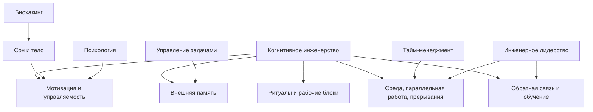

# Глава 2. Что такое когнитивное инженерство

## От проблемы к подходу

В первой главе мы начали не с теории, а с простого сбоя: человек возвращается к сложной задаче и обнаруживает, что потерял состояние мысли. Тикет остался. Файлы остались. Логи остались. Но временная модель задачи распалась: что уже проверено, какая гипотеза главная, где был тупик, какой шаг следующий.

Такой сбой можно объяснить по-разному.

Можно сказать: "надо быть дисциплинированнее". Иногда это полезно, но часто слишком грубо.

Можно сказать: "нужно лучше планировать". Иногда да, но план не всегда хранит ход понимания.

Можно сказать: "надо вести заметки". Это ближе, но тоже недостаточно. Заметки могут быть архивом, дневником, конспектом, списком дел или рабочим интерфейсом. Форма записи сама по себе не решает проблему.

Когнитивное инженерство начинается там, где мы смотрим на повторяющийся сбой как на свойство конструкции работы.

Если человек раз за разом теряет контекст, полезно спросить не только "что с человеком не так?", а:

```text
какие условия делают потерю контекста вероятной;
какая часть состояния остается только в голове;
какой внешний интерфейс поможет продолжать дешевле;
какая обратная связь покажет, что стало лучше.
```

Это и есть переход от самоупрека к проектированию.

## Рабочее определение

В этом учебнике мы будем использовать такое определение:

```text
Когнитивное инженерство — это проектирование условий, в которых мышлению, вниманию, памяти, мотивации и действию легче работать точно, устойчиво и воспроизводимо.
```

В определении важна каждая часть.

**Проектирование** означает, что мы меняем конструкцию работы, а не только пытаемся сильнее стараться. Конструкция может быть маленькой: оставить точку продолжения после рабочего блока. Может быть средней: ввести шаблон рабочего журнала. Может быть командной: ограничить объем параллельной работы, договориться о правилах прерываний, сделать обратную связь по задачам быстрее и яснее.

**Условия** — это не только внутреннее состояние человека. Условия включают среду, инструменты, формулировку задачи, порядок входа, способ выхода, ритм работы, доступность информации, отношения с людьми, уровень угрозы и восстановление.

**Мышление, внимание, память, мотивация и действие** названы вместе, потому что в реальной работе они не живут отдельно. Человек может понимать важность задачи, но не иметь доступного первого шага. Может помнить цель, но потерять гипотезу. Может хотеть результата, но воспринимать вход как слишком дорогой. Может иметь хороший план, но быть в таком перегрузе, что план не запускается.

**Точно, устойчиво и воспроизводимо** не означает идеально. Когнитивное инженерство не обещает состояние вечной ясности. Оно стремится снизить случайность: чтобы вход в сложную работу меньше зависел от настроения, свежести, удачи и героического усилия.

## Почему здесь уместно слово "инженерство"

Слово "инженерство" здесь не означает, что человека нужно превратить в машину. И не означает, что все переживания можно свести к схеме.

Инженерный взгляд полезен по другой причине: он помогает работать с повторяющимися сбоями через системы, интерфейсы, ограничения и обратную связь.

| Инженерное слово | Как оно переводится в работу с мышлением |
| --- | --- |
| Система | Есть элементы, связи, ограничения, входы, выходы и типовые сбои. |
| Интерфейс | Человек взаимодействует с задачей через заметки, тикеты, документы, файлы, людей, ритуалы и инструменты. |
| Ограничение | Внимание, рабочая память, время, тело, контекст и социальная среда не бесконечны. |
| Обратная связь | Нужно видеть, стало ли легче входить, продолжать, проверять гипотезы, завершать и восстанавливаться. |
| Конструкция | Повторяющийся результат зависит не только от усилия, но и от устройства среды и процесса. |

Рассмотрим потерю контекста из первой главы.

Если смотреть на нее как на личную слабость, решение будет звучать так: "надо собраться".

Если смотреть на нее инженерно, появляются другие вопросы:

- где именно распадается состояние задачи;
- какие элементы остаются только в голове;
- какой минимальный внешний след нужен для повторного входа;
- когда его лучше оставлять;
- как понять, что он работает;
- не стал ли сам след новой бюрократией.

Такой подход мягче к человеку и строже к конструкции. Он не снимает ответственности, но переносит внимание с самокритики на устройство работы.

## Что становится объектом проектирования

Когнитивное инженерство не ограничивается заметками. Заметки — только один из возможных интерфейсов.

Проектировать можно разные части контура.

| Объект проектирования | Главный вопрос |
| --- | --- |
| Формулировка задачи | Понятно ли, что должно измениться и зачем? |
| Контекст задачи | Где хранятся факты, туман, гипотезы, ограничения и точка продолжения? |
| Первый шаг | Есть ли действие, которое можно выполнить без попытки решить всё сразу? |
| Ритуал входа | Как человек возвращается к задаче после перерыва? |
| Ритуал выхода | Что сохраняет состояние задачи для будущего входа? |
| Среда | Помогают ли инструменты и документы думать или создают дополнительный шум? |
| Ритм работы | Есть ли место для фокуса, восстановления и проверки результата? |
| Обратная связь | Видно ли, что изменилось после действия? |
| Командные договоренности | Не разрушает ли среда фокус постоянными прерываниями, лишней параллельной работой и неясными ожиданиями? |

Эти объекты не равны по масштабу. Иногда достаточно одной строки "что дальше". Иногда нужно перестроить шаблон задачи. Иногда проблема вообще не в личном контуре, а в команде: слишком много параллельной работы, мало ясности, задачи приходят без контекста, обратная связь запаздывает.

Когнитивное инженерство полезно тем, что не заставляет заранее выбирать один уровень. Оно предлагает смотреть на весь контур: человек, задача, среда, тело, инструменты, другие люди, обратная связь.

## Это не продуктивность любой ценой

Сразу уберем опасное недоразумение.

Когнитивное инженерство не должно быть еще одним способом выжать из человека больше работы. Если подход используется только для того, чтобы сильнее давить на себя, он теряет смысл.

Цель не в том, чтобы всегда делать больше. Цель в том, чтобы делать сложную работу более управляемой:

- вход в задачу дешевле;
- туман виднее;
- первый шаг яснее;
- повторные тупики реже;
- обратная связь ближе;
- восстановление не считается слабостью;
- границы нагрузки видны раньше, чем наступает срыв.

Иногда хороший инженерный ответ — не "работать эффективнее", а "снизить давление", "уменьшить объем параллельной работы", "отложить решение до сна", "снять угрозу оценки", "попросить контекст", "не брать новую задачу до закрытия старой".

Если система помогает только ускоряться, но не помогает останавливаться, восстанавливаться и видеть перегруз, это плохая система.

## Чем когнитивное инженерство отличается от соседних практик

Когнитивное инженерство пересекается с несколькими областями. Это нормально: сложная работа не помещается в одну полку. Но пересечение не означает совпадение.

Вопрос схемы: какие элементы соседних практик нужны когнитивному инженерству, и где оно не должно растворяться в них целиком.



Эта схема не говорит, что когнитивное инженерство "лучше" соседних практик. Она показывает, что оно собирает рабочую рамку на пересечении нескольких вопросов.

Читать ее нужно от центра к границам. В центре находится не набор советов, а вопрос: как сделать действие доступнее, устойчивее и проверяемее. Внешняя память, объем параллельной работы, тело, мотивация, обратная связь и лидерская среда становятся частями этой рамки только тогда, когда помогают проектировать действие. Если они превращаются в отдельный культ метода, метрики или контроля, это уже другой разговор.

Управление задачами помогает не забывать обязательства и выделять действия. Но оно может не хранить ход исследования.

Тайм-менеджмент помогает распределять время. Но он может не объяснять, почему выделенный час уходит на повторное восстановление контекста.

Биохакинг напоминает, что сон, тело, нагрузка и восстановление влияют на доступность действия. Но он легко становится редукцией поведения к метрикам, добавкам или режиму.

Психология помогает говорить о смысле, эмоциях, страхе, избегании, идентичности и отношениях. Но когнитивное инженерство не должно притворяться психотерапией.

Инженерное лидерство работает с командной средой: параллельной работой, прерываниями, ясностью задач, безопасностью, обратной связью. Но личная когнитивная система не исчезает внутри командной.

Когнитивное инженерство задает свой вопрос:

```text
какая конструкция помогает человеку или группе лучше мыслить, действовать, учиться и восстанавливаться в конкретных условиях?
```

## Один пример в разных рамках

Возьмем тот же пример: человек не возвращается к расследованию интеграции после перерыва.

Разные подходы увидят разные стороны.

| Рамка | Какой вопрос она задаст |
| --- | --- |
| Тайм-менеджмент | Было ли выделено время на задачу? |
| Управление задачами | Есть ли следующее действие? |
| Психология | Что человек переживает при входе и чего избегает? |
| Биологический слой | Есть ли сон, восстановление, перегруз, телесное напряжение? |
| Инженерное лидерство | Не разрывает ли командная среда фокус постоянными прерываниями и избытком параллельной работы? |
| Когнитивное инженерство | Какая конструкция хранения контекста, входа и выхода может сделать возврат дешевле? |

Все эти вопросы могут быть полезны. Ошибка начинается, когда один вопрос выдают за все объяснение.

Если проблема в усталости, один рабочий журнал не спасет. Если проблема в отсутствии следующего шага, календарь не поможет. Если проблема в токсичной среде, индивидуальная система заметок будет только частичной компенсацией. Если проблема в распаде контекста, мотивационная речь не восстановит проверенные гипотезы.

Поэтому когнитивное инженерство не ищет одну магическую причину. Оно учится различать, какая часть контура сейчас ломается.

## Базовый цикл работы

В упрощенном виде когнитивно-инженерный подход можно описать так:

```text
сбой -> условия сбоя -> перегруженный элемент -> изменение конструкции -> обратная связь
```

Раскроем на примере.

**Сбой:** после перерыва сложно вернуться к задаче.

**Условия сбоя:** задача туманная, много гипотез, работа часто прерывается, состояние хранится в голове.

**Перегруженный элемент:** рабочая память и внимание вынуждены заново собирать модель.

**Изменение конструкции:** после каждого блока оставлять внешний след: что сделал, что узнал, что исключил, где остановился, что дальше.

**Обратная связь:** повторный вход стал короче; меньше повторных проверок; проще объяснить, куда ушло время; меньше неприятного ощущения "я опять ничего не понимаю".

Этот цикл будет возвращаться во всем учебнике. Позже мы применим его к мотивации, прокрастинации, обучению, восстановлению, работе с ИИ и лидерству. Логика останется похожей: не ругать симптом, а разбирать контур.

## Границы подхода

Когнитивное инженерство в этом учебнике — практическая интегративная рамка. Она полезна, пока помогает точнее видеть условия работы и проектировать более здоровый контур действия.

Но у нее есть границы.

Она не является медицинским протоколом. Если речь идет о диагнозах, лекарствах, стойком страдании, резком ухудшении состояния, риске для жизни или здоровья, нужен специалист.

Она не заменяет психотерапию. Иногда проблема лежит глубже, чем рабочий контур: травматический опыт, хроническая тревога, депрессия, тяжелые отношения, устойчивые паттерны самонаказания. Инженерная рамка может помогать описывать среду, но не должна притворяться лечением.

Она не заменяет организационные решения. Если команда живет в постоянном пожаре, с неясными приоритетами и бесконечными прерываниями, личные практики помогут только частично. Иногда нужно менять правила работы, а не только личный журнал.

Она не отменяет отдых. Если ресурс исчерпан, проектирование условий не должно становиться способом продолжать износ.

И она не является полной теорией мозга. В учебнике будут нейрофизиология, медиаторы, гормоны и контуры действия, но они нужны для более точной практической модели, а не для псевдонаучного объяснения всего через одно слово.

## Мини-практика

Возьмите один повторяющийся сбой в своей работе. Не самый драматичный, а достаточно частый.

Запишите его по пяти строкам:

```markdown
## Сбой
Что регулярно идет не так?

## Условия
Когда это чаще всего происходит?

## Что перегружено
Память, внимание, тело, среда, мотивация, обратная связь, коммуникация?

## Изменение конструкции
Что можно изменить в задаче, среде, ритуале, записи или договоренности?

## Обратная связь
Как я пойму, что стало лучше?
```

Не нужно сразу строить большую систему. Достаточно увидеть один сбой как элемент конструкции. Это уже смена режима мышления.

## Мини-словарь главы

| Понятие | Рабочее определение |
| --- | --- |
| Когнитивное инженерство | Проектирование условий, в которых мышлению, вниманию, памяти, мотивации и действию легче работать точно, устойчиво и воспроизводимо. |
| Условия работы | Среда, инструменты, формулировка задачи, ритм, тело, отношения, обратная связь и правила входа-выхода. |
| Когнитивный интерфейс | Способ, через который человек взаимодействует с задачей: журнал, схема, тикет, шаблон, список вопросов, ритуал. |
| Конструкция работы | Устройство процесса, которое делает одни действия легкими, а другие дорогими или хрупкими. |
| Обратная связь | Сигнал, по которому видно, стало ли понятнее, легче, устойчивее или безопаснее действовать. |
| Граница модели | Место, где когнитивное инженерство перестает быть достаточным и нужны медицина, психотерапия, организационное решение или отдых. |

## Вопросы для самопроверки

1. Почему когнитивное инженерство не сводится к ведению заметок?
2. Чем инженерный вопрос отличается от самоупрека?
3. Какой повторяющийся сбой в вашей работе можно описать через цикл "сбой -> условия -> перегруженный элемент -> изменение конструкции -> обратная связь"?
4. Где в вашем случае может быть граница подхода: здоровье, организация, приоритеты, отношения, недостаток навыка?

## Короткое резюме

1. Когнитивное инженерство начинается с повторяющихся сбоев мышления и действия.
2. Его задача — проектировать условия, а не требовать от человека бесконечного усилия.
3. Объектом проектирования может быть задача, среда, ритуал, журнал, обратная связь, нагрузка или командная договоренность.
4. Подход пересекается с тайм-менеджментом, управлением задачами, психологией, биологическим слоем и лидерством, но не совпадает с ними.
5. Хорошая система помогает не только ускоряться, но и останавливаться, восстанавливаться, видеть границы и снижать повторные потери.
6. У метода есть границы: он не заменяет медицину, психотерапию, организационные изменения и отдых.

## Источниковая опора

Проверенный пакет для этой главы: [[../Источники/2026-05-25 Пакет источников для главы 2]].

Ключевые источники в авторско-годовой форме: Hutchins (1995); Norman (1991, 1993); Scaife & Rogers (1996); Risko & Gilbert (2016); Diamond (2013); Badre (2025); Michie et al. (2011, 2013); Hagger et al. (2020); Hertwig & Grüne-Yanoff (2017).

Доказательная роль блока: фундаментальная теория и обзоры задают язык распределенной когниции, когнитивных артефактов, внешней когниции, когнитивной выгрузки, исполнительных функций и когнитивного контроля. Слой изменения поведения и усиления агентности используется как контекстуальная рамка, а не как главное основание определения: он помогает отличить когнитивное инженерство от подталкивания и набора отдельных техник поведения.

Глава не утверждает, что когнитивное инженерство уже является устоявшейся академической дисциплиной с единым каноном. В учебнике это рабочая интегративная рамка: проектирование условий мышления, понимания, выбора, действия и восстановления.

## Переход к следующей главе

Теперь у нас есть рабочее определение подхода. Но чтобы проектировать условия мышления, нужно понимать хотя бы минимально, какая система работает внутри этих условий.

Дальше нужна базовая модель человека как работающей системы: внимание, рабочая память, долговременная память, тело, среда, действие и обратная связь.

## Статус

`ready-for-review`

Следующий шаг: при финальной редактуре проверить, что рабочее определение остается достаточно строгим для всего учебника и достаточно простым для первого чтения.
