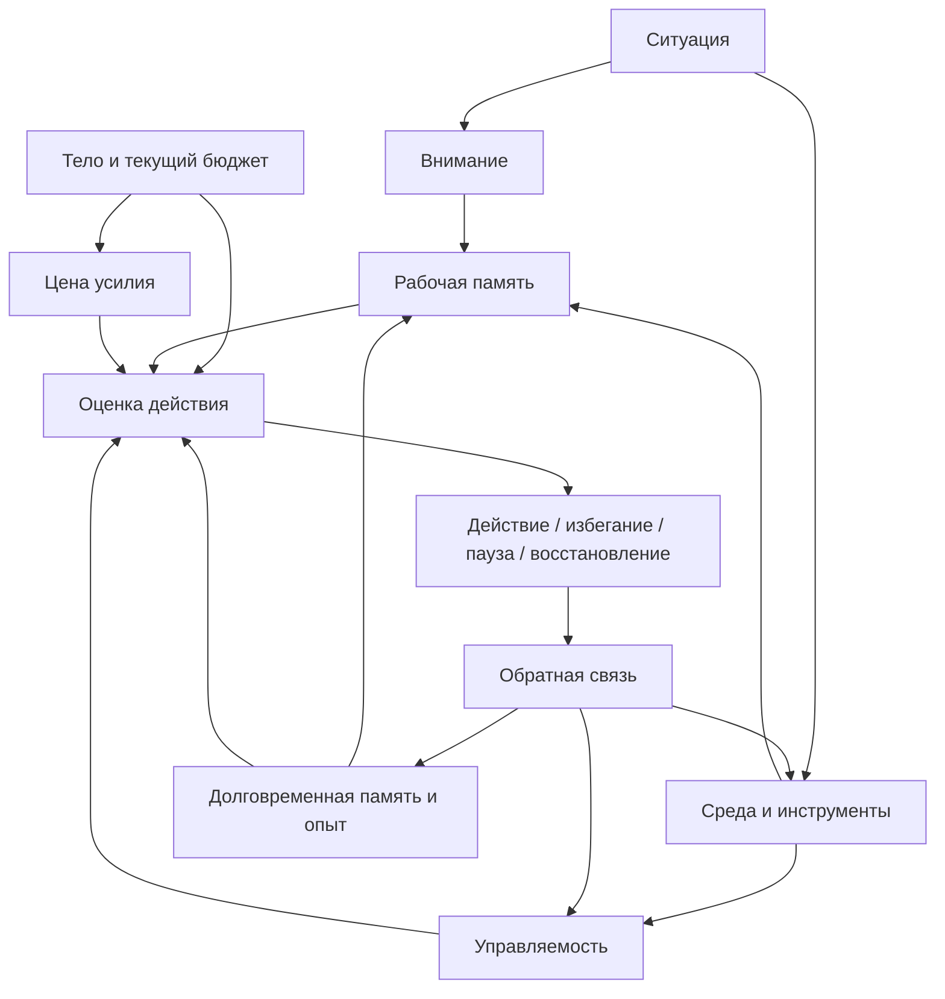
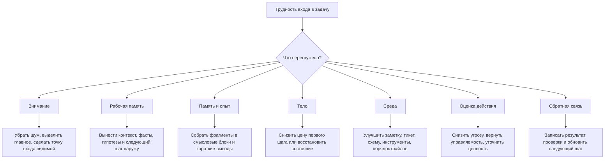

# Глава 3. Минимальная модель человека как работающей системы

## Зачем нужна эта глава

В первой главе мы назвали проблему: человек может потерять не только время, но и состояние мысли. Во второй главе мы ввели подход: когнитивное инженерство проектирует условия, в которых мышлению, вниманию, памяти, мотивации и действию легче работать точно, устойчиво и воспроизводимо.

Теперь нужен следующий шаг. Если мы собираемся проектировать условия, надо понимать, какую систему эти условия поддерживают.

Не в полном научном смысле. Эта глава не будет анатомическим атласом мозга, обзором нейромедиаторов или теорией личности. Такой уровень появится позже, когда для него уже будет место. Сейчас нужна минимальная рабочая модель: достаточно простая, чтобы ей можно было пользоваться, и достаточно точная, чтобы не строить учебник на бытовых мифах.

Эта модель отвечает на один вопрос:

```text
что участвует в сложной работе, кроме желания "сделать задачу"?
```

Короткий ответ такой:

```text
внимание, рабочая память, долговременная память, тело, среда, оценка действия и обратная связь
```

Человек не просто видит задачу и начинает действовать. Он входит в состояние, выбирает, что важно, удерживает часть контекста, достает следы из опыта, ощущает цену действия телом, опирается на инструменты и людей, оценивает ценность, угрозу и управляемость, делает шаг или уходит от него, получает обратную связь и обновляет будущий прогноз.

Если один элемент этой системы перегружен, поведение может меняться. Поэтому когнитивное инженерство не должно начинаться с лозунга "надо лучше стараться". Оно начинается с более точного вопроса:

```text
какая часть системы сейчас несет слишком большую нагрузку?
```

## Человек как система, а не как кнопка

В бытовом языке действие часто объясняют слишком коротко:

```text
захотел -> сделал
не захотел -> не сделал
```

Для простых ситуаций этого иногда достаточно. Если человек хочет пить и рядом стоит стакан воды, путь от желания к действию короткий. Но сложная интеллектуальная работа устроена иначе.

Допустим, нужно вернуться к задаче после выходных. Тикет открыт. Файлы есть. Переписка сохранилась. Формально ничего не исчезло. Но внутри нет прежней собранной картины.

В этот момент человек не просто "не хочет работать". В системе может происходить сразу несколько вещей:

- внимание цепляется за неприятное ощущение тумана;
- рабочая память не удерживает старую гипотезу;
- долговременная память отдает отдельные фрагменты, но не всю структуру;
- тело добавляет усталость, напряжение или тревогу;
- среда не дает хорошей точки продолжения;
- действие кажется дорогим и плохо управляемым;
- обратная связь от прошлых попыток не собрана в понятный след.

Снаружи все это может выглядеть одинаково: человек медлит, переключается, открывает лишние вкладки, перечитывает старое, делает видимую активность без продвижения.

Но внутри это не один сбой. Это конфигурация системы.

Этот взгляд станет опорным для всей книги. Мы не будем объяснять поведение одной причиной там, где работает несколько слоев, и не будем добавлять научные слова ради глубины. Модель нужна не для красоты, а для выбора более точных вмешательств.

## Центральная схема главы

Схема ниже показывает минимальную рабочую модель человека в сложной задаче.



Эту схему нужно читать осторожно.

Она не говорит, что в голове есть отдельные коробочки с такими названиями. Она не заменяет нейронауку. Это рабочая карта для учебника. Ее задача: показать, что ситуация не идет прямо в действие. Между ними есть внимание, память, тело, среда, оценка и обратная связь.

Главная мысль схемы:

```text
действие возникает из состояния системы, а не из одного желания
```

Поэтому вмешиваться можно в разных местах:

- уменьшить шум для внимания;
- разгрузить рабочую память;
- собрать фрагменты опыта в понятные блоки;
- снизить телесную цену входа;
- изменить среду и инструменты;
- сделать первый шаг более управляемым;
- ускорить и прояснить обратную связь.

Теперь разберем элементы модели по одному.

## Внимание: ограниченный выбор значимого

Внимание часто представляют как прожектор: куда направил, там и видно. В этой метафоре есть польза, но есть и ловушка. Она создает впечатление, будто внимание можно просто приказом повернуть куда нужно.

В сложной работе внимание не только освещает объект. Оно выбирает, что считать значимым прямо сейчас, и удерживает это среди конкурентов.

Конкурентов много:

- новые сообщения;
- тревожная мысль;
- старый незакрытый вопрос;
- шум вокруг;
- открытые вкладки;
- более легкая задача;
- неприятное чувство неясности;
- желание быстро получить маленькую награду.

Когда задача туманная, внимание часто тратится не на решение, а на вход:

```text
что это была за задача?
где я остановился?
почему я сюда пришел?
какой файл открыть?
какой кусок сейчас главный?
```

Это не лень. Это цена восстановления значимого.

Внимание ограничено. Оно не может одновременно держать всю цель, все факты, все гипотезы, все риски и все следующие шаги. Поэтому первое инженерное следствие простое:

```text
если задача сложная, не стоит заставлять внимание каждый раз заново искать ее структуру
```

Полезно сделать так, чтобы важное было видно снаружи: в названии, заметке, схеме, тикете, рабочем журнале, порядке файлов, следующем шаге.

## Рабочая память: узкое окно текущей работы

Рабочая память нужна, когда человек не просто вспоминает, а удерживает и преобразует информацию прямо сейчас.

Например:

- сравнивает две гипотезы;
- держит в голове условие и исключение;
- читает код и помнит, зачем открыл этот файл;
- собирает цепочку "событие -> обработчик -> состояние -> внешний вызов";
- удерживает вопрос, пока просматривает логи.

Рабочая память не похожа на надежный склад. Она больше похожа на маленький рабочий стол. На нем можно разложить несколько предметов, сравнить их, поменять местами, собрать решение. Но если на стол высыпать слишком много, порядок развалится.

Отсюда возникает знакомое ощущение:

```text
я вроде понимаю каждый фрагмент отдельно, но вся задача не держится
```

Это особенно заметно в задачах с несколькими уровнями:

- бизнес-цель;
- текущий симптом;
- техническая причина;
- логика кода;
- данные;
- ограничения;
- риски изменения;
- следующий безопасный шаг.

Если все это держится только в голове, рабочая память легко становится бутылочным горлышком.

Отсюда первое различение:

```text
понять фрагмент != удержать систему фрагментов
```

Человек может понимать каждый отдельный лог, каждый метод, каждую фразу в тикете и все равно терять общую картину. Проблема не в глупости. Проблема в том, что система требует больше удержания, чем доступно внутреннему рабочему окну.

Инженерный вывод:

```text
рабочую память лучше использовать для мышления, а не для хранения всего состояния задачи
```

То, что нужно удерживать долго или возвращать после перерыва, лучше вынести наружу.

## Долговременная память: следы, связи и смысловые блоки

Долговременная память тоже легко представить слишком просто. Как будто внутри есть архив, где лежит папка "задача", и при возвращении ее можно открыть целиком.

В реальности человек часто достает не полную папку, а следы:

- знакомое название;
- кусок причины;
- ощущение "этот вариант уже проверял";
- имя файла;
- место в коде;
- один важный лог;
- эмоциональный след "там было неприятно";
- общий вывод без доказательства.

Эти следы могут быть полезны, но они не всегда собираются обратно в структуру. Поэтому после перерыва человек может помнить детали и все равно не понимать, где продолжать.

Здесь помогает понятие чанка.

**Чанк** в этом учебнике: смысловой блок, который объединяет несколько элементов в одну рабочую единицу.

Например, для новичка фраза:

```text
проверить обработку timeout после изменения состояния
```

может состоять из многих отдельных элементов: timeout, состояние, обработчик, порядок операций, побочный эффект, повторная попытка.

Для опытного инженера это уже один блок: типовой класс проблемы. Он удерживается легче, потому что внутри есть сжатая структура.

Чанки не появляются магически. Они формируются через опыт, объяснение, повторение, обратную связь и хорошую внешнюю фиксацию. Когда человек оставляет рабочий журнал, он не только помогает будущему входу. Он может постепенно превращать хаотичные фрагменты в более устойчивые смысловые блоки.

Инженерный вывод:

```text
стоит помогать памяти собирать не россыпь деталей, а связные блоки смысла
```

Для этого полезны схемы, названия гипотез, короткие выводы после проверки, списки "что уже исключено" и явные формулировки текущего понимания.

## Тело: не фон, а часть доступности действия

До нейрофизиологии мы еще не дошли, но одну вещь нужно ввести уже сейчас: тело не является фоном для мышления.

Сложная работа меняется в зависимости от состояния организма:

- недосып может делать удержание контекста хрупким;
- усталость часто повышает цену входа;
- тревога может усиливать внимание к угрозе;
- хроническое напряжение может сужать доступность гибкого мышления;
- восстановление может делать тот же первый шаг легче.

Это не значит, что каждое сложное чувство надо сразу объяснять биохимией. Наоборот, в этой главе мы специально не будем говорить про кортизол, дофамин, норадреналин и аллостаз. Эти темы требуют отдельной подготовки.

Сейчас достаточно ввести практическое различение:

```text
задача может быть той же самой, но цена входа в нее меняется вместе с состоянием тела
```

Один и тот же шаг утром после сна и вечером после перегруза может ощущаться как две разные задачи. Формально действие одинаковое. Системная цена разная.

Тело участвует в оценке:

- насколько действие сейчас допустимо;
- не слишком ли высока ставка ошибки;
- есть ли силы удерживать неопределенность;
- можно ли терпеть отсутствие быстрого результата;
- безопасно ли входить в трудный контакт с задачей.

Если это игнорировать, легко сделать неправильный вывод:

```text
я не сделал, значит у меня нет мотивации
```

Иногда точнее сказать:

```text
цена действия сейчас стала слишком высокой для текущего состояния системы
```

Это не оправдание и не капитуляция. Это более точная диагностика. Иногда нужен первый маленький шаг. Иногда нужен внешний след. Иногда нужна помощь. Иногда нужен сон.

## Среда: внешний контур мышления

Среда в этой модели не декорация. Среда участвует в мышлении.

К среде относятся:

- заметки;
- тикеты;
- документы;
- диаграммы;
- структура файлов;
- открытые вкладки;
- календарь;
- чек-листы;
- команды в терминале;
- тесты;
- рабочие ритуалы;
- договоренности с людьми;
- правила прерываний;
- инструменты поиска и проверки.

Среда не думает вместо человека. Но она меняет, какую работу приходится делать внутри головы.

Плохо устроенная среда может заставлять человека каждый раз вспоминать, искать, заново собирать, держать лишнее, угадывать правила, восстанавливать старые решения.

Хорошо устроенная среда делает часть состояния видимой:

- цель задачи;
- где лежит контекст;
- что уже проверено;
- какие гипотезы живы;
- какие тупики закрыты;
- какой следующий шаг;
- как понять, что шаг сработал.

Это и есть внешний контур мышления.

Внешний контур не нужен для того, чтобы человек меньше думал. Он нужен, чтобы думать о главном, а не тратить рабочую память на восстановление служебного состояния.

Сравним две среды.

Первая:

```text
тикет с общим названием;
несколько ссылок в переписке;
логи искались вручную;
выводы остались в голове;
следующий шаг не записан.
```

Вторая:

```text
тикет содержит цель;
рабочая заметка содержит факты, гипотезы и исключенные варианты;
ссылки на логи сохранены;
последний вывод записан;
следующий шаг сформулирован как проверка.
```

Задача может быть одной и той же. Но для человека это две разные когнитивные среды. Во второй возвращение обычно дешевле.

Инженерный вывод:

```text
если часть работы повторно тратится на восстановление контекста, эту часть стоит превратить во внешний интерфейс
```

## Оценка действия: почему желание не равно запуску

Теперь можно аккуратно ввести действие.

Пока без подробной теории мотивации. Она начнется в главе 7. Здесь нам нужен только общий принцип:

```text
действие зависит не только от ценности результата
```

Человек может считать результат важным и все равно не входить в задачу. Почему?

Потому что система оценивает не только "стоит ли результат того". Она оценивает еще несколько вещей:

- насколько понятен контекст;
- насколько высока угроза ошибки, стыда, провала, конфликта или перегруза;
- сколько усилия потребуется;
- есть ли управляемый первый шаг;
- меняло ли похожее действие что-то раньше;
- есть ли обратная связь;
- выдержит ли текущее состояние тела эту неопределенность.

Поэтому фраза "я хочу результата" не гарантирует действия.

Например, человек хочет закрыть сложный баг. Ценность высокая. Но если он не понимает, где продолжать, боится сломать важный поток, устал, не видит первого безопасного шага и помнит прошлые бесплодные попытки, действие может не запуститься.

В такой ситуации мотивационная речь звучит мимо:

```text
просто соберись, задача важная
```

Задача и так важная. Проблема в другом: вход слишком дорогой, угроза высока, управляемость низкая.

Эти понятия будут подробно разобраны позже. Сейчас достаточно поставить их на карту. Когда мы дойдем до мотивации, прокрастинации, выгорания и лидерства, мы будем возвращаться к этой схеме.

## Обратная связь: как система учится

После действия система не возвращается в исходную точку. Она обновляется.

Если человек сделал маленькую проверку и получил понятный результат, меняется несколько вещей:

- появляется новый факт;
- часть тумана исчезает;
- одна гипотеза усиливается или слабеет;
- следующий шаг становится яснее;
- управляемость может вырасти;
- будущий вход может стать дешевле.

Если действие было хаотичным и без фиксации, обратная связь теряется. Человек вроде работал, но система почти не обучилась. Завтра снова придется разбираться, что произошло.

Поэтому в когнитивном инженерстве важен не только запуск действия, но и то, как результат возвращается в систему.

Хорошая обратная связь отвечает хотя бы на один вопрос:

- что стало понятнее;
- что можно исключить;
- что изменилось в задаче;
- какой следующий шаг теперь имеет смысл;
- стало ли действие более управляемым;
- что сохранить для будущего входа.

Плохая обратная связь оставляет только ощущение:

```text
я что-то делал, но не понимаю, продвинулся ли
```

Это особенно опасно в туманных задачах. Без видимой обратной связи действие хуже обучает и легко превращается в расход сил.

Инженерный вывод:

```text
после сложного действия важно сохранять не только результат, но и изменение понимания
```

## Где можно вмешиваться

Теперь соберем модель в практическую карту.



Эта схема не является диагностикой всего человека. Она помогает не бросаться к одному объяснению.

Если вход в задачу тяжелый, можно спросить:

- я не вижу главное?
- я держу слишком много в голове?
- у меня есть фрагменты, но нет структуры?
- текущее состояние тела делает шаг слишком дорогим?
- среда заставляет меня заново искать контекст?
- шаг кажется неуправляемым или угрожающим?
- прошлые действия не оставили понятной обратной связи?

Один и тот же симптом может требовать разных ответов.

## Пример: возврат к интеграционной задаче

Вернемся к примеру из первой главы.

Есть интеграционная задача: объект иногда остается в промежуточном состоянии. Нужно понять, где ломается цепочка.

Человек возвращается после перерыва и чувствует туман.

Разложим по модели.

### Внимание

Внимание не знает, за что зацепиться. На экране тикет, код, логи, переписка. Все потенциально важно. Человек открывает одно, потом другое, потом третье. Внешне это выглядит как суета. Внутри внимание пытается найти главный вход.

Что помогает: явная строка "сейчас проверяем гипотезу X".

### Рабочая память

В голове нужно удерживать цепочку:

```text
событие пришло -> обработчик вызвался -> состояние изменилось -> внешний вызов ушел -> timeout -> повторная обработка
```

Если цепочка не вынесена наружу, рабочая память быстро переполняется. Человек перечитывает тот же код, потому что теряет, зачем его открыл.

Что помогает: короткая схема цепочки и список проверенных звеньев.

### Долговременная память

Память дает следы:

```text
кажется, событие не терялось
там был correlation_id
я уже смотрел timeout
```

Но следы не равны доказательству. Без записи трудно понять, что именно было проверено.

Что помогает: блок "проверено и исключено".

### Тело

Если человек устал, цена входа выше. Туман переживается не нейтрально, а как угроза: "сейчас опять утону". Это может запустить избегание.

Что помогает: снизить ставку входа до маленькой проверки, например "10 минут только восстановить карту, не решать".

### Среда

Если в тикете нет фактов и гипотез, среда не держит состояние. Человек вынужден делать повторное расследование.

Что помогает: рабочая заметка с целью, фактами, гипотезой, ссылками на логи и следующим шагом.

### Оценка действия

Ценность результата высокая, но управляемость низкая. Поэтому действие не запускается легко.

Что помогает: первый управляемый шаг:

```text
открыть обработчик timeout и проверить, меняется ли состояние до внешнего вызова или после него
```

### Обратная связь

После проверки важно не просто закрыть вкладку, а обновить состояние задачи:

```text
Проверка: состояние меняется до внешнего вызова.
Вывод: если timeout, объект уже может остаться в промежуточном состоянии.
Следующий шаг: проверить ветку компенсации и повторной обработки.
```

Так действие может превращаться в обучение системы. Будущий вход может стать дешевле.

## Почему эта модель ведет к внешнему контуру

Теперь видно, почему следующие главы будут посвящены контексту задачи, рабочему журналу и ритуалам входа-выхода.

Это не отдельная тема про "вести заметки". Это прямое следствие модели.

Если внимание ограничено, стоит сделать главное видимым.

Если рабочая память узкая, стоит вынести состояние задачи наружу.

Если долговременная память хранит следы, но не всегда структуру, стоит оставлять связные выводы.

Если тело меняет цену входа, стоит проектировать первый шаг так, чтобы он был посильным для текущего состояния.

Если среда участвует в мышлении, ее стоит строить как интерфейс, а не как свалку.

Если действие зависит от управляемости, стоит не только хотеть результата, но и видеть шаг, который реально меняет ситуацию.

Если обратная связь обучает систему, ее стоит фиксировать.

Отсюда появляется рабочая формула:

```text
внешний контур нужен не для памяти вообще, а для сохранения состояния действия
```

Эта формула разворачивается в три последовательных инструмента.

| Следующий шаг | Какой элемент модели он разгружает | Что читатель получит |
| --- | --- | --- |
| Контекст задачи | Внимание, рабочую память и долговременную память. | Способ вынести из головы цель, факты, туман, гипотезы, ограничения и следующий шаг. |
| Рабочий журнал | Рабочую память, обратную связь и историю проверок. | Способ вести состояние задачи во времени, не теряя ход рассуждения после пауз. |
| Ритуалы входа и выхода | Переключение внимания, цену повторного входа и сохранение обратной связи. | Повторяемый цикл: открыть журнал, восстановить состояние, выбрать первый проверяемый шаг, оставить контрольную точку. |

Так главы 4-6 становятся не набором советов по заметкам, а первым практическим применением модели человека как работающей системы.

## Мини-практика

Возьмите одну задачу, к которой тяжело возвращаться. Не выбирайте самую болезненную. Подойдет обычная туманная задача: баг, текст, учебный материал, проектное решение, разговор, исследование.

Разложите ее по семи строкам.

```markdown
## Внимание
Что сейчас конкурирует за внимание и где главный вход?

## Рабочая память
Что я пытаюсь держать в голове, хотя это лучше вынести наружу?

## Долговременная память
Какие фрагменты я помню, но не могу собрать в структуру?

## Тело
Какая сейчас цена входа: усталость, напряжение, тревога, перегруз?

## Среда
Что в заметках, тикете, файлах или инструментах помогает или мешает?

## Оценка действия
Что делает первый шаг ценным, угрожающим, дорогим или неуправляемым?

## Обратная связь
Что я запишу после следующего шага, чтобы будущий вход был легче?
```

Эта практика не требует большой системы. Она учит видеть задачу не как один комок, а как конфигурацию элементов.

## Мини-словарь главы

| Понятие | Рабочее определение |
| --- | --- |
| Внимание | Ограниченный выбор и удержание значимого среди конкурирующих стимулов, мыслей и задач. |
| Рабочая память | Узкое окно, где информация временно удерживается и преобразуется для текущего действия. |
| Долговременная память | Сеть следов, связей, знаний, навыков и смысловых блоков, а не идеальный архив. |
| Чанк | Смысловой блок, который объединяет несколько элементов в одну рабочую единицу. |
| Телесный бюджет | Рабочее обозначение текущей доступности действия с учетом усталости, напряжения, восстановления и нагрузки. |
| Среда | Внешние условия и артефакты, через которые человек работает с задачей: заметки, инструменты, люди, порядок, ритуалы. |
| Внешний контур мышления | Часть системы мышления, вынесенная в среду: записи, схемы, журналы, чек-листы, интерфейсы, договоренности. |
| Оценка действия | Сводная оценка ценности, угрозы, цены усилия, управляемости и контекста перед запуском или отказом от действия. |
| Обратная связь | Информация после действия, которая меняет понимание, опыт, управляемость и будущий прогноз. |

## Вопросы для самопроверки

1. Почему в сложной задаче желание результата не гарантирует запуск действия?
2. Чем рабочая память отличается от долговременной памяти?
3. Почему человек может помнить отдельные фрагменты задачи и все равно потерять ее состояние?
4. Как среда может быть частью мышления, не "думая вместо человека"?
5. Что значит "сохранить изменение понимания", а не только результат действия?
6. Какой элемент системы чаще всего перегружается в ваших туманных задачах: внимание, рабочая память, тело, среда, оценка действия или обратная связь?

## Короткое резюме

1. Человек в сложной работе не является кнопкой "захотел -> сделал".
2. Действие возникает из системы: внимание, память, тело, среда, оценка и обратная связь.
3. Рабочая память полезна для мышления, но плохо подходит для хранения полного состояния сложной задачи.
4. Долговременная память может сохранить фрагменты, но не обязательно сохраняет структуру рассуждения.
5. Тело меняет цену входа в задачу, поэтому усталость и тревога являются частью рабочей модели.
6. Среда может снижать или повышать когнитивную цену задачи.
7. Хорошая обратная связь сохраняет не только "что сделано", но и "что стало понятнее".
8. Следующие главы про контекст задачи, рабочий журнал и ритуалы входа-выхода вырастают прямо из этой модели.

## Источниковая опора

Проверенный пакет для этой главы: [[../Источники/2026-05-24 Пакет источников для главы 3]].

Ключевые источники в авторско-годовой форме:

- Diamond (2013): исполнительные функции как рабочая память, торможение и когнитивная гибкость.
- Baddeley (2012): рабочая память как активная система удержания и обработки.
- Badre (2025): когнитивный контроль как современный язык выбора, мониторинга и корректировки поведения.
- Hutchins (1995): распределенная когниция и роль артефактов, процедур и среды.
- Norman (1991, 1993): когнитивные артефакты и внешние представления как изменение структуры задачи.
- Scaife & Rogers (1996): графические представления как инструменты внешней когниции.
- Risko & Gilbert (2016): когнитивная выгрузка как нормальная стратегия вынесения части когнитивной работы во внешний мир.

Доказательная роль блока: `strong` для минимальной модели ограниченной рабочей памяти, исполнительных функций и внешней когниции; теоретическая сборка этих линий используется как учебная модель человека как работающей системы. Глава не претендует на полный обзор когнитивной науки и не выводит практические рекомендации из одного источника.

Полные библиографические записи и DOI сохранены в пакете главы. В текущей редакции глава оставляет короткий авторско-годовой блок как читательский ориентир.

## Переход к следующей главе

Теперь у нас есть минимальная модель человека как работающей системы. Из нее прямо следует следующий вопрос:

```text
если рабочая память узкая, внимание ограничено, а состояние задачи распадается, что именно нужно вынести из головы?
```

Глава 4 ответит на этот вопрос. Она разберет контекст задачи: цель, факты, туман, гипотезы, ограничения, проверенные тупики и следующий шаг. Затем главы 5-6 покажут, как этот контекст вести во времени через рабочий журнал и как встроить его в повторяемые входы и выходы из задачи.

## Статус

`ready-for-review`

Связка главы 3 с первым практическим блоком проверена после написания глав 4-6: [[../Проверки/2026-05-24 Связка глав 3-6]].

Следующий шаг: при финальной редактуре первого блока проверить язык, плотность примеров и ясность перехода к внешнему контуру мышления.
