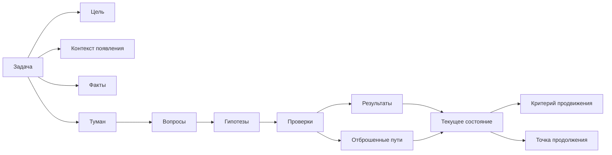

# Глава 4. Контекст задачи: что нужно вынести из головы

## От модели к первому инструменту

В главе 3 мы собрали минимальную модель человека как работающей системы. Внимание ограничено. Рабочая память узкая. Долговременная память хранит следы, но не всегда возвращает целую структуру. Тело меняет цену входа. Среда может помогать или мешать. Действие зависит не только от желания, но и от того, насколько понятен и управляем следующий шаг.

Из этой модели сразу следует практический вопрос:

```text
если сложная задача не должна целиком жить в голове, что именно нужно вынести наружу?
```

Не все подряд. Если записывать каждую мысль, заметка станет такой же туманной, как сама задача. Если записывать только ближайшее действие, будет потерян ход понимания. Полезен средний слой: карта контекста задачи.

Первый практический объект учебника:

```text
контекст задачи как внешний объект
```

Он нужен, чтобы человек мог не только помнить, что задача существует, но и возвращаться в ее состояние: зачем она нужна, что уже известно, где туман, какие гипотезы проверяются, какие пути закрыты, что считается продвижением и какой шаг открыть первым после паузы.

## Задача, действие и состояние задачи

Начнем с различения, без которого рабочие заметки быстро превращаются в кашу.

| Объект | Пример | Что хранит |
| --- | --- | --- |
| Задача | "Разобраться, почему объект иногда остается в промежуточном состоянии". | Контейнер проблемы. |
| Действие | "Сравнить логи по одному успешному и одному неуспешному `correlation_id`". | Ближайший физический или проверяемый шаг. |
| Состояние задачи | "Событие не теряется до обработчика; подозрение сместилось на обработку timeout после изменения состояния". | Текущее понимание, из которого можно продолжать. |

Список дел чаще всего хранит действие. Тикет хранит задачу. Но в туманных задачах решающее значение имеет третий слой: состояние задачи.

Именно оно чаще всего теряется после прерывания.

Можно открыть тот же тикет и тот же файл, но не восстановить состояние:

```text
что мы уже знаем?
какая гипотеза была сильной?
какой путь закрыт?
почему следующий шаг был именно таким?
```

Поэтому глава 4 не про красивое оформление заметок. Она про сохранение состояния задачи в форме, к которой можно вернуться.

## Состояние задачи как внешний объект

Схема ниже показывает, из чего состоит контекст туманной задачи.



Читать схему нужно так:

1. Задача не равна списку действий.
2. Контекст начинается с цели и причины появления задачи.
3. Факты и туман нужно разделить.
4. Туман становится рабочим, когда превращается в вопросы и гипотезы.
5. Рабочие проверки меняют текущее состояние задачи.
6. Отброшенные пути сохраняются, чтобы не ходить по кругу.
7. Точка продолжения связывает текущий подход со следующим.

Эта схема не обязана каждый раз превращаться в большую форму. Для простой задачи хватит двух строк. Но если задача туманная, дорогая или часто прерывается, отсутствие такой карты часто оплачивается повторным восстановлением контекста.

## Цель: что должно измениться

Цель отвечает на вопрос:

```text
что должно стать иначе после выполнения задачи?
```

Плохая цель слишком общая:

```text
Разобраться с интеграцией.
```

Она не говорит, что значит "разобраться", где граница работы и какой результат нужен.

Рабочая цель точнее:

```text
Понять, почему объект иногда остается в промежуточном состоянии, и выбрать безопасный способ исправления.
```

В этой формулировке уже есть несколько полезных вещей:

- объект проблемы;
- повторяемый симптом;
- не только поиск причины, но и выбор безопасного исправления;
- граница: задача не сводится к "поглядеть логи", она должна привести к пониманию и решению.

Цель не должна быть длинной. Но она должна защищать от случайной активности. Если цель не ясна, человек может делать технически полезные действия, которые не продвигают именно эту задачу.

Например, можно полдня улучшать логирование, читать код соседнего сервиса и обсуждать архитектуру ретраев. Все это может быть полезно. Но если цель — понять конкретный промежуточный статус, нужно видеть, какое действие приближает именно к этой цели.

## Контекст появления: почему задача возникла

Задача редко появляется из пустоты. У нее есть причина:

- пользователь столкнулся с ошибкой;
- метрика изменилась;
- тест начал падать;
- бизнес-процесс завис;
- команда готовит изменение;
- в архитектуре появился риск;
- старое решение стало мешать новому.

Контекст появления помогает понять смысл задачи и ее ограничения.

Например:

```markdown
## Контекст появления
В поддержке появились обращения: объект создан в системе A, но связанный объект в системе B иногда отсутствует. Повтор не всегда воспроизводит проблему. Нужно понять, где возникает промежуточное состояние, потому что ручная правка рискованна.
```

Такая запись сразу объясняет, почему нельзя просто "переотправить все", почему важна безопасность исправления и почему задача не сводится к локальному багу в одном файле.

Если контекст появления не записан, через несколько дней часто остается только действие. Человек помнит "посмотреть интеграцию", но не помнит, почему именно это важно и какая цена ошибки.

## Факты: на что уже можно опираться

Факт — это не то, что кажется вероятным. Факт — это то, что сейчас принято как подтвержденная опора.

Примеры фактов:

```markdown
## Факты
- событие приходит из системы A;
- запись в базе создается;
- объект в системе B создается не всегда;
- в неуспешном сценарии виден timeout внешнего вызова;
- проблема не воспроизводится на каждом запуске.
```

Факты нужны для двух вещей.

Во-первых, они уменьшают повторные проверки. Если уже проверено, что событие доходит до обработчика, не нужно каждый раз начинать с вопроса "а приходит ли событие вообще?".

Во-вторых, они защищают от смешивания знания и предположения. В туманной задаче мозг быстро склеивает "мы видели один случай" и "так происходит всегда". Хорошая карта контекста помогает спросить:

```text
это подтверждено или пока только похоже?
```

Факт может измениться. Если позже выяснится, что проверка была неполной, запись стоит обновить. Но пока факт используется как опора, его лучше отделять от гипотез.

## Туман: что пока не имеет формы

Туман — это не провал мышления. Это материал задачи.

Туман начинается как неприятное общее ощущение:

```text
непонятно, что происходит
```

В таком виде с ним трудно работать. Его полезно дробить на вопросы:

```markdown
## Туман
- что происходит после timeout?
- меняется ли состояние до внешнего вызова или после него?
- есть ли компенсация при частичном успехе?
- можно ли безопасно повторить операцию?
- почему проблема не воспроизводится каждый раз?
```

Так неопределенность становится видимой. Человек больше не пытается "понять все". Он видит набор мест, где модели пока нет.

Это может снижать сопротивление. Часто задача кажется невыносимой именно потому, что туман не разделен. Он переживается как один большой комок. После разделения появляется рабочая форма:

```text
не "я ничего не понимаю", а "у меня есть пять вопросов, и первый можно проверить"
```

## Гипотезы: временные объяснения, а не убеждения

Гипотеза — это временное объяснение, которое направляет проверку.

Она не обязана быть правой. Хорошая гипотеза полезна уже тем, что подсказывает, что смотреть дальше.

Например:

```markdown
## Гипотезы
1. Состояние меняется до внешнего вызова, а timeout оставляет объект в промежуточном статусе.
2. Timeout обрабатывается как частичный успех.
3. Ретрай отсутствует или не видит промежуточное состояние.
4. Есть гонка между обновлением состояния и повторной обработкой.
```

Опасность гипотез в том, что человек быстро начинает защищать понравившееся объяснение. Поэтому рядом с гипотезой нужна проверка:

```markdown
## Проверка
Открыть код перехода состояния и посмотреть, где именно меняется статус: до внешнего вызова, после успеха или в блоке обработки ошибки.
```

Рабочая проверка меняет состояние задачи:

- усилить гипотезу;
- ослабить гипотезу;
- отбросить гипотезу;
- породить новый вопрос;
- уточнить следующий шаг.

Если проверка ничего не меняет, возможно, это была не проверка, а движение внутри тумана.

## Отброшенные пути: защита от хождения по кругу

В туманной задаче важно сохранять не только то, что сработало. Стоит сохранять и то, что уже не сработало.

Пример:

```markdown
## Отброшенные пути
- Потеря события до обработчика: проверено по логам двух сценариев, событие доходит.
- Ошибка создания записи в базе: запись создается до внешнего вызова.
- Гипотеза "API всегда недоступен": в успешном сценарии тот же endpoint отвечает нормально.
```

Это не мусор. Это карта закрытых дверей.

Если отброшенные пути не фиксировать, будущий повторный вход часто начинается с того же самого:

```text
а может, событие вообще не приходит?
```

Иногда такой повтор нужен, если появились новые данные. Но по умолчанию системе лучше не платить за уже сделанную работу второй раз.

Отброшенный путь особенно полезен, когда:

- задача идет несколько дней;
- к ней возвращаются после перерывов;
- в ней участвует несколько людей;
- есть много похожих причин;
- гипотезы легко перепутать.

## Ограничения: что нельзя сломать

Ограничения — это часть контекста, а не внешний бюрократический слой.

Они отвечают на вопрос:

```text
что нельзя нарушить, пока мы решаем задачу?
```

Например:

```markdown
## Ограничения
- нельзя повторить операцию без проверки идемпотентности;
- нельзя потерять уже созданные объекты;
- нельзя менять порядок событий без миграционного плана;
- исправление должно быть безопасным для уже зависших объектов;
- публичное описание не должно раскрывать внутренние рабочие детали.
```

Ограничения помогают не перепутать "нашел быстрое действие" с "нашел допустимое действие".

В сложных задачах ограничение часто меняет саму форму решения. Если нельзя безопасно повторять операцию, ретрай перестает быть очевидным ответом. Если нельзя ломать совместимость, локальный фикс может оказаться недостаточным. Если нельзя раскрывать приватные детали, пример для учебника должен быть обезличен.

## Критерий продвижения: как увидеть прогресс до финала

В туманной задаче прогресс часто наступает раньше финального решения.

Прогресс есть, если:

- стало ясно, какая гипотеза слабее;
- закрыт один путь;
- найдено место, где расходятся успешный и неуспешный сценарии;
- сформулирован более точный вопрос;
- появился безопасный следующий шаг;
- снизилась неопределенность;
- стало понятно, кому и какой вопрос задать.

Поэтому полезно заранее записывать критерий продвижения:

```markdown
## Критерий продвижения
Задача продвинулась, если после следующей проверки станет ясно, меняется ли состояние до внешнего вызова или после него.
```

Такой критерий защищает от ощущения "я ничего не сделал", когда финального исправления еще нет. В исследовательских и инженерных задачах промежуточное знание — реальный результат.

Но критерий продвижения должен быть конкретным. Формулировка:

```text
стало понятнее
```

слишком туманна. Лучше:

```text
после проверки мы сможем исключить потерю события до обработчика или оставить ее основной гипотезой
```

## Точка продолжения: подарок будущему входу

Точка продолжения — это то, что будущий человек должен сделать первым после возвращения.

Она должна быть физической или проверяемой.

Хорошие точки продолжения:

```text
открыть обработчик timeout в файле X и проверить порядок изменения состояния
сравнить два лога по `correlation_id`: успешный и неуспешный
запустить тест Y с включенным логированием переходов состояния
спросить владельца системы B, является ли операция идемпотентной
```

Плохая точка продолжения:

```text
продолжить разбираться
```

Она почти не снижает цену входа. Человеку снова придется решать, с чего начать.

Точка продолжения особенно важна перед перерывом:

- встречей;
- переключением на срочную задачу;
- концом дня;
- выходными;
- ожиданием ответа от другого человека.

Если у вас есть только 30 секунд перед переключением, запишите хотя бы:

```text
Следующий шаг: открыть X и проверить Y.
```

Это маленькая строка, но она сохраняет направление.

## Минимальная карта контекста

Полная карта полезна не всегда. Иногда она слишком тяжелая. В когнитивном инженерстве хорошая форма должна быть соразмерна задаче.

Минимальная версия:

```markdown
## Цель

## Что известно

## Что непонятно

## Гипотезы

## Проверено / исключено

## Следующий проверяемый шаг
```

Еще короче:

```text
Знаю:
Не знаю:
Дальше:
```

Самая короткая версия перед уходом:

```text
Остановился на:
Первым делом открыть/проверить:
```

Главное — не полнота формы, а функция:

```text
помочь будущему себе восстановить состояние задачи дешевле, чем заново расследовать
```

Если заметка стала тяжелее самой задачи, форма плохая. Ее нужно упростить.

## Полный пример карты контекста

Ниже пример для условной задачи. Он намеренно обезличен: нам важна структура, а не рабочие детали.

```markdown
# Задача: объект остается в промежуточном состоянии

## Цель
Понять, почему объект иногда остается в промежуточном состоянии, и выбрать безопасный способ исправления.

## Контекст появления
Появились обращения: объект создан в системе A, но связанный объект в системе B иногда отсутствует. Ручная правка рискованна, потому что непонятно, можно ли безопасно повторять операцию.

## Факты
- Событие из системы A доходит до обработчика.
- Запись в базе создается.
- Объект в системе B создается не всегда.
- В неуспешном сценарии виден timeout внешнего вызова.
- Проблема не воспроизводится на каждом запуске.

## Туман
- Что происходит после timeout?
- Где именно меняется состояние?
- Есть ли компенсация при частичном успехе?
- Можно ли безопасно повторить операцию?

## Гипотезы
1. Состояние меняется до внешнего вызова, и timeout оставляет объект в промежуточном статусе.
2. Timeout обрабатывается как частичный успех.
3. Ретрай отсутствует или не видит промежуточное состояние.

## Проверено / исключено
- Потеря события до обработчика: маловероятно, событие видно в логах обоих сценариев.
- Ошибка создания записи в базе: маловероятно, запись создается до внешнего вызова.

## Ограничения
- Нельзя повторять операцию без проверки идемпотентности.
- Нельзя потерять уже созданные объекты.
- Исправление должно быть безопасным для уже зависших объектов.

## Критерий продвижения
После следующей проверки должно стать ясно, меняется ли состояние до внешнего вызова или после результата внешнего вызова.

## Точка продолжения
Открыть код перехода состояния и обработку ошибки внешнего вызова. Сравнить порядок операций в успешном и timeout-сценарии.
```

Эта карта не решает задачу. Но она меняет состояние работы. Теперь повторный вход может начинаться не с пустого "что вообще происходит?", а с конкретного положения: что известно, что не известно и какой шаг продолжает рассуждение.

## Как понять, что карта контекста хорошая

Хорошая карта контекста проходит пять проверок.

| Проверка | Вопрос |
| --- | --- |
| Возврат | Смогу ли я через день понять, где остановился? |
| Различение | Отделены ли факты от гипотез и тумана? |
| Неповторение | Видно ли, что уже проверено и что не нужно повторять без причины? |
| Безопасность | Видны ли ограничения и цена ошибки? |
| Действие | Есть ли следующий проверяемый шаг? |

Если хотя бы на один вопрос ответ "нет", карта может выглядеть красиво, но плохо выполнять работу.

## Типовые ошибки

### Ошибка 1. Записать только действие

```text
Проверить timeout.
```

Через день эта запись почти бесполезна. Какой timeout? Почему он важен? Что уже известно? Что будет результатом проверки?

Лучше:

```text
Гипотеза: timeout внешнего вызова происходит после изменения состояния.
Проверка: найти порядок операций в обработчике.
```

### Ошибка 2. Записать поток мыслей без структуры

Длинный поток может быть полезен во время размышления, но он плохо работает как точка возврата. Будущий человек вынужден перечитывать все, чтобы найти текущее состояние.

Лучше иметь короткий блок:

```text
Текущее состояние:
Факты:
Гипотезы:
Следующий шаг:
```

### Ошибка 3. Смешать факт и предположение

```text
Timeout ломает объект.
```

Это может быть правдой, а может быть гипотезой. Пока не проверено, лучше писать:

```text
Гипотеза: timeout оставляет объект в промежуточном состоянии.
```

### Ошибка 4. Не фиксировать закрытые пути

Если не записывать исключенные варианты, человек снова и снова возвращается к тем же вопросам. Это создает ощущение работы, но не обязательно продвижение.

### Ошибка 5. Оставить слишком общий следующий шаг

```text
Продолжить расследование.
```

Это не точка продолжения. Точка продолжения должна открыть дверь:

```text
Сравнить порядок изменения состояния в успешном и timeout-сценарии.
```

## Мини-практика

Выберите одну туманную задачу и составьте минимальную карту контекста.

```markdown
## Цель
Что должно измениться?

## Факты
Что уже подтверждено?

## Туман
Что пока непонятно?

## Гипотезы
Какие объяснения стоит проверить?

## Проверено / исключено
Куда уже не нужно возвращаться без новых данных?

## Ограничения
Что нельзя нарушить?

## Критерий продвижения
Что должно стать яснее после ближайшей проверки?

## Точка продолжения
Что открыть, сравнить, спросить или проверить первым?
```

Не стремитесь заполнить красиво. Задача формы — не впечатлить, а помочь будущему входу.

## Мини-словарь главы

| Понятие | Рабочее определение |
| --- | --- |
| Контекст задачи | Внешне зафиксированное состояние понимания: цель, факты, туман, гипотезы, проверки, ограничения и следующий шаг. |
| Состояние задачи | Текущая модель того, что происходит и что имеет смысл делать дальше. |
| Факт | Подтвержденная опора, на которую можно временно опираться. |
| Туман | Область неопределенности, где пока нет достаточной модели. |
| Вопрос | Проверяемая формулировка тумана. |
| Гипотеза | Временное объяснение, которое направляет проверку. |
| Отброшенный путь | Проверенное направление, к которому не нужно возвращаться без новых данных. |
| Ограничение | Условие безопасности, совместимости, приватности или допустимости решения. |
| Критерий продвижения | Признак, по которому видно, что ближайшая проверка уменьшила неопределенность. |
| Точка продолжения | Конкретный первый шаг для будущего входа в задачу. |

## Вопросы для самопроверки

1. Чем задача отличается от действия и состояния задачи?
2. Почему "непонятно" полезно превращать в вопросы?
3. Почему отброшенные пути являются частью контекста, а не мусором?
4. Чем критерий продвижения отличается от финального результата?
5. Почему точка продолжения должна быть физической или проверяемой?

## Короткое резюме

1. Для туманной задачи недостаточно хранить ближайшее действие.
2. Контекст задачи — это состояние понимания, вынесенное наружу.
3. Факты, туман и гипотезы нужно разделять.
4. Проверка должна менять состояние задачи, иначе это не проверка, а движение внутри тумана.
5. Отброшенные пути защищают от хождения по кругу.
6. Критерий продвижения помогает видеть результат до финального решения.
7. Точка продолжения может снижать цену будущего входа.
8. Хорошая карта контекста соразмерна задаче: чем больше тумана и прерываний, тем больше смысла в явной структуре.

## Источниковая опора

Проверенный пакет для этой главы: [[../Источники/2026-05-24 Пакет источников для главы 4]].

Ключевые источники в авторско-годовой форме:

- Altmann & Trafton (2002): память о целях и роль сигналов возобновления.
- Trafton et al. (2003): подготовка к возобновлению через кодирование цели и мысленное проигрывание.
- Trafton & Monk (2008): прерывания и возобновления как отдельный предмет исследований человеческих факторов.
- Parnin & DeLine (2010): сигналы возобновления и рабочие записи при возвращении к прерванной задаче программирования.
- Parnin & Rugaber (2011): стратегии повторного входа у программистов и частота восстановления контекста.
- Risko & Gilbert (2016), Gilbert (2015a, 2015b): когнитивная выгрузка, отложенные намерения и стратегические напоминания как внешняя разгрузка когнитивной работы и будущего возврата.

Доказательная роль блока: `strong` для утверждения, что повторный вход требует восстановления состояния цели и что сигналы возобновления вместе с заметками могут помогать возврату; `context-dependent` для переноса исследований повторного входа в общий шаблон контекста задачи. Поэтому глава предлагает не универсальную форму заметки, а принцип: внешне фиксировать те элементы, которые помогают восстановить состояние задачи.

Полные библиографические записи и DOI сохранены в пакете главы. В текущей редакции глава оставляет короткий авторско-годовой блок как читательский ориентир.

## Переход к следующей главе

Теперь есть первая внешняя форма: цель, факты, туман, гипотезы, проверки, ограничения, критерий продвижения и точка продолжения.

Но разовая карта контекста еще не является рабочей системой. В следующей главе мы соберем эти элементы в рабочий журнал: внешний контур, который сопровождает задачу от входа до выхода и помогает не терять состояние между рабочими блоками.

## Статус

`ready-for-review`

Следующий шаг: при финальной редактуре удержать главу как объяснение контекста задачи, а не как шаблон ради шаблона. Блок 1-6 проверен в [[../Проверки/2026-05-25 Ревизия блока 1-6]].
