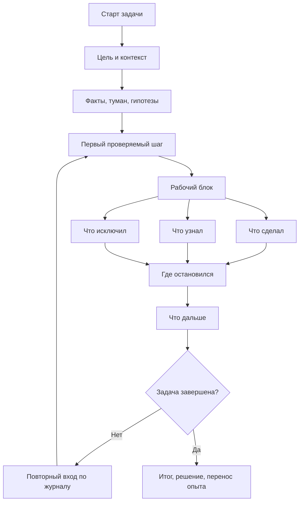
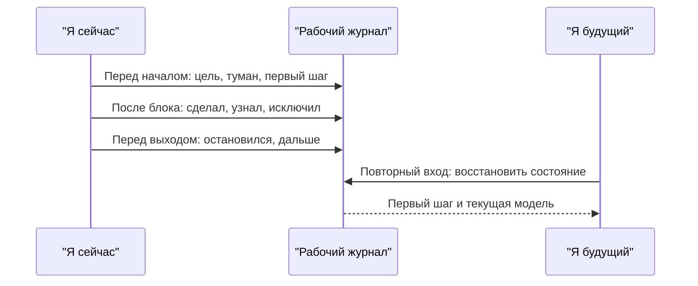
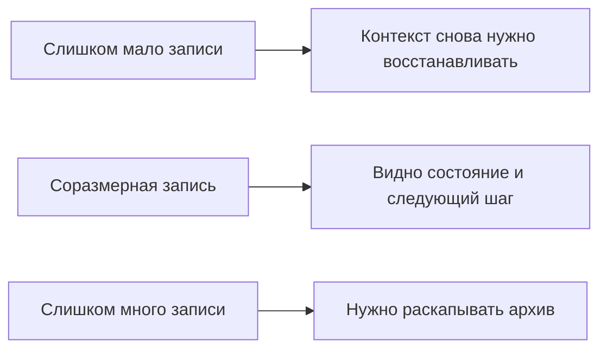

# Глава 5. Рабочий журнал как внешний контур мышления

## От карты контекста к журналу

В главе 4 мы разобрали, что именно нужно выносить из головы в сложной задаче: цель, факты, туман, гипотезы, проверки, ограничения, критерий продвижения и точку продолжения. Это уже меняет рамку работы: задача меньше похожа на бесформенное ощущение и больше на внешний объект, к которому можно вернуться.

Но у карты контекста есть ограничение: она показывает состояние задачи в один момент времени.

Сложная работа не стоит на месте. Каждый рабочий блок что-то меняет:

- один факт подтверждается;
- одна гипотеза становится слабее;
- один путь закрывается;
- появляется новое ограничение;
- меняется следующий шаг;
- становится понятнее, что именно считать продвижением.

Если эти изменения не фиксировать, карта быстро стареет. Вчера она помогала войти в задачу, а сегодня уже не показывает, почему мысль свернула именно сюда. Поэтому после карты контекста нужен следующий инструмент: рабочий журнал.

Рабочий журнал — это способ вести состояние задачи во времени.

Он отвечает не только на вопрос:

```text
что сейчас известно?
```

но и на вопросы:

```text
что изменилось после последнего блока?
почему мы больше не проверяем этот путь?
где остановилась мысль?
что открыть первым после возвращения?
что из этой задачи можно перенести в будущие задачи?
```

Речь не о красивом ведении заметок и не о том, чтобы превратить каждую задачу в административный отчет. Рабочий журнал нужен для более простой и более важной вещи: чтобы задача переживала прерывания.

## Что такое рабочий журнал

Рабочий журнал — это внешний контур мышления, который хранит ход работы с задачей так, чтобы человек мог продолжить ее после паузы без повторного восстановления всей модели с нуля.

В этом определении важны четыре слова.

**Внешний** — часть состояния находится не в голове, а в записи, схеме, таблице, тикете, документе или другом артефакте.

**Контур** — журнал не лежит отдельно от работы. Он включен в цикл: открыть задачу, понять состояние, сделать проверку, записать результат, оставить точку продолжения.

**Ход работы** — журнал хранит не только итог, но и путь: что проверяли, что узнали, что исключили, почему следующий шаг именно такой.

**Продолжить** — главный критерий качества записи. Хорошая запись помогает следующему входу. Плохая запись может быть подробной, умной и аккуратной, но не отвечать на вопрос: "что мне делать дальше?"

Можно сказать еще короче:

```text
рабочий журнал — это интерфейс к продолжающейся задаче
```

Он нужен не для памяти вообще, а для конкретного будущего действия.

## Главный читатель журнала

У рабочего журнала есть особый читатель. Это не начальник, не команда, не внешний рецензент и не архив будущей истории проекта.

Главный читатель рабочего журнала — вы сами через два часа, завтра утром, после встречи, после выходных или после срочного переключения.

Этот будущий человек будет в другом состоянии:

- у него уже не будет свежего следа рабочей памяти;
- часть деталей смешается;
- эмоциональная уверенность "я же понял" ослабнет;
- ближайший шаг снова станет неочевидным;
- задача может начать выглядеть более тяжелой, чем была на самом деле.

Поэтому рабочую запись лучше делать дружелюбной не к идеальному читателю, а к уставшему человеку, который пытается снова войти в задачу.

Проверка простая:

```text
смогу ли я по этой записи начать следующий блок за несколько минут?
```

Если ответ "нет", запись может быть ценной для архива, но как рабочий журнал она не справилась.

## Чем журнал отличается от похожих форм

Рабочий журнал часто путают с дневником, списком дел, конспектом или отчетом. Все эти формы полезны, но у них разные функции.

| Форма записи | Для чего подходит | Почему это не рабочий журнал |
| --- | --- | --- |
| Дневник | Личная рефлексия, переживания, смысл, самонаблюдение. | Может честно описывать состояние человека, но не хранить проверяемое состояние задачи. |
| Список дел | Перечень действий, напоминания, короткое управление делами. | Обычно не хранит цель, факты, гипотезы, результаты проверок и причины выбора следующего шага. |
| Конспект | Сохранение внешней информации: статьи, лекции, документации, обсуждения. | Может хранить знания, но не показывать, как эти знания изменили текущую задачу. |
| Отчет | Коммуникация результата другим людям. | Часто сглаживает путь, убирает тупики и пишет итог так, будто он был ясен с самого начала. |
| Рабочий журнал | Продолжение задачи без потери состояния. | Хранит ход проверок, изменения понимания, закрытые пути и точку продолжения. |

Без этого различения рабочий журнал легко начинает выполнять чужую функцию.

Если вести его как дневник, можно получить много честного текста о том, как тяжело и мутно, но не получить следующего действия.

Если вести его как список дел, можно сохранить шаги, но потерять, зачем эти шаги нужны.

Если вести его как конспект, можно накопить много информации, но не понять, какая часть информации изменила решение.

Если вести его как отчет, можно написать гладкий итог, но потерять шероховатость исследования: почему один вариант был отброшен, где был риск, какая проверка изменила направление.

Рабочий журнал не обязан быть красивым. Он должен быть продолжабельным.

## Что журнал должен хранить

Журнал не должен хранить все мысли подряд. Это быстро делает его непригодным.

Его базовая задача — хранить изменения состояния задачи.

Минимальный набор после рабочего блока:

```text
сделал -> узнал -> исключил -> остановился -> дальше
```

Эти пять полей различают пять разных вещей.

| Поле | Что фиксирует | Зачем нужно |
| --- | --- | --- |
| Сделал | Физическое или интеллектуальное действие. | Помогает видеть расход времени и не путать активность с результатом. |
| Узнал | Изменение модели задачи. | Показывает, что стало понятнее после действия. |
| Исключил | Закрытый путь или ослабленная гипотеза. | Защищает от повторных проверок и хождения по кругу. |
| Остановился | Место, где работа была прервана. | Помогает восстановить состояние без перечитывания всего пути. |
| Дальше | Первый проверяемый шаг следующего входа. | Может снижать цену начала и уменьшать сопротивление. |

В формуле нет лишней сложности, но она дисциплинирует мышление.

Например, запись:

```text
смотрел логи
```

почти ничего не сохраняет.

Запись:

```text
Сделал: сравнил логи успешного и неуспешного сценария.
Узнал: в неуспешном сценарии timeout появляется после перевода объекта в промежуточное состояние.
Исключил: событие не теряется до обработчика.
Остановился: нужно понять, что делает обработка ошибки внешнего вызова.
Дальше: открыть код перехода состояния и проверить ветку timeout.
```

сохраняет состояние задачи. По ней можно продолжать.

## Жизненный цикл рабочего журнала

Журнал сопровождает задачу не одной записью, а циклом.



Схему нужно читать так.

Сначала журнал создает вход: цель, контекст, факты, туман, гипотезы и первый проверяемый шаг.

Затем каждый рабочий блок обновляет состояние задачи: что сделано, что стало понятно, что можно исключить.

Перед выходом журнал оставляет будущую точку входа: где остановился и что дальше.

При повторном входе человек может не начинать с пустого места. Он открывает журнал, восстанавливает состояние и продолжает с первого проверяемого шага.

Когда задача завершена, журнал не обязан исчезать. Он может сохранить итог, решение и переносимый опыт: что теперь пригодится в похожих задачах.

## Три момента записи

Вести журнал постоянно, во время каждой мысли, обычно не нужно. Это перегружает работу и превращает инструмент в шум.

Гораздо полезнее выделить три момента.



Эту схему нужно читать не как обязанность писать больше, а как распределение записи по точкам максимальной пользы.

Перед началом журнал помогает уменьшить туман: что я делаю, зачем и каким первым шагом. После блока он помогает сохранить изменение состояния: что стало известно и что больше не нужно проверять. Перед выходом он оставляет будущему входу не архив размышлений, а точку продолжения. Поэтому главный критерий такой: запись должна помогать будущему читателю журнала быстрее войти в действие, а не заставлять его заново разбирать весь ход мыслей.

### Перед началом

Перед началом не нужно писать много. Нужно зафиксировать направление.

Минимально:

```markdown
## Перед началом
- Что пытаюсь сделать:
- Что сейчас непонятно:
- Первый проверяемый шаг:
```

Это помогает защититься от бесформенного входа. Если первый шаг не получается сформулировать, возможно, задача еще слишком туманна. Тогда первым действием становится не "решить", а "сделать неопределенность видимой".

### После рабочего блока

После блока важно отделить действие от изменения понимания.

```markdown
## После блока
- Сделал:
- Узнал:
- Исключил:
```

Человек может много сделать и мало узнать. Может сделать мало, но резко уточнить модель. Может не найти решение, но закрыть неправильный путь. В туманной задаче все это разные типы результата.

### Перед выходом

Перед выходом журнал готовит будущий вход.

```markdown
## Выход
- Остановился на:
- Дальше:
```

Если времени почти нет, эти две строки важнее красивого итога.

Плохой выход:

```text
потом продолжить
```

Хороший выход:

```text
Дальше: открыть обработчик timeout и проверить, меняется ли состояние до внешнего вызова или после него.
```

Хороший выход не требует героической памяти от будущего человека.

## Минимальный шаблон

Базовый шаблон рабочего журнала может быть таким:

```markdown
# Рабочий журнал задачи

## Карта задачи

### Цель

### Контекст появления

### Факты

### Туман / вопросы

### Гипотезы

### Проверено / исключено

### Ограничения

### Критерий продвижения

### Точка продолжения

## Лог работы

### YYYY-MM-DD HH:MM

#### Перед началом
- Что пытаюсь сделать:
- Что сейчас непонятно:
- Первый проверяемый шаг:

#### После блока
- Сделал:
- Узнал:
- Исключил:
- Остановился на:
- Дальше:

## Завершение
- Что решено:
- Что изменилось:
- Что можно перенести в похожие задачи:
- Какие долги остались:
```

Это полная форма. Ее не нужно применять всегда.

Для короткого рабочего блока достаточно:

```markdown
## Итог блока
- Сделал:
- Узнал:
- Остановился:
- Дальше:
```

Для очень короткого выхода:

```text
Остановился:
Первым делом:
```

Главное правило:

```text
форма должна быть легче, чем цена повторного восстановления контекста
```

Если на задачу уйдет десять минут, полная форма бессмысленна. Если задача длится несколько дней, часто прерывается и содержит неопределенность, отсутствие журнала будет стоить дороже.

## Пример: та же инженерная задача

Продолжим обезличенный пример из главы 4.

Есть задача: объект иногда остается в промежуточном состоянии. Мы уже собрали карту контекста: цель, факты, туман, гипотезы, ограничения и точку продолжения.

Теперь посмотрим, как это превращается в рабочий журнал.

```markdown
# Рабочий журнал: объект остается в промежуточном состоянии

## Карта задачи

### Цель
Понять, почему объект иногда остается в промежуточном состоянии, и выбрать безопасный способ исправления.

### Контекст появления
Появились обращения: объект создан в системе A, но связанный объект в системе B иногда отсутствует. Ручная правка рискованна, потому что непонятно, можно ли безопасно повторять операцию.

### Факты
- Событие из системы A доходит до обработчика.
- Запись в базе создается.
- Объект в системе B создается не всегда.
- В неуспешном сценарии виден timeout внешнего вызова.

### Туман / вопросы
- Где именно меняется состояние?
- Что происходит после timeout?
- Есть ли компенсация при частичном успехе?
- Можно ли безопасно повторить операцию?

### Гипотезы
1. Состояние меняется до внешнего вызова, и timeout оставляет объект в промежуточном статусе.
2. Timeout обрабатывается как частичный успех.
3. Ретрай отсутствует или не видит промежуточное состояние.

### Проверено / исключено
- Потеря события до обработчика: маловероятно, событие видно в логах обоих сценариев.
- Ошибка создания записи в базе: маловероятно, запись создается до внешнего вызова.

### Ограничения
- Нельзя повторять операцию без проверки идемпотентности.
- Нельзя потерять уже созданные объекты.
- Исправление должно быть безопасным для уже зависших объектов.

### Точка продолжения
Открыть код перехода состояния и обработку ошибки внешнего вызова.

## Лог работы

### 2026-05-24 10:20

#### Перед началом
- Что пытаюсь сделать: проверить гипотезу, что состояние меняется до внешнего вызова.
- Что сейчас непонятно: где именно происходит переход в промежуточное состояние.
- Первый проверяемый шаг: найти обработчик операции и порядок вызовов.

#### После блока
- Сделал: нашел обработчик операции и место перехода состояния.
- Узнал: состояние меняется до внешнего вызова в систему B.
- Исключил: гипотезу, что промежуточное состояние появляется только после ошибки внешнего API.
- Остановился на: нужно понять, что делает код при timeout внешнего вызова.
- Дальше: открыть ветку обработки ошибки внешнего вызова и проверить, есть ли компенсация или ретрай.

### 2026-05-24 13:40

#### Перед началом
- Что пытаюсь сделать: проверить обработку timeout.
- Что сейчас непонятно: считается ли timeout частичным успехом, ошибкой или поводом для повтора.
- Первый проверяемый шаг: посмотреть ветку обработки ошибки внешнего вызова.

#### После блока
- Сделал: проверил ветку timeout и поискал ретрай.
- Узнал: timeout логируется как ошибка, но состояние не откатывается; отдельного ретрая для промежуточного состояния нет.
- Исключил: гипотезу, что ретрай есть, но не виден в логах.
- Остановился на: нужен безопасный вариант восстановления для уже зависших объектов.
- Дальше: проверить идемпотентность операции в системе B и возможность безопасного повторного вызова.
```

Обратите внимание: журнал не является финальным решением. Он не подменяет код, тесты, обсуждение с владельцами системы или план исправления.

Но он делает несколько важных вещей.

Во-первых, сохраняет траекторию. Видно, почему мы пришли к текущей гипотезе.

Во-вторых, отделяет результат действия от самого действия. "Проверил timeout" превращается в "узнал, что timeout не откатывает состояние".

В-третьих, помогает защищаться от повторов. Нет смысла снова искать ретрай, если уже проверено, что его нет, пока не появились новые данные.

В-четвертых, оставляет следующий вход. После паузы меньше шансов снова начинать с вопроса, с чего начать.

## Журнал как интерфейс, а не хранилище

У рабочего журнала есть соблазнительная ловушка: если он полезен, хочется сделать его полным.

Добавить теги, статусы, таблицы, ссылки, шаблоны, категории, оценку времени, уровни риска, историю всех команд, отдельные разделы для решений, вопросов и мыслей.

Иногда это действительно нужно. Но базовый критерий другой:

```text
помогает ли эта часть записи следующему действию?
```

Журнал — это интерфейс к задаче. Интерфейсу лучше давать нужное состояние в нужный момент.

Если запись слишком короткая, будущий вход снова дорогой.

Если запись слишком длинная, будущий вход тоже дорогой, потому что человеку нужно читать собственный архив, чтобы найти живую точку работы.

Полезная форма находится между этими крайностями.



Практический вопрос:

```text
что будущему мне нужно увидеть за первые 1-3 минуты?
```

Ответ на этот вопрос важнее любой универсальной структуры.

## Масштабы журнала

Полезно, чтобы рабочий журнал масштабировался.

### Версия на 30 секунд

Когда нужно срочно выйти из задачи:

```markdown
Остановился: проверил логи, событие до обработчика доходит.
Первым делом: открыть обработчик timeout и проверить порядок изменения состояния.
```

Это лучше, чем ничего. Такая запись не объясняет всю задачу, но сохраняет направление.

### Версия на 3 минуты

Когда рабочий блок завершился нормально:

```markdown
## Итог блока
- Сделал: сравнил успешный и неуспешный сценарий.
- Узнал: timeout происходит после промежуточного состояния.
- Исключил: потерю события до обработчика.
- Дальше: проверить обработку timeout и наличие компенсации.
```

Этого часто достаточно для ежедневной работы.

### Полная версия

Когда задача новая, дорогая, туманная или длится несколько дней, нужна карта задачи плюс лог работы:

```text
цель
контекст появления
факты
туман
гипотезы
проверено / исключено
ограничения
критерий продвижения
лог блоков
точка продолжения
итог
```

Полная версия нужна не потому, что "так правильно", а потому, что цена ошибки и повторного входа выше цены записи.

## Как журнал помогает качеству решений

Рабочий журнал часто воспринимают как инструмент продуктивности. Это верно, но неполно.

Он помогает не только быстрее возвращаться к задаче, но и лучше думать.

### Видно, как менялась модель

Когда гипотезы и проверки записаны, можно увидеть, что именно изменило мнение.

Без журнала человек часто помнит только текущую уверенность:

```text
кажется, дело в timeout
```

С журналом видно основание:

```text
timeout появляется после изменения состояния; ретрая не найдено; потеря события до обработчика исключена
```

Это не делает вывод автоматически верным, но делает его проверяемым.

### Меньше повторов

Туманные задачи часто дают ложное ощущение продвижения через повторение. Человек снова открывает те же логи, снова проверяет тот же путь, снова приходит к той же неопределенности.

Журнал фиксирует закрытые двери.

Важно: "исключил" не означает "навсегда доказал невозможность". Это означает:

```text
без новых данных не возвращаемся сюда как к первому пути
```

Так журнал помогает защищать внимание.

### Легче обсуждать задачу

Даже если журнал пишется для себя, он помогает разговаривать с другими.

Вместо:

```text
я там смотрел, кажется, проблема где-то после вызова
```

можно сказать:

```text
сейчас известно вот что; вот эти две гипотезы закрыты; открытый вопрос — идемпотентность повторного вызова
```

Это уже не поток впечатлений, а состояние расследования.

### Понятнее, куда ушло время

В сложной интеллектуальной работе часть результата невидима. Человек мог не закрыть задачу, но сузить пространство поиска вдвое.

Журнал может делать такой прогресс видимым:

- какие проверки были сделаны;
- какие варианты закрыты;
- что стало яснее;
- почему финальное решение пока невозможно;
- что нужно для следующего шага.

Это важно не только для отчетности. Это может снижать внутреннее ощущение "я весь день ничего не сделал", когда на самом деле был выполнен кусок исследовательской работы.

## Когда журнал особенно полезен

Полная форма журнала нужна не всегда. Она особенно полезна, когда есть хотя бы один из признаков:

- задача туманная и неизвестно, с чего начать;
- задача длится больше одного рабочего блока;
- есть риск прерываний;
- много гипотез и похожих причин;
- высока цена ошибки;
- нужно объяснить ход рассуждения другому человеку;
- задача связана с несколькими системами или людьми;
- уже было ощущение "я снова возвращаюсь к тому же месту";
- нужно сохранить переносимый опыт для будущих похожих задач.

Если задача простая, журнал может быть коротким:

```text
сделал -> дальше
```

Когнитивное инженерство не требует максимальной формы. Оно требует формы, соответствующей нагрузке.

## Когда журнал не решит проблему

Рабочий журнал помогает с потерей контекста. Но не всякая трудность входа в задачу является потерей контекста.

Журнал не заменяет сон. Если человек физически истощен, запись может помочь понять следующий шаг, но не вернет ресурс сложного контроля.

Журнал не заменяет приоритизацию. Если задач слишком много и все одновременно срочные, фиксация контекста снизит потери, но не решит конфликт фокуса.

Журнал не заменяет безопасную среду. Если человека постоянно дергают, наказывают за вопросы или требуют невозможного, личная техника не исправит системную причину.

Журнал не заменяет медицинскую или психологическую помощь. Если проблема связана с длительным истощением, депрессивными состояниями, тревогой или другими клиническими факторами, рабочая запись может быть поддержкой, но не лечением.

Это важная граница. Цель рабочего журнала — не выжать из человека больше. Его цель — не заставлять память и внимание снова и снова выполнять одну и ту же восстановительную работу.

## Типовые ошибки

### Ошибка 1. Вести журнал как архив

Архив отвечает на вопрос:

```text
что когда-то происходило?
```

Рабочий журнал отвечает на вопрос:

```text
как продолжить сейчас?
```

Если запись не помогает ответить на второй вопрос, ее нужно сжать или перестроить.

### Ошибка 2. Писать только действия

```markdown
- посмотрел логи
- открыл код
- спросил коллегу
```

Это показывает активность, но не показывает изменение понимания.

Лучше:

```markdown
- Сделал: сравнил логи.
- Узнал: timeout появляется после изменения состояния.
- Исключил: потерю события до обработчика.
```

### Ошибка 3. Писать только выводы

Иногда человек пишет:

```text
проблема, скорее всего, в обработке timeout
```

Но не пишет, почему.

Через день такая запись может стать опасной. Она сохраняет уверенность, но не сохраняет основание. Лучше рядом держать проверку, которая привела к выводу.

### Ошибка 4. Не фиксировать остановку

Многие записи заканчиваются на результате:

```text
нашел место изменения состояния
```

Но следующий вход все равно дорогой, потому что не ясно, что делать первым.

Нужно дописывать:

```text
Дальше: проверить ветку timeout и наличие компенсации.
```

### Ошибка 5. Делать форму слишком тяжелой

Если журнал требует десять полей после каждого маленького действия, его быстро бросят.

Форма должна иметь аварийный режим:

```text
Остановился:
Дальше:
```

Лучше устойчиво вести короткий журнал, чем неделю вести идеальный и потом перестать.

### Ошибка 6. Прятать туман

Иногда хочется писать журнал так, будто все уже ясно. Это делает запись аккуратной, но снижает ее пользу.

Рабочий журнал должен разрешать фразы:

```text
не понимаю, почему это воспроизводится только иногда
пока не ясно, где меняется состояние
эта гипотеза слабая, но проверяемая
```

Туман, записанный в рабочей форме, может перестать быть просто неприятным состоянием и стать списком проверяемых мест.

## Мини-практика

Выберите одну задачу, к которой вы уже возвращались несколько раз и каждый раз тратили время на разгон.

Создайте для нее минимальный рабочий журнал.

```markdown
# Рабочий журнал: ...

## Карта задачи

### Цель
Что должно измениться?

### Факты
Что уже подтверждено?

### Туман
Что пока непонятно?

### Гипотезы
Какие объяснения проверяются?

### Проверено / исключено
Куда не возвращаться без новых данных?

### Точка продолжения
Что открыть, проверить, сравнить или спросить первым?

## Итог текущего блока
- Сделал:
- Узнал:
- Исключил:
- Остановился:
- Дальше:
```

Не пытайтесь сразу создать идеальную систему. Цель упражнения — оставить будущему себе рабочий вход.

После следующего возвращения к задаче проверьте журнал по трем вопросам:

1. Сколько времени заняло понять, где вы остановились?
2. Был ли следующий шаг достаточно конкретным?
3. Что нужно убрать или добавить, чтобы следующий вход стал дешевле?

## Мини-словарь главы

| Понятие | Рабочее определение |
| --- | --- |
| Рабочий журнал | Внешний контур, который хранит ход работы с задачей для продолжения после паузы. |
| Внешний контур мышления | Артефакты, записи, схемы и процедуры, которые принимают на себя часть когнитивной работы. |
| Снимок состояния задачи | Короткая фиксация текущей модели: что известно, что непонятно, что проверяется, что дальше. |
| Лог работы | Последовательность рабочих блоков с действиями, результатами, исключениями и точками продолжения. |
| Будущий читатель | Сам автор записи в другом состоянии и в другой момент времени. |
| Точка продолжения | Конкретное первое действие для повторного входа. |
| Переносимый опыт | То, что из текущей задачи пригодится для похожих задач в будущем. |

## Вопросы для самопроверки

1. Чем рабочий журнал отличается от списка дел?
2. Почему "что сделал" и "что узнал" нужно разделять?
3. Зачем фиксировать "что исключил"?
4. Почему главный читатель журнала — будущий автор?
5. В чем разница между архивом и рабочим интерфейсом к задаче?
6. Когда полная форма журнала оправдана, а когда достаточно двух строк?

## Короткое резюме

1. Карта контекста показывает состояние задачи; рабочий журнал показывает, как это состояние меняется во времени.
2. Рабочий журнал нужен не для красоты и не для архива, а для продолжения работы.
3. Минимальная формула после блока: сделал, узнал, исключил, остановился, дальше.
4. Запись должна помогать будущему человеку войти в задачу за минуты, а не заново проводить расследование.
5. Хороший журнал сохраняет не только выводы, но и основания выводов.
6. Журнал должен быть соразмерен задаче: чем больше тумана, цены ошибки и прерываний, тем полезнее явная структура.
7. Если запись стала тяжелее повторного входа, форму нужно упростить.
8. Рабочий журнал помогает с контекстом и неопределенностью, но не заменяет сон, приоритизацию, восстановление и здоровую рабочую среду.

## Источниковая опора

Проверенный пакет для этой главы: [[../Источники/2026-05-24 Пакет источников для главы 5]].

Ключевые источники в авторско-годовой форме:

- Baddeley (2012): рабочая память как ограниченная система активного удержания и обработки.
- Hutchins (1995), Norman (1991, 1993), Scaife & Rogers (1996): внешние артефакты, представления и среда как часть когнитивной работы.
- Risko & Gilbert (2016), Gilbert (2015a, 2015b): когнитивная выгрузка, отложенные намерения и стратегические напоминания как перенос части когнитивной работы, намерений и будущих входов во внешний контур.
- Altmann & Trafton (2002), Trafton et al. (2003), Trafton & Monk (2008): цель, прерывания и подготовка повторного входа.
- Parnin & DeLine (2010), Parnin & Rugaber (2011): восстановление контекста и подсказки возвращения в задачах программирования.

Доказательная роль блока: `strong` для ограничений рабочей памяти, когнитивной выгрузки и цены повторного входа; `theory-to-practice bridge` для рабочего журнала как инженерного артефакта. Источники поддерживают принцип внешнего контура, но не доказывают, что любая форма журнала будет полезной в любой задаче.

Полные библиографические записи и DOI сохранены в пакете главы. В текущей редакции глава оставляет короткий авторско-годовой блок как читательский ориентир.

## Переход к следующей главе

Теперь у нас есть две вещи: карта контекста задачи и рабочий журнал, который ведет эту карту во времени.

Но даже хороший журнал не работает сам по себе. Его стоит встроить в повторяемые действия: как входить в задачу, как начинать первый проверяемый шаг, как выходить перед переключением и как оставлять контрольную точку будущему себе.

Дальше понадобятся ритуалы входа и выхода: не магические привычки, а короткие процедуры, которые соединяют внимание, контекст, журнал и действие.

## Статус

`ready-for-review`

Следующий шаг: при финальной редактуре проверить, что длинные формы журнала остаются расширенной версией, а основной вход для читателя держится на короткой формуле `сделал -> узнал -> исключил -> остановился -> дальше`.
