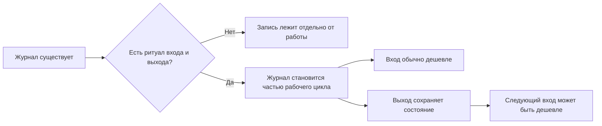
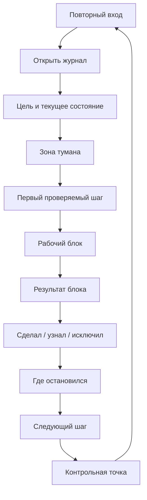

# Глава 6. Ритуалы входа и выхода

## От артефакта к действию

В главе 4 мы собрали карту контекста задачи. В главе 5 превратили ее в рабочий журнал: внешний контур, который ведет состояние задачи во времени.

Но даже хороший журнал сам по себе не гарантирует работы.

Можно иметь прекрасную заметку и все равно каждый раз начинать с пустого экрана. Можно знать, что нужно оставить точку продолжения, и все равно уходить из задачи в середине мысли. Можно понимать пользу внешнего контура, но пользоваться им только в спокойные дни, когда он меньше всего нужен.

Чтобы журнал стал частью работы, нужен повторяемый способ входить и выходить из задачи.

В учебнике такой способ называется ритуалом.

Слово "ритуал" здесь не означает торжественность, мистику или красивую привычку. Ритуал в когнитивном инженерстве — это короткая повторяемая последовательность действий, которая может снижать цену переключения и помогает запустить нужный режим работы.

Ритуал нужен не для того, чтобы "быть дисциплинированным". Он нужен, чтобы каждый раз не изобретать заново:

- как войти в туманную задачу;
- как выбрать первый шаг;
- как не пытаться решить все сразу;
- как выйти без потери состояния;
- как оставить будущему себе нормальный вход.

Если рабочий журнал — это внешний контур мышления, то ритуалы входа и выхода — это способ этот контур замкнуть.

## Зачем нужен ритуал после журнала

Журнал хранит состояние задачи. Но человек должен к нему обратиться, прочитать правильные места, выбрать действие и обновить запись после блока.

Если этого не происходит, журнал превращается в архив.

Схема простая:



Главная мысль главы:

```text
хороший выход из задачи — это уже начало следующего входа
```

Мы обычно думаем о входе и выходе как о двух разных действиях. Сначала "собраться и начать", потом "закончить и закрыть". В туманных задачах это не так. Если выход был плохим, следующий вход часто становится дорогим. Если выход оставил контрольную точку, следующий вход может начинаться с уже подготовленного состояния.

## Что такое ритуал

Ритуал — это повторяемая короткая последовательность действий, которая переводит человека из одного режима в другой.

В этой книге нас интересуют два режима:

- рассеянное состояние перед задачей;
- рабочее состояние внутри задачи.

Ритуал входа переводит человека из первого во второе.

Ритуал выхода переводит задачу из живого рабочего состояния во внешний след, из которого ее можно будет поднять позже.

Сразу отделим ритуал от бюрократии.

| Понятие | Что это | Как проверить |
| --- | --- | --- |
| Ритуал | Короткая последовательность, которая помогает снижать цену входа, выхода или переключения. | После нее легче начать, продолжить или вернуться. |
| Бюрократия | Заполнение формы ради формы или ради ощущения контроля. | Она не помогает действию и увеличивает сопротивление. |
| Привычка | Автоматизирующееся повторение поведения в похожих условиях. | Срабатывает все легче при стабильном контексте. |
| Рабочий протокол | Явная процедура для ситуации, где важно не пропустить шаг. | Помогает действовать точнее, особенно при сложности или риске. |

Ритуал входа и выхода находится между привычкой и протоколом. Он должен быть достаточно коротким, чтобы его реально повторять, и достаточно явным, чтобы не терять важные элементы: цель, состояние, туман, первый шаг, контрольную точку.

## Ритуал входа

Ритуал входа нужен, когда задача уже существует, но человек еще не находится в ее состоянии.

Типичная ситуация:

```text
открыл задачу, вроде помню, что там было, но внутри туман
```

Плохой вход пытается сразу начать с действия:

```text
надо просто открыть код и уже что-нибудь делать
```

Иногда это срабатывает. Но в туманной задаче такой вход часто приводит к лишнему блужданию. Человек начинает с того места, которое легче открыть, а не с того, которое действительно продолжает рассуждение.

Хороший вход начинается с восстановления состояния.

Минимальный ритуал:

```text
1. Открыть рабочий журнал.
2. Прочитать цель и текущее состояние.
3. Назвать текущую зону тумана.
4. Выбрать один первый проверяемый шаг.
5. Ограничить рабочий блок по времени или объему.
```

Разберем каждый пункт.

### 1. Открыть рабочий журнал

Это звучит слишком просто, но именно здесь контур часто рвется.

Человек помнит, что у него "где-то есть заметка", но начинает с кода, чата, почты, тикета или внутреннего монолога. Через несколько минут он снова собирает контекст вручную.

Первый шаг ритуала:

```text
сначала открыть внешний след
```

Это не поклон системе заметок. Это признание ограничения: рабочая память не обязана хранить полное состояние сложной задачи после паузы.

### 2. Прочитать цель и текущее состояние

Вход не должен превращаться в перечитывание всего архива. Достаточно увидеть:

- зачем задача нужна;
- где она сейчас находится;
- что было последним существенным изменением понимания;
- какая точка продолжения была оставлена.

Если журнал устроен хорошо, это занимает минуты, а не полчаса.

Если для входа нужно прочитать двадцать экранов текста, проблема не в слабой дисциплине. Проблема в форме журнала: в нем не выделено текущее состояние.

### 3. Назвать текущую зону тумана

Перед действием полезно одной фразой назвать, что именно сейчас непонятно.

Например:

```text
непонятно, что происходит после timeout
```

или:

```text
непонятно, можно ли безопасно повторить внешний вызов
```

Это может снижать внутреннее давление. Человек больше не пытается "решить всю задачу". Он видит конкретную область неопределенности.

Правило:

```text
если туман нельзя назвать, первым шагом становится его разделение
```

То есть сначала не код, не решение и не обсуждение, а превращение общего "не понимаю" в несколько вопросов.

### 4. Выбрать первый проверяемый шаг

Первый проверяемый шаг — это действие, после которого что-то станет яснее.

Он не обязан решать задачу. Более того, требование "пусть первый шаг сразу ведет к решению" часто блокирует вход.

Хорошие первые шаги:

```text
сравнить успешный и неуспешный сценарий по одному идентификатору
открыть обработчик ошибки и найти порядок изменения состояния
проверить, есть ли ретрай для промежуточного состояния
сформулировать вопрос владельцу внешней системы про идемпотентность
```

Плохие первые шаги:

```text
разобраться полностью
починить интеграцию
подумать над архитектурой
посмотреть все логи
```

Они слишком широкие. Они не говорят, что именно изменится после действия.

Формула:

```text
после первого шага должно стать яснее хотя бы одно место
```

### 5. Ограничить рабочий блок

Туманная задача легко разрастается. Поэтому полезно, чтобы вход задавал размер ближайшего блока.

Например:

```text
20 минут: найти место изменения состояния
40 минут: сравнить два сценария и записать различия
один блок: проверить только гипотезу про timeout
```

Это не жесткий тайм-менеджмент. Это защита рабочей памяти и внимания от попытки удержать всю задачу сразу.

## Рабочий блок

После входа начинается рабочий блок.

Его задача — не обязательно "сделать много". Его задача — изменить состояние задачи.

Для туманной работы полезна формула:

```text
на один блок — один главный вопрос или одна проверяемая гипотеза
```

Например:

| Слишком широкий блок | Рабочий блок |
| --- | --- |
| Разобраться с интеграцией. | Проверить, меняется ли состояние до внешнего вызова. |
| Починить flaky-тесты. | Найти, отличаются ли окружения успешного и неуспешного запуска. |
| Подумать над архитектурой. | Сравнить два варианта по одному ограничению: безопасность миграции. |
| Написать документацию. | Составить список решений, которые должен понять будущий читатель. |

Такой блок не гарантирует легкости. Но он может уменьшить бесформенность.

Во время блока важно не перескакивать к оценке всего результата каждые пять минут.

Если постоянно держать в голове финальный исход:

```text
успею ли закрыть задачу?
получится ли вообще?
почему так долго?
```

внимание расходуется на самооценку, а не на проверку. Гораздо дешевле держать текущий вопрос:

```text
меняется ли состояние до внешнего вызова?
```

Это не запрет на оценку. Это разделение режимов: во время блока — проверяемый шаг; после блока — обновление состояния.

## Ритуал выхода

Ритуал выхода особенно полезен перед паузой:

- конец рабочего блока;
- встреча;
- переключение на срочное;
- конец дня;
- ожидание ответа;
- момент, когда стало ясно, что ресурса на продолжение уже нет.

Плохой выход выглядит так:

```text
я примерно помню, завтра продолжу
```

Иногда получится. Часто нет.

Хороший выход оставляет контрольную точку.

Контрольная точка — это короткий снимок состояния перед паузой, по которому можно продолжить без долгого разгона.

Минимальная форма:

```markdown
## Контрольная точка
- Сделал:
- Узнал:
- Исключил:
- Остановился:
- Дальше:
```

Если времени мало:

```markdown
Остановился:
Дальше:
```

Если задача дорогая и туманная, лучше полная форма.

Разберем поля.

### Сделал

Это действие.

```text
сравнил логи
нашел обработчик
прочитал документацию
поговорил с владельцем системы
```

Без этого трудно понять, куда ушло время. Но само по себе поле "сделал" еще не показывает продвижение.

### Узнал

Это изменение модели.

```text
timeout возникает после перехода в промежуточное состояние
ретрай для этого состояния не запускается
операция во внешней системе не гарантирует идемпотентность
```

Это главное поле для туманной задачи. Оно показывает, что работа изменила понимание.

### Исключил

Это закрытый или ослабленный путь.

```text
событие не теряется до обработчика
проблема не в создании записи в базе
ретрай не скрыт в отдельном worker
```

Это поле может экономить будущие силы. Без него человек часто повторяет уже сделанную проверку.

### Остановился

Это место остановки.

```text
нашел место обработки timeout, но еще не проверил компенсацию
получил ответ владельца системы, нужно сверить его с кодом
```

Оно отвечает на вопрос "где была мысль, когда я вышел?"

### Дальше

Это первое действие будущего входа.

```text
открыть функцию обработки ошибки и проверить, меняется ли статус после timeout
написать владельцу системы B вопрос об идемпотентности повторного вызова
запустить тест с логированием переходов состояния
```

Поле "дальше" должно быть физическим или проверяемым. Фраза "продолжить разбираться" не считается контрольной точкой.

## Цикл входа и выхода

Вход и выход образуют один цикл.



Этот цикл важнее отдельных полей.

Если есть вход, но нет выхода, задача часто снова теряет состояние.

Если есть выход, но нет входа, контрольная точка лежит в журнале, но человек ей не пользуется.

Если есть журнал, но нет рабочего блока, система превращается в подготовку вместо работы.

Если есть рабочий блок, но нет обновления журнала, внешний контур не обновляется вместе с задачей.

В когнитивном инженерстве полезны не отдельные красивые практики, а замкнутые контуры.

## Быстрые версии ритуала

Ритуал должен иметь несколько размеров. Иначе он сломается в обычный день.

### Версия на 30 секунд

Когда нужно срочно переключиться:

```text
Остановился:
Дальше:
```

Пример:

```text
Остановился: нашел обработчик timeout, не проверил компенсацию.
Дальше: открыть блок обработки ошибки и проверить изменение статуса.
```

Это не идеальная запись. Но она может сохранить направление.

### Версия на 90 секунд

После обычного рабочего блока:

```markdown
Сделал:
Узнал:
Остановился:
Дальше:
```

Если сил хватает, добавить:

```markdown
Исключил:
```

### Полная версия

Для дорогой туманной задачи:

```markdown
## Перед началом
- Цель:
- Текущее состояние:
- Зона тумана:
- Первый проверяемый шаг:
- Размер блока:

## После блока
- Сделал:
- Узнал:
- Подтвердил:
- Исключил:
- Открытые вопросы:
- Остановился:
- Дальше:
```

Полная версия нужна там, где стоимость потери контекста высока.

## Пример полного цикла

Возьмем ту же обезличенную задачу: объект иногда остается в промежуточном состоянии.

### Вход

```markdown
## Вход в блок

- Цель: понять, почему объект остается в промежуточном состоянии.
- Текущее состояние: событие до обработчика доходит; состояние меняется до внешнего вызова; timeout не откатывает состояние.
- Зона тумана: можно ли безопасно повторить внешний вызов?
- Первый проверяемый шаг: проверить идемпотентность операции в документации и коде клиента.
- Размер блока: 40 минут или до первого ясного вывода.
```

Читателю не нужно вспоминать всю задачу. Вход сразу показывает, где находится мысль.

### Рабочий блок

Человек проверяет документацию, код клиента и место обработки повторного вызова.

Главный вопрос блока:

```text
можно ли повторить операцию без риска создать дубль или повредить уже созданный объект?
```

### Выход

```markdown
## Контрольная точка

- Сделал: проверил документацию внешнего API и код клиента.
- Узнал: внешний API не обещает идемпотентность по текущему идентификатору; в клиенте нет отдельного ключа идемпотентности.
- Исключил: безопасный простой ретрай текущего вызова без дополнительной защиты.
- Остановился: нужно выбрать между компенсацией промежуточного состояния и добавлением идемпотентного ключа.
- Дальше: составить два варианта исправления и сравнить их по риску для уже зависших объектов.
```

Это не финальный ответ. Но это хорошая контрольная точка. После нее следующий вход начинается не с вопроса "что вообще было?", а с выбора между двумя вариантами исправления.

## Антибюрократический критерий

Ритуал хорош, пока он экономит больше внимания, чем стоит.

Проверка:

| Вопрос | Если да | Если нет |
| --- | --- | --- |
| После входа стало легче начать? | Ритуал выполняет функцию. | Сократить или изменить вход. |
| После выхода понятно, где продолжать? | Контрольная точка работает. | Усилить поле "дальше". |
| Запись занимает меньше сил, чем повторный разгон? | Форма соразмерна. | Упростить до короткой версии. |
| Ритуал помогает действию, а не заменяет его? | Контур замкнут. | Убрать лишнюю подготовку. |
| Ритуал применим в обычный день? | Его можно повторять. | Сделать аварийную версию. |

Если ритуал стал еще одной задачей, которую нужно преодолевать, он слишком тяжелый.

Желательно, чтобы нормальный ритуал выдерживал не только идеальный день, но и день с встречами, усталостью и прерываниями.

Поэтому минимальная версия важна не меньше полной.

## Когда вход должен остановить работу

Иногда ритуал входа показывает, что работать не нужно или нельзя.

Например:

- цель стала неактуальной;
- задача заблокирована чужим ответом;
- следующий шаг требует полномочий, которых нет;
- ресурс настолько низкий, что сложная проверка будет имитацией;
- задача конфликтует с более важным приоритетом;
- риск действия выше допустимого.

Это не провал ритуала. Это его работа.

Ритуал не должен быть способом продавить себя через любое состояние. Он должен помочь увидеть реальное положение:

```text
готов ли я к этому типу действия сейчас?
что именно мешает?
какой следующий честный шаг?
```

Иногда честный следующий шаг:

```text
сформулировать блокер
попросить доступ
перенести задачу после отдыха
задать уточняющий вопрос
снизить размер блока до 10 минут
```

Это лучше, чем изображать работу внутри неуправляемого тумана.

## Как понять, что блок внешнего контура заработал

После глав 4-6 у нас есть первый полноценный практический блок учебника.

Он работает, если:

- туманная задача превращается в карту контекста;
- карта живет в рабочем журнале;
- вход начинается с журнала, а не с пустого усилия;
- рабочий блок ограничен проверяемым шагом;
- выход оставляет контрольную точку;
- следующий вход дешевле предыдущего;
- закрытые пути не проверяются заново без новых данных;
- прогресс виден до финального результата.

Эта система не делает человека бесконечно продуктивным. Она может делать сложную работу менее зависимой от случайной свежести памяти и настроения.

## Мини-практика

Выберите одну туманную задачу и проведите через полный цикл.

### 1. Вход

```markdown
## Вход
- Цель:
- Текущее состояние:
- Зона тумана:
- Первый проверяемый шаг:
- Размер блока:
```

### 2. Рабочий блок

Ограничьте блок одним вопросом или одной гипотезой.

```text
На этот блок я проверяю:
```

### 3. Выход

```markdown
## Контрольная точка
- Сделал:
- Узнал:
- Исключил:
- Остановился:
- Дальше:
```

### 4. Повторный вход

При следующем возвращении проверьте:

1. Было ли понятно, где задача находится?
2. Был ли первый шаг достаточно конкретным?
3. Что оказалось лишним в записи?
4. Чего не хватило для быстрого входа?

Так ритуал начинает улучшаться не через идею, а через обратную связь.

## Мини-словарь главы

| Понятие | Рабочее определение |
| --- | --- |
| Ритуал входа | Короткая последовательность действий, которая восстанавливает состояние задачи и выбирает первый проверяемый шаг. |
| Ритуал выхода | Короткая последовательность действий, которая сохраняет результат блока и готовит будущий вход. |
| Контрольная точка | Снимок состояния перед паузой: что сделано, что узнано, где остановились, что дальше. |
| Первый проверяемый шаг | Действие, после которого хотя бы одно место в задаче станет яснее. |
| Рабочий блок | Ограниченный отрезок работы вокруг одного вопроса, гипотезы или проверяемого действия. |
| Защита будущего внимания | Забота о том, чтобы следующий вход не начинался с повторного восстановления всей модели. |
| Антибюрократический критерий | Проверка, что ритуал экономит больше внимания, чем стоит. |

## Вопросы для самопроверки

1. Почему рабочий журнал без ритуала может остаться архивом?
2. Чем ритуал отличается от бюрократии?
3. Почему первый проверяемый шаг не обязан решать задачу целиком?
4. Какой выход из задачи можно назвать хорошим?
5. Почему хороший выход уже готовит следующий вход?
6. В каких случаях ритуал должен остановить работу, а не помогать ее продавить?

## Короткое резюме

1. Ритуал входа восстанавливает цель, состояние, туман и первый проверяемый шаг.
2. Рабочий блок лучше держать вокруг одного вопроса или одной гипотезы.
3. Ритуал выхода сохраняет контрольную точку для будущего входа.
4. Хороший выход из задачи — это уже начало следующего входа.
5. Ритуал должен иметь короткую аварийную версию.
6. Если ритуал стал тяжелее пользы от него, его нужно упростить.
7. Ритуал не заменяет ресурс, приоритеты, полномочия и здоровую рабочую среду.
8. Блок `контекст -> журнал -> вход -> блок -> выход -> контрольная точка` является первым полноценным инструментом когнитивного инженерства в этом учебнике.

## Источниковая опора

Проверенный пакет для этой главы: [[../Источники/2026-05-24 Пакет источников для главы 6]].

Ключевые источники в авторско-годовой форме:

- Baddeley (2012): рабочая память как ограниченная система активного удержания и обработки.
- Risko & Gilbert (2016), Gilbert (2015a, 2015b), Boldt & Gilbert (2019): когнитивная выгрузка, стратегические напоминания, отложенные намерения и внешняя фиксация, зависящая от уверенности.
- Altmann & Trafton (2002), Trafton et al. (2003), Trafton & Monk (2008): состояние цели, прерывания и подготовка повторного входа.
- Parnin & DeLine (2010), Parnin & Rugaber (2011): сигналы возобновления и стратегии возвращения к задачам программирования.
- Внутренние материалы по продуктивности: ритуал как входной шлюз, защищенный вход в фокус, снижение цены переключений и граница "ритуал не заменяет восстановление".

Доказательная роль блока: `strong` для ограничений рабочей памяти, состояния цели, цены повторного входа и когнитивной выгрузки; `authorial-practice` для конкретной формы ритуала входа/выхода. Глава не подает ритуал как клиническую, универсальную или обязательную технику: это короткая процедура, которую нужно проверять по антибюрократическому критерию.

Полные библиографические записи и DOI сохранены в пакете главы. В текущей редакции глава оставляет короткий авторско-годовой блок как читательский ориентир.

## Переход к следующей главе

Первые шесть глав дали читателю практический внешний контур мышления. Теперь можно входить в туманную задачу, выносить контекст наружу, вести рабочий журнал и оставлять контрольную точку.

Но даже при хорошей внешней системе остается следующий вопрос:

```text
почему иногда понятная задача все равно не запускается?
```

Здесь начинается мотивационный блок: мотивация — это не просто "хочется или не хочется", а система ценности, угрозы, доступности шага, управляемости и ожидаемой цены усилия.

## Статус

`ready-for-review`

Следующий шаг: использовать главы 1-6 как готовый входной маршрут при ревизии мотивационного блока 7-11: мотивация должна вырасти из уже введенных понятий контекста, журнала, входа, выхода и управляемого первого шага.
