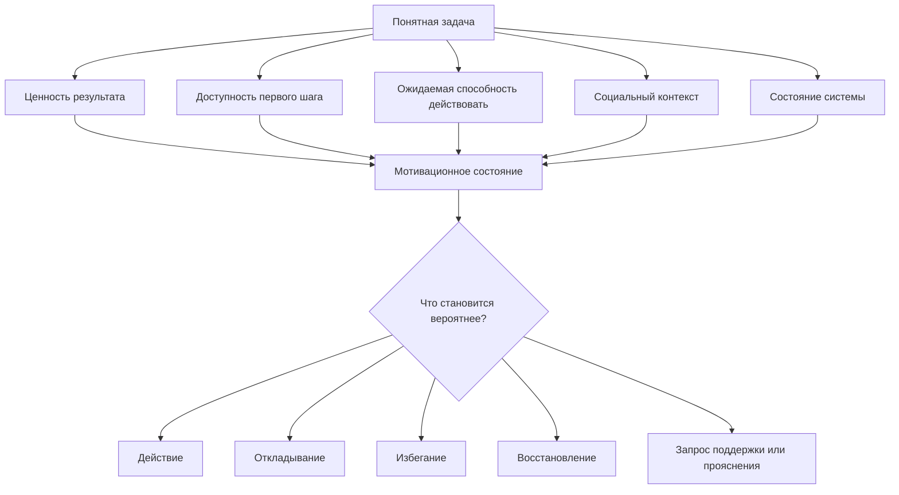

# Глава 7. Мотивация — это не желание

## Почему после внешнего контура нужна мотивация

Первые шесть глав дали нам внешний контур мышления.

Теперь сложная задача может быть вынесена из головы. У нее есть контекст, рабочий журнал, ритуал входа, рабочий блок, ритуал выхода и контрольная точка. Это уже серьезное изменение: задача меньше зависит от свежести памяти, настроения и случайного "я вроде помню, где остановился".

Но внешний контур не решает все.

Можно открыть рабочий журнал, увидеть цель, прочитать контрольную точку, понять следующий шаг — и все равно не начать.

Не потому, что запись плохая. Не потому, что человек "ленивый". Не потому, что метод не работает. Просто мы подошли к другой части системы.

Внешний контур может помогать удерживать состояние мысли. Он может снижать цену повторного входа и делать задачу видимой. Но действие запускается не только из ясности. Чтобы человек начал и удержал действие, система должна оценить несколько вещей:

- зачем это делать;
- что здесь ценно;
- что здесь опасно;
- могу ли я повлиять на исход;
- какой шаг реально доступен;
- сколько это будет стоить сейчас;
- что будет с отношениями, статусом, телом и будущим состоянием после действия.

Если ответ на один из этих вопросов неблагоприятен, понятная задача может оставаться неподвижной.

Поэтому следующий блок учебника — мотивационный.

Он нужен не для того, чтобы "научиться себя мотивировать" в бытовом смысле. Нас интересует другое: как устроена система, которая выбирает между действием, откладыванием, избеганием, контролем, восстановлением и отказом от шага.

Первая ошибка, которую нужно убрать сразу:

```text
мотивация = хочется
```

Это слишком бедная модель.

## Почему "хочется" не объясняет действие

В бытовом языке мотивацией часто называют желание.

```text
Есть мотивация — хочется делать.
Нет мотивации — не хочется делать.
```

Иногда это похоже на правду. Хочется читать интересную книгу, играть, собирать новый проект, спорить с увлекательной задачей. Не хочется писать неприятное письмо, разбирать старый долг, открывать сложный документ, идти в конфликтный разговор.

Но как только мы смотрим на реальную работу, модель быстро ломается.

### Человек может хотеть результата, но не начинать

Разработчик хочет закрыть сложный дефект. Лиду важно подготовить сильный план. Студент хочет сдать экзамен. Автор хочет закончить текст.

Результат важен. Но действие не запускается.

Причина может быть не в отсутствии желания, а в другом:

- первый шаг слишком широкий;
- задача угрожает самооценке;
- непонятно, что считать продвижением;
- человек не верит, что его действие изменит исход;
- тело уже в усталости;
- социальная цена ошибки слишком высока.

В такой ситуации фраза "ты просто недостаточно хочешь" не помогает. Она закрывает диагностику.

### Человек может не хотеть процесса, но делать

Многие важные действия неприятны в моменте.

Не хочется идти на тренировку, но человек идет. Не хочется делать скучную проверку, но инженер делает ее, потому что от нее зависит надежность. Не хочется начинать сложный разговор, но руководитель начинает, потому что молчание разрушает команду сильнее.

Здесь действие запускается не из приятного желания. Оно запускается из ценности, ответственности, привычки, внешнего обязательства, профессионального стандарта, заботы о будущем или понимания цены бездействия.

Если считать мотивацией только желание процесса, значительная часть зрелого поведения окажется "немотивированной". Это странно.

### Человек может действовать, чтобы снизить угрозу

Есть еще один случай: действие начинается не потому, что результат привлекает, а потому что бездействие пугает.

Человек готовит доклад не из интереса к теме, а чтобы не выглядеть слабым. Помогает всем подряд не из свободной щедрости, а чтобы не оказаться отвергнутым. Контролирует каждую мелочь не потому, что видит лучший путь, а потому что плохо переносит ощущение бессилия.

Снаружи это может выглядеть как высокая мотивация. Внутри это может быть защита.

Поэтому видимое действие тоже не доказывает, что мотивация устроена здорово. Иногда человек много делает не потому, что идет к ценности, а потому что бежит от угрозы.

Нам нужна модель, которая видит все эти случаи.

## Рабочее определение мотивации

В этом учебнике мотивация — это не отдельное чувство и не внутренний тумблер.

Мотивация — это временная конфигурация системы, которая делает действие более или менее вероятным.

Проще:

```text
мотивационное состояние = как сейчас система оценивает смысл, доступность, риск, управляемость и цену действия
```

Такое определение не пытается измерить мотивацию одной цифрой. Оно нужно для диагностики.

Когда действие не запускается, мы не спрашиваем сразу:

```text
почему я такой несобранный?
```

Мы спрашиваем точнее:

```text
какой параметр системы делает действие недоступным?
```

Для первого прохода нам нужна первичная рабочая формула:

```text
мотивация = ценность + потребности + доступность шага + ожидаемая способность действовать + социальный контекст + состояние системы
```

Позже мы добавим угрозу, избегание, управляемость, цену усилия, усталость, привычки и нейрофизиологический слой. Сейчас важно собрать входную карту.

## Схема мотивационного запуска

Понятная задача — только начало. Она входит в систему оценки.

Вопрос схемы: почему даже понятная и важная задача может не запуститься прямо сейчас.



Схему нужно читать так.

Сначала есть задача. Она может быть хорошо описана: цель ясна, факты собраны, контрольная точка оставлена. Но дальше система оценивает не только "что делать". Она оценивает, стоит ли действие текущей цены и есть ли у человека рабочий вход.

Если ценность видна, шаг доступен, человек ожидает, что способен повлиять на исход, социальная среда не делает задачу чрезмерно опасной, а состояние системы допускает усилие, действие становится вероятнее.

Если хотя бы один узел дает сильный отрицательный сигнал, система может выбрать другое:

- отложить;
- уйти в более безопасную задачу;
- начать бесконечную подготовку;
- попросить помощи;
- восстановиться;
- уточнить контекст;
- отказаться от действия как неактуального или неуправляемого.

Это не всегда плохо. Иногда отказ от действия — правильный результат диагностики. Когнитивное инженерство не должно превращаться в машину самопродавливания.

## Параметры мотивационного состояния

Разложим схему на рабочие параметры.

| Параметр | Главный вопрос | Если параметр проседает |
| --- | --- | --- |
| Ценность | Зачем это делать? Что здесь важно? | Задача выглядит чужой, пустой или навязанной. |
| Потребности | Поддерживает ли задача автономию, компетентность, связь, смысл, влияние? | Действие может ощущаться как давление, бессилие или социальный риск. |
| Доступность шага | Что именно можно сделать сейчас? | Цель важна, но вход размыт. |
| Ожидаемая способность | Верю ли я, что смогу выполнить действие и повлиять на исход? | Усилие кажется расходом в пустоту. |
| Социальный контекст | Что это действие меняет в отношениях, статусе, доверии, ответственности? | Ошибка или несогласие становятся слишком дорогими. |
| Состояние системы | Хватает ли внимания, сна, восстановления, окна нагрузки? | Даже понятный шаг ощущается чрезмерным. |

Эта таблица не заменяет будущие главы. Она дает первую диагностическую карту.

Параметры не независимы.

Низкая управляемость повышает цену усилия. Угроза ухудшает доступность шага. Плохое состояние тела усиливает ощущение угрозы. Социальный контекст может одновременно повышать ценность и делать ошибку болезненной.

Поэтому в реальности мотивация редко ломается в одном месте. Обычно проседает связка.

## Ценность: почему задача вообще имеет вес

Первый слой мотивации — ценность.

Ценность отвечает на вопрос:

```text
почему этот результат имеет значение?
```

Значение может быть разным:

- предметным: задача улучшит систему;
- профессиональным: это часть роли;
- учебным: через нее растет компетентность;
- социальным: от нее зависит команда или отношения;
- статусным: она влияет на доверие и репутацию;
- защитным: она снижает риск;
- смысловым: она связана с тем, каким человеком я хочу быть.

У David McClelland полезно брать не ярлыки людей, а саму идею разных мотивационных областей. Человека может притягивать достижение, принадлежность, влияние; его может активно организовывать и избегание угрозы. Это не четыре типа личности. Это разные области ценности и риска.

Одна задача может включать несколько ценностей сразу.

Например, подготовить архитектурное решение:

- достижение: сделать сильную, ясную конструкцию;
- принадлежность: не потерять контакт с командой;
- влияние: изменить техническое направление;
- безопасность: не заложить опасное решение.

Если видеть только одну ценность, легко ошибиться. Можно сказать: "Мне просто важно качество", хотя на самом деле страшно потерять доверие. Или: "Мне неинтересна эта задача", хотя проблема не в интересе, а в ощущении бессилия.

Дальше мы развернем эти области подробно. Сейчас важно одно: ценность не сводится к слову "хочу".

## Потребности и качество регуляции

Даже когда ценность понятна, остается другой вопрос:

```text
как человек включен в действие?
```

В теории самодетерминации Ryan и Deci важны три базовые психологические потребности:

- автономия;
- компетентность;
- связанность.

Для нашего учебника это не три магических слова. Это способ понять качество мотивации.

Поздние обзоры SDT уточняют важную для нас деталь: важны не только удовлетворенные потребности, но и их фрустрация. Человек может не просто "не получать автономии", а переживать давление; не просто "не чувствовать компетентности", а получать от среды постоянный сигнал бессилия; не просто "не иметь связанности", а чувствовать изоляцию или угрозу месту среди людей. Для когнитивного инженерства это существенно: мы проектируем не вдохновляющую речь, а условия, в которых действие не превращается в защиту от среды.

### Автономия

Автономия означает не "делаю что хочу". Это ощущение, что действие внутренне принято, что человек понимает смысл шага и не переживает себя только объектом давления.

Задача может быть внешне заданной и при этом автономно принятой:

```text
я не выбирал саму необходимость, но понимаю смысл и согласен с направлением
```

И наоборот, задача может быть формально личной, но переживаться как внутренний нажим:

```text
я должен доказать, иначе со мной что-то не так
```

В первом случае мотивация обычно устойчивее. Во втором она легче превращается в угрозу.

### Компетентность

Компетентность в SDT — это потребность чувствовать, что взаимодействие со средой не бессмысленно, что навыки могут расти, а действия получают понятную обратную связь.

Это близко к теме самоэффективности, но не то же самое.

Компетентность как потребность говорит:

```text
мне важно чувствовать, что я могу становиться эффективнее в этой среде
```

Самоэффективность у Bandura говорит более конкретно:

```text
верю ли я, что способен выполнить это действие и справиться с этой ситуацией
```

Обе линии важны, но смешивать их нельзя.

### Связанность

Связанность — это не приятное общение поверх "настоящей" мотивации. Baumeister и Leary показывают принадлежность как фундаментальную человеческую потребность.

Для работы это означает простую вещь: социальная среда входит в мотивацию не как украшение.

Если задача угрожает принадлежности, признанию, доверию или месту среди людей, она становится дороже. Человек может откладывать не саму задачу, а возможное социальное последствие.

Например:

```text
если я задам вопрос, меня сочтут некомпетентным
если я не соглашусь, я испорчу отношения
если я признаю ошибку, доверие ко мне снизится
```

Такой человек может выглядеть "немотивированным", хотя на деле система защищает принадлежность.

## Ценность не равна доступности действия

Одна из самых частых ошибок:

```text
если цель важна, действие должно начаться
```

Не должно.

Ценность отвечает на вопрос:

```text
зачем?
```

Доступность действия отвечает на другой вопрос:

```text
что именно можно сделать сейчас?
```

Между ними большая разница.

Цель:

```text
улучшить архитектуру сервиса
```

может быть важной, но недоступной как первый шаг.

Доступный шаг:

```text
за 30 минут выписать три места, где текущая архитектура создает повторяющиеся ошибки
```

или:

```text
сравнить два варианта изменения по одному ограничению: миграционный риск
```

Действие становится доступнее, когда оно:

- достаточно маленькое;
- проверяемое;
- связано с текущим контекстом;
- имеет понятный критерий завершения;
- допускает ошибку или корректировку;
- не требует сразу решить всю задачу;
- дает обратную связь.

Это место напрямую связывает мотивационный блок с главами 4-6.

Контекст задачи, рабочий журнал и ритуал входа не создают ценность сами по себе. Но они могут повышать доступность действия. Они помогают превратить большое "надо разобраться" в первый проверяемый шаг.

Если ценность есть, а действие недоступно, часто помогает не "добавить мотивации", а сузить вход.

## Ожидаемая способность действовать

Следующий параметр — ожидаемая способность.

Человек может видеть ценность и даже понимать первый шаг, но не верить, что способен выполнить его достаточно хорошо или что действие повлияет на исход.

У Bandura это поле описывается через самоэффективность: ожидание собственной способности организовать и выполнить действия, необходимые для результата.

Для нас важно не превращать это в общую "уверенность в себе".

Самоэффективность всегда конкретнее:

```text
могу ли я разобраться с этим классом задач?
могу ли я задать этот вопрос?
могу ли я выдержать эту обратную связь?
могу ли я сделать маленькую проверку, даже если полное решение пока не ясно?
```

Если самоэффективность низкая, действие становится дороже. Человек ожидает, что усилие не даст результата или приведет к болезненному подтверждению неспособности.

Тогда появляются знакомые формы:

- бесконечно готовиться;
- ждать "нормального состояния";
- выбирать более безопасные задачи;
- спорить о постановке вместо проверки;
- просить еще контекста, хотя первый шаг уже возможен;
- делать работу слишком широко, чтобы не столкнуться с конкретной оценкой.

Управляемость и ожидаемую способность действовать мы подробно разберем дальше. Сейчас нужен мост:

```text
ценная задача не запускается, если человек не ожидает, что его действие может иметь эффект
```

## Социальный контекст как часть мотивации

Работа почти никогда не происходит в пустоте.

Даже одиночная интеллектуальная задача часто связана с людьми:

- кто поставил задачу;
- кто будет смотреть результат;
- кто может помочь;
- кто может осудить;
- кому придется объяснять решение;
- чье доверие может вырасти или снизиться;
- какие ожидания закрепятся после действия.

Поэтому социальный контекст может усиливать или блокировать действие.

Один и тот же технический шаг воспринимается по-разному:

```text
проверить гипотезу в спокойной исследовательской среде
```

и:

```text
проверить гипотезу, когда каждая ошибка будет использована как доказательство некомпетентности
```

Во втором случае задача не просто техническая. Она становится социальным экзаменом.

Это важно для лидерства. Нельзя рассуждать о мотивации сотрудников так, будто у человека внутри есть ручка "хочет / не хочет". Среда постановки задачи, обратная связь, право на вопрос, безопасность ошибки и признание вклада меняют мотивационное состояние.

В хорошем контексте человек чаще может сказать:

```text
мне понятно, зачем это нужно
я могу задать вопрос
ошибка даст данные, а не только стыд
мой вклад виден
у меня есть пространство повлиять на результат
```

В плохом контексте даже ценная задача становится дорогой.

## Состояние системы

Последний параметр этой главы — состояние системы.

Пока достаточно простой мысли:

```text
мотивация зависит не только от смысла задачи, но и от текущего состояния организма
```

Недосып, длительное напряжение, сенсорный перегруз, конфликт, боль, голод, тревога, усталость после серии переключений — все это меняет доступность действия.

Это не означает, что человек полностью определяется состоянием. Но состояние меняет цену входа.

Одна и та же задача утром после нормального сна и вечером после десяти часов встреч — не одна и та же задача для системы действия.

На бумаге она та же:

```text
написать техническое решение
```

Для организма это может быть два разных режима:

```text
есть внимание, терпимость к неопределенности, способность держать модель
```

или:

```text
любой новый фрагмент кажется перегрузом, ошибка пугает сильнее, первый шаг распадается
```

В главе 11 мы подробно разберем цену усилия, усталость и ощущаемую энергию. Сейчас нужно только убрать моральную ошибку:

```text
если действие не запускается в плохом состоянии, это не автоматически слабость характера
```

Иногда правильное вмешательство — не усилить давление, а снизить цену входа, дать восстановление, уменьшить шаг или вернуть безопасность.

## Пример: задача понятна, но не начинается

Возьмем обезличенную инженерную ситуацию.

Есть задача: разобраться, почему объект иногда остается в промежуточном состоянии после внешнего вызова.

После предыдущего блока человек оставил хорошую контрольную точку:

```markdown
Сделал: проверил документацию внешнего API и код клиента.
Узнал: внешний API не обещает идемпотентность по текущему идентификатору.
Исключил: безопасный простой ретрай без дополнительной защиты.
Остановился: нужно выбрать между компенсацией промежуточного состояния и добавлением идемпотентного ключа.
Дальше: составить два варианта исправления и сравнить их по риску для уже зависших объектов.
```

На следующий день задача не начинается.

С точки зрения внешнего контура все хорошо:

- задача есть;
- текущая модель сохранена;
- следующий шаг понятен;
- рабочий блок можно начать.

Но человек ходит вокруг. Открывает почту. Проверяет мелкие задачи. Еще раз перечитывает документацию. Пишет черновик, стирает. Откладывает.

Плохая диагностика:

```text
нет мотивации
```

Рабочая диагностика:

| Параметр | Что видно |
| --- | --- |
| Ценность | Высокая: задача влияет на надежность и доверие к системе. |
| Доступность шага | Средняя: следующий шаг понятен, но требует сравнить два неприятных варианта. |
| Ожидаемая способность | Снижена: кажется, что без владельца внешней системы решение может быть неверным. |
| Социальный контекст | Напряженный: если выяснится, что текущий дизайн был ошибочным, это затронет прошлые решения. |
| Состояние системы | Плохое: недосып и серия встреч снизили терпимость к неопределенности. |
| Угроза | Высокая: можно вскрыть архитектурный долг и получить конфликт вокруг ответственности. |

Теперь видно, что проблема не в отсутствии желания. Проблема в сочетании:

```text
ценность высокая + угроза высокая + управляемость снижена + состояние плохое
```

Что можно сделать инженерно?

Не "заставить себя решить задачу", а изменить вход:

```text
не выбирать финальное решение;
составить таблицу двух вариантов без решения;
отдельно выписать вопросы владельцу внешней системы;
ограничить блок 30 минутами;
после блока зафиксировать только различия и неизвестные места.
```

Так действие может стать меньше, обратимее и управляемее.

Задача не исчезла. Но первый шаг перестал требовать героического входа.

## Минимальная диагностика мотивации

Когда действие не запускается, используйте короткий протокол.

### 1. Что здесь ценно?

Не отвечайте общим словом "надо".

Лучше:

```text
это снижает риск инцидента
это даст мне понимание системы
это поможет команде договориться
это закроет долг, который постоянно возвращается
```

Если ценность не удается сформулировать, возможно, задача действительно чужая, устаревшая или плохо связана с целями.

### 2. Что здесь угрожает?

Угроза может быть неочевидной:

```text
провал
стыд
конфликт
потеря статуса
перегруз
невозможность закончить
разочарование после усилия
```

Называние угрозы не делает человека слабее. Оно возвращает точность.

### 3. Какой шаг доступен сейчас?

Не "решить задачу", а действие, после которого что-то станет яснее.

```text
выписать неизвестные места
сравнить два варианта по одному критерию
сформулировать вопрос
проверить одну гипотезу
прочитать один нужный фрагмент документации
```

### 4. Верю ли я, что могу повлиять на исход?

Если ответ "нет", нужно искать рычаг:

```text
какая часть исхода зависит от меня?
какая обратная связь покажет эффект?
какой ресурс нужен?
какой человек может снять блокер?
какое решение я не имею права принимать один?
```

### 5. Что с состоянием системы?

Иногда честный ответ:

```text
сейчас не время для тяжелой когнитивной работы
```

Тогда возможны другие действия:

- оставить короткую контрольную точку;
- сделать подготовительный шаг;
- перенести сложный блок;
- восстановиться;
- снизить размер входа;
- попросить помощь;
- не открывать тяжелую задачу в заведомо плохом окне.

## Как мотивационная диагностика связана с рабочим журналом

Рабочий журнал можно расширить маленьким мотивационным блоком. Не всегда. Только когда задача застряла.

Пример:

```markdown
## Почему не начинаю

- Что здесь ценно:
- Что здесь угрожает:
- Первый доступный шаг:
- Что повысит управляемость:
- Что с состоянием:
```

Это не психотерапевтический дневник. Это рабочая диагностика входа в задачу.

Ее задача — не подробно описывать переживания, а найти параметр, который делает действие недоступным.

Например:

```markdown
## Почему не начинаю

- Что здесь ценно: снизить риск зависших объектов и закрыть повторяющийся дефект.
- Что здесь угрожает: если простой ретрай невозможен, придется признать архитектурный долг.
- Первый доступный шаг: не решать, а составить таблицу двух вариантов исправления.
- Что повысит управляемость: вопрос владельцу внешнего API про идемпотентность.
- Что с состоянием: после встреч не брать полный блок, сделать 25 минут.
```

После такой записи следующий шаг часто становится мягче:

```text
составить таблицу вариантов, не выбирать решение
```

Это и есть когнитивное инженерство: не спорить с состоянием общими словами, а менять форму входа.

## Что делать с внешней мотивацией

Нужно отдельно сказать о внешней мотивации.

В популярной культуре часто звучит упрощение:

```text
внутренняя мотивация хорошая, внешняя плохая
```

Так писать нельзя.

Внешние требования, дедлайны, роли, деньги, обязательства, ожидания команды и стандарты профессии реальны. Они могут быть разрушительными, если переживаются как давление без смысла, автономии и управляемости. Но они могут быть нормально встроены в действие, если человек понимает их смысл, принимает рамку и видит свою роль.

Разница не только в том, "изнутри" или "снаружи" пришла задача. Разница в качестве регуляции:

| Ситуация | Как переживается действие | Что будет с мотивацией |
| --- | --- | --- |
| Внешний нажим без смысла | "Меня заставляют, я объект давления." | Сопротивление, избегание, формальное выполнение. |
| Внешняя задача с принятым смыслом | "Это не я придумал, но я понимаю зачем и согласен с ролью." | Действие обычно устойчивее. |
| Внутренний интерес | "Мне интересно разобраться и увидеть результат." | Высокая вовлеченность, если цена действия не разрушительна. |
| Внутренний нажим | "Я обязан доказать, иначе со мной что-то не так." | Может дать усилие, но дорого и нестабильно. |

Такой взгляд защищает от двух ошибок:

- романтизировать только внутренний интерес;
- считать любое внешнее обязательство насилием над мотивацией.

В реальной взрослой работе мотивация часто смешанная. Человек делает задачу потому, что она нужна команде, входит в роль, поддерживает его компетентность, снижает риск и дает чувство влияния.

Наша задача — не найти "чистую" мотивацию, а понять, какие условия делают действие устойчивым и неразрушительным.

## Мини-практика

Выберите задачу, которая понятна, но не начинается.

Не берите самую тяжелую жизненную проблему. Лучше взять рабочую, учебную или личную задачу среднего размера.

Заполните таблицу.

| Вопрос | Ответ |
| --- | --- |
| Что здесь ценно? |  |
| Что здесь угрожает? |  |
| Какой первый шаг доступен за 20-40 минут? |  |
| Верю ли я, что этот шаг может что-то изменить? |  |
| Какая обратная связь покажет продвижение? |  |
| Что с состоянием системы? |  |
| Как снизить цену входа без отказа от задачи? |  |

После этого сформулируйте не план всей задачи, а только следующий рабочий блок:

```markdown
## Следующий блок

- Цель блока:
- Один проверяемый шаг:
- Что должно стать яснее:
- Что я не пытаюсь решить в этом блоке:
- Контрольная точка после блока:
```

Последняя строка важна. Мотивационная диагностика должна возвращаться в действие, а не превращаться в бесконечный самоанализ.

## Мини-словарь главы

| Понятие | Рабочее определение |
| --- | --- |
| Мотивация | Временная конфигурация системы, которая делает действие более или менее вероятным. |
| Мотивационное состояние | Оценка ценности, угрозы, доступности шага, управляемости, социальной цены и состояния системы. |
| Желание | Переживание привлекательности результата или процесса. Может поддерживать действие, но не исчерпывает мотивацию. |
| Ценность | Значимость результата для задачи, роли, отношений, мастерства, безопасности или смысла. |
| Доступность шага | Насколько понятно, что можно сделать сейчас и как увидеть продвижение. |
| Самоэффективность | Ожидание, что я способен выполнить действие и справиться с ситуацией. |
| Автономия | Ощущение, что действие принято и имеет смысл, а не только навязано давлением. |
| Компетентность | Потребность чувствовать, что действие может становиться эффективнее и получать обратную связь. |
| Связанность | Потребность в принадлежности, контакте и признании, которая влияет на цену социальных действий. |

## Вопросы для самопроверки

1. Почему понятная задача может не запускаться?
2. Чем желание отличается от мотивационного состояния?
3. Почему высокая ценность результата не гарантирует действие?
4. Что меняется, если смотреть на мотивацию через доступность первого шага?
5. Почему социальный контекст входит в мотивацию?
6. Чем компетентность в теории самоопределения отличается от самоэффективности у Bandura?
7. В каком случае лучше снижать цену входа, а не "добавлять мотивации"?

## Короткое резюме

1. Мотивация — не синоним желания.
2. Действие зависит от ценности, доступности шага, ожидаемой способности, социального контекста и состояния системы.
3. Ценная задача может не запускаться, если первый шаг не доступен или действие кажется неуправляемым.
4. Внешний контур мышления может снижать цену входа, но не отменяет мотивационную систему.
5. Принадлежность, автономия и компетентность — не декоративные темы, а условия устойчивой регуляции.
6. Самоэффективность — не общая самооценка, а ожидание способности справиться с конкретным действием.
7. Внешняя мотивация не всегда вредна, а внутренняя не всегда здорова: важно качество регуляции.
8. Когда действие не начинается, полезнее диагностировать параметр системы, чем обвинять себя в лени.

## Источниковая опора

Проверенный пакет для этой главы: [[../Источники/2026-05-24 Пакет источников для мотивационного блока 7-11]].

Ключевые источники в авторско-годовой форме:

- McClelland (1987/1988): мотивы как разные области ценности, внимания и оценки успеха.
- Ryan & Deci (2000, 2017, 2020), Deci & Ryan (2000), Vansteenkiste, Ryan & Soenens (2020), Ryan (Ed.) (2023): теория самодетерминации, базовые потребности автономии, компетентности и связанности, фрустрация потребностей и качество регуляции.
- Baumeister & Leary (1995): принадлежность как фундаментальная человеческая потребность.
- Bandura (1977, 1997): самоэффективность как ожидание способности действовать и справляться.
- Morris et al. (2022): современный обзор внутренней и внешней мотивации и осторожный мост к нейробиологическим вопросам.
- Внутренние материалы vault по мотивации: контекст постановки задачи, ближайший шаг, обратная связь и различение распада прогноза от перегруза.

Доказательная роль блока: теоретическая сборка для разведения мотивации и желания; `strong` для базовых различений самоэффективности, базовых психологических потребностей и принадлежности; `context-dependent` для переноса этих рамок в инженерную диагностику конкретной задачи. Глава не подает ни одну теорию мотивации как полное объяснение действия.

Полные библиографические записи и DOI сохранены в пакете мотивационного блока. В текущей редакции глава оставляет короткий авторско-годовой блок как читательский ориентир.

## Переход к следующей главе

Мотивация теперь описана как система параметров. Но один параметр остался слишком общим: ценность.

Сказать "задача ценна" недостаточно. Ценность бывает разной. Одно действие важно как рост мастерства, другое как принадлежность, третье как влияние на ситуацию, четвертое как безопасность и защита от вреда.

Дальше мы разложим мотивацию по четырем областям:

```text
достижение -> принадлежность -> влияние -> безопасность
```

Это поможет увидеть, почему одна и та же задача может одновременно притягивать и пугать.

## Статус

`ready-for-review`

Следующий шаг: при финальной редактуре удержать главу как мост от внешнего контура к мотивационной модели, а не как обзор всех теорий мотивации. Блок 7-11 проверен в [[../Проверки/2026-05-25 Ревизия блока 7-11]].
