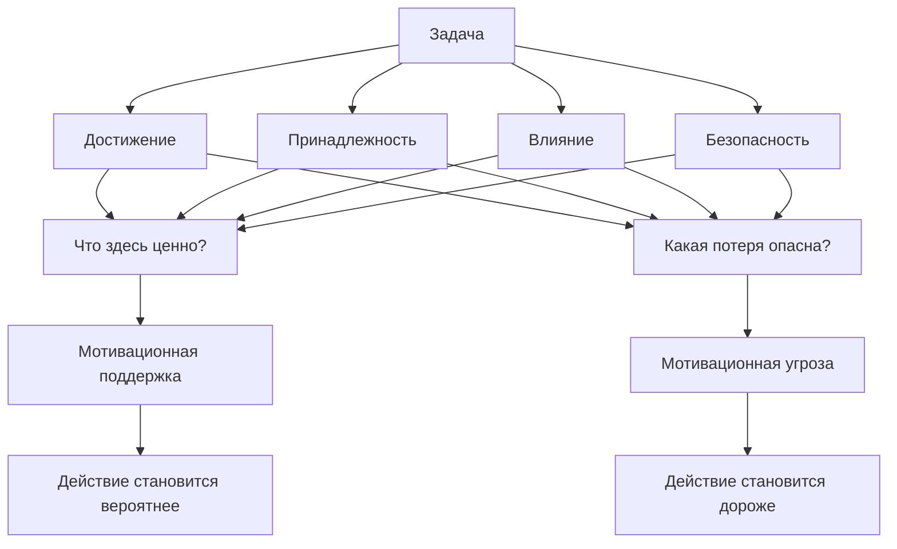

# Глава 8. Четыре области мотивации

## От ценности к карте ценностей

В прошлой главе мы разобрали мотивацию как систему параметров. Один из них — ценность.

Но слово "ценность" пока слишком широкое.

Когда мы говорим:

```text
задача для меня важна
```

это еще не объясняет, чем именно она важна.

Одна задача может быть важна потому, что через нее растет мастерство. Другая — потому что от нее зависит связь с людьми. Третья — потому что она дает возможность повлиять на ситуацию. Четвертая — потому что снижает риск и защищает от ущерба.

Иногда одна и та же задача включает все это сразу.

Например, подготовить архитектурное решение:

- важно сделать его качественно;
- важно, чтобы команда поняла и приняла ход мысли;
- важно изменить техническое направление;
- важно не заложить риск, который потом ударит по системе.

Если все это назвать одним словом "важно", мы потеряем структуру мотивации. А без структуры труднее понять, почему человек иногда одновременно хочет войти в задачу и избегает ее.

Для этого введем четыре рабочие области мотивации:

```text
достижение -> принадлежность -> влияние -> безопасность
```

Это не типы людей. Это области ценности, которые могут включаться в разных задачах, ролях и состояниях.

## Почему это не типология людей

Самая опасная ошибка главы:

```text
этот человек про достижение
этот человек про принадлежность
этот человек про влияние
этот человек про безопасность
```

Так делать нельзя.

Человек не живет в одной области. У него есть разные мотивы, разные роли, разный опыт и разные состояния. В одной ситуации он может быть чувствителен к качеству результата, в другой — к отвержению, в третьей — к бессилию, в четвертой — к риску перегруза.

Даже внутри одной задачи могут работать несколько областей.

Если руководитель готовит сложный разговор с сотрудником, там может быть:

- достижение: провести разговор профессионально;
- принадлежность: не разрушить доверие;
- влияние: изменить поведение или договоренность;
- безопасность: не усилить конфликт и не оставить токсичный риск висеть.

Если назвать его "человеком влияния", мы потеряем принадлежность. Если назвать "человеком безопасности", потеряем профессиональный стандарт. Если сказать "просто не хочет разговаривать", потеряем весь механизм.

Поэтому в этой главе область мотивации — это не ярлык личности, а вопрос:

```text
какая ценность сейчас делает задачу значимой?
```

и второй вопрос:

```text
какая потеря в этой области делает задачу опасной?
```

## Что такое область мотивации

Область мотивации — это тип ценности, который меняет внимание, критерий успеха и чувствительность к угрозе.

Проще:

```text
область мотивации показывает, что для человека здесь особенно важно сохранить, получить, развить или защитить
```

У каждой области есть две стороны:

- притягательная: что человек хочет получить или построить;
- уязвимая: какую потерю он особенно болезненно ожидает.

Например, в области достижения притягивает мастерство, качество и рост. Уязвимость — провал, бессмысленное усилие, потеря ощущения компетентности.

В области принадлежности притягивает связь и принятие. Уязвимость — отвержение, стыд, выпадение из группы.

В области влияния притягивает способность менять ситуацию. Уязвимость — бессилие, потеря веса, невозможность воздействовать.

В области безопасности притягивает защита, предсказуемость и сохранение ресурса. Уязвимость — ошибка, боль, перегруз, разрушение.

Есть и более специализированные модели социальных мотивов. Например, Zurich model of motivation описывает социальную динамику через потребности безопасности, активации и власти, а также через поведение приближения и дистанции. Для учебника это полезно как напоминание: социальные мотивы не исчерпываются приятной принадлежностью. В отношениях с людьми есть и поиск близости, и защита от угрозы, и статусно-властная динамика, и потребность чувствовать возможность влиять. Но эта модель остается вспомогательной. Наша четверка областей нужна как рабочая карта диагностики задачи, а не как новая теория личности.

Вопрос схемы: какие виды ценности и угрозы задача включает прямо сейчас.

Это не схема типов людей. Один и тот же человек в разных задачах может действовать из мастерства, принадлежности, влияния, безопасности или из их конфликта.



Эта схема не говорит, что все четыре области всегда равны. Она говорит другое: чтобы понять мотивационное состояние, нужно увидеть не только "сколько важности", но и "какого типа важность".

Читать ее нужно от задачи к двум вопросам: что здесь ценно и какая потеря опасна. Поддержка действия может появляться там, где область дает человеку смысл, связь, влияние или защиту. Угроза может появляться там, где та же область обещает провал, отвержение, бессилие или ущерб. Поэтому карта областей помогает не навесить ярлык на человека, а точнее описать задачу.

## Общая карта четырех областей

| Область | Главный вопрос | Что поддерживает действие | Что делает действие опасным |
| --- | --- | --- | --- |
| Достижение | Получится ли сделать лучше, освоить, вырасти? | Ясный стандарт, умеренная трудность, обратная связь, видимый прогресс. | Провал, бессмысленное усилие, размытый критерий, невозможность улучшиться. |
| Принадлежность | Останусь ли я в связи, доверии и принятии? | Поддержка, честная обратная связь, право на вопрос, надежность отношений. | Отвержение, стыд, выпадение из группы, потеря контакта. |
| Влияние | Могу ли я изменить ситуацию и иметь вес? | Полномочия, рычаг действия, возможность предлагать и менять рамку. | Бессилие, хаос, контроль без влияния, ответственность без рычага. |
| Безопасность | Не станет ли хуже? Что нужно защитить? | Предсказуемость, допустимый риск, границы нагрузки, защита от ущерба. | Ошибка, боль, перегруз, наказание, разрушение, непереносимый риск. |

Эта таблица полезна как диагностический инструмент.

Если действие не запускается, можно спросить:

```text
какая область делает задачу ценной?
какая область делает задачу опасной?
какая область сейчас не получает поддержки?
какую область я не замечаю?
```

## Достижение: мастерство, качество и рост

Область достижения включается там, где человеку важны результат, мастерство, сложность, качество и рост компетентности.

Ее центральный вопрос:

```text
смогу ли я сделать лучше, понять глубже, приблизиться к сильному уровню?
```

Это не обязательно карьеризм и не обязательно соревнование с другими. Человек может быть сильно мотивирован достижением в тихой исследовательской работе, в ремесле, в коде, в письме, в обучении, в настройке процесса.

Зрелое достижение ищет задачу, где есть вызов и обратная связь.

Слишком простая задача скучна: она не дает роста.

Задача, которая переживается как совсем невозможная, обычно не дает управляемого обучения.

Рабочая зона достижения — там, где трудно, но можно действовать, получать данные и становиться сильнее.

### Что поддерживает достижение

Достижение поддерживают:

- понятный критерий качества;
- умеренная трудность;
- видимый прогресс;
- обратная связь по работе, а не по личности;
- возможность улучшить следующий подход;
- право на черновик, ошибку и повтор.

В инженерной работе это особенно видно.

Задача "разобраться с flaky-тестом" может быть мотивирующей, если есть возможность проверить гипотезу, увидеть результат, сузить причину и почувствовать рост понимания.

Та же задача может стать демотивирующей, если критерий размытый, окружение нестабильно, прогресс не виден, а каждая неудачная попытка переживается как доказательство некомпетентности.

### Что угрожает достижению

Главные угрозы:

- провал;
- стыд за несовершенный результат;
- невозможность увидеть прогресс;
- бессмысленное усилие;
- слишком легкая задача без роста;
- слишком трудная задача без управляемости;
- оценка личности вместо оценки способа действия.

Здесь не нужно морализировать.

Если человек откладывает задачу, где возможен провал, это не обязательно отсутствие мотива достижения. Иногда наоборот: достижение слишком важно, и поэтому проверка способности становится страшной.

Дальше станет видно, как достижение может перейти в режим избегания провала. Сейчас достаточно видеть: достижение — это область ценности, а не гарантия смелого действия.

## Принадлежность: связь, принятие и надежность отношений

Область принадлежности включается там, где человеку важны связь, принятие, доверие, совместность и место среди людей.

Ее центральный вопрос:

```text
я здесь принят, слышим, нужен, не один?
```

Это не "мягкая" тема поверх настоящей работы. Принадлежность влияет на внимание, обучение, готовность задавать вопросы, способность признавать незнание и переносить обратную связь.

Если человек чувствует, что ошибка не уничтожит его место в группе, ему обычно легче учиться. Если любой вопрос может стать поводом для стыда, задача становится дороже.

### Что поддерживает принадлежность

Принадлежность поддерживают:

- возможность задавать вопросы без унижения;
- честная, но не разрушающая обратная связь;
- ясность роли и ожиданий;
- признание вклада;
- надежность договоренностей;
- возможность быть неидеальным и оставаться "своим";
- культура, где ошибка является материалом работы, а не поводом для изгнания.

В командной работе принадлежность не означает бесконечное одобрение. Иногда честный конфликт лучше фальшивого мира. Но конфликт становится переносимым, если связь не ставится на карту целиком.

### Что угрожает принадлежности

Главные угрозы:

- отвержение;
- стыд;
- выпадение из группы;
- потеря доверия;
- холодное молчание после ошибки;
- невозможность попросить помощь;
- ощущение, что ценность человека зависит только от безошибочного результата.

Пример.

Инженер не задает уточняющий вопрос по задаче. Снаружи это может выглядеть как самостоятельность или уверенность. Внутри может быть страх:

```text
если я спрошу, все поймут, что я не должен быть на этом уровне
```

Тогда проблема не в отсутствии мотивации. Проблема в социальной цене вопроса.

Глава 7 уже ввела связанность как базовую потребность. Здесь мы видим, как она становится областью мотивации в конкретной задаче.

## Влияние: способность менять ситуацию

Область влияния включается там, где человеку важно воздействовать на ситуацию, иметь вес, менять ход событий, задавать направление, защищать границы и проводить решения.

Ее центральный вопрос:

```text
могу ли я здесь что-то изменить?
```

Здесь нужно важное уточнение.

В источниках McClelland используется мотив `power`. Но в учебнике мы говорим "влияние", потому что слово "власть" слишком легко сужает тему до доминирования над людьми.

Влияние шире.

| Понятие | Что это | Как соотносится с влиянием |
| --- | --- | --- |
| Власть | Формальная или неформальная возможность распоряжаться решениями и ресурсами. | Частный случай влияния. |
| Статус | Признанное положение в группе. | Может усиливать влияние, но не равен ему. |
| Контроль | Удержание параметров ситуации. | Может помогать влиянию, но может стать защитной попыткой убрать неопределенность. |
| Влияние | Способность воздействовать на ситуацию и менять траекторию событий. | Более широкая область мотивации. |

Человек может хотеть влияния не потому, что хочет подчинить других, а потому что плохо переносит бессмысленную пассивность. Ему важно видеть, что его действие меняет реальность.

### Что поддерживает влияние

Влияние поддерживают:

- ясные полномочия;
- право предлагать и оспаривать решения;
- доступ к информации;
- возможность менять приоритеты или рамку;
- доверие к роли;
- обратная связь, что действие действительно повлияло;
- пространство для ответственности без необходимости контролировать все.

В инженерной работе влияние проявляется не только в менеджменте.

Разработчик влияет, когда предлагает архитектурное упрощение, находит корень дефекта, меняет практику review, формулирует риск, останавливает небезопасный rollout, пишет документ, который меняет общее понимание.

### Что угрожает влиянию

Главные угрозы:

- бессилие;
- ответственность без полномочий;
- хаос, в котором действие не меняет исход;
- потеря веса;
- невозможность быть услышанным;
- контроль сверху без возможности влиять снизу;
- необходимость отвечать за результат, на который нельзя воздействовать.

Здесь легко спутать влияние с управляемостью из главы 10.

Управляемость — это параметр конкретного действия:

```text
может ли это действие изменить этот исход?
```

Влияние — это область ценности:

```text
важно ли мне вообще иметь возможность воздействовать на ситуацию?
```

Они связаны, но не одинаковы. Человек с сильной областью влияния может особенно болезненно переживать низкую управляемость, потому что она бьет по ценности "я могу менять ход событий".

## Безопасность: защита от ущерба и сохранение возможности действовать

Область безопасности включается там, где человеку важно не допустить вреда: системе, телу, отношениям, репутации, ресурсу, будущему состоянию, границам или жизненной устойчивости.

Ее центральный вопрос:

```text
не станет ли хуже и что нужно защитить?
```

Безопасность нельзя считать трусостью. Без нее человек шел бы в риск без оценки последствий, игнорировал усталость, ломал договоренности, подставлял систему и себя.

Но безопасность нужно отличать от избегания.

| Понятие | Что означает | Где раскрывается |
| --- | --- | --- |
| Безопасность | Область ценности: защита от ущерба, предсказуемость, сохранение ресурса. | Глава 8. |
| Избегание | Режим действия: уход, откладывание, замирание или замена действия для снижения угрозы. | Глава 9. |

Безопасность может вести к зрелому действию:

```text
проверить миграционный план
настроить откат
снизить объем параллельной работы
не брать тяжелую задачу в состоянии недосыпа
обозначить границу нагрузки
```

А может перейти в избегание:

```text
не начинать, потому что любой риск кажется непереносимым
```

Это разные вещи.

### Что поддерживает безопасность

Безопасность поддерживают:

- ясные ограничения;
- понятный риск;
- возможность отката;
- контроль нагрузки;
- право остановиться при опасном состоянии;
- границы ответственности;
- видимые критерии "достаточно безопасно";
- среда, где сообщение о риске не наказывается.

В инженерной работе безопасность часто выглядит как профессиональная зрелость: не выкатывать изменение без отката, не замалчивать риск, не брать больше параллельной работы, чем система выдержит, не путать смелость с безрассудством.

### Что угрожает безопасности

Главные угрозы:

- ошибка с большим ущербом;
- перегруз;
- наказание за честный сигнал о проблеме;
- неопределенность без рамки;
- невозможность остановить опасное действие;
- давление "надо быстрее" без учета последствий;
- состояние, где тело уже сигналит о пределе.

Если область безопасности игнорировать, продуктивность может превращаться в самоизнос.

Если область безопасности разрастается без проверки реальности, она может сжать жизнь до избегания.

Зрелая безопасность не запрещает риск. Она помогает сделать риск видимым и управляемым.

## Одна задача, четыре области

Возьмем пример из предыдущих глав: объект иногда остается в промежуточном состоянии после внешнего вызова.

С технической стороны задача звучит так:

```text
выбрать между компенсацией промежуточного состояния и добавлением идемпотентного ключа
```

Но мотивационно это не одна плоская задача.

| Область | Как задача становится ценной | Как она становится опасной |
| --- | --- | --- |
| Достижение | Хочется найти качественное, технически зрелое решение. | Можно ошибиться, выбрать слабую архитектуру, не разобраться глубоко. |
| Принадлежность | Важно не подвести команду и договориться с владельцами соседней системы. | Можно получить критику, конфликт, потерю доверия. |
| Влияние | Нужно изменить техническую траекторию и провести решение через обсуждение. | Можно оказаться без рычага, если решение зависит от других. |
| Безопасность | Нужно снизить риск зависших объектов и будущих инцидентов. | Можно сломать существующие данные, усилить долг или перегрузить команду. |

Теперь становится видно, почему человек может не входить в задачу, хотя она понятна.

Достижение тянет к качественному решению.

Безопасность требует осторожности.

Влияние требует провести изменение через людей и ограничения.

Принадлежность делает возможный конфликт дороже.

Внутри одной задачи возникает не один мотив, а несколько областей, которые могут поддерживать и тормозить друг друга.

## Как области конфликтуют

Мотивационный конфликт часто появляется не потому, что одна часть человека "хочет", а другая "ленится". Чаще сталкиваются разные ценности.

### Достижение против безопасности

Хочется сделать сильное, красивое решение. Но сильное решение может быть рискованным, дорогим или слишком масштабным для текущего состояния системы.

Вопрос:

```text
как сделать достаточно хорошо, не разрушая безопасность?
```

### Достижение против принадлежности

Хочется сказать правду о слабом решении. Но есть риск задеть человека, разрушить доверие или стать "тем, кто всегда критикует".

Вопрос:

```text
как дать точную обратную связь и сохранить контакт?
```

### Влияние против принадлежности

Хочется изменить курс, настоять на важном, остановить плохую идею. Но влияние может выглядеть как давление, и связь с людьми оказывается под угрозой.

Вопрос:

```text
как воздействовать на ситуацию без разрушения отношений?
```

### Влияние против безопасности

Хочется быстро провести изменение. Но безопасность требует замедлиться, проверить, поставить защитные ограничения, договориться об откате.

Вопрос:

```text
где скорость уже стала угрозой системе?
```

### Принадлежность против безопасности

Хочется быть удобным, не спорить, не обострять. Но безопасность требует сказать неприятную правду: нагрузка слишком высока, риск не закрыт, решение опасно.

Вопрос:

```text
какую границу нужно обозначить, чтобы сохранить систему и отношения в долгом горизонте?
```

Эти конфликты нельзя решать одной фразой "расставь приоритеты". Нужно увидеть, какие области реально включены.

## Как пользоваться картой областей

Карта областей нужна не для самонаблюдения ради самонаблюдения. Она нужна, когда задача стала мотивационно мутной.

Минимальный протокол:

```text
1. Назвать задачу.
2. Разложить, что в ней ценно по четырем областям.
3. Разложить, какая потеря пугает по четырем областям.
4. Найти область, которая поддерживает действие.
5. Найти область, которая делает действие опасным.
6. Сформулировать первый шаг, учитывающий обе стороны.
```

Форма для рабочего журнала:

```markdown
## Области мотивации

| Область | Что здесь ценно | Что здесь опасно |
| --- | --- | --- |
| Достижение |  |  |
| Принадлежность |  |  |
| Влияние |  |  |
| Безопасность |  |  |

Поддерживает действие:
Делает действие опасным:
Первый шаг с учетом карты:
```

Пример заполнения:

```markdown
## Области мотивации

| Область | Что здесь ценно | Что здесь опасно |
| --- | --- | --- |
| Достижение | Найти технически зрелое решение. | Ошибиться в архитектуре. |
| Принадлежность | Договориться с командой и соседней системой. | Получить конфликт или обвинение. |
| Влияние | Провести изменение, которое реально снизит дефект. | Не иметь полномочий на решение. |
| Безопасность | Не сломать существующие объекты и снизить инцидентный риск. | Сделать миграцию опаснее исходной проблемы. |

Поддерживает действие: достижение и безопасность.
Делает действие опасным: принадлежность и низкое влияние.
Первый шаг с учетом карты: составить два варианта решения и отдельный список вопросов к владельцу внешней системы, не выбирая финальный вариант в одиночку.
```

Так карта областей возвращает нас к инженерному действию. Она не говорит: "разберись в чувствах". Она говорит: "увидь, какие ценности и угрозы делают шаг тяжелым, и измени форму входа".

## Частые ошибки при использовании карты

### Ошибка 1. Искать главный мотив навсегда

Вопрос не в том, какой мотив у человека "главный по жизни".

Лучший вопрос:

```text
какая область активна в этой задаче сейчас?
```

### Ошибка 2. Считать одну область хорошей, другую плохой

Достижение не лучше принадлежности. Влияние не выше безопасности. Безопасность не ниже смелости. У каждой области есть зрелая и защитная форма.

### Ошибка 3. Считать принадлежность слабостью

Потребность в связи не делает человека менее профессиональным. Наоборот, многие сложные действия становятся доступнее, когда есть доверие, поддержка и право на ошибку.

### Ошибка 4. Считать влияние доминированием

Влияние может быть заботой о системе: поднять риск, сформулировать решение, защитить команду от лишней параллельной работы, провести сложное изменение.

### Ошибка 5. Считать безопасность избеганием

Безопасность — ценность защиты. Избегание — один из возможных режимов действия. Зрелая безопасность может вести к смелым, но аккуратным шагам.

## Мини-практика

Выберите задачу, в которой вы чувствуете смешанную реакцию: она важна, но вход в нее тяжелый.

Заполните таблицу.

| Область | Что я хочу получить, сохранить или развить? | Какая потеря здесь пугает? |
| --- | --- | --- |
| Достижение |  |  |
| Принадлежность |  |  |
| Влияние |  |  |
| Безопасность |  |  |

Затем ответьте:

```text
Какая область сильнее всего поддерживает действие?
Какая область сильнее всего тормозит действие?
Какая область была незаметна, пока я не разложил задачу?
Какой первый шаг учтет обе стороны: ценность и угрозу?
```

Не пытайтесь сразу решить конфликт всех областей. Достаточно найти более честный первый шаг.

## Мини-словарь главы

| Понятие | Рабочее определение |
| --- | --- |
| Область мотивации | Тип ценности, который меняет внимание, критерий успеха и чувствительность к угрозе. |
| Достижение | Область мастерства, качества, результата, роста и проверки компетентности. |
| Принадлежность | Область связи, принятия, доверия, совместности и места среди людей. |
| Влияние | Область способности менять ситуацию, задавать направление и видеть эффект своего действия. |
| Безопасность | Область защиты от ущерба, предсказуемости, границ нагрузки и сохранения возможности действовать. |
| Власть | Частный случай влияния, связанный с распоряжением решениями, ресурсами или поведением других. |
| Статус | Признанное положение в группе, которое может поддерживать или угрожать влиянию. |
| Избегание | Режим действия, направленный на снижение ожидаемого вреда. В этой главе только подготовлен, подробно разбирается в главе 9. |

## Вопросы для самопроверки

1. Почему "задача важна" — слишком бедное описание мотивации?
2. Почему четыре области нельзя превращать в типы людей?
3. Чем влияние отличается от власти, статуса и контроля?
4. Почему безопасность не равна избеганию?
5. Как одна задача может одновременно поддерживаться достижением и тормозиться принадлежностью?
6. Как карта областей помогает выбрать первый шаг?

## Короткое резюме

1. Ценность не является одной плоской шкалой.
2. Достижение, принадлежность, влияние и безопасность — области ценности, а не типы людей.
3. Каждая область имеет притягательную сторону и уязвимость.
4. Одна задача может включать несколько областей сразу.
5. Влияние шире власти и не сводится к доминированию.
6. Безопасность — не трусость и не избегание, а ценность защиты и сохранения возможности действовать.
7. Мотивационный конфликт часто является конфликтом ценностей, а не борьбой "желания" с "ленью".
8. Хорошая карта областей возвращает к действию: помогает сделать первый шаг более точным, безопасным и управляемым.

## Источниковая опора

Проверенный пакет для этой главы: [[../Источники/2026-05-24 Пакет источников для мотивационного блока 7-11]].

Ключевые источники в авторско-годовой форме:

- McClelland (1987/1988): достижение, принадлежность, власть и избегание как важные линии мотивационной карты; в учебнике используются как области мотивов, а не типы людей.
- McClelland (1961): культурный и институциональный фон мотива достижения, важный для будущих лидерских глав.
- Ryan & Deci (2000, 2017, 2020), Deci & Ryan (2000), Vansteenkiste, Ryan & Soenens (2020): автономия, компетентность, связанность, фрустрация потребностей и качество регуляции; особенно важно для принадлежности и устойчивой мотивации.
- Baumeister & Leary (1995): принадлежность как фундаментальная мотивационная потребность.
- Quirin et al. (2023): Zurich model of motivation как вспомогательная рамка социальных мотивов безопасности, активации, власти и поведения приближения-дистанции.
- Внутренние авторские материалы по мотивации: связка достижения, принадлежности, влияния и избегания, с осторожным уточнением роли безопасности.
- Уточнение перед черновиком: [[../Проверки/2026-05-24 Уточнение областей мотивации для главы 8]].

Доказательная роль блока: теоретическая сборка для четырех областей как учебной карты ценностей; авторская практика для выбора слов "влияние" и "безопасность"; граница применимости - запрет превращать области мотивации в типы людей. Безопасность здесь является областью ценности, а избегание - режимом действия, который разбирается в главе 9.

Полные библиографические записи и DOI сохранены в пакете мотивационного блока. В текущей редакции глава оставляет короткий авторско-годовой блок как читательский ориентир.

## Переход к следующей главе

Теперь мы видим, что задача может быть ценной в разных областях.

Но область ценности еще не говорит, как человек будет действовать.

Внутри каждой области возможны два направления:

```text
идти к ценному
или уходить от угрожающего
```

Достижение может быть движением к мастерству или бегством от провала. Принадлежность может быть движением к связи или защитой от отвержения. Влияние может быть ответственным воздействием на ситуацию или защитой от бессилия. Безопасность может быть зрелой заботой о риске или хроническим уходом от любого напряжения.

Дальше нужно разобрать это различение:

```text
приближение и избегание
```

## Статус

`ready-for-review`

Следующий шаг: при финальной редактуре следить, чтобы области мотивации оставались картой ценности и угрозы, а не типологией людей; безопасность не смешивать с режимом избегания.
