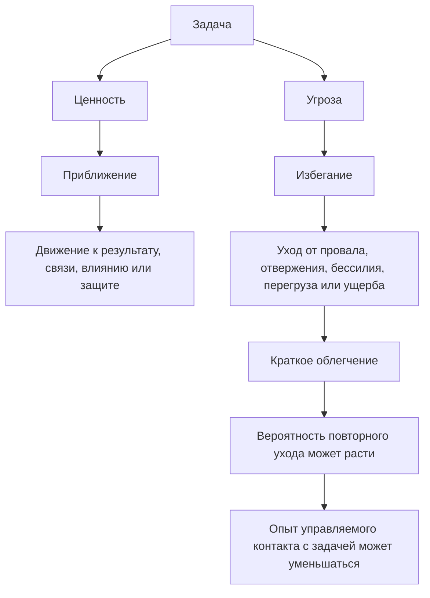
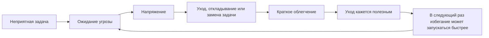
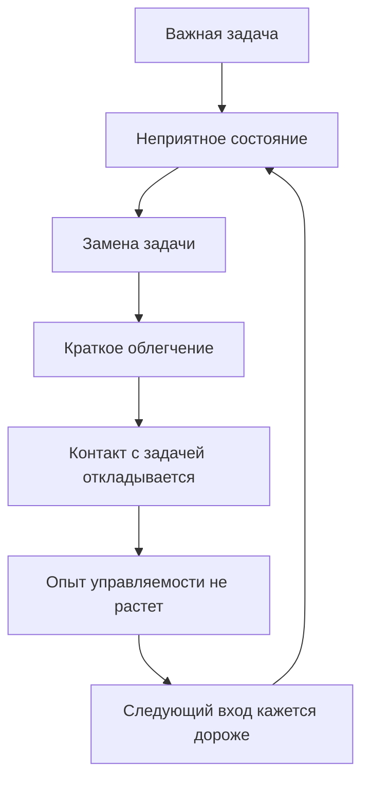

# Глава 9. Приближение и избегание

## Почему важное может отталкивать

В прошлой главе мы разобрали четыре области мотивации:

```text
достижение -> принадлежность -> влияние -> безопасность
```

Мы увидели, что задача может быть ценной по-разному. Она может обещать рост мастерства, контакт с людьми, влияние на ситуацию или защиту от риска.

Но ценность сама по себе еще не говорит, что человек начнет действовать.

Иногда происходит странное:

```text
задача важна, но я ее избегаю
```

Это не обязательно противоречие.

Чем важнее задача, тем больше в ней может быть не только ценности, но и угрозы. Если задача связана с достижением, в ней появляется риск провала. Если она связана с принадлежностью, в ней появляется риск отвержения. Если она связана с влиянием, в ней появляется риск бессилия, сопротивления или ответственности. Если она связана с безопасностью, в ней появляется риск ущерба, перегруза или непредсказуемости.

Поэтому одна и та же задача может одновременно притягивать и отталкивать.

Написать важный текст хочется, потому что он может собрать мысль. И страшно, потому что он может оказаться слабым.

Провести сложный разговор нужно, потому что от него зависит команда. И страшно, потому что можно разрушить контакт.

Взять лидерскую ответственность важно, потому что можно изменить ситуацию. И страшно, потому что можно не справиться.

Начать разбор здоровья, денег, отношений или рабочей проблемы полезно, потому что это снижает долгосрочный риск. И страшно, потому что придется встретиться с реальным положением дел.

Если видеть только ценность, мы будем удивляться:

```text
почему я не делаю то, что для меня важно?
```

Если видеть только угрозу, мы решим:

```text
наверное, мне это не нужно
```

Обе версии неполны.

Глава 9 добавляет к карте областей мотивации вторую ось: направление действия.

```text
идти к ценному
или уходить от угрожающего
```

Эта ось называется проще:

```text
приближение и избегание
```

## Два режима действия

Приближение — это режим, в котором система организует действие вокруг получения, построения или сохранения ценности.

Избегание — это режим, в котором система организует действие вокруг снижения ожидаемого вреда.

Это не моральное деление на хорошее и плохое.

Приближение не всегда мудро. Человек может приближаться к соблазну, зависимости, опасному статусному выигрышу или задаче, которая разрушит восстановление.

Избегание не всегда вредно. Иногда уйти от риска, перегруза, токсичного контакта, бессмысленной задачи или опасной среды — зрелое решение.

Различение нужно не для оценки личности. Оно нужно для диагностики:

```text
что сейчас организует мое действие: ценность, к которой я иду, или угроза, от которой я ухожу?
```

Одна и та же внешняя активность может иметь разный внутренний режим.

Разработчик может делать code review, потому что хочет улучшить качество решения и помочь автору. Это приближение к качеству и совместной работе.

Он же может делать code review, потому что боится, что его сочтут слабым лидом, если он пропустит проблему. Это защитное действие от угрозы статуса или провала.

Снаружи оба варианта похожи. Внутри они отличаются.

В первом случае обратная связь и ошибка чаще становятся материалом работы. Во втором — угрозой, которую нужно не допустить любой ценой.

## Схема главы

Вопрос схемы: когда задача ведет человека к контакту с ценностью, а когда запускает защитный уход.



Эта схема показывает центральную ловушку.

Читать ее нужно не как деление действий на хорошие и плохие. Приближение и избегание могут быть разумными в разных условиях. Проблема начинается там, где уход дает краткое облегчение, но забирает опыт управляемого контакта с задачей.

Избегание может быть разумной защитой в конкретный момент. Но если оно повторяется, человек получает меньше опыта управляемого контакта с задачей. Он не проверяет, насколько угроза реальна. Не получает обратную связь. Не учится выдерживать следующий шаг. Не обновляет прогноз о собственной способности действовать.

В результате задача может становиться не только незавершенной, но и более страшной.

## Приближение

Приближение работает через вопрос:

```text
что я хочу получить, создать, освоить, изменить или защитить?
```

В области достижения приближение выглядит как движение к мастерству:

- разобраться;
- сделать качественнее;
- проверить гипотезу;
- научиться;
- увидеть прогресс.

В области принадлежности приближение выглядит как движение к связи:

- задать вопрос;
- попросить обратную связь;
- вступить в разговор;
- восстановить контакт;
- сделать вклад в общее дело.

В области влияния приближение выглядит как движение к воздействию:

- предложить решение;
- взять ответственность;
- изменить процесс;
- обозначить рамку;
- провести людей через неопределенность.

В области безопасности приближение выглядит как движение к защите:

- снизить риск;
- поставить границу;
- проверить опасное место;
- создать запас;
- сделать систему устойчивее.

Приближение обычно расширяет поле действия. Человек видит не только опасность, но и возможности. Он может пробовать, уточнять, просить данные, делать черновик, ошибаться, исправлять.

Это не значит, что в приближении нет напряжения. Хорошая задача может быть трудной. Но трудность здесь не полностью равна угрозе. Она остается связанной с ценностью.

## Избегание

Избегание работает через другой вопрос:

```text
чего нельзя допустить?
```

В области достижения:

- не провалиться;
- не выглядеть некомпетентным;
- не показать сырой результат;
- не получить критику;
- не столкнуться с тем, что задача сложнее меня.

В области принадлежности:

- не быть отвергнутым;
- не испортить отношения;
- не задать глупый вопрос;
- не оказаться неудобным;
- не потерять место среди своих.

В области влияния:

- не оказаться бессильным;
- не встретить сопротивление;
- не взять ответственность без рычагов;
- не потерять статус;
- не признать, что ситуация не поддается контролю.

В области безопасности:

- не получить ущерб;
- не перегрузиться;
- не попасть в хаос;
- не открыть неприятную правду;
- не войти в состояние, из которого потом трудно выйти.

Избегание часто сужает поле. Внимание может начинать искать не лучший путь к ценности, а самый быстрый способ снизить угрозу.

Иногда это правильно. Если угроза реальна и цена ошибки высока, сужение внимания помогает защититься.

Но в интеллектуальной работе, обучении, лидерстве и отношениях угроза часто смешана с неопределенностью. Нужно не убежать от нее целиком, а войти в контакт с задачей в такой форме, где риск становится управляемым.

## Избегание как активная политика

Главная ошибка бытового языка:

```text
избегание = ничего не делать
```

На практике избегание часто очень деятельно.

Человек может:

- чистить почту вместо важного письма;
- доводить оформление до идеала вместо публикации;
- читать еще один источник вместо формулировки собственной мысли;
- спорить о форме задачи вместо входа в суть;
- начинать безопасные мелкие задачи вместо трудной;
- бесконечно уточнять требования, хотя первый проверяемый шаг уже понятен;
- помогать другим, чтобы не войти в собственный риск;
- собирать инструменты вместо работы;
- планировать систему продуктивности вместо выполнения одного конкретного действия.

Снаружи это может выглядеть как занятость, аккуратность, ответственность, подготовка или даже высокая продуктивность.

Внутренний вопрос другой:

```text
приближает ли это к важной ценности
или снижает напряжение от встречи с угрозой?
```

Не всякая подготовка является избеганием. Подготовка полезна, если после нее растет способность сделать следующий шаг.

Подготовка становится избеганием, если она снова и снова заменяет проверку.

Не всякое уточнение является избеганием. Уточнение полезно, если оно снижает реальную неопределенность.

Уточнение становится избеганием, если оно защищает от момента, где нужно взять на себя риск чернового действия.

Не всякая мелкая задача является избеганием. Иногда мелкие задачи действительно нужно закрыть.

Они становятся избеганием, если постоянно выбираются потому, что дают короткое чувство контроля и не требуют встречи с главной угрозой.

## Облегчение как подкрепление

Почему избегание закрепляется?

Потому что оно часто работает.

Не в долгосрочном смысле. В краткосрочном.

Человек не открывает неприятное письмо — напряжение падает.

Не начинает сложную главу — исчезает риск увидеть, что мысль пока слабая.

Не задает вопрос — не сталкивается с возможным стыдом.

Не идет в разговор — не встречает конфликт.

Не смотрит на проблему — не чувствует ее масштаб.

Система получает сигнал:

```text
угроза была -> я ушел -> стало легче
```

Это облегчение может стать подкрепляющим механизмом. Уход начинает казаться рабочим способом регуляции состояния.



Эта схема важна для понимания прокрастинации.

Прокрастинация часто выглядит как проблема времени:

```text
я плохо планирую
```

Но во многих случаях это проблема регуляции состояния:

```text
я выбираю действие, которое быстрее снижает неприятное чувство сейчас
```

Задача остается важной. Но система отдает приоритет краткосрочному снижению дискомфорта.

Отсюда видно, почему стыд часто плохо работает как ответ на прокрастинацию. Стыд добавляет угрозу к задаче. А если избегание уже было способом уйти от угрозы, дополнительный стыд делает вход еще дороже.

## Матрица областей и режимов

Теперь соединим две оси:

```text
область ценности x режим действия
```

| Область | Приближение | Избегание |
| --- | --- | --- |
| Достижение | Сделать лучше, освоить, проверить мастерство, получить обратную связь. | Не начинать, не показывать черновик, выбирать безопасные задачи, чтобы не столкнуться с провалом. |
| Принадлежность | Вступить в контакт, задать вопрос, попросить обратную связь, восстановить доверие. | Молчать, соглашаться, исчезать, угождать или избегать разговора, чтобы не получить отвержение. |
| Влияние | Внести предложение, изменить ход работы, взять ответственность, обозначить рамку. | Не брать инициативу, гиперконтролировать или спорить о полномочиях, чтобы не встретить бессилие. |
| Безопасность | Построить защиту, снизить риск, поставить границу, сделать систему устойчивее. | Уходить от всего, что похоже на опасность, даже если риск можно проверить и сузить. |

Эта матрица не говорит, что приближение всегда лучше. Она помогает назвать внутреннюю функцию поведения.

Например, молчание на встрече может быть зрелой осторожностью: человек не имеет данных и не хочет вносить шум.

Но то же молчание может быть избеганием: человек понимает важный риск, но боится выглядеть неудобным.

Гиперконтроль может быть временной защитой системы в аварийной ситуации.

Но он же может быть хроническим избеганием бессилия: человек пытается контролировать все, чтобы не встретить границу собственного влияния.

Отдых может быть восстановлением.

Но похожее внешне "полежать и ничего не делать" может быть избеганием, если человек не восстанавливается, а только откладывает встречу с угрозой и остается в фоновом напряжении.

Поэтому нам нужно не угадывать по внешнему виду, а спрашивать о функции.

```text
какую угрозу это поведение снижает?
какую ценность оно помогает построить?
что будет доступнее после этого действия?
```

## Достижение: мастерство или защита от провала

В области достижения приближение направлено к мастерству.

Человек хочет понять, сделать, улучшить, проверить себя на задаче, получить обратную связь и стать сильнее.

Ошибка здесь неприятна, но она не уничтожает смысл. Она дает данные.

Избегание в области достижения направлено от провала.

Тогда задача становится экзаменом личности.

Не:

```text
сработает ли мой подход?
```

а:

```text
что это скажет обо мне, если не получится?
```

Отсюда появляются типичные формы:

- перфекционизм;
- откладывание черновика;
- выбор мелких задач вместо важной;
- бесконечное чтение перед первой попыткой;
- отказ просить обратную связь;
- слишком поздний старт, чтобы не успеть встретиться с полным масштабом задачи;
- объяснение неудачи внешними условиями до проверки реального действия.

Здесь полезно спросить:

```text
я сейчас иду к мастерству
или защищаюсь от свидетельства собственной некомпетентности?
```

Если второе, решение не в том, чтобы сильнее себя продавить. Нужно уменьшить угрозу проверки.

Например:

- назвать первый результат черновиком;
- заранее определить, что будет считаться продвижением, а не успехом целиком;
- показать кусок, а не весь результат;
- запросить обратную связь по одному аспекту;
- ограничить время первой попытки;
- зафиксировать, что ошибка является данными, а не приговором.

Так приближение к мастерству становится снова возможным.

## Принадлежность: связь или защита от отвержения

В области принадлежности приближение направлено к связи.

Человек вступает в контакт, задает вопрос, просит помощи, поддерживает другого, дает честную обратную связь, восстанавливает отношения после напряжения.

Избегание направлено от отвержения.

Тогда контакт становится опасным. Даже нейтральная реакция может читаться как сигнал:

```text
сейчас меня не примут
```

Типичные формы:

- молчать, хотя вопрос важен;
- соглашаться, хотя внутри есть несогласие;
- не просить помощи, чтобы не выглядеть слабым;
- не давать обратную связь, чтобы не испортить отношения;
- исчезать после неоднозначного сообщения;
- брать лишнюю работу, чтобы оставаться удобным;
- делать вид, что все понятно, чтобы не оказаться "не своим".

Здесь полезно спросить:

```text
я сейчас строю связь
или пытаюсь не получить отвержение?
```

Если включено избегание, безопасный вход может выглядеть так:

- задать вопрос в форме проверки понимания;
- попросить короткую обратную связь по одному пункту;
- отделить отношение к человеку от содержания работы;
- явно назвать намерение: "Хочу улучшить решение, не спорить ради спора";
- выбрать формат, где риск стыда меньше: текст, короткая встреча, один собеседник;
- согласовать право на черновую мысль.

Цель не в том, чтобы убрать социальный риск целиком. В живой работе это невозможно. Цель — сделать его переносимым.

## Влияние: действие на ситуацию или защита от бессилия

В области влияния приближение направлено к изменению ситуации.

Человек предлагает, ведет, организует, берет ответственность, собирает рамку, меняет процесс, защищает направление.

Избегание направлено от бессилия.

Бессилие может переживаться по-разному:

- меня не услышат;
- я отвечаю, но не имею рычагов;
- ситуация хаотична;
- другие сопротивляются;
- решение зависит не от меня;
- я потеряю статус, если признаю ограничение влияния.

Избегание влияния бывает двух противоположных видов.

Первый вид — уход:

- не предлагать;
- не брать инициативу;
- не обозначать проблему;
- не входить в спор о направлении;
- ждать, пока кто-то другой решит.

Второй вид — гиперконтроль:

- контролировать каждую мелочь;
- не делегировать;
- давить на форму вместо сути;
- спорить за полномочия;
- удерживать решения у себя;
- пытаться управлять тем, что нельзя управлять напрямую.

Оба варианта могут быть защитой от одного и того же чувства:

```text
я не выдержу столкновение с собственной ограниченностью
```

Здесь полезно спросить:

```text
какой реальный рычаг у меня есть?
```

и второй вопрос:

```text
какой исход я пытаюсь контролировать, хотя он не полностью мой?
```

Безопасный вход в влияние часто начинается не с большого решения, а с уточнения контура:

- что я могу изменить сам;
- на что могу повлиять через аргументы;
- где нужна договоренность;
- где нужно эскалировать;
- где нужно принять ограничение;
- где моя ответственность заканчивается.

Это подготавливает главу 10, где управляемость станет центральным параметром действия.

## Безопасность: защита или хронический уход

В области безопасности приближение направлено к защите.

Это может звучать странно: как можно "приближаться" к безопасности?

Можно.

Человек строит защиту, снижает риск, создает запас, ставит границу, проверяет опасное место, делает систему устойчивее.

Это активная забота о возможности продолжать действовать.

Избегание безопасности выглядит иначе. Оно направлено не на построение защиты, а на уход от всего, что напоминает опасность.

Формы:

- не смотреть на проблему;
- не открывать неприятные данные;
- не принимать решение;
- не входить в задачу с неопределенным исходом;
- не обсуждать риск;
- не менять ничего, даже если текущее положение ухудшается;
- требовать полной гарантии перед первым шагом.

Зрелая безопасность спрашивает:

```text
какой риск реален и как его снизить?
```

Хроническое избегание спрашивает:

```text
как не чувствовать риск вообще?
```

Полностью не чувствовать риск невозможно. Поэтому хроническое избегание начинает требовать все больше контроля, гарантий, подготовки и отсрочек.

В итоге безопасность, которая должна сохранять возможность действия, начинает уничтожать возможность действия.

## Прокрастинация как частный случай избегания

Прокрастинация не всегда является избеганием. Иногда задача правда плохо сформулирована. Иногда человек устал. Иногда среда перегружена. Иногда приоритеты изменились. Иногда нужно восстановиться, а не давить на себя.

Но часто прокрастинация поддерживается именно избеганием.

Задача вызывает неприятное состояние:

- скуку;
- тревогу;
- стыд;
- неопределенность;
- страх провала;
- страх конфликта;
- ощущение бессилия;
- перегруз от масштаба.

Человек выбирает другое действие, которое быстро облегчает состояние:

- открыть новости;
- ответить на простые сообщения;
- заняться настройкой среды;
- сделать второстепенную задачу;
- почитать еще;
- лечь "на пять минут";
- придумать новый план.

Неприятное состояние может уменьшиться.

Именно поэтому поведение может повторяться.

Проблема в том, что краткосрочное облегчение не решает исходную задачу. Более того, оно может увеличить ее будущую цену:

- срок ближе;
- стыда больше;
- контекст холоднее;
- уверенность ниже;
- задача кажется еще опаснее.

Так прокрастинация может становиться не просто потерей времени, а механизмом усиления угрозы.



В такой ситуации вопрос "почему я ленюсь?" часто хуже вопроса:

```text
какое состояние я пытаюсь не чувствовать, когда откладываю?
```

Еще точнее:

```text
от какой угрозы меня сейчас защищает незапуск действия?
```

## Избегание и отдых

Избегание часто путают с отдыхом.

Снаружи они могут быть похожи: человек не делает задачу.

Но функция разная.

| Признак | Отдых | Избегание |
| --- | --- | --- |
| Главная функция | Восстановить доступность действия. | Снизить угрозу встречи с задачей. |
| После паузы | Становится немного легче вернуться. | Возвращение часто становится страшнее или стыднее. |
| Отношение к задаче | Задача остается видимой и имеет точку продолжения. | Задача вытесняется, размывается или окружена напряжением. |
| Телесное состояние | Может появиться восстановление. | Часто остается фоновое напряжение. |
| Критерий качества | После отдыха больше ясности, терпимости, сил. | После избегания больше долга, тумана, самокритики. |

Отдых может быть частью приближения. Если задача важна, а система истощена, восстановление является способом сохранить возможность действия.

Избегание может маскироваться под отдых. Тогда человек вроде бы отдыхает, но не восстанавливается, потому что внутри продолжает удерживать угрозу.

Практический вопрос:

```text
после этой паузы я стану ближе к возвращению
или только отложу встречу с угрозой?
```

Если нужен отдых, ему стоит дать форму:

- сколько времени;
- от чего именно восстанавливаюсь;
- какая контрольная точка сохранена;
- каким будет первый шаг после возвращения.

Так отдых перестает быть туманной зоной и становится частью когнитивного контура.

## Полезное и хроническое избегание

Избегание полезно, когда оно защищает от реального вреда и сохраняет возможность действовать дальше.

Примеры полезного избегания:

- не входить в разговор, если человек сейчас в ярости и разговор только ухудшит ситуацию;
- не брать задачу без полномочий, если ответственность не сопровождается рычагами;
- не работать ночью над сложной проблемой, если цена ошибки выше выигрыша во времени;
- не раскрывать личную уязвимость в небезопасной среде;
- не продолжать нагрузку, когда тело уже на границе срыва.

Здесь избегание не является слабостью. Это защита.

Но полезное избегание обычно оставляет следующий разумный шаг:

```text
вернуться позже
поменять формат
получить поддержку
снизить риск
уточнить полномочия
восстановиться
```

Хроническое избегание устроено иначе. Оно обычно не проектирует следующий вход. Оно в основном снижает напряжение сейчас.

Признаки хронического избегания:

- задача возвращается снова и снова;
- каждый вход кажется тяжелее;
- человек не получает опыта, что может выдержать шаг;
- реальные риски не проверяются;
- фантазия об угрозе становится сильнее фактов;
- самооценка падает;
- возникает цикл стыда и нового ухода.

Главная цена хронического избегания — не только несделанная задача. Главная цена — потеря управляемости.

Человек может все меньше верить, что способен входить в трудное и влиять на исход.

Именно поэтому следующая глава будет про управляемость действия.

## Практическая диагностика

Когда действие не запускается, не начинайте с обвинения.

Начните с карты.

```text
1. Какая ценность здесь есть?
2. Какая угроза здесь есть?
3. Какой режим сейчас сильнее: приближение или избегание?
4. Какое поведение дает краткое облегчение?
5. Что будет безопасным первым контактом с задачей?
```

Можно использовать таблицу.

| Вопрос | Зачем он нужен | Пример ответа |
| --- | --- | --- |
| Что я хочу получить или построить? | Найти ценность. | Хочу дать качественный review и улучшить решение. |
| Чего я пытаюсь не встретить? | Найти угрозу. | Боюсь конфликта с автором и ошибки в оценке. |
| Как я ухожу? | Увидеть активное избегание. | Читаю другие MR, отвечаю в чатах, уточняю второстепенное. |
| Какое облегчение я получаю? | Понять подкрепление. | Не чувствую риск испортить отношения. |
| Какой вход снизит угрозу, но сохранит движение? | Спроектировать следующий шаг. | Прочитать только архитектурный контекст и оставить 3 вопроса, без финального вердикта. |

Цель диагностики не в том, чтобы уничтожить страх.

Цель — сделать следующий контакт с задачей достаточно безопасным, чтобы система не выбирала автоматический уход.

## Инженерные способы снизить угрозу входа

Если избегание защищает от угрозы, то простое давление часто усиливает защиту.

Лучше проектировать вход.

| Угроза | Что обычно делает избегание | Более инженерный вход |
| --- | --- | --- |
| Провал | Не начинать или готовиться бесконечно. | Сделать черновую попытку с маленьким критерием продвижения. |
| Критика | Не показывать работу. | Показать фрагмент и запросить обратную связь по одному аспекту. |
| Отвержение | Молчать или соглашаться. | Задать короткий вопрос в безопасном формате. |
| Бессилие | Уйти или гиперконтролировать. | Выписать реальный рычаг действия и границу влияния. |
| Перегруз | Оттягивать вход. | Ограничить рабочий блок по времени и сохранить контрольную точку. |
| Неопределенность | Читать и уточнять без конца. | Сформулировать одну проверяемую гипотезу. |
| Конфликт | Не вступать в разговор. | Разделить намерение, факты и просьбу. |

Эти способы не делают задачу легкой. Они делают ее входной.

Это важное различие.

Когнитивное инженерство не обещает убрать трудность. Оно помогает менять форму контакта с трудностью так, чтобы система могла действовать, учиться и восстанавливаться.

## Подробный пример: отложенный code review

Разберем пример из паспорта главы.

Человек откладывает code review.

Поверхностное объяснение:

```text
не хочет
```

Но если разложить ситуацию, картина сложнее.

### Ценность

В задаче есть достижение:

- хочется дать качественный review;
- важно понять решение;
- важно не пропустить архитектурный риск.

Есть принадлежность:

- важно сохранить рабочий контакт с автором;
- не хочется звучать высокомерно;
- важно быть полезным, а не разрушительным.

Есть влияние:

- review реально меняет качество системы;
- нужно обозначить проблему, если она есть;
- от позиции reviewer зависит техническое направление.

Есть безопасность:

- нужно снизить риск ошибки в production;
- нужно не создать конфликт;
- нужно не потратить слишком много ресурса на неясный MR.

### Угроза

Та же задача содержит угрозы:

- можно ошибиться в оценке;
- можно задеть автора;
- можно обнаружить, что не хватает контекста;
- можно взять на себя спор, который будет трудно закончить;
- можно потратить много времени и не получить ясного вывода.

### Избегание

Поведение:

- открываются более простые MR;
- проверяется почта;
- уточняется второстепенная деталь;
- читается документация без конкретного вопроса;
- review переносится "на момент, когда будет больше сил".

Это не пустота. Это активная замена опасной задачи более безопасными действиями.

### Облегчение

Каждый перенос часто дает облегчение:

```text
сейчас не нужно входить в риск конфликта
сейчас не нужно выносить оценку
сейчас не нужно показывать, что я не все понимаю
```

Но следующий вход часто становится дороже:

- контекст холодеет;
- автор ждет;
- чувство долга растет;
- review превращается из рабочей задачи в социально-статусный узел.

### Более безопасный вход

Не нужно начинать с полного review.

Можно спроектировать первый контакт:

```text
15 минут: прочитать цель MR и архитектурный diff.
Не выносить вердикт.
Выписать только:
1. что понял;
2. какие 2-3 вопроса требуют ответа;
3. есть ли один блокирующий риск.
```

Это может снижать угрозу.

Теперь задача не звучит как:

```text
сделать идеальный review и не ошибиться
```

Она звучит так:

```text
восстановить контекст и сформулировать первые вопросы
```

Приближение может снова стать возможным.

## Что делать, если избегание оправдано

Иногда диагностика показывает: система избегает не фантазии, а реального плохого условия.

Например:

- задача действительно поставлена без полномочий;
- срок нереалистичен;
- среда наказывает за честную ошибку;
- человек истощен;
- конфликт сейчас неуправляем;
- риск слишком велик для одиночного решения;
- задача нарушает ценности или границы.

Тогда цель не в том, чтобы "победить избегание".

Цель — изменить условие.

Возможные шаги:

- запросить полномочия;
- уточнить критерий результата;
- уменьшить объем;
- перевести задачу в совместный формат;
- отложить до восстановления;
- поставить границу;
- отказаться от задачи;
- эскалировать риск;
- разделить ответственность.

Когнитивное инженерство не должно делать человека более удобным для плохих систем.

Если избегание сообщает о реальном вреде, его нужно слушать. Но слушать — не значит автоматически подчиняться. Значит проверить: что именно опасно, насколько это реально, чем можно снизить риск и какой шаг сохраняет управляемость.

## Мини-словарь главы

| Понятие | Рабочее определение |
| --- | --- |
| Приближение | Режим действия, организованный вокруг получения, построения или сохранения ценности. |
| Избегание | Режим действия, организованный вокруг снижения ожидаемого вреда. |
| Угроза | Ожидаемый вред: физический, социальный, статусный, эмоциональный, когнитивный или ресурсный. |
| Защитная политика | Повторяемый способ поведения, который снижает угрозу или напряжение. |
| Облегчение | Снижение неприятного состояния после ухода от задачи или угрозы. |
| Подкрепление ухода | Закрепление избегания благодаря тому, что уход быстро снижает напряжение. |
| Хроническое избегание | Повторяющийся уход от задачи, который снижает дискомфорт сейчас, но уменьшает будущую управляемость. |
| Замаскированное избегание | Внешне продуктивное действие, функция которого — не приблизить ценность, а не встретиться с угрозой. |
| Конфликт цель-угроза | Ситуация, где один и тот же объект одновременно ценен и опасен. |

## Вопросы для самопроверки

1. Почему важная задача может вызывать избегание?
2. Чем избегание отличается от отсутствия мотивации?
3. Почему краткое облегчение закрепляет уход?
4. Как отличить отдых от избегания?
5. Почему безопасность не равна избеганию?
6. Как одна и та же область мотивации может работать в режиме приближения и в режиме избегания?
7. Почему стыд часто ухудшает прокрастинацию?
8. Какой первый шаг снижает угрозу, но сохраняет движение?

## Мини-практика

Возьмите одну задачу, которую вы откладываете.

Заполните таблицу:

| Вопрос | Ответ |
| --- | --- |
| Что в этой задаче ценно? |  |
| Какая область мотивации сильнее всего включена: достижение, принадлежность, влияние, безопасность? |  |
| Какая потеря или угроза делает задачу опасной? |  |
| Как я обычно ухожу от встречи с этой угрозой? |  |
| Какое краткое облегчение я получаю? |  |
| Какую цену я плачу позже? |  |
| Какой первый контакт с задачей будет достаточно безопасным? |  |

После этого сформулируйте шаг в таком виде:

```text
Я не обязан сейчас решить всю задачу.
Я делаю только первый безопасный контакт:
<конкретное действие>
в течение <ограничение по времени>
чтобы получить <какой сигнал или данные>.
```

Пример:

```text
Я не обязан сейчас написать всю главу.
Я делаю только первый безопасный контакт:
выписываю 5 тезисов и 3 угрозы текста
в течение 25 минут,
чтобы увидеть, где настоящая трудность.
```

## Короткое резюме

1. Мотивация работает не только как движение к ценности, но и как уход от угрозы.
2. Избегание — активный режим действия, а не пустое отсутствие мотивации.
3. Одна и та же область ценности может работать в режиме приближения или избегания.
4. Краткое облегчение может закреплять уход, поэтому избегание часто повторяется.
5. Прокрастинация часто является регуляцией неприятного состояния сейчас, а не доказательством отсутствия ценности.
6. Хороший отдых восстанавливает или поддерживает доступность действия; избегание снижает угрозу встречи с задачей.
7. Полезное избегание защищает от реального вреда и оставляет следующий шаг. Хроническое избегание сужает будущую управляемость.
8. Лучший вопрос главы: `От какой угрозы меня сейчас защищает незапуск действия?`
9. Инженерное решение — не давить сильнее, а проектировать более безопасный вход в задачу.

## Источниковая опора

Проверенный пакет для этой главы: [[../Источники/2026-05-24 Пакет источников для главы 9]].

Ключевые источники в авторско-годовой форме:

- Elliot & Covington (2001), Elliot (2006), Elliot & Thrash (2002): приближение и избегание как базовое различение направленности мотивации и целей.
- McNaughton & Corr (2004), Aupperle et al. (2011): конфликт приближения-избегания, защитная дистанция и ситуации, где ценность и угроза присутствуют одновременно.
- Tsutsui-Kimura et al. (2025), Ben-Zion & Levy (2025): поздняя опора для мысли, что избегание в конфликте угрозы и награды нужно читать как активную политику действия, а ожидаемые выгоды и потери оцениваются совместно; использовать без нейроредукционизма.
- Krypotos et al. (2015): обучение избеганию и подкрепление ухода через снижение угрозы или неприятного состояния.
- Sirois & Pychyl (2013), Steel (2007), Sirois (2023), Zhang et al. (2019): прокрастинация как саморегуляционный сбой, часто связанный с краткосрочной регуляцией настроения и стрессовым контекстом.
- Внутренние авторские материалы по мотивации: связь областей ценности, угрозы, избегания, усилия и истощения.

Доказательная роль блока: `strong` для различения приближения и избегания, а также прокрастинации как сбоя саморегуляции; `context-dependent` для переноса лабораторных, нейробиологических и обзорных моделей угрозы в диагностику конкретной задачи; `fast-moving` для источников 2025 года; граница применимости - запрет сводить всякую прокрастинацию к избеганию. Глава показывает частый механизм, а не универсальный диагноз.

Полные библиографические записи и DOI сохранены в пакете главы. В текущей редакции глава оставляет короткий авторско-годовой блок как читательский ориентир.

## Переход к следующей главе

Теперь мы умеем видеть, что действие может быть направлено к ценности или от угрозы.

Но остается следующий вопрос:

```text
почему в одних случаях человек выдерживает угрозу и действует,
а в других уходит, замирает или откладывает?
```

Ответ часто связан с управляемостью.

Если человек ожидает, что его действие может изменить исход, угроза часто становится переносимее. Если действие кажется бесполезным, даже ценная задача может начинать выглядеть как расход в пустоту.

Дальше нужно разобрать управляемость действия:

```text
могу ли я повлиять на то, что произойдет?
```

## Статус

`ready-for-review`

Проверка связки глав 8-9: [[../Проверки/2026-05-24 Связка глав 8-9]].

Глава 10 написана: [[10-Управляемость-действия]].

Следующий шаг: при финальной редактуре проверить плотность главы: оставить механизм приближения/избегания, но не забирать весь материал будущей главы 18 о прокрастинации.
