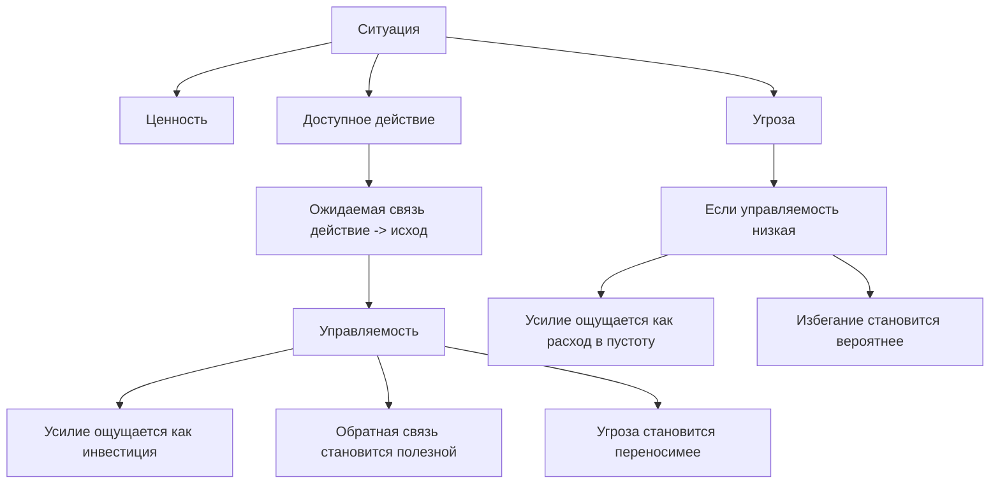
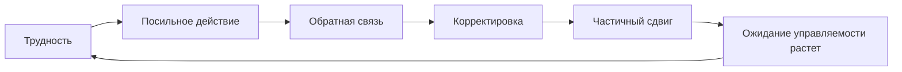

# Глава 10. Управляемость действия

## Почему ценности и угрозы недостаточно

В главе 9 мы увидели две направленности действия:

```text
приближение -> движение к ценности
избегание -> уход от угрозы
```

Но остается важный вопрос.

Почему в одних случаях человек видит угрозу и все равно действует, а в других — уходит, замирает, откладывает или начинает защищаться?

Один ответ уже был подготовлен раньше:

```text
значение имеет управляемость
```

Если человек ожидает, что его действие может что-то изменить, угроза часто становится переносимее. Трудность не исчезает, но может превращаться в рабочий материал.

Если человек ожидает, что его действие ничего не изменит, даже ценная задача начинает выглядеть как расход в пустоту.

Управляемость здесь становится одним из центральных параметров когнитивного инженерства.

Управляемость нужна, чтобы не путать разные состояния:

- "я хочу, но не знаю, что могу сделать";
- "я знаю, что делать, но не верю, что это повлияет";
- "шанс успеха есть, но исход зависит не от меня";
- "шанс успеха низкий, но каждая попытка дает данные";
- "меня просят стараться, но не дают рычага";
- "я чувствую контроль, но реального рычага нет";
- "мне трудно, но я могу сделать следующий шаг и получить обратную связь".

Все эти состояния нельзя лечить одной фразой:

```text
надо больше мотивации
```

Иногда нужна не мотивация, а рычаг.

## Рабочее определение

Управляемость — это ожидание, что конкретное действие может повлиять на конкретный исход.

Проще:

```text
если я сделаю X, изменится ли Y?
```

Здесь важны все три части:

- конкретное действие;
- конкретный исход;
- ожидаемая связь между ними.

Если действие не названо, управляемость размывается.

Если исход не назван, непонятно, на что мы пытаемся влиять.

Если связь между действием и исходом не видна, усилие начинает казаться бессмысленным.

Управляемость не означает:

```text
я все контролирую
```

Она означает:

```text
у меня есть хотя бы частичный рычаг
```

Это важное различие.

В сложных человеческих задачах почти никогда нет полного контроля. Разработчик не контролирует всю систему. Лидер не контролирует всех людей. Автор не контролирует реакцию читателя. Родитель не контролирует внутренний мир ребенка. Человек не контролирует тело как механизм.

Но между полным контролем и полной беспомощностью есть рабочая зона:

```text
я не управляю всем исходом,
но могу сделать действие, которое меняет вероятность, качество, скорость, ясность или следующий шаг
```

Именно эта зона нужна для действия.

## Схема управляемости

Вопрос схемы: есть ли у человека рычаг, который связывает действие с изменением ситуации.



Схему нужно читать так.

Ценность говорит, зачем вообще входить в задачу. Угроза говорит, что может пойти плохо. Но управляемость отвечает на другой вопрос:

```text
есть ли у меня способ повлиять на то, что произойдет?
```

Если способ есть, усилие может получить смысл. Оно может становиться не просто болью, а вложением.

Если способа нет, усилие теряет смысл. Даже небольшое действие может ощущаться тяжелым, потому что система не видит причинной связи между затратой и результатом.

Эта схема не обещает полного контроля. Наоборот, она нужна, чтобы найти частичный рычаг: что можно проверить, изменить, уточнить, ограничить или вынести во внешний контур.

## Управляемость не равна вероятности успеха

Самая важная таблица главы:

| Ситуация | Высокая управляемость | Низкая управляемость |
| --- | --- | --- |
| Высокая вероятность успеха | Рабочее действие: понятно, что делать, и шанс хороший. | Пассивное ожидание: исход может быть хорошим, но не от меня зависит. |
| Низкая вероятность успеха | Исследование: шанс мал, но можно пробовать, получать данные и учиться. | Беспомощность: шанс мал и рычага нет. |

Разберем все четыре клетки.

### Высокая вероятность успеха, высокая управляемость

Это самая простая зона.

Человек понимает, что нужно сделать, и ожидает, что действие с хорошей вероятностью приведет к результату.

Примеры:

- запустить известную проверку;
- написать понятное письмо;
- выполнить привычную тренировку;
- закрыть задачу с ясным критерием;
- повторить навык, который уже освоен.

Здесь мотивация обычно не требует сложной инженерии. Часто достаточно защитить время, контекст и состояние.

### Высокая вероятность успеха, низкая управляемость

Эта зона обманчива.

Исход может быть почти наверняка хорошим, но человек не чувствует, что он сам на него влияет.

Примеры:

- заявка почти наверняка будет одобрена, но решение полностью у другого отдела;
- проект, скорее всего, пройдет, но вклад конкретного человека неразличим;
- команда справится, но отдельный участник не видит своего рычага;
- процесс идет по инерции, а человек только ждет результата.

Снаружи все неплохо. Но авторства мало.

Здесь может не быть тревоги. Может быть скука, отчуждение, пассивность или ощущение:

```text
от меня ничего не зависит
```

Такая ситуация особенно важна для лидерства и командной работы. Если человек не видит своего вклада, он может формально участвовать, но не включаться.

### Низкая вероятность успеха, высокая управляемость

Это зона исследования.

Шанс полного успеха пока низкий. Но каждое действие дает данные. Можно пробовать, корректировать, учиться, менять стратегию.

Примеры:

- сложный баг, где гипотезы можно проверять;
- новый навык, где прогресс медленный, но обратная связь ясная;
- стартап-гипотеза, где результат неизвестен, но можно проводить эксперименты;
- трудный текст, где черновики постепенно улучшают мысль;
- переговоры, где нельзя гарантировать исход, но можно менять формат и аргументы.

Эта зона может быть напряженной, но она не равна беспомощности.

Наоборот, именно здесь часто растет компетентность.

Человек не знает, получится ли. Но он знает, что делать, чтобы узнать больше.

### Низкая вероятность успеха, низкая управляемость

Это зона беспомощности.

Ценность может быть высокой. Угроза может быть высокой. Но человек не видит действия, которое меняет исход.

Примеры:

- задача зависит от неясных решений других людей;
- критерии постоянно меняются;
- обратная связь запаздывает или противоречит сама себе;
- ответственность есть, полномочий нет;
- наказание за ошибку есть, права на корректировку нет;
- человек много раз пробовал и не увидел связи между усилием и результатом.

Здесь давление часто ухудшает ситуацию.

Если сказать:

```text
просто старайся сильнее
```

можно увеличить не действие, а ощущение бессмысленного расхода.

Для выхода из этой зоны нужен не лозунг, а восстановление рычага.

## Самоэффективность

Близкое понятие — самоэффективность.

Самоэффективность — это ожидание, что я способен выполнить действия, необходимые для результата.

Это не самооценка.

Самооценка может звучать так:

```text
я хороший специалист
я умный
я сильный
я справляющийся человек
```

Самоэффективность звучит иначе:

```text
я могу выполнить вот это действие в вот таких условиях
```

Человек может иметь нормальную самооценку и низкую самоэффективность в новой задаче.

Например:

```text
я в целом сильный инженер,
но не уверен, что смогу провести этот разговор с заказчиком
```

И наоборот: человек может быть строг к себе, но иметь высокую самоэффективность в конкретном навыке.

```text
я не считаю себя выдающимся,
но знаю, что могу разобрать этот класс ошибок
```

Для когнитивного инженерства важна именно конкретность.

Не:

```text
верю ли я в себя вообще?
```

А:

```text
верю ли я, что могу выполнить следующий шаг?
```

## Откуда берется управляемость

Управляемость не возникает из убеждения на пустом месте.

Она строится из опыта.

Самый важный источник — опыт действия, которое дало сдвиг.

```text
я сделал -> что-то изменилось -> я понял связь -> в следующий раз трудность стала чуть более управляемой
```

У Bandura это близко к опыту успешного овладения: человек видит, что способен справиться с задачей или ее частью. Не потому, что ему сказали "ты можешь", а потому что он пережил связку:

```text
попытка -> обратная связь -> корректировка -> результат
```

Есть и другие источники:

- наблюдение за похожими людьми;
- поддерживающая обратная связь;
- объяснение стратегии;
- телесное и эмоциональное состояние;
- понятные критерии;
- право на ошибку и повтор.

Но главный материал управляемости — не похвала. Главный материал — причинная петля действия.



Эта петля важна для будущей главы 19 об опыте преодоления. Здесь мы берем только ее мотивационный смысл.

Если человек регулярно проходит через такие петли, трудность может постепенно переставать означать:

```text
надо уйти
```

и начинает означать:

```text
надо найти следующий управляемый шаг
```

## Обратная связь как источник рычага

Обратная связь часто понимают слишком узко.

```text
обратная связь = похвала или критика
```

Для управляемости это неверно.

Обратная связь — это сигнал, который показывает, что изменилось после действия.

Она может быть:

- технической: тест прошел или упал;
- поведенческой: человек ответил, уточнил, изменил действие;
- учебной: стало понятно, где ошибка;
- телесной: после отдыха внимание стало устойчивее;
- социальной: формат разговора снизил напряжение;
- процессной: новый порядок работы уменьшил задержки.

Хорошая обратная связь не обязана быть приятной. Она должна быть пригодной для корректировки.

Если сигнал не показывает связь между действием и исходом, управляемость не растет.

Например:

```text
плохо
```

Это не обратная связь. Это оценка без рычага.

```text
в тексте сильная структура, но во втором разделе смешаны причина и следствие
```

Это уже материал действия.

В рабочей среде управляемость часто рушится не потому, что задача невозможна, а потому что обратная связь слишком поздняя, слишком общая или слишком социально опасная.

## Выученная беспомощность

Теперь можно аккуратно ввести беспомощность.

Беспомощность — это не слабый характер.

Это состояние, в котором система не ожидает, что действие изменит исход.

Историческая линия выученной беспомощности возникла из экспериментов с неконтролируемым неприятным воздействием. Современное понимание стало тоньше: важно не только то, что беспомощность "выучивается", но и то, что опыт контроля может менять реакцию на будущие стрессоры.

Для учебника важен не прямой перенос лабораторной модели на жизнь. В человеческой жизни гораздо больше уровней: смысл, отношения, социальная власть, тело, прошлый опыт, язык, культура.

Но общий принцип полезен:

```text
если система многократно встречает ситуацию, где действие не меняет исход,
она начинает экономить попытки
```

Снаружи это может выглядеть как:

- лень;
- апатия;
- цинизм;
- пассивная агрессия;
- уход в безопасные задачи;
- отказ предлагать;
- "все равно ничего не изменится";
- формальное участие без авторства.

Но внутри часто работает другое:

```text
усилие не окупается
```

Если это так, давление на волю обычно не решает проблему. Нужна проверка связи между действием и исходом.

## Выученная управляемость

Нам важно говорить не только о беспомощности, но и о выученной управляемости.

Это не официальный ярлык для всех случаев, а удобное рабочее название для повторяющегося опыта:

```text
трудно -> я действую -> получаю сигнал -> корректирую -> что-то меняется
```

Такой опыт меняет будущий вход в трудность.

Человек начинает ожидать:

```text
я не обязан сразу победить,
но, вероятно, смогу найти действие, которое даст данные
```

Это и есть сильная альтернатива избеганию.

Глава 9 показала цикл избегания:

```text
угроза -> уход -> облегчение -> повторный уход
```

Глава 10 добавляет другой цикл:

```text
трудность -> действие -> обратная связь -> сдвиг -> рост управляемости
```

Сравним:

| Петля | Краткосрочный эффект | Долгосрочный эффект |
| --- | --- | --- |
| Избегание | Снижает напряжение сейчас. | Уменьшает опыт управляемого контакта с задачей. |
| Управляемость | Требует входа в трудность. | Увеличивает ожидание, что действие может менять исход. |

Это не значит, что всегда нужно выбирать вторую петлю.

Если угроза реальна и цена слишком высока, сначала нужна защита или восстановление.

Но если задача важна и хотя бы частично управляема, маленькая петля управляемости часто полезнее, чем большой рывок героизма.

## Социальная управляемость

В индивидуальных примерах управляемость часто выглядит просто:

```text
я сделал действие -> получил результат
```

В работе и лидерстве все сложнее.

Там исход зависит от людей, ролей, полномочий, договоренностей, сроков, приоритетов, доверия и права на ошибку.

Поэтому нужна социальная управляемость.

Социальная управляемость — это ожидание, что я могу влиять на социальную ситуацию через доступные действия.

Например:

- могу задать вопрос и получить ответ;
- могу обозначить риск, и меня услышат;
- могу попросить ресурс;
- могу изменить приоритет;
- могу договориться о критерии;
- могу эскалировать проблему;
- могу сказать "нет" без разрушения отношений;
- могу предложить решение и увидеть реакцию.

Если социальная управляемость низкая, мотивация может проседать даже у сильных людей.

Типичный пример:

```text
ответственность есть, полномочий нет
```

Это одна из самых разрушительных для включенности конфигураций.

Человека оценивают по исходу, но не дают рычагов влияния. В такой среде растут цинизм, защитный контроль, избегание инициативы и выгорание.

Инженерное лидерство здесь начинается не с вдохновляющей речи, а с вопроса:

```text
какой рычаг действия есть у человека?
```

Если рычага нет, первый инженерный ход — менять рамку:

- уточнять полномочия;
- давать доступ к информации;
- сокращать зависимость от чужих решений;
- ускорять обратную связь;
- признавать границы ответственности;
- создавать право на вопрос;
- согласовывать критерий результата.

## Когда управляемость низкая

Низкая управляемость может выглядеть по-разному.

### Пассивное ожидание

Человек ждет решения, письма, реакции, согласования, внешнего сигнала.

Он может быть не против задачи. Но действие не запускается, потому что следующий ход не его.

Инженерный вопрос:

```text
есть ли маленькое действие, которое уменьшит неопределенность?
```

Например:

- отправить уточнение;
- поставить срок ответа;
- подготовить два варианта;
- выписать, что можно сделать без внешнего решения;
- перевести ожидание в явный dependency.

### Замирание

Человек видит угрозу, но не видит хода.

Система не выбирает ни приближение, ни уход. Она зависает.

Инженерный вопрос:

```text
какой самый маленький наблюдаемый шаг не требует решения всей задачи?
```

### Цинизм

Цинизм иногда является не мировоззрением, а защитой от повторного опыта бесполезного усилия.

```text
зачем предлагать, если все равно не услышат?
```

Здесь обычно бесполезно требовать вовлеченности без изменения среды. Сначала нужно дать человеку опыт, что хотя бы небольшой вклад имеет последствия.

### Гиперконтроль

Низкая управляемость не всегда ведет к пассивности. Иногда она ведет к попытке контролировать больше, чем реально доступно.

Человек не выдерживает неопределенность и пытается компенсировать ее микроменеджментом, избыточными проверками, жесткими правилами, запретом вариантов.

Инженерный вопрос:

```text
какой риск я пытаюсь снизить контролем,
и есть ли более точный рычаг?
```

## Иллюзия контроля

До этого момента может показаться, что нужно просто повышать управляемость.

Но есть граница:

```text
переживание контроля может быть иллюзорным
```

Человек может чувствовать влияние там, где его нет. Может видеть закономерность в случайности. Может переоценивать силу личного действия. Может считать, что правильный ритуал, настроение или подготовка гарантируют исход.

Для когнитивного инженерства это опасно.

Нам нужна не приятная иллюзия, а рабочая управляемость.

Различие:

| Вопрос | Рабочая управляемость | Иллюзия контроля |
| --- | --- | --- |
| Есть ли действие? | Да, конкретное. | Часто общее или символическое. |
| Есть ли наблюдаемый исход? | Да, хотя бы промежуточный. | Исход размытый или подгоняется задним числом. |
| Есть ли обратная связь? | Да, она может опровергнуть гипотезу. | Обратная связь игнорируется или переобъясняется. |
| Можно ли скорректировать способ? | Да. | Обычно способ защищается от проверки. |
| Признаются ли границы влияния? | Да. | Нет, контроль переживается шире фактов. |

Управляемость требует честности.

Иногда лучший вывод:

```text
здесь у меня нет прямого рычага
```

Это не поражение. Это экономия сил и точная карта реальности.

После такого вывода можно искать другой уровень влияния:

- не изменить решение, но подготовить позицию;
- не контролировать реакцию человека, но изменить форму разговора;
- не гарантировать результат, но улучшить качество попытки;
- не убрать риск, но ограничить ущерб;
- не ускорить внешний процесс, но явно зафиксировать dependency.

## Практическая диагностика управляемости

Когда задача не двигается, полезно пройти короткую диагностику.

| Вопрос | Что проверяет |
| --- | --- |
| На какой исход я пытаюсь повлиять? | Не размыт ли результат. |
| Какое мое действие может изменить этот исход? | Есть ли рычаг. |
| Какой сигнал покажет, что действие сработало или не сработало? | Есть ли обратная связь. |
| Что зависит от меня, а что нет? | Не смешаны ли зоны ответственности. |
| Где нужна информация, полномочие или поддержка? | Не подменяется ли отсутствие рычага "низкой мотивацией". |
| Какой самый маленький управляемый шаг можно сделать сейчас? | Есть ли вход без героизма. |

Эта диагностика особенно полезна после главы 9.

Если человек избегает задачу, мы уже умеем спросить:

```text
от какой угрозы меня защищает незапуск?
```

Теперь добавляем:

```text
какой рычаг сделает встречу с этой угрозой управляемой?
```

## Инженерные способы восстановить рычаг

| Сбой управляемости | Как выглядит | Что можно сделать |
| --- | --- | --- |
| Размытый исход | Непонятно, что должно измениться. | Назвать наблюдаемый результат или промежуточный сигнал. |
| Нет первого действия | Цель есть, входа нет. | Сформулировать действие на 10-25 минут. |
| Нет обратной связи | Непонятно, помогло ли действие. | Договориться о сигнале: тест, ревью, ответ, метрика, проверка. |
| Нет полномочий | Ответственность есть, рычага нет. | Запросить полномочие, ресурс или изменить рамку ответственности. |
| Зависимость от другого человека | Работа стоит в ожидании. | Сделать dependency явным, поставить срок, подготовить альтернативу. |
| Слишком большая ставка | Ошибка кажется непереносимой. | Снизить размер попытки, сделать обратимый эксперимент. |
| История неудач | Система ждет бесполезности усилия. | Начать с маленького действия, где связь действие-результат быстро видна. |
| Иллюзия контроля | Человек держится за ритуалы вместо проверки. | Назвать проверяемый исход и допустить опровержение. |

Здесь снова важен принцип всего учебника:

```text
не давить сильнее, а проектировать условия действия точнее
```

## Подробный пример: две одинаково сложные задачи

Представим две рабочие задачи.

### Задача A

Есть сложный дефект в системе.

Пока непонятно, где причина. Но можно:

- воспроизвести ошибку;
- посмотреть логи;
- проверить одну гипотезу;
- сузить область поиска;
- получить результат за 30 минут;
- зафиксировать, что стало известно.

Вероятность сразу найти причину невысока.

Но управляемость высокая.

Человек понимает:

```text
каждая проверка уменьшит туман
```

Это исследовательская зона. Она может быть трудной, но действие имеет смысл.

### Задача B

Нужно подготовить важное решение.

Но:

- критерий результата меняется;
- несколько людей дают противоречивые ожидания;
- финальное решение принимает другой человек;
- обратная связь приходит поздно;
- ответственность за провал останется на исполнителе;
- непонятно, какой первый шаг будет признан полезным.

Формально задача может быть даже важнее задачи A.

Но управляемость ниже.

Человек может откладывать не потому, что не понимает значимости, а потому что система видит:

```text
я заплачу усилием,
но не знаю, изменит ли оно исход
```

Рабочий вход здесь должен быть другим.

Не:

```text
соберись и сделай решение
```

А:

```text
1. явно выписать критерии, которые конфликтуют;
2. запросить подтверждение критерия у владельца решения;
3. предложить два варианта с последствиями;
4. зафиксировать dependency и границу ответственности.
```

Мы не повысили "желание". Мы восстановили рычаг.

## Как это связано с преодолением

Преодоление часто понимают как способность терпеть трудное.

Это слишком грубо.

Полезное преодоление опирается на управляемость.

Если человек просто терпит неконтролируемую трудность, он может тренировать не силу, а беспомощность.

Опыт преодоления строится иначе:

```text
трудно
но я могу сделать шаг
шаг дает сигнал
сигнал позволяет скорректироваться
корректировка дает сдвиг
значит, будущая трудность чуть более управляема
```

Поэтому хорошая тренировка трудного старается не бросать человека в хаос.

Она дозирует сопротивление и сохраняет причинную связь между действием и обратной связью.

Это пригодится в главе 19, где мы отдельно разберем опыт преодоления. Сейчас важно запомнить основу:

```text
трудность полезна не сама по себе,
а когда она остается обучающе управляемой
```

## Границы

Управляемость — сильное понятие, но оно не объясняет все.

Есть ситуации, где проблема не в управляемости:

- человеку физически нужен сон или лечение;
- задача потеряла ценность;
- среда действительно небезопасна;
- человек находится в клиническом состоянии;
- конфликт ценностей не решается маленьким рычагом;
- требуется внешнее решение, ресурс или защита;
- система вознаграждает не результат, а политическую игру.

В таких случаях нельзя говорить:

```text
просто найди управляемый шаг
```

Иногда нужно восстановление. Иногда отказ. Иногда переговоры. Иногда изменение среды. Иногда профессиональная помощь.

Когнитивное инженерство не должно подменять реальность техникой.

Оно должно помогать видеть:

```text
где есть мой рычаг
где нужен чужой рычаг
где рычага нет
и где я выдаю отсутствие рычага за отсутствие мотивации
```

## Мини-словарь главы

| Понятие | Рабочее определение |
| --- | --- |
| Управляемость | Ожидание, что конкретное действие может повлиять на конкретный исход. |
| Вероятность успеха | Оценка шанса, что желаемый исход случится. |
| Рычаг действия | Доступное действие, которое способно изменить исход, вероятность, ясность или следующий шаг. |
| Самоэффективность | Ожидание, что я способен выполнить действие, необходимое для результата. |
| Mastery experience | Опыт, где действие, обратная связь и корректировка дают переживание способности справляться. |
| Обратная связь | Сигнал о том, что изменилось после действия и как можно корректироваться. |
| Беспомощность | Состояние, где действие не ожидается как влияющее на исход. |
| Выученная управляемость | Накопленный опыт, что трудность можно проходить через посильное действие и обратную связь. |
| Социальная управляемость | Ожидание, что можно влиять на социальную ситуацию через вопросы, договоренности, полномочия, обратную связь и рамки ответственности. |
| Иллюзия контроля | Переживание влияния там, где проверяемого рычага нет или обратная связь игнорируется. |

## Вопросы для самопроверки

1. Почему управляемость не равна вероятности успеха?
2. Чем самоэффективность отличается от самооценки?
3. Почему низкая вероятность успеха при высокой управляемости может быть хорошей зоной обучения?
4. Почему высокая вероятность успеха при низкой управляемости может снижать включенность?
5. Почему давление на усилие может ухудшить состояние при низкой управляемости?
6. Чем рабочая управляемость отличается от иллюзии контроля?
7. Какие элементы среды создают социальную управляемость?
8. Какой маленький рычаг можно восстановить в задаче, которую вы сейчас откладываете?

## Мини-практика

Возьмите одну задачу, которую вы избегаете или откладываете.

Заполните таблицу:

| Вопрос | Ответ |
| --- | --- |
| Какой исход я хочу изменить? |  |
| Какова примерная вероятность успеха сейчас? |  |
| Насколько исход зависит от моих действий? |  |
| Какое действие реально может изменить исход или дать данные? |  |
| Какой сигнал покажет эффект действия? |  |
| Что не зависит от меня? |  |
| Какой ресурс, доступ, полномочие или поддержка нужны? |  |
| Какой первый управляемый шаг можно сделать за 10-25 минут? |  |

После этого сформулируйте рабочий вход:

```text
Я не пытаюсь контролировать весь исход.
Я делаю действие:
<конкретный шаг>
чтобы получить сигнал:
<какая обратная связь>
и после этого решить:
<следующая развилка>.
```

Пример:

```text
Я не пытаюсь сразу закрыть весь архитектурный спор.
Я выписываю два варианта решения и три последствия каждого,
чтобы получить от владельца продукта подтверждение критерия выбора,
и после этого решить, какой вариант детализировать.
```

## Короткое резюме

1. Управляемость — это ожидаемая связь между действием и исходом.
2. Вероятность успеха и управляемость — разные параметры.
3. Низкий шанс успеха не обязательно разрушает действие, если есть исследовательский рычаг.
4. Высокий шанс успеха не дает авторства, если исход не зависит от человека.
5. Самоэффективность — это не самооценка, а ожидание способности выполнить конкретное действие.
6. Управляемость растет через петлю: действие -> обратная связь -> корректировка -> сдвиг.
7. Беспомощность — не моральная слабость, а режим, где усилие не ожидается как влияющее.
8. Социальная управляемость зависит от полномочий, информации, обратной связи, доверия и права на вопрос.
9. Переживание контроля нужно проверять: иногда оно иллюзорно.
10. Восстановление мотивации часто начинается не с желания, а с возвращения рычага.

## Источниковая опора

Проверенный пакет для этой главы: [[../Источники/2026-05-24 Пакет источников для главы 10]].

Ключевые источники в авторско-годовой форме:

- Skinner (1996): разные конструкты контроля нельзя смешивать; для главы важно удержать методологическую дисциплину.
- Bandura (1977, 1997): самоэффективность как ожидание способности выполнить действие, а не общая самооценка.
- Usher & Pajares (2008), Pfitzner-Eden (2016): источники самоэффективности и роль опыта успешного овладения.
- Seligman & Maier (1967), Maier & Seligman (2016), Amat et al. (2005), Baratta et al. (2023), Tafet & Ortiz Alonso (2025): выученная беспомощность, контролируемость, выученная контролируемость и опыт контроля как защита от будущей беспомощности.
- Limbachia et al. (2021): человеческая нейровизуализационная опора по контролируемости стрессора и областям, связанным с угрозой.
- Langer (1975): иллюзия контроля как граница, которая не дает превратить управляемость в магическое мышление.
- Внутренние авторские материалы: управляемость действия, выбор между усилием, избеганием, привычкой и восстановлением, опыт преодоления и выращивание способности делать трудное.

Доказательная роль блока: `strong` для различения самоэффективности и конструктов контроля; `context-dependent` для переноса выученной беспомощности и контролируемости из лабораторных и нейровизуализационных линий в человеческую работу; граница применимости - иллюзия контроля и клинические ограничения. Глава не обещает, что всякая ситуация контролируема, и не использует беспомощность как бытовой ярлык.

Полные библиографические записи и DOI сохранены в пакете главы. В текущей редакции глава оставляет короткий авторско-годовой блок как читательский ориентир.

## Переход к следующей главе

Теперь у нас есть три крупных параметра мотивационного действия:

```text
ценность
угроза
управляемость
```

Но даже если задача ценна, угроза снижена, а рычаг найден, действие может оставаться недоступным.

Почему?

Потому что у действия есть цена.

Эта цена не сводится к физической усталости. Она может быть когнитивной, эмоциональной, социальной, идентичностной и телесно-регуляторной.

Дальше нужно разобрать:

```text
цена усилия, усталость и ощущаемая энергия
```

## Статус

`ready-for-review`

Проверка связки глав 9-10: [[../Проверки/2026-05-24 Связка глав 9-10]].

Следующий шаг: при финальной редактуре удержать управляемость как ожидаемую связь действия и исхода, не расширяя главу в цену усилия, выгорание или практикум личного контура.
