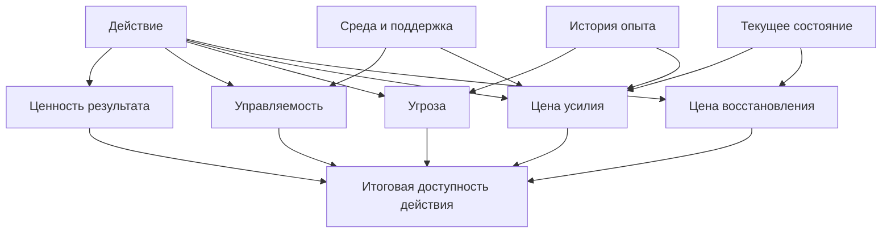
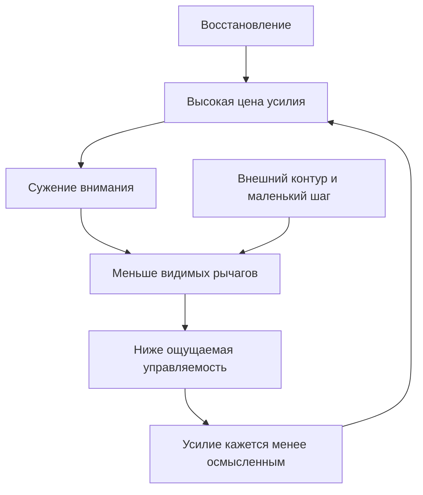

# Глава 11. Цена усилия, усталость и ощущаемая энергия

## Почему "могу повлиять" еще не значит "могу сейчас"

В главе 10 мы разобрали управляемость:

```text
если я сделаю X, изменится ли Y?
```

Это был важный шаг. Пока человек не видит рычага, усилие легко превращается в расход в пустоту. Но управляемость не закрывает всю мотивационную модель.

Даже если рычаг есть, действие может оставаться недоступным.

Человек может понимать задачу, видеть ценность, не считать ее смертельно опасной и все равно не входить в работу. Не потому, что он "на самом деле не хочет". Не потому, что слабый. И не потому, что в нем закончился один общий бак энергии.

У действия есть цена.

Эта цена может быть физической: нужно встать, ехать, двигаться, терпеть дискомфорт, выдерживать нагрузку.

Она может быть когнитивной: нужно держать много условий, читать сложный код, сравнивать гипотезы, не потерять ход мысли.

Она может быть социально-эмоциональной: нужно написать неприятное сообщение, встретиться с реакцией другого человека, признать ошибку, выдержать конфликт.

Она может быть идентичностной: нужно увидеть, что я пока не умею, что мой уровень ниже желаемого, что образ "я справляюсь" не совпадает с фактом.

Она может быть восстановительной: после действия придется долго приходить в себя, возвращать фокус, разгружать тело, закрывать последствия.

Поэтому фраза:

```text
у меня нет энергии
```

слишком грубая. Иногда она говорит о настоящей усталости. Иногда - о высокой цене входа. Иногда - о социальном риске. Иногда - о низком восстановлении. Иногда - о тревоге, которая маскируется под усталость. Иногда - о задаче, которая стала слишком дорогой для текущего состояния системы.

Здесь нужно научиться раскладывать "нет энергии" на составные части.

## Рабочее определение цены усилия

Цена усилия - это субъективная стоимость действия в текущем состоянии системы.

В этом определении важны три слова.

Первое: `субъективная`.

Субъективная не значит выдуманная. Цена действия не обязана совпадать с тем, как оно выглядит со стороны. Письмо на пять строк может быть дороже двух часов кода, если в письме есть стыд, риск конфликта и неопределенная реакция. Созвон на полчаса может быть тяжелее спокойного рабочего блока, если после него придется восстанавливать внимание и эмоциональное равновесие.

Второе: `стоимость`.

Усилие не только неприятно. Иногда оно ценно само по себе: трудное упражнение дает гордость, сложная глава дает чувство роста, тяжелая тренировка подтверждает способность выдерживать нагрузку. Но даже ценное усилие остается затратой. Его нужно оплатить вниманием, телом, временем, регуляцией эмоций и восстановлением.

Третье: `в текущем состоянии`.

Одна и та же задача в разные дни стоит по-разному. После сна, ясного утра и понятного плана цена входа ниже. После ночи без восстановления, конфликтного дня и трех прерываний цена той же задачи выше. Это не каприз. Система оценивает не абстрактную задачу, а задачу здесь и сейчас.

Минимальная формула главы:

```text
доступность действия =
ценность результата
+ управляемость
- угроза
- цена усилия
- цена восстановления
с поправкой на состояние тела, памяти, среды и отношений
```

Это не математическая формула. Это способ не потерять важные переменные.

## Схема цены действия

Вопрос схемы: что делает важное действие доступным или слишком дорогим в текущем состоянии.



Схему нужно читать так.

Ценность тянет к действию. Управляемость может делать усилие осмысленным. Угроза может повышать осторожность или избегание. Цена усилия показывает, сколько придется заплатить сейчас. Цена восстановления показывает, чем действие отзовется потом.

Если смотреть только на ценность, мы получим моральный вопрос:

```text
почему я не делаю то, что важно?
```

Если добавить цену, вопрос становится инженерным:

```text
что именно делает важное действие слишком дорогим сейчас?
```

Эта схема не изображает человека как бак энергии. Она показывает несколько источников цены: усилие сейчас, угрозу, восстановление после действия, состояние тела, прошлый опыт и среду. Поэтому ответом может быть не только "отдохнуть", но и "снизить первый шаг", "вернуть рычаг", "убрать лишнюю угрозу" или "вынести контекст наружу".

## Виды цены усилия

Цена усилия не одна. Ее полезно разложить на несколько видов.

| Вид цены | Что дорого | Как это ощущается | Как снижать |
| --- | --- | --- | --- |
| Физическая | Движение, поза, боль, нагрузка, недосып, болезнь, дорога. | "телу тяжело", "не вывожу", "хочу лечь". | Сон, пауза, еда, вода, разминка, смена позы, перенос тяжелого действия на более подходящее время. |
| Когнитивная | Рабочая память, внимание, неопределенность, сложность, поиск решения. | "не держу все в голове", "не понимаю, с чего начать". | Внешняя карта контекста, маленький первый шаг, схема, разбиение, рабочий журнал. |
| Социально-эмоциональная | Реакция людей, конфликт, просьба, отказ, публичность, чужая оценка. | "не хочу писать", "будет неприятно", "меня сейчас разнесет". | Подготовить текст, снизить публичность, попросить поддержку, уточнить рамку разговора, сделать шаг обратимым. |
| Идентичностная | Угроза образу себя: компетентный, сильный, хороший, нужный, взрослый. | "если не получится, это скажет обо мне что-то плохое". | Отделить результат от личности, разрешить черновик, задать критерий обучения, искать данные вместо приговора. |
| Временная | Длительность, разгон, длинный горизонт, невозможность быстро закрыть. | "это поглотит весь день", "я застряну". | Ограничить блок, определить критерий продвижения, оставить контрольную точку. |
| Восстановительная | Цена последствий: сколько придется возвращать фокус, контакт, силы. | "после этого я уже ни на что не годен". | Планировать восстановление, не ставить тяжелые действия подряд, закрывать контекст перед выходом. |

Эта таблица нужна не для самокопания. Она нужна для проектирования.

Если дорого внимание, часто помогает внешний контур мышления.

Если дорого тело, часто помогает восстановление и выбор времени.

Если дорог социальный риск, часто помогает подготовка контакта.

Если дорог самообраз, часто помогает черновой режим и безопасная обратная связь.

Если дорога неопределенность, часто помогает первый проверяемый шаг.

Разные виды цены требуют разных решений. Поэтому фраза "надо просто собраться" почти бесполезна: она не говорит, какой именно параметр менять.

## Усилие не только вредно

Есть соблазн сделать из этой главы простой вывод:

```text
если усилие дорогое, надо всегда снижать усилие
```

Это неверно.

Усилие бывает вредным, когда оно расходуется без управляемости, без восстановления, без смысла, без обратной связи или только ради защиты от стыда.

Но усилие бывает развивающим. Человек может ценить задачу именно потому, что она трудная. Трудность может давать ощущение мастерства, авторства и роста. Тренировка обычно требует некоторого усилия. Сложное обучение без напряжения часто остается поверхностным. Хороший инженерный разговор не всегда комфортен, но может быть необходим, чтобы команда стала честнее и сильнее.

Поэтому когнитивное инженерство не должно превращаться в культ комфорта.

Задача не в том, чтобы убрать всякое усилие. Задача в том, чтобы отличать:

```text
полезную цену роста
```

от

```text
бессмысленной цены трения, угрозы, хаоса и отсутствия восстановления
```

Полезное усилие обычно имеет признаки:

- понятно, ради чего оно;
- есть хотя бы частичная управляемость;
- есть обратная связь;
- есть шанс научиться;
- цена не разрушает восстановление;
- после действия остается не только облегчение, но и след роста.

Разрушительное усилие часто выглядит иначе:

- цель мутная;
- рычага нет;
- обратная связь запаздывает или противоречива;
- цена ошибки чрезмерна;
- восстановление не предусмотрено;
- действие повторяется только потому, что иначе страшно.

Обе ситуации могут быть "трудными". Но это разная трудность.

## Усталость как изменение готовности платить цену

Усталость часто описывают так, будто внутри человека стоит батарейка.

```text
заряд есть -> работаю
заряда нет -> не работаю
```

Эта метафора удобна, но слишком груба.

Усталость лучше понимать как состояние, в котором возрастает субъективная цена продолжения или нового входа в действие. Система не обязательно полностью потеряла способность. Она меняет оценку:

```text
сколько будет стоить следующий шаг?
```

Иногда усталость действительно связана с физическими ограничениями: недосып, болезнь, нагрузка, боль, длительное напряжение. Тогда требовать прежнего темпа бессмысленно.

Иногда усталость связана с когнитивной работой: долгое удержание сложного контекста, множественные переключения, принятие решений, конфликтующие требования.

Иногда усталость социальная: человек весь день удерживал реакции других людей, сглаживал напряжение, отвечал, договаривался, был доступен.

Иногда усталость мотивационная: слишком долгое действие без видимого сдвига, без обратной связи и без ощущения влияния.

Важная мысль:

```text
усталость не всегда говорит "ты не можешь".
Иногда она говорит "дальше будет слишком дорого".
```

Это не делает усталость слабостью. Но и не делает ее абсолютным запретом. Ее нужно читать точнее.

## Восстанавливаемая и медленно восстанавливаемая усталость

Для практики полезно различать два темпа усталости.

### Восстанавливаемая усталость

Это усталость, которая заметно снижается коротким восстановлением или сменой режима.

Примеры:

- после 90 минут сложного чтения помогает пройтись;
- после напряженного созвона помогает 15 минут тишины;
- после долгого сидения помогает разминка;
- после серии микрозадач помогает один блок без сообщений;
- после застревания помогает выписать контекст и начать с меньшего шага.

Здесь не нужен большой жизненный пересмотр. Нужно не ломать себя через стену, а восстановить доступность действия.

### Медленно восстанавливаемая усталость

Это накопленная цена, которая не исчезает за один перерыв.

Примеры:

- неделями не хватает сна;
- каждый день заполнен прерываниями и реактивной работой;
- ответственность есть, полномочий мало;
- задачи требуют постоянной социальной осторожности;
- ошибки стоят слишком дорого;
- работа не дает восстановления управляемости;
- человек долго живет в режиме "еще немного потерпеть".

Здесь короткий отдых может помочь на час, но не решает систему. Нужно менять режим нагрузки, восстановление, границы, объем параллельной работы, поддержку, ожидания и иногда саму организацию работы.

Это различение важно для будущих глав про выгорание. Выгорание нельзя честно объяснить как "сильно устал". Но и игнорировать накопленную усталость нельзя: она меняет мотивационную экономику.

## Высокая цена входа не равна усталости

Есть еще одно различение.

Человек может говорить:

```text
я устал
```

но фактически быть не столько уставшим, сколько не вошедшим.

Высокая цена входа часто возникает, когда задача требует сразу поднять слишком много контекста:

- вспомнить, где остановился;
- понять текущую цель;
- открыть файлы;
- восстановить гипотезы;
- вспомнить ограничения;
- снова встретиться с неприятным местом;
- решить, какой шаг первый;
- выдержать риск, что шаг окажется неправильным.

Снаружи это похоже на отсутствие энергии. Внутри это может быть перегрузка запуска.

Пример из разработки.

Задача не огромная. Нужно вернуться к сложному багу. Но после двух дней перерыва неясно:

- какие гипотезы уже проверены;
- какой лог был важен;
- где был последний подозрительный участок;
- что обещано другим людям;
- какой критерий "починили" будет достаточным.

В такой ситуации человек может не входить в задачу не потому, что физически не способен работать. Цена восстановления контекста стала слишком высокой.

Инженерное решение здесь не кофе и не самоуговор. Решение:

```text
восстановить внешний контур задачи
```

Именно поэтому главы 4-6 шли раньше мотивации. Рабочий журнал, карта контекста и контрольная точка могут снижать цену входа. Они не добавляют "силу воли". Они могут уменьшать стоимость запуска.

## Аллостатический бюджет

Теперь можно осторожно ввести телесный слой.

Аллостаз - это регуляция организма через предвосхищение потребностей. Организм не просто возвращается к одной фиксированной норме. Он постоянно готовится к тому, что, по прогнозу, понадобится дальше: энергия, внимание, иммунная реакция, мобилизация, сон, восстановление, осторожность, социальная готовность.

Аллостатический бюджет в этом учебнике - рабочее обозначение цены и емкости такого регулирования.

Это не буквальный бак.

Не существует простого внутреннего счетчика:

```text
сегодня у меня 43 процента аллостатического бюджета
```

Но как модельный язык это полезно. Он позволяет сказать:

```text
действие оценивается не только по смыслу и плану,
но и по текущей регуляторной цене для организма
```

На этот бюджет влияют:

- сон;
- длительность стресса;
- болезнь и воспаление;
- боль;
- питание и метаболическое состояние;
- физическая нагрузка;
- тревожное ожидание;
- социальная напряженность;
- непрерывные прерывания;
- отсутствие восстановления;
- неопределенность будущей нагрузки.

Когда аллостатическая нагрузка высока, система может делать разумную с ее точки зрения вещь: повышать цену новых действий. Не потому, что цель не важна, а потому что организм прогнозирует слишком дорогую адаптацию.

## Интероцептивная оценка и ощущаемая энергия

Интероцепция - это обработка сигналов о внутреннем состоянии тела: дыхание, сердечный ритм, напряжение, голод, насыщение, боль, тошнота, температура, висцеральные ощущения, усталость, возбуждение.

Мозг не просто пассивно читает эти сигналы. Он предсказывает состояние тела и сверяет прогноз с сигналами. Поэтому субъективное "мне тяжело", "меня мутит", "я не вывожу", "я собран", "у меня есть силы" можно рассматривать как результат интероцептивной и аллостатической оценки.

В этой рамке ощущаемая энергия - не вещество и не измеряемый напрямую запас.

Это феноменологический итог вопроса:

```text
допустима ли цена этого действия для моей системы сейчас?
```

Отсюда следует важная практическая осторожность.

Если человек говорит "нет энергии", не нужно сразу спорить:

```text
энергия появится, когда начнешь
```

Иногда действительно начало может снижать цену: контекст поднимается, неопределенность падает, действие становится управляемым.

Но иногда начало только подтверждает, что цена слишком высока: тело перегружено, восстановление провалено, угроза сильна, задача социально опасна, а рычага мало.

Правильный вопрос не:

```text
энергия настоящая или ненастоящая?
```

Правильный вопрос:

```text
какой тип цены сейчас закодирован как "нет энергии"?
```

## Как цена усилия взаимодействует с управляемостью

Управляемость меняет цену усилия.

Один и тот же труд в управляемой задаче и неуправляемой задаче ощущается по-разному.

Если действие влияет на исход, усилие чаще ощущается как инвестиция.

Если действие не влияет на исход, усилие может ощущаться как потеря.

Но обратное тоже верно: цена усилия меняет переживание управляемости.

Когда человек очень устал, ему труднее видеть рычаги. Рабочая память уже, терпимость к неопределенности ниже, угроза ошибки выше. Даже управляемая задача может выглядеть как неуправляемая.

Получается петля:



Эта петля объясняет, почему в плохом состоянии полезно не спорить с собой, а делать две вещи:

- снижать цену;
- восстанавливать видимость рычага.

Например:

```text
не "сейчас закрою всю задачу",
а "за 15 минут восстановлю, где остановился, и выберу один проверяемый шаг"
```

Такой шаг может одновременно снижать когнитивную цену и повышать управляемость.

## Отдых и избегание

В главе 9 мы уже различали отдых и избегание. Здесь нужно закрепить это различие через цену усилия.

Отдых - это действие или пауза, после которых доступность ценного действия растет.

Избегание - это уход, после которого встреча с задачей становится менее вероятной или более дорогой, даже если прямо сейчас стало легче.

Они могут выглядеть одинаково.

Человек закрывает ноутбук.

В одном случае он делает это после рабочего блока, оставляет контрольную точку, идет гулять и возвращается с более низкой ценой входа.

В другом случае он закрывает ноутбук на месте неопределенности, ничего не фиксирует, получает облегчение, а завтра цена входа становится еще выше.

Снаружи: "отдохнул".

По функции: разные процессы.

Проверка простая:

| Вопрос | Больше похоже на отдых | Больше похоже на избегание |
| --- | --- | --- |
| После паузы проще вернуться? | Да | Нет |
| Осталась контрольная точка? | Да | Нет |
| Цена входа снизилась? | Да | Нет, выросла |
| Задача стала яснее? | Да или нейтрально | Нет, стала туманнее |
| Что было главным эффектом? | Восстановление | Облегчение от ухода |
| Есть ли следующий шаг? | Да | Нет |

Когнитивное инженерство не должно стыдить отдых. Наоборот: хороший отдых является частью системы действия. Но оно должно честно видеть, когда пауза используется как способ не встретиться с угрозой.

## Как снижать цену, не обесценивая задачу

Снизить цену не значит сделать задачу мелкой, пустой или приятной.

Снизить цену - значит убрать лишнее трение, которое не нужно для смысла работы.

### 1. Уменьшить первый шаг

Плохая формулировка:

```text
написать главу
```

Лучше:

```text
выписать 7 тезисов главы
```

Еще лучше:

```text
выписать, что в этой главе нельзя забыть объяснить
```

Полезно, чтобы первый шаг был достаточно маленьким, чтобы система не считала вход опасным, и достаточно содержательным, чтобы он реально двигал задачу.

### 2. Сделать действие обратимым

Многие задачи становятся дорогими из-за ощущения необратимости.

```text
написать финальный текст
```

дороже, чем:

```text
собрать рабочий черновик, который потом можно выкинуть
```

```text
сказать окончательную позицию
```

дороже, чем:

```text
отправить черновик мысли и попросить проверить критерий
```

Обратимость часто снижает угрозу и идентичностную цену.

### 3. Вынести контекст наружу

Если дорого держать все в голове, задача просит внешний контур.

Минимальный шаблон:

```text
Цель:
Факты:
Туман:
Гипотезы:
Проверенные тупики:
Ограничения:
Следующий шаг:
Где остановился:
```

Это может снижать когнитивную цену и цену повторного входа.

### 4. Снизить социальный риск

Если дорого не действие, а контакт, нужно проектировать контакт.

Примеры:

- сначала написать черновик сообщения;
- отделить факты от интерпретаций;
- попросить короткий синхрон вместо длинного спора;
- начать с вопроса о критерии;
- заранее обозначить границы ответственности;
- перевести конфликт из "кто виноват" в "что меняем в системе".

Социальная цена часто падает, когда появляется рамка разговора.

### 5. Защитить восстановление

Иногда действие дорого не само по себе, а тем, что после него не будет места восстановиться.

Тогда решение:

- не ставить два тяжелых созвона подряд;
- не входить в сложный конфликт перед сном;
- оставить время после публичной защиты;
- закрывать рабочий блок контрольной точкой;
- не планировать deep work сразу после социально тяжелого эпизода.

Если восстановление не защищено, система может разумно повышать цену входа.

### 6. Выбрать правильный слой вмешательства

Главный диагностический вопрос:

```text
что именно здесь дорого?
```

Если дорого тело - нужен отдых, сон, еда, движение, медицинская осторожность.

Если дорого внимание - нужен внешний контур, разбиение и защита от прерываний.

Если дорога неопределенность - нужен первый проверяемый шаг.

Если дорог риск ошибки - нужен черновой режим и обратимость.

Если дорог контакт - нужна рамка разговора.

Если дорог самообраз - нужно отделить обучение от приговора личности.

Если дорога вся жизнь вокруг задачи - нужно смотреть не на задачу, а на режим.

## Главный пример: две задачи по часу

Представим две задачи.

Первая:

```text
дописать технический раздел, где структура уже понятна
```

Вторая:

```text
написать человеку, что в прошлой договоренности была ошибка,
и предложить исправление
```

Обе могут занять один час.

Но их цена разная.

В первой задаче основная цена когнитивная:

- удержать структуру;
- подобрать формулировки;
- проверить факты;
- не расползтись по деталям.

Если человек устал, цена может быть высокой, но ее можно снизить рабочим контуром:

- открыть план;
- выписать тезисы;
- ограничить блок;
- оставить контрольную точку.

Во второй задаче цена многослойная:

- когнитивная: нужно точно описать ситуацию;
- социальная: человек может отреагировать плохо;
- эмоциональная: придется выдержать напряжение;
- идентичностная: придется признать ошибку;
- восстановительная: после ответа может быть трудно вернуться к другой работе.

Если считать только время, задачи равны.

Если считать цену усилия, они разные.

Именно поэтому одна задача может запускаться легко, а другая откладываться днями.

Инженерный ход для второй задачи не такой:

```text
просто напиши уже
```

Лучше так:

```text
1. Выписать факты без обвинений.
2. Отдельно выписать, что я хочу изменить.
3. Написать черновик сообщения.
4. Проверить, где есть лишняя защита или нападение.
5. Отправить короткую версию.
6. После отправки поставить восстановительный буфер 15 минут.
```

Так задача не становится приятной. Но ее цена становится видимой и частично управляемой.

## Диагностика "нет энергии"

Когда возникает "нет энергии", полезно не спорить с этим состоянием, а расшифровать его.

| Вопрос | Если ответ "да" | Первый инженерный ход |
| --- | --- | --- |
| Я физически недовосстановлен? | Сон, боль, болезнь, голод, перегрузка. | Снизить нагрузку, восстановиться, не путать тело с дисциплиной. |
| Я потерял контекст? | Не помню, где остановился и что важно. | Восстановить карту задачи, открыть контрольную точку. |
| Я не вижу первого шага? | Задача большая и туманная. | Сформулировать проверяемый шаг на 10-25 минут. |
| Я боюсь реакции людей? | Дорого писать, просить, спорить, признавать. | Подготовить рамку контакта и черновик сообщения. |
| Я боюсь, что результат скажет обо мне плохое? | Включена идентичностная цена. | Перевести в режим обучения и черновика. |
| Я не верю, что действие повлияет? | Низкая управляемость. | Найти рычаг, данные или обратную связь. |
| Я просто хочу облегчения? | Тянет уйти, закрыть, отвлечься. | Проверить: пауза восстановит вход или закрепит уход? |
| Я давно живу без восстановления? | Цена не уходит после перерывов. | Смотреть режим, объем параллельной работы, границы, нагрузку, поддержку. |

Эта таблица не ставит диагноз. Она помогает выбрать слой вмешательства.

## Мини-словарь главы

| Понятие | Рабочее определение |
| --- | --- |
| Цена усилия | Субъективная стоимость действия в текущем состоянии системы. |
| Физическая цена | Стоимость действия для тела: движение, боль, недосып, болезнь, физическая нагрузка. |
| Когнитивная цена | Стоимость действия для внимания, рабочей памяти, понимания и удержания контекста. |
| Социально-эмоциональная цена | Стоимость контакта, конфликта, оценки, просьбы, отказа или публичности. |
| Идентичностная цена | Стоимость угрозы образу себя: компетентности, силы, взрослости, надежности, нужности. |
| Цена восстановления | То, сколько придется возвращать после действия: внимание, тело, контакт, эмоциональное равновесие. |
| Усталость | Состояние, в котором возрастает цена продолжения или нового входа в действие. |
| Восстанавливаемая усталость | Усталость, которая заметно снижается коротким отдыхом, сменой режима или разгрузкой контекста. |
| Медленно восстанавливаемая усталость | Накопленная цена, которая не исчезает за один перерыв и требует изменения режима. |
| Аллостатический бюджет | Рабочее обозначение текущей и прогнозируемой регуляторной цены состояния организма. |
| Интероцептивная оценка | Оценка внутреннего состояния тела, которая участвует в ощущении доступности действия. |
| Ощущаемая энергия | Субъективный итог оценки допустимости действия по цене, риску, управляемости и восстановлению. |

## Вопросы для самопроверки

1. Почему важная и управляемая задача все равно может не запускаться?
2. Чем цена усилия отличается от ценности результата?
3. Почему "субъективная цена" не означает "выдуманная цена"?
4. Какие виды цены могут скрываться за фразой "нет энергии"?
5. Почему час неприятного разговора может быть дороже часа технической работы?
6. Чем усталость отличается от высокой цены входа?
7. Как отличить отдых от избегания?
8. Почему аллостатический бюджет нельзя понимать как буквальный бак?
9. Как внешний контур мышления снижает цену входа?
10. Какой вид цены чаще всего делает дорогой вашу текущую сложную задачу?

## Мини-практика

Возьмите одну задачу, которую вы не начинаете, хотя она важна.

Заполните таблицу:

| Вопрос | Ответ |
| --- | --- |
| Что в задаче ценно? |  |
| Какой рычаг у меня есть? |  |
| Какая угроза делает вход дорогим? |  |
| Какая цена здесь главная: физическая, когнитивная, социальная, идентичностная, восстановительная? |  |
| Что я называю "нет энергии" в этой задаче? |  |
| Это больше похоже на усталость или высокую цену входа? |  |
| Что снизит цену без обесценивания задачи? |  |
| Какой первый шаг займет 10-25 минут? |  |
| Как я оставлю контрольную точку, чтобы не поднять цену будущего входа? |  |

После этого сформулируйте вход:

```text
Я не обязан сейчас закрыть всю задачу.
Главная цена здесь:
<вид цены>.

Я снижаю ее так:
<конкретное инженерное действие>.

Первый шаг:
<10-25 минут>.

После шага я оставлю контрольную точку:
<что зафиксирую>.
```

Пример:

```text
Я не обязан сейчас закрыть весь конфликт.
Главная цена здесь: социально-эмоциональная и идентичностная.

Я снижаю ее так: сначала пишу черновик фактов без отправки.

Первый шаг: 20 минут выписываю, что произошло, что нужно исправить и какой вопрос задать.

После шага я оставлю контрольную точку: финальный черновик сообщения и пометку, что нужно проверить перед отправкой.
```

## Короткое резюме

1. Мотивация зависит не только от ценности, угрозы и управляемости, но и от цены усилия.
2. "Нет энергии" - слишком грубый сигнал. Его нужно раскладывать на виды цены и состояния.
3. Субъективная цена не является выдумкой: она зависит от тела, памяти, среды, отношений, опыта и восстановления.
4. Усилие не всегда плохо. Оно может быть источником роста, смысла и мастерства, если остается управляемым и восстановимым.
5. Усталость лучше понимать как рост цены продолжения или входа в действие, а не как один пустой бак.
6. Высокая цена входа может маскироваться под усталость, особенно когда потерян контекст задачи.
7. Аллостатический бюджет - рабочая модель регуляторной цены состояния, а не буквальная емкость силы воли.
8. Отдых восстанавливает доступность действия; избегание снижает встречу с угрозой и часто повышает будущую цену входа.
9. Снижение цены усилия - не поблажка, а инженерное проектирование условий действия.
10. После этой главы мотивационный блок можно собрать в формулу: ценность, угроза, управляемость, цена усилия.

## Источниковая опора

Проверенный пакет для этой главы: [[../Источники/2026-05-24 Пакет источников для главы 11]].

Ключевые источники в авторско-годовой форме:

- Salamone & Correa (2024), Frank (2025), Treadway et al. (2009, 2012), Chong et al. (2017): готовность платить усилием, решения на основе цены усилия и адаптивный контроль затрат и выгод.
- Shenhav, Botvinick & Cohen (2013): ожидаемая ценность контроля и стоимость когнитивного контроля.
- Kurzban et al. (2013): субъективное усилие как модель альтернативной стоимости.
- Inzlicht, Shenhav & Olivola (2018): усилие одновременно дорого и ценно.
- Hogan et al. (2020), Muller et al. (2021): физическая и моментальная усталость меняют выбор через субъективную цену будущего усилия.
- McEwen (1998), McEwen & Wingfield (2003): аллостаз и аллостатическая нагрузка как язык регуляторной цены состояния.
- Barrett & Simmons (2015): интероцептивные предсказания как мост к ощущаемой энергии.
- Внутренние авторские материалы по мотивации, усилию, истощению, управляемости, привычкам, восстановлению и ресурсному состоянию.

Доказательная роль блока: `strong` для решений на основе цены усилия, ожидаемой ценности контроля, аллостаза и понимания усталости как сдвига цены; `context-dependent` для интерпретации ощущаемой энергии как рабочей интероцептивно-предиктивной модели; `fast-moving` для Frank (2025) как свежей вычислительной рамки; `clinical-boundary` для Treadway et al. (2012) и длительной потери энергии. Глава не превращает усталость в "пустой бак", не сводит цену усилия к дофамину и не дает медицинскую самодиагностику.

Полные библиографические записи и DOI сохранены в пакете главы. В текущей редакции глава оставляет короткий авторско-годовой блок как читательский ориентир.

## Переход к следующей главе

Теперь мотивационный блок собран.

Мы ввели:

```text
ценность - зачем действовать
угрозу - от чего система защищается
управляемость - есть ли рычаг
цену усилия - сколько стоит действие сейчас
```

Этого достаточно, чтобы разбирать многие человеческие состояния без грубых ярлыков:

```text
ленится
слабая воля
нет мотивации
просто устал
```

Но дальше появляется новый риск. Мы начали говорить о теле, аллостазе, интероцепции, усталости и нейрофизиологии. Если теперь не развести уровни объяснения, учебник легко уйдет в нейромифы.

Дальше нужна дисциплина уровней:

```text
психологическое описание
вычислительный параметр
нейронный контур
биохимический механизм
практическое вмешательство
```

Это нужно, чтобы не путать "мне дорого входить в задачу" с "у меня низкий дофамин", а "усталость" - с одним универсальным биомаркером.

## Статус

`ready-for-review`

Источниковый пакет: [[../Источники/2026-05-24 Пакет источников для главы 11]].

Проверки: [[../Проверки/2026-05-24 Связка глав 10-11]] и [[../Проверки/2026-05-24 Мотивационный блок 7-11]].

Следующий шаг: при финальной редактуре сохранить главу как мост к уровням объяснения: цена усилия, усталость, аллостаз и интероцепция должны оставаться рабочими моделями, а не нейромифами или медицинской диагностикой.
