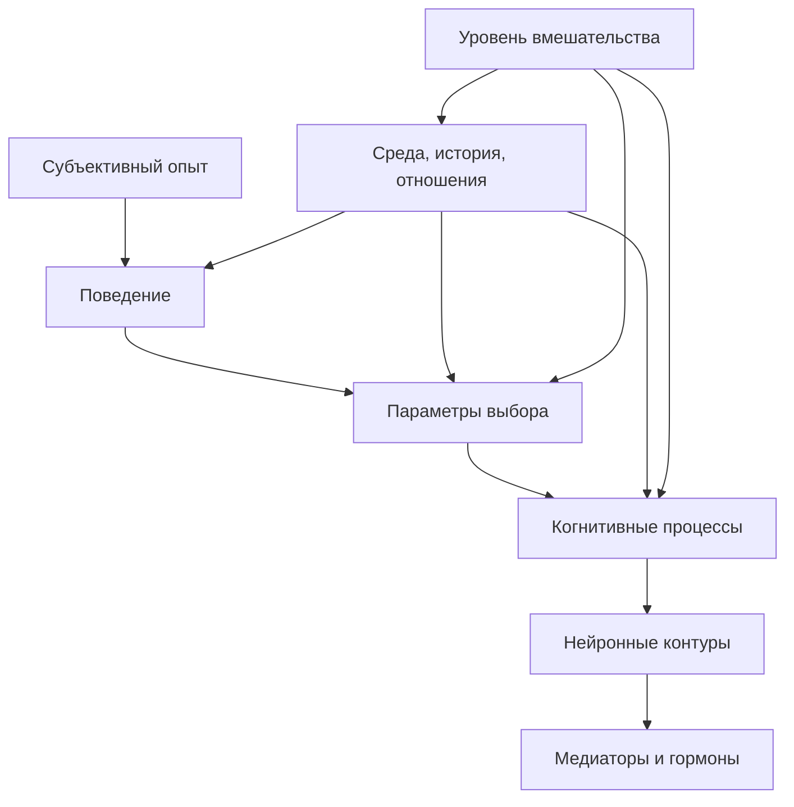

# Глава 12. Уровни объяснения

## Почему перед мозгом нужна пауза

Мы подошли к части учебника, где появятся мозг, тело, нейромедиаторы, гормоны, стрессовые системы и биохимия.

Это важный слой. Без него разговор о мотивации, усталости, внимании и выгорании быстро становится слишком психологическим: будто человек существует только как набор мыслей, решений и привычек.

Но есть и обратная опасность.

Как только появляются слова:

```text
дофамин
миндалина
префронтальная кора
кортизол
серотонин
интероцепция
```

возникает соблазн объяснять слишком быстро.

```text
Нет мотивации - значит, низкий дофамин.
Страшно - значит, активировалась миндалина.
Не могу собраться - значит, слабая префронтальная кора.
Выгорание - значит, сломалась стрессовая система.
```

Такие фразы звучат научно. Но чаще всего они не объясняют, а закрывают объяснение раньше времени.

В предыдущих главах мы строили мотивационную модель по слоям:

```text
ценность
угроза
приближение и избегание
управляемость
цена усилия
усталость и состояние системы
```

Теперь нужно научиться связывать эти слои с мозгом и биохимией так, чтобы не потерять смысл. Для этого нужна дисциплина уровней объяснения.

## Что такое уровень объяснения

Уровень объяснения - это слой вопроса, на котором мы описываем явление.

Один и тот же эпизод можно рассматривать по-разному:

- как человек это переживает;
- что он делает или не делает;
- какие параметры выбора изменились;
- какие когнитивные процессы задействованы;
- какие нейронные контуры могут участвовать;
- какие медиаторы и гормоны меняют режим;
- какая среда поддерживает или ломает действие;
- где можно вмешаться.

Это не восемь конкурирующих объяснений, из которых нужно выбрать одно "настоящее". Это разные вопросы к одному явлению.

Пример:

```text
человек не открывает важную задачу и говорит: "нет энергии"
```

Можно спросить:

```text
что он чувствует?
что он делает?
что в задаче дорого?
какой первый шаг потерян?
какие системы контроля, угрозы и интероцепции могут участвовать?
какие медиаторы меняют режим готовности?
как устроены сон, нагрузка, прерывания и восстановление?
что можно изменить сейчас?
```

Все эти вопросы полезны. Но они не одинаковы.

Ошибка начинается тогда, когда ответ на один вопрос выдают за ответ на все остальные.

## Лестница уровней

Вопрос схемы:

```text
как разложить один эпизод по уровням,
чтобы не перескочить от переживания сразу к нейромифу
и не потерять уровень вмешательства?
```



Эта схема не говорит, что верхние уровни "поверхностные", а нижние "настоящие".

Как читать схему:

- сверху вниз мы уточняем, каким вопросом сейчас занимаемся;
- боковая среда показывает, что действие не рождается в пустоте;
- уровень вмешательства не обязан совпадать с самым "глубоким" уровнем реализации;
- хороший разбор не ищет один главный уровень, а удерживает связку между переживанием, поведением, механизмом и доступным ходом.

Субъективный опыт реален. Поведение реально. Параметры выбора реальны как рабочая модель. Нейронные контуры реальны. Медиаторы и гормоны реальны. Среда реальна.

Разница в том, какой вопрос мы задаем.

Если человек говорит "мне страшно", субъективный уровень сообщает, как ситуация дана человеку изнутри.

Если он не отправляет письмо, поведенческий уровень описывает, что происходит во внешнем действии.

Если угроза ошибки выше управляемости, уровень параметров объясняет, почему действие не выбирается.

Если внимание сужается, рабочая память перегружена и первый шаг не удерживается, когнитивный уровень объясняет, как распадается вход.

Если участвуют сети угрозы, контроля и интероцепции, контурный уровень говорит, через какие системы это может реализоваться.

Если норадреналин, дофамин, кортизол или другие регуляторы меняют режим готовности, нейрохимический уровень уточняет физическую настройку системы.

Если человек живет в среде постоянных прерываний, низкого сна, неясных полномочий и высокой социальной цены ошибки, средовой уровень объясняет, почему система снова и снова приходит к тому же состоянию.

Ни один уровень не отменяет другие.

## Пример: "нет энергии"

Разберем один эпизод, чтобы уровни не остались абстракцией.

Ситуация:

```text
человек должен вернуться к важной задаче,
но не открывает ее и говорит: "нет энергии"
```

### Субъективный уровень

На субъективном уровне есть переживание:

```text
мне недоступно действие
```

Человек может ощущать тяжесть, сопротивление, мутность, сонливость, тревогу, отвращение, скуку или пустоту.

На этом уровне важно не спорить сразу.

```text
Да ладно, энергия появится, когда начнешь
```

Иногда это правда. Иногда нет.

Субъективный уровень дает данные о состоянии системы. Но он не говорит автоматически, каков механизм.

### Поведенческий уровень

На поведенческом уровне важно описать не настроение, а действие.

Что человек делает?

- не открывает задачу;
- открывает, но сразу уходит;
- читает одно и то же место;
- переключается на мелкие задачи;
- ищет "подготовительные" материалы;
- ждет подходящего состояния;
- отвечает в чатах вместо входа в сложное место.

Поведение точнее, чем общий ярлык.

Фраза "нет энергии" может сопровождать разные поведения: отдых, избегание, замирание, рассеянный поиск, защитный контроль, микропродуктивность.

Если не описать поведение, трудно понять, что именно менять.

### Уровень параметров выбора

На уровне параметров мы спрашиваем:

```text
какая конфигурация делает действие маловероятным?
```

В терминах предыдущих глав:

- ценность есть;
- угроза ошибки или оценки высока;
- цена входа высока;
- управляемость низкая или не видна;
- первый шаг не выделен;
- облегчение от ухода доступно сразу;
- восстановление после действия не защищено.

Здесь "нет энергии" перестает быть одним состоянием. Оно превращается в итоговую метку нескольких параметров.

Если главная проблема - низкая управляемость, обычно нужен рычаг.

Если главная проблема - высокая цена входа, часто помогают внешний контур и маленький шаг.

Если главная проблема - социальная угроза, часто нужна рамка разговора.

Если главная проблема - физическая усталость, чаще всего нужны разгрузка и восстановление.

Уровень параметров нужен потому, что он ближе всего к инженерному вмешательству.

### Когнитивный уровень

На когнитивном уровне мы спрашиваем:

```text
какие процессы должны работать, чтобы действие началось?
```

В сложной задаче нужны:

- внимание;
- рабочая память;
- восстановление контекста;
- выбор релевантного;
- торможение отвлечений;
- прогноз следующего шага;
- обновление плана после обратной связи.

Если задача туманная, рабочая память перегружена еще до начала. Человек не просто "не хочет". Ему нужно поднять в голове слишком много элементов.

Здесь становится понятно, почему рабочий журнал из глав 4-6 может снижать цену действия. Он вмешивается не в "дофамин", а в когнитивную архитектуру задачи:

```text
меньше держать в голове
легче восстановить контекст
яснее следующий шаг
меньше неопределенность входа
```

### Контурный уровень

На контурном уровне мы спрашиваем:

```text
какие мозговые сети могут участвовать в таком состоянии?
```

Дальше в учебнике появятся префронтальная кора, передняя и средняя поясная кора (ACC/aMCC), стриатум, миндалина, островок, гиппокамп, голубое пятно (LC) и другие системы.

Но здесь важна осторожность.

Нельзя сказать:

```text
человек не начал, потому что у него миндалина
```

Или:

```text
он прокрастинирует, потому что префронтальная кора проиграла лимбической системе
```

Это слишком грубо.

Контуры не являются персонажами. Они не "хотят", не "ленятся", не "саботируют". Они реализуют процессы: оценку угрозы, удержание правила, выбор действия, обучение, интероцепцию, переключение режима готовности.

Правильнее говорить так:

```text
в таком состоянии могут участвовать системы контроля, угрозы, оценки усилия, памяти и интероцепции
```

А затем уточнять, какой именно механизм подтвержден, каким методом и в какой задаче.

### Нейрохимический уровень

На нейрохимическом уровне мы спрашиваем:

```text
какие медиаторы, гормоны и регуляторные системы меняют режим работы контуров?
```

Дофамин, норадреналин, серотонин, кортизол, ацетилхолин, ГАМК, глутамат, опиоидные и окситоциновые системы действительно важны.

Но они не являются простыми кнопками.

Дофамин не равен мотивации. Норадреналин не равен вниманию. Серотонин не равен счастью. Кортизол не равен стрессу. Окситоцин не равен любви.

Один медиатор может участвовать в разных процессах в зависимости от контура, рецептора, временного масштаба, состояния организма, задачи и среды.

Поэтому фраза:

```text
нет энергии = низкий дофамин
```

плоха не потому, что дофамин не важен. Она плоха потому, что прыгает через уровни и делает вид, будто один нейрохимический ярлык объяснил всю ситуацию.

### Средовой и исторический уровень

На средовом уровне мы спрашиваем:

```text
какие условия делают такое состояние вероятным снова и снова?
```

Например:

- задача каждый раз начинается без контрольной точки;
- день разорван сообщениями;
- ожидания неясны;
- ошибки публично наказываются;
- полномочий меньше, чем ответственности;
- сон хронически короткий;
- нет восстановления после сложных контактов;
- опыт прошлых попыток закрепил беспомощность или избегание.

Если среда постоянно повышает цену входа, бессмысленно объяснять все только внутренней слабостью или биохимией.

Мозг работает не в пустоте. Он постоянно адаптируется к среде.

## Уровень реализации не всегда уровень вмешательства

Это одно из самых важных различений главы.

Да, всякое человеческое состояние реализуется через тело и мозг. Без мозга нет страха, внимания, желания, усталости, смысла, речи и действия.

Но из этого не следует, что лучшее вмешательство всегда должно быть на биохимическом или нейронном уровне.

Пример.

Человек не может войти в задачу, потому что каждый раз теряет контекст. Физически это состояние, конечно, реализуется через мозг. Но лучшее вмешательство может быть таким:

```text
оставлять контрольную точку
фиксировать гипотезы
выносить туман наружу
ограничивать первый шаг
```

То есть вмешательство лежит на уровне среды и когнитивной организации задачи.

Другой пример.

Человек боится неприятного разговора. Это тоже реализуется через мозг и тело. Но вмешательство может быть социальным:

```text
снизить публичность
уточнить рамку
отделить факты от обвинений
получить поддержку
согласовать формат обратной связи
```

Третий пример.

Человек хронически не восстанавливается. Здесь вмешательство может быть режимным:

```text
сон
параллельная незавершенная работа
границы доступности
перерывы
снижение реактивной нагрузки
перераспределение ответственности
```

Нейробиологический уровень объясняет, почему это влияет на систему. Но он не всегда указывает, где именно надо менять ситуацию.

## Три частые ошибки

### Ошибка 1. Скачок к мозгу

Скачок к мозгу выглядит так:

```text
человек боится -> значит, миндалина
человек не начал -> значит, префронтальная кора не справилась
человек хочет награду -> значит, дофамин
```

Проблема не в том, что эти слова совсем не связаны с реальностью. Проблема в том, что между переживанием и мозговой структурой пропущено слишком много.

Нужно спросить:

- какое поведение мы видим;
- какая задача;
- какая угроза;
- какая управляемость;
- какая цена усилия;
- какая история опыта;
- какие данные реально подтверждают участие конкретного контура.

Только после этого разговор о мозге становится точнее.

### Ошибка 2. Обратный вывод

Обратный вывод - это попытка вывести психологическое состояние по активности мозга.

В слабой форме:

```text
активировалась область X, значит, человек испытывал процесс Y
```

Проблема в том, что одна и та же область мозга может участвовать в разных процессах. Например, зона может активироваться при боли, конфликте, усилии, ошибке, значимости или внимании. Если мы знаем только, что область активна, этого часто недостаточно, чтобы уверенно назвать психологическое состояние.

Это не значит, что нейровизуализация бесполезна. Это значит, что вывод должен опираться на задачу, дизайн исследования, селективность активации, поведение, модель и другие данные.

В учебнике это правило будет простым:

```text
активация области - не диагноз процесса
```

### Ошибка 3. Один медиатор вместо системы

Популярные объяснения любят один медиатор:

```text
дофамин - мотивация
серотонин - настроение
окситоцин - любовь
кортизол - стресс
```

Такие формулы удобны для запоминания, но плохи для понимания.

Медиатор работает в контурах, на рецепторах, в конкретном временном масштабе и в конкретном состоянии организма. Он может менять обучение, значимость, порог действия, торможение, терпимость к ожиданию, телесную мобилизацию или социальную чувствительность. Но он не заменяет собой всю систему.

Медиаторы и гормоны будут разобраны отдельно. Сейчас достаточно правила:

```text
медиатор - регулятор режима, а не самостоятельное объяснение поведения
```

## Как выбирать уровень вмешательства

Когнитивное инженерство интересуется не только тем, почему состояние возникло. Ему важно, где можно изменить систему.

Практическая процедура:

```text
1. Назвать переживание.
2. Описать поведение.
3. Выделить параметры выбора.
4. Проверить когнитивную организацию задачи.
5. Проверить среду и историю.
6. Только потом уточнять возможные контуры и медиаторы.
7. Выбрать самый доступный уровень вмешательства.
```

Разберем на примере.

```text
Переживание: "нет энергии".
Поведение: не открываю задачу, ухожу в мелкие дела.
Параметры: ценность есть, цена входа высокая, управляемость не видна.
Когнитивная организация: нет контрольной точки, не помню последнюю гипотезу.
Среда: день разорван сообщениями, нет защищенного блока.
Контуры и медиаторы: вероятно вовлечены контроль, угроза, интероцепция и системы готовности, но это не главный уровень первого вмешательства.
Вмешательство: восстановить контекст, выделить первый шаг, закрыть уведомления на 25 минут.
```

Здесь мозг важен. Но менять начинаем не мозг напрямую, а условия, которые мозгу придется обрабатывать.

## Матрица уровней и вопросов

| Уровень | Вопрос | Что можно увидеть | Тип вмешательства |
| --- | --- | --- | --- |
| Субъективный | Как это переживается? | Страх, тяжесть, желание, пустота, напряжение. | Назвать состояние, снизить путаницу, отделить стыд от фактов. |
| Поведенческий | Что человек делает? | Начинает, уходит, замирает, контролирует, отвлекается. | Изменить действие, сделать шаг меньше, оставить контрольную точку. |
| Параметры выбора | Что делает действие вероятным или дорогим? | Ценность, угроза, усилие, управляемость, неопределенность. | Снизить угрозу, вернуть рычаг, уменьшить цену входа. |
| Когнитивный | Как обрабатывается задача? | Внимание, рабочая память, прогноз, торможение, переключение. | Внешний контур, схема, разбиение, защита от прерываний. |
| Контурный | Какие системы мозга участвуют? | Контроль, угроза, обучение, интероцепция, выбор действия. | Понимать ограничения и не ждать невозможного от одной техники. |
| Нейрохимический | Какие регуляторы меняют режим? | Готовность, бодрствование, обучение, стрессовая мобилизация. | Сон, нагрузка, медицинская осторожность, отказ от мифов. |
| Средовой | Какие условия поддерживают состояние? | Параллельная незавершенная работа, прерывания, отношения, полномочия, обратная связь, режим. | Менять среду, договоренности, ритуалы, границы. |

Эта матрица не заменяет будущие главы. Она дает карту, по которой их читать.

## Как это защищает от нейромифов

Нейромиф появляется не только из-за фактической ошибки. Часто он появляется из-за слишком короткого объяснительного пути.

Было:

```text
мне тяжело начать
```

Стало:

```text
у меня низкий дофамин
```

Между ними пропущено:

- какая задача;
- какая цена входа;
- какой первый шаг;
- какая угроза;
- какая управляемость;
- какая усталость;
- какая история опыта;
- какая среда;
- какие данные вообще указывают на дофаминовый механизм.

Глава 12 учит не запрещать биологические объяснения, а удлинять путь до них.

Хорошее объяснение не обязано быть длинным. Но оно должно быть честным по уровням.

Можно сказать:

```text
в этой задаче высокая цена входа: потерян контекст, не виден первый шаг, есть социальная угроза; на биологическом уровне такое состояние, вероятно, связано с системами контроля, угрозы, интероцепции и нейромодуляции, но первый рабочий ход - восстановить контекст и снизить цену первого шага
```

Это менее ярко, чем "низкий дофамин". Зато полезнее.

## Что делать с мозгом дальше

После этой главы мы можем идти в нейрофизиологию.

Но будем соблюдать правило:

```text
контур не заменяет функцию
медиатор не заменяет контур
коррелят не заменяет причину
реализация не заменяет вмешательство
```

Дальше можно будет говорить о контурах действия: префронтальной коре (PFC), передней поясной коре (ACC), стриатуме, миндалине, островке и связанных системах.

В главе 14 - о нейромедиаторах и гормонах.

В главе 15 - о стрессе, аллостазе и окне полезной нагрузки.

Эти темы нужны. Но теперь у нас есть защита от простых, слишком уверенных фраз.

## Мини-словарь главы

| Понятие | Рабочее определение |
| --- | --- |
| Уровень объяснения | Слой вопроса, на котором мы описываем явление: переживание, поведение, параметры, процессы, контуры, биохимия, среда. |
| Субъективный уровень | То, как состояние переживается человеком изнутри. |
| Поведенческий уровень | То, что человек делает, не делает или повторяет во внешнем действии. |
| Уровень параметров выбора | Оценки, которые меняют вероятность действия: ценность, угроза, усилие, управляемость, неопределенность. |
| Когнитивный уровень | Процессы внимания, памяти, прогноза, контроля, торможения и переключения. |
| Контурный уровень | Нейронные системы, через которые реализуются функции. |
| Нейрохимический уровень | Медиаторы, гормоны и регуляторные системы, меняющие режим контуров. |
| Средовой уровень | Условия задачи, отношений, истории опыта и рабочего режима. |
| Обратный вывод | Вывод от активации мозга к психологическому процессу; требует осторожности. |
| Редукционизм | Сведение сложного явления к одному "настоящему" уровню объяснения. |
| Объяснительный плюрализм | Подход, в котором несколько уровней объяснения могут быть одновременно необходимы. |
| Уровень вмешательства | Слой, на котором практически лучше менять ситуацию. |

## Вопросы для самопроверки

1. Почему "нет энергии = низкий дофамин" является слишком коротким объяснением?
2. Чем субъективный уровень отличается от поведенческого?
3. Почему нейронная реализация не всегда указывает лучший уровень вмешательства?
4. Что такое обратный вывод и почему он опасен в популярных объяснениях?
5. Почему поведение не нужно считать менее настоящим уровнем, чем мозг?
6. Как среда может поддерживать состояние, которое субъективно переживается как "я не могу"?
7. Какие уровни нужно проверить перед тем, как объяснять сложное состояние медиатором?

## Мини-практика

Возьмите одно состояние, которое вы обычно объясняете одним словом:

```text
нет энергии
страшно
не могу начать
прокрастинирую
раздражен
не хочу
```

Заполните таблицу:

| Уровень | Что здесь происходит? |
| --- | --- |
| Субъективный опыт |  |
| Поведение |  |
| Параметры выбора |  |
| Когнитивная организация задачи |  |
| Среда и история |  |
| Возможные контуры |  |
| Возможные медиаторы/гормоны |  |
| Лучший первый уровень вмешательства |  |

После этого сформулируйте аккуратное объяснение:

```text
Я пока не знаю единственной причины.
На уровне переживания это выглядит как <...>.
На уровне поведения я делаю <...>.
На уровне параметров главным кажется <...>.
Первое вмешательство стоит делать на уровне <...>,
потому что оно ближе всего к доступному изменению.
```

## Короткое резюме

1. Уровень объяснения - это слой вопроса, а не степень "настоящести".
2. Мозг не отменяет психологию, поведение и среду; он реализует их в живой системе.
3. Субъективное состояние не является выдумкой, но оно не раскрывает механизм автоматически.
4. Поведение нужно описывать точно: без поведения трудно понять, что менять.
5. Параметры выбора связывают психологию с инженерным вмешательством.
6. Нейронные контуры не являются персонажами, которые "хотят" или "саботируют".
7. Медиаторы и гормоны регулируют режимы, но не являются кнопками поведения.
8. Обратный вывод требует осторожности: активация области не равна доказательству психологического процесса.
9. Лучший уровень вмешательства не всегда совпадает с уровнем физической реализации.
10. Следующие главы нужно читать через эту дисциплину: контуры и биохимия важны, но только внутри многоуровневой модели.

## Источниковая опора

Проверенный пакет для этой главы: [[../Источники/2026-05-24 Пакет источников для главы 12]].

Ключевые источники в авторско-годовой форме:

- Marr (1982), Tinbergen (1963), Craver (2007): уровни анализа, разные типы вопросов о поведении и многоуровневое механистическое объяснение.
- Poldrack (2006), Krakauer et al. (2017): методологическая граница для нейрообъяснений; обратный вывод и нейронные данные не заменяют точного описания поведения.
- Kendler (2012): объяснительный плюрализм для сложных человеческих состояний, где биологический, психологический, социальный и средовой уровни взаимодействуют.
- Badre (2025), Diamond (2013): когнитивный контроль и исполнительные функции как функциональный язык, который точнее бытовой "силы воли" и не сводится к одной зоне мозга.

Доказательная роль блока: `strong` для методологического различения уровней объяснения, границы обратного вывода и дисциплины "сначала поведение"; `context-dependent` для переноса нейронаучных и психиатрических рамок на инженерную практику; `clinical-boundary` для любых выводов о тяжелых, длительных или клинически значимых состояниях. Глава не запрещает нейробиологические объяснения, а требует не перескакивать от переживания к одному медиатору, гормону или участку мозга.

Полные библиографические записи и DOI сохранены в пакете главы. В текущей редакции глава оставляет короткий авторско-годовой блок как читательский ориентир.

## Переход к следующей главе

Теперь можно вводить контуры действия.

Дальше появятся префронтальная кора (PFC), передняя поясная кора (ACC), стриатум, миндалина, островок и другие системы. После дисциплины уровней их уже можно читать не как список "центров" поведения, а как уровни реализации функций:

```text
удержание цели
оценка конфликта
выбор действия
обучение
угроза
интероцепция
память и контекст
```

Так мозг становится не набором мифических кнопок, а частью объяснительной лестницы.

## Статус

`ready-for-review`

Источниковый пакет: [[../Источники/2026-05-24 Пакет источников для главы 12]].

Связка с предыдущей главой проверена: [[../Проверки/2026-05-24 Связка глав 11-12]].

Ревизия блока: [[../Проверки/2026-05-25 Ревизия блока 12-15]].

Следующая глава: [[13-Контуры-действия]].
