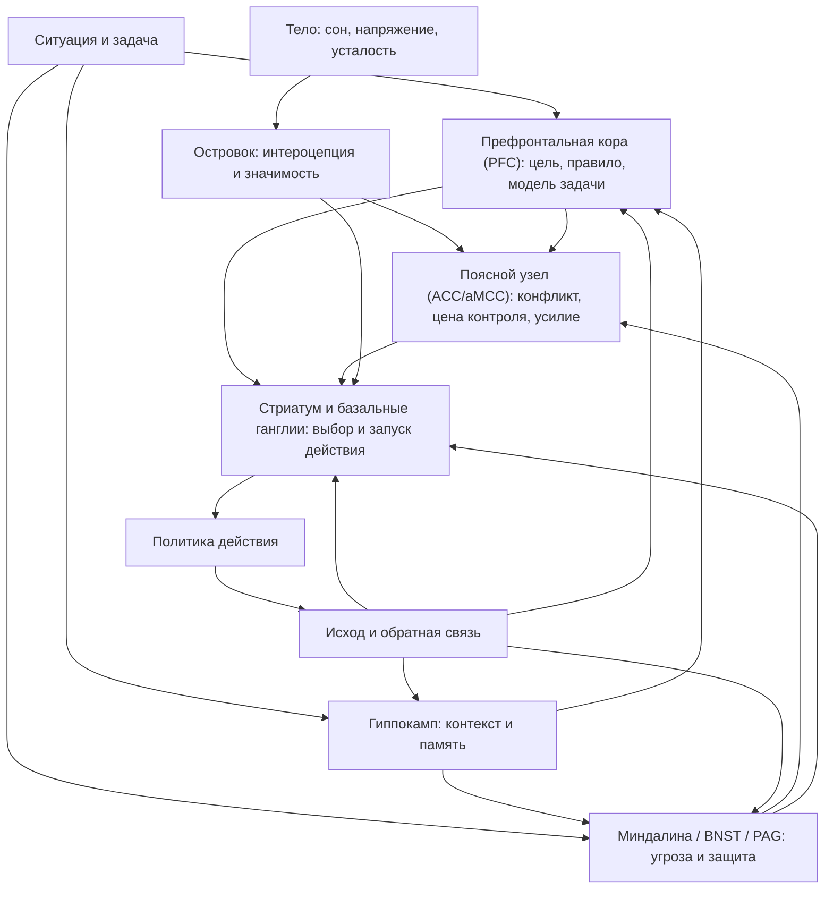

# Глава 13. Контуры действия

## Не "центры", а контуры

Предыдущая глава ввела важную дисциплину: не прыгать от переживания сразу к одной зоне мозга.

Теперь можно говорить о мозге.

Но говорить о нем нужно аккуратно.

Плохой способ выглядит так:

```text
Префронтальная кора отвечает за волю.
Передняя поясная кора отвечает за ошибки.
Стриатум отвечает за привычки.
Миндалина отвечает за страх.
Островок отвечает за ощущения тела.
Гиппокамп отвечает за память.
```

В таких фразах есть зерно правды, но как объяснение они опасны. Они создают ощущение, будто в голове сидит набор отделов: один планирует, другой пугается, третий ленится, четвертый включает автопилот. Это удобно для запоминания, но плохо для понимания.

Мозговая структура не является психологической функцией.

Структура участвует в функции. Часто — в нескольких функциях. И почти всегда — в сети с другими структурами.

Поэтому здесь речь пойдет не о "центрах", а о контурах действия.

Контур действия — это связанная сеть мозговых областей, через которую система удерживает цель, оценивает значимость и угрозу, сравнивает цену усилия с ценностью, выбирает политику действия, запускает движение или тормозит его, обновляет опыт по обратной связи.

Для когнитивного инженерства это важно по простой причине. Если мы понимаем контуры слишком грубо, мы начинаем придумывать грубые вмешательства:

```text
надо прокачать силу воли
надо успокоить миндалину
надо поднять дофамин
надо сломать автопилот
```

Но реальная работа обычно тоньше:

```text
надо восстановить модель задачи
надо снизить угрозу первой попытки
надо уменьшить цену входа
надо убрать легкие конкурирующие действия
надо вернуть телу переносимый режим
надо создать новый опыт управляемости
```

Контурная карта помогает понять, почему такие вмешательства могут работать не магически, а системно.

## Общая карта

Начнем с карты. Она не является анатомическим атласом. Это учебная схема: какие функциональные узлы участвуют в переходе от ситуации к действию.

Вопрос схемы:

```text
через какие функциональные узлы ситуация становится политикой действия,
если не сводить поведение к одному "центру"?
```



Как читать эту схему:

- ситуация не попадает в "центр решения";
- она одновременно имеет цель, угрозу, телесную цену, память и возможные действия;
- разные контуры конкурируют и согласуются;
- действие — это не просто приказ сверху, а выбранная политика системы;
- обратная связь меняет будущие ожидания.

Граница схемы: она не утверждает, что каждый узел всегда одинаково включен или что стрелка означает простой механический приказ. Это рабочая карта функций, а не анатомическая инструкция и не диагностический прибор.

Если человек открыл задачу и начал работать, это не значит, что "победила воля". Это значит, что на данный момент рабочая модель, ценность, управляемость, цена усилия, угрозы и пороги запуска сложились в пользу действия.

Если человек ушел в легкое действие, это тоже не обязательно "лень". Возможно, важная задача имеет высокую цену входа, слабый контекст, угрозу ошибки и высокий порог запуска, а легкое действие лежит рядом, понятно и быстро подкрепляется.

Теперь разберем основные узлы.

## Префронтальная кора (PFC): удержать задачу, когда мир тянет в сторону

PFC — префронтальная кора. Это большой и неоднородный участок коры, который участвует в планировании, контроле, рабочей модели задачи, правилах, целях, оценке вариантов и социальном поведении.

Но если сказать:

```text
PFC отвечает за волю
```

мы сразу потеряем точность.

В учебной модели лучше говорить так:

```text
PFC помогает удерживать задачу в такой форме, в которой действие может оставаться связанным с целью, а не только с ближайшим стимулом.
```

Представьте, что вы открываете сложный технический тикет. На экране много деталей: логи, гипотезы, сообщения, старые решения, сомнительные симптомы. Если задача не собрана в рабочую модель, внимание прыгает между фрагментами. Вы видите куски, но не держите ход.

PFC нужен не для героического нажима. Он нужен, чтобы поддерживать:

- что сейчас является задачей;
- какое правило работы действует;
- какой шаг проверяется;
- что относится к делу;
- что нужно временно игнорировать;
- какой результат будет считаться продвижением.

Это близко к тому, что мы делали во второй части учебника, когда говорили о контексте задачи и рабочем журнале. Внешний контур мышления помогает PFC не держать все внутри. Хорошая запись задачи снижает цену удержания рабочей модели.

Внутри PFC можно выделять разные зоны, но для этой главы достаточно крупного различения.

dlPFC, или дорсолатеральная префронтальная кора, часто связывается с рабочей памятью, правилами, абстрактной задачей и произвольным контролем.

OFC и vmPFC, орбитофронтальные и вентромедиальные области, сильнее связаны с оценкой ценности, сравнением вариантов, социальными и эмоциональными признаками выбора.

Это не два отдельных начальника. Это части сети, которая помогает системе удерживать цель, оценивать варианты и не растворяться в ближайшем раздражителе.

Инженерный вывод простой:

```text
если "воли нет", сначала проверьте, есть ли удерживаемая модель задачи
```

Если человек не видит первый шаг, не понимает текущую гипотезу, не помнит, что уже проверял, и не знает критерия продвижения, ему не нужно читать лекцию о дисциплине. Ему нужен внешний контекст.

## Поясной узел (ACC/aMCC): конфликт, усилие и цена контроля

Следующий узел - ACC, передняя поясная кора. В современных текстах о контроле часто отдельно обсуждают dACC и aMCC: дорсальную переднюю поясную кору и переднюю среднюю поясную кору. Для учебника сейчас достаточно понимать этот блок как медиальный поясной узел, где сходятся конфликт, усилие, ошибка, неприятность и потребность в контроле.

Опять начнем с плохой формулы:

```text
ACC отвечает за ошибки
```

Это слишком узко.

Лучше:

```text
ACC/aMCC участвует в оценке того, стоит ли включать контроль, сколько он будет стоить, есть ли конфликт, ошибка, боль, напряжение или необходимость усилия.
```

Почему это важно?

Потому что трудная задача неприятна не только психологически. Она может быть неприятна как режим контроля.

Когда нужно удерживать несколько условий, не сорваться в привычный ответ, следить за ошибками, переносить неопределенность и продолжать, система платит цену контроля. ACC/aMCC — один из узлов, через которые эта цена оценивается.

Поэтому конфликт "важно, но не открывается" можно прочитать иначе:

```text
ценность задачи есть
но ожидаемая цена контроля слишком велика
```

Не надо сразу говорить "нет мотивации". Иногда мотивация есть, но контроль кажется слишком дорогим. Особенно если:

- задача плохо сформулирована;
- ошибка будет публичной;
- прошлые попытки были болезненными;
- человек устал;
- первый шаг не дает быстрой обратной связи;
- вокруг много более легких действий.

ACC/aMCC важен еще и потому, что контроль, боль и негативный аффект не полностью разделены. Трудное усилие может переживаться телесно и эмоционально: как напряжение, отвращение, тревожность, раздражение, "не хочу туда смотреть".

Это не делает усилие плохим. Но объясняет, почему одно и то же действие в разные дни ощущается по-разному.

Инженерный вывод:

```text
если задача вызывает высокий конфликт, снижайте цену первого контролируемого шага
```

Например:

- не "разобраться с архитектурой", а "выписать три неизвестных";
- не "написать документ", а "собрать факты без формулировки выводов";
- не "исправить баг", а "воспроизвести один симптом";
- не "принять решение", а "выписать, какие данные нужны для решения".

Так мы не "обманываем мозг". Мы меняем стоимость контроля.

## Стриатум и базальные ганглии: выбор, запуск, привычка

Стриатум и базальные ганглии часто появляются в разговорах о привычках, награде, движении и дофамине. В популярном изложении легко сказать:

```text
стриатум - это автопилот
```

Но это снова слишком грубо.

В нашей модели лучше так:

```text
стриатум и базальные ганглии участвуют в выборе, запуске и закреплении действий; они помогают системе перейти от возможного действия к выполняемому действию
```

У человека почти всегда есть несколько возможных действий:

- открыть сложную задачу;
- проверить мессенджер;
- прочитать документацию;
- начать с легкого подпункта;
- отложить;
- попросить помощи;
- сделать вид, что "собираешься";
- уйти в подготовку;
- закрыть ноутбук и восстановиться.

Действие не выбирается в пустоте. У каждого варианта есть ценность, цена, привычность, доступность, угроза, телесная переносимость и ожидаемая обратная связь.

Стриатальные и базально-ганглионарные контуры важны там, где возможные действия конкурируют за запуск.

С этой точки зрения прокрастинация часто выглядит не как пустота, а как победа более дешевой политики:

```text
важная задача проиграла действию с меньшей ценой входа и более быстрым подкреплением
```

Например, открыть логи и восстановить контекст дорого. Проверить уведомление дешево. Написать одну фразу в черновик неприятно. Переставить карточку в планировщике приятно и безопасно. Сложный разговор рискован. Подготовить еще один аргумент безопаснее.

Важно и другое: базальные ганглии участвуют не только в "плохих привычках". Они нужны для того, чтобы полезное действие становилось легче.

Если каждый вход в задачу требует полного сознательного разворачивания, система быстро устает. Хорошие ритуалы входа и выхода, рабочий журнал, стабильные сигналы начала, понятный первый шаг — все это может снижать порог запуска нужного действия.

Инженерный вывод:

```text
работайте не только с желанием, но и с порогами запуска
```

Спросите:

- какое действие сейчас ближе всего физически и интерфейсно;
- какое действие дает быстрое облегчение;
- какое действие требует восстановления контекста;
- где можно уменьшить первый шаг;
- какие дешевые конкуренты стоит убрать на время входа;
- какой сигнал будет означать "начинаем именно это".

Мы уже делали это в главах о рабочем журнале и ритуалах. Теперь видно, почему это не просто "организация", а работа с системой выбора действия.

## Угроза: миндалина, BNST и PAG

Теперь к самому популярному нейромифу.

```text
Миндалина отвечает за страх.
```

Это фраза, которую лучше забыть в таком виде.

Миндалина действительно важна для обработки угрозы, эмоционального обучения, значимости, ассоциаций между сигналами и исходами. Но она не является маленьким комком страха внутри головы.

Во-первых, субъективный страх и защитные реакции — не одно и то же. Организм может запускать защитную готовность до того, как человек осознал "мне страшно". И наоборот, человек может переживать страх без простой прямой связи с одной областью.

Во-вторых, миндалина участвует не только в негативном. Она работает со значимостью, валентностью, обучением, неопределенностью, социальными сигналами, предсказанием последствий.

В-третьих, защитное поведение опирается не только на миндалину. Важны BNST, PAG, гипоталамус, островок, префронтальные области, память, автономная нервная система и контекст.

BNST, bed nucleus of the stria terminalis, часто связывают с длительной, неопределенной, размытой угрозой. Если миндалина хорошо ложится на быстрые сигналы значимости и угрозы, BNST полезен для понимания тревожного ожидания:

```text
что-то может пойти плохо, но непонятно что именно и когда
```

Для сложной работы это очень узнаваемое состояние. Туманная задача может быть не просто трудной. Она может быть неопределенно угрожающей:

- непонятно, где ошибка;
- непонятно, кто будет оценивать;
- непонятно, сколько времени уйдет;
- непонятно, можно ли справиться;
- непонятно, какие последствия у провала.

PAG, periaqueductal gray, околоводопроводное серое вещество, важен для оборонительных паттернов: замирания, бегства, борьбы, реакции на боль, телесной координации угрозы. Когда угроза кажется близкой, система может смещаться от размышления к более древним защитным режимам.

Для учебника важна не анатомическая подробность, а различение политик:

```text
страх как переживание
угроза как оценка значимости
защитная реакция как телесно-поведенческий режим
избегание как политика действия
```

Это разные уровни.

Инженерный вывод:

```text
если задача переживается как угроза, не начинайте с требования "просто соберись"
```

Сначала нужно вернуть управляемость:

- снизить ставку первой попытки;
- отделить черновик от оценки;
- создать безопасный вход;
- сделать маленькое действие без публичного результата;
- вернуть право на ошибку как часть проверки;
- уточнить, что именно угрожает.

Если угроза расплывчатая, часто помогает не "успокаивать миндалину", а конкретизировать:

```text
чего именно я боюсь?
какое событие должно произойти?
насколько оно вероятно?
что я смогу сделать, если оно произойдет?
какой маленький шаг не увеличивает ставку?
```

Так защитная система может получить не лозунг, а новую информацию о контролируемости.

## Островок: тело входит в решение

Островковая кора (insula) важна для интероцепции - восприятия и интеграции сигналов из тела. Но и здесь не надо говорить:

```text
островок отвечает за телесные ощущения
```

Слишком просто.

Островок участвует в том, как внутреннее состояние становится значимым для поведения: усталость, напряжение, боль, голод, тошнота, сердцебиение, дыхание, тревожная мобилизация, телесная цена действия.

В главах 11-12 мы говорили, что "нет энергии" не всегда означает отсутствие ценности. Иногда это ощущение высокой цены входа. Островок — один из узлов, через которые телесный уровень входит в карту действия.

Это особенно важно для интеллектуальной работы. Мы привыкли думать о ней как о чистом мышлении:

```text
сел
подумал
решил
сделал
```

Но сложная задача может ощущаться телесно:

- тяжелая голова;
- сжатая грудь;
- напряжение в животе;
- усталость глаз;
- общее "не могу войти";
- раздражение от одной мысли о задаче;
- желание отодвинуть ноутбук.

Это не обязательно знак, что задача плохая. Но это сигнал цены состояния. Если тело уже в перегрузе, вход в сложный контроль действительно может быть дороже.

Островок также связан с сетью значимости, где важны связи с передней поясной корой и другими областями. Эта сеть помогает системе выделять, что сейчас требует внимания, переключения и контроля.

Инженерный вывод:

```text
телесную цену нельзя отменить приказом, но ее можно учитывать в дизайне действия
```

Иногда правильный ход:

- уменьшить рабочий блок;
- начать с низкоставочного входа;
- убрать лишние стимулы;
- восстановить сон;
- пройтись;
- закрыть незавершенный конфликт;
- сделать телесную контрольную точку перед задачей.

Это не просто "мягкие советы". Это работа с состоянием системы, в которой контроль должен выполняться.

## Гиппокамп: контекст, память и будущее

Гиппокамп часто описывают как структуру памяти. Это верно, но для нашей темы важнее уточнение:

```text
гиппокамп помогает связывать текущую ситуацию с контекстом, прошлым опытом и возможными будущими сценариями
```

Когда человек смотрит на задачу, он видит не только текущие слова на экране. Он приносит историю:

- похожая задача уже проваливалась;
- похожий разговор заканчивался конфликтом;
- похожая неопределенность однажды заняла три дня;
- похожая проверка раньше дала быстрый прогресс;
- похожий баг оказался простым;
- похожий текст удалось написать после плохого первого черновика.

Эта история меняет прогноз.

Если прошлый опыт говорит:

```text
трудно -> я справился
```

вход может быть дорогим, но управляемым.

Если прошлый опыт говорит:

```text
трудно -> меня оценили, я провалился, я потерял лицо
```

та же задача может стать угрозой.

Гиппокамп важен и для моделирования будущего. Мы не просто вспоминаем. Мы строим возможные сценарии: что будет, если я начну; что будет, если я ошибусь; что будет, если задам вопрос; что будет, если сейчас не сделаю.

Отсюда практический вывод:

```text
новый опыт управляемости меняет будущий вход
```

Если человек сделал маленький шаг, получил обратную связь и увидел сдвиг, это не просто "галочка". Это новый след:

```text
трудно -> я могу повлиять
```

Именно поэтому в главе 10 мы так много говорили о mastery experience. Мозг учится не от лозунга "я справлюсь", а от связки:

```text
действие -> обратная связь -> сдвиг -> обновление ожидания
```

## Один пример: сложная задача не открывается

Теперь соберем контуры на одном примере.

Ситуация:

```text
разработчик должен открыть большую туманную задачу,
но вместо этого читает мелкие уведомления,
переставляет карточки и "готовится"
```

На бытовом уровне можно сказать:

```text
он прокрастинирует
```

Это не неверно. Но этого мало.

Разложим по функциональным узлам.

| Узел | Что может происходить | Как это выглядит |
| --- | --- | --- |
| PFC | Рабочая модель задачи не восстановлена. | "Я не понимаю, с чего начать". |
| ACC/aMCC | Цена контроля и конфликт высоки. | "Надо, но тяжело даже смотреть". |
| Стриатум / базальные ганглии | Легкие действия имеют низкий порог запуска. | Уведомления и мелкие правки начинаются сами. |
| Миндалина / BNST / PAG | Задача несет угрозу ошибки, оценки или бессилия. | Хочется отодвинуть, отложить, подготовиться еще. |
| Островок | Тело сообщает высокую цену входа. | "Нет сил", напряжение, усталость, неприятие. |
| Гиппокамп | Прошлый опыт окрашивает прогноз. | "Такие задачи всегда превращаются в болото". |
| Среда | Дешевые конкуренты ближе, чем рабочий контекст. | Мессенджер открыт, журнал задачи пустой. |

Теперь видно, почему совет "просто начни" часто не работает. Он не меняет карту.

Лучший первый ход зависит от того, где самый доступный рычаг.

Если проблема в PFC и контексте:

```text
открыть рабочий журнал
выписать цель
выписать известное
выписать неизвестное
выбрать один проверяемый вопрос
```

Если проблема в угрозе:

```text
сделать черновой вход без обязательства на результат
снизить публичность
отделить проверку от оценки
задать вопрос "какой шаг безопасен?"
```

Если проблема в пороге запуска:

```text
закрыть уведомления
открыть только нужные файлы
поставить таймер на короткий вход
начать с действия меньше двух минут
```

Если проблема в телесной цене:

```text
сократить рабочий блок
восстановиться перед входом
перенести тяжелую часть на лучшее состояние
начать с низкой ставки
```

Если проблема в памяти прошлых провалов:

```text
создать новый маленький опыт влияния
зафиксировать сдвиг
не требовать от первого шага полного успеха
```

Это и есть когнитивное инженерство на контурном уровне: не управлять мозгом напрямую, а проектировать такие условия, в которых нужная политика действия становится вероятнее.

## Таблица инженерного перевода

Контурная карта полезна только тогда, когда она переводится в вопросы и действия.

| Если заметно | Возможная функциональная проблема | Первый инженерный вопрос | Первый ход |
| --- | --- | --- | --- |
| Не удерживается задача | Слабая рабочая модель, перегруз PFC | Что должно быть видно снаружи, чтобы не держать это в голове? | Собрать карту контекста задачи. |
| Много "надо", но входа нет | Высокая цена контроля, конфликт, неопределенность | Что делает первый шаг слишком дорогим? | Снизить шаг до одной проверки. |
| Легкие действия побеждают | Низкий порог запуска конкурентов | Что сейчас запускается дешевле нужной задачи? | Убрать ближайшие приманки, открыть нужный контекст. |
| Есть тревога ошибки | Угроза выше управляемости | Какая ставка делает вход опасным? | Сделать черновой, непубличный или обратимый шаг. |
| Есть расплывчатая тревога | Длительная неопределенная угроза | Чего именно я ожидаю и чего не знаю? | Конкретизировать риск и план ответа. |
| "Нет сил" ощущается телесно | Высокая интероцептивная цена | Это усталость, напряжение, недосып, перегруз или отвращение? | Уменьшить блок, восстановить состояние или снизить ставку. |
| Задача похожа на прежний провал | Память окрашивает прогноз | Какой новый малый опыт контроля можно получить? | Сделать шаг, который даст сдвиг и обратную связь. |

Эта таблица не ставит диагноз. Она помогает не останавливаться на туманном слове "прокрастинация".

## Практический поворот

После контурной карты мы иначе читаем многие рабочие состояния.

### "Я не могу собраться"

Это может означать:

- задача не собрана в рабочую модель;
- слишком много конкурирующих действий;
- высокий фон угрозы;
- плохое состояние тела;
- нет ясного первого шага;
- прошлый опыт делает прогноз тяжелым.

Вмешательство:

```text
не искать "собранность", а собрать внешний контекст и снизить цену первого шага
```

### "Я все понимаю, но не делаю"

Это может означать:

- понимание есть на уровне декларации, но нет запуска действия;
- легкие конкуренты имеют меньший порог;
- риск оценки слишком высок;
- действие не имеет быстрой обратной связи;
- цена усилия выше ожидаемого результата.

Вмешательство:

```text
перевести понимание в проверяемое действие, уменьшить порог запуска и дать обратную связь
```

### "Я боюсь задачи"

Это может означать:

- угроза ошибки или оценки высока;
- неопределенность длительная и плохо локализована;
- прошлый опыт напоминает провал;
- первый шаг кажется необратимым;
- нет безопасного способа попробовать.

Вмешательство:

```text
локализовать угрозу, сделать первый шаг обратимым и вернуть управляемость
```

### "Я вымотан от одного вида задачи"

Это может означать:

- задача ассоциирована с высокой ценой контроля;
- тело уже в перегрузе;
- прошлые циклы были слишком дорогими;
- нет признаков восстановления;
- задача требует не только усилия, но и эмоциональной защиты.

Вмешательство:

```text
отделить восстановление от избегания, снизить цену входа и не требовать полной производительности от перегруженной системы
```

## Где здесь среда

Может показаться, что глава о мозге уводит нас внутрь головы. На самом деле она возвращает нас к среде.

Контуры работают не в вакууме.

PFC обычно легче удерживает задачу, если есть рабочий журнал.

ACC/aMCC может получать меньший конфликт, если первый шаг ясен и ставка не раздута.

Стриатальным и базально-ганглионарным контурам легче поддержать нужное действие, если оно лежит ближе, чем дешевые отвлечения.

Система угрозы чаще спокойнее, если ошибка не превращается в социальную катастрофу.

Телесная цена обычно ниже, если тело не загнано недосыпом и перегрузом.

Системы памяти дают другой прогноз, если в истории есть опыт маленьких успешных входов.

Это ключевой мост к когнитивному инженерству:

```text
мы не управляем мозгом напрямую
мы проектируем условия, в которых контуры получают другие сигналы, другую цену и другую обратную связь
```

Поэтому внешняя память, ритуалы, постановка задачи, безопасность первой попытки, ограничения параллельной незавершенной работы, обратная связь и восстановление — не "софт". Это способы менять входные условия системы действия.

## Границы главы

Это не медицинская инструкция.

По ней нельзя делать вывод:

```text
у меня проблема с ACC
у меня сломан стриатум
у меня гиперактивная миндалина
```

Такие выводы требуют других методов, другого контекста и часто клинической экспертизы.

Здесь нужна рабочая учебная карта. Она помогает читателю:

- не сводить поведение к одному "центру";
- видеть связь между функцией, контуром и средой;
- выбирать более точные инженерные вмешательства;
- подготовиться к главе 14 о нейромедиаторах и гормонах.

Еще одно ограничение: контуры не объясняют всю жизнь человека. Они не заменяют смысл, отношения, культуру, профессию, биографию, экономические условия и социальный контекст. Они показывают, как часть этого реализуется в живой системе действия.

## Мини-словарь главы

| Термин | Как понимать здесь |
| --- | --- |
| PFC | Не "воля", а поддержка цели, правила и рабочей модели задачи. |
| dlPFC | Участок PFC, важный для рабочей памяти, правил, абстрактной задачи и произвольного контроля. |
| OFC / vmPFC | Области PFC, сильнее связанные с оценкой ценности, вариантов, социальных и эмоциональных признаков выбора. |
| ACC / aMCC | Медиальный поясной узел, где сходятся конфликт, цена контроля, усилие, ошибка, боль и неприятность. |
| Стриатум / базальные ганглии | Контуры выбора, запуска, обучения и автоматизации действий. |
| Миндалина | Узел значимости, угрозы и эмоционального обучения, а не отдельный "центр страха". |
| BNST | Узел длительной, неопределенной, размытой угрозы и тревожного ожидания. |
| PAG | Узел оборонительных паттернов: замирания, бегства, борьбы, боли и телесной координации угрозы. |
| Островок | Узел, через который телесное состояние входит в значимость, цену действия и переключение внимания. |
| Гиппокамп | Контекст, память прошлого и моделирование будущих сценариев. |

## Короткое резюме

1. Мозговая структура не равна психологической функции.
2. Контур — это сеть, через которую функция реализуется в задаче.
3. PFC помогает удерживать цель, правило и рабочую модель задачи.
4. ACC/aMCC участвует в оценке конфликта, цены контроля, усилия, ошибок и неприятности.
5. Стриатум и базальные ганглии участвуют в выборе, запуске и автоматизации действий.
6. Миндалина, BNST и PAG входят в сеть угрозы и защитных политик, но не являются "центром страха".
7. Островок помогает телесному состоянию войти в оценку значимости и цены действия.
8. Гиппокамп связывает текущую ситуацию с контекстом, прошлым опытом и будущими сценариями.
9. Среда меняет работу контуров через сигналы, пороги, угрозу, телесную цену и обратную связь.
10. Инженерный вопрос звучит не "какая зона виновата?", а "какой функциональный узел сейчас перегружен и какой доступный уровень вмешательства можно изменить?".

## Вопросы для самопроверки

1. Почему нельзя говорить "PFC = воля" или "миндалина = страх"?
2. Чем психологическая функция отличается от мозговой структуры?
3. Как ACC/aMCC связан с конфликтом, ценой контроля и усилием?
4. Почему стриатум важен не только для награды, но и для выбора и запуска действий?
5. Как островок связывает телесное состояние с ценой входа в задачу?
6. Почему инженерное вмешательство чаще меняет среду, шаг, угрозу или обратную связь, а не "контур напрямую"?

## Мини-практика

Возьмите одну задачу, к которой трудно подойти.

Заполните таблицу:

| Вопрос | Ответ |
| --- | --- |
| Какая цель или рабочая модель задачи должна быть удержана? |  |
| Где возникает конфликт или высокая цена контроля? |  |
| Какие легкие действия конкурируют за запуск? |  |
| Что в задаче воспринимается как угроза? |  |
| Как тело сообщает цену входа? |  |
| Какой прошлый опыт влияет на прогноз? |  |
| Что в среде усиливает нужную политику действия? |  |
| Что в среде усиливает уход? |  |
| Какой самый дешевый корректный первый шаг? |  |

После этого сформулируйте не диагноз, а инженерный ход:

```text
Сейчас трудность больше похожа на <контекст / конфликт / порог запуска / угрозу / телесную цену / прошлый опыт>.
Я не буду объяснять это одной зоной мозга.
Первое вмешательство сделаю на уровне <...>:
<конкретное изменение среды, шага, ставки, восстановления или обратной связи>.
```

## Источниковая опора

Проверенный пакет для этой главы: [[../Источники/2026-05-24 Пакет источников для главы 13]].

Ключевые источники в авторско-годовой форме:

- Miller & Cohen (2001), Badre (2025): префронтальная кора и когнитивный контроль как поддержка цели, правил и представлений, важных для задачи, а не "центр воли".
- Shenhav, Botvinick & Cohen (2013), Shackman et al. (2011): ACC/aMCC как узел, где цена контроля, конфликт, усилие, боль и негативный аффект связаны функционально.
- Alexander, DeLong & Strick (1986), Haber & Knutson (2010), Mohebi et al. (2024), Daw, Niv & Dayan (2005), Yin & Knowlton (2006): кортико-базально-ганглионарные петли, контуры награды и ценности, временные горизонты стриатального дофамина, целевой контроль и обучение привычкам.
- Cisek & Kalaska (2010): выбор действия как параллельная конкуренция возможных действий, а не линейная команда сверху вниз.
- LeDoux & Pine (2016), Tovote, Fadok & Luthi (2015), Mobbs et al. (2007): различение субъективного страха, защитных реакций, близости угрозы и контуров угрозы.
- Craig (2009), Menon & Uddin (2010): островок, интероцепция, значимость, внимание и контроль.
- Schacter, Addis & Buckner (2007): память и моделирование будущего как часть контекста действия.

Доказательная роль блока: `strong` для отказа от формулы "одна зона = одна функция" и для сетевого понимания PFC, ACC/aMCC, базальных ганглий, систем угрозы и значимости; `context-dependent` для инженерного перевода контуров в практические вопросы о задаче, угрозе, пороге запуска и среде; `fast-moving` для свежих источников о стриатальных градиентах дофамина; `clinical-boundary` для любых диагностических выводов о страхе, тревоге, импульсивности, апатии, СДВГ или других состояниях. Глава использует мозговые контуры как функциональную карту, а не как инструкцию по прямому управлению мозгом.

Полные библиографические записи и DOI сохранены в пакете главы. В текущей редакции глава оставляет короткий авторско-годовой блок как читательский ориентир.

## Переход к следующей главе

Мы ввели контуры действия как функциональную карту.

Следующий шаг — нейромедиаторы и гормоны. Но теперь мы не будем говорить:

```text
дофамин = мотивация
норадреналин = внимание
серотонин = настроение
кортизол = стресс
```

Мы будем говорить иначе:

```text
медиаторы и гормоны меняют режимы контуров:
порог запуска,
чувствительность к награде,
готовность к усилию,
уровень бодрствования,
торможение,
обучение,
мобилизацию,
восстановление.
```

То есть глава 14 будет не таблицей "вещество -> чувство", а картой регуляторов режима.

## Статус

`ready-for-review`

Источниковый пакет: [[../Источники/2026-05-24 Пакет источников для главы 13]].

Связка с предыдущей главой проверена: [[../Проверки/2026-05-24 Связка глав 12-13]].

Ревизия блока: [[../Проверки/2026-05-25 Ревизия блока 12-15]].

Следующая глава: [[14-Нейромедиаторы-и-гормоны]].
