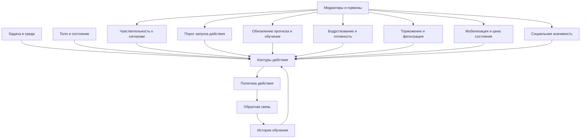

# Глава 14. Нейромедиаторы и гормоны

## После контуров

В прошлой главе мы ввели карту контуров действия.

Мы говорили не так:

```text
PFC отвечает за волю.
Миндалина отвечает за страх.
Стриатум отвечает за привычки.
```

а так:

```text
PFC участвует в удержании цели, правила и рабочей модели задачи.
ACC/aMCC участвует в оценке конфликта, усилия и цены контроля.
Стриатум и базальные ганглии участвуют в выборе, запуске и закреплении действий.
Сеть угрозы участвует в защитной готовности.
Островок связывает интероцепцию, значимость и телесную цену.
Гиппокамп связывает ситуацию с памятью, контекстом и будущими сценариями.
```

Теперь можно говорить о нейромедиаторах и гормонах.

Но здесь есть тот же риск. Очень легко заменить одну плохую таблицу другой.

Было:

```text
мозговая область -> поведение
```

стало:

```text
вещество -> состояние
```

И получаются знакомые формулы:

```text
дофамин = мотивация
норадреналин = внимание
серотонин = настроение
ГАМК = спокойствие
кортизол = стресс
окситоцин = любовь
эндорфины = счастье
```

Эти формулы удобны. Они быстро запоминаются. Они хорошо выглядят в коротких постах и презентациях. Но для учебника они слишком грубые.

Нейромедиатор не является человеческим состоянием.

Гормон не является поступком.

Рецептор не является чертой характера.

Биохимия важна не потому, что она дает короткие ярлыки, а потому, что она меняет режим работы контуров. Она может влиять на чувствительность к сигналам, пороги запуска, обучение по обратной связи, готовность платить усилием, бодрствование, торможение, мобилизацию тела, социальную значимость и восстановление.

Поэтому вопрос здесь не такой:

```text
какое вещество за что отвечает?
```

а:

```text
какой режим системы меняется?
какие контуры становятся более или менее доступными?
какое поведение становится вероятнее?
где разумнее вмешиваться практически?
```

Это менее эффектно, зато намного полезнее.

## Четыре слова, которые нельзя путать

Перед разбором отдельных систем нужно развести четыре понятия: нейромедиатор, нейромодулятор, гормон и рецептор.

Нейромедиатор - это вещество, которое участвует в передаче сигнала между нервными клетками. Один нейрон выделяет сигнал, другой его принимает. На таком уровне работают, например, глутамат и ГАМК, но и дофамин, норадреналин, серотонин, ацетилхолин тоже могут выступать как медиаторы.

Нейромодулятор - это не просто "передал сигнал и ушел". Это система, которая меняет режим обработки в сети: усиливает или ослабляет чувствительность, меняет соотношение шума и сигнала, влияет на обучение, готовность к действию, устойчивость, переключение между режимами. Дофамин, норадреналин, серотонин и ацетилхолин особенно часто обсуждаются именно в таком ключе.

Гормон - это сигнальная молекула эндокринной системы. Гормоны действуют через тело, кровь, органы, оси регуляции. Кортизол, тестостерон, прогестерон и окситоцин часто обсуждают как гормоны, хотя некоторые вещества могут иметь и нейронные, и периферические роли.

Рецептор - это молекулярная "точка чтения" сигнала. Один и тот же медиатор через разные рецепторы и в разных областях может давать разные эффекты. Поэтому нельзя просто сказать: "много дофамина хорошо" или "мало серотонина плохо". Нужно спрашивать: где, через какие рецепторы, в каком состоянии, для какой задачи, на каком фоне?

Вот минимальная таблица:

| Понятие | Что это | Ошибка, которую оно предотвращает |
| --- | --- | --- |
| Нейромедиатор | Участвует в передаче сигнала между нейронами. | Не равен чувству или черте личности. |
| Нейромодулятор | Меняет режим работы сети. | Нельзя читать как простую кнопку поведения. |
| Гормон | Сигнал эндокринной системы, связывающий мозг и тело. | Нельзя объяснять поступок одним уровнем гормона. |
| Рецептор | Механизм приема сигнала. | Один медиатор может иметь разные эффекты. |

Для когнитивного инженерства это различение нужно не из академической аккуратности. Оно защищает от ложных практических выводов.

Если сказать "мне не хватает дофамина", легко начать искать способ "поднять дофамин". Если сказать точнее, вопрос меняется:

```text
в этой задаче слабая обратная связь?
слишком высокая цена первого шага?
нет прогноза продвижения?
легкие награды лежат ближе важной работы?
```

Это уже не химический ярлык, а инженерная диагностика.

## Медиаторы как настройка режима контуров

Вернемся к карте действия.

Вопрос схемы:

```text
как говорить о медиаторах и гормонах,
не превращая их в таблицу "вещество -> чувство"?
```



Схему нужно читать так:

- задача и среда задают входные условия;
- тело и история обучения меняют доступность действий;
- контуры действия выбирают политику: приблизиться, избегать, искать, отложить, восстановиться, попросить помощи;
- медиаторы и гормоны не выбирают действие вместо системы, но меняют ее режим;
- обратная связь меняет будущие ожидания.

Граница схемы: она показывает не прямое управление поведением, а изменение режима обработки. В реальности эффект зависит от области, рецепторов, времени, исходного состояния, задачи и истории обучения.

Например, норадреналиновая система может сделать сигналы более "громкими" и подготовить систему к быстрому реагированию. Это может помочь при простой срочной задаче. Но при сложной аналитической работе слишком высокий уровень готовности может ухудшить гибкое мышление: внимание начинает цепляться за угрозы, ошибки и отвлекающие сигналы.

Дофаминовая система может поддерживать обучение по ошибке прогноза и готовность тратить усилие на значимый результат. Но это не означает, что всякая мотивация является "дофамином". Если задача важна, но неуправляема, туманна, социально опасна и слишком дорогая по усилию, один разговор о дофамине ничего не объяснит.

Кортизол и стрессовые медиаторы могут поддерживать мобилизацию. Но если мобилизация длится долго, цена состояния растет, PFC может становиться уязвимее, а сложное управление действием - менее доступным.

Главная мысль:

```text
нейрохимия меняет вероятности и режимы,
но не отменяет задачу, среду, историю, тело и контуры
```

## Почему "больше" не значит "лучше"

В популярном языке часто звучит скрытая модель:

```text
мало вещества - плохо
много вещества - хорошо
```

Для мозга эта модель часто приводит к ошибке.

У многих нейромодуляторных систем есть рабочий диапазон. Недостаточная активация может давать вялость, слабое удержание сигнала или низкую готовность к действию. Чрезмерная активация может давать шум, тревожную мобилизацию, импульсивность, туннель внимания или перегруз.

Для когнитивного контроля это часто описывают как перевернутую U-кривую:

```text
слишком мало -> слабый режим
оптимальный диапазон -> хорошая работа
слишком много -> распад точности
```

Такой принцип особенно важен для дофамина и норадреналина в префронтальной коре. PFC нужна точная настройка. Сложная работа требует не максимального возбуждения, а режима, в котором цель удерживается, лишний шум фильтруется, а ошибки замечаются без паники.

Есть еще одно различение: тонический и фазический режимы.

Фазический режим - короткие, событийные изменения, связанные с конкретным сигналом, неожиданностью, наградой, угрозой, ошибкой или важным стимулом.

Тонический режим - более общий фон активности системы, который задает режим готовности, напряжения, поиска или бодрствования.

Это различение помогает понять, почему одно и то же слово может значить разные вещи. Например, "высокая готовность" может быть кратким полезным всплеском перед действием, а может быть долгим напряженным фоном, где человек не работает глубже, а постоянно сканирует угрозы.

Поэтому инженерный вывод:

```text
не ищите максимум,
ищите подходящий режим для текущей задачи
```

Сложный текст, архитектурное решение, обучение и трудный разговор требуют разных режимов. Система, идеально настроенная для реакции на аварию, может быть плохо настроена для спокойного чтения, долгого письма или тонкой социальной обратной связи.

## Дофамин: не удовольствие, а обучение, значимость и готовность к усилию

Дофамин чаще всего страдает от популяризации.

Его называют "гормоном удовольствия", "гормоном мотивации", "гормоном награды", "топливом воли". Во всех этих формулировках есть фрагменты правды, но как учебная модель они недостаточны.

Начнем с классической идеи ошибки предсказания награды.

Если система ожидала одно, а получила лучше ожидаемого, прогноз нужно обновить. Если ожидала награду, а награды нет, прогноз тоже нужно обновить. Дофаминовые сигналы важны для такого обучения: они помогают системе менять ожидания и будущий выбор.

Но это не значит, что дофамин просто "выделяется от удовольствия".

Удовольствие, желание, обучение и усилие - разные процессы.

В литературе часто различают:

| Процесс | Смысл |
| --- | --- |
| Удовольствие | Переживание удовольствия или приятности. |
| Мотивационное хотение / стимульная значимость | Притягательность стимула, "тянет туда". |
| Обучение | Обновление ожиданий по опыту. |
| Распределение усилия | Готовность платить усилием ради результата. |
| Выбор действия | Сдвиг вероятности запуска одного действия среди других. |

Дофамин особенно важен для мотивационного хотения, обучения, распределения усилия и выбора действия. Но удовольствие как переживание приятности не сводится к дофамину; здесь важны и опиоидные системы, и другие контуры.

Это различение объясняет распространенный опыт:

```text
меня тянет открыть легкое приложение,
но настоящего удовольствия там уже почти нет
```

Система может хотеть стимул, который уже не дает глубокого удовлетворения. Мотивационное хотение и удовольствие разошлись. Поэтому "легкий дофамин" - удобная, но грубая метафора. Точнее говорить так:

```text
есть легкие стимулы с низкой ценой входа,
быстрой обратной связью,
частым обновлением ожиданий
и сильной конкуренцией за запуск действия
```

Для учебника важно еще одно: дофамин связан с решениями на основе цены усилия. Иногда проблема не в том, что человеку не важен результат. Результат может быть важен, но ожидаемая цена движения к нему слишком высока. Тогда более дешевое действие выигрывает.

Инженерный вопрос к дофаминовому уровню не такой:

```text
как поднять дофамин?
```

а такой:

```text
есть ли понятный прогноз продвижения?
есть ли обратная связь?
переносима ли цена первого шага?
не лежит ли рядом слишком дешевое конкурирующее действие?
есть ли опыт, что усилие действительно меняет результат?
```

Так мы возвращаемся к уже введенным главам:

- контекст задачи может снижать цену удержания;
- рабочий журнал может возвращать прогноз;
- ритуал входа может снижать порог запуска;
- управляемость часто делает усилие осмысленнее;
- малая обратная связь помогает системе учиться.

То есть практическое вмешательство обычно не "в дофамин", а в структуру задачи и обратной связи.

## Норадреналин: готовность, усиление сигнала и цена мобилизации

Норадреналин часто описывают как медиатор бодрости, внимания и реакции "бей или беги". Это хороший первый вход, но он быстро становится слишком узким.

Важная часть норадреналиновой системы связана с голубым пятном. Эта система широко проецируется в мозг и может менять общий режим обработки.

Один из полезных языков - адаптивное усиление.

Усиление можно понимать как повышение различимости сигналов. Когда оно настроено удачно, важный сигнал легче выделяется из фона. Система готова действовать, внимание собрано, реакция быстрее.

Но слишком высокий уровень готовности может сделать систему не точной, а тревожно-реактивной. Сигналы становятся громкими, но не обязательно полезными. Человек замечает больше угроз, отвлечений, ошибок, сообщений, чужих интонаций. Это может помочь в аварии, но плохо подходит для спокойной сложной работы.

Норадреналин также удобно связывать с неожиданной неопределенностью. Если мир перестал соответствовать ожиданиям, система должна перестроиться. Это может быть полезным сигналом:

```text
старый план больше не работает,
нужно обновить модель
```

Но если неопределенность постоянная и неконтролируемая, система может застрять в режиме сканирования. Тогда внимание вроде бы активно, но глубокая работа не идет.

Инженерный перевод:

| Состояние | Возможный режим | Что проверить |
| --- | --- | --- |
| Собранная бодрость | Полезный фазический режим готовности. | Есть ли ясный первый шаг и ограниченный горизонт? |
| Тревожная настороженность | Слишком высокий уровень активации и сканирование угроз. | Не слишком ли много неопределенности и социальных рисков? |
| Рассеянный поиск | Система не удерживает использование найденного решения и переключается в поиск. | Есть ли критерий, когда поиск должен остановиться? |
| Усталое безразличие | Низкая готовность реагировать на задачу. | Это недосып, перегруз, скука, отсутствие обратной связи или низкая ценность? |

Практический вывод:

```text
для сложной работы нужна не максимальная бодрость,
а переносимая готовность с ограниченной неопределенностью
```

Иногда помочь может не "взбодриться", а сузить задачу, снять лишние каналы, определить первый проверяемый шаг и убрать постоянные микросигналы угрозы.

## Серотонин: настроение - слишком короткое слово

Серотонин часто превращают в "вещество хорошего настроения". Это один из самых живучих нейромифов.

Серотониновая система действительно связана с аффективной регуляцией, импульсивностью, обработкой неприятных и потенциально наказующих сигналов, задержкой, торможением, социальным поведением и клиническими темами. Но именно поэтому ее нельзя свести к одной бытовой формуле.

Для когнитивного инженерства особенно полезны три идеи.

Первая: серотонин связан с торможением поведения в контексте наказания и неприятных последствий. Когда действие может привести к потере, ошибке, стыду, конфликту или социальной цене, система может не просто "не хотеть", а тормозить вход.

Вторая: серотонин часто обсуждают в связи с задержкой, терпением и временной динамикой. Иногда нужно выдержать отсутствие быстрой награды, не сорваться в немедленное действие, пережить паузу между усилием и результатом.

Третья: социально-аффективная регуляция не сводится к настроению. Человек может избегать не потому, что "плохое настроение", а потому, что система предсказывает наказание, отвержение, потерю статуса или долгий неприятный период без подтверждения.

Практический перевод:

```text
если задача тормозится,
не называйте это сразу "нет мотивации"
спросите, какое наказание или неприятное последствие система ожидает
```

Примеры:

- "Если я открою документ, станет видно, что я отстал".
- "Если я напишу, мне могут отказать".
- "Если я начну, придется долго терпеть отсутствие результата".
- "Если я покажу черновик, меня оценят".

Серотониновый уровень здесь не дает готового решения. Он помогает не путать торможение с пустотой. Иногда действие не запускается не потому, что нет желания, а потому, что система слишком сильно учитывает наказание, задержку или социальную цену.

Инженерный вопрос:

```text
что именно система пытается предотвратить?
```

После этого можно проектировать вмешательство:

- снизить ставку первой попытки;
- сделать черновик приватным;
- разделить работу и оценку;
- сократить период без обратной связи;
- добавить безопасную промежуточную проверку.

## Ацетилхолин: внимание как точность обработки

Ацетилхолин часто связывают с вниманием, обучением и памятью. Это верно как направление, но опять требует уточнения.

В учебной модели ацетилхолин полезно читать как один из регуляторов режима обработки сигнала.

Он связан с обнаружением значимых сигналов, кодированием, вниманием к релевантным признакам и ожидаемой неопределенностью. Когда система знает, что сигналы могут быть неполными или шумными, ей нужно лучше настраивать обработку входа.

Например, вы читаете сложный лог. Там много строк, но важными являются только некоторые паттерны. Или разбираете код: значимыми могут быть имена, типы, порядок вызовов, условия гонки, старая договоренность в архитектуре. В такой задаче мало просто "быть бодрым". Нужно точнее выделять сигнал.

Отсюда различие:

```text
норадреналин помогает режиму готовности и реакции на неожиданность
ацетилхолин помогает режиму точного считывания и кодирования релевантного сигнала
```

Это не железное разделение, а учебная опора.

Инженерный вопрос:

```text
какой сигнал в этой задаче должен быть выделен?
```

Если сигнал не выделен, человек может сидеть над задачей долго, но не продвигаться. Он как будто "работает", но не знает, что именно считать признаком успеха, ошибки или следующего шага.

Практические вмешательства здесь снова лежат не в биохакинге:

- выписать, какие признаки важны;
- отделить факты от гипотез;
- уменьшить визуальный и информационный шум;
- читать с вопросом;
- фиксировать найденные сигналы в рабочем журнале;
- не держать весь контекст в голове.

## Глутамат и ГАМК: не газ и тормоз, а архитектура сигнала

Глутамат часто называют главным возбуждающим медиатором мозга. ГАМК - главным тормозным.

Метафора "газ и тормоз" полезна для первого входа. Но если остановиться на ней, можно ошибиться.

Возбуждение - это не "хорошо", а торможение - не "плохо". И наоборот.

Для устойчивого мышления нужны оба процесса. Сигнал должен передаваться, но лишний шум должен ограничиваться. Активность должна распространяться, но не распадаться в хаос. Нужны согласование во времени, фильтрация, локальная настройка, подавление лишних конкурентов, удержание полезного паттерна.

ГАМК-ергическое торможение не просто "успокаивает". Оно формирует активность: помогает отделять сигнал от шума, задавать временные окна, ограничивать саморазгоняющееся возбуждение, делать работу сети устойчивее.

Глутаматная передача не просто "ускоряет". Она лежит в основе возбуждающей коммуникации и пластичности, но при патологических режимах чрезмерное возбуждение может быть вредным. Для учебника достаточно понимать: это базовая архитектура передачи и изменения сигналов, а не бытовой регулятор настроения.

Инженерный перевод:

```text
устойчивое внимание - не максимальное возбуждение,
а правильное соотношение сигнала, шума, торможения и цели
```

Если человек пытается работать на перегрузе, у него может быть много "энергии", но мало точности. Если вокруг слишком много сигналов, важная задача проигрывает. Если нет внешнего фильтра, система сама платит цену фильтрации.

Поэтому практический уровень снова прост:

- убрать лишние сигналы;
- снизить плотность входа;
- вынести контекст наружу;
- работать коротким проверяемым блоком;
- ограничить конкурирующие каналы;
- не требовать от нервной системы одновременно читать, помнить, выбирать, отвечать, терпеть тревогу и не ошибаться.

## Кортизол и HPA-ось: мобилизация с ценой

Кортизол часто называют "гормоном стресса". Эта фраза не совсем ложная, но слишком короткая.

Кортизол связан с HPA-осью: гипоталамус, гипофиз, надпочечники. Эта система участвует в мобилизации организма. В краткосрочной перспективе мобилизация может быть полезной. Если нужно реагировать на угрозу, выдержать нагрузку, поднять доступность энергии, перестроить режим тела, стрессовые медиаторы нужны.

Проблема начинается, когда мобилизация становится хронической, неконтролируемой или несоразмерной задаче.

В главе 11 мы говорили об аллостатическом бюджете. Организм не просто возвращается к одной "норме". Он предвосхищает потребности и перестраивается под ожидаемую нагрузку. У такой адаптации есть цена. Если система долго живет в режиме "надо справиться, но непонятно как", цена накапливается.

Для PFC это особенно важно. Сложная работа требует удержания цели, рабочей модели, торможения импульсов, гибкости, оценки вариантов. Под неконтролируемым стрессом эти функции могут становиться менее доступными. Система может уходить в более быстрые, привычные или защитные режимы.

Инженерный вопрос:

```text
это краткая мобилизация под понятную задачу
или длительная мобилизация без управляемого выхода?
```

Примеры:

| Ситуация | Вероятный смысл |
| --- | --- |
| Срочная понятная задача на коротком горизонте | Мобилизация может помочь. |
| Долгая неопределенность без критерия завершения | Мобилизация начинает дорого стоить. |
| Постоянные прерывания и ожидание оценки | Система может держать тревожную готовность. |
| Высокая ответственность без рычага влияния | Растет риск беспомощности и истощения. |
| Нагрузки много, восстановления мало | Аллостатическая цена накапливается. |

Практический вывод:

```text
снижать стресс - не всегда значит "расслабиться"
иногда значит вернуть управляемость, критерий завершения и безопасный первый шаг
```

Стресс, аллостаз и окно полезной нагрузки требуют отдельного разбора. Здесь достаточно подготовить мост: кортизол не объясняет весь стресс, но стрессовые медиаторы помогают понять, почему режим нагрузки меняет доступность сложного действия.

## Окситоцин, опиоидные системы и социальные гормональные контексты

Окситоцин часто называют "гормоном любви". Это тоже слишком короткая формула.

Более осторожная модель - социальная значимость. Окситоцин может усиливать значимость социальных сигналов. Но социальный сигнал не всегда приятен. Это может быть близость, поддержка, доверие, но также оценка, угроза, чужая группа, стыд, ревность, исключение, конкуренция.

Поэтому нельзя сказать:

```text
больше окситоцина -> больше доброты
```

Нужно спрашивать:

```text
какой социальный сигнал в этом контексте стал более значимым?
```

Для когнитивного инженерства это особенно важно в лидерстве, обучении и командной работе. Задача может быть технической, но ее мотивационная цена часто социальна:

- кто увидит ошибку;
- кто оценит результат;
- можно ли показать черновик;
- есть ли безопасная обратная связь;
- есть ли право на вопрос;
- означает ли трудность рост или угрозу статусу.

Опиоидные системы важны для удовольствия, облегчения, телесного и социального "тепла", переживания приятности. Это помогает удержать различение с дофамином: нас может тянуть к стимулу без глубокого удовольствия, и мы можем получать удовольствие от чего-то, что не обязательно усиливает долгосрочное действие.

Пример:

```text
короткое легкое действие дает облегчение,
но не строит движение к важной задаче
```

Такой уход может быть подкреплен не только "дофаминовой наградой", но и облегчением, снижением напряжения, приятным контактом, чувством завершенности. Поэтому избегание часто закрепляется: оно не дает ценного результата, зато дает немедленное облегчение.

Тестостерон, прогестерон и другие гормональные системы нужно обсуждать особенно осторожно. В исследованиях мотивации есть данные о гормональных реакциях в контекстах власти, статуса, соревнования, принадлежности, близости и отвержения. Но это не дает права строить биологическую типологию людей:

```text
этот человек такой, потому что у него такой гормон
```

Правильнее:

```text
социальный контекст, мотив и телесная регуляция могут быть связаны,
но поведение не выводится из одного гормона
```

## Сквозной пример: важная задача вечером

Разберем один эпизод.

Человек вечером открывает важную туманную задачу. Она ценная. Ее надо сделать. Но вход не запускается.

Он ощущает напряжение. Контекст распался. В голове крутится: "надо бы". Рядом уведомления. Можно быстро ответить на пару сообщений, поправить план, почитать что-то полезное, подготовиться еще немного. Задача остается не открытой.

Плохое объяснение:

```text
нет дофамина
много кортизола
слабая воля
```

Разберем точнее.

### Дофаминовый уровень

Возможно, у задачи слабый прогноз продвижения. Непонятно, какой шаг даст результат. Обратная связь далеко. Цена усилия высокая. Рядом есть действия с быстрым микроподкреплением: уведомления, планировщик, легкие письма, чтение.

Инженерный ход:

```text
сделать первый шаг меньше,
сделать обратную связь ближе,
убрать дешевые конкуренты на время входа
```

### Норадреналиновый уровень

Система может быть бодрой, но не сфокусированной. Если задача несет неопределенность и риск ошибки, готовность превращается в сканирование угроз. Человек замечает все вокруг, но не входит глубоко.

Инженерный ход:

```text
ограничить горизонт,
закрыть лишние каналы,
выписать один проверяемый вопрос
```

### Серотониновый уровень

Задача может тормозиться не пустотой, а ожидаемым наказанием: увидеть реальное отставание, получить критику, обнаружить ошибку, потерять лицо перед собой или другим человеком.

Инженерный ход:

```text
разделить черновик и оценку,
сделать первую попытку приватной,
снизить социальную ставку
```

### Ацетилхолиновый уровень

Сигнал задачи может быть не выделен. Что именно искать? Какие признаки важны? Какие факты отделены от гипотез? Если все одинаково шумно, внимание не знает, за что зацепиться.

Инженерный ход:

```text
записать признаки,
выделить неизвестные места,
читать задачу с одним вопросом
```

### ГАМК/глутаматный уровень

Система может быть перегружена сигналами. Много возбуждения не равно много точного мышления. Нужна фильтрация, ограничение лишних импульсов, устойчивое окно работы.

Инженерный ход:

```text
убрать лишние стимулы,
сократить рабочий блок,
уменьшить плотность входа
```

### Кортизол и HPA-ось

Если день был длинным, с постоянными прерываниями и ответственностью без завершения, задача вечером приходит не в пустую систему. Она приходит в систему с накопленной ценой мобилизации.

Инженерный ход:

```text
не требовать полного героического входа,
сделать контрольную точку,
сохранить контекст,
перенести глубокую часть на восстановленный слот
```

### Социальные системы

Если задача связана с оценкой, статусом, принадлежностью или конфликтом, она не просто "техническая". Социальная значимость повышает цену входа.

Инженерный ход:

```text
создать безопасный формат черновика,
попросить раннюю обратную связь,
отделить исследование от демонстрации результата
```

Теперь видно главное: биохимия не заменила анализ задачи. Она помогла точнее увидеть режимы, в которых задача становится дорогой, шумной, угрожающей или слабо подкрепленной.

## Практический перевод

Эта таблица - не диагностический инструмент. Это переводчик из популярных формул в рабочие вопросы.

| Если хочется сказать | Точнее спросить | Возможный инженерный ход |
| --- | --- | --- |
| "Мне не хватает дофамина" | Где слабый прогноз, обратная связь, управляемость или слишком высокая цена усилия? | Уменьшить первый шаг, приблизить обратную связь, убрать быстрые конкуренты. |
| "Мне нужен норадреналин" | Нужна бодрость или точная готовность без тревожного сканирования? | Ограничить горизонт, убрать лишние каналы, задать один вопрос. |
| "У меня мало серотонина" | Что система тормозит и какого наказания ожидает? | Снизить ставку попытки, разделить черновик и оценку. |
| "Нужно успокоить ГАМК" | Где избыток шума, возбуждения или конкурирующих сигналов? | Снизить плотность входа, ограничить стимулы, сократить блок. |
| "Кортизол мешает" | Это краткая мобилизация или хроническая цена неконтролируемой нагрузки? | Вернуть управляемость, критерий завершения, восстановление. |
| "Нужен окситоцин" | Какой социальный сигнал слишком значим: поддержка, оценка, близость, угроза? | Создать безопасную обратную связь и право на черновик. |
| "Хочу эндорфинов" | Нужна радость, облегчение, восстановление или уход от неприятного? | Отличить восстановление от избегания, дать телу реальное восстановление. |

Главное правило:

```text
не переводите каждое состояние в вещество
переводите состояние в режим системы и уровень вмешательства
```

## Где вмешиваться

Если нейрохимический уровень реален, возникает соблазн: значит, надо вмешиваться именно в него.

Но это не следует автоматически.

Уровень реализации не равен лучшему уровню вмешательства.

Если у человека поднимается тревожная мобилизация перед публичной оценкой, можно бесконечно говорить о кортизоле, норадреналине и PFC. Но практический ход может быть проще:

- разделить черновик и публичный результат;
- дать критерии хорошей первой версии;
- договориться о безопасной обратной связи;
- уменьшить неопределенность;
- убрать лишние прерывания;
- восстановить сон;
- сократить число параллельных незавершенных задач.

Это не "менее научно". Это правильный выбор уровня вмешательства.

Нейрохимия объясняет, почему такие изменения могут работать. Но не всегда сама является местом прямой работы.

## Границы главы

Это не медицинские рекомендации.

Она не говорит:

- какие препараты принимать;
- какие добавки использовать;
- какие анализы сдавать;
- как интерпретировать уровень гормона;
- как "поднять" или "снизить" конкретный медиатор;
- как диагностировать депрессию, тревожное расстройство, СДВГ, эндокринные нарушения или хроническую усталость.

Если состояние длительное, тяжелое, нарушает жизнь, связано с резкими изменениями сна, аппетита, настроения, тревоги, энергии, боли или работоспособности, это уже не задача учебника. Это зона медицины, клинической диагностики и профессиональной помощи.

Задача учебника другая: дать язык, который помогает не делать грубых выводов и проектировать условия работы точнее.

## Переход к следующей главе

Теперь у нас есть три слоя части IV:

```text
глава 12: уровни объяснения
глава 13: контуры действия
глава 14: медиаторы и гормоны как регуляторы режима
```

Следующий шаг - стресс, аллостаз и окно полезной нагрузки.

Теперь мы не будем говорить:

```text
стресс = кортизол
```

Мы будем говорить:

```text
стресс - это режим мобилизации и адаптации,
который может помогать,
но имеет цену,
зависит от управляемости,
длительности,
восстановления,
сложности задачи
и социального контекста
```

Это важный переход. Потому что продуктивность ломается не от самого факта напряжения, а от несоответствия между нагрузкой, управляемостью, восстановлением и режимом системы.

## Источниковая опора

Проверенный пакет для этой главы: [[../Источники/2026-05-24 Пакет источников для главы 14]].

Ключевые источники в авторско-годовой форме:

- Cools & Arnsten (2022), Robbins & Arnsten (2009), Doya (2002): нейромодуляция PFC, моноамины, ацетилхолин, обучение, неопределенность и нелинейные эффекты.
- Schultz, Dayan & Montague (1997), Salamone & Correa (2024), Frank (2025), Cools & D'Esposito (2011), Lee et al. (2024), Mohebi et al. (2024), Greenstreet et al. (2025), Tsutsui-Kimura et al. (2025), Berridge & Kringelbach (2015): дофамин как часть ошибки предсказания, распределения усилия, адаптивного контроля выгоды/цены, эффектов перевернутой U, неоднородных сигналов, временных горизонтов награды, ошибок предсказания действия, избегания в конфликте угрозы и награды и различения мотивационного хотения и удовольствия, а не "вещество мотивации".
- Aston-Jones & Cohen (2005), Yu & Dayan (2005): LC-NE, адаптивное усиление, неопределенность, активация и внимание.
- Dayan & Huys (2009), Crockett, Clark & Robbins (2009): серотонин, аффективный контроль, отвращение, торможение под влиянием наказания и поведенческое торможение.
- Hasselmo & Sarter (2011): ацетилхолин, обнаружение сигналов, кодирование и внимание как обработка сигнала.
- Meldrum (2000), Isaacson & Scanziani (2011): глутамат и ГАМК как архитектура возбуждения, торможения, тайминга, фильтрации и стабильности.
- Arnsten (2009), McEwen (1998): стрессовые медиаторы, уязвимость PFC, HPA-ось и аллостатическая цена.
- Shamay-Tsoory & Abu-Akel (2016), Schultheiss (2013), Stanton & Schultheiss (2009), Schultheiss, Wirth & Stanton (2004), Wirth & Schultheiss (2006): окситоцин как социальная значимость и гормональные корреляты неявных мотивов без биологической типологии людей.
- Greenstreet et al. (2025), Tsutsui-Kimura et al. (2025), Mohebi et al. (2024): свежая эмпирическая и контурная опора для неоднородности дофамина в стриатуме, ошибок предсказания действия, избегания в конфликте угрозы и награды и временных горизонтов награды; использовать как мост к более точной модели действия, а не как прямую практическую рекомендацию для человека.

Доказательная роль блока: `strong` для базового анти-нейромифного вывода: медиатор или гормон не равен психологическому состоянию; `context-dependent` для описания эффектов конкретных систем, потому что они зависят от области, рецепторов, дозы, задачи, исходного состояния и времени; `fast-moving` для свежих работ 2024-2025 о гетерогенности дофаминовых сигналов, стриатальных градиентах, ошибках предсказания действия и избегании в конфликте угрозы и награды; `clinical-boundary` для любых выводов о препаратах, анализах, эндокринологии, психических расстройствах, БАДах и попытках "поднять" или "снизить" вещество. Глава не дает фармакологических, медицинских или нутрицевтических рекомендаций.

Полные библиографические записи и DOI сохранены в пакете главы. В текущей редакции глава оставляет короткий авторско-годовой блок как читательский ориентир.

## Короткое резюме

1. Нейромедиаторы и гормоны не являются готовыми психологическими состояниями.
2. Их лучше читать как регуляторы режима контуров.
3. Один медиатор может иметь разные эффекты в разных областях, рецепторах, дозах и задачах.
4. Дофамин не равен удовольствию или мотивации; он важен для обучения, значимости, усилия и выбора действия.
5. Норадреналин не равен вниманию; он меняет готовность, усиление сигнала и реакцию на неопределенность.
6. Серотонин не равен настроению; он участвует в аффективном контроле, торможении, наказании и задержке.
7. Ацетилхолин важен для режима обработки сигнала, внимания и кодирования.
8. Глутамат и ГАМК задают архитектуру возбуждения, торможения, фильтрации и устойчивости.
9. Кортизол и HPA-ось связаны с мобилизацией и аллостатической ценой.
10. Окситоцин, опиоидные системы и половые гормоны работают контекстно и не дают простых ярлыков личности.
11. Лучший уровень вмешательства часто лежит не в "биохимии", а в задаче, среде, обратной связи, восстановлении, управляемости и социальной безопасности.

## Вопросы для самопроверки

1. Почему формула "дофамин = мотивация" вредна для когнитивного инженерства?
2. Чем нейромодулятор отличается от нейромедиатора в учебной модели этой главы?
3. Почему "больше" не обязательно значит "лучше" для дофамина и норадреналина?
4. Как можно объяснить вечерний уход в уведомления без фразы "нет дофамина"?
5. Чем отличается удовольствие от мотивационного хотения?
6. Почему норадреналиновая готовность может мешать сложной работе?
7. Почему "серотонин = настроение" слишком короткая модель?
8. Как ацетилхолин связан с выделением релевантного сигнала?
9. Почему ГАМК нельзя свести к "спокойствию"?
10. Чем краткая мобилизация отличается от хронической аллостатической цены?
11. Почему окситоцин лучше понимать через социальную значимость, а не через "любовь"?
12. Почему лучший уровень вмешательства часто не совпадает с уровнем биохимической реализации?

## Мини-практика

Возьмите задачу, к которой трудно войти, и заполните таблицу.

| Уровень | Вопрос | Ответ |
| --- | --- | --- |
| Дофамин / обучение / усилие | Есть ли ясный прогноз продвижения и близкая обратная связь? |  |
| Норадреналин / уровень активации | Я в фокусе или тревожно сканирую угрозы и альтернативы? |  |
| Серотонин / торможение | Какого наказания, задержки или социальной цены я избегаю? |  |
| Ацетилхолин / сигнал | Какой признак задачи сейчас нужно выделить из шума? |  |
| ГАМК/глутамат / фильтрация | Какие лишние сигналы перегружают систему? |  |
| Кортизол / мобилизация | Это краткое напряжение или накопленная цена дня? |  |
| Социальные системы | Кто или что делает задачу социально значимой? |  |
| Уровень вмешательства | Что проще изменить: задачу, среду, первый шаг, обратную связь, восстановление, социальную рамку? |  |

Цель мини-практики - не поставить себе химический диагноз. Цель - перевести туманное "не могу" в более точные вопросы к режиму системы.

## Статус

`ready-for-review`

Источниковый пакет: [[../Источники/2026-05-24 Пакет источников для главы 14]].

Связка с предыдущей главой проверена: [[../Проверки/2026-05-24 Связка глав 13-14]].

Ревизия блока: [[../Проверки/2026-05-25 Ревизия блока 12-15]].

Следующая глава: [[15-Стресс-аллостаз-и-окно-полезной-нагрузки]].
