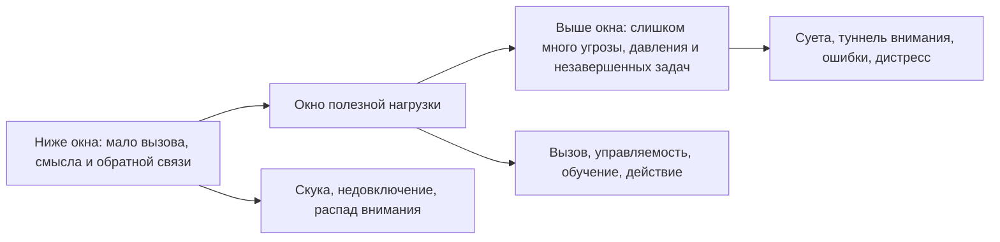
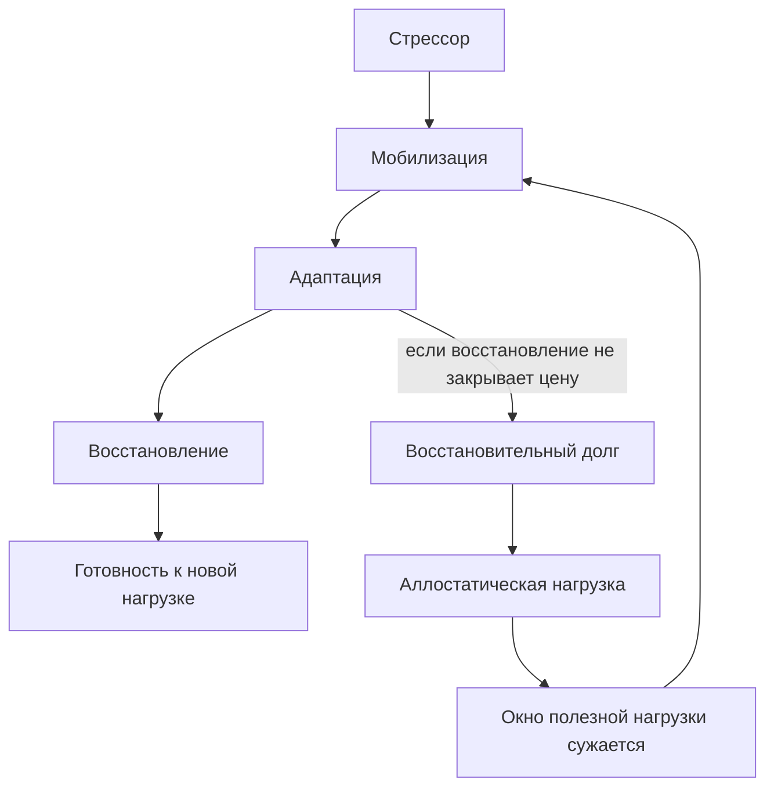

# Глава 15. Стресс, аллостаз и окно полезной нагрузки

## После нейромедиаторов и гормонов

В прошлой главе мы специально не свели поведение к веществам.

Мы не писали:

```text
дофамин = мотивация
норадреналин = внимание
серотонин = настроение
кортизол = стресс
```

Мы говорили точнее: медиаторы и гормоны меняют режим работы контуров. Они могут влиять на чувствительность к сигналам, обучение, пороги запуска, торможение, бодрствование, мобилизацию тела и социальную значимость.

Теперь можно говорить о стрессе.

Здесь есть тот же риск. Очень легко сказать:

```text
стресс - это кортизол
```

или:

```text
стресс всегда вреден
```

или наоборот:

```text
стресс полезен, если правильно себя настроить
```

Все три формулы слишком короткие.

Стресс не является одним гормоном. Он не является одним чувством. И он не является ни чистым врагом, ни чистым топливом. Для когнитивного инженерства стресс лучше понимать как режим мобилизации и адаптации: система встречает требование, меняет настройки тела, внимания и поведения, пытается ответить на вызов и потом должна восстановиться.

Краткая мобилизация может помочь. Она собирает внимание, повышает готовность, отсекает лишние варианты, ускоряет простое действие.

Но если мобилизация слишком сильная, слишком долгая, плохо управляемая или не закрывается восстановлением, она перестает помогать. Тогда стресс может стать не рабочим режимом, а дорогим фоном, который сужает мышление, повышает угрозу, ухудшает гибкость и копит долг восстановления.

Поэтому главный вопрос этой главы не такой:

```text
как убрать стресс?
```

и не такой:

```text
как использовать стресс на максимум?
```

А такой:

```text
какая нагрузка сейчас полезна для этой задачи,
где проходит рабочее окно,
и что происходит с системой после нагрузки?
```

## Три разных уровня: стрессор, реакция и переживание

Начнем с различения, без которого разговор о стрессе быстро путается.

Стрессор - это требование адаптации. Это может быть дедлайн, конфликт, экзамен, риск ошибки, неопределенная задача, шумная среда, болезнь, недосып, финансовая угроза или просто слишком большой объем одновременных обязательств.

Стрессовая реакция - это ответ системы на требование. Тело и мозг меняют режим: может повышаться готовность, внимание может сужаться на значимом, растет чувствительность к угрозам, меняется работа PFC, норадреналиновой системы, HPA-оси и других контуров.

Субъективное переживание - это то, как человек чувствует этот режим: тревога, собранность, давление, азарт, злость, усталость, оцепенение, срочность, раздражение или пустота.

Эти уровни связаны, но не совпадают.

Один и тот же дедлайн у одного человека может включить рабочую собранность, а у другого - паническую прокрастинацию. Одна и та же презентация для подготовленного специалиста может быть вызовом, а для новичка - угрозой. Один и тот же рабочий день после хорошего сна и после недели недосыпа будет совсем разной нагрузкой.

Поэтому нельзя оценивать стресс только по внешнему событию:

```text
дедлайн есть -> значит стресс высокий
```

и нельзя оценивать только по внутреннему ощущению:

```text
мне неприятно -> значит нагрузка вредна
```

Нужно смотреть на систему целиком:

| Уровень | Вопрос |
| --- | --- |
| Стрессор | Что требует адаптации? |
| Реакция | Как система мобилизуется? |
| Управляемость | Могу ли я влиять на ход ситуации? |
| Сложность задачи | Какой режим нужен для качественного действия? |
| Длительность | Сколько времени система держит мобилизацию? |
| Восстановление | Возвращается ли доступность действия после нагрузки? |

Такой разбор особенно важен для сложной интеллектуальной работы. Разработчик, инженерный лидер, исследователь, автор или студент часто страдают не от одного сильного стрессора, а от постоянного требования удерживать много контекстов, принимать решения, отвечать за последствия, возвращаться после прерываний и при этом сохранять качество мышления.

## Зачем стресс вообще нужен

Если убрать из слова "стресс" моральную окраску, останется полезная функция: мобилизация под адаптацию.

Система встречает вызов и делает несколько вещей.

Во-первых, выделяет важное. Когда появляется угроза или срочность, внимание часто перестает равномерно плавать по миру и начинает искать значимый сигнал.

Во-вторых, готовит тело к действию. Дыхание, сердечный ритм, мышечный тонус, бодрствование и гормональные оси перестраиваются под ответ.

В-третьих, ускоряет выбор в простых ситуациях. Когда нужно быстро отреагировать, слишком много размышления мешает. Мобилизация может помочь сделать шаг, позвонить, остановить ошибку, закрыть аварийный риск.

В-четвертых, может повышать значимость обратной связи. Под нагрузкой система иногда быстрее учится на том, что оказалось опасным, важным или неожиданным.

Это объясняет, почему короткое напряжение иногда помогает:

```text
задача стала важной -> внимание собралось -> первый шаг начался -> обратная связь появилась
```

Но та же логика объясняет, почему стресс легко становится вредным.

Мобилизация хороша для ответа на вызов. Она плоха как постоянный стиль жизни. Если система слишком долго живет в режиме "сейчас важно, сейчас угроза, сейчас нужно срочно", она перестает получать цену обратно. Действие еще совершается, но восстановление отстает. Человек вроде бы держится, но это держание уже оплачивается будущим.

## Окно полезной нагрузки

Для учебника нам нужна простая, но аккуратная модель. Назовем ее окном полезной нагрузки.

Вопрос схемы:

```text
когда нагрузка помогает действию,
а когда она уводит систему ниже или выше рабочего режима?
```



Схема намеренно грубая. Она не измеряет стресс в баллах и не задает универсальную норму для всех людей. Она помогает спросить, в какую сторону сейчас смещена система: не хватает включающего вызова, нагрузка держится в рабочем диапазоне или давление уже разрушает качество действия.

Ниже окна задача не включает систему. Вызов слишком слабый, смысл не чувствуется, обратная связь не важна, действия выглядят бессмысленными. Человек может выглядеть "немотивированным", но дело не обязательно в слабой воле. Иногда задача просто не дает достаточно содержательной нагрузки, ответственности, роста или вклада.

Внутри окна задача достаточно трудна, чтобы собрать внимание, но не настолько угрожает, чтобы разрушить мышление. Есть вызов, управляемость, обратная связь и возможность восстановиться после усилия.

Выше окна задача или ситуация перегружает систему. Слишком много требований, ставок, неопределенности, прерываний, социального риска, параллельной незавершенной работы или длительности. Внимание часто сужается, рабочая память хуже удерживает модель, гибкость падает, угрозы становятся громче, а действие всё чаще превращается в избегание, суету или принуждение.

Это окно не одинаково для всех людей и всех дней. Оно зависит от задачи, состояния, опыта, сна, безопасности, социальной рамки и истории предыдущих нагрузок.

Особенно важна сложность задачи.

Простая задача часто терпит более высокий уровень активации. Если нужно быстро разобрать коробки, ответить на короткие письма, закрыть рутинный чек-лист или сделать физически понятный шаг, дополнительный драйв может ускорять.

Сложная задача требует другого режима. Архитектурное решение, сложный текст, исследование, обучение, трудный разговор, проектирование системы или анализ причины инцидента требуют удержания контекста, гибкости, спокойной проверки гипотез и терпимости к неопределенности. Слишком сильная мобилизация здесь часто мешает: внимание начинает хвататься за угрозы, ошибка кажется опаснее, чем есть, а мысль теряет ширину.

Короткая формула:

```text
простая задача переносит больше нажима
сложная задача требует более спокойной собранности
```

## Закон Йеркса-Додсона как эвристика, а не точная шкала

Закон Йеркса-Додсона обычно пересказывают так: производительность растет с уровнем возбуждения до некоторого оптимума, а затем падает. Для сложных задач оптимум ниже, для простых - выше.

Это полезная идея, но ее нельзя превращать в точный прибор.

Во-первых, "возбуждение" не является одной простой величиной. В него входят бодрствование, тревожность, мышечная готовность, норадреналиновая настройка, субъективная срочность, социальная оценка, угроза, интерес и многое другое.

Во-вторых, "производительность" тоже разная. Скорость, точность, креативность, качество решения, глубина понимания, устойчивость после работы и долгосрочное обучение могут расходиться. Можно быстро сделать больше и хуже понять. Можно сдать дедлайн и накопить восстановительный долг.

В-третьих, форма окна зависит от контекста. Контролируемая нагрузка, поддержка, ясная обратная связь и опыт похожих задач расширяют окно. Неконтролируемость, неопределенность, публичная угроза, недосып и хроническая параллельная незавершенная работа его сужают.

Поэтому закон полезнее читать не как график "сколько возбуждения нужно", а как предупреждение:

```text
давление помогает не бесконечно
и для сложной работы максимум давления часто хуже умеренной собранности
```

Для когнитивного инженерства это сразу меняет практику. Перед тем как добавить дедлайн, соревнование, внешнее обещание или внутренний нажим, нужно спросить:

```text
эта задача простая или сложная?
ей не хватает включения или она уже перегружена угрозой?
новый стимул расширит действие или вытолкнет систему выше окна?
```

## Эустресс и дистресс

Слова "эустресс" и "дистресс" часто объясняют слишком просто:

```text
эустресс - хороший стресс
дистресс - плохой стресс
```

Так запомнить легко, но для работы этого мало.

Эустресс лучше определять не по приятности, а по эффекту. Это напряжение, которое помогает адаптации: человек собирается, делает шаг, учится, корректирует действие, после нагрузки получает опыт и может восстановиться.

Эустресс не обязан быть приятным. Важный экзамен, сложный разговор или первый доклад могут быть неприятными, но полезными, если нагрузка остается управляемой и после нее система не разваливается.

Дистресс начинается там, где тот же режим перестает помогать. Мобилизация остается, но адаптация не закрепляется. Тревога шумит, давление растет, восстановление дорожает, а действие становится хуже.

| Признак | Эустресс | Дистресс |
| --- | --- | --- |
| Роль напряжения | Помогает собраться и ответить на вызов. | Мешает действию и восстановлению. |
| Управляемость | Есть ощущение, что следующий шаг возможен. | Ситуация переживается как слишком большая или неконтролируемая. |
| Ошибка | Дает обратную связь. | Переживается как угроза или доказательство несостоятельности. |
| После нагрузки | Остается опыт, усталость восстанавливается. | Остается долг, тревожный фон и сужение окна. |
| Практический ход | Держать ритм, ясность и восстановление. | Снижать давление, угрозу, число параллельных незавершенных задач и неопределенность. |

Главная граница:

```text
эустресс помогает адаптации
дистресс начинает оплачивать действие восстановлением, которого уже не хватает
```

## Аллостаз: устойчивость через изменение

Чтобы понять хроническую цену стресса, нужен термин "аллостаз".

Гомеостаз обычно описывают как поддержание важных параметров в допустимых пределах. Температура, уровень глюкозы, давление и другие параметры не должны свободно уходить куда угодно.

Аллостаз добавляет важную мысль: устойчивость часто поддерживается не через неподвижность, а через изменение. Организм меняет режим под требования среды. Он может заранее мобилизоваться, перераспределить энергию, изменить внимание, сон, аппетит, иммунные и эндокринные процессы.

Это нормально. Живая система не обязана быть всегда спокойной. Она должна уметь перестраиваться.

Проблема начинается не в самом изменении режима, а в цене.

Если система часто мобилизуется, долго остается в повышенной готовности, не получает восстановления или вынуждена адаптироваться к неконтролируемым требованиям, возникает аллостатическая нагрузка. Это не буквальный бак энергии. Это способ говорить о накопленной цене повторной и хронической адаптации.

Здесь важен еще один слой: мозг не просто пассивно "считывает" тело. Он постоянно предсказывает, какое состояние тела потребуется для действия, угрозы, отдыха, контакта с людьми или решения задачи. Интероцепция в этом смысле - не только ощущение сердцебиения или напряжения, а часть системы, которая помогает мозгу оценивать телесную цену будущего шага.

Поэтому человек иногда чувствует задачу дорогой еще до ясного рассуждения о ней. В теле уже есть прогноз: сколько напряжения понадобится, насколько это управляемо, хватит ли восстановления, не повторится ли прошлый перегруз. Это не означает, что тело всегда "знает правду". Телесный сигнал может быть полезным предупреждением, следом хронической нагрузки, ошибочным прогнозом, реакцией на неопределенность или симптомом состояния, которое требует другого уровня помощи. В учебнике этот слой нужен не для самодиагностики, а для более честной модели цены действия.

Можно представить цикл:

Вопрос второй схемы:

```text
что происходит, если мобилизация повторяется чаще,
чем система успевает закрывать ее цену восстановлением?
```



Эту схему нужно читать как динамику, а не как диагноз. Один дорогой день не равен аллостатической нагрузке. Риск появляется, когда режим мобилизации становится нормой, а восстановление систематически не возвращает доступность действия.

Если после нагрузки есть восстановление, цикл может быть здоровым: система ответила, научилась, вернулась в доступный режим.

Если восстановление не закрывает цену, окно может сужаться. То, что раньше было посильным вызовом, теперь ощущается перегрузом. То, что раньше собирало, теперь раздражает. То, что раньше требовало часа, теперь требует полдня разгона. И тогда человек может неправильно объяснить себе происходящее:

```text
я стал слабее
мне не хватает дисциплины
надо сильнее давить
```

Иногда правильнее сказать:

```text
система слишком долго адаптировалась без достаточного восстановления
и теперь цена входа стала выше
```

## HRV: полезный сигнал, но не прибор воли

В разговоре о стрессе и восстановлении часто появляется HRV: вариабельность сердечного ритма.

В грубом виде идея такая: здоровая регуляция не держит сердце как метроном. Сердечный ритм меняется от вдоха к выдоху, от покоя к действию, от безопасности к угрозе, от восстановления к мобилизации. Эти колебания связаны с автономной нервной системой, вагусной регуляцией и более широким контуром "мозг - тело".

Поэтому HRV действительно может быть полезным сигналом. В модели нейровисцеральной интеграции его рассматривают как один из индикаторов связи между автономной регуляцией, эмоциональной регуляцией и PFC-зависимым контролем. В прикладном языке это звучит привлекательно:

```text
HRV показывает ресурсность
```

Но так писать нельзя.

HRV зависит от того, как именно его измеряли: длительность записи, положение тела, дыхание, время суток, артефакты, болезнь, физическая нагрузка, алкоголь, лекарства, индивидуальная база, тип метрики и качество устройства. Один показатель из носимого устройства не равен "сегодня можно/нельзя делать трудное".

Более аккуратная формула:

```text
HRV может быть одним из контекстных сигналов автономной регуляции,
но не является прямой мерой силы, воли, мотивации
или готовности к конкретной задаче
```

Для когнитивного инженерства это значит:

| Что HRV может дать | Чего HRV не должен делать |
| --- | --- |
| Подсказать, что состояние стоит проверить. | Единолично отменять или запускать трудную работу. |
| Показать долгосрочный тренд восстановления в похожих условиях. | Служить диагнозом выгорания, тревоги или "ресурсности". |
| Быть дополнительным сигналом рядом со сном, нагрузкой и поведением. | Заменять вопрос о параллельной незавершенной работе, угрозе, управляемости и восстановлении. |
| Помочь в личном наблюдении при низкой цене ошибки. | Подменять медицинскую или психотерапевтическую оценку. |

Если HRV низкий, правильный инженерный вопрос не:

```text
мне запрещено работать?
```

А:

```text
что еще говорит о состоянии:
сон, болезнь, нагрузка, внимание, ошибки,
эмоции, контекст задачи и цена следующего входа?
```

Иногда ответом будет снижение сложности и числа параллельных незавершенных задач. Иногда - короткая восстановительная пауза. Иногда - обычный вход в задачу, но через более мягкий первый шаг. Иногда - медицинская или организационная граница. Метрика помогает только тогда, когда остается частью более широкой картины.

## Почему под сильным стрессом хуже думается

Теперь вернемся к главам 13 и 14.

PFC нужна для удержания цели, рабочей модели, правил, контекста и гибкого выбора. Она особенно важна там, где нельзя просто реагировать: нужно подумать, сравнить гипотезы, удержать несколько условий, не сорваться в первый импульс, заметить ошибку без паники.

При сильном, неконтролируемом или длительном стрессе система смещается к другому режиму. Быстрые защитные реакции, угроза, привычные ответы и узкое внимание становятся доступнее. Это может быть полезно в опасной ситуации, где нужно действовать быстро. Но для сложной интеллектуальной работы такой режим часто вреден.

Что происходит на уровне поведения:

- рабочая память хуже держит контекст;
- внимание чаще цепляется за угрозы, ошибки и срочные сигналы;
- человек хуже различает важное и шумное;
- растет желание закрыть неприятное состояние быстрым действием;
- сложная задача начинает казаться не просто трудной, а опасной;
- после прерывания сложнее вернуться в исходную модель задачи.

Именно поэтому совет "просто поднажми" может ломать сложную работу.

Поднажать можно на рутину. Иногда можно поднажать на короткий последний метр. Но если задача требует PFC-зависимого мышления, анализа, обучения, письма или тонкого разговора, избыточный нажим может ухудшать сам инструмент, которым эту задачу нужно решать.

Пример.

Разработчик вечером открывает сложный архитектурный кусок. У него есть мотивация: задача важная. Есть знание: он примерно понимает область. Но день уже был полон встреч, сообщений, срочных решений и социальной оценки. Система находится выше окна.

Если добавить еще один внутренний приказ "соберись", может стать хуже. Внимание будет не глубже, а уже. Он начнет перескакивать между файлами, проверять мессенджеры, бояться ошибиться, начинать заново. Снаружи это похоже на прокрастинацию. Внутри это может быть стрессовый режим, в котором сложная модель задачи больше не удерживается.

Инженерный вопрос здесь:

```text
как вернуть задачу в рабочее окно?
```

Иногда ответом будет не героический рывок, а другое действие:

- сделать контрольную точку;
- сузить задачу до диагностического шага;
- убрать уведомления;
- перенести сложное решение на утро;
- закрыть день восстановлением;
- заранее подготовить вход в следующий блок.

## Верхний перекос: выгорание стресса

Верхний выход из окна хорошо описывает маршрут выгорания стресса.

Сначала высокая значимость и срочность могут помогать. Человек включен, много делает, быстро реагирует, держит несколько треков, получает признание или сам чувствует, что "наконец живет в полную силу".

Проблема в том, что полезная мобилизация и тревожная мобилизация могут выглядеть похоже.

На раннем участке человек еще справляется. Но цена восстановления уже растет. Работа держится не на спокойном ресурсе, а на внутреннем нажиме:

```text
еще немного
сейчас нельзя сбавлять
если отпущу, все развалится
после этого точно отдохну
```

Если такой режим становится нормой, система живет выше окна. Нагрузка не возвращается опытом и устойчивостью, а превращается в долг. Тревога уже не помогает выбрать действие, но продолжает шуметь. Срочность уже не ускоряет сложное мышление, но продолжает сужать внимание. Результаты появляются, но не авторизуются как опора: за ними сразу приходит новая угроза.

Так появляется опасная путаница:

```text
человек работает много -> значит он продуктивен
человек держится -> значит режим устойчив
человек устал -> значит надо сильнее организоваться
```

В реальности может быть иначе:

```text
человек работает много, потому что система не может выйти из мобилизации
он держится ценой будущего восстановления
а новый порядок нужен не для нажима, а для снижения перегруза
```

## Нижний перекос: выгорание скуки

Ниже окна тоже плохо.

Иногда человек устает не потому, что требований слишком много, а потому что их слишком мало в правильном смысле. Нет вызова, нет роста, нет ответственности, нет видимого вклада, нет обратной связи, нет ощущения, что усилие вообще что-то меняет.

Такой недогруз легко принять за лень:

```text
мне скучно
я не включаюсь
я не могу себя заставить
наверное, я потерял мотивацию
```

Но мотивация может не запускаться потому, что задаче не хватает содержательного напряжения. Система не видит, куда приложить усилие. Внимание не собирается, потому что нечему собирать. Работа не возвращает чувство результата, потому что вклад размытый или слишком малый.

Это не противоположность стресса в бытовом смысле. Это другой выход из окна.

При перегрузе слишком много угрозы, давления и требований.

При недогрузе слишком мало вызова, смысла и обратной связи.

Оба состояния могут выглядеть как "нет энергии". Но вмешательства разные.

| Состояние | Что проверять | Что обычно помогает |
| --- | --- | --- |
| Перегруз | Слишком много требований, параллельной незавершенной работы, угрозы, неопределенности, социальной цены. | Снизить давление, сузить шаг, вернуть управляемость, восстановление и безопасность. |
| Недогруз | Слишком мало вызова, смысла, ответственности, обратной связи, роста. | Добавить содержательную задачу, видимый вклад, критерий качества, автономию и обучение. |

Это различение важно для будущих глав о продуктивности и выгорании. Профессиональную скуку опасно закрывать теми же средствами, что выгорание от перегруза. И перегруз не стоит закрывать добавлением "более вдохновляющей цели", если система уже не вывозит цену.

## От чего зависит ширина окна

Окно полезной нагрузки не дано раз и навсегда.

Оно расширяется или сужается.

### Сложность задачи

Чем больше рабочей памяти, гибкости и неопределенности требует задача, тем меньше она терпит грубую мобилизацию. Сложный код, архитектура, обучение и письмо требуют более спокойного режима, чем рутинный чек-лист.

### Управляемость

Контролируемая нагрузка легче переносится. Если человек понимает следующий шаг, может влиять на ход работы, видит обратную связь и имеет право корректировать план, стрессор чаще становится вызовом.

Неконтролируемая нагрузка дороже. Когда требования приходят без возможности влиять на сроки, объем, критерии и приоритеты, система быстрее переходит в угрозу.

### Длительность

Короткая мобилизация и хроническая мобилизация - разные вещи. Даже полезный режим становится дорогим, если он не завершается.

### Параллельная незавершенная работа

Одна сложная задача может быть посильной. Пять параллельных сложных задач могут создавать постоянный стрессор переключения. Система все время держит не только работу, но и страх забыть, потерять нить, опоздать, не заметить риск.

### Социальная безопасность

Если ошибка воспринимается как информация, окно обычно шире. Если ошибка воспринимается как стыд, угроза статусу или риск отвержения, окно может сужаться. Сложная работа становится не просто задачей, а социальным экзаменом.

### Обратная связь

Полезная обратная связь помогает корректировать действие. Слишком редкая, туманная или карательная обратная связь повышает угрозу и снижает управляемость.

### Восстановление

Сон, паузы, телесная база, смена режима, психологическое отделение от работы и завершение циклов результата помогают возвращать системе способность снова адаптироваться. Без восстановления окно может сужаться даже при тех же задачах.

## Инженерная диагностика нагрузки

Теперь переведем главу в практическую развилку.

Если человек не входит в задачу, не нужно сразу выбирать между "я ленюсь" и "я выгорел". Сначала полезно определить режим.

| Наблюдение | Возможный режим | Первый инженерный вопрос |
| --- | --- | --- |
| Скучно, задача не цепляет, вклад не виден. | Ниже окна. | Как добавить смысл, вызов, ответственность или обратную связь? |
| Напряжение есть, но шаг понятен, после работы остается опыт. | Внутри окна. | Как удержать ритм и не разрушить восстановление? |
| Срочность шумит, ошибки пугают, мысль сужается. | Выше окна. | Что снизит давление, число параллельных незавершенных задач, угрозу или неопределенность? |
| Я долго "держусь", но каждый новый шаг дороже. | Аллостатический долг. | Какая нагрузка стала нормой, хотя должна быть исключением? |
| Задача важная, но первый шаг кажется опасным. | Угроза + низкая управляемость. | Как сделать шаг меньше, безопаснее и проверяемее? |
| После результата нет опоры, только новая задача. | Нарушен цикл восстановления и авторизации результата. | Как зафиксировать вклад и закрыть рабочий блок? |

Из этой таблицы видно: когнитивное инженерство не сводится к успокоению.

Иногда нужно снизить нагрузку.

Иногда нужно добавить вызов.

Иногда нужно вернуть управляемость.

Иногда нужно убрать лишнюю параллельную незавершенную работу.

Иногда нужно закрыть восстановительный долг.

Иногда нужно изменить социальную рамку, потому что задача стала не интеллектуальной, а угрожающей.

## Почему восстановление не награда, а часть системы

В культуре продуктивности восстановление часто ставят после работы:

```text
сначала сделаю все важное
потом восстановлюсь
```

Для короткого рывка это иногда работает. Для долгой системы - нет.

Восстановление не просто приятный бонус. Оно возвращает системе способность снова адаптироваться. Если после мобилизации нет восстановления, следующая нагрузка начинается не с нуля, а с долга.

Важно различать отдых как восстановление и избегание как уход.

Качественный отдых может снижать цену будущего действия и возвращать доступ к вниманию, телу, управляемости и смыслу.

Избегание снижает неприятное состояние прямо сейчас, но часто оставляет задачу более угрожающей на следующий вход.

Внешне оба могут выглядеть одинаково: человек не работает. Но системно это разные процессы.

Инженерный вопрос:

```text
после этой паузы задача станет доступнее или страшнее?
```

Если пауза возвращает ясность, сон, тело, спокойную рамку и следующий шаг, это восстановление.

Если пауза только откладывает угрозу без изменения условий входа, это может быть избегание.

## Как это связывает предыдущие главы

Теперь у нас появляется более полная модель действия.

Глава 7 сказала: мотивация не равна желанию.

Главы 8-9 показали области ценности и режимы приближения/избегания.

Глава 10 ввела управляемость.

Глава 11 добавила цену усилия и ощущаемую энергию.

Главы 12-14 дали уровни объяснения, контуры действия и медиаторы как регуляторы режима.

Глава 15 собирает это в динамику нагрузки:

```text
ценность без управляемости повышает угрозу
угроза повышает цену усилия
высокая цена усилия сужает доступность действия
стрессовая мобилизация может помочь коротко
хроническая мобилизация копит аллостатическую нагрузку
восстановление помогает возвращать окно полезной работы
```

На этом держится следующий блок учебника.

Обучение требует полезной трудности, но не парализующей угрозы.

Преодоление требует напряжения, но управляемого и дозированного.

Продуктивность требует ритма, а не постоянного аварийного режима.

Выгорание нужно понимать не как "устал от работы", а как нарушение контура нагрузки, восстановления, смысла, управляемости и результата.

## Источниковая опора

Проверенный пакет для этой главы: [[../Источники/2026-05-24 Пакет источников для главы 15]].

Ключевые источники в авторско-годовой форме:

- Yerkes & Dodson (1908): исторический источник эвристики перевернутой U о силе стимула, сложности задачи и качестве выполнения; не точная универсальная шкала "правильного стресса".
- McEwen (1998), McEwen & Wingfield (2003): защитные и повреждающие эффекты стрессовых медиаторов, аллостаз и аллостатическая нагрузка.
- Barrett & Simmons (2015), Barrett (2017), Seth (2013), Seth & Friston (2016), Zhang et al. (2025): интероцептивные предсказания, активный вывод, интероцептивный вывод и картирование аллостатически-интероцептивной сети как опора для разговора о цене состояния; не быстрый диагностический ярлык.
- Thayer & Lane (2000), Smith et al. (2017), Task Force (1996), Laborde, Mosley & Thayer (2017): HRV и нейровисцеральная интеграция как осторожный сигнал автономной регуляции, с сильными границами измерения и интерпретации.
- Arnsten (2009), Lupien et al. (2009), Joels & Baram (2009), Hermans et al. (2014): стресс как временная, многоуровневая перестройка тела, медиаторов, PFC-зависимого контроля и крупномасштабных мозговых сетей.
- Koolhaas et al. (2011): методологическая осторожность с самим понятием стресса; не всякая активация и неприятность являются стрессом в строгом смысле.
- LePine, Podsakoff & LePine (2005): стрессоры-вызовы и стрессоры-препятствия как прикладной мост к рабочей среде, мотивации, напряжению и результативности.
- Sonnentag, Cheng & Parker (2022): исследования восстановления как опора для тезиса, что восстановление является частью рабочего контура, а не наградой после него.
- Внутренние авторские материалы о законе Йеркса-Додсона, эустрессе, дистрессе, перегрузочном выгорании, профессиональной скуке, мыслетопливе и восстановлении.

Доказательная роль блока: `strong` для аллостаза, аллостатической нагрузки, защитных и повреждающих эффектов стрессовых медиаторов, исследований восстановления и уязвимости PFC при сильном или неконтролируемом стрессе; теоретическая сборка для предиктивного/интероцептивного вывода и нейровисцеральной интеграции как объяснений субъективной цены состояния и автономной регуляции; `context-dependent` для HRV, закона Йеркса-Додсона, стрессоров-вызовов, стрессоров-препятствий, эустресса/дистресса и "окна полезной нагрузки" как учебной инженерной модели; `clinical-boundary` для длительного истощения, тревоги, депрессии, нарушений сна, боли, эндокринных тем, диагностики по HRV и медицинских решений. Глава не обещает подобрать "правильный уровень стресса", не сводит стресс к кортизолу и не учит диагностировать состояние по телесным сигналам или метрикам носимых устройств.

Полные библиографические записи и DOI сохранены в пакете главы. В текущей редакции глава оставляет короткий авторско-годовой блок как читательский ориентир.

## Короткое резюме

1. Стресс нельзя сводить к кортизолу, чувству тревоги или внешнему событию.
2. Стрессор, стрессовая реакция и субъективное переживание - разные уровни.
3. Мобилизация может помогать, если она поддерживает действие и закрывается восстановлением.
4. Закон Йеркса-Додсона полезен как эвристика: давление помогает не бесконечно, а сложная работа требует более спокойной собранности.
5. Эустресс и дистресс различаются не приятностью, а эффектом на адаптацию и восстановление.
6. Аллостаз - поддержание устойчивости через изменение режима.
7. Аллостатическая нагрузка - накопленная цена повторной или хронической адаптации.
8. HRV может быть полезным контекстным сигналом автономной регуляции, но не прямым прибором воли, ресурсности или готовности к работе.
9. При высоком, неконтролируемом или длительном стрессе сложное PFC-зависимое мышление становится менее доступным.
10. Выход из окна бывает верхним: перегруз, давление, угроза.
11. Выход из окна бывает нижним: недогруз, скука, отсутствие смысла и вызова.
12. Восстановление - не награда после работы, а часть контура, возвращающая способность снова адаптироваться.
13. Инженерное вмешательство зависит от режима: добавить вызов, снизить давление, вернуть управляемость, сузить параллельную незавершенную работу или закрыть восстановительный долг.

## Вопросы для самопроверки

1. Почему формула "стресс = кортизол" слишком груба?
2. Чем стрессор отличается от стрессовой реакции и субъективного переживания?
3. В чем практическая польза модели окна полезной нагрузки?
4. Почему сложная интеллектуальная работа хуже переносит высокий нажим, чем простая рутина?
5. Почему эустресс нельзя определять только как "приятный стресс"?
6. Где проходит граница между эустрессом и дистрессом?
7. Чем аллостаз отличается от простого представления о покое?
8. Почему человек может "держаться" и одновременно копить восстановительный долг?
9. Почему HRV нельзя использовать как единоличную команду "работать / не работать"?
10. Как перегруз и недогруз могут выглядеть одинаково как "нет мотивации"?
11. Почему восстановление нельзя откладывать на бесконечное "после всех дел"?
12. Как проверить, пауза является восстановлением или избеганием?
13. Какой параметр вашей текущей работы сильнее всего сужает окно: сложность, параллельная незавершенная работа, угроза, неопределенность, социальная цена или нехватка восстановления?

## Мини-практика

Возьмите одну задачу, в которую трудно войти, и заполните таблицу.

| Вопрос | Ответ |
| --- | --- |
| Что здесь является стрессором? |  |
| Задача ниже окна, внутри окна или выше окна? |  |
| Чего не хватает, если задача ниже окна: смысла, вызова, ответственности, обратной связи? |  |
| Что перегружает, если задача выше окна: давление, параллельная незавершенная работа, угроза, неопределенность, социальная оценка? |  |
| Какой ближайший шаг вернет управляемость? |  |
| Что нужно убрать, чтобы снизить аллостатическую цену? |  |
| Как после блока будет закрыто восстановление? |  |
| Какой результат нужно авторизовать, чтобы усилие не растворилось? |  |

Цель мини-практики - не поставить себе диагноз и не найти "правильный уровень стресса". Цель - понять, почему действие сейчас доступно или недоступно, и изменить условия так, чтобы задача вернулась в рабочее окно.

## Статус

`ready-for-review`

Источниковый пакет: [[../Источники/2026-05-24 Пакет источников для главы 15]].

Связка с предыдущей главой проверена: [[../Проверки/2026-05-24 Связка глав 14-15]].

Ревизия блока: [[../Проверки/2026-05-25 Ревизия блока 12-15]].

Следующая глава: [[16-Как-строится-понимание]].
