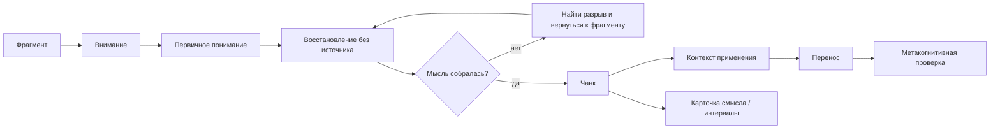

# Глава 16. Как строится понимание

## После стресса и окна полезной нагрузки

Предыдущая глава ввела окно полезной нагрузки.

Смысл был не в том, что нагрузка всегда вредна или всегда полезна. Смысл был точнее:

```text
слишком мало вызова не собирает систему
слишком много угрозы и давления ломает сложное мышление
полезная нагрузка находится между этими краями
```

Теперь можно говорить об обучении.

Обучение тоже требует нагрузки. Нельзя понять сложную тему, если только скользить по ней глазами, узнавать знакомые слова и каждый раз останавливаться на приятном ощущении "вроде понятно". Чтобы знание стало рабочим, его нужно восстановить без источника, связать с соседними знаниями, применить, ошибиться, поправить и снова вернуть.

Но обучение ломается, если нагрузка становится слишком большой. Когда задача перегружает рабочую память, когда ошибка кажется угрозой, когда слишком много новых терминов одновременно, когда нет следующего шага и обратной связи, человек не "тренируется глубже". Он часто просто шумит внутри, устает, избегает или запоминает оболочку без понимания.

Поэтому главная тема этой главы — не "как учиться эффективнее" в общем смысле.

Главная тема такая:

```text
как фрагмент знания становится рабочим пониманием,
затем чанком,
а затем переносимой единицей действия
```

Отсюда первое различение:

```text
понять при чтении
и уметь восстановить, связать и применить
— не одно и то же
```

## Понимание не равно знакомости

Начнем с обычной ситуации.

Человек читает понятный текст. Каждое предложение выглядит логичным. Термины знакомы. Пример убедительный. Внутри возникает спокойное чувство: "Да, понял".

Потом источник закрывается.

И вдруг оказывается, что пересказать главную мысль трудно. Можно вспомнить отдельные слова, но не ход рассуждения. Можно узнать термин, но не объяснить его без исходной формулировки. Можно согласиться с выводом, но не восстановить, почему он следует из предыдущих шагов.

Это не обязательно плохое чтение. Это нормальный ранний этап. Но его опасно принимать за готовое знание.

Знакомость возникает при встрече с материалом. Она отвечает на вопрос:

```text
я это уже видел?
```

Понимание начинается там, где можно ответить на другой вопрос:

```text
я могу это восстановить без источника,
объяснить своими словами,
связать с соседними знаниями
и применить в подходящей ситуации?
```

Между этими состояниями есть несколько ступеней.

| Состояние | Как выглядит | Что оно доказывает | Чего еще не доказывает |
| --- | --- | --- | --- |
| Знакомость | Термин, картинка или фраза узнаются. | Материал уже встречался. | Что смысл можно восстановить без подсказки. |
| Понимание при источнике | Текст кажется логичным, пока он перед глазами. | Человек может следовать чужому объяснению. | Что объяснение стало собственным. |
| Первичное рабочее понимание | Можно закрыть источник и пересказать мысль своими словами. | Смысл начал держаться без внешней опоры. | Что знание применится в другой задаче. |
| Чанк | Несколько элементов возвращаются как один блок. | Знание стало рабочей единицей. | Что оно не привязано к одному примеру. |
| Перенос | Принцип узнается и применяется в новой ситуации. | Знание вышло за пределы исходной оболочки. | Что перенос будет работать в любых далеких областях. |

Эта лестница важна для когнитивного инженерства. Если перепутать первую ступень с последней, человек начнет проектировать учебу неправильно. Он будет добавлять чтение там, где нужна проверка без источника. Будет делать красивые схемы там, где сначала нужно найти разрыв в объяснении. Будет собирать карточки из чужих фраз там, где мысль еще не стала своей.

## Рабочая память: почему фрагменты рассыпаются

Новое знание редко приходит в голову готовым блоком.

Обычно оно приходит как россыпь фрагментов:

- термин;
- определение;
- пример;
- исключение;
- причинная связь;
- шаг процедуры;
- образ;
- формула;
- связь с прошлой темой;
- вопрос, который пока не закрыт.

Проблема в том, что рабочая память не может спокойно удерживать большую россыпь отдельных элементов. Она похожа не на склад, а на маленькую рабочую поверхность. На ней можно держать несколько активных вещей и что-то с ними делать: сравнивать, связывать, проверять, менять порядок, примерять к задаче.

Если элементов слишком много, они начинают конкурировать. Человек держит термин и теряет пример. Держит пример и забывает условие. Держит условие и упускает, зачем вообще эта мысль была нужна.

Поэтому новое знание часто ощущается так:

```text
пока читаю — понимаю
как только закрываю — все распадается
```

Это не значит, что человек "глупый" или "не способен". Часто это значит, что материал пока остается набором отдельных фрагментов. Рабочая память платит за каждый фрагмент отдельно.

Классическая формула `7 +/- 2` хорошо известна, но ее нельзя использовать как точный закон для любой учебной ситуации. Современная картина осторожнее: емкость рабочего удержания мала, зависит от материала, задачи, опыта и того, считаем ли мы сырые элементы или уже собранные блоки. Для практики важна не точная цифра, а вывод:

```text
рабочая память терпит мало отдельных объектов
и гораздо лучше работает с осмысленными блоками
```

Вот почему опытный человек в своей области видит больше, чем новичок.

Новичок смотрит на ситуацию и видит много отдельных деталей. Специалист видит знакомые конфигурации: тип задачи, класс ошибки, паттерн поведения системы, место риска, обычную развилку решения. Он не держит каждую деталь отдельно. Часть деталей уже сжата в рабочие единицы.

Так появляется чанк.

## Что такое чанк

Чанк — это не просто группа элементов.

Это блок знания, который можно вернуть в голову почти целиком и использовать как одну рабочую единицу.

Коротко:

```text
чанк = смысловой или деятельностный блок,
который извлекается как одно целое
```

Важно не спутать чанк с папкой, списком, тегом или темой.

Папка хранит материалы рядом. Чанк снижает число отдельных удержаний.

Список перечисляет пункты. Чанк связывает их так, что они начинают работать вместе.

Тема может быть огромной и расплывчатой. Чанк имеет рабочие границы: понятно, что в него входит, зачем он нужен и когда его доставать.

Например, выражение на иностранном языке может быть чанком. Человек не переводит каждое слово отдельно, а узнает устойчивый смысл целого.

Алгоритм решения типовой задачи может быть чанком. Специалист не вспоминает каждый раз все правила с нуля, а видит знакомую структуру действия.

Понятие из этого учебника тоже может стать чанком. Например, "окно полезной нагрузки" становится рабочим блоком не тогда, когда читатель узнает название, а когда он может использовать его для диагностики:

```text
эта задача ниже окна, внутри окна или выше окна?
здесь не хватает вызова или уже слишком много угрозы?
что менять: смысл, объем параллельной работы, управляемость, обратную связь или восстановление?
```

Если понятие можно так достать и применить, оно стало ближе к чанку.

Если оно вспоминается только как знакомая фраза из главы, чанк еще не собран.

## Как фрагменты становятся чанком

В локальных заметках курса "Умение учиться" есть хорошая рабочая формула: чанк собирается через внимание, понимание и контекст.

Эти три слоя нельзя заменить друг другом.

### Внимание

Сначала материал должен действительно попасть в фокус.

Не "мелькнуть рядом". Не быть просмотренным между уведомлениями. Не быть пройденным на скорости, когда глаза уже в следующем абзаце, а мысль еще не удержала предыдущий.

Внимание здесь означает простой минимум:

```text
я могу удержать фрагмент достаточно долго,
чтобы понять, что он утверждает
```

Если этот слой не случился, дальше собирать нечего. Остается только смутное узнавание: "где-то видел".

### Понимание

Второй слой — собственная сборка смысла.

Пока мысль держится только в чужой формулировке, она еще хрупкая. Человек может повторить красивую фразу, но не обязательно понимает, какие отношения между частями она держит.

Понимание начинается, когда можно сказать своими словами:

```text
что здесь утверждается?
почему это важно?
с чем это связано?
какой пример показывает смысл?
где граница этого утверждения?
```

Своими словами — не значит "простыми" или "искаженными". Это значит, что мысль прошла через собственную сборку, а не только через копирование.

### Контекст

Третий слой — контекст применения.

Можно понять мысль и все равно не доставать ее в нужный момент. Такое часто случается с хорошими учебными текстами: пока человек читает главу, все ясно; через неделю в реальной задаче нужная идея не всплывает.

Проблема не всегда в памяти. Иногда у чанка нет контекста вызова.

Контекст отвечает на вопросы:

```text
где это знание нужно?
по каким признакам я пойму, что его пора достать?
какие соседние знания с ним конкурируют?
где оно не подходит?
что должно измениться в моем действии, если я его применил?
```

Без контекста знание может быть понятным, но плохо переносимым. Оно живет рядом с исходным примером, а не в рабочем мире человека.

## Центральный цикл понимания

Соберем это в одну схему.

Вопрос схемы:

```text
какой путь проходит фрагмент,
чтобы стать не знакомой строкой,
а рабочим знанием, которое можно восстановить и применить?
```



Схему нужно читать слева направо.

Граница схемы: она не обещает, что понимание всегда идет гладко и линейно. Узел ремонта здесь такой же важный, как узел успеха: разрыв восстановления без источника не означает провал, он показывает, что именно нужно чинить.

Сначала есть фрагмент. Он может быть новым термином, идеей, процедурой, примером или принципом.

Внимание удерживает его достаточно долго, чтобы началась первичная сборка.

Первичное понимание дает ощущение смысла, но еще не доказывает, что знание стало рабочим.

Проверка начинается на восстановлении без источника: источник убран, человек пытается восстановить мысль сам.

Если мысль не собирается, это не провал. Это точка диагностики. Нужно не перечитывать все подряд, а найти место разрыва:

- термин не понят;
- пропущена причинная связь;
- пример запомнился, а принцип нет;
- связь с соседним знанием не собрана;
- непонятно, где применять.

После ремонта разрыва восстановление без источника повторяется.

Когда мысль начинает возвращаться без источника, появляется кандидат в чанк. Но и это еще не конец. Нужно дать ему контекст применения и проверить перенос: узнается ли этот блок в другой задаче.

Карточки смысла и интервальное повторение стоят не в начале схемы, а после первичной сборки. Они возвращают мысль в память. Но если возвращать нечего, карточка станет карточкой узнавания чужой формулировки.

Метакогнитивная проверка смотрит на весь процесс сверху:

```text
что именно я сейчас строю?
где оно ломается?
какой следующий учебный ход нужен:
восстановление без источника, пример, карточка, практика, синопсис или отдых?
```

## Восстановление без источника: знание проверяется отсутствием подсказки

Восстановление без источника - это попытка восстановить мысль без подсказки исходного текста, схемы или готовой формулировки.

Не после полного курса. Не перед экзаменом. Сразу после первого осмысленного контакта.

Минимальный цикл такой:

1. Прочитать или разобрать небольшой фрагмент.
2. Убрать источник.
3. Восстановить главную мысль своими словами.
4. Заметить, где восстановление рвется.
5. Вернуться только к месту разрыва.
6. Снова закрыть источник и восстановить.

Почему это работает?

Потому что восстановление без источника проверяет не узнавание, а доступность знания изнутри. Пока текст перед глазами, он подставляет порядок, формулировку, пример и переходы. Когда текст убран, остается то, что действительно начало держаться.

Важный момент: восстановление без источника не только проверяет память. Оно участвует в обучении.

Когда человек пытается достать мысль, он перестраивает след. Он ищет связи, замечает пустые места, усиливает путь извлечения, отделяет принцип от оболочки. Поэтому хороший учебный цикл не выглядит как:

```text
читать -> читать -> читать -> надеяться, что запомнилось
```

Он выглядит так:

```text
понять малый фрагмент -> извлечь -> найти разрыв -> поправить -> извлечь снова
```

Такой цикл иногда неприятнее перечитывания. Он быстрее показывает, что знание еще не готово. Но именно поэтому он честнее.

## Иллюзия компетентности

Иллюзия компетентности появляется там, где знакомость кажется знанием.

Человек перечитывает материал. Второй проход идет легче. Третий еще легче. Фразы знакомы, порядок знаком, пример знаком, схема знакома. Из этой легкости рождается вывод:

```text
если стало легко читать,
значит я стал лучше знать
```

Иногда это правда. Но часто стало легче не потому, что мысль стала своей, а потому что оболочка стала привычной.

Оболочка — это:

- тот же порядок пунктов;
- та же страница;
- тот же пример;
- та же формулировка;
- та же схема;
- та же интонация объяснения.

При повторном чтении оболочка помогает узнавать маршрут. Но в реальной задаче этой оболочки может не быть. Там не будет знакомого заголовка, знакомой схемы и первого слова ответа. Нужно будет самому понять, какой чанк доставать.

Поэтому есть простая проверка:

```text
если знание возвращается только при виде источника,
это еще не рабочее знание
```

Выделения, подчеркивания, красивые конспекты и карты понятий не плохи сами по себе. Они могут помогать. Но они не заменяют восстановление без источника. Если сначала не было самостоятельного восстановления, внешняя схема может стать еще одной знакомой оболочкой.

Сильная карта понятий строится после того, как человек уже пытался восстановить смысл. Тогда карта помогает увидеть связи.

Слабая карта понятий строится вместо восстановления. Тогда она может красиво раскладывать чужие формулировки, не показывая, что именно человек способен достать сам.

## Чанк не появляется от одного повторения

Чанк собирается постепенно.

Сначала человек узнает элементы. Потом понимает связь между ними. Потом восстанавливает без источника. Потом применяет. Потом встречает похожую задачу в другой форме и понимает: "это тот же принцип".

Только после этого блок начинает возвращаться быстро.

Выглядит это так:

| Этап | Что происходит | Риск |
| --- | --- | --- |
| Первый контакт | Человек видит материал и пример. | Принять понятность источника за свое понимание. |
| Восстановление без источника | Источник убран, мысль восстанавливается или рвется. | Испугаться разрыва и уйти в пассивное перечитывание. |
| Ремонт | Человек чинит конкретный термин, переход или пример. | Перечитывать все подряд вместо точного ремонта. |
| Сборка чанка | Несколько элементов начинают возвращаться как один блок. | Назвать чанком то, что пока является списком. |
| Контекст | Понятно, где и зачем блок применять. | Оставить знание привязанным к исходной странице. |
| Перенос | Блок узнается в новой задаче. | Ожидать дальний перенос без вариативной практики. |

Такой путь опасно сильно сокращать: можно сделать его экономным, но нельзя заменить одним красивым конспектом.

## Карточки смысла

Карточка смысла нужна не для того, чтобы хранить еще одну формулировку.

Она нужна как маленький тест на восстановление чанка.

Плохая карточка спрашивает узнавание:

```text
Вопрос: Что такое аллостаз?
Ответ: Аллостаз — это...
```

Такая карточка может быть полезной на самом раннем уровне, но быстро превращается в проверку знакомой строки.

Более сильная карточка спрашивает смысл, связь или применение:

```text
Вопрос: Чем аллостаз отличается от простого представления о покое?
Ответ: Устойчивость поддерживается не неподвижностью, а изменением режима под требования среды.
```

Или:

```text
Вопрос: Как понять, что задача вышла выше окна полезной нагрузки?
Ответ: Появляются признаки перегруза: угроза, шум срочности, распад рабочей модели, высокая цена ошибки, много параллельной незавершенной работы и отсутствие восстановления.
```

Или:

```text
Вопрос: Когда "еще одно повторение" может поддерживать иллюзию компетентности?
Ответ: Когда человек повторяет знакомую оболочку без попытки восстановить мысль без источника и применить ее в другом контексте.
```

Хорошая карточка смысла делает три вещи:

1. Заставляет достать мысль из памяти.
2. Проверяет связь с соседними знаниями.
3. Уточняет, где эта мысль нужна.

Если ответ собирается только чужими словами, карточка показывает не провал, а незавершенную сборку. Нужно переписать обратную сторону своими словами, сузить вопрос или вернуться к разрыву.

Если ответ восстанавливается легко и переносится, карточку нужно разредить или убрать из активной колоды. Иначе повторение начнет обслуживать не обучение, а комфорт знакомости.

## Интервальное повторение: вернуть знание, а не заменить практику

Интервальное повторение полезно потому, что разводит возвраты во времени.

Когда между попытками есть интервал, знание приходится действительно доставать, а не просто держать в свежем следе. Это делает повторение ближе к извлечению из памяти, а не к продолжению чтения.

Но интервальное повторение не является универсальным решением.

Оно хорошо возвращает:

- термин;
- определение;
- различение;
- порядок шагов;
- принцип;
- связь между понятиями;
- вопрос, который нужно держать активным.

Но оно не заменяет:

- практику действия;
- применение в реальной задаче;
- работу с ошибкой;
- вариативность примеров;
- перенос в новый контекст;
- телесный или моторный навык;
- сложный разговор;
- проектирование решения.

Если человек учится писать архитектурные решения, карточки могут вернуть понятия: ограничение, компромисс, контекст, риск, критерий выбора. Но сами карточки не научат писать решения. Нужна практика: разобрать ситуацию, выбрать вариант, получить обратную связь, сравнить с альтернативой.

Поэтому точная формула такая:

```text
интервальное повторение возвращает знание в доступ
практика учит использовать его в действии
```

## Синопсис: поздняя проверка крупного смысла

Синопсис — это не краткое содержание ради красоты.

Это поздняя проверка: пережила ли тема первое понимание и стала ли она собственным каркасом.

Восстановление без источника обычно работает близко к первому контакту. Оно проверяет локальную мысль:

```text
могу ли я восстановить это сейчас?
```

Синопсис появляется позже. Он проверяет более крупный маршрут:

```text
что в этой теме главное,
как связаны опорные идеи,
что останется, если убрать детали?
```

Хороший синопсис не обязан быть длинным. Он должен быть плотным.

Например, после этой главы синопсис мог бы звучать так:

```text
Понимание строится не через знакомость, а через активную сборку: фрагмент должен попасть во внимание, быть объяснен своими словами, восстановлен без источника, собран в чанк, привязан к контексту применения и проверен переносом. Повторение полезно, когда оно запускает извлечение, а не просто продлевает знакомую оболочку.
```

Это не заменяет главу. Но показывает, что каркас главы собран.

Если синопсис получается только как переписанная чужая формулировка, значит тема еще не стала своей. Нужно вернуться к восстановлению без источника и найти, где именно маршрут не держится.

## Контекст применения: когда доставать этот чанк

Знание может быть понятным, но не приходить в нужный момент.

Это особенно неприятный тип сбоя. Человек после факта говорит:

```text
я ведь это знал
почему я не вспомнил?
```

Часто причина в том, что знание было сохранено без контекста применения.

Контекст чанка — это набор признаков, по которым система понимает, что этот блок сейчас нужен.

Например, чанк "иллюзия компетентности" должен всплывать не только при чтении этой главы. Он нужен в ситуациях:

- я уже третий раз перечитываю один и тот же материал;
- текст кажется понятным, но я не пробовал закрыть источник;
- я делаю карточки из чужих фраз;
- я строю красивую схему, но не могу объяснить ее без опоры;
- упражнение получается только в том же порядке, что в уроке.

Если эти признаки названы, чанк получил контекст вызова.

Тогда в реальной учебной ситуации появляется шанс остановиться и сказать:

```text
сейчас я, возможно, укрепляю знакомость,
а не знание
```

Без такого контекста мысль остается учебной. С контекстом она становится рабочей.

## Перенос: знание должно пережить смену оболочки

Перенос — это применение знания в новой ситуации.

Нужно писать об этом осторожно. Перенос не возникает автоматически от того, что человек хорошо понял исходный пример. Чем дальше новая ситуация от исходной, тем больше различий нужно преодолеть:

- другой предмет;
- другая форма задачи;
- другой язык описания;
- другое время после обучения;
- другой уровень подсказок;
- другая социальная рамка;
- другая цена ошибки;
- другой способ ответа.

Близкий перенос легче. Например, человек научился отличать перегруз от недогруза на учебной задаче и применил это к похожей рабочей задаче.

Дальний перенос труднее. Например, человек взял ту же модель и применил ее к воспитанию ребенка, командной политике ограничения параллельной работы или проектированию интерфейса обучения. Это возможно, но требует не только запоминания, а выделения более абстрактного принципа и практики в разных контекстах.

Перемежение помогает проверить перенос.

Если все задачи идут в одном порядке, легко угадать, какой метод применять. Когда примеры перемешаны, приходится выбирать:

```text
что это за ситуация?
какой чанк здесь нужен?
какой похожий чанк не подходит?
по каким признакам я различаю?
```

Перемежение полезно не с самого первого контакта. Если отдельные чанки еще не собраны, хаотическое смешивание только увеличит шум. Но после первичной сборки оно показывает, действительно ли знание работает вне привычной оболочки.

## Полезная трудность и бесполезная трудность

Теперь вернемся к окну полезной нагрузки.

В обучении трудность нужна. Слишком легкое чтение часто оставляет знакомость без проверки. Человек идет по тексту гладко, не вытаскивает мысль из памяти, не сравнивает, не ошибается и не чинит.

Но трудность полезна только при определенных условиях.

| Вид трудности | Что происходит | Пример | Инженерный ход |
| --- | --- | --- | --- |
| Полезная трудность | Запускает извлечение, различение, обратную связь и перенос. | Закрыть источник и объяснить мысль своими словами. | Держать, но дозировать. |
| Трудность разрыва | Показывает конкретное место, где мысль не собрана. | Не получается объяснить переход между причиной и выводом. | Вернуться к точному разрыву. |
| Трудность контекста | Нужно понять, когда применять знание. | В перемешанных задачах непонятно, какой метод выбрать. | Назвать признаки ситуации и конкурирующие чанки. |
| Бесполезная трудность | Увеличивает шум, но не дает обратной связи. | Слишком много новых терминов без примера и цели. | Упростить вход и разделить материал. |
| Угрожающая трудность | Ошибка воспринимается как стыд или провал. | Учебная проверка превращается в социальный экзамен. | Снизить угрозу и вернуть безопасную обратную связь. |
| Перегрузочная трудность | Рабочая память забита до того, как появилась структура. | Одновременно новая терминология, новый инструмент, новая задача и дедлайн. | Сузить объем параллельной работы и собрать первый чанк. |

Это важная граница.

Не всякая трудность развивает.

Развивает та трудность, которая оставляет возможность действовать, различать и исправлять. Если трудность только повышает угрозу, перегружает рабочую память или делает ошибку непонятной, она не тренирует понимание. Она выводит систему выше окна.

## Как проектировать учебный цикл

Теперь можно собрать практический цикл.

### 1. Выбрать малый фрагмент

Не нужно пытаться сразу "понять тему". Тема слишком велика. Начинать лучше с фрагмента:

- одно понятие;
- одно различение;
- один механизм;
- один пример;
- одна процедура;
- один вопрос.

Фрагмент должен быть достаточно малым, чтобы его можно было удержать и восстановить.

### 2. Понять, зачем он нужен

Перед чтением полезно спросить:

```text
какую проблему этот фрагмент решает?
какой вопрос он должен закрыть?
в какой будущей задаче он может пригодиться?
```

Это не мотивационная подводка. Это контекст для памяти и внимания.

### 3. Сделать первый контакт

Прочитать, посмотреть пример, разобрать объяснение.

На этом этапе не нужно сразу строить идеальную карточку или конспект. Нужно понять, что утверждается.

### 4. Закрыть источник и восстановить мысль

Сразу после первого контакта:

```text
что я понял?
как бы я объяснил это человеку без источника?
какой пример показывает смысл?
где у меня рвется объяснение?
```

Если мысль не собирается, это нормальный результат. Найдено место работы.

### 5. Починить конкретный разрыв

Вернуться не ко всему материалу, а к месту сбоя:

- уточнить термин;
- разобрать пример;
- восстановить причинную связь;
- найти недостающий шаг;
- спросить, с каким соседним знанием это связано.

После этого снова закрыть источник.

### 6. Назвать кандидат в чанк

Когда мысль начала возвращаться, нужно назвать блок:

```text
что здесь является чанком?
какие элементы он стягивает?
это блок смысла или блок действия?
какую нагрузку на рабочую память он снижает?
```

Название важно не как красивый ярлык, а как точка доступа.

### 7. Добавить контекст применения

У чанка должны быть условия вызова:

```text
когда я должен его вспомнить?
какие признаки ситуации его вызывают?
где он не подходит?
какой соседний чанк можно перепутать с ним?
```

### 8. Сделать карточку смысла или короткую запись

Если блок важен, его можно превратить в карточку смысла.

Вопрос должен запускать восстановление:

```text
не "дай определение",
а "как отличить", "почему", "когда применять", "где граница"
```

Иногда вместо карточки лучше короткая рабочая запись. Например, если это не факт, а схема действия.

### 9. Проверить перенос

Найти второй пример.

Он должен быть достаточно похожим, чтобы принцип применился, но достаточно отличным, чтобы нельзя было просто повторить исходный порядок.

Вопрос:

```text
я узнаю тот же принцип
или просто помню исходный пример?
```

### 10. Вернуться позже

Через интервал можно сделать:

- карточку;
- короткое восстановление без источника;
- синопсис;
- применение в задаче;
- перемежение с похожими темами.

Не все нужно делать для каждого фрагмента. Инженерный вопрос всегда один:

```text
какой следующий контакт лучше всего укрепит именно этот блок?
```

## Пример: как учить понятие "управляемость"

Возьмем понятие из главы 10.

Плохой учебный путь:

1. Прочитать главу.
2. Подчеркнуть определение.
3. Согласиться, что управляемость важна.
4. Перейти дальше.

Проблема: это может оставить только знакомость.

Рабочий путь:

1. Малый фрагмент: управляемость — ожидаемая способность действия повлиять на исход.
2. Восстановление без источника: закрыть текст и объяснить отличие управляемости от вероятности успеха.
3. Разрыв: если отличие не держится, вернуться к примеру.
4. Чанк: "ценность без управляемости повышает цену усилия и угрозу".
5. Контекст: вспоминать это, когда задача важная, но человек не входит в действие.
6. Карточка смысла: "Почему высокая ценность задачи может снижать действие, если управляемость низкая?"
7. Перенос: применить к учебе, рабочему проекту и сложному разговору.

После такого цикла понятие начинает работать. Оно уже не просто хранится в главе. Оно становится диагностическим инструментом.

## Практический смысл для когнитивного инженерства

Когнитивное инженерство не может ограничиться хорошими объяснениями.

Если человек только читает модель, но не превращает ее в рабочие блоки, модель останется красивой внешней системой. Она будет узнаваемой, но не управляющей.

Чтобы модель стала инструментом, ее элементы должны стать чанками:

- контекст задачи;
- рабочий журнал;
- ритуал входа;
- ценность;
- угроза;
- избегание;
- управляемость;
- цена усилия;
- аллостатическая нагрузка;
- окно полезной нагрузки;
- иллюзия компетентности;
- перенос.

Каждый такой блок должен не просто "быть прочитан". Он должен получить:

- собственную формулировку;
- вопрос для восстановления без источника;
- пример;
- контекст применения;
- границу;
- связь с соседними блоками.

Тогда учебник перестает быть текстом и становится набором рабочих инструментов.

## Источниковая опора

Проверенный пакет для этой главы: [[../Источники/2026-05-24 Пакет источников для главы 16]].

Ключевые источники в авторско-годовой форме:

- Miller (1956), Cowan (2001), Baddeley (2012): рабочая память ограничена и работает как активное удержание и обработка, а не как склад; формулу `7 +/- 2` нельзя использовать как современную точную норму.
- Chase & Simon (1973), Gobet et al. (2001): экспертность опирается на чанки и узнавание осмысленных конфигураций, а не на удержание всех деталей по отдельности.
- Roediger & Karpicke (2006), Roediger & Butler (2011), Karpicke & Blunt (2011), Dunlosky et al. (2013): практика извлечения из памяти и распределенная практика как сильные учебные механизмы; пассивное перечитывание и выделение текста слабее как самостоятельные техники.
- Soderstrom & Bjork (2015): обучение и текущее выполнение различаются; текущая легкость выполнения не доказывает долговременного обучения.
- Barnett & Ceci (2002), Chi et al. (1989): перенос и самообъяснение как мост от узнавания к применению принципа в новом контексте.
- Sweller (1988): граница когнитивной нагрузки; трудность полезна не всегда, перегруз рабочей памяти может мешать обучению.
- Kane et al. (2007), Mooneyham & Schooler (2013): блуждание мысли имеет зависящие от задачи издержки и возможные выгоды; для понимания важно различать рассеянный режим и потерю удержания учебного контекста.
- Внутренние авторские материалы по умению учиться, кратковременной памяти и интервальному повторению.

Доказательная роль блока: `strong` для ограничений рабочей памяти, практики извлечения из памяти, распределенной практики и различения обучения и текущего выполнения; `context-dependent` для чанкинга, самообъяснения, карточек смысла, интерливинга, переноса и эффектов блуждания мысли; граница применимости для дальнего переноса, "полезной трудности" и рассеянного режима: глава не обещает, что любое усложнение, любая карточка, любое повторение или любое блуждание мысли автоматически строит понимание.

Полные библиографические записи и DOI сохранены в пакете главы. В текущей редакции глава оставляет короткий авторско-годовой блок как читательский ориентир.

## Короткое резюме

1. Понимание не равно знакомости.
2. Знакомость отвечает на вопрос "я это видел?", а рабочее понимание — "я могу восстановить, связать и применить?".
3. Рабочая память плохо держит много сырых фрагментов.
4. Чанк сжимает несколько элементов в одну рабочую единицу через смысл или действие.
5. Чанкинг требует внимания, понимания и контекста применения.
6. Восстановление без источника - первая честная проверка знания.
7. Провал восстановления без источника показывает место разрыва, а не плохую память.
8. Повторное чтение может укреплять знакомость, а не понимание.
9. Хорошая карточка смысла запускает извлечение и связь, а не узнавание чужой фразы.
10. Интервальное повторение возвращает знание в доступ, но не заменяет практику.
11. Синопсис — поздняя проверка крупного смысла, а не украшение конспекта.
12. Перенос требует контекста применения и вариативных примеров.
13. Полезная трудность запускает извлечение, различение и обратную связь.
14. Бесполезная трудность перегружает рабочую память, повышает угрозу и не показывает, что чинить.

## Вопросы для самопроверки

1. Чем знакомость отличается от рабочего понимания?
2. Почему понятный текст не доказывает, что знание уже стало вашим?
3. Почему рабочая память перегружается сырыми фрагментами?
4. Чем чанк отличается от папки, списка или темы?
5. Какие три слоя нужны для сборки чанка?
6. Почему восстановление без источника лучше обнаруживает разрывы, чем очередное перечитывание?
7. Как понять, что карточка смысла проверяет узнавание, а не восстановление?
8. Почему интервальное повторение не заменяет практику?
9. Чем синопсис отличается от краткого пересказа сразу после чтения?
10. Что такое контекст применения чанка?
11. Почему перенос не возникает автоматически после хорошего понимания исходного примера?
12. Как отличить полезную трудность от перегруза?

## Мини-практика

Возьмите один небольшой фрагмент из любой предыдущей главы учебника и проведите его через цикл.

| Шаг | Ответ |
| --- | --- |
| Какой фрагмент я выбираю? |  |
| Что он утверждает? |  |
| Зачем он нужен? |  |
| Как я объясню его без источника? |  |
| Где объяснение рвется? |  |
| Какой точный разрыв нужно починить? |  |
| Какой чанк здесь собирается? |  |
| В какой ситуации его нужно достать? |  |
| С каким похожим чанком его можно перепутать? |  |
| Какой вопрос для карточки смысла проверит не узнавание, а восстановление? |  |
| На каком новом примере я проверю перенос? |  |
| Какой следующий контакт нужен: карточка, синопсис, практика, перемежение или пауза? |  |

Цель мини-практики — не сделать идеальную карточку. Цель — увидеть, на каком этапе фрагмент перестает быть знакомым текстом и начинает становиться рабочим знанием.

## Статус

`ready-for-review`

Источниковый пакет: [[../Источники/2026-05-24 Пакет источников для главы 16]].

Связки проверены: [[../Проверки/2026-05-24 Связка глав 15-16]] и [[../Проверки/2026-05-24 Связка глав 16-17]].

Ревизия блока: [[../Проверки/2026-05-25 Ревизия блока 16-19]].

Следующая глава: [[17-Сон-восстановление-и-консолидация]].
