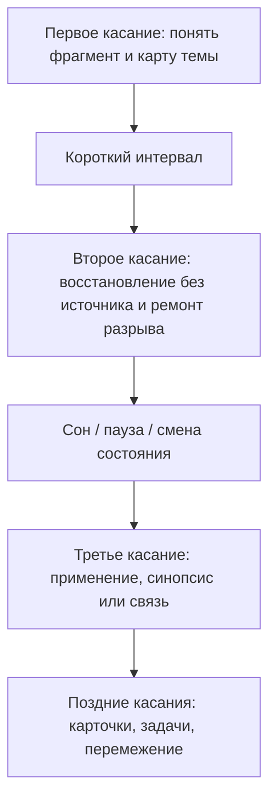

# Глава 17. Сон, восстановление и консолидация

## После главы о понимании

Предыдущая глава разобрала, как фрагмент знания становится рабочим пониманием.

Коротко этот путь выглядел так:

```text
фрагмент -> внимание -> первичное понимание -> восстановление без источника -> чанк -> контекст применения -> перенос
```

Это уже гораздо честнее, чем обычная формула "прочитал — понял — запомнил". Но даже эта схема еще неполная.

В ней не хватает времени.

Понимание не становится устойчивым только потому, что один раз хорошо собралось в голове. После первого фокусного контакта знание еще зависит от свежего следа, текущего состояния, недавнего примера, порядка объяснения и той оболочки, в которой оно появилось.

Человек может вечером закрыть источник и довольно хорошо пересказать мысль. Это важный порог. Но на следующее утро мысль может оказаться менее четкой. Какие-то связи исчезли. Пример помнится, а принцип нет. Формулировка узнается, но не восстанавливается. Или наоборот: за ночь мысль стала проще, плотнее, появились новые связи.

Это не случайность и не странность памяти. Обучение продолжается после первого контакта.

Главная тема этой главы:

```text
как первичный след знания проходит через паузу, сон,
повторное извлечение и уточнение,
чтобы стать более устойчивым чанком
```

Сон, паузы и интервалы здесь не будут описываться как бытовые советы вроде "надо отдыхать". Это слишком слабо для учебника по когнитивному инженерству.

Точнее так:

```text
восстановление — часть контура обучения,
а не награда после обучения
```

Если убрать восстановление, система может продолжать потреблять материал, но хуже удерживать, связывать и возвращать его. Если убрать фокусный контакт, восстановление без источника и повторное применение, сон тоже не сделает магии: ему нечего будет перерабатывать как осмысленный учебный след.

## Первый контакт еще не делает знание долговременным

Начнем с простой ситуации.

Человек вечером изучает новую тему. Он читает внимательно, разбирает пример, закрывает источник и пересказывает главную мысль своими словами. Восстановление без источника получается не идеально, но достаточно хорошо. Он чувствует: "Да, теперь понял".

Что произошло?

Произошел важный учебный контакт:

- материал попал во внимание;
- часть связей была собрана;
- рабочая память удержала основные элементы;
- восстановление без источника показало, что мысль уже не полностью зависит от источника;
- появился кандидат в чанк.

Но этот кандидат еще хрупкий.

Его можно назвать первичным следом.

Первичный след — это не готовая долговременная компетентность. Это след недавнего опыта, который может быть стабилизирован, связан с прежними знаниями, частично изменен, усилен через повторное извлечение или потерян, если больше не будет возвращений.

В локальных заметках по обучению есть слово "энграмма" — первичный отпечаток опыта. В научной литературе энграмму лучше понимать осторожно: не как одну точку памяти и не как готовый файл, а как распределенный след, связанный с изменениями в нейронных сетях. Для учебника нам достаточно рабочей идеи:

```text
после фокусного контакта остается не готовое знание,
а след, которому нужны условия стабилизации и возврата
```

Это различение защищает от двух ошибок.

Первая ошибка:

```text
если я понял сейчас, значит уже выучил
```

Вторая ошибка:

```text
если завтра мысль распалась, значит вчерашнее понимание было фальшивым
```

Обе слишком грубые.

Вчерашнее понимание могло быть настоящим, но ранним. Завтрашний распад может быть не провалом, а нормальной диагностикой: какие связи не закрепились, какой контекст не собран, какой вопрос нужно вернуть в восстановление без источника.

## Центральный цикл главы

Соберем основной маршрут сразу.

Вопрос схемы:

```text
как фокусный контакт, пауза, сон и повторное извлечение
становятся одним учебным контуром,
а не набором отдельных советов?
```


Эта схема важна именно как контур.

Граница схемы: она не превращает сон в лайфхак и не обещает, что восстановление само создаст знание. Без фокусного контакта, восстановления без источника и следующего касания сну нечего превращать в рабочий чанк.

Если убрать фокусный контакт, пауза превращается в ожидание вдохновения.

Если убрать восстановление без источника, человек может укреплять знакомость, а не знание.

Если убрать сон и восстановление, система хуже удерживает внимание, хуже регулирует состояние и хуже перерабатывает следы.

Если убрать следующее касание, консолидация остается без проверки: мы не знаем, что действительно стало доступным.

Если убрать применение, знание может остаться возвращаемым, но не рабочим.

Поэтому правильный вопрос не "что важнее: сон или повторение?". Правильный вопрос:

```text
как построить цикл,
в котором фокус, пауза, сон, восстановление без источника и применение поддерживают друг друга?
```

## Пауза — не пустота

В учебе есть соблазн считать продуктивным только тот момент, когда человек сидит над материалом.

Он читает — значит учится.

Решает — значит учится.

Пишет конспект — значит учится.

Отошел от материала — значит перестал учиться.

Это слишком узкий взгляд.

Пауза может быть рабочей частью обучения, если перед ней был фокусный контакт, а после нее есть точка возврата. В паузе материал перестает держаться только свежей оболочкой источника. Часть деталей уходит, часть связей остается, часть противоречий всплывает позже. Следующее обращение к материалу становится не продолжением чтения, а проверкой: что система действительно может вернуть?

Пауза нужна не потому, что мозг "отдыхает от мышления" в буквальном смысле. Мозг не выключается. Пауза нужна потому, что непрерывный поток нового материала часто мешает предыдущему материалу стать отдельной возвращаемой единицей.

В локальной заметке о рефлексии информации это сформулировано хорошо: после первого контакта начинается внутренняя доработка значимого, но еще невстроенного фрагмента. Новое сопоставляется с известным, снимает противоречия, ищет грубый прогноз применения.

Можно сказать так:

```text
во время фокусного контакта материал входит в систему;
между контактами он получает шанс стать частью системы
```

Но пауза бывает разной.

| Признак | Восстановительная пауза | Избегание |
| --- | --- | --- |
| Перед паузой | Был фокусный контакт или честная фиксация состояния. | Задача не получила входа или была оборвана на угрозе. |
| Точка возврата | Есть вопрос, следующий шаг, карточка, место разрыва или критерий входа. | Возврат не определен. |
| Внутренний эффект | Задача становится чуть доступнее или яснее. | Задача становится туманнее, страшнее или дороже. |
| После паузы | Можно проверить, что осталось, через восстановление без источника или действие. | Нужно заново преодолевать вход. |
| Роль в системе | Возвращает внимание и управляемость. | Снимает неприятное чувство сейчас, но ухудшает следующий вход. |

Внешне оба состояния похожи: человек не работает над задачей.

Системно они противоположны.

Восстановительная пауза поддерживает следующий контакт. Избегание крадет следующий контакт.

## Сон не выключает мозг

Сон часто описывают слишком просто.

Один вариант: сон — это пассивный отдых, время, когда мозг "ничего не делает".

Другой вариант: сон — магическая мастерская, которая сама решает задачи, записывает знания и очищает голову.

Оба варианта мешают.

Сон — активное состояние организма и мозга. Он связан с восстановлением, регуляцией, метаболическими процессами, эмоциями, вниманием и памятью. Но это не одна функция и не одна кнопка.

Для этой главы важны три слоя.

Первый слой — состояние системы.

Если человек систематически недосыпает, у него хуже работает устойчивое внимание, растет вариативность реакции, страдает рабочая память, сложнее тормозить импульсы, хуже регулируются эмоции и риск. Это не морализаторство, а проблема состояния: система входит в задачу в другом режиме.

Второй слой — память.

Сон участвует в консолидации: стабилизации, реорганизации и интеграции следов памяти. Не все виды памяти зависят от сна одинаково, не любое обучение одинаково выигрывает от одной ночи, и нельзя обещать простую формулу "прочитал перед сном — гарантированно запомнил". Но сон является важной частью того, как недавний опыт становится более устойчивым.

Третий слой — отбор и перенастройка.

Память — это не просто склад, куда мозг складывает все подряд. После дня активности система должна не только укреплять, но и перенастраивать связи: что сохранить, что ослабить, как интегрировать новое с уже имеющимся, как не оставить сеть в состоянии бесконечного усиления всего подряд. Поэтому современные модели сна говорят не только об укреплении следов, но и о реорганизации, интеграции и гомеостазе.

Практический вывод дает различение:

```text
сон не заменяет учебную работу,
но без сна учебная работа хуже становится устойчивым знанием
```

## Что такое консолидация

Консолидация памяти — это процесс, в котором первичный след становится более стабильным и связанным с долговременной памятью.

В учебном языке можно сказать так:

```text
консолидация = стабилизация + реорганизация + интеграция
```

Стабилизация означает, что след становится менее хрупким. Он уже не полностью зависит от свежего контекста.

Реорганизация означает, что память не хранится как фотография первого контакта. Связи меняются. Что-то становится центральным, что-то уходит на периферию, что-то связывается с прежними знаниями.

Интеграция означает, что новое знание начинает жить рядом с уже существующими схемами, примерами, понятиями и действиями.

В нейробиологическом слое часто говорят о гиппокампе и коре. Для учебника достаточно осторожной модели.

Гиппокамп важен для связывания новых эпизодов и отношений: что с чем встретилось, в каком контексте, в каком порядке, с каким значением. Кора хранит более распределенные, постепенно стабилизирующиеся знания и навыковые структуры. В системной консолидации сон связывают с повторной реактивацией следов и постепенным изменением роли гиппокампально-кортикальных связей.

Но это не значит, что за одну ночь знание "переписывается из гиппокампа в кору" как файл с диска на диск. Это популярная, но грубая картинка. Процесс зависит от типа материала, значимости, повторений, связи с прежними знаниями, эмоционального состояния, практики и времени. Некоторые изменения могут происходить быстро, другие продолжаются долго.

Для когнитивного инженерства важнее практическая форма:

```text
после первого контакта знанию нужно время,
повторные обращения
и условия восстановления,
чтобы стать менее зависимым от исходной оболочки
```

## Реактивация: память поднимается снова

Реактивация — это повторное поднятие следа памяти.

Она может происходить во сне, когда недавние следы повторно активируются в связке с ритмами сна. Она может происходить и во время бодрствования, когда человек возвращается к материалу через восстановление без источника, задачу, карточку, разговор или применение.

Для учебника важно не превращать реактивацию в мистику. Это не "мозг сам повторяет уроки" в удобном для нас формате. Это скорее общий принцип:

```text
след, который снова активируется,
получает шанс быть укрепленным, измененным и связанным
```

Отсюда следует практический вывод.

Если после первого контакта нет следующего касания, мы не используем этот шанс. Человек может надеяться, что "оно как-то само уляжется", но без повторного обращения трудно понять, что именно улеглось, что распалось, а что исказилось.

Следующее касание должно быть активным.

Не обязательно длинным. Иногда достаточно пяти минут:

```text
закрыть источник,
восстановить главную мысль,
заметить разрыв,
поправить одну связь,
оставить новый вопрос
```

Но это должно быть касание к памяти, а не только к странице.

## Реконсолидация: память не просто достается, а меняется

Когда человек возвращается к знанию, он не достает его как неизменный файл.

Память может становиться более устойчивой, но может и меняться. Повторное обращение к следу открывает возможность уточнения, перестройки и иногда искажения. Поэтому в локальной заметке справедливо отмечено: при повторном обращении воспоминания укрепляются и изменяются.

В учебе это видно постоянно.

Человек прочитал идею и понял ее грубо.

На следующий день пересказал своими словами и заметил, что перепутал причину и следствие.

После примера переписал формулировку.

После задачи понял границу применимости.

После разговора с другим человеком увидел, где его объяснение слишком широко.

Это и есть нормальная учебная переработка:

```text
первый след -> повторное извлечение -> ошибка -> уточнение -> новый след
```

Но есть и обратная сторона.

Если человек повторяет неверную формулировку, пересказывает слишком уверенное упрощение или строит карточку на ошибочном различении, он тоже может закреплять след. Повторение само по себе не гарантирует качество. Оно усиливает то, что поднимается.

Поэтому внешние записи важны не только как память.

Рабочий журнал, карточка смысла, синопсис и заметка помогают сравнить:

```text
что я думал вчера?
что я восстановил сегодня?
что изменилось?
это уточнение или искажение?
какой источник или пример проверяет границу?
```

Так внешний контур мышления из глав 4-6 возвращается в тему обучения. Он нужен не только для задач разработчика. Он нужен для аккуратной реконсолидации собственных знаний.

## Недосып как проблема состояния

Самая грубая ошибка — считать сон просто временем, которое можно обменять на дополнительные часы учебы или работы.

Иногда такой обмен выглядит выгодным.

Сегодня дедлайн. Сегодня экзамен. Сегодня нужно дописать главу, закрыть задачу, закончить разбор. Человек забирает у сна два часа и получает два часа бодрствования.

В бухгалтерии календаря это плюс.

В когнитивной системе это не обязательно плюс.

Недосып меняет качество состояния, в котором потом нужно думать, учиться, регулировать эмоции и принимать решения.

| Функция | Как может страдать при недосыпе | Почему это важно для учебника |
| --- | --- | --- |
| Устойчивое внимание | Сложнее держать задачу, больше провалов и микросбоев. | Восстановление без источника и работа с разрывами требуют удержания. |
| Рабочая память | Труднее держать несколько элементов и связи между ними. | Чанки собираются хуже, если элементы рассыпаются. |
| Торможение | Сложнее не уходить в быстрые отвлечения и импульсы. | Прокрастинация и переключения становятся доступнее. |
| Когнитивная гибкость | Труднее менять стратегию, если текущий ход не работает. | Разрыв чинится хуже, человек застревает или бросает. |
| Эмоциональная регуляция | Ошибка легче переживается как угроза. | Полезная трудность быстрее становится перегрузом. |
| Оценка риска и награды | Сдвигается баланс импульсивности, срочности и осторожности. | Человек хуже выбирает между отдыхом, продолжением и остановкой. |

Важно: данные по разным исполнительным функциям высокого уровня неоднородны. Не нужно писать, что недосып одинаково разрушает все когнитивные функции у всех людей в любой ситуации. Надежнее говорить так:

```text
недосып повышает цену сложного управления состоянием,
особенно там, где нужны внимание, рабочая память,
эмоциональная регуляция и устойчивое возвращение к задаче
```

Есть важное уточнение по силе этого вывода.

Короткое ограничение сна на одну ночь надежнее всего видно в росте сонливости и ухудшении sustained attention: больше провалов внимания, больше задержек реакции, ниже стабильность удержания. Это уже достаточно серьезно для учебы, вождения, сложной работы и задач, где нельзя терять нить.

Более широкие выводы про рабочую память, торможение и когнитивную гибкость лучше опирать не на одну плохую ночь, а на более общий корпус исследований недосыпа, где вместе рассматриваются полное лишение сна, частичное ограничение сна, разные задачи и разные метрики. Там картина тяжелее, но и сложнее: где-то страдает скорость, где-то точность, где-то появляется компромисс между скоростью и аккуратностью.

Поэтому точная формула такая:

```text
сон поддерживает не одну абстрактную "энергию",
а несколько компонентов режима:
бдительность, устойчивое внимание, рабочую память,
торможение, гибкость и эмоциональную регуляцию,
причем разные компоненты проседают по-разному
```

Для когнитивного инженерства это меняет язык.

Фраза "я не могу собраться" не всегда означает недостаток мотивации.

Иногда это:

```text
система пытается выполнить сложное действие
в состоянии, где внимание, контроль и восстановление уже просели
```

В таком состоянии добавлять еще больше давления часто бессмысленно. Нужно либо снизить сложность входа, либо уменьшить объем параллельной работы, либо вернуть базовое состояние, либо честно перенести сложную часть после восстановления.

## Циркадность: состояние зависит не только от количества сна

Есть еще один слой, который легко потерять, если говорить только "выспался / не выспался".

Когнитивная эффективность зависит не только от количества сна, но и от времени бодрствования, накопленного дефицита сна, внутреннего биологического времени и типа задачи. У организма есть циркадная организация: примерно суточные ритмы, которые помогают согласовывать сон, бодрствование, бдительность, температуру тела, гормональные и нейронные процессы с циклом дня и ночи.

Это не значит, что учебник должен учить читателя вычислять идеальное расписание по хронотипу. Такая версия быстро превращается в хрупкий лайфхак.

Для когнитивного инженерства важнее другое:

```text
одна и та же задача может иметь разную цену
в разное время суток и при разном накопленном дефиците сна
```

Если человек пытается выполнять работу, требующую торможения, переключения правил, точного восстановления без источника или удержания сложной схемы, в момент, когда система уже живет в неподходящей фазе и с накопленным недосыпом, задача становится не просто "неприятнее". Она становится дороже как когнитивное действие.

Отсюда практический вывод:

| Если состояние ниже ожидаемого | Что проверить |
| --- | --- |
| Задача внезапно стала туманной | Это сложность задачи или неподходящее состояние? |
| Восстановление без источника не получается | Материал не закрепился или сейчас плохое окно внимания? |
| Ошибки стали грубее | Не пора ли перейти с творческого решения на подготовку, проверку или контрольную точку? |
| Вечером хочется "дожать" | Не покупается ли текущий прогресс завтрашним падением входа? |
| Утром нет доступа к сложной части | Нужно ли сначала восстановить режим, а не добавлять давление? |

Циркадность в этой книге нужна не как культ режима дня, а как защита от неправильной интерпретации:

```text
иногда проблема не в слабой воле,
а в том, что сложное действие запланировано
в плохом биологическом и когнитивном окне
```

## Рассеянный режим: после фокуса, а не вместо него

В локальных учебных заметках есть различение фокусного и рассеянного режимов.

Фокусный режим нужен, чтобы удержать понятие, разобрать пример, выполнить задачу, восстановить мысль без источника, найти разрыв.

Рассеянный режим нужен, чтобы связи могли доработаться без прямого удержания каждого элемента. Во время прогулки, душа, легкой бытовой активности, отдыха или сна мысль иногда продолжает собираться. Появляется новый пример, более простая формулировка, неожиданный мост к другой теме.

Но здесь легко попасть в красивую ошибку.

Ошибка:

```text
если рассеянный режим полезен,
можно не входить в фокус
```

Нет.

Если не было фокусного контакта, рассеянному режиму нечего перерабатывать как учебный материал. Он может породить ассоциации, но не обязан собрать знание, с которым система не работала.

Более точная формула:

```text
фокусный режим дает материал;
рассеянный режим дает шанс связям дозреть;
следующее касание проверяет, что действительно дозрело
```

Поэтому учебную паузу лучше начинать не с бегства от задачи, а с маленького контакта.

Даже если сил мало, можно сделать минимальный вход:

```text
что я пытаюсь понять?
какой один фрагмент беру?
что уже ясно?
где рвется объяснение?
с каким вопросом я ухожу на паузу?
```

После такой фиксации пауза получает материал и точку возврата.

## Интервалы: знанию нужно немного уйти, чтобы его можно было вернуть

Интервальное повторение часто объясняют через кривую забывания: если возвращаться к материалу с интервалами, он лучше удерживается.

Это полезная картинка, но ее нужно понимать не механически.

Смысл интервала не в том, чтобы просто подождать указанное число часов. Смысл в том, что между касаниями знание перестает держаться только свежим следом. Часть знакомости уходит. При следующем обращении приходится действительно извлекать.

Именно это делает повторение учебной работой.

```text
массовое повторение часто продлевает знакомость;
интервальное извлечение проверяет возвращаемость
```

Но интервалы не являются универсальной таблицей, которую можно применить ко всему.

Оптимальный интервал зависит от:

- типа материала;
- глубины первичного понимания;
- желаемого срока удержания;
- сложности восстановления без источника;
- наличия применения;
- того, насколько знание уже связано с прежними чанками;
- риска забыть слишком много и потерять возможность ремонта.

Поэтому осторожная практическая формула такая:

```text
чем дальше срок нужного удержания,
тем важнее разносить касания;
чем слабее первичный чанк,
тем раньше нужен первый возврат
```

В учебнике это удобно связать с локальной "теорией трех касаний". Число три здесь не закон памяти, а минимальный рабочий протокол против иллюзии одного знакомства.

Первое касание дает карту темы.

Второе касание проверяет восстановление без источника и чинит разрыв.

Третье касание применяет, связывает или собирает синопсис.

Поздние касания удерживают, перемежают и переносят.



Эта схема не делает число три законом памяти. Она показывает минимальный анти-иллюзорный маршрут: первый контакт, проверка возвращаемости и применение или связь.

Главное: новое касание — это не обязательно еще одно чтение.

| Формат касания | Что проверяет |
| --- | --- |
| Восстановление без источника | Возвращается ли главная мысль? |
| Карточка смысла | Держится ли различение, связь или применение? |
| Синопсис | Собрался ли крупный маршрут темы? |
| Практическая задача | Работает ли знание в действии? |
| Связь с другой заметкой | Видно ли место знания в графе? |
| Объяснение другому человеку | Выдерживает ли мысль смену формулировки? |
| Перемежение примеров | Можно ли выбрать нужный чанк среди похожих? |

Если человек трижды перечитал один и тот же абзац тем же усталым взглядом, это не три касания. Это один контакт, растянутый во времени.

## Двигательная пауза и прогулка

Физическая активность и прогулки в учебном контуре нужно описывать аккуратно.

Плохая версия:

```text
прогулка прокачивает мозг и автоматически улучшает обучение
```

Так писать нельзя.

Более точная версия:

```text
движение может менять состояние системы,
поддерживать настроение, внимание и восстановление,
а прогулка иногда помогает генерации идей,
но не заменяет фокус, восстановление без источника и практику
```

Есть данные, что физическая активность связана с когнитивным здоровьем, а короткая активность может влиять на настроение, внимание и некоторые когнитивные показатели. Есть экспериментальные данные, что ходьба может поддерживать творческую генерацию идей. Но это не означает, что любая прогулка улучшает любую задачу.

В когнитивном инженерстве двигательная пауза полезна как переключение режима.

Например:

- внимание просело, но задача еще важна;
- человек крутится в одном и том же объяснении;
- рабочая память забита деталями;
- ошибка начинает ощущаться как угроза;
- нужно оставить материалу короткий интервал;
- тело уже устало от неподвижности.

Тогда короткое движение может снизить внутренний шум и вернуть доступность следующего входа.

Но у паузы должен быть якорь:

```text
с каким вопросом я ухожу?
куда я вернусь?
что проверю после паузы?
```

Без якоря прогулка легко становится красивой формой избегания. Человек возвращается не к вопросу, а к еще более туманной задаче.

## Учебный вечер и учебное утро

Теперь соберем практический пример.

Человек вечером изучает различие из главы 16:

```text
знакомость не равна пониманию
```

Плохой ход:

```text
прочитать главу,
почувствовать понятность,
сразу открыть следующую,
потом еще одну,
лечь поздно,
утром помнить, что "вчера было продуктивно"
```

Почему это плохо?

Не потому, что нельзя вечером читать несколько глав. Иногда можно.

Проблема в другом: человек не оставил первому фрагменту точку возврата. Он получил ощущение продвижения, но не проверил, что станет доступным завтра без источника.

Рабочий ход:

1. Вечером прочитать небольшой фрагмент.
2. Закрыть источник.
3. Восстановить главную мысль своими словами.
4. Записать вопрос на завтра:

```text
чем понимание отличается от знакомости,
если источник уже закрыт?
```

5. Отметить ожидаемый разрыв:

```text
я могу перепутать легкость чтения с умением применить
```

6. Остановиться, а не добивать себя дополнительным потоком.
7. После сна утром ответить без источника.
8. Если ответ держится, применить к своей учебной или рабочей ситуации.
9. Если ответ рвется, починить точный разрыв.

Тогда сон и пауза оказываются встроены в учебный цикл. Они не "отняли время" у учебы. Они создали условие, в котором утреннее восстановление без источника стало настоящей проверкой.

## Пример из разработки: задача, которая не решилась вечером

Возьмем не учебную, а инженерную ситуацию.

Разработчик вечером разбирает сложный баг. Он прочитал логи, посмотрел код, выдвинул две гипотезы, одну отбросил, вторую не успел проверить. В голове остается напряженное чувство: "еще чуть-чуть, и я дожму".

Можно продолжить до ночи.

Иногда это оправдано. Но часто после определенного порога человек перестает думать лучше. Он просто дольше смотрит на те же куски, чаще ошибается, хуже держит контекст и хуже замечает альтернативы.

Когнитивно-инженерный выход:

```text
не бросить задачу,
а правильно остановить ее
```

Перед сном он записывает:

```text
Цель: понять, почему обработчик получает пустой payload.
Факты: в логах событие приходит; после transform поле payload пустое; ошибка не воспроизводится на старом fixture.
Проверено: гипотеза про consumer offset не подтвердилась.
Осталось проверить: transform v2 на новом schema variant.
Следующий вход: открыть тест TransformPayloadV2, добавить fixture с missing optional field.
Вопрос на утро: где payload теряется — до transform, внутри transform или после сериализации?
```

Такая контрольная точка делает две вещи.

Во-первых, она разгружает рабочую память. Не нужно держать весь вечерний контекст в голове.

Во-вторых, она дает паузе и сну материал. Утром человек не начинает с пустого тревожного поля "там была какая-то сложная проблема". Он возвращается к точке продолжения.

Иногда утром решение действительно всплывает. Но не потому, что сон магически написал код. Скорее потому, что вечерний фокусный контакт создал след, внешняя контрольная точка удержала контекст, а восстановление вернуло систему в состояние, где можно снова увидеть структуру.

## Как проектировать учебный цикл с учетом сна

Теперь можно дать практический протокол.

### 1. Не заканчивать учебный блок на потоке

Плохое завершение:

```text
я устал, просто закрываю все
```

Или:

```text
я прочитал много, надеюсь, что что-то осталось
```

Лучшее завершение:

```text
что именно я беру с собой в следующий контакт?
```

Перед остановкой нужно оставить короткий след:

- главный тезис;
- вопрос для восстановления без источника;
- место разрыва;
- следующий формат касания;
- пример, на котором проверить;
- связь с предыдущей главой или задачей.

### 2. Делать вечернее восстановление маленьким

Вечером не нужно устраивать экзамен всему материалу.

Достаточно одного честного восстановления:

```text
какая одна мысль сегодня должна вернуться завтра?
```

Если таких мыслей десять, вероятно, блок был слишком большим.

### 3. Утром проверять не настроение, а возвращаемость

Утренний вопрос:

```text
что я могу восстановить без источника?
```

Не "помню ли я, что учился". Не "кажется ли тема знакомой". А именно: что возвращается как мысль, различение, пример или действие?

### 4. Разделять ремонт и новое потребление

Если утром мысль не вернулась, не нужно сразу читать дальше.

Сначала нужно понять:

- термин не держится?
- связь не держится?
- пример вытеснил принцип?
- вопрос был слишком широкий?
- вчера не было настоящего восстановления без источника?
- состояние сейчас слишком плохое для сложного входа?

Только после ремонта имеет смысл добавлять новый материал.

### 5. Планировать разные касания

Для одного и того же знания полезны разные формы возврата:

| Касание | Формат |
| --- | --- |
| Первое | Понять фрагмент и сделать короткое восстановление без источника. |
| Второе | Починить разрыв и сделать карточку смысла. |
| Третье | Применить к задаче или написать синопсис. |
| Позднее | Вернуть через интервал, перемешать с похожими случаями, проверить перенос. |

### 6. Ставить паузу там, где она помогает следующему действию

Пауза полезна не по факту отсутствия работы.

Пауза полезна, если после нее:

- легче войти;
- яснее следующий шаг;
- ниже угроза;
- виднее разрыв;
- возвращается способность удержать задачу;
- есть энергия на точную проверку.

Если после паузы задача только распухла и стала страшнее, это была не восстановительная пауза или она была плохо спроектирована.

## Где проходит граница между восстановлением и прокрастинацией

Эта глава специально стоит перед главой о прокрастинации.

Потому что внешне восстановление и прокрастинация иногда выглядят одинаково:

```text
человек не делает задачу
```

Но внутри системы это разные процессы.

Восстановление возвращает доступ к действию.

Прокрастинация часто дает краткое облегчение и ухудшает следующий вход.

| Вопрос | Восстановление | Прокрастинация |
| --- | --- | --- |
| Был ли контакт с задачей? | Да, хотя бы минимальный. | Часто нет или контакт оборвался на угрозе. |
| Есть ли точка возврата? | Да. | Нет или она расплывчата. |
| Что происходит с угрозой? | Она снижается через ясность и состояние. | Она временно глушится, но часто растет. |
| Что происходит с контекстом? | Он сохраняется или упрощается. | Он распадается. |
| Что происходит с управляемостью? | Она возвращается. | Она падает. |
| Что покажет следующий вход? | Задача чуть доступнее. | Задача дальше, дороже и мутнее. |

Эта развилка подводит к прокрастинации.

Прокрастинация часто маскируется под отдых:

```text
мне нужно восстановиться
```

Иногда это правда.

Но когнитивное инженерство спрашивает точнее:

```text
что именно должно восстановиться?
какой следующий шаг станет доступнее?
где точка возврата?
какой минимальный контакт с задачей уже был?
```

Если ответов нет, возможно, это не восстановление, а избегание неприятного состояния.

## Что делать, если сна мало прямо сейчас

Эта глава не медицинская инструкция и не руководство по лечению бессонницы. Но в реальной жизни идеального сна часто нет.

Поэтому нужен не только принцип "сон важен", но и рабочее поведение в плохом состоянии.

Если сна мало, не стоит требовать от себя такого же сложного когнитивного режима, как после нормального восстановления. Это не капитуляция, а трезвая настройка задачи под состояние.

Возможные ходы:

| Состояние | Плохой ход | Рабочий ход |
| --- | --- | --- |
| Мало сна, сложная новая тема | Давить на себя и читать большой блок. | Сузить фрагмент, сделать одно восстановление без источника, не расширять параллельную работу. |
| Мало сна, много ошибок | Считать ошибки доказательством неспособности. | Снизить сложность, перейти к проверкам, спискам, подготовке среды. |
| Мало сна, высокая угроза | Пытаться "мотивировать себя" страхом. | Уменьшить цену входа и вернуть управляемость. |
| Мало сна, нужно продолжать работу | Начать самую туманную часть. | Сделать механическую подготовку, собрать контекст, записать гипотезы. |
| Мало сна, мысль не держится | Перечитывать все подряд. | Остановиться на одном разрыве и оставить точку возврата. |

Иногда лучший когнитивный ход — не продолжать сложную часть, а подготовить следующий нормальный вход.

Например:

```text
не писать сейчас сложный раздел,
а собрать источники, выписать вопросы,
нарисовать схему,
оставить план первого абзаца
```

Это не "меньше работать". Это работать с учетом состояния системы.

## Почему нельзя писать эту главу как набор лайфхаков сна

У этой темы есть опасный жанр: список советов.

Ложиться вовремя.

Не смотреть экран.

Гулять.

Повторять с интервалами.

Делать перерывы.

Все это может быть полезно, но в учебнике такой список не решает главную задачу. Он не объясняет механизм.

Нам нужно другое:

```text
показать место сна и восстановления
в системе внимания, памяти, восстановления без источника, консолидации,
состояния и возвращения к действию
```

Поэтому практические выводы главы не являются универсальным режимом дня. Они являются инженерными принципами:

1. Не планировать обучение как непрерывное потребление.
2. После первого контакта оставлять вопрос для следующего восстановления без источника.
3. Делать паузы с точкой возврата.
4. Использовать сон как часть цикла закрепления, а не как остаток после всех дел.
5. После сна проверять возвращаемость, а не узнавание.
6. Разносить касания во времени и менять формат касания.
7. При недосыпе снижать сложность входа и объем параллельной работы.
8. Отличать восстановление от избегания по следующему входу в задачу.

## Источниковая опора

Проверенный пакет для этой главы: [[../Источники/2026-05-24 Пакет источников для главы 17]].

Ключевые источники в авторско-годовой форме:

- Walker & Stickgold (2004), Diekelmann & Born (2010), Rasch & Born (2013), Klinzing, Niethard & Born (2019): зависимое от сна обучение, консолидация памяти, системная консолидация, реактивация и гиппокампально-неокортикальный диалог.
- Tononi & Cirelli (2014), Xie et al. (2013): сон как активное состояние с несколькими функциями, включая пластичность, гомеостаз и выведение метаболитов; метаболическую линию нельзя превращать в главный тезис "сон очищает мозг".
- Lim & Dinges (2010), Killgore (2010), Krause et al. (2017), Wüst et al. (2024), Cao, Xie & Ma (2025): недосып и потеря сна как переменные состояния для бодрости, устойчивого внимания, рабочей памяти, тормозного контроля, когнитивной гибкости, аффективного контроля, риска и регуляторных сетей; эффекты различаются по задаче, метрике и типу потери сна.
- Cajochen & Schmidt (2025): циркадная организация мозга и познания; когнитивная результативность зависит от долга сна, циркадной фазы и когнитивной области, а не только от общего числа часов сна.
- Cepeda et al. (2006, 2008), Carpenter et al. (2012), Kang (2016): интервалы и распределенная практика; интервалы зависят от материала, цели и желаемого срока удержания.
- Hillman, Erickson & Kramer (2008), Basso & Suzuki (2017), Oppezzo & Schwartz (2014): физическая активность, краткая нагрузка и прогулка как возможная поддержка состояния и генерации идей, а не универсальная нейротренировка.
- Внутренние авторские материалы по техникам самообразования, умению учиться и интервальному повторению.

Доказательная роль блока: `strong` для связи сна с консолидацией памяти, недосыпа с ухудшением внимания и распределенной практики с долговременным удержанием; `context-dependent` для конкретных эффектов сна на типы материала, стадии сна, исполнительные функции, циркадную фазу, оптимальные интервалы и двигательные паузы; `clinical-boundary` для бессонницы, апноэ, хронического недосыпа, тревоги, медикаментов и медицинских режимов сна. Глава не является набором лайфхаков сна и не обещает, что сон, расписание или прогулка заменят фокусный контакт, извлечение из памяти и повторный вход.

Полные библиографические записи и DOI сохранены в пакете главы. В текущей редакции глава оставляет короткий авторско-годовой блок как читательский ориентир.

## Короткое резюме

1. Первое хорошее восстановление без источника создает кандидата в чанк, но не завершает обучение.
2. Первичный след знания нуждается в стабилизации, реорганизации, повторном извлечении и применении.
3. Пауза может быть частью учебного цикла, если перед ней был фокусный контакт, а после нее есть точка возврата.
4. Сон — активное состояние, связанное с восстановлением, регуляцией и памятью, а не выключение мозга.
5. Консолидация — это стабилизация, реорганизация и интеграция следов, а не мгновенная запись знания.
6. Реактивация поднимает след снова и может поддерживать его укрепление и связывание.
7. Реконсолидация означает, что память при повторном обращении может уточняться и искажаться.
8. Недосып — проблема состояния: внимание, рабочая память, контроль и эмоциональная регуляция становятся дороже.
9. Циркадность и накопленный дефицит сна меняют цену сложной когнитивной работы, поэтому плохое окно состояния нельзя автоматически трактовать как слабую волю.
10. Рассеянный режим помогает после фокусного контакта, но не заменяет его.
11. Интервалы полезны потому, что делают следующее касание настоящим извлечением.
12. Три касания — рабочий минимум против иллюзии одного знакомства, а не закон памяти.
13. Двигательная пауза и прогулка полезны как смена состояния, если есть вопрос возврата.
14. Восстановление отличается от прокрастинации тем, что улучшает следующий вход в задачу.
15. При плохом состоянии нужно не героически давить сложность, а проектировать более узкий и управляемый вход.

## Вопросы для самопроверки

1. Почему хорошее восстановление без источника сразу после чтения еще не означает устойчивое знание?
2. Чем первичный след отличается от долговременного рабочего чанка?
3. Какие условия делают паузу частью обучения, а не избеганием?
4. Почему сон нельзя описывать только как пассивный отдых?
5. Что входит в понятие консолидации памяти?
6. Чем реактивация отличается от реконсолидации?
7. Почему повторное обращение к памяти может не только укреплять, но и менять след?
8. Какие когнитивные функции особенно важны при обсуждении недосыпа?
9. Почему циркадность нельзя сводить к простому совету "работай утром" или "работай вечером"?
10. Почему рассеянный режим не заменяет фокусный контакт?
11. Почему интервальное повторение работает лучше, когда оно является извлечением, а не перечитыванием?
12. Почему не существует одного универсального расписания интервалов для всех знаний?
13. Как отличить восстановительную прогулку от прогулки-избегания?
14. Что нужно оставить перед сном, чтобы утром был хороший вход в тему?
15. Как недосып меняет инженерный выбор следующего шага?

## Мини-практика

Выберите один фрагмент из любой предыдущей главы и проведите его через восстановительный учебный цикл.

| Шаг | Ответ |
| --- | --- |
| Какой фрагмент я беру? |  |
| Что я могу восстановить без источника сейчас? |  |
| Где мысль рвется? |  |
| Какой вопрос я оставляю на следующее касание? |  |
| Какой формат следующего касания нужен: восстановление без источника, карточка, синопсис, задача, связь с другой заметкой? |  |
| Когда я вернусь к этому фрагменту? |  |
| Что будет признаком, что пауза помогла? |  |
| Что будет признаком, что пауза стала избеганием? |  |
| Что я проверю после сна или более длинного интервала? |  |
| Какой один разрыв я починю перед тем, как читать дальше? |  |

Цель мини-практики — не построить идеальное расписание повторений. Цель — увидеть, как знание переживает время: что возвращается само, что требует ремонта, что стало более простым, а что оказалось только знакомой оболочкой.

## Статус

`ready-for-review`

Источниковый пакет: [[../Источники/2026-05-24 Пакет источников для главы 17]].

Связки проверены: [[../Проверки/2026-05-24 Связка глав 16-17]] и [[../Проверки/2026-05-24 Связка глав 17-18]].

Ревизия блока: [[../Проверки/2026-05-25 Ревизия блока 16-19]].

Следующая глава: [[18-Прокрастинация-как-конфликт-систем]].
