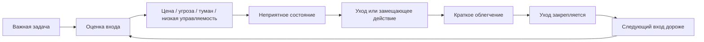
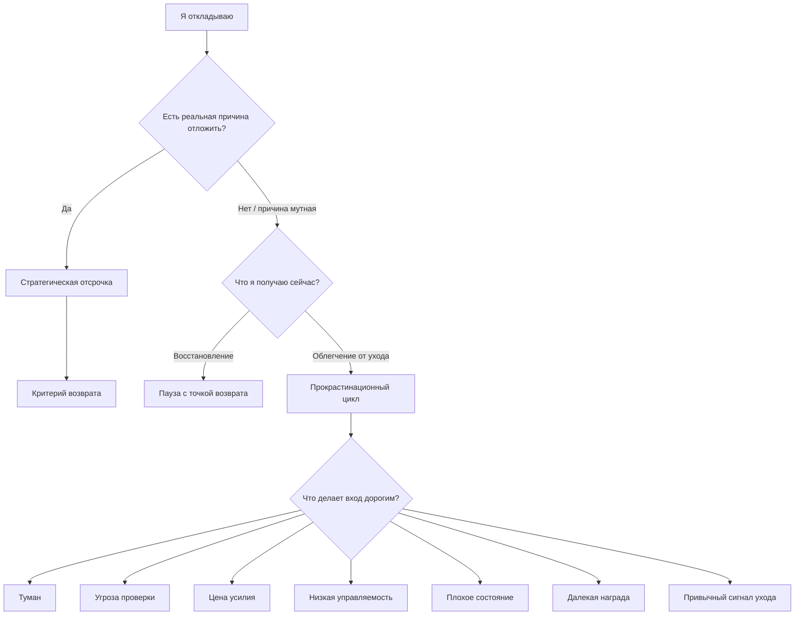
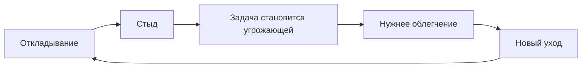

# Глава 18. Прокрастинация как конфликт систем

## После сна и восстановления

Предыдущая глава провела границу между восстановлением и избеганием.

Внешне они могут быть похожи:

```text
человек не сидит над задачей
```

Но системно это разные процессы.

Восстановление улучшает следующий вход. После него у человека больше внимания, ясности, терпимости к трудному месту, доступа к рабочей памяти и готовности снова встретиться с задачей.

Прокрастинация часто делает обратное. Она снижает неприятное состояние сейчас, но следующий вход становится дороже: меньше времени, больше тумана, выше ставка, сильнее стыд, хуже контекст, крепче привычка уходить.

Поэтому разговор о прокрастинации нельзя строить как список приемов против лени.

Нам нужна более точная задача:

```text
понять, почему система выбирает отсрочку,
если задача действительно важна
```

Прокрастинация интересна именно этим. Человек часто откладывает не случайные мелочи, а важные, смысловые и потенциально полезные дела: учебу, тяжелый разговор, письмо, медицинскую запись, сложный баг, раздел книги, финансовый разбор, решение по проекту.

Если задача важная, простая бытовая модель ломается.

```text
важно -> значит должен хотеть -> значит должен делать
```

В реальности бывает иначе:

```text
важно -> высока ставка -> дороже вход -> сильнее угроза -> легче уйти
```

Прокрастинация - это не отсутствие мотивации вообще. Часто это конфликт мотивационных, когнитивных, телесных и средовых систем.

## Что такое прокрастинация

Не всякое откладывание является прокрастинацией.

Иногда откладывание разумно.

Не хватает данных.

Нужно дождаться ответа.

Система устала и действительно требует восстановления.

Задача перестала быть актуальной.

Приоритет изменился.

Контекст еще не созрел.

Есть более важная работа.

Если каждую задержку называть прокрастинацией, понятие становится бесполезным и начинает служить только самоупреку.

Здесь используется рабочее определение:

```text
прокрастинация - это отсрочка важного или ожидаемо нужного действия,
при которой человек получает краткое облегчение сейчас,
но повышает будущую цену входа, результата или состояния
```

Это определение держит три признака.

Первый признак - действие важно или ожидаемо нужно. Не обязательно приятно, не обязательно вдохновляет, но имеет значение.

Второй признак - отсрочка приносит краткое облегчение. Человек уходит от неприятного состояния: тревоги, тумана, скуки, риска ошибки, неопределенности, перегруза, стыда, бессилия.

Третий признак - будущая цена растет. Задача не становится яснее, доступнее или безопаснее. Она становится тяжелее.

Именно третий признак отличает прокрастинацию от восстановительной паузы.

## Центральный цикл

Соберем основную схему.

Вопрос схемы:

```text
как важная задача превращается не в действие,
а в краткое облегчение, которое делает следующий вход дороже?
```



В этой схеме важно каждое звено.

Граница схемы: она не говорит, что человек ленив или безволен. Она показывает петлю обучения, где уход подкрепляется облегчением, а задача возвращается с большей ценой входа.

Прокрастинация начинается не с пустоты. Обычно перед ней есть задача, цель, ожидание или обязательство.

Затем система оценивает вход:

- насколько понятно, с чего начать;
- сколько усилия потребуется;
- что будет, если я ошибусь;
- смогу ли я повлиять на исход;
- какой результат виден близко;
- в каком состоянии я сейчас;
- есть ли рядом более легкое действие.

Если оценка входа неблагоприятная, появляется неприятное состояние. Это может быть явная тревога, но часто оно выглядит мягче:

- мутность;
- сопротивление;
- тяжесть;
- сонливость;
- раздражение;
- скука;
- внезапная "необходимость" заняться чем-то другим;
- желание еще чуть-чуть подготовиться;
- ощущение, что сейчас не тот момент.

Затем появляется уход или замещающее действие.

Уход не всегда выглядит как безделье. Человек может быть очень занят:

- отвечает на сообщения;
- проверяет почту;
- наводит порядок;
- обновляет инструменты;
- читает еще один источник;
- шлифует план;
- делает легкие задачи;
- открывает несколько вкладок;
- ищет "идеальный" способ начать.

Ключевой вопрос не в том, занято ли тело.

Ключевой вопрос:

```text
это действие приближает меня к проверяемому контакту с главной задачей
или уводит от неприятного места?
```

Если уводит, возникает краткое облегчение.

Именно облегчение делает прокрастинацию устойчивой. Система получает быстрый опыт:

```text
я ушел - стало легче
```

Даже если рационально человек понимает, что потом будет хуже, ближайшее облегчение уже сработало как подкрепление.

## Почему человек откладывает важное

Самое неприятное в прокрастинации - она часто нападает на то, что человеку не безразлично.

Если дело совсем не нужно, его можно спокойно отменить.

Если задача не имеет ценности, ее можно пересмотреть.

Но прокрастинация часто появляется там, где есть ценность и угроза одновременно.

Например:

| Задача | Ценность | Угроза |
| --- | --- | --- |
| Написать главу | Сделать важный проект реальным. | Увидеть, что мысль слабее, чем казалась. |
| Разобрать сложный баг | Вернуть управляемость системе. | Обнаружить, что гипотеза неверна. |
| Начать обучение | Получить новую компетентность. | Столкнуться с собственной неумелостью. |
| Поговорить с человеком | Восстановить контакт. | Получить отказ, конфликт или стыд. |
| Проверить финансы | Вернуть ясность. | Увидеть неприятную правду. |
| Пойти к врачу | Позаботиться о здоровье. | Услышать диагноз или необходимость изменений. |

Чем важнее область, тем больше может быть ставка. Чем больше ставка, тем сильнее не только притяжение, но и защита.

Поэтому фраза "если бы тебе было важно, ты бы сделал" часто неверна.

Точнее так:

```text
если тебе важно,
задача может стать настолько значимой,
что вход начнет восприниматься как угроза
```

Прокрастинация в таком случае не означает "мне все равно". Иногда она означает "мне слишком не все равно, и я не вижу безопасного входа".

## Краткосрочная регуляция состояния

Одна из сильных идей современной литературы о прокрастинации: человек часто откладывает задачу не ради удовольствия как такового, а ради быстрого изменения состояния.

Не начать неприятную задачу - значит прямо сейчас не чувствовать ее цену.

Не открыть письмо - значит прямо сейчас не встретиться с возможной оценкой.

Не писать черновик - значит прямо сейчас не увидеть слабость формулировки.

Не проверять гипотезу - значит прямо сейчас сохранить ощущение, что она может быть верной.

Не идти в сложную задачу - значит прямо сейчас остаться в зоне легкой управляемости.

Прокрастинация продает не отдых.

Она продает облегчение.

Это важное различение.

Отдых возвращает ресурс.

Облегчение снижает напряжение.

Иногда они совпадают. Но в прокрастинации часто происходит другое: напряжение снижается потому, что человек отодвинул встречу с задачей. Сама задача не стала проще. Контекст не стал яснее. Риск не обработан. Следующий вход не подготовлен.

Сравним:

| Ситуация | Что происходит сейчас | Что будет со следующим входом |
| --- | --- | --- |
| Восстановительная пауза | Я устал, фиксирую место остановки и восстанавливаю состояние. | Вход станет доступнее. |
| Стратегическая отсрочка | Не хватает данных, фиксирую критерий возврата. | Вход станет яснее после события. |
| Прокрастинация | Мне неприятно входить, я ухожу в другое. | Вход станет дороже. |

Снаружи это может выглядеть одинаково: человек не делает задачу.

Изнутри это разные контуры.

## Будущий я и временная ловушка

У прокрастинации есть временная асимметрия.

Текущий я получает облегчение.

Будущий я получает усложненную задачу.

Сегодняшний человек говорит:

```text
я начну завтра,
когда будет больше сил,
ясности и настроения
```

Но завтра он часто получает не больше сил и ясности, а более дорогой вход:

- дедлайн ближе;
- контекст слабее;
- стыда больше;
- выбора меньше;
- вероятность ошибки выше;
- задача стала еще неприятнее;
- желание уйти запускается быстрее.

Это не значит, что любой перенос плох. Иногда завтра действительно лучше сегодня.

Но у прокрастинации есть характерный след:

```text
перенос обещал облегчить задачу,
а фактически сделал ее тяжелее
```

Поэтому при диагностике полезно спрашивать не "имею ли я право отложить", а:

```text
что именно станет лучше к моменту следующего входа?
```

Если ответ конкретен - придут данные, восстановится сон, появится окно времени, будет обратная связь, снизится внешний шум - это может быть стратегическая отсрочка.

Если ответ туманный - "ну потом как-нибудь будет легче" - скорее всего, система просто покупает ближайшее облегчение.

## Цена входа

Во многих случаях человек прокрастинирует не всю задачу, а вход.

Сама работа после старта может оказаться терпимой. Но момент перед началом выглядит слишком дорогим.

В локальных заметках это названо ловушкой старта: пока задача еще не начата, она переживается как большой, тяжелый и неприятный блок.

```text
написать статью
разобраться с багом
подготовиться к собеседованию
навести порядок в финансах
поговорить с человеком
```

Каждая такая формулировка слишком велика для входа.

Она не говорит, что именно нужно сделать телом, глазами, руками и вниманием в первые минуты. Она только показывает массу будущего дела.

Мозг получает не инструкцию, а угрозу.

С инженерной точки зрения вход должен быть не правильным, а исполнимым.

Плохой вход:

```text
сесть и нормально поработать над проектом
```

Лучший вход:

```text
открыть файл,
найти место последнего изменения,
выписать одну неизвестную переменную
```

Плохой вход:

```text
написать сильную главу
```

Лучший вход:

```text
за 12 минут написать плохой первый абзац
и список вопросов, которые глава должна закрыть
```

Плохой вход:

```text
разобраться в финансах
```

Лучший вход:

```text
открыть таблицу и выписать три последних обязательных платежа
```

Малый шаг не нужен для того, чтобы обмануть себя.

Он нужен для того, чтобы заменить абстрактную угрозу конкретным контактом с реальностью задачи.

## Прокрастинация и управляемость

В главе 10 мы говорили:

```text
управляемость - это ожидаемая связь между действием и исходом
```

Если человек не видит, как его действие изменит ситуацию, усилие начинает казаться бессмысленным. Тогда прокрастинация может быть не уходом от работы как таковой, а уходом от беспомощного усилия.

Примеры:

- "Я могу написать текст, но его все равно никто не примет".
- "Я могу начать разбор, но система такая сложная, что я ничего не пойму".
- "Я могу готовиться, но на собеседовании все равно спросят то, чего я не знаю".
- "Я могу поговорить, но человек все равно не услышит".
- "Я могу заняться здоровьем, но уже слишком поздно".

В таких ситуациях совет "просто начни" попадает мимо. Проблема не только в старте. Проблема в ожидаемой бесполезности действия.

Инженерный вопрос:

```text
какой маленький рычаг реально может изменить состояние задачи?
```

Не "решить все".

Именно изменить состояние.

Для сложного бага рычагом может быть не исправление, а один проверенный факт.

Для текста - не готовая глава, а рабочая структура.

Для разговора - не идеальное примирение, а честно заданный вопрос.

Для обучения - не владение темой, а первое восстановление без источника.

Прокрастинация снижается не только тогда, когда задача становится легче, но и тогда, когда действие снова начинает казаться причинным.

## Прокрастинация и цена усилия

В главе 11 мы развели несколько видов цены усилия:

- физическую;
- когнитивную;
- социально-эмоциональную;
- идентичностную;
- восстановительную.

Прокрастинация часто начинается там, где цена входа не названа.

Человек говорит:

```text
я не могу заставить себя
```

Но внутри может быть разная цена.

| Цена | Как проявляется в прокрастинации | Что нужно менять |
| --- | --- | --- |
| Когнитивная | Слишком много переменных, задача не удерживается. | Вынести контекст наружу, ограничить первый вопрос. |
| Эмоциональная | Страшно ошибиться, получить оценку, увидеть неприятное. | Сделать черновой и обратимый вход. |
| Социальная | Нужен контакт с человеком, есть риск конфликта. | Подготовить безопасную формулировку и цель разговора. |
| Идентичностная | Результат угрожает образу себя. | Отделить проверку навыка от оценки личности. |
| Восстановительная | После действия будет провал состояния. | Снизить объем, добавить восстановление, проверить нагрузку. |
| Физическая | Не держится бодрствование, тело перегружено. | Сон, еда, движение, медицинские границы при необходимости. |

Без такой диагностики человек пытается лечить все одним приемом.

Если проблема в тумане, таймер может помочь только частично.

Если проблема в угрозе, жесткий дедлайн может усилить уход.

Если проблема в перегрузе, новый план может стать еще одной нагрузкой.

Если проблема в низкой управляемости, мотивационные фразы вызывают раздражение.

Если проблема в привычном сигнале ухода, одного понимания недостаточно: среда снова поведет по старой дороге.

## Туман как двигатель отсрочки

Туман - один из самых частых источников прокрастинации.

Туманная задача не дает системе хорошего первого шага. Она не дробится сама. Она висит как облако.

Примеры туманных формулировок:

```text
разобраться с архитектурой
подготовить стратегию
улучшить здоровье
заняться английским
сделать нормальный режим
написать учебник
```

В таких формулировках нет входного действия. Есть только область.

Туман создает две проблемы.

Первая - рабочая память не знает, что удерживать. Слишком много возможных веток.

Вторая - система не может заранее оценить цену действия. Неизвестность превращает задачу в потенциально бесконечную.

Инженерный ход против тумана:

```text
сначала не делать задачу,
а сделать карту входа
```

Минимальная карта:

| Поле | Вопрос |
| --- | --- |
| Факт | Что уже известно? |
| Туман | Что непонятно? |
| Гипотеза | Что я предполагаю? |
| Проверка | Какой один факт может это подтвердить или сломать? |
| Следующий шаг | Что я сделаю в первые 10 минут? |

Это не бюрократия. Это снижение цены входа.

## Угроза проверки

Прокрастинация часто защищает от проверки реальности.

Пока человек не начал, он еще может сохранять приятную неопределенность:

```text
возможно, я хорошо напишу
возможно, я быстро разберусь
возможно, я в форме
возможно, проблема простая
возможно, отношения можно легко починить
```

Первый контакт с задачей может разрушить эту неопределенность.

Черновик окажется слабым.

Гипотеза окажется неверной.

Код окажется запутаннее.

Тело окажется не в той форме.

Собеседник окажется обиженным.

Именно поэтому подготовка иногда становится бесконечной. Подготовка дает ощущение приближения, но откладывает момент проверки.

Критерий:

```text
подготовка полезна,
если после нее я быстрее встречаюсь с проверяемым фактом
```

Если подготовка снова и снова отодвигает проверку, она стала частью прокрастинации.

Примеры:

| Полезная подготовка | Избегание проверки |
| --- | --- |
| Выписать три вопроса перед разговором. | Неделю читать о коммуникации и не назначать разговор. |
| Собрать минимальный набор логов. | Бесконечно настраивать окружение, не проверяя гипотезу. |
| Сделать план первого раздела. | Шлифовать оглавление, не написав ни одного абзаца. |
| Посмотреть один пример задачи. | Смотреть десять курсов до первой самостоятельной попытки. |

Проверка часто неприятна, но без нее нет обучения.

Прокрастинация пытается сохранить самоощущение, не подвергая его контакту с реальностью.

Преодоление начинается там, где контакт становится достаточно маленьким, чтобы его выдержать.

## Легкие награды и близкая обратная связь

Будущая награда сложной задачи обычно отложена.

Результат будет потом.

Понимание придет потом.

Деньги, признание, здоровье, компетентность, завершение проекта - все это далеко.

А рядом лежат близкие награды:

- новое сообщение;
- короткая задача;
- видео;
- покупка;
- сладкая еда;
- еще одна вкладка;
- маленькое исправление;
- приятное планирование;
- проверка статистики;
- ощущение занятости.

Близкая награда не обязательно "плохая". Проблема в том, что она может выигрывать у далекой ценности только потому, что ближе.

Система выбирает не философски лучшее, а доступное сейчас.

Инженерный вывод:

```text
у большой задачи должна появиться близкая обратная связь
```

Не "когда-нибудь я напишу книгу".

А:

```text
через 20 минут у меня будет черновая схема раздела
```

Не "когда-нибудь я стану сильнее в алгоритмах".

А:

```text
через 15 минут я узнаю, какой шаг в этой задаче у меня рвется
```

Не "когда-нибудь мы исправим процесс".

А:

```text
после встречи у нас будет один явный критерий готовности
```

Близкая обратная связь нужна не для примитивного поощрения. Она делает действие видимым и возвращает управляемость.

## Прокрастинация при перегрузе

Иногда человек откладывает не потому, что вход слишком страшный, а потому что система уже перегружена.

В таком состоянии даже маленький шаг может не держаться:

- внимание распадается;
- чтение идет без понимания;
- ошибки множатся;
- раздражение растет;
- тело просит выключиться;
- любое требование воспринимается как нападение;
- простая задача занимает непропорционально много времени.

Здесь важно не ошибиться.

Если человек в перегрузе, попытка лечить прокрастинацию давлением может ухудшить состояние.

Вопрос:

```text
после маленького входа сопротивление падает
или система продолжает распадаться?
```

Если сопротивление падает, главной проблемой была цена старта.

Если не падает, возможно, проблема в состоянии: недосып, накопленная усталость, перегруз параллельной незавершенной работой, длительный стресс, болезнь, эмоциональное истощение.

В этом случае рабочий ход не "еще сильнее собраться", а:

- снизить сложность входа;
- ограничить параллельную незавершенную работу;
- сделать восстановительную паузу с точкой возврата;
- вернуть сон;
- убрать лишние требования;
- запросить поддержку;
- проверить границы выгорания или клинического состояния, если это длится устойчиво.

Прокрастинация при перегрузе часто похожа на избегание, но корень может быть в том, что система реально не выдерживает текущую цену.

## Прокрастинация при недогрузе и скуке

Есть и другой край.

Задача может быть не страшной, а мертвой.

Слишком легкой.

Слишком бессмысленной.

Слишком оторванной от результата.

Слишком повторяющейся.

Без обратной связи.

Без права на решение.

Тогда прокрастинация может быть способом уйти не от угрозы, а от пустоты.

Человек не хочет входить в задачу, потому что она не дает ощущения действия:

```text
я делаю, но ничего не меняется
```

Позже учебник отдельно разведет профессиональную скуку и нижний перекос нагрузки. Здесь достаточно зафиксировать: не всякая прокрастинация родом из тревоги. Иногда вход дорог, потому что задача слишком бедна смыслом, управляемостью и обратной связью.

Инженерный вопрос:

```text
как вернуть задаче форму действия?
```

Варианты:

- связать задачу с реальным исходом;
- сделать критерий результата видимым;
- добавить ограничение или полезную трудность;
- объединить скучную задачу с более крупным контекстом;
- автоматизировать или убрать задачу, если она действительно не нужна;
- договориться о новом уровне ответственности.

Давить себя за скуку бессмысленно. Нужно понять, пустота это или избегание трудного.

## Привычный уход

Если прокрастинационный цикл повторялся много раз, уход может стать привычным.

Тогда система уже не каждый раз заново решает:

```text
входить или не входить?
```

Она распознает сигнал и запускает старый ответ.

Сигнал может быть разным:

- открытая сложная задача;
- пустой лист;
- уведомление;
- непонятное письмо;
- слово "надо";
- длинный список дел;
- ощущение ошибки;
- чужой запрос;
- конец рабочего дня;
- утро после плохого сна.

Привычный ответ:

- открыть чат;
- проверить новости;
- почистить почту;
- сделать легкую задачу;
- перечитать план;
- отложить до "нормального времени";
- начать спорить с собой;
- искать еще один источник.

В таком случае одного понимания мало. Человек может прекрасно понимать свой цикл и все равно попадать в него.

Привычка живет в связке:

```text
сигнал -> действие -> краткий эффект
```

Поэтому нужно проектировать не только намерение, но и момент срабатывания.

## Планирование по схеме "если - то"

Намерение реализации, или планирование по схеме "если - то", переводит общее намерение в связку ситуации и действия.

Не так:

```text
завтра не буду прокрастинировать
```

А так:

```text
если я открыл задачу и хочу уйти в чат,
то я сначала пишу одну строку:
"что сейчас туманно или страшно?"
```

Не так:

```text
буду работать над книгой
```

А так:

```text
если после завтрака я сел за компьютер,
то открываю файл главы и 10 минут пишу плохой черновик без редактуры
```

Не так:

```text
перестану откладывать спорт
```

А так:

```text
если я закрыл рабочий ноутбук,
то сразу кладу форму на кровать и выхожу на 10 минут
```

Смысл планирования по схеме "если - то" не в магии формулы.

Смысл в том, что решение частично принимается заранее. В момент угрозы человеку уже не нужно придумывать весь путь. Ему нужно распознать ситуацию и выполнить заранее выбранный маленький ответ.

Но есть ограничения.

План "если - то" плохо работает, если:

- ситуация неузнаваема;
- действие слишком большое;
- среда постоянно перебивает;
- состояние в сильном перегрузе;
- задача не имеет управляемого шага;
- человек использует план как очередную имитацию контроля;
- последствия задачи реально опасны и требуют не техники, а изменения условий.

Поэтому планирование по схеме "если - то" - не лечение прокрастинации, а один инженерный переключатель внутри более широкой модели.

## Диагностика: что делает вход дорогим

Перед выбором техники нужно понять источник дорогого входа.

Вопрос схемы:

```text
это разумная отсрочка, восстановление
или прокрастинационный цикл с дорогим входом?
```



Практическая таблица:

| Причина | Внутренний сигнал | Инженерный ход |
| --- | --- | --- |
| Туман | "Не понимаю, с чего начать". | Карта контекста: факты, неизвестные, первая проверка. |
| Угроза проверки | "Сейчас станет ясно, что я не справляюсь". | Черновой контакт, обратимость, отделение результата от самооценки. |
| Цена усилия | "Слишком тяжело держать это". | Контейнер 5-15 минут, внешний след, один наблюдаемый результат. |
| Низкая управляемость | "Мои действия ничего не изменят". | Найти рычаг, критерий продвижения, внешнюю поддержку или границу ответственности. |
| Состояние | "Даже малый шаг распадается". | Восстановление, сон, снижение параллельной незавершенной работы, пауза с точкой возврата. |
| Далекая награда | "Польза потом, облегчение сейчас". | Близкая обратная связь, промежуточная контрольная точка. |
| Привычный уход | "Я уже открыл чат, не заметив". | Изменить сигнал, убрать легкий путь, задать ответ по схеме "если - то". |

Эта таблица важнее любой отдельной техники.

Без диагностики техника легко становится новым способом избегать.

Человек может делать таблицы вместо действия.

Ставить таймеры вместо входа.

Читать про прокрастинацию вместо проверки.

Настраивать систему задач вместо одного контакта с реальностью.

## Первый наблюдаемый шаг

Первый шаг лучше делать не красивым, а наблюдаемым.

Наблюдаемый шаг отвечает на вопрос:

```text
что будет видно через несколько минут,
если я действительно вошел в задачу?
```

Не чувство.

Не обещание.

Не настрой.

А след.

Примеры:

| Туманная задача | Первый наблюдаемый шаг |
| --- | --- |
| Написать главу | Написан плохой абзац с главным вопросом главы. |
| Разобрать баг | Выписаны три факта и одна сломанная гипотеза. |
| Учить тему | Сделано восстановление пяти пунктов без источника. |
| Подготовить разговор | Записаны цель разговора и один честный вопрос. |
| Навести порядок в делах | Выписаны все открытые петли без сортировки. |
| Начать спорт | Надета форма и сделана 10-минутная прогулка. |
| Проверить финансы | Открыта таблица и внесены три последних платежа. |

Хороший первый шаг имеет свойства:

- короткий;
- конкретный;
- связан с задачей, а не с обходом;
- не требует финального качества;
- дает след;
- делает следующий шаг яснее;
- снижает цену повторного входа.

Если шаг не делает следующий шаг яснее, он может быть маленьким, но бесполезным.

Например, "открыть ноутбук" иногда полезно как физический старт. Но если после открытия ноутбука задача остается такой же туманной, нужен следующий уровень: открыть конкретный файл, найти место разрыва, выписать вопрос.

## Стыд плохо лечит прокрастинацию

Стыд кажется естественным лекарством:

```text
если я достаточно разозлюсь на себя,
то соберусь
```

Иногда краткий всплеск стыда действительно может толкнуть человека в действие. Но как устойчивый метод он плох.

Почему?

Потому что стыд добавляет угрозу к уже дорогому входу.

Если человек откладывал задачу из-за угрозы проверки, стыд делает проверку еще опаснее.

Если он откладывал из-за низкой управляемости, стыд подтверждает: "со мной что-то не так".

Если он был в перегрузе, стыд добавляет эмоциональную цену.

Если он уходил в краткое облегчение, стыд создает новый неприятный фон, от которого снова хочется уйти.

Получается цикл:



Ответственность отличается от стыда.

Стыд говорит:

```text
со мной что-то не так
```

Ответственность спрашивает:

```text
что я могу изменить в следующем входе?
```

Стыд сужает действие.

Ответственность возвращает рычаг.

## Рабочий протокол возвращения к задаче

Теперь можно собрать практический протокол.

Он нужен не для идеального самоконтроля. Он нужен для момента, когда человек уже заметил откладывание и хочет вернуться к задаче без самонаказания.

### Шаг 1. Назвать отсрочку без морали

```text
я откладываю вход в задачу
```

Не:

```text
я опять слабый
```

Полезная формулировка описывает процесс, а не личность.

### Шаг 2. Проверить: это отдых, стратегическая отсрочка или прокрастинация?

Вопрос:

```text
что будет со следующим входом после этой паузы?
```

Если он станет яснее, доступнее или восстановленнее - возможно, это не прокрастинация.

Если он станет дороже, туманнее или страшнее - это прокрастинационный цикл.

### Шаг 3. Найти источник дорогого входа

Выбрать одно главное:

- туман;
- угроза;
- цена;
- низкая управляемость;
- плохое состояние;
- далекая награда;
- привычный уход.

Не нужно искать все сразу. Для первого входа достаточно одного.

### Шаг 4. Сделать первый наблюдаемый шаг

Шаг лучше делать коротким, примерно на 5-15 минут, и оставлять след:

```text
строка
список
факт
гипотеза
вопрос
черновик
скрин
команда
сообщение
```

### Шаг 5. Остановиться не на истощении, а на точке возврата

После короткого входа нужно оставить следующий вход:

```text
что теперь известно?
что остается туманным?
какой следующий физический шаг?
что может меня увести?
если это случится, что я сделаю?
```

### Шаг 6. Изменить среду

Если рядом есть легкая награда, система снова выберет ее.

Среду лучше настроить так, чтобы она помогала входу:

- закрыть чат на первые 10 минут;
- открыть нужный файл заранее;
- оставить заметку с первым вопросом;
- убрать лишние вкладки;
- поставить таймер не на продуктивность, а на безопасный контейнер;
- сделать заметным следующий шаг;
- договориться о внешней контрольной точке.

### Шаг 7. Если шаг не держится, проверить состояние

Если даже 5-10 минут не держатся, это не повод усиливать стыд.

Это повод спросить:

```text
это прокрастинация старта
или система уже не держит нагрузку?
```

Иногда правильный следующий шаг - не еще один прием саморегуляции, а восстановление, сон, уменьшение параллельной незавершенной работы или разговор о нагрузке.

## Разбор примера: сложная глава учебника

Представим задачу:

```text
написать главу о прокрастинации
```

Задача важная. В ней много источников, много нюансов, риск скатиться в банальные советы, риск не раскрыть тему полно.

Прокрастинационный вход может выглядеть очень солидно:

- перечитать еще один обзор;
- проверить еще один DOI;
- шлифовать оглавление;
- открыть старые заметки;
- спорить с названием;
- писать план практик;
- сравнивать с предыдущими главами;
- искать более точную центральную схему.

Все это может быть полезным.

Но только если оно ведет к первому фрагменту текста.

Диагностика:

| Вопрос | Ответ |
| --- | --- |
| Что ценно? | Глава должна стать мостом от восстановления к преодолению. |
| Что угрожает? | Можно написать поверхностно, морализаторски или слишком упрощенно. |
| Что туманно? | Где граница между прокрастинацией, отдыхом, перегрузом и стратегической отсрочкой. |
| Какая цена входа? | Нужно удержать много уже введенных понятий. |
| Что будет легкой наградой? | Еще читать источники и чувствовать подготовку. |
| Первый наблюдаемый шаг | Написать черновой раздел о переходе от восстановления к прокрастинации. |

После такого шага задача уже не та же самая. Она получила вход. Дальше можно улучшать.

## Разбор примера: разработчик и сложный баг

Разработчик видит задачу:

```text
разобраться, почему сервис иногда теряет событие
```

Важность высокая. Туман высокий. Риск ошибки высокий. Прямой награды мало. Вход дорогой.

Прокрастинация может выглядеть так:

- почитать соседние MR;
- обновить локальное окружение без проверки гипотезы;
- ответить на мелкие сообщения;
- открыть мониторинг и закрыть;
- еще раз перечитать описание задачи;
- ждать "окна поглубже".

Рабочий вход:

```text
за 15 минут выписать:
1. где событие точно было;
2. где оно точно исчезло;
3. какой лог может сузить границу;
4. какая гипотеза сейчас самая слабая
```

Это не решает баг.

Но превращает "разобраться" в первый рычаг.

## Разбор примера: учеба и иллюзия подготовки

Человек хочет освоить новую тему.

Он смотрит курсы, сохраняет статьи, выбирает книги, делает красивые заметки. Но не решает задач и не делает восстановление без источника.

Внешне он учится.

Системно он может избегать проверки:

```text
что я могу восстановить без источника?
что я могу применить сам?
какую ошибку я сейчас делаю?
```

Рабочий вход:

```text
после 20 минут изучения закрыть источник
и написать пять пунктов своими словами
```

Если пункты не собираются, это не провал. Это точный сигнал, где начинается обучение.

Прокрастинация здесь может прятаться не в безделье, а в бесконечном потреблении материала без извлечения.

## Когда самостоятельные техники недостаточны

Эта глава описывает прокрастинацию как нормальный режим саморегуляции, который можно частично менять через среду, вход, обратную связь, управляемость и восстановление.

Но есть границы.

Если откладывание связано с тяжелым устойчивым снижением настроения, выраженной тревогой, паникой, СДВГ, зависимым поведением, хроническим недосыпом, выгоранием, соматическими симптомами или лекарственными вопросами, учебник не должен изображать это как обычную проблему дисциплины.

В таких случаях практики входа могут помогать как поддержка, но не заменяют профессиональную диагностику и помощь.

Когнитивное инженерство не должно становиться красивым способом обвинить человека в том, что его система работает в условиях, которые она уже не выдерживает.

## Почему нельзя писать эту главу как набор приемов

Есть популярный жанр:

```text
10 способов победить прокрастинацию
```

Разбейте задачу.

Поставьте таймер.

Уберите телефон.

Наградите себя.

Начните с малого.

Все это иногда полезно. Но без механизма такие советы быстро превращаются в шум.

Человек пробует таймер, но проблема была в низкой управляемости.

Пробует награду, но проблема была в угрозе проверки.

Пробует план, но план стал новым избеганием.

Пробует маленький шаг, но система была в перегрузе.

Пробует публичное обещание, но получает больше стыда и угрозы.

Поэтому глава должна дать не список приемов, а карту выбора:

```text
что делает вход дорогим
и какое вмешательство меняет именно этот параметр
```

## Источниковая опора

Проверенный пакет для этой главы: [[../Источники/2026-05-24 Пакет источников для главы 18]].

Ключевые источники в авторско-годовой форме:

- Sirois & Pychyl (2013), Sirois (2023): прокрастинация как приоритет краткосрочной регуляции неприятного состояния и саморегуляция, зависящая от стрессового контекста.
- Steel (2007), Steel & Konig (2006), Ainslie (1975): сбой саморегуляции, теория временной мотивации, импульсивность и гиперболическое дисконтирование.
- Tice & Baumeister (1997): краткое облегчение отсрочки может переходить в будущие издержки для стресса, здоровья и результативности.
- Zhang, Liu & Feng (2019): когнитивные механизмы и нейронные субстраты прокрастинации как конфликта между "сделать сейчас" и "сделать потом".
- Krypotos et al. (2015), Wood & Neal (2007), Wood & Runger (2016), Smeets et al. (2023), Nebe et al. (2024): обучение избеганию, подкрепление облегчением и привычки по сигналу как механизмы повторяющегося ухода, с границами для утверждений о стресс-индуцированных привычках и измерении человеческих привычек.
- Gollwitzer (1999), Gollwitzer & Sheeran (2006), Gustavson & Miyake (2017): намерения реализации как полезное планирование по схеме "если - то", с границей: простые цели и намерения не решают прокрастинацию автоматически.
- Zacks & Hen (2018), van Eerde & Klingsieck (2018), Rozental et al. (2018): данные по вмешательствам; практики должны работать с саморегуляцией, ситуацией и условиями входа, не только с уговариванием.
- Внутренние авторские материалы по произвольному вниманию, прокрастинации, нейротренировке, умению учиться, приближению и избеганию, управляемости, цене усилия, усталости, сну и восстановлению.

Доказательная роль блока: `strong` для краткосрочной регуляции настроения, временного дисконтирования, рамки саморегуляции и различения восстановительной паузы и дорогостоящей отсрочки; `context-dependent` для намерений реализации, вмешательств в привычки, переноса линии стресс/привычка и данных академических/психологических вмешательств; `mixed` для универсальности техник против прокрастинации и утверждений о стресс-индуцированных привычках; `methodological-boundary` для лабораторного измерения человеческих привычек; `clinical-boundary` для депрессии, СДВГ, тревожных расстройств, хронического истощения, выгорания и медицинских/психотерапевтических вопросов. Глава не называет прокрастинацию ленью и не обещает, что планирование по схеме "если - то" или маленький шаг решит все случаи.

Полные библиографические записи и DOI сохранены в пакете главы. В текущей редакции глава оставляет короткий авторско-годовой блок как читательский ориентир.

## Короткое резюме

1. Прокрастинация - не всякая задержка, а отсрочка важного действия с кратким облегчением и будущей ценой.
2. Восстановление улучшает следующий вход; прокрастинация часто ухудшает его.
3. Важная задача может быть одновременно ценной и угрожающей.
4. Часто человек избегает не результата, а неприятного состояния перед входом.
5. Краткое облегчение закрепляет уход.
6. Будущий я получает более дорогую задачу: меньше времени, больше стыда, слабее контекст.
7. Прокрастинация часто начинается с цены входа, а не с отсутствия желания.
8. Туманная формулировка задачи сама повышает вероятность отсрочки.
9. Подготовка полезна только тогда, когда приближает проверяемый контакт с задачей.
10. Низкая управляемость делает усилие бессмысленным и поддерживает уход.
11. Разные виды цены усилия требуют разных вмешательств.
12. Перегруз и недогруз могут выглядеть как прокрастинация, но требуют разных решений.
13. Привычный уход нужно менять через сигнал, среду и переключатели по схеме "если - то".
14. Стыд часто усиливает прокрастинацию, потому что делает вход еще более угрожающим.
15. Первый наблюдаемый шаг нужен для контакта с реальностью задачи, а не для самообмана.
16. Хорошая практика начинается с диагностики: что именно делает вход дорогим сейчас?

## Вопросы для самопроверки

1. Чем прокрастинация отличается от стратегической отсрочки?
2. Почему восстановительная пауза и прокрастинация могут выглядеть одинаково снаружи?
3. Почему важная задача может вызывать избегание?
4. Что означает краткосрочная регуляция настроения в контексте прокрастинации?
5. Как краткое облегчение закрепляет уход?
6. Почему будущий вход после прокрастинации часто становится дороже?
7. Что такое цена входа?
8. Почему туманная задача запускает отсрочку?
9. Как отличить подготовку от избегания проверки?
10. Как низкая управляемость поддерживает прокрастинацию?
11. Какие виды цены усилия могут скрываться за фразой "не могу заставить себя"?
12. Когда прокрастинация может быть сигналом перегруза?
13. Как скука и недогруз могут приводить к откладыванию?
14. Почему планирование по схеме "если - то" не является универсальным решением?
15. Чем ответственность отличается от стыда?
16. Какие свойства должен иметь первый наблюдаемый шаг?

## Мини-практика

Выберите одну задачу, которую вы откладываете.

Заполните карту входа.

| Вопрос | Ответ |
| --- | --- |
| Какую задачу я откладываю? |  |
| Почему она важна? |  |
| Что именно неприятно во входе? |  |
| Что я делаю вместо входа? |  |
| Какое краткое облегчение я получаю? |  |
| Что станет дороже, если я отложу еще раз? |  |
| Это больше похоже на отдых, стратегическую отсрочку или прокрастинацию? |  |
| Главная причина дорогого входа: туман, угроза, цена, управляемость, состояние, далекая награда или привычный уход? |  |
| Какой первый наблюдаемый шаг займет 5-15 минут? |  |
| Какой след останется после этого шага? |  |
| Какой переключатель по схеме "если - то" я задам? |  |
| Что я оставлю как точку возврата? |  |

Цель мини-практики - не победить прокрастинацию навсегда. Цель - увидеть конкретный цикл и изменить следующий вход.

## Статус

`ready-for-review`

Источниковый пакет: [[../Источники/2026-05-24 Пакет источников для главы 18]].

Связки проверены: [[../Проверки/2026-05-24 Связка глав 17-18]] и [[../Проверки/2026-05-24 Связка глав 18-19]].

Ревизия блока: [[../Проверки/2026-05-25 Ревизия блока 16-19]].

Следующая глава: [[19-Опыт-преодоления]].
