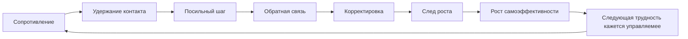

# Глава 19. Опыт преодоления

## После прокрастинации

Предыдущая глава разобрала прокрастинацию как цикл, который часто выглядит странно только снаружи.

Человек не делает важное не потому, что задача ничего не значит. Иногда как раз наоборот: задача слишком значима, слишком туманна, слишком оценочна или слишком плохо управляется. Вход в нее становится дорогим. Тогда система выбирает короткое облегчение:

```text
не входить сейчас
```

Проблема в том, что облегчение покупается за счет будущего входа. Задача не исчезает. Контекст распадается. Срок приближается. Стыд растет. Привычка уходить получает еще один удачный эпизод.

Теперь нам нужна противоположная петля.

Не "как заставить себя терпеть".

Не "как стать человеком без сопротивления".

А вот что:

```text
как сделать первый управляемый контакт с трудностью
и получить опыт, что в трудном можно действовать
```

Эта глава о преодолении. Но слово опасное. Его легко испортить.

Преодоление часто понимают как жесткость: стиснул зубы, вытерпел, подавил слабость, заставил себя. Такой язык плохо подходит для учебника по когнитивному инженерству. Он смешивает разные явления: усилие, стыд, перегруз, дисциплину, страх, привычку, восстановление, самонасилие и реальное обучение.

Нам нужно более точное определение.

Опыт преодоления - это не страдание и не героическая победа. Это повторяющаяся связка:

```text
сопротивление
-> удержание контакта
-> посильное действие
-> обратная связь
-> корректировка
-> след роста
```

Когда эта связка повторяется, будущая трудность начинает восприниматься иначе. Она все еще может быть неприятной. Но она перестает быть чистым сигналом к бегству.

Она становится ситуацией, в которой можно действовать.

## Что не является преодолением

Сначала уберем несколько ложных вариантов.

Преодоление - это не любое страдание. Человек может долго сидеть над задачей, злиться, стыдиться, уставать, но не получать нового способа действия. Если нет обратной связи и корректировки, трудность может закреплять беспомощность, а не способность.

Преодоление - это не любая занятость. Можно весь день делать полезные мелочи и ни разу не встретиться с настоящим трудным местом. Внешне человек активен. Внутренне он может обходить главную задачу.

Преодоление - это не моральная обязанность быть сильным. Иногда правильное действие - остановиться, восстановиться, попросить помощи, сменить условия, отказаться от задачи или признать, что текущая нагрузка разрушительна.

Преодоление - это не отказ от помощи. Наоборот, хорошая помощь часто нужна. Но она должна усиливать способность человека действовать, а не забирать действие до первой попытки.

Преодоление - это не гарантированная победа. Иногда человек делает все честно и не получает желаемый результат. Но даже достойная неудача может дать рост, если после нее остается понимание:

```text
что я сделал
что произошло
что теперь знаю
что можно изменить
```

Здесь преодоление означает другое:

```text
человек встречает сопротивление,
остается рядом с задачей,
делает посильный шаг,
получает сигнал о реальности,
меняет способ
и присваивает след роста
```

## Минимальная единица преодоления

Чтобы не говорить общими словами, разберем единицу преодоления по частям.

Вопрос схемы:

```text
какая минимальная петля превращает сопротивление
не в страдание и не в уход,
а в опыт управляемого действия?
```



Граница схемы: она работает только там, где шаг остается посильным, есть обратная связь и возможна корректировка. Если есть только давление без рычага, схема описывает уже не преодоление, а риск закрепить беспомощность.

Сопротивление - момент, где хочется уйти. Оно может выглядеть как тревога, скука, тяжесть, раздражение, сонливость, желание "еще подготовиться", стремление открыть готовое решение или попросить ИИ сразу написать за нас.

Удержание контакта - короткий промежуток, где человек не обязан чувствовать уверенность, но остается рядом с задачей. Это не спокойствие. Это не вдохновение. Это просто отказ исчезнуть сразу.

Посильное действие - наблюдаемое изменение. Не размышление "надо бы", а шаг: написать плохой первый абзац, выписать неизвестное, собрать минимальный пример, спросить точный вопрос, показать черновик, сделать один подход, проверить одну гипотезу.

Обратная связь - сигнал о том, что произошло. Текст оказался мутным. Тест упал. Гипотеза не подтвердилась. Наставник указал на слабое место. Тело стало спокойнее после движения. Важно, что обратная связь превращает трудность из тумана в информацию.

Корректировка - изменение способа. Если человек просто давит тем же способом, он может тренировать не преодоление, а застревание. Преодоление требует не только усилия, но и обучения.

След роста - присвоенный результат. Стало понятнее. Стало точнее. Стало менее страшно. Появился следующий шаг. Человек быстрее вернулся после ошибки. Нужна была меньшая подсказка. Получился первый внешний артефакт.

Без следа роста опыт быстро растворяется. Поэтому его нужно фиксировать:

```text
что изменилось после моего действия
```

Не обязательно большое. Иногда след роста выглядит скромно:

```text
теперь я знаю, что непонятен не весь проект, а только критерий качества
```

Это уже сдвиг. Туман стал меньше. Управляемость выросла.

## Две ложные имитации

Есть две частые имитации преодоления.

Первая:

```text
терплю, но не учусь
```

Человек долго находится рядом с задачей, но не формулирует затруднение, не меняет способ, не получает обратную связь и не видит сдвига. Это может выглядеть как дисциплина, но внутри похоже на вязкое страдание.

Пример: студент пять часов смотрит в доказательство и повторяет "я тупой", но не выписывает, на каком переходе потерял смысл. Разработчик весь вечер смотрит на баг, но не изолирует минимальный воспроизводимый случай. Автор "пишет книгу", но каждый раз перечитывает уже написанное и не создает нового чернового фрагмента.

Вторая имитация:

```text
делаю, но не встречаю трудность
```

Человек активен, занят и даже получает маленькие победы, но выбирает только то, где уже умеет. Он отвечает на письма вместо сложного решения, улучшает оформление вместо проверки тезиса, смотрит еще один курс вместо первого проекта, настраивает инструменты вместо входа в задачу.

В первой имитации есть трудность без обучения.

Во второй есть активность без роста.

Опыт преодоления находится между ними:

```text
трудность реальна,
но действие остается управляемым
```

## Три зоны трудности

Не всякая трудность полезна. Это один из главных предохранителей главы.

Удобно различать три зоны.

| Зона | Что происходит | Что делать |
| --- | --- | --- |
| Легко | Человек уже умеет. Есть вход, удовольствие, скорость, уверенность. Рост небольшой. | Использовать для разогрева, закрепления, восстановления уверенности и завершения. |
| Посильно трудно | Задача выше текущего уровня, но есть первый шаг, обратная связь и возможность корректировки. | Это главная зона преодоления. Дробить, пробовать, получать сигнал, менять способ. |
| Разрушительно | Нет рычага, много хаоса, стыда, угрозы, перегруза или истощения. После отдыха не хочется возвращаться. | Снижать масштаб, добавлять опоры, восстанавливать состояние, менять условия, привлекать помощь. |

Зона легкости не плохая. Без нее человек не входит в действие, не получает радость владения навыком, не восстанавливает уверенность. Но если вся работа остается только в зоне легкости, способность делать трудное не растет.

Зона разрушения не благородная. Она может выглядеть как "настоящая взрослая жизнь" или "серьезная тренировка", но если человек там теряет управляемость, она учит защите:

```text
замирать
убегать
скрывать ошибки
делать вид
ненавидеть задачу
```

Рабочая зона преодоления - посильно трудно.

Там есть сопротивление. Но есть и первый шаг.

Там ошибка неприятна. Но она не уничтожает достоинство.

Там нужно усилие. Но после усилия появляется сигнал.

Там человеку может понадобиться помощь. Но помощь не забирает действие целиком.

## Почему "просто потерпи" - плохой совет

Терпение может быть частью преодоления. Оно удерживает человека рядом с трудностью достаточно долго, чтобы случилось действие.

Но терпение само по себе не учит.

Если человек терпит без способа, он получает опыт:

```text
я долго мучился, и ничего не изменилось
```

Для системы действия это плохой урок. Он снижает будущую готовность входить в похожие задачи.

Более точные вопросы:

- где именно стало трудно;
- что уже пробовал;
- какой самый маленький шаг виден;
- какой сигнал покажет, что шаг сделан;
- какую помощь можно дать, не делая вместо тебя;
- что изменилось после попытки.

Эти вопросы переводят человека из состояния "я страдаю" в состояние "я исследую".

Разница огромная.

```text
страдание без способа -> беспомощность
трудность + способ + сигнал -> обучение
```

## Самоэффективность: рабочая уверенность, а не самооценка

В главе 10 мы уже вводили самоэффективность. Здесь она становится центральной.

Самоэффективность - это не общая самооценка и не фраза "я хороший". Это ожидание:

```text
я могу выполнить действия,
которые повлияют на ход этой ситуации
```

Человек может иметь хорошую самооценку и низкую самоэффективность в конкретной области. Например, считать себя умным, но бояться писать код. Быть уверенным в общении, но избегать математики. Быть сильным специалистом, но теряться в публичном выступлении.

И наоборот, человек может не думать о себе высоко вообще, но иметь рабочую самоэффективность в конкретном ремесле:

```text
я знаю, как подступиться,
где проверить,
у кого спросить,
как исправить,
как довести до результата
```

Для преодоления важна именно эта конкретная уверенность.

Бандура связывал самоэффективность с тем, начнет ли человек действие, сколько усилия вложит и как долго сохранит попытки при препятствиях. Самый важный источник такой уверенности - опыт успешного овладения: опыт, где человек сделал действие, получил результат или сдвиг и увидел связь между усилием, способом и исходом.

Обычно это нельзя заменить одними словами.

"Ты справишься" может поддержать. Но если за ним нет прожитого опыта, фраза остается внешней.

"Я уже делал трудное и продвигался" работает иначе. Это память системы действия.

## Две петли обучения

У человека постепенно складывается одна из двух петель.

Петля управляемости:

```text
трудность
-> посильный шаг
-> обратная связь
-> корректировка
-> частичный успех или ясная неудача
-> рост самоэффективности
-> будущая трудность кажется более управляемой
```

Петля избегания:

```text
трудность
-> неприятное состояние
-> уход
-> краткое облегчение
-> отсутствие роста навыка
-> снижение самоэффективности
-> будущая трудность кажется опаснее
```

Петля избегания вознаграждает быстро. Ушел - стало легче. Не показал черновик - не получил критику. Не открыл задачу - не увидел свой реальный уровень. Не проверил гипотезу - сохранил надежду, что она верна.

Петля управляемости вознаграждает позже. Сначала неприятно. Потом появляется сигнал. Потом сдвиг. Потом память:

```text
я могу что-то делать в таком состоянии
```

Поэтому преодоление нужно проектировать. Нельзя просто ждать, что человек выберет более дальнюю награду против ближайшего облегчения.

Нужно сделать первый шаг меньше, обратную связь ближе, ошибку безопаснее, критерий яснее, поддержку точнее, а след роста видимым.

## Полезная трудность и обучение

Глава 16 уже показала различие между текущей гладкостью и долговременным обучением.

То, что легко выполняется сейчас, не всегда лучше учит. Иногда условия, которые делают выполнение менее гладким, дают более прочное знание: активное извлечение из памяти, вариативная практика, необходимость объяснить своими словами, исправление ошибки, перенос в новый контекст.

Но из этого нельзя делать обратный грубый вывод:

```text
чем труднее, тем лучше
```

Нет.

Трудность полезна только если она запускает нужный механизм.

| Трудность | Что запускает | Когда полезна |
| --- | --- | --- |
| Вспомнить без подсказки | практика извлечения из памяти | Когда материал уже первично собран и есть возможность проверить себя. |
| Написать черновик | внешнее оформление мысли | Когда есть хотя бы грубый критерий, что должно появиться на странице. |
| Показать неидеальную работу | обратная связь и перенос оценки наружу | Когда ошибка не превращается в унижение. |
| Решить чуть новую задачу | перенос и различение условий | Когда есть базовый чанк и шанс сравнить способы. |
| Сделать первый маленький шаг | снижение цены входа | Когда большая задача слишком туманна или угрожает. |

Если трудность забивает рабочую память, делает первый шаг невидимым, лишает обратной связи и добавляет стыд, она перестает быть полезной. Она становится шумом и угрозой.

Когнитивное инженерство здесь не ищет максимальную нагрузку.

Оно ищет правильное трение.

## Помощь, которая не заменяет действие

Хорошая помощь не обязана быть минимальной. Иногда человеку нужна сильная опора.

Но критерий такой:

```text
после помощи у человека остается больше способности действовать самому
```

Плохая помощь дает готовый результат и оставляет человека таким же зависимым.

Хорошая помощь возвращает действие.

Лестница помощи:

```text
вопрос -> подсказка -> совместное действие -> самостоятельная повторная попытка
```

Вопрос сохраняет максимум самостоятельности:

- что ты уже пробовал;
- где именно застрял;
- какой кусок можно сделать первым;
- какой сигнал покажет, что шаг сработал.

Подсказка направляет:

- начни с меньшего фрагмента;
- сравни с этим примером;
- проверь допущение;
- выпиши факты отдельно от гипотез.

Совместное действие нужно, когда вопроса и подсказки мало. Но после него полезно оставить самостоятельную повторную попытку. Иначе человек легко запоминает:

```text
когда трудно, другой делает за меня
```

Рабочее правило:

```text
помогать после первого контакта,
а не вместо первого контакта
```

Это правило не жестокое. Оно не означает бросить человека одного. Оно означает: дать ему прожить собственный минимальный ход.

Формулы:

- "Я помогу. Сначала покажи, что уже понял".
- "Давай найдем место, где застряло".
- "Я дам подсказку, но первый маленький шаг будет твой".
- "Сделаем один пример вместе, потом ты повторишь похожий сам".

Так строится не зависимость от спасателя, а опыт управляемости.

## ИИ: тренажер или обход

ИИ делает эту тему особенно острой.

Он может быть отличным помощником в преодолении. Может быть рецензентом, тренером, оппонентом, источником вариантов, проверкой слепых зон, генератором упражнений, инструментом снятия рутины.

Но он же может забрать именно тот слой трудности, который мог вырастить способность.

Опасный режим:

```text
я еще не сформулировал задачу -> ИИ формулирует
я еще не сделал черновик -> ИИ пишет
я еще не понял критерий -> ИИ выбирает
я еще не проверил вывод -> ИИ уверенно объясняет
```

Результат может стать гладким. Но способность может не вырасти.

Для главы 19 достаточно простого регламента:

```text
сначала мой первый слой мышления
потом ИИ как усилитель
после ИИ - обратный проход присвоения
```

До ИИ:

- что я пытаюсь сделать;
- что мне уже известно;
- что непонятно;
- какой мой первый план;
- какая моя первая попытка;
- какой критерий качества я вижу.

Запрос к ИИ:

- проверь слабые места;
- предложи альтернативы;
- задай вопросы;
- найди риск;
- объясни, где мой план распадается;
- дай упражнение на недостающий навык.

После ИИ:

- что я принял и почему;
- что отверг;
- что теперь могу объяснить без ИИ;
- какой следующий шаг сделаю сам;
- выросла ли моя способность или только результат стал глаже.

В тренировочном режиме ИИ лучше не отдавать первый слой мышления и последний слой ответственности.

Первый слой нужен для формирования способности.

Последний слой нужен для субъектности.

## Протокол управляемой трудности

Теперь соберем практический протокол.

Он подходит для учебы, письма, программирования, рабочих задач, освоения навыка, сложного разговора и многих бытовых ситуаций. Но это не медицинский или терапевтический протокол. Если человек в тяжелом истощении, депрессии, травматическом состоянии или клинической тревоге, сначала нужны безопасность, восстановление и профессиональная поддержка.

Базовая версия:

1. Назвать ценность.
2. Назвать сопротивление.
3. Уменьшить шаг.
4. Сделать шаг без требования идеальности.
5. Получить обратную связь.
6. Изменить способ.
7. Зафиксировать след роста.
8. Назвать следующий вход.

Пример: техническая статья.

| Шаг | Вопрос | Возможный ответ |
| --- | --- | --- |
| Ценность | Зачем это нужно? | Хочу сделать мысль проверяемой и полезной для других. |
| Сопротивление | Что неприятно? | Тема слишком широкая, страшно написать банально. |
| Малый шаг | Что можно сделать за 15 минут? | Выписать 10 вопросов, на которые статья должна ответить. |
| Действие | Что появилось во внешнем мире? | Список вопросов. |
| Обратная связь | Что стало видно? | Есть три блока, один лишний, два требуют источников. |
| Корректировка | Что меняю? | Начну не с введения, а с блока, где есть ясный пример. |
| След роста | Что теперь умею или знаю? | Туман уменьшился: задача стала структурой. |
| Следующий вход | Где продолжить? | Собрать источники под первый блок и написать плохой черновик. |

Пример: сложный баг.

| Шаг | Вопрос | Возможный ответ |
| --- | --- | --- |
| Ценность | Зачем это нужно? | Вернуть управляемость системе и перестать гадать. |
| Сопротивление | Что неприятно? | Боюсь, что причина глубже, чем кажется. |
| Малый шаг | Что можно сделать первым? | Собрать минимальный воспроизводимый сценарий. |
| Действие | Что появилось? | Скрипт, который падает в одном условии. |
| Обратная связь | Что стало видно? | Ошибка связана не со всей подсистемой, а с одним переходом состояния. |
| Корректировка | Что меняю? | Проверю гипотезу на этом переходе. |
| След роста | Что теперь есть? | Баг стал меньше и конкретнее. |
| Следующий вход | Как вернуться? | Запустить сценарий после изменения условия. |

В обоих случаях важен не пафос. Важен внешний след.

Преодоление полезно оставлять как артефакт:

- список вопросов;
- черновик;
- тест;
- схема;
- запись о попытке;
- исправленный пример;
- формулировка затруднения;
- критерий следующего шага.

Артефакт делает рост видимым. Без него человеку легко кажется, что он просто помучился.

## Как измерять прогресс

Привычка преодоления не означает, что сопротивление исчезло.

Лучший показатель - не отсутствие трудности, а изменение поведения вокруг трудности.

### Скорость возвращения

Раньше человек уходил на неделю. Потом на день. Потом на час. Потом замечает уход почти сразу и делает маленький входной шаг.

Прогресс:

```text
сокращается расстояние между уходом и возвращением
```

### Способность назвать затруднение

Фраза "ничего не понимаю" превращается в более точную:

- "не понимаю критерий качества";
- "не вижу первого шага";
- "не знаю, какой источник авторитетен";
- "боюсь показать черновик";
- "не хватает примера";
- "у меня слишком много параллельной работы, и контекст рвется".

Чем точнее названо затруднение, тем выше управляемость.

### Рост внешних артефактов

После трудности остается след:

- черновик;
- проверка;
- карта неизвестного;
- решение;
- список вопросов;
- заметка о том, что не сработало;
- план следующего входа.

Это значит, что трудность перестала быть чистым внутренним напряжением и стала частью рабочей системы.

### Снижение страха черновика

Человек быстрее делает первую плохую версию. Не потому, что стал безразличен к качеству, а потому что понял:

```text
черновик - это не проверка личности,
а материал для корректировки
```

### Меньше мгновенного спасения

Человек не сразу открывает готовое решение, наставника или ИИ. Сначала делает первый слой:

- формулирует задачу;
- записывает гипотезу;
- пробует шаг;
- собирает вопрос.

Помощь остается. Но она приходит после контакта, а не вместо него.

## Красные флаги

Есть ситуации, где язык преодоления лучше отложить или сильно изменить.

Красные флаги:

- после отдыха человек не может вернуться к задаче;
- ошибка каждый раз превращается в унижение;
- критерии успеха меняются задним числом;
- нет реального рычага влияния;
- помощь недоступна или приходит только как обвинение;
- нарушаются сон, здоровье, отношения, безопасность;
- растет отвращение, а не управляемость;
- человек уже находится в выгорании или сильном истощении;
- трудность используется, чтобы не встречаться с другой, более важной проблемой.

Последний пункт особенно важен.

Преодоление тоже может стать избеганием. Человек выбирает "трудную" задачу, чтобы не делать страшную. Работает много, чтобы не говорить. Тренируется до изнеможения, чтобы не чувствовать. Берет сверхнагрузку, чтобы не признать пустоту или конфликт.

Внешне это похоже на силу.

Системно это может быть активное избегание.

Критерий здорового преодоления:

```text
после цикла растет управляемость,
а не только усталость или облегчение "пронесло"
```

## Возрастная карта без отдельной книги

Исходный материал по опыту преодоления большой и возрастной. Для учебника нам не нужно превращать эту главу в отдельный том по развитию. Но короткая карта полезна.

| Возраст или роль | Главная задача преодоления | Поддержка | Риск |
| --- | --- | --- | --- |
| Маленький ребенок | Попробовать самому рядом со взрослым. | Присутствие, игра, маленькие телесные задачи. | Взрослый забирает действие слишком рано. |
| Младший школьник | Завершать небольшие задачи и называть место затруднения. | Вопросы, короткие циклы обратной связи. | Стыд за ошибку и ярлык "не способен". |
| Подросток | Выдерживать неидеальность и социальную оценку. | Наставник, безопасная публичность, право на черновик. | Маска равнодушия вместо встречи со страхом. |
| Старший подросток | Связывать цель с ценой и временем. | Длинный проект, критерии, первый внешний результат. | Имитация подготовки. |
| Молодой взрослый | Строить ремесло, а не гладкий результат. | Реальные задачи, ревью, ручной первый слой перед ИИ. | Готовые решения без понимания. |
| Взрослый специалист | Возвращать авторство в сложных системах. | Рабочий журнал, ограничения параллельной незавершенной работы, точная помощь, восстановление. | Взрослое избегание под видом занятости. |

Общая логика везде одна:

```text
не спасать до первого контакта
не оставлять без опоры
не стыдить за ошибку
фиксировать рост
возвращать действие человеку
```

Меняется только форма.

## Что это добавляет к учебнику

До этого места учебник строил несколько линий.

Главы 4-6 вынесли состояние задачи из головы во внешний контур.

Главы 7-11 разобрали мотивацию как систему ценности, угрозы, управляемости, цены усилия и состояния.

Главы 12-15 добавили язык уровней объяснения, контуров, медиаторов, стресса и аллостаза.

Главы 16-18 показали, как строится понимание, почему восстановление важно для обучения и почему прокрастинация может закрепляться через краткое облегчение.

Глава 19 соединяет это в один учебный принцип:

```text
человек становится способным делать трудное,
когда трудность проектируется как управляемая петля обучения
```

Не всякая трудность развивает.

Не всякая помощь помогает.

Не всякое использование ИИ ослабляет.

Не всякое усилие здорово.

Но без опыта управляемого сопротивления способность делать трудное растет хуже. Человек может получать готовые ответы, избегать ошибок, сохранять гладкий образ себя и жить в зоне легких побед. Такая среда приятна. Но она плохо готовит к реальности, где ценные задачи почти всегда требуют тумана, черновика, ошибки, обратной связи и возвращения.

Опыт преодоления учит простой, но очень глубокий связке:

```text
мне трудно
но я могу сделать маленький шаг
и этот шаг может изменить ситуацию
```

Это не лозунг. Это инженерный объект. Его можно поддерживать средой, ритмом, вопросами, внешними артефактами, восстановлением, наставничеством и аккуратным использованием ИИ.

После этого различения можно переходить к продуктивности и выгоранию. Если не понимать преодоление, продуктивность легко превращается в выжимание ресурса. Если понимать, становится видно другое: продуктивность начинается не с максимального давления, а с проектирования условий, в которых человек может регулярно возвращаться к ценному трудному действию и не разрушаться.

## Источниковая опора

Проверенный пакет для этой главы: [[../Источники/2026-05-24 Пакет источников для главы 19]].

Ключевые источники в авторско-годовой форме:

- Bandura (1977, 1997), Usher & Pajares (2008), Pfitzner-Eden (2016), Egele et al. (2025): самоэффективность, опыт успешного овладения и источники самоэффективности; современные уточнения использовать с учетом домена исследования.
- Skinner (1996): различение контроля, компетентности, агентности, воспринимаемого контроля и самоэффективности.
- Seligman & Maier (1967), Maier & Seligman (2016), Amat et al. (2005), Limbachia et al. (2021): выученная беспомощность, контролируемость и выученный контроль; животные и нейровизуализационные данные не переносить напрямую в бытовую мораль.
- Roediger & Butler (2011), Soderstrom & Bjork (2015), Bjork & Bjork (2020), de Bruin et al. (2023), Sweller (1988): практика извлечения из памяти, различение обучения и текущего выполнения, полезные трудности, модель S2D2 и граница когнитивной нагрузки.
- Deci & Ryan (2000), Ryan & Deci (2017, 2020), Vansteenkiste, Ryan & Soenens (2020), Wood, Bruner & Ross (1976), Obradovic et al. (2021), Bornstein & Esposito (2023): автономия, компетентность, связанность, поддержка и фрустрация базовых потребностей, пошаговая поддержка, ко-регуляция и граница между поддержкой и заменой действия.
- Best & Miller (2010), Blair & Diamond (2008), Blair & Raver (2015), Duckworth & Carlson (2013): развитие саморегуляции и исполнительных функций.
- Sisk et al. (2018), Macnamara & Burgoyne (2023): установка на рост как спорный слой данных о убеждениях; не заменяет опыт овладения, контролируемость и структурированную практику.
- Kapur (2008, 2016), Sinha & Kapur (2021), Meichenbaum & Deffenbacher (1988), Saunders et al. (1996): продуктивная неудача и прививка стрессом как дополнительные пограничные источники для управляемой трудности, обратной связи, навыков и консолидации.
- Внутренние авторские материалы по опыту преодоления, управляемости действия, побуждению, усилию, избеганию, истощению, пониманию, сну, восстановлению и прокрастинации.

Доказательная роль блока: `strong` для самоэффективности и опыта успешного овладения, контролируемости как механизма, различения обучения и текущего выполнения, практики извлечения из памяти и поддержки как временной опоры; `context-dependent` для полезных трудностей, продуктивной неудачи, прививки стрессом, возрастного переноса и ИИ как дизайна тренировки; `mixed` для вмешательств на уровне установки на рост как самостоятельного слоя; `clinical-boundary` для беспомощности, травмы, тревоги, депрессии, выгорания и тяжелого истощения. Глава не доказывает, что трудность полезна сама по себе: полезна только управляемая трудность с действием, обратной связью, консолидацией, возможностью вернуться и безопасной рамкой.

Полные библиографические записи и DOI сохранены в пакете главы. В текущей редакции глава оставляет короткий авторско-годовой блок как читательский ориентир.

## Короткое резюме

1. Преодоление - это не культ страдания и не героическое терпение.
2. Минимальная единица преодоления: сопротивление, контакт, посильный шаг, обратная связь, корректировка и след роста.
3. Полезная трудность находится между легкостью без роста и разрушительным перегрузом.
4. Терпение без действия и корректировки не строит способность.
5. Самоэффективность - не самооценка, а ожидание способности выполнить конкретное действие.
6. Опыт успешного овладения сильнее лозунгов, похвалы и абстрактного "поверь в себя".
7. Помощь полезна, когда сохраняет действие человека, а не забирает его до первого контакта.
8. ИИ может быть тренажером, рецензентом и оппонентом, но может стать обходом первого слоя мышления.
9. Прогресс измеряется не исчезновением сопротивления, а скоростью возвращения, ясностью затруднения, ростом артефактов и снижением страха черновика.
10. Красные флаги важнее героизма: если растет отвращение, разрушение или беспомощность, модель преодоления нужно менять.
11. Возрастная и ролевая карта нужна не для отдельной педагогической книги, а чтобы показать: форма поддержки меняется, принцип управляемого контакта остается.
12. Переход к продуктивности возможен только после этого различения: продуктивность не должна становиться самоизносом.

## Вопросы для самопроверки

1. Чем преодоление отличается от терпения?
2. Почему "просто потерпи" - плохой совет?
3. Что входит в минимальную единицу преодоления?
4. Чем полезная трудность отличается от разрушительной?
5. Почему самоэффективность нельзя сводить к общей самооценке?
6. Почему опыт успешного овладения важнее абстрактной уверенности?
7. Как помощь может поддержать действие, а как может заменить его?
8. В каком режиме ИИ помогает преодолению, а в каком обходит рост способности?
9. Какие признаки показывают, что опыт преодоления действительно накапливается?
10. Какие красные флаги требуют не усиливать давление, а менять условия или искать поддержку?
11. Почему преодоление тоже может стать формой избегания?
12. Как глава 19 готовит переход к продуктивности без самоизноса?

## Мини-практика

Выберите одну трудную задачу, к которой вы регулярно не возвращаетесь.

Заполните протокол управляемой трудности.

| Вопрос | Ответ |
| --- | --- |
| В чем сопротивление: туман, страх ошибки, скука, телесная цена, стыд, перегруз, недогруз? |  |
| Какой посильный контакт с задачей возможен без героизма? |  |
| Какой первый шаг даст наблюдаемую обратную связь? |  |
| Что будет считаться малым сдвигом? |  |
| Какая помощь сохранит мое действие, а не заменит его? |  |
| Где ИИ можно использовать как рецензента, тренера или оппонента после моей первой попытки? |  |
| Какой след роста я зафиксирую после шага? |  |
| Что будет точкой следующего входа? |  |
| Какой красный флаг покажет, что нужно не давить, а менять условия? |  |

Цель мини-практики - не доказать силу характера. Цель - создать маленький эпизод "трудно -> действую -> вижу сдвиг", который может стать будущей опорой.

## Статус

`ready-for-review`

Источниковый пакет: [[../Источники/2026-05-24 Пакет источников для главы 19]].

Связки проверены: [[../Проверки/2026-05-24 Связка глав 18-19]] и [[../Проверки/2026-05-25 Связка глав 19-20]].

Ревизия блока: [[../Проверки/2026-05-25 Ревизия блока 16-19]].

Следующая глава: [[20-Продуктивность-без-самоизноса]].
