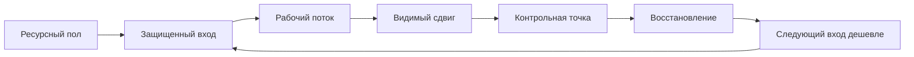
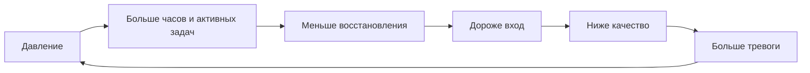

# Глава 20. Продуктивность без самоизноса

## После опыта преодоления

Предыдущая глава разобрала, как растет способность делать трудное.

Не через героизм. Не через "просто потерпи". Не через постоянное давление. А через повторяющийся цикл:

```text
сопротивление
-> удержание контакта
-> посильное действие
-> обратная связь
-> корректировка
-> след роста
```

Этот вывод легко испортить.

Если человек понял только первую половину, он может решить:

```text
раз трудность развивает,
надо чаще давить на себя
```

Но полезная трудность не равна бесконечной нагрузке. Трудность развивает, пока в ней остается управляемость, обратная связь, корректировка и восстановление. Если восстановление исчезает, трудность постепенно перестает учить и начинает накапливать долг.

Внешне это может выглядеть как продуктивность.

Человек много работает. Быстро отвечает. Постоянно держит несколько задач. Поздно заканчивает. Режет паузы. Компенсирует туман усилием. В календаре все занято. В чате он доступен. В трекере есть движение.

Но внутри может происходить другое:

```text
вход в важные задачи дорожает
контекст рвется
качество становится нестабильным
отдых не восстанавливает
следующий день начинается с долга
```

Эта глава нужна, чтобы отделить продуктивность от самоизноса.

Продуктивность в когнитивном инженерстве - это не способность долго игнорировать усталость. Это способность регулярно создавать ценный сдвиг в задачах, сохраняя будущую способность возвращаться к ним.

Коротко:

```text
продуктивность = ценный сдвиг + сохраненный следующий вход
```

Если результат есть, но следующий вход разрушен, это может быть рывок. Иногда рывки нужны. Но если так устроен обычный режим, он постепенно съедает сам себя.

## Что обычно путают с продуктивностью

Прежде чем строить модель, уберем несколько подмен.

Продуктивность - это не занятость. День может быть заполнен письмами, чатами, созвонами, короткими задачами и быстрыми реакциями, но не дать сдвига по тому, что действительно меняет положение дел.

Продуктивность - это не количество закрытых мелочей. Мелкие задачи бывают нужны: они чистят контур, снимают шум, открывают путь к большому. Но если человек закрывает мелочи, чтобы не входить в трудный кусок, это уже не продуктивность, а обход.

Продуктивность - это не максимальное число часов. Иногда длинный день дает результат. Но час, который разрушает завтрашний вход, стоит дороже, чем кажется в моменте.

Продуктивность - это не постоянное ощущение потока. Хорошая работа часто содержит скуку, сопротивление, ошибки, ожидание, чтение непонятного текста, проверку тупиков и неприятную обратную связь. Если считать продуктивным только приятный поток, сложная работа начнет казаться неправильной.

Продуктивность - это не идеальный контроль дня. В живой работе есть срочность, люди, зависшие решения, внешние ожидания, неожиданные проблемы. Задача не в том, чтобы день стал стерильным. Задача в том, чтобы режим оставался объяснимым и ремонтируемым.

Рабочее определение будет таким:

```text
продуктивность - это режим,
в котором человек регулярно создает ценный сдвиг,
понимает цену этого сдвига
и сохраняет возможность продолжать
```

В этом определении важны все три части.

Без ценного сдвига продуктивность превращается в занятость.

Без понимания цены она превращается в самообман.

Без возможности продолжать она превращается в самоизнос.

## Две петли рабочего режима

Посмотрим на две разные петли.

Вопрос схем:

```text
как отличить рабочий режим,
который сохраняет следующий вход,
от режима, который покупает сегодняшний результат завтрашним долгом?
```

Первая - петля устойчивой продуктивности.



Вторая - петля самоизноса.



Граница схем: они не делят людей на "здорово продуктивных" и "самоизнашивающихся". Они показывают повторяемый режим. Один рывок может быть оправдан; риск начинается, когда петля самоизноса становится нормальным способом работать.

Обе петли могут начинаться с одного и того же желания:

```text
сделать важную работу
```

Разница не в том, что первая петля "легкая", а вторая "трудная". В первой тоже есть трудность. Но трудность встроена в режим, который поддерживает следующий вход. Во второй трудность превращается в нарастающий долг.

Петля устойчивой продуктивности отвечает на вопрос:

```text
как сделать так,
чтобы завтра было легче продолжить важное
```

Петля самоизноса отвечает на другой вопрос:

```text
как вытянуть сегодня,
даже если завтра станет дороже
```

Иногда второй вопрос неизбежен. Дедлайн, инцидент, кризис, острое обязательство - жизнь не всегда дает идеальный ритм. Но когнитивное инженерство смотрит не только на отдельный рывок, а на повторяемую систему.

Если исключение становится нормой, система перестает восстанавливаться.

## Ресурсный пол

Начнем с первого узла петли: ресурсный пол.

Слово "ресурс" легко звучит слишком расплывчато. Поэтому уточним.

Ресурсный пол - это не хорошее настроение, не вдохновение и не полный бак энергии. Это минимальное состояние системы, при котором рабочее действие остается доступным.

У человека может быть ресурсный пол, даже если он не в восторге от задачи. Он может быть немного сонным, сомневаться, раздражаться, не чувствовать особой мотивации, но все еще быть способен:

- открыть задачу;
- восстановить контекст;
- удержать внимание на первом шаге;
- выдержать небольшую ошибку;
- получить обратную связь;
- вернуться после короткой паузы;
- не разрушить следующий день.

Если ресурсный пол провален, простая задача становится дорогой, а трудная - почти недоступной. Тогда человек начинает объяснять происходящее морально:

```text
я ленюсь
я слабый
я потерял мотивацию
мне нужно просто собраться
```

Иногда это правда частично. Но часто проблема ниже:

```text
система не держит минимальные условия действия
```

Недосып, хроническое напряжение, постоянные переключения, шум, нерешенные конфликты, плохая еда, отсутствие пауз, избыток неопределенности и слишком много открытых контуров могут поднять цену входа так, что человек начинает избегать не потому, что задача не важна, а потому что вход стал слишком дорогим.

Ресурсный пол не гарантирует продуктивность. Он только делает ее возможной.

Это как сухая поверхность под ногами. Она не несет тебя к цели сама. Но без нее каждый шаг становится борьбой с проскальзыванием.

В практическом виде ресурсный пол задается не одной привычкой, а набором нижних ограничений:

| Слой | Минимальный вопрос |
| --- | --- |
| Сон | Не построен ли день на системном недосыпе? |
| Тело | Есть ли еда, вода, движение, базовая телесная устойчивость? |
| Нагрузка | Не превышает ли текущий объем параллельной работы способность удерживать контекст? |
| Среда | Есть ли хотя бы один защищенный блок для важной работы? |
| Эмоциональная безопасность | Не превращается ли ошибка в угрозу личности или статусу? |
| Восстановление | Есть ли способ выйти из работы, а не только обрушиться после нее? |

Ресурсный пол нужен не для комфорта. Он нужен для управляемости.

Когда пол есть, трудность можно дозировать. Когда пола нет, даже полезная трудность превращается в разрушительную.

## Защищенный вход

Следующий узел - защищенный вход.

Мы уже говорили в главах 4-6, что сложная задача требует не просто действия, а восстановления состояния задачи. Нужно вспомнить цель, факты, ограничения, гипотезы, тупики, критерий продвижения и следующий шаг.

Это не бесплатно.

Вход в задачу сам является когнитивной работой. Поэтому первый кусок внимания особенно хрупок. Если он уходит на новости, чаты, быстрые ответы, случайные правки, чужую срочность и подготовительные мелочи, день может быть потерян еще до того, как человек начал "настоящую" работу.

Защищенный вход - это короткий участок дня, где задача получает шанс стать рабочим объектом.

Минимально он должен дать три вещи:

```text
контекст
первый наблюдаемый шаг
непрерывность до первого сдвига
```

Контекст отвечает на вопрос:

```text
что это за задача и где я в ней нахожусь
```

Первый наблюдаемый шаг отвечает:

```text
что изменится в мире после ближайшего действия
```

Непрерывность отвечает:

```text
успею ли я дойти до сдвига,
пока контекст снова не разорвали
```

Защищенный вход не обязан занимать половину дня. Иногда достаточно 25-40 минут, если вход хорошо подготовлен. Но если работа сложная, десять раз по пять минут обычно не заменяют один непрерывный блок. Каждый вход будет снова платить цену восстановления контекста.

Здесь полезно различить две формы защиты.

Первая - внешняя:

- не открывать чаты до первого рабочего блока;
- не начинать день с новостей;
- убрать лишние уведомления;
- поставить короткий явный слот фокуса;
- договориться о времени недоступности;
- держать рядом рабочий журнал или контрольную точку.

Вторая - внутренняя:

- не начинать с украшения системы;
- не уходить в подготовку вместо первого шага;
- не требовать идеального состояния;
- не подменять сложную задачу более легкой активностью;
- не искать уверенность до контакта с материалом.

Защищенный вход не создает дисциплину из воздуха. Он снижает цену запуска. Это разные вещи.

## Рабочий поток и видимый сдвиг

После входа нужен рабочий поток.

Здесь важно не путать поток с приятным состоянием полной погруженности. Рабочий поток означает более простую вещь:

```text
контекст задачи удерживается достаточно долго,
чтобы произошел видимый сдвиг
```

Сдвиг может быть большим:

- написан раздел;
- закрыт тикет;
- решена архитектурная развилка;
- подготовлен документ;
- найден корень бага.

Но часто сдвиг меньше:

- стало ясно, что именно непонятно;
- собран минимальный воспроизводимый пример;
- исключена одна гипотеза;
- сформулирован точный вопрос;
- создан плохой первый черновик;
- найден критерий качества;
- зафиксирован следующий вход.

Это все продуктивные сдвиги, если они меняют состояние задачи.

В сложной работе опасно считать результатом только готовый финал. Тогда долгие участки исследования, чтения, проверки, отбраковки и формулирования начинают выглядеть как "ничего не сделал". Человек усиливает давление, хотя система на самом деле двигалась.

Поэтому рабочий поток должен оставлять след.

Не обязательно большой отчет. Иногда достаточно:

```text
сделал:
узнал:
исключил:
следующий шаг:
```

Такой след превращает внутреннее усилие во внешний объект. День становится объяснимым. Следующий вход становится дешевле. Человек видит связь между усилием и сдвигом.

Без видимого сдвига рабочий поток легко превращается в переживание:

```text
я весь день напрягался, но не понимаю, что изменилось
```

Это один из путей к самоизносу. Система платит цену усилия, но не получает сигнала управляемости.

## Контрольная точка вместо обрыва

Рабочий блок нужно не только начать, но и закончить.

Плохой выход выглядит так:

```text
устал
закрыл ноутбук
потом вспомню
```

Иногда вспомнишь. Но часто нет.

Контекст сложной задачи не лежит в голове в неизменном виде. Он распадается. Поэтому выход должен защищать будущий вход.

Контрольная точка - это короткая фиксация состояния перед выходом:

```text
где остановился
что сейчас понял
что не сработало
какой следующий шаг
что важно не забыть
```

Контрольная точка не нужна для бюрократии. Она нужна, чтобы не покупать каждый следующий вход заново.

Хорошая контрольная точка особенно важна, когда:

- задача туманная;
- работа прерывается вынужденно;
- есть несколько параллельных треков;
- результат пока не финальный;
- была сложная отладка;
- завтра продолжать будет другой человек или будущий ты в другом состоянии.

В устойчивой продуктивности выход - часть работы.

Если выход не сделан, следующий вход дорожает. Если следующий вход дорожает, растет вероятность прокрастинации. Если растет прокрастинация, давление возвращается. Так петля самоизноса снова получает топливо.

## Объяснимость времени

В культуре продуктивности время часто пытаются превратить в таблицу.

Сколько минут на задачу. Сколько часов фокуса. Сколько дел закрыто. Сколько процентов дня полезно.

Учет может быть полезен. Но для когнитивного инженерства важнее другое: объяснимость времени.

Объяснимость времени - это способность в конце дня восстановить, как работал режим:

```text
где был фокус
где были переключения
где был реальный сдвиг
где были паузы
где день распался
что сделало следующий вход легче или дороже
```

Это не бухгалтерия минут. Это диагностика рабочего контура.

Если человек не может объяснить день, возможны разные причины:

- слишком много мелких переключений;
- первый вход был отдан шуму;
- важная задача не получила непрерывного блока;
- паузы уводили в другой контекст;
- день держался на реакциях, а не на выбранном сдвиге;
- было слишком много параллельной работы;
- состояние было ниже ресурсного пола;
- задача была туманной, но туман не был вынесен наружу.

Каждая причина требует разного ремонта. Поэтому просто сказать "надо лучше планировать" недостаточно.

Объяснимость времени задает правильный вопрос:

```text
какой именно механизм съел рабочий режим
```

Иногда ответ будет:

```text
я недостаточно защищал вход
```

Иногда:

```text
задач было слишком много
```

Иногда:

```text
паузы стали новым контекстом
```

Иногда:

```text
я пытаюсь продуктивно работать в состоянии,
где сначала нужно восстановление
```

Объяснимость времени не должна становиться способом бить себя по голове. Если человек использует ее для самонаказания, она ломает задачу. Ее задача - вернуть управление.

## Критерий завершенности рабочего дня

В инженерной работе критерий готовности помогает понять, что задача действительно завершена. Для рабочего режима тоже нужен критерий завершенности, но особый.

Если оценивать день только по внешним результатам, человек попадает в ловушку.

Внешние результаты часто запаздывают:

- фидбек придет позже;
- большой проект не закрывается за день;
- правильное архитектурное решение долго не видно;
- исследование требует тупиков;
- команда оценивает результат не сразу;
- метрики меняются медленно.

Если ориентироваться только на такие сигналы, день кажется плохим даже тогда, когда режим был правильным.

Поэтому критерий завершенности рабочего дня лучше держать в двух слоях.

| Слой | Примеры | Как использовать |
| --- | --- | --- |
| Управляемые признаки | объяснимость времени, защищенный вход, меньше распада на переключения, видимый сдвиг, контрольная точка, граница работы и отдыха | Проверять в конце дня. По ним можно ремонтировать завтрашний режим. |
| Запаздывающие сигналы | внешняя оценка, завершенные задачи, качество результата, стабильные метрики, доверие команды | Смотреть как подтверждение траектории. Не пытаться управлять ими напрямую в текущем блоке. |

Управляемые признаки не гарантируют внешний успех. Но без них успех становится случайным и дорогим.

Пример рабочего критерия завершенности:

```text
1. Я могу объяснить, куда ушло рабочее время.
2. Хотя бы один важный кусок получил видимый сдвиг.
3. День не распался полностью на переключения.
4. Паузы не разрушили рабочий контекст.
5. На выходе оставлена контрольная точка.
6. Завтрашний вход не стал заметно дороже без причины.
```

Это не список для идеального дня. Это диагностическая рамка.

Если выполнены четыре пункта из шести, день может быть хорошим даже без большого финального результата.

Если выполнен только пункт "я был занят", день может быть шумным даже при большом количестве действий.

## Рабочая пауза, личный отдых и прокрастинационное облегчение

Одна из самых тонких тем - паузы.

Снаружи три состояния похожи:

```text
человек не работает
```

Но системно они разные.

| Состояние | Что происходит | Что будет со следующим входом |
| --- | --- | --- |
| Рабочая пауза | Система снимает часть нагрузки, не открывая новый тяжелый контекст. | Вход обычно становится доступнее. |
| Личный отдых | Человек выходит из рабочего режима в другой жизненный режим. | Нужен, но после него требуется новый вход. |
| Прокрастинационное облегчение | Человек снижает неприятное состояние, избегая встречи с задачей. | Вход часто становится дороже. |

Рабочая пауза может быть простой:

- встать;
- пройтись;
- посмотреть в окно;
- подышать;
- сделать короткое движение;
- выпить воды;
- записать следующий шаг и отойти на несколько минут.

Ее смысл - не развлечься любой ценой. Ее смысл - восстановить способность продолжать тот же рабочий контур.

Личный отдых тоже нужен. Но если он входит внутрь рабочего блока, он может открыть другой контекст: переписку, хобби, видео, игру, новости, бытовые дела. После этого человек возвращается не из паузы, а из другой жизни. Ему снова нужно поднимать рабочий контекст.

Прокрастинационное облегчение еще тоньше. Оно может выглядеть как отдых, но его главная функция - не восстановить систему, а уйти от неприятного входа.

Практический вопрос:

```text
после этой паузы следующий вход стал доступнее или дороже
```

Ответ не всегда очевиден сразу. Поэтому полезно смотреть не на моральную оценку занятия, а на функцию.

Одна и та же прогулка может быть восстановлением или избеганием.

Один и тот же короткий чат может поддержать состояние или разорвать вход.

Один и тот же перерыв на видео может быть нормальным вечерним отдыхом или способом не встретиться с задачей, которую надо было хотя бы открыть.

В когнитивном инженерстве пауза оценивается по месту в контуре.

## Хороший ритм и режим нажима

Теперь можно развести два режима.

Хороший ритм:

```text
вход -> фокус -> сдвиг -> контрольная точка -> восстановление -> следующий вход
```

Режим нажима:

```text
давление -> больше часов -> больше активных задач -> меньше восстановления -> дороже вход -> еще больше давления
```

Хороший ритм не означает легкую жизнь. В нем есть трудные задачи, серьезные обязательства, дедлайны и неприятные куски. Но он ремонтируем. После нагрузки остается путь назад к нормальному входу.

Режим нажима часто начинается благородно:

- надо помочь команде;
- надо закрыть важный проект;
- надо доказать компетентность;
- нельзя подвести людей;
- сейчас особый период;
- потом отдохну.

Проблема не в одном особом периоде. Проблема в том, что система привыкает считать особый период нормой.

Признаки режима нажима:

- календарь заполнен, но важные задачи все равно откладываются;
- день начинается с реактивных входов;
- паузы не восстанавливают;
- вечером остается только тупое потребление или срыв;
- сон становится резервом для работы;
- качество держится на последней проверке и тревоге;
- человек все чаще говорит "надо просто дожать";
- после завершения задачи нет восстановления, потому что сразу открывается следующая.

В таком режиме продуктивность начинает жить в долг.

Сначала долг незаметен. Потом он проявляется как цена входа. Потом как прокрастинация. Потом как раздражение, цинизм, отвращение, потеря смысла, снижение качества и ощущение, что даже важные задачи больше не дают энергии.

Подробно выгорание и профессиональная скука будут дальше. Здесь достаточно зафиксировать границу:

```text
если режим регулярно разрушает восстановление,
это уже не проблема продуктивности одного дня
```

## Как проектировать день без самоизноса

Теперь соберем практический протокол.

Это не идеальное расписание. Это способ думать о рабочем дне.

### 1. Проверить ресурсный пол

Перед тем как требовать от себя высокой продуктивности, стоит спросить:

- сколько сна реально было;
- есть ли сильное телесное истощение;
- не держится ли день на тревоге;
- не слишком ли много открытых контуров;
- есть ли шанс на первый защищенный блок;
- не нужно ли сначала снизить нагрузку или неопределенность.

Если ресурсный пол провален, задача дня меняется.

Вместо:

```text
выдать максимальный результат
```

становится:

```text
сохранить систему,
сделать минимальный ценный сдвиг
и не разрушить следующий вход
```

### 2. Защитить первый вход

В начале дня нужно дать важной задаче шанс.

Не обязательно сразу брать самую страшную часть. Но полезно выбрать кусок, который двигает реальную линию:

```text
открыть контекст
назвать туман
выбрать первый шаг
дойти до первого сдвига
```

Если день начинается с чужого шума, потом трудно требовать от себя глубокого фокуса.

### 3. Выбрать один ценный сдвиг

Не "сегодня поработать над проектом", а:

```text
после блока должно измениться вот это
```

Например:

- будет черновик раздела;
- будет список неизвестных;
- будет минимальный воспроизводимый пример;
- будет решение по развилке;
- будет письмо с ясным вопросом;
- будет проверка гипотезы;
- будет удален один источник тумана.

Один ценный сдвиг лучше, чем десять размытых намерений.

### 4. Работать через внешний контекст

Если задача сложная, держать ее только в голове дорого.

Нужен внешний след:

```text
цель
текущее понимание
что проверяю
что уже исключил
что изменилось
следующий шаг
```

Это связывает главу 20 с главами 4-6. Продуктивность без внешнего контура быстро становится зависимой от состояния памяти и настроения.

### 5. Делать паузы, которые поддерживают режим

Паузу внутри рабочего блока полезно проверять вопросом:

```text
поможет ли это вернуться в тот же контекст
```

Если да, это рабочая пауза.

Если нет, возможно, это личный отдых. Он тоже нужен, но лучше вынести его за границу рабочего блока.

Если пауза просто снимает неприятное состояние и делает вход дороже, это прокрастинационное облегчение.

### 6. Закрыть блок контрольной точкой

Перед выходом:

```text
что сделал
что понял
что не сработало
где остановился
с чего начать дальше
```

Контрольная точка особенно важна, если работа была трудной, неполной или прерванной. Она защищает будущего человека, который будет входить в задачу в другом состоянии.

### 7. Вечером восстановить объяснимость дня

Не надо судить день только по чувству "я молодец" или "я провалился".

Лучше восстановить карту:

- где был защищенный вход;
- что стало видимым сдвигом;
- где были разрывы;
- какие паузы помогли;
- какие паузы открыли другой контекст;
- что сделало завтрашний вход легче;
- что сделало его дороже.

После этого можно выбрать один ремонт на завтра.

Не десять.

Один.

Например:

```text
не открывать чаты до первого блока
```

или:

```text
оставлять контрольную точку перед обедом
```

или:

```text
не начинать паузу с личного видео
```

или:

```text
сократить число параллельных задач до двух активных
```

Так продуктивность становится инженерной: наблюдение, гипотеза, изменение, проверка.

## Когда подход продуктивности уже не подходит

Есть состояния, где этот слой работы должен остановиться.

Если человек уже в тяжелом истощении, новый режим продуктивности может стать еще одним источником давления. Тогда проблема не в том, что не хватает правильной техники. Проблема в том, что система уже не восстанавливается.

Красные флаги:

- после отдыха вход не возвращается;
- сон системно нарушен;
- тело постоянно в напряжении или провале;
- работа вызывает отвращение, а не только сопротивление;
- качество падает, но часов становится больше;
- человек держится только на тревоге и обязательстве;
- любые паузы превращаются в обрушение;
- ошибка переживается как угроза достоинству или безопасности;
- внешние требования явно выше доступных ресурсов;
- восстановление невозможно без изменения условий.

В таких случаях вопрос меняется.

Не:

```text
как стать продуктивнее
```

А:

```text
как вернуть безопасность, восстановление и управляемость
```

Это не слабость и не отказ от ответственности. Это правильный уровень вмешательства.

Ремонт системы продуктивности работает, когда система еще способна реагировать на малые изменения. Если человек уже находится ниже ресурсного пола длительное время, нужна не новая схема дня, а снижение нагрузки, помощь, пересборка условий и иногда профессиональная поддержка.

Дальше это будет разобрано через поломку мотивационного контура, выгорание, профессиональную скуку и восстановление управляемости.

## Что это добавляет к учебнику

До этого места учебник объяснил несколько важных вещей.

Сложная работа требует внешнего контура, потому что состояние задачи распадается.

Мотивация зависит не от одного желания, а от ценности, угрозы, управляемости, цены усилия и состояния.

Тело и стресс меняют доступность действия.

Сон, паузы и интервалы не украшают обучение, а поддерживают консолидацию и следующий вход.

Прокрастинация часто дает краткое облегчение ценой будущего входа.

Преодоление растет через управляемую трудность, обратную связь и след роста.

Глава 20 соединяет это в рабочую формулу:

```text
продуктивность поддерживает будущую доступность действия
```

Если режим делает следующий вход дешевле или хотя бы не разрушает его, он устойчив.

Если режим каждый раз покупает результат повышением будущей цены входа, он живет в долг.

Продуктивность без самоизноса - это не мягкость. Это не отказ от сложных задач. Это не культ отдыха. Это инженерная дисциплина:

```text
держать ресурсный пол
защищать вход
создавать видимый сдвиг
оставлять контрольную точку
восстанавливать систему
следить, чтобы следующий вход был возможен
```

После этого становится видно, почему дальше нужен разговор о фокусе, ограничении параллельной работы и переключениях. Если продуктивность зависит от сохранения входа и контекста, значит нужно отдельно разобраться, как параллельные задачи, срочность, чаты и переключения ломают рабочий поток.

## Источниковая опора

Проверенный пакет для этой главы: [[../Источники/2026-05-25 Пакет источников для главы 20]].

Ключевые источники в авторско-годовой форме:

- Meijman & Mulder (1998), Geurts & Sonnentag (2006), Sonnentag & Fritz (2007), Sonnentag, Venz & Casper (2017), Sonnentag, Cheng & Parker (2022): модель усилия-восстановления и восстановление после работы как опора для продуктивности без восстановительного долга.
- Demerouti et al. (2001), Bakker & Demerouti (2007, 2017): модель рабочих требований и ресурсов как рамка требований, ресурсов, процессов истощения здоровья и мотивационных процессов.
- Trougakos et al. (2008), Hunter & Wu (2016), Fritz et al. (2013): рабочие паузы и восстановительные действия; паузы различаются по функции и не равны автоматически восстановлению.
- Muller et al. (2021), McEwen (1998), Lim & Dinges (2010): усталость, аллостатическая нагрузка и эффекты недосыпа как переменные состояния для будущего усилия и внимания.
- Внутренние авторские материалы по продуктивности: ресурсный пол, защищенный вход, объяснимость дня, критерий завершенности работы и граница между рабочей паузой и прокрастинационным облегчением.

Доказательная роль блока: `strong` для восстановления после работы, модели усилия-восстановления, JD-R, усталости как сдвига цены действия, аллостатической нагрузки и границ недосыпа; `context-dependent` для конкретных рабочих пауз, критерия завершенности дня, объяснимости времени и ритуалов продуктивности; `clinical-boundary` для выгорания, хронического недосыпа, депрессивно похожих состояний, тревоги и состояний, где личный протокол продуктивности должен уступить снижению нагрузки, поддержке или профессиональной помощи. Глава не обещает "успевать больше", а задает критерий: следующий вход должен оставаться возможным.

Полные библиографические записи и DOI сохранены в пакете главы. В текущей редакции глава оставляет короткий авторско-годовой блок как читательский ориентир.

## Короткое резюме

- Продуктивность в когнитивном инженерстве - это устойчивое продвижение по ценным задачам с сохранением будущего входа.
- Самоизнос начинается там, где результат покупается ухудшением восстановления, качества, объяснимости времени и управляемости.
- Восстановление не награда после работы, а часть рабочего контура.
- В этой рамке хороший рабочий день оставляет не только результат, но и понятный след: что двигалось, что стало яснее, где следующий вход.
- Если система уже не восстанавливается, приемы продуктивности должны уступать место снижению нагрузки, поддержке и изменению условий.

## Вопросы для самопроверки

1. Чем продуктивность отличается от занятости?
2. Почему восстановление нельзя оставлять "на потом" после всех задач?
3. Что показывает, что день был устойчивым, даже если большая задача не завершена?
4. Когда новый режим продуктивности становится дополнительным источником самоизноса?
5. Как понять, что проблема уже не в расписании, а в нагрузке, состоянии или среде?

## Мини-практика

Возьмите один прошедший рабочий день и опишите его не по часам, а по контуру:

```text
ресурсный пол:
первый защищенный вход:
главный видимый сдвиг:
что было вынесено во внешний контекст:
какая контрольная точка осталась:
какая пауза помогла вернуться:
какая пауза удорожила вход:
следующий вход стал дешевле или дороже:
```

Затем выберите один ремонт на завтра. Не три и не пять. Один: защитить первый вход, снизить число активных задач, закрыть блок контрольной точкой или заменить разрушающую паузу на рабочую.

## Статус

`ready-for-review`

Ревизия блока: [[../Проверки/2026-05-25 Ревизия блока 20-25]].
