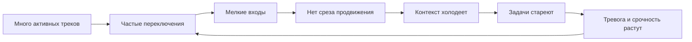
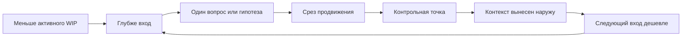

# Глава 21. Фокус, WIP и переключения

## Почему после продуктивности нужна глава о фокусе

В предыдущей главе продуктивность была определена не как занятость и не как количество часов, а как устойчивый режим:

```text
ценный сдвиг + сохраненный следующий вход
```

Это определение сразу выводит нас к новой проблеме.

Даже если у человека есть ресурсный пол, понятная задача, рабочий журнал и желание продвинуться, день может распасться. Не потому, что человек ленивый. Не потому, что ему "не хватает дисциплины". А потому, что одновременно активных контекстов слишком много.

Одна задача требует глубокого анализа. Вторая формально тоже "в работе". Третья ждет ответа. Четвертая тревожно висит в фоне, потому что ее давно не трогали. Параллельно идут чаты, встречи, быстрые вопросы, ревью, поддержка и мелкие решения. Человек честно работает, но каждый вход оказывается слишком коротким, чтобы что-то изменить.

Вечером день можно описать так:

```text
я весь день был занят,
но ни одна тяжелая задача не стала существенно понятнее
```

Это не просто неприятное ощущение. Это системный сбой рабочего контура.

Если продуктивность зависит от сохранения следующего входа, то фокус, WIP и переключения отвечают на вопрос:

```text
что делает следующий вход дешевым или дорогим
```

Эта глава не про героическую концентрацию. Она про инженерное управление активными контекстами.

## Фокус - это контакт с контекстом

Фокус часто представляют как внутреннее состояние:

```text
я собран
я не отвлекаюсь
я могу сидеть над задачей
```

Для простых дел этого описания иногда хватает. Для сложной работы оно слишком бедное.

В когнитивном инженерстве фокус - это не просто отсутствие отвлечений. Это устойчивый контакт с рабочим контекстом задачи.

Контакт означает, что человек удерживает:

- цель;
- текущее состояние;
- ограничения;
- активный вопрос;
- гипотезу или линию рассуждения;
- материал, с которым он сейчас работает;
- критерий ближайшего продвижения.

Можно сидеть без телефона и все равно не быть в фокусе. Например, если человек открыл код, документ или заметку, но не понимает:

```text
что я сейчас проверяю
почему это важно
где я остановился
что будет считаться продвижением
```

И наоборот, фокус может начаться не с длинной тишины, а с точного восстановления состояния:

```text
я понимаю, где задача сейчас,
какой вопрос открыт,
какой шаг должен изменить состояние
```

Поэтому фокус нельзя проектировать только через запрет отвлечений. Нужно проектировать контекст, вход, размер рабочего блока, выход и правила переключения.

## WIP в задачах и WIP в голове

WIP - это work in progress, работа в процессе.

В инженерных командах WIP обычно виден на доске:

```text
сколько задач находится в статусе "в работе"
```

Это полезный уровень. Но для когнитивного инженерства важнее другой вопрос:

```text
сколько тяжелых контекстов человек пытается держать активными в голове
```

Это разные вещи.

Задача может быть в работе на доске, но не быть активной в голове. Например, она ждет внешнего ответа, имеет понятную контрольную точку и дату следующего контакта.

Другая задача может формально лежать в backlog, но занимать голову. Человек о ней тревожится, периодически проверяет, вспоминает, недодумывает и снова бросает.

Таблица:

| Состояние | Что видно снаружи | Что происходит в голове | Риск |
| --- | --- | --- | --- |
| Активная задача с реальным контактом | Задача в работе | Человек знает следующий кусок продвижения | Нормальный рабочий режим |
| Активная задача без контакта | Задача в работе | Контекст холодный, следующего куска нет | Старение задачи и тревога |
| Отложенная задача с контейнером | Задача не сейчас | Состояние вынесено наружу, есть точка возврата | Управляемое ожидание |
| Отложенная задача в тревожном фоне | Формально не сейчас | Мозг держит ее как незакрытую угрозу | Остаточное внимание и распыление |

Опасен не сам факт, что у человека несколько важных направлений. В реальной жизни их почти всегда несколько.

Опасна попытка держать несколько тяжелых контекстов как одновременно активные.

Рабочая память не является большим столом, на котором можно разложить пять сложных задач и свободно видеть их все. Она больше похожа на узкий рабочий участок. Если на нем лежит слишком много, система начинает не думать глубже, а перекладывать.

Для разработчика это особенно важно: сложность задачи не сводится к количеству строк или формальной цикломатической сложности. Иногда маленький участок кода требует большой модели зависимостей, истории решений, гипотез и исключенных путей. Иногда большой файл понятен, потому что человек видит его структуру и следующий ход. Исследования когнитивной нагрузки в разработке ПО помогают говорить об этом точнее, но не дают одной бытовой метрики "эта задача стоит X единиц внимания".

## "В работе" не значит "двигается"

Статус "в работе" часто успокаивает.

Кажется:

```text
задача начата,
значит она движется
```

Но между "задача начата" и "задача реально получает ежедневный содержательный контакт" есть разрыв.

Задача может числиться в работе, но несколько дней не получать ни одного среза продвижения. Человек может открывать ее, вспоминать, отвечать на связанные сообщения, немного смотреть материалы, но не менять состояние задачи.

Тогда возникает иллюзия работы:

```text
контакт был,
сдвига нет
```

Для тяжелой задачи полезен более строгий вопрос:

```text
какой ближайший кусок продвижения у этой задачи
и когда он получит глубокий контакт
```

Если на этот вопрос нельзя ответить, задача не столько "в работе", сколько "висит".

Висеть она может по уважительным причинам:

- ждет внешнего ответа;
- ждет решения;
- ждет окна времени;
- заблокирована;
- сознательно поставлена на паузу.

Но тогда это должно быть записано. Иначе задача начинает жить не во внешней системе, а в тревожном фоне.

## Что стоит при переключении

Переключение обычно измеряют временем:

```text
я отвлекся на 10 минут
```

Но реальная цена переключения не равна только этим 10 минутам.

При переходе с одной сложной задачи на другую нужно:

1. Приостановить прежнюю цель.
2. Убрать из активного режима прежние правила и ограничения.
3. Поднять новую цель.
4. Восстановить состояние новой задачи.
5. Понять, что уже было известно.
6. Отличить факты от гипотез.
7. Вспомнить, какой путь был закрыт.
8. Найти первый шаг.
9. Подавить остаточное внимание к прежней задаче.
10. Начать действовать достаточно долго, чтобы появился сдвиг.

Часть этой работы происходит быстро и незаметно. Но если задача сложная, цена становится видимой:

```text
я вроде открыл задачу,
но первые полчаса только вспоминаю,
что здесь вообще происходит
```

Это и есть повторная загрузка контекста.

Есть несколько разных компонентов этой цены.

| Компонент | Что происходит | Как выглядит в работе |
| --- | --- | --- |
| Цена переключения | Система перенастраивается с одного набора правил на другой. | После переключения первые действия медленнее и менее точны. |
| Восстановление цели | Нужно восстановить цель и намерение прежней или новой задачи. | "Что я собирался сделать дальше?" |
| Остаточное внимание | Часть внимания остается на предыдущей незавершенной задаче. | Тело уже в новом контексте, мысли еще возвращаются к старому. |
| Задержка возвращения | После прерывания нужно время, чтобы продолжить первичную задачу. | "Где я остановился?" |
| Эмоциональный хвост | Незавершенность, тревога или вина тянут внимание назад. | "Я не должен был это бросать" или "там сейчас что-то горит". |

Важно: переключение не всегда зло. Иногда оно нужно. Иногда оно является частью роли. Иногда оно дешевое, потому что задачи простые или хорошо подготовлены.

Проблема начинается, когда тяжелые задачи переключаются слишком часто и без нормального выхода.

## Прерывание отличается от запланированного переключения

Нужно развести два случая.

Запланированное переключение:

```text
я завершаю блок
оставляю контрольную точку
фиксирую следующий вход
перехожу к другому треку
```

Прерывание:

```text
текущий блок разрывается до нормального выхода
```

В обоих случаях человек меняет задачу. Но когнитивная цена разная.

Если перед переключением был нормальный выход, состояние задачи сохранено. Человек не обязан держать ее в голове. Он может вернуться по внешнему следу.

Если блок был разорван, задача остается в подвешенном состоянии:

- мысль не зафиксирована;
- проверка не закончена;
- гипотеза не обновлена;
- следующий шаг не назван;
- место остановки не отмечено.

В таком случае мозг часто продолжает держать задачу в фоне. Это выглядит как забота:

```text
я же помню, что надо вернуться
```

Но на деле это дорогой способ хранения. Тяжелая задача не должна храниться в тревоге. Она должна храниться во внешнем контейнере состояния.

## Петля распыления

Теперь можно описать типичную петлю распыления.

Вопрос схемы:

```text
как много ответственной активности превращается
в холодные контексты, стареющие задачи и потерю управляемости?
```



Граница схемы: она не запрещает переключения и не делает фокус моральным тестом. Она показывает цену тяжелых незавершенных контекстов, если они часто разрываются без контрольной точки и среза продвижения.

Разберем ее.

Сначала появляется много активных треков. Обычно не из глупости, а из ответственности. Все кажется важным. Ничего нельзя бросить. Хочется держать ситуацию под контролем.

Потом начинаются частые переключения. Человек пытается "хотя бы понемногу" касаться каждого трека.

Каждый вход становится мелким. Времени хватает на открытие задачи, чтение новых сообщений, поверхностную проверку, возможно один маленький шаг. Но не хватает на срез продвижения.

Без среза состояние задачи не улучшается. Контекст холодеет: при следующем входе придется снова поднимать, что было известно и зачем это делалось.

Задачи стареют. Чем дольше они висят, тем больше тревоги и больше кажущейся срочности.

Тревога заставляет чаще проверять и чаще переключаться.

Петля замыкается.

Внешне такой режим может выглядеть как высокая занятость. Внутри он переживается как потеря управляемости:

```text
я касаюсь всего,
но ничего не держу достаточно долго
```

## Минимальная полезная единица глубокого внимания

Не каждый контакт с задачей является полезной единицей фокуса.

Для простой задачи иногда достаточно короткого действия:

```text
ответить
проверить
переименовать
отправить
закрыть
```

Для сложной задачи контакт должен быть больше. Нужна минимальная полезная единица глубокого внимания.

Она состоит из пяти частей:

```text
вход
-> один вопрос или гипотеза
-> рабочий контакт
-> срез продвижения
-> контрольная точка
```

### Вход

Вход восстанавливает состояние:

- цель;
- текущее место;
- что уже известно;
- что неясно;
- первый шаг.

Если вход занимает весь блок, задача была плохо подготовлена или блок слишком короткий.

### Один вопрос или гипотеза

Глубокий блок не должен пытаться решить весь трек.

Формула:

```text
на один глубокий блок - один главный вопрос
или одна проверяемая гипотеза
```

Например:

```text
проверить, меняется ли состояние до внешнего вызова
```

лучше, чем:

```text
разобраться с интеграцией
```

### Рабочий контакт

Это основная часть блока: чтение, анализ, код, письмо, схема, эксперимент, решение.

Важно, чтобы этот контакт не дробился до первого сдвига. Если блок прервался до сдвига, следующий вход снова будет дорогим.

### Срез продвижения

Срез продвижения - это изменение состояния задачи.

Он не обязан быть завершением.

Срезом может быть:

- подтвержденный факт;
- закрытая гипотеза;
- найденная причина;
- уточненная зона тумана;
- принятое решение;
- отброшенный путь;
- сформулированный вопрос;
- подготовленная проверка;
- уменьшенная неопределенность;
- первый шаг на следующий блок.

Главное:

```text
после среза задача стала понятнее или управляемее
```

### Контрольная точка

Контрольная точка сохраняет срез во внешнем состоянии.

Минимальная форма:

```text
Сделал:
Узнал:
Остановился на:
Дальше:
```

Если контрольная точка не оставлена, часть среза снова уходит в голову. Тогда следующий вход будет опираться не на внешний след, а на надежду "я вспомню".

## Внешний контейнер состояния трека

В главах 4-6 уже был введен рабочий журнал. В этой главе он получает еще одну функцию: контейнер состояния для тяжелого трека.

Контейнер нужен не для красоты заметок. Он нужен, чтобы трек мог быть важным, но не жить постоянно в голове.

Шаблон:

```markdown
# Трек: ...

## Зачем это нужно
Что должно измениться, если трек продвинется?

## Текущее состояние
Где задача сейчас?

## Что известно
- ...

## Что непонятно
- ...

## Активная гипотеза или вопрос
- ...

## Принятые решения
- ...

## Отброшенные пути
- ...

## Последняя контрольная точка
Сделано:
Узнано:
Остановился:

## Следующий контакт
Когда вернуться и зачем?

## Первый шаг входа
Что открыть или сделать первым?

## Статус ожидания
Ждет чего? Кто owner? Когда проверить?
```

У хорошего контейнера есть две проверки.

Первая:

```text
можно ли по нему вернуться к задаче через день или неделю
```

Вторая:

```text
можно ли благодаря ему перестать держать задачу в голове сейчас
```

Если контейнер не помогает второму, он стал архивом. Он хранит историю, но не снижает WIP в голове.

## Срез продвижения против полного завершения

Одна из причин распыления - ложный выбор:

```text
или я завершу задачу,
или контакт был бесполезен
```

Для тяжелых задач это неверно.

Много важной работы движется через промежуточные срезы:

| Тип среза | Пример | Почему это продвижение |
| --- | --- | --- |
| Факт | "Событие до обработчика доходит". | Повторная проверка больше не нужна. |
| Закрытая гипотеза | "Проблема не в ретрае". | Сужается пространство поиска. |
| Уточненный туман | "Неясен именно порядок изменения состояния". | Общее сопротивление превращается в конкретный вопрос. |
| Решение | "Идем через вариант B, потому что A ломает обратную совместимость". | Снимается развилка. |
| Отброшенный путь | "Не используем ручную правку, слишком высокий риск". | Будущий вход не пойдет по кругу. |
| Подготовленный вопрос | "Нужно узнать у владельца системы X, идемпотентен ли вызов". | Появляется внешний следующий шаг. |
| Следующий вход | "Начать с файла N и проверить ветку ошибки". | Следующий блок дешевле. |

Срез продвижения особенно важен там, где полное завершение далеко.

Если ждать только завершения, задача долго выглядит неподвижной. Это повышает тревогу, а тревога подталкивает к новым переключениям.

Если фиксировать срезы, задача может быть незавершенной, но управляемой.

## Один глубокий трек сейчас не значит один важный трек в жизни

Важно не превратить эту главу в культ одного дела.

В жизни и работе почти всегда есть несколько важных направлений. У инженера может быть разработка, ревью, поддержка, документация и обучение. У лида - люди, процесс, архитектура, найм, операционные риски. У автора - исследование, текст, редактура, публикация.

Проблема не в множественности сама по себе.

Проблема в смешении двух уровней:

```text
портфель важных треков
```

и

```text
текущий глубокий контакт
```

Портфель может быть широким. Текущий глубокий контакт должен быть узким.

Рабочая формула:

```text
один тяжелый трек в глубоком внимании сейчас,
остальные тяжелые треки - во внешнем состоянии
с точкой следующего контакта
```

Это не отказ от ответственности за остальные треки. Наоборот, это более надежный способ их удерживать.

Когда трек живет в голове, он конкурирует за внимание каждую минуту.

Когда трек живет в контейнере состояния, он ждет своего контакта.

## Личный WIP-лимит

WIP-лимит не должен быть магическим числом.

Нет универсального правила:

```text
у всех должно быть не больше N задач
```

Разные роли, уровни сложности, периоды и состояния требуют разных лимитов.

Но полезно различить три слоя личного WIP.

| Слой | Что входит | Признак перегруза |
| --- | --- | --- |
| Глубокий WIP | Тяжелые треки, требующие анализа, проектирования, письма, решения. | Больше одного трека одновременно требует "держать в голове". |
| Оперативный WIP | Быстрые ответы, координация, ревью, мелкие блоки. | Оперативка съедает первый глубокий вход дня. |
| Фоновый WIP | Ожидания, отложенные решения, будущие темы. | Нет внешнего контейнера, все живет тревожным напоминанием. |

Личный WIP-лимит начинается не с запрета брать задачи. Он начинается с вопроса:

```text
что я пытаюсь держать активным прямо сейчас
```

Минимальная практика:

1. Выписать все треки, которые занимают голову.
2. Отметить, какие из них требуют глубокого внимания.
3. Выбрать один глубокий трек на ближайший блок.
4. Для остальных записать состояние и следующий контакт.
5. Отдельно выделить настоящие срочные сигналы.

Если после этого тревога не снижается, возможно, проблема не в заметках. Возможно, обязательств действительно больше, чем пропускная способность системы.

Тогда WIP-лимит должен стать разговором о нагрузке, сроках и приоритетах, а не личной техникой самоконтроля.

## Срочность и шум

Прерывания особенно разрушительны, когда человек не может заранее понять, что действительно требует переключения.

Если любой входящий сигнал может оказаться срочным, приходится проверять все:

```text
а вдруг там пожар
а вдруг от меня ждут решения
а вдруг нельзя откладывать
```

Проверка уже является переключением. Даже если сообщение оказалось неважным, часть фокуса потрачена.

Поэтому срочность должна быть вынесена в форму сигнала.

Минимальный формат срочного прерывания:

| Поле | Вопрос |
| --- | --- |
| Severity | Насколько это критично? |
| Impact | Что ломается или рискует, если ждать? |
| Deadline | До какого времени нужен ответ или действие? |
| Needed action | Что именно нужно от адресата? |
| Owner | Кто ведет ситуацию? |
| Context | Где минимальная ссылка на факты? |

Пример структуры:

```text
Severity: high
Impact: заблокирован релиз / падает важный сценарий / остановлена работа команды
Needed action: подтвердить решение A или B
Deadline: до 14:00
Owner: ...
Context: ссылка
```

Здесь не важны конкретные названия полей. Важна функция:

```text
человек должен понять цену ожидания
до того как он разрушит текущий фокус
```

Если срочность спрятана внутри длинного сообщения, канал заставляет всех читать все. Это превращает коммуникацию в генератор прерываний.

## Как прерываться, когда действительно нужно

Иногда прерывание необходимо.

Есть инциденты, срочные решения, поддержка, безопасность, помощь человеку, deadline, который нельзя перенести.

Цель когнитивного инженерства не в том, чтобы запретить такие события. Цель в том, чтобы снизить ущерб.

Если нужно прерваться, полезна мини-контрольная точка:

```text
Я сейчас:
Проверял:
Успел понять:
Следующий шаг после возврата:
```

Это может занять 30-90 секунд. Иногда даже меньше.

Если прерывание действительно критично, может не быть и этих 30 секунд. Тогда после срочного события нужно первым делом восстановить место разрыва:

```text
какую задачу я бросил
где была мысль
что нужно записать,
чтобы не держать это в голове
```

Прерывание становится особенно дорогим, когда оно не только разрывает текущий блок, но и не получает последующего закрытия.

Тогда остаются две незавершенности:

- старая задача не закрыта контрольной точкой;
- срочная задача не закрыта итогом.

Так накапливается внутренний шум.

## Командный фокус

Личный фокус не существует в вакууме.

Если среда постоянно требует немедленных ответов, личные техники быстро становятся косметикой. Человек может завести идеальный рабочий журнал, но если любое сообщение потенциально требует реакции сейчас, глубокий контакт все равно будет рваться.

Командный фокус проектируется через правила потока.

### 1. "В работе" должно означать следующий кусок

Для активной задачи полезно иметь ответ:

```text
какой следующий содержательный кусок продвижения
```

Если ответа нет, задача может быть:

- не готова к работе;
- заблокирована;
- требует разборки;
- слишком большая;
- взята слишком рано;
- висящая без реального владельца.

Тогда честнее не держать ее как активную, а изменить статус или записать причину ожидания.

### 2. Aging задач нужно смотреть без наказания

Стареющая активная задача - это сигнал, а не повод обвинять.

Она может стареть, потому что:

- размер слишком большой;
- фокус разорван;
- слишком много внешних ожиданий;
- неясен критерий продвижения;
- человек перегружен;
- задача неправильно подготовлена;
- есть скрытая неопределенность.

Разбор стареющих задач должен спрашивать:

```text
что мешает следующему срезу продвижения
```

а не:

```text
почему ты еще не закончил
```

### 3. Глубокую работу и оперативные ответы нужно разводить

Если роль требует и глубокой работы, и оперативной реакции, нужно проектировать режимы.

Например:

```text
окна глубокого фокуса
окна ответов
дежурный канал для настоящей срочности
асинхронные обновления по несрочным вопросам
```

Конкретная форма зависит от команды. Принцип один:

```text
если все каналы одинаковы,
все сообщения становятся потенциальным прерыванием
```

### 4. Срочное должно иметь отдельную форму

Команда не обязана запрещать срочность. Она должна сделать срочность узнаваемой.

Если срочно, сигнал должен нести:

- уровень важности;
- влияние;
- срок;
- что требуется от адресата;
- кто владелец;
- где контекст.

Тогда человек может принять решение:

```text
прерваться сейчас
оставить мини-контрольную точку
или отложить до ближайшего окна ответа
```

### 5. Тяжелые треки должны иметь контейнер состояния

Командный контейнер не обязан быть большим документом.

Но у тяжелого трека должны быть:

- цель;
- текущий статус;
- последние решения;
- открытые вопросы;
- блокеры;
- следующий кусок;
- владелец;
- дата следующего контакта.

Это снижает зависимость от памяти одного человека и уменьшает цену возвращения после встреч, переключений, отпусков, дежурств и инцидентов.

## Ширина и глубина

Иногда важные дела действительно требуют чередования.

Нельзя всегда выбрать одно направление и игнорировать остальные. Важная операционная задача может угрожать стратегической. Поддержка может быть частью ответственности. Люди, процессы и риски не ждут идеального фокусного окна.

Поэтому полезно различать два режима.

Ширина:

```text
несколько важных треков получают краткий управляемый контакт,
чтобы не потерять состояние и не пропустить риск
```

Глубина:

```text
один трек получает достаточно внимания,
чтобы появился срез продвижения
```

Ошибка - пытаться жить только в одном режиме.

Если есть только глубина, часть важных треков может выпасть из поля зрения.

Если есть только ширина, все треки будут понемногу касаться сознания, но ни один не станет существенно лучше.

Рабочая форма:

```text
ширина поддерживает карту,
глубина создает сдвиг
```

Ширина должна отвечать на вопросы:

- какие треки существуют;
- где риск;
- что ждет;
- где следующий контакт;
- что стало срочным.

Глубина должна отвечать на другой вопрос:

```text
какой один трек сейчас получит срез продвижения
```

## Практика: WIP-карта внимания

Простой способ применить главу - составить WIP-карту внимания.

Не карту задач вообще, а карту того, что занимает активное внимание.

Шаблон:

| Трек | Режим | Сейчас в голове? | Следующий срез | Контейнер есть? | Следующий контакт |
| --- | --- | --- | --- | --- | --- |
| ... | deep / operational / waiting / coordination | да / нет | ... | да / нет | ... |

Режимы:

| Режим | Что означает |
| --- | --- |
| deep | Требует глубокого блока и среза продвижения. |
| operational | Требует ответов, координации, коротких решений. |
| waiting | Ждет внешнего события, решения или ответа. |
| coordination | Требует синхронизации людей и договоренностей. |
| parked | Важно, но сознательно не сейчас. |

После заполнения карты нужно посмотреть не на количество строк, а на количество строк, которые:

```text
одновременно требуют глубокого внимания
и не имеют контейнера состояния
```

Это и есть опасный WIP в голове.

## Практика: правило одного среза

Для каждого глубокого блока можно ввести правило:

```text
не выходить из блока без одного среза продвижения
или честной контрольной точки о том, почему срез не получился
```

Это не означает "всегда заканчивать задачу".

Это означает:

```text
после блока состояние должно быть зафиксировано
```

Примеры хорошего результата блока:

```text
закрыл гипотезу
нашел место ошибки
уточнил вопрос
собрал факты
принял решение
подготовил запрос
оставил точный следующий шаг
```

Пример плохого результата:

```text
посмотрел немного там и там,
надо будет потом еще разобраться
```

Такой итог может быть честным, если задача оказалась туманнее, чем казалось. Но тогда нужно записать:

```text
что именно оказалось туманным
как разделить это на вопросы
с чего начать следующий вход
```

## Практика: личный протокол переключения

Перед запланированным переключением:

```text
1. Что я сейчас делал?
2. Что изменилось в состоянии задачи?
3. Какой следующий физический шаг?
4. Где лежит рабочий артефакт?
5. Когда я вернусь или что должно случиться для возврата?
```

Если времени мало, минимальная версия:

```text
Остановился:
Дальше:
```

После прерывания:

```text
1. Закрыть срочное событие коротким итогом.
2. Найти задачу, которую оно разорвало.
3. Восстановить состояние по контрольной точке.
4. Решить: возвращаюсь сейчас или ставлю следующий контакт.
```

Эта практика не делает прерывания приятными. Она делает их менее разрушительными.

## Когда фокус не чинится личными приемами

Есть ситуации, где проблема не в том, что человек плохо управляет WIP.

Например:

- реально слишком много обязательств;
- роль построена на постоянной реактивности;
- отсутствует право сказать "не сейчас";
- сроки противоречат доступной пропускной способности;
- команда не различает срочность и шум;
- любое ожидание воспринимается как провал;
- человек уже ниже ресурсного пола;
- восстановление не успевает;
- организационная среда постоянно поднимает угрозу.

В этих случаях личная техника может помочь немного, но не решит системную проблему.

Тогда вопрос меняется.

Не:

```text
как мне лучше сфокусироваться
```

А:

```text
какие обязательства, правила коммуникации и WIP нужно изменить,
чтобы глубокая работа вообще стала возможна
```

Это важный предохранитель. Когнитивное инженерство не должно превращаться в способ адаптировать человека к бесконечной перегрузке.

## Что это добавляет к учебнику

К этому месту учебник уже показал:

- сложная задача должна иметь внешнее состояние;
- вход и выход нужно делать частью рабочего цикла;
- мотивация зависит от цены усилия и управляемости;
- восстановление поддерживает будущую доступность действия;
- продуктивность в этой рамке оставляет ценный сдвиг и следующий вход.

Глава 21 добавляет слой управления активными контекстами.

Главная мысль:

```text
фокус - это не держать больше в голове,
а держать меньше в активном состоянии
и лучше сохранять все остальное снаружи
```

Устойчивый рабочий режим выглядит так:



Эта финальная схема не обещает идеальный день без срочности. Она задает нормальный протокол хранения контекста: меньше активного WIP, глубже вход, срез продвижения, контрольная точка и дешевый возврат.

Это не делает работу простой. Оно делает сложность управляемой.

После этого становится видно, почему дальше нужны ресурсность, сила и ритуалы. WIP-лимиты, контрольные точки, глубокие блоки и правила прерываний работают только тогда, когда у системы есть состояние, в котором эти правила можно выполнять. Если ресурсный режим просел, даже хорошая схема фокуса начинает требовать слишком много силы.

## Источниковая опора

Проверенный пакет для этой главы: [[../Источники/2026-05-25 Пакет источников для главы 21]].

Ключевые источники в авторско-годовой форме:

- Baddeley (2012), Unsworth & Robison (2017), Sara & Bouret (2012), Monsell (2003), Rubinstein, Meyer & Evans (2001), Kiesel et al. (2010): рабочая память, LC-NE/уровень активации, контроль внимания, переключение задач, перенастройка набора задачи и интерференция.
- Leroy (2009), Altmann & Trafton (2002), Trafton et al. (2003), Trafton & Monk (2008): остаточное внимание, память о целях, задержка после прерывания и подсказки возвращения.
- Kane et al. (2007), Mooneyham & Schooler (2013): блуждание ума как зависящее от задачи явление с ценой и возможной пользой; при тяжелом WIP оно часто означает потерю контекста цели, а не творческую свободу.
- Czerwinski, Horvitz & Wilhite (2004), Gonzalez & Mark (2004), Mark, Gudith & Klocke (2008): переключение задач и прерывания в работе со знанием как источники стресса и проблем возвращения, а не только потери времени.
- Risko & Gilbert (2016), Parnin & DeLine (2010), Parnin & Rugaber (2011): когнитивная выгрузка и возвращение к программной задаче через заметки, подсказки и внешнее состояние.
- Gonçales, Farias & da Silva (2021), Fritz et al. (2014), Peitek et al. (2021), Sharafi, Soh & Guéhéneuc (2015), Tregubov et al. (2017), Ma, Huang & Leach (2024), Shakeri Hossein Abad et al. (2018): когнитивная нагрузка в разработке ПО, измерение трудности задачи, понимание программ, переключение задач и данные о прерываниях.
- Внутренние лидерские материалы использованы только санитаризированно: WIP, старение задач, срочность, внешнее состояние треков и командные правила фокуса.

Доказательная роль блока: `strong` для ограничений рабочей памяти, рамки контроля внимания/активации, цены переключения, памяти о целях, подсказок возвращения и когнитивной выгрузки; `context-dependent` для блуждания ума, измерения когнитивной нагрузки в разработке ПО и переноса на уровень команды, потому что требования задач, знакомство с кодовой базой, роли, прерываемость, дежурства и координационные потребности различаются; `fast-moving` для свежих данных о прерываниях в разработке ПО. Для внутренних лидерских примеров действует граница приватности и санитаризации. Глава не обещает универсальный WIP-лимит и не превращает фокус в моральный тест концентрации.

Полные библиографические записи и DOI сохранены в пакете главы. В текущей редакции глава оставляет короткий авторско-годовой блок как читательский ориентир.

## Короткое резюме

- Фокус - это контакт с одним рабочим контекстом, а не абстрактное напряжение внимания.
- WIP в голове опасен тем, что несколько незавершенных контекстов одновременно требуют памяти о цели, тревожного мониторинга и повторного входа.
- Переключение стоит не только времени, но и восстановления цели, правил, контекста и состояния задачи.
- Внешний контейнер состояния нужен не вместо работы, а чтобы отложенная задача не жила фоном в голове.
- Командный фокус создается правилами WIP, контрольных точек, срочности и ожиданий, а не лозунгом "не отвлекайтесь".

## Вопросы для самопроверки

1. Чем WIP в задачах отличается от WIP в голове?
2. Почему статус "в работе" не доказывает реального продвижения?
3. Что должно быть в контрольной точке, чтобы следующий вход стал дешевле?
4. Как отличить управляемое переключение от разрушительного прерывания?
5. Какие входящие сигналы в вашей среде являются настоящей срочностью, а какие только шумом?

## Мини-практика

Составьте WIP-карту внимания на один день:

```text
активные тяжелые треки:
что реально требует глубокого входа:
что можно вынести в контейнер состояния:
какой трек получает первый срез продвижения:
какие входящие считаются срочными:
какие входящие можно проверять по расписанию:
какая контрольная точка нужна перед выходом:
```

Если активных тяжелых треков больше трех, не начинайте с героического фокуса. Сначала выберите, какой один трек сегодня должен получить содержательный сдвиг.

## Статус

`ready-for-review`

Ревизия блока: [[../Проверки/2026-05-25 Ревизия блока 20-25]].
