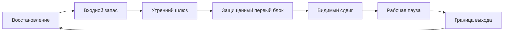
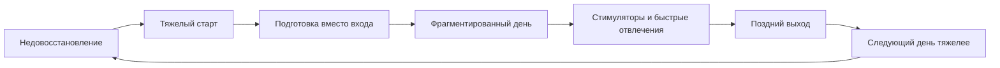

# Глава 22. Ресурсность, сила и ритуалы

## Почему правил фокуса недостаточно

Предыдущая глава разобрала фокус, WIP и переключения.

Главный вывод был таким:

```text
фокус - это не держать больше в голове,
а держать меньше в активном состоянии
и лучше сохранять все остальное снаружи
```

Для этого нужны понятные правила:

- ограничивать активный WIP;
- выбирать один глубокий трек на ближайший блок;
- входить через внешний контейнер состояния;
- работать до среза продвижения;
- оставлять контрольную точку;
- отличать срочность от шума;
- не разрывать глубокий блок без причины.

Но у этих правил есть скрытое условие.

Их нужно выполнять в каком-то состоянии.

Если человек ниже ресурсного пола, даже простое правило начинает ощущаться как тяжелая работа. Открыть контейнер задачи трудно. Прочитать контрольную точку трудно. Не открыть новости трудно. Начать первый шаг трудно. Не сорваться в чат трудно. Оставить контрольную точку трудно.

Снаружи это может выглядеть как нехватка дисциплины.

Внутри это часто выглядит иначе:

```text
я понимаю, что надо делать,
но запуск стоит слишком дорого
```

Здесь нужно разобрать состояние, в котором правила фокуса становятся исполнимыми.

В учебнике это состояние называется ресурсностью.

## Ресурсность - не настроение

Слово "ресурсность" легко испортить.

Можно представить его как приятное состояние:

```text
я бодрый
я вдохновлен
мне хочется работать
я на подъеме
```

Иногда это действительно бывает. Хорошее настроение, интерес, энергия, ясность и телесный тонус помогают действовать.

Но для когнитивного инженерства такое определение слишком ненадежно.

Во-первых, настроение может быть хорошим, а режим плохим. Человек может быть возбужден, вдохновлен, наполнен планами, но плохо спать, хватать лишний WIP, не держать границы и покупать сегодняшний разгон завтрашним провалом.

Во-вторых, настроение может быть нейтральным, а режим рабочим. Не обязательно чувствовать эйфорию, чтобы начать важный блок, удержать внимание и оставить нормальную контрольную точку.

Поэтому ресурсность здесь определяется не переживанием, а функцией.

Ресурсность - это рабочий режим, в котором:

- следующий понятный шаг можно начать без чрезмерного внутреннего продавливания;
- внимание можно удержать достаточно долго для первого сдвига;
- вскрывшиеся промежуточные шаги не воспринимаются как катастрофа;
- пауза помогает вернуться, а не уводит в другой контекст;
- к концу дня можно объяснить, куда ушло внимание;
- восстановление реально снижает цену следующего входа.

Коротко:

```text
ресурсность = низкая цена входа, удержания и возврата
```

Это не означает, что работа становится легкой. Сложная задача все равно может быть неприятной, длинной и неопределенной.

Но ресурсный режим делает ее доступной.

## Ресурсный пол и ресурсность

В главе 20 мы уже ввели ресурсный пол.

Ресурсный пол - это минимум состояния, ниже которого действие становится слишком дорогим или разрушительным.

Примерно:

```text
я еще могу работать так,
чтобы не ломать следующий вход
```

Ресурсность - более широкий режим.

Она отвечает не только на вопрос "можно ли вообще работать", а на вопрос:

```text
насколько воспроизводимо я могу входить,
держать контакт,
получать сдвиг
и возвращаться после паузы
```

Различение:

| Слой | Вопрос | Признак |
| --- | --- | --- |
| Ресурсный пол | Не ниже ли система минимума доступности действия? | Работа не покупается разрушением сна, здоровья, качества и следующего входа. |
| Ресурсность | Есть ли рабочий режим с приемлемой ценой входа и возврата? | Начать понятный шаг можно без долгого самопродавливания. |
| Сила | Есть ли входной запас для первых минут сопротивления? | Легче пересечь стартовое трение и не сорваться в быстрый стимул. |

Ресурсный пол - это нижняя граница.

Ресурсность - это рабочий режим.

Сила - это входной запас внутри этого режима.

Эти три вещи нельзя смешивать.

Если человек ниже пола, ему не поможет героический ритуал.

Если пол есть, но ресурсный режим не собран, день будет начинаться каждый раз с тяжелого разгона.

Если режим в целом есть, но мало силы, может не хватать именно входной инициативы: первый шаг кажется слишком тяжелым, хотя после входа работа пошла бы.

## Сила как входной запас

Слово "сила" тоже легко увести в морализм.

В быту оно звучит так:

```text
сильный человек берет и делает
слабый человек не справляется
```

Для учебника такая рамка не годится.

В когнитивном инженерстве сила - это не оценка личности. Это входной запас энергии, инициативы и устойчивости к первому сопротивлению.

Сила нужна в начале блока.

Она помогает:

- не отложить понятный шаг;
- открыть рабочий контейнер, а не ленту;
- выдержать первые минуты тумана;
- не испугаться вскрывшегося промежуточного шага;
- выбрать действие вместо внутреннего торга;
- вернуться после короткой паузы;
- закрыть блок контрольной точкой, когда уже хочется просто уйти.

Сила особенно заметна в переходах.

Когда человек уже внутри задачи и контекст собран, работа может идти легче. Но чтобы попасть внутрь, нужно пересечь входное сопротивление.

Отсюда важное следствие:

```text
силу не нужно тратить на то,
что можно спроектировать средой, ритуалом или внешним контекстом
```

Если задача каждый раз требует героического входа, это плохой дизайн рабочего контура.

Сила должна помогать пройти начало, но не обязана нести весь день на себе.

## Что поднимает и что просаживает входной запас

Внутренние заметки о продуктивности перечисляют разные факторы: сон, вода, движение, медитация, чтение, общение, самоподдержка, ограничения, а также то, что просаживает режим: шум, бесконтрольные переключения, новости, игры, сладкая еда, кофе как краткий разгон ценой последующей просадки.

Здесь нельзя превращать этот список в универсальный рецепт.

Для разных людей и периодов конкретные факторы будут различаться. Кроме того, часть факторов требует медицинской, бытовой или контекстной проверки. Эта глава не должна давать протокол здоровья.

Но можно выделить общие классы.

| Класс | Как помогает | Где риск |
| --- | --- | --- |
| Сон и восстановление | Возвращают систему выше ресурсного пола. | Недосып нельзя надежно компенсировать ритуалом. |
| Движение | Может поднять тонус, внимание, настроение и телесную готовность. | Не должно становиться еще одной обязанностью сверх восстановления. |
| Вода, еда, телесная базовая забота | Снижает лишние телесные причины просадки. | Нельзя превращать в псевдомедицинские обещания. |
| Защита внимания | Сохраняет входной запас от шума и быстрых стимулов. | Слишком жесткая изоляция может ломать реальные обязанности. |
| Интерес и смысл | Поддерживают инициативу и переживание ценности времени. | Вдохновение не заменяет структуру действия. |
| Общение и поддержка | Возвращают связанность и нормализуют состояние. | Социальность может стать обходом трудного входа. |
| Осознанность / медитация | Может помогать некоторым людям снижать напряжение и замечать состояние до импульсивного действия. | Данные неоднородны; это не универсальная починка фокуса, мотивации или сна. |
| Кофеин | Может кратко поднять бдительность и устойчивость к монотонному наблюдению, особенно при усталости. | Не восстанавливает систему; может ухудшать сон, тревожность и будущий вход. |
| БАДы и омега-3 | Могут быть медицинским или пищевым вопросом в конкретном контексте. | Не должны входить в учебник как общий способ улучшить когнитивную работу. |
| Ограничения | Уменьшают импульсивное распыление. | Ограничение ради борьбы может добавить лишнюю цену. |

У сна здесь есть два разных слоя.

Первый — недосып. Если система недоспала, особенно страдают бдительность и устойчивое внимание, а при более выраженном недосыпе дорожают рабочая память, торможение и гибкость. Это значит, что утренний ритуал не должен маскировать плохое состояние красивой процедурой. Иногда правильный вход — не героический глубокий блок, а сужение задачи, подготовка среды, сбор контекста и перенос самой дорогой части.

Второй — циркадное окно. Одна и та же задача может иметь разную цену в разное время суток. Это не повод строить жесткую типологию "я сова, значит могу только ночью" или "правильные люди работают только утром". Это повод проектировать рабочий режим честнее:

```text
дорогие задачи ставить туда,
где у системы больше шансов удержать внимание,
а не туда, где календарь случайно оставил дырку
```

Отдельно нужно сказать про трекеры: HRV, оценку сна, оценку готовности и похожие метрики.

Они могут быть полезны как внешние сигналы. Иногда они помогают заметить, что последние дни были тяжелее, чем казалось: сон хуже, восстановление ниже, нагрузка выше, организм реагирует. Это ценно, потому что человек часто привыкает к просадке и считает ее нормой.

Но метрика не должна становиться маленьким начальником рабочего дня.

Плохая формула:

```text
низкий HRV -> нельзя делать сложное
высокая оценка готовности -> можно давить сильнее
```

Рабочая формула:

```text
метрика дала сигнал -> проверяю контекст ->
сравниваю с поведением -> выбираю формат входа
```

Если HRV или оценка готовности ниже обычного, можно спросить:

- что было со сном;
- есть ли болезнь или физическая нагрузка;
- не накопился ли WIP;
- не было ли алкоголя, поздней еды, смены режима, стресса;
- какая задача сегодня самая дорогая;
- можно ли начать ее меньшим шагом;
- что покажет реальное поведение в первые 10-20 минут.

Иногда ответом будет отдых. Иногда - облегченный вход. Иногда - обычная работа, но без расширения WIP. Иногда - перенос самого дорогого решения. Главное, чтобы число не заменяло наблюдение за системой.

Главный принцип:

```text
фактор полезен,
если снижает цену входа в нужный режим
и не повышает будущую цену восстановления
```

Если короткий стимул помогает начать, но затем увеличивает рассеянность, тревогу, недосып или вечерний откат, это не ресурсность. Это заем.

То же правило относится к более "мягким" практикам и добавкам. Практика осознанности может быть полезным наблюдением за состоянием, но она не заменяет сон, разгрузку WIP, восстановление и работу с угрозой. Кофеин может дать короткий подъем бдительности, но не доказывает, что система восстановлена. БАДы, включая омега-3, не должны становиться учебниковым советом по улучшению мышления: для таких решений важны здоровье, питание, противопоказания и профессиональная оценка, а не красивая когнитивная метафора.

## Петля ресурсного режима

Ресурсность лучше понимать как петлю.

Вопрос схемы:

```text
как состояние, ритуал входа, первый блок, пауза и выход
поддерживают друг друга,
чтобы ресурсность была рабочим режимом, а не настроением?
```



Граница схемы: это не расписание "правильного человека" и не новый список обязанностей. Узлы петли можно реализовать по-разному; важна функция - снижать цену входа и будущего восстановления.

Разберем ее.

### Восстановление

Восстановление возвращает систему к состоянию, где действие вообще доступно.

Это не награда после работы и не роскошь. Это условие повторяемости.

Если восстановление не происходит, человек может какое-то время держаться на тревоге, долге, обещаниях и внешнем давлении. Но цена входа будет расти.

В таком режиме сила тратится не на трудное действие, а на преодоление поврежденного состояния.

### Входной запас

После восстановления появляется запас, с которым можно войти в день.

Он не обязан быть большим. Часто достаточно, чтобы человек мог:

- встать без долгого внутреннего торга;
- не начать день с шумного канала;
- выбрать первый блок;
- выдержать первые минуты без немедленного облегчения.

Если входного запаса нет, утро начинает искать суррогаты: новости, переписки, подготовительные мелочи, кофе, быстрые удовольствия, бесконечное планирование.

### Утренний шлюз

Утренний шлюз переводит человека из бытового режима в рабочий.

Это может быть короткий ритуал, но его задача не в том, чтобы выполнить красивый список действий.

Его задача:

```text
сделать первый важный блок возможным
```

Если ритуал не приводит к блоку, он не шлюз, а отдельная активность.

### Защищенный первый блок

Первый блок дня часто несет большую цену.

Если он отдан чатам, новостям, мелочам или чужим ожиданиям, рабочий режим может так и не собраться.

Защищенный первый блок не обязательно должен быть длинным. Но он должен дать:

- вход в один выбранный контекст;
- один вопрос или кусок продвижения;
- минимум переключений до первого сдвига;
- контрольная точка на выходе.

### Видимый сдвиг

Ресурсный режим укрепляется, когда человек видит, что действие что-то изменило.

Не обязательно завершение. Достаточно среза:

- стал ясен следующий шаг;
- закрыта гипотеза;
- собраны факты;
- написан кусок текста;
- принято решение;
- уменьшилась неопределенность.

Без видимого сдвига ритуалы и дисциплина начинают ощущаться как пустой контроль.

### Рабочая пауза

Рабочая пауза нужна, чтобы снять часть нагрузки и вернуться в тот же режим.

Она отличается от полноценного отдыха.

Полноценный отдых может вывести человека в другой жизненный контекст. Это нужно и правильно. Но внутри рабочего дня такая смена режима может потребовать нового полного входа.

Рабочая пауза устроена иначе:

```text
восстановиться немного,
не потеряв рабочую орбиту
```

Например, отойти от экрана, пройтись, подышать, сменить позу, выпить воды, посмотреть вдаль. Конкретная форма индивидуальна. Важна функция: после паузы вернуться дешевле.

### Граница выхода

День должен уметь заканчиваться.

Если вечер постоянно превращается в компенсацию плохо собранного дня, восстановление срезается. Следующий день начинается дороже. Потом снова нужен вечерний нажим.

Граница выхода защищает не лень, а будущий вход.

Минимальный выход:

```text
что сегодня сдвинулось
что осталось открытым
где следующий вход
что нужно восстановить до завтра
```

## Петля ложной ресурсности

Теперь посмотрим на противоположную петлю.

Вопрос второй схемы:

```text
как недовосстановление маскируется под подготовку,
разгон и занятость,
но делает следующий день тяжелее?
```



Начинается она с недовосстановления.

Человек просыпается уже с долгом. Тело не собрано. Внимание вязкое. Первый шаг кажется слишком дорогим.

Потом появляется тяжелый старт. Нужно бы войти в важный блок, но вход неприятен.

На месте входа появляется подготовка:

- еще немного почитать;
- еще раз распланировать;
- проверить сообщения;
- открыть несколько вкладок;
- навести порядок;
- "сначала разогнаться";
- найти правильное настроение.

Некоторая подготовка действительно нужна. Но подготовка становится проблемой, когда не имеет точки перехода в действие.

Дальше день фрагментируется. Мелкие задачи, входящие сообщения и короткие стимулы дают ощущение движения, но не собирают глубокий контекст.

Затем подключаются стимуляторы и быстрые отвлечения. Они могут дать краткий разгон или облегчение. Но если они ухудшают сон, внимание, границы и возвращение к задаче, они не восстанавливают ресурсность, а маскируют ее просадку.

Вечером человек пытается догнать день. Поздний выход срезает восстановление.

На следующий день старт еще тяжелее.

Это петля не "плохого характера", а плохой экономики состояния.

## Ритуал состояния и ритуал задачи

В главе 6 мы уже говорили о ритуалах входа и выхода.

Там речь шла о ритуале задачи:

```text
открыть рабочий журнал
восстановить цель и состояние
назвать туман
выбрать первый проверяемый шаг
оставить контрольную точку на выходе
```

В этой главе появляется другой тип: ритуал состояния.

Его задача:

```text
перевести человека из одного режима в другой
```

Например:

- из сна и бытового утра в рабочий день;
- из рассеянности в первый фокусный блок;
- из рабочего блока в рабочую паузу;
- из рабочего дня в восстановление.

Различение:

| Ритуал | Что переводит | Главный критерий |
| --- | --- | --- |
| Ритуал состояния | Человека между режимами. | После него легче войти в нужный режим. |
| Ритуал задачи | Рабочее состояние конкретной задачи. | После него легче продолжить конкретную задачу. |

Оба типа нужны.

Если есть ритуал состояния, но нет ритуала задачи, человек может быть бодрым, но не знать, куда приложить внимание.

Если есть ритуал задачи, но нет состояния, человек может понимать следующий шаг, но не иметь входного запаса.

## Утренний шлюз

Утренний ритуал - частный случай ритуала состояния.

Лучше называть его утренним шлюзом.

Слово "шлюз" здесь полезнее, чем "зарядка" или "мотивация", потому что оно подчеркивает переход:

```text
бытовой режим -> рабочий режим
```

Утренний шлюз должен решать несколько задач:

1. Завершить рассеянное начало дня.
2. Дать телу простой сигнал запуска.
3. Не открыть шум до первого важного блока.
4. Поднять карту дня на минимальном уровне.
5. Выбрать первый рабочий контекст.
6. Довести человека до действия.

Он не обязан быть длинным.

Более того, длинный ритуал может стать ловушкой.

Если человек час собирает себя, но затем не входит в важный блок, ритуал стал отдельным проектом.

Рабочий критерий:

```text
после утреннего шлюза первый важный блок начался дешевле,
чем без него
```

Не:

```text
я идеально выполнил список
```

Пример минимального утреннего шлюза:

```text
1. Телесный старт: вода, движение, свет, базовая гигиена.
2. Сборка внимания: короткое чтение или recall без открытия шумных каналов.
3. Выбор первого блока: один трек, один вопрос, один первый шаг.
4. Переход к задаче: открыть контейнер, прочитать контрольную точку, начать.
```

Конкретные пункты можно менять. Нельзя менять функцию:

```text
ритуал должен заканчиваться входом в действие
```

## Привычка фокуса

Привычка - это не магическое исчезновение усилия.

Привычка возникает, когда поведение многократно повторяется в похожем контексте и постепенно начинает запускаться легче по сигналу среды.

Для когнитивного инженерства это важно.

Если каждый день начинается по-разному, в разных каналах, с разной логикой, без стабильного первого шага, фокус каждый раз приходится собирать заново.

Если же есть устойчивый сигнал, действие и выход, система начинает узнавать маршрут.

Например:

```text
если начался первый рабочий слот,
то я открываю контейнер выбранного трека,
читаю последнюю контрольную точку,
выбираю один вопрос
и работаю до первого среза
```

Это не гарантирует идеального фокуса. Но снижает цену запуска.

Привычка фокуса строится из нескольких элементов.

| Элемент | Вопрос |
| --- | --- |
| Контекст | В какой ситуации привычка должна запускаться? |
| Сигнал запуска | Какой сигнал говорит: "начинаем"? |
| Первое действие | Что настолько мало и ясно, что его можно сделать даже без вдохновения? |
| Защита | Что не должно попасть в этот момент? |
| Срез | Как понять, что блок не был пустым? |
| Выход | Что оставить для следующего входа? |

Пример:

```text
Контекст: первый рабочий слот после утреннего шлюза.
Сигнал запуска: ноутбук открыт, календарь проверен, шумные каналы закрыты.
Первое действие: открыть заметку выбранного трека.
Защита: не открывать чат до первой контрольной точки.
Срез: закрыта одна гипотеза или выбран следующий шаг.
Выход: записать "остановился / дальше".
```

Здесь нет героизма. Есть повторяемый маршрут.

## Почему "21 день" - плохая опора

Популярная культура любит точные числа:

```text
привычка формируется за 21 день
```

Для серьезного учебника так писать нельзя.

Реальное формирование привычек зависит от поведения, контекста, сложности, повторяемости, пропусков, награды, среды и состояния человека. Простая привычка может автоматизироваться быстрее. Сложная рабочая практика - значительно дольше и не полностью.

Кроме того, привычка фокуса не похожа на привычку выпить стакан воды после завтрака.

Фокусный блок включает:

- восстановление состояния задачи;
- подавление альтернатив;
- удержание цели;
- работу с неопределенностью;
- срез продвижения;
- оставление контрольной точки.

Это составная практика. Она может стать более привычной, но не станет полностью автоматической.

Поэтому цель не:

```text
сделать фокус автоматическим навсегда
```

А:

```text
снизить цену повторяемого входа
```

## Дисциплина как возвращение

Дисциплину тоже часто понимают плохо.

Обычная суровая версия звучит так:

```text
дисциплина - это заставлять себя делать нужное,
несмотря ни на что
```

В ней есть часть правды: иногда действие действительно нужно делать без идеального настроения.

Но если остановиться только здесь, дисциплина превращается в культ нажима.

В когнитивном инженерстве дисциплина - это способность возвращаться к выбранному режиму.

Не идеально держать режим каждый день.

А именно возвращаться.

Потому что сбои будут:

- плохой сон;
- срочное событие;
- затянувшаяся встреча;
- тревожный сигнал;
- усталость;
- ошибка;
- слишком большая задача;
- непредвиденный внешний запрос;
- день, когда интерес ниже обычного.

Если дисциплина понимается как идеальность, любой сбой превращается в поражение.

Если дисциплина понимается как возвращение, сбой становится материалом настройки.

Формула:

```text
дисциплина = заметить отклонение
-> назвать уровень сбоя
-> выбрать ближайший возврат
-> изменить среду или следующий шаг
-> продолжить без самообвинения
```

Это не мягкость. Это более точная инженерная логика.

Самообвинение часто не возвращает режим. Оно добавляет угрозу. Угроза может временно мобилизовать, но повышает цену следующего входа.

Дисциплина как возвращение спрашивает:

```text
где ближайшая точка входа обратно в режим
```

## Прививка дисциплины

В старых заметках есть выражение "прививка дисциплины".

Его можно сохранить, если понимать правильно.

Прививка дисциплины - это не наказание объемом и не доказательство силы характера.

Это тренировка повторяемого возвращения к режиму.

Например, ориентиры вроде:

```text
6 часов продуктивного рабочего времени
2 часа чистого фокуса на обучение
```

нельзя превращать в универсальную норму. В другом календаре, другой роли, другом состоянии и другой нагрузке такие числа могут быть неподходящими.

Но в них есть полезная идея:

```text
режим должен иметь повторяемую практику,
а не существовать только в дни вдохновения
```

Дисциплинарная практика должна проверяться двумя вопросами.

Первый:

```text
она делает профессиональный режим более повторяемым?
```

Второй:

```text
она не ломает восстановление и следующий вход?
```

Если практика укрепляет режим, она полезна.

Если превращается в еще одну норму для самонаказания, она начинает работать против учебника.

## Ситуационный самоконтроль

Самоконтроль часто представляют как внутреннюю борьбу:

```text
я хочу отвлечься,
но силой запрещаю себе
```

Иногда такая борьба нужна. Но проектировать весь рабочий режим вокруг постоянной борьбы - плохая идея.

Надежнее снижать вероятность борьбы заранее.

Это называется ситуационным уровнем самоконтроля.

Примеры:

- не открывать шумные каналы до первого блока;
- убрать быстрые развлечения из рабочего окружения;
- подготовить контейнер задачи вечером;
- заранее выбрать первый рабочий трек;
- держать рабочую паузу без личного контента;
- сделать нужный первый шаг физически ближе;
- сделать отвлечение чуть менее доступным;
- договориться о канале настоящей срочности.

Такие решения не делают человека слабее. Они экономят силу.

Формула:

```text
хороший самоконтроль начинается до момента искушения
```

Если каждое утро приходится заново бороться с телефоном, новостями, чатами, хаосом вкладок и неопределенным первым шагом, система тратит силу до начала работы.

Когнитивное инженерство спрашивает:

```text
какую часть борьбы можно заменить устройством среды
```

## Ритуал или подготовительная прокрастинация

У ритуалов есть опасная сторона.

Они могут стать способом не начинать.

Человек говорит:

```text
сначала надо собраться
сначала надо привести систему в порядок
сначала надо прочитать
сначала надо настроиться
сначала надо выбрать идеальный план
```

Иногда это правда. Но часто это подготовительная прокрастинация.

Отличие простое:

| Ритуал | Подготовительная прокрастинация |
| --- | --- |
| Имеет точку перехода к действию. | Постоянно добавляет еще один подготовительный шаг. |
| Снижает цену входа. | Отодвигает вход. |
| Короткий и повторяемый. | Разрастается и требует идеальных условий. |
| После него начинается первый блок. | После него хочется еще подготовиться. |
| Проверяется сдвигом. | Проверяется ощущением "я почти готов". |

Правило:

```text
любой ритуал должен иметь стоп-точку
```

Например:

```text
после воды, короткого движения и открытия контейнера задачи
я выбираю первый шаг и начинаю 25-40 минут работы
```

Если после ритуала работа не начинается, нужно ремонтировать ритуал.

Не удлинять его.

## Рабочая пауза и отдых

Глава 20 уже развела рабочую паузу, личный отдых и прокрастинационное облегчение.

Здесь это различение возвращается как часть ресурсного режима.

Рабочая пауза нужна внутри рабочего дня.

Ее задача:

```text
снять часть нагрузки,
не открывая новый тяжелый контекст
```

Полноценный отдых нужен за границей работы.

Его задача:

```text
вывести систему из рабочего режима
и восстановить ее глубже
```

Проблема возникает, когда внутри рабочего блока человек открывает полноценный личный контекст: игры, новости, длинные переписки, хобби, спор, покупку, видео, социальную ленту.

Такой перерыв может быть приятным. Но он часто требует нового входа в работу.

В ресурсном режиме хорошая пауза помогает следующему шагу, а не увеличивает его цену.

Минимальный критерий:

```text
после рабочей паузы вернуться легче,
чем до нее
```

Если после паузы вход стал дороже, это был не тот тип паузы для текущего места дня.

## Карта ресурсного режима

Практический инструмент главы - карта ресурсного режима.

Она не должна быть большой.

Шаблон:

| Слой | Вопрос | Состояние сейчас | Малый ремонт |
| --- | --- | --- | --- |
| Сон и восстановление | Я выше ресурсного пола? | ... | ... |
| Входной запас | Есть ли сила на первый шаг? | ... | ... |
| Утренний шлюз | Как я перехожу в рабочий режим? | ... | ... |
| Первый блок | Что получит защищенный вход? | ... | ... |
| WIP | Что лишнее живет в голове? | ... | ... |
| Паузы | Возвращают ли паузы в работу? | ... | ... |
| Выход | Что защитит восстановление вечером? | ... | ... |

Заполнять ее каждый день не обязательно.

Она нужна, когда режим начал распадаться:

- трудно стартовать;
- ритуалы не помогают;
- работа дробится;
- паузы превращаются в уход;
- вечером непонятно, куда ушел день;
- следующий вход дорожает.

Цель карты - найти слой, где нужен ремонт.

Не всегда нужен новый ритуал.

Иногда нужен сон.

Иногда - убрать лишний WIP.

Иногда - сделать первый шаг яснее.

Иногда - разделить работу и отдых.

Иногда - признать, что нагрузки слишком много.

## Диагностика: где именно сбой

Полезная таблица:

| Сигнал | Возможный слой | Первый вопрос |
| --- | --- | --- |
| Трудно начать даже понятный шаг | Сила / входной запас | Есть ли восстановление и утренний шлюз? |
| Непонятно, что делать | Контекст задачи | Есть ли цель, туман, гипотеза и первый шаг? |
| Все время тянет переключаться | WIP / среда | Сколько активных контекстов живет в голове? |
| Ритуал растет, а работа не начинается | Подготовительная прокрастинация | Где стоп-точка ритуала? |
| Пауза уводит в другой мир | Граница работы и отдыха | Какой тип паузы нужен внутри рабочего блока? |
| Вечером приходится догонять день | Защита первого блока / WIP | Что съело первый вход? |
| После отдыха вход не возвращается | Глубже, чем ритуал | Не нужно ли менять нагрузку, условия или обращаться за помощью? |

Такая диагностика защищает от одной типичной ошибки:

```text
чинить все дисциплиной
```

Не все сбои являются сбоями дисциплины.

Если неясен первый шаг, нужна работа с контекстом.

Если много активного WIP, нужна разгрузка и контейнеры состояния.

Если нет восстановления, нужен режим восстановления.

Если ритуал стал прокрастинацией, нужна стоп-точка.

Если среда постоянно разрывает фокус, нужны договоренности.

Дисциплина важна, но она не должна быть универсальным пластырем.

## Минимальный протокол ресурсного входа

Соберем практику.

Минимальный протокол на начало дня или сложного блока:

```text
1. Проверить состояние: я выше ресурсного пола?
2. Убрать один источник шумного входа.
3. Выбрать один первый рабочий трек.
4. Открыть его контейнер состояния.
5. Прочитать последнюю контрольную точку.
6. Назвать один первый шаг.
7. Начать блок до первого среза.
8. На выходе записать контрольную точку.
```

Если на шаге 1 ответ "нет", не нужно притворяться, что проблема решается силой.

Тогда первый вопрос:

```text
что минимально вернет систему выше пола
или какую нагрузку нужно снять
```

Если на шаге 4 нет контейнера, первым блоком может быть не "решить задачу", а собрать контекст задачи.

Если на шаге 6 нет первого шага, значит проблема не в ресурсности, а в тумане задачи.

Протокол нужен не для того, чтобы всегда идти по нему идеально. Он нужен, чтобы видеть место разрыва.

## Когда ресурсность не чинится ритуалом

Есть состояния, где этот слой работы должен остановиться.

Если человек системно не восстанавливается, ритуалы могут стать еще одним источником давления.

Красные флаги:

- после нормального отдыха вход не становится легче;
- сон устойчиво нарушен;
- утро начинается с постоянного провала или тревоги;
- работа вызывает отвращение, а не только сопротивление;
- тело постоянно в напряжении или истощении;
- любые паузы превращаются в обрушение;
- человек держится только на обязательстве или страхе;
- даже малый понятный шаг кажется недоступным;
- нагрузка явно выше пропускной способности;
- среда не дает права на восстановление.

В таких случаях вопрос не:

```text
какой ритуал добавить
```

А:

```text
какую нагрузку, угрозу, состояние здоровья или среду нужно менять
```

Глава 22 не является медицинским или терапевтическим протоколом. Она дает модель рабочего режима.

Если режим не возвращается, дальше нужны главы 23-25: поломка мотивационного контура, выгорание, профессиональная скука и восстановление управляемости.

## Что это добавляет к учебнику

До этого места учебник показал:

- задача должна иметь внешний контекст;
- рабочий журнал и ритуалы защищают вход и выход;
- мотивация зависит от ценности, угрозы, управляемости, цены усилия и состояния;
- сон и восстановление поддерживают обучение и следующий вход;
- продуктивность в этой рамке сохраняет будущую доступность действия;
- фокус требует ограничения активного WIP и нормальных правил переключения.

Глава 22 добавляет условие исполнимости этих правил:

```text
человеку нужен ресурсный режим,
в котором правильные действия не требуют постоянного героизма
```

Ресурсность - это не настроение и не вечная бодрость. Это инженерно наблюдаемое состояние:

```text
вход дешевле
фокус держится дольше
промежуточные шаги переносимы
паузы возвращают
выход защищает восстановление
следующий день не начинается с долга
```

Сила - это входной запас, который помогает пройти начало.

Ритуал - это шлюз между режимами.

Привычка снижает цену повторяемого входа.

Дисциплина возвращает к режиму после сбоя.

После этой главы становится видно, почему следующая тема - поломка мотивационного контура. Если ресурсность системно исчезает, если ритуалы перестают помогать, если сила тратится только на выживание рабочего дня, нужно смотреть глубже: как ломается связь между ценностью, усилием, управляемостью, обратной связью, восстановлением и телесным бюджетом.

## Источниковая опора

Проверенный пакет для этой главы: [[../Источники/2026-05-25 Пакет источников для главы 22]].

Ключевые источники в авторско-годовой форме:

- Meijman & Mulder (1998), Geurts & Sonnentag (2006), Sonnentag & Fritz (2007), Sonnentag, Cheng & Parker (2022), Lim & Dinges (2010), Wüst et al. (2024), Cao, Xie & Ma (2025), Cajochen & Schmidt (2025), Thayer & Lane (2000), Smith et al. (2017), Magnon et al. (2022), Tinello, Kliegel & Zuber (2022), Laborde, Mosley & Thayer (2017), Muller et al. (2021): восстановление, сон, циркадное время, HRV/автономная регуляция и усталость как условия доступности действия, с границами по метрикам.
- Wood & Neal (2007), Wood & Runger (2016), Lally et al. (2010), Gardner, Lally & Wardle (2012): психология привычек, сигналы среды и формирование привычек в реальной жизни без мифа о "21 дне".
- Gollwitzer (1999), Gollwitzer & Sheeran (2006), Adriaanse et al. (2011), Duckworth, Gendler & Gross (2016): намерения по схеме "если - то", разрушение привычек и ситуационный самоконтроль.
- Chang et al. (2012), Ludyga et al. (2020), Basso & Suzuki (2017): физическая нагрузка и движение как контекстно-зависимая поддержка настроения, познания и готовности, а не универсальная оптимизация.
- Goyal et al. (2014), Van Dam et al. (2018), Lao, Kissane & Meadows (2016), McLellan, Caldwell & Lieberman (2016), Brainard et al. (2020): практики осознанности, кофеин и омега-3 как разные зоны доказательности; возможная контекстная поддержка, но не универсальное обещание когнитивного усиления.
- Внутренние авторские материалы по продуктивности: ресурсный пол, ресурсность, сила, утренний шлюз, привычка фокуса, дисциплина как возвращение и границы ритуалов.

Доказательная роль блока: `strong` для связи восстановления, сна и усталости с доступностью действия, а также для механизмов привычек и намерений "если - то"; `context-dependent` для HRV, циркадного планирования, ритуалов, утренних шлюзов, двигательных пауз, кофеина как краткосрочной поддержки бодрости и переноса в личную продуктивность; `mixed` для универсальных обещаний движения, практик осознанности, HRV-биообратной связи, оценок готовности, хронотипных схем или ритуалов; `weak/mixed` для широких заявлений об омега-3, добавках и познании; `clinical-boundary` для хронической усталости, нарушений сна, тревоги, депрессии, БАДов, HRV-диагностики, кофеина как вопроса здоровья/дозировки и медицинских решений. Глава не превращает ресурсность в настроение, силу в моральную характеристику, а ритуал в обязательную магическую процедуру.

Полные библиографические записи и DOI сохранены в пакете главы. В текущей редакции глава оставляет короткий авторско-годовой блок как читательский ориентир.

## Короткое резюме

- Ресурсность - это рабочий режим, в котором вход в действие имеет приемлемую цену.
- Сила помогает пройти старт, но не заменяет восстановление, внешний контекст и правила WIP.
- Сон, циркадное окно и накопленная усталость меняют цену входа, поэтому ритуал не должен маскировать плохое состояние.
- HRV и оценка готовности могут быть сигналами для проверки состояния, но не прямыми командами к рабочему решению.
- Ритуал полезен, если переводит систему в нужный режим и экономит больше внимания, чем стоит.
- Привычка снижает цену повторяемого входа, но не отменяет усилие навсегда.
- Если ресурсность не возвращается после нормального восстановления, проблема уже может быть в нагрузке, угрозе, состоянии здоровья или среде.

## Вопросы для самопроверки

1. Чем ресурсность отличается от хорошего настроения?
2. Почему ритуал может стать подготовительной прокрастинацией?
3. Что показывает, что привычка фокуса реально снижает цену входа?
4. Где в вашем рабочем режиме дисциплина является возвращением, а где - самонаказанием?
5. Как понять, что задача стоит в плохом окне состояния, а не просто "не хочется"?
6. Какую роль могут играть HRV и оценка готовности, если не отдавать метрике власть над днем?
7. Какие красные флаги говорят, что ритуал уже не является правильным уровнем вмешательства?

## Мини-практика

Разберите один повторяющийся вход в работу:

```text
сигнал, после которого должен начаться вход:
первое действие ритуала:
момент, где ритуал должен закончиться:
первый рабочий шаг:
что обычно уводит в ложную ресурсность:
какая контрольная точка подтверждает, что вход состоялся:
```

Если ритуал не заканчивается рабочим контактом, сократите его до минимального шлюза: один сигнал, одно действие подготовки, один первый шаг.

## Статус

`ready-for-review`

Ревизия блока: [[../Проверки/2026-05-25 Ревизия блока 20-25]].
