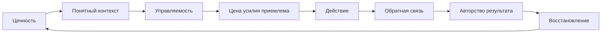
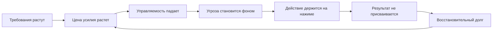

# Глава 23. Как ломается мотивационный контур

## После ресурсности

Предыдущая глава разобрала ресурсность.

Главный вывод был таким:

```text
ресурсность - это не настроение,
а рабочий режим,
в котором вход, удержание и возврат
имеют приемлемую цену
```

Если такой режим есть, правила продуктивности становятся выполнимыми. Можно ограничить WIP. Можно открыть рабочий контейнер. Можно войти в первый блок. Можно оставить контрольную точку. Можно не превращать каждую паузу в выпадение из дня.

Но есть состояния, где эта логика перестает работать.

Человек пытается восстановиться, но вход не становится легче. Настраивает ритуал, но ритуал превращается в еще одно требование. Пытается ограничить WIP, но любая задача ощущается как новая угроза. Делает результат, но не чувствует завершения. Отдыхает, но отдых не возвращает прежнюю доступность действия.

Тогда вопрос уже не в том:

```text
какой еще прием продуктивности добавить
```

Вопрос глубже:

```text
где ломается мотивационный контур
```

Здесь нужна именно такая карта перехода.

Она не диагностирует выгорание и не заменяет медицинскую или терапевтическую помощь. Она дает инженерную карту: какие связи в системе действия могут расходиться, почему человек может перестать входить в работу даже при высокой ценности задачи, и почему совет "надо сильнее мотивироваться" иногда ухудшает состояние.

## Нормальный мотивационный контур

Соберем сначала нормальную рабочую петлю.

В простом виде действие держится не на одном желании, а на нескольких связях:

Вопрос схемы:

```text
какие связи должны работать,
чтобы ценность превращалась в действие,
результат и новый доступный вход?
```



Эта схема не означает, что человек всегда проходит все шаги сознательно.

Она показывает, что делает действие устойчивым.

Есть ценность: понятно, зачем задача вообще важна.

Есть контекст: понятно, что сейчас известно, что туманно, где первый проверяемый шаг.

Есть управляемость: человек ожидает, что его действие может изменить исход хотя бы на небольшую величину.

Цена усилия приемлема: тело, внимание и состояние позволяют заплатить эту цену без разрушения следующего входа.

Есть действие: не бесконечное думание о задаче, а реальный контакт с материалом.

Есть обратная связь: после шага стало видно, что изменилось.

Есть авторство результата: человек может сказать "это сделал я", "я понял вот это", "я продвинул задачу вот сюда", а не только "день куда-то исчез".

Есть восстановление: система закрывает часть цены и возвращает возможность следующего входа.

Когда эти связи работают, сложная работа не становится легкой. Но она остается доступной.

## Поломка редко происходит в одной точке

Бытовой язык часто говорит:

```text
у меня пропала мотивация
```

Но это слишком грубо.

Мотивация редко исчезает как выключенный свет. Чаще расходятся связи внутри контура.

Задача может оставаться важной, но вызывать угрозу.

Следующий шаг может быть понятен, но цена входа слишком высока.

Усилие может быть вложено, но результат не виден.

Результат может быть объективно полезным, но не присваиваться человеком.

Отдых может быть, но не возвращать доступность действия.

Снаружи все это похоже на одну картинку:

```text
человек хуже работает
```

Внутри это разные механизмы.

| Что видно | Где может быть разрыв |
| --- | --- |
| "Не могу начать" | цена входа, угроза, состояние, туман задачи |
| "Не вижу смысла" | ценность перестала связываться с результатом |
| "Все равно ничего не изменится" | низкая управляемость |
| "Я устал от самой мысли" | цена усилия стала слишком высокой |
| "Я что-то делаю, но это не считается" | разрыв обратной связи и авторства |
| "После отдыха не лучше" | восстановление не закрывает долг |
| "Меня все раздражает" | контакт с работой стал сигналом угрозы |

Поэтому первый шаг в когнитивном инженерстве - не спорить с человеком о дисциплине, а найти место разрыва.

## Когда требования растут быстрее ресурсов

В рабочих исследованиях выгорания часто используют язык требований и ресурсов.

Требования - это не только количество задач.

К требованиям относятся:

- объем работы;
- срочность;
- неопределенность;
- эмоциональная нагрузка;
- ответственность;
- необходимость часто переключаться;
- риск ошибки;
- конфликтующие ожидания;
- необходимость быть доступным;
- сложность коммуникации;
- постоянная недосказанность.

Ресурсы - это тоже не только отдых.

К ресурсам относятся:

- управляемость;
- автономия;
- понятная постановка задачи;
- обратная связь;
- поддержка;
- время на восстановление;
- право на фокус;
- ясные критерии качества;
- признание результата;
- возможность влиять на способ работы;
- достаточный уровень навыка;
- предсказуемость среды.

Поломка начинается там, где требования устойчиво растут быстрее ресурсов.

Поначалу человек может компенсировать это силой, интересом, ответственностью или тревогой. Он берет больше, быстрее отвечает, дольше работает, держит несколько треков, срезает паузы, переносит восстановление "на потом".

Такой режим может дать результат на коротком отрезке.

Но если он становится нормой, система начинает покупать действие восстановительным долгом.

```text
требования растут
-> ресурсов и контроля не хватает
-> действие держится на нажиме
-> восстановление не закрывает цену
-> следующий вход дороже
-> требуется еще больше нажима
```

Это уже не высокая продуктивность. Это деградация контура.

## Предвыгорание: когда проблема выглядит как сила

Самая коварная зона - предвыгорание.

На этом этапе человек может не выглядеть сломанным. Наоборот, он может казаться очень вовлеченным.

Он много берет. Быстро отвечает. Соглашается на сложное. Долго держится. Исправляет чужие провалы. Спасает сроки. Продолжает работать вечером. Еще не просит помощи. Может даже чувствовать гордость за свою надежность.

Внутри это часто поддерживается смесью:

- интереса;
- идеализма;
- долга;
- страха подвести;
- желания доказать;
- привычки быть опорой;
- тревоги перед последствиями;
- запрета на остановку.

Проблема не в том, что эти мотивы "плохие".

Проблема в том, что они могут скрыть рост цены.

Если человек продолжает брать нагрузку, но восстановление уже не догоняет, его вовлеченность начинает работать как кредитная карта. Сегодня она покупает результат. Завтра приходит счет.

Поэтому предвыгорание нельзя романтизировать как "сильную мотивацию".

В учебнике это место важно особенно.

Мы уже говорили об опыте преодоления. Там трудность полезна, если она управляемая, дозированная, дает обратную связь и оставляет след роста.

Предвыгорание похоже на преодоление только снаружи.

Внутри различие такое:

| Управляемое преодоление | Предвыгорание |
| --- | --- |
| Трудность дозирована. | Нагрузка растет быстрее восстановления. |
| Есть обратная связь. | Результат сразу поглощается следующим требованием. |
| Есть след роста. | Есть долг и тревога. |
| У человека остается авторство. | Человек становится функцией ожиданий. |
| После усилия возможен следующий вход. | Следующий вход становится дороже. |

Полезная трудность строит способность.

Хроническая чрезмерность тратит способность.

## Эмоциональное истощение

Острая усталость после тяжелого дня - нормальна.

Она говорит:

```text
цена уже заплачена,
нужно восстановление
```

Если восстановление работает, следующий вход постепенно становится доступным.

Эмоциональное истощение - другое состояние.

Оно ближе к такой формуле:

```text
я не просто устал после нагрузки;
я больше не возвращаюсь к прежнему рабочему состоянию
```

Человек может поспать, отдохнуть, отвлечься, закрыть часть задач, но базовая доступность работы не возвращается. Первое включение все равно кажется чрезмерным. Маленькая просьба ощущается как атака. Письмо, встреча, задача или сообщение поднимают не рабочую готовность, а защитное напряжение.

Это не обязательно значит, что человек "не хочет".

Часто он как раз хочет вернуться к нормальному себе.

Но система оценивает действие иначе:

```text
цена высока
угроза рядом
управляемость низкая
восстановление сомнительно
результат не закроет долг
```

Если в этот момент добавить только мотивационный нажим, контур не чинится.

Нажим говорит:

```text
надо еще
```

А система и так живет в режиме "надо еще".

## Ментальная дистанция и цинизм

Следующая важная связка - дистанция.

Когда контакт с работой постоянно приносит цену, угроза и отсутствие авторства, система начинает защищаться снижением контакта.

Это может выглядеть неприятно:

- раздражение;
- холодность;
- циничные комментарии;
- обесценивание задач;
- желание не включаться;
- внутреннее "оставьте меня в покое";
- потеря теплого отношения к работе, команде или пользователям.

Легко сказать:

```text
человек стал хуже относиться к работе
```

Иногда это правда на уровне поведения. Но механистически полезнее спросить:

```text
от чего дистанция защищает
```

Если каждый контакт с работой означает новую срочность, новую вину, новый риск ошибки, новый невидимый результат и отсутствие восстановления, дистанция становится способом экономии.

Цинизм в такой рамке - не добродетель и не оправдание плохого поведения.

Но и не обязательно "плохой характер".

Это может быть защитная форма:

```text
если я перестану считать это важным,
мне будет менее больно вкладываться
```

Когнитивное инженерство не должно романтизировать цинизм. Но оно должно понимать его функцию.

Иначе вмешательство промахнется. Человеку будут говорить "верни вовлеченность", а он бессознательно защищает остатки ресурса от среды, где вовлеченность давно стала дорогой и небезопасной.

## Редукция профессиональной эффективности

Третий большой слой - снижение переживаемой эффективности.

Важно слово "переживаемой".

Человек может объективно делать полезные вещи, но перестать чувствовать, что они имеют вес.

Так происходит, когда:

- критерии результата размыты;
- задачи никогда не закрываются окончательно;
- после каждого результата сразу появляется новый долг;
- обратная связь приходит только в виде ошибок;
- вклад человека не виден в общей системе;
- все значимое считается "само собой";
- нет момента присвоения результата.

В главе 20 мы говорили об объяснимости времени. В главе 22 - о ресурсном режиме. Здесь добавляется еще одна связка:

```text
результат должен замыкаться в авторство
```

Авторство результата - это не самодовольство.

Это способность увидеть:

```text
что изменилось благодаря моему действию
```

Без этого усилие становится невидимой тратой.

Если человек не присваивает результат, мотивационный контур не получает обратного питания. Действие произошло, цена заплачена, но система не получила сигнала:

```text
усилие было не зря
```

Тогда следующий вход становится дороже даже при объективном продвижении.

Именно поэтому в восстановительных главах появится тема авторизации результата: короткой фиксации того, что сделано, зачем это имело смысл и как этот результат теперь можно использовать.

## Как выглядит поломка контура

Соберем динамику целиком.

Вопрос схемы:

```text
как рабочий контур начинает сам поддерживать просадку,
если цена растет, управляемость падает,
а результат не становится опорой?
```



Это не единственный маршрут.

Граница схемы: она не ставит диагноз выгорания и не объясняет любую потерю мотивации одним маршрутом. Она показывает типовую петлю разрыва, после которой нужно проверять уровень помощи и условия среды.

Иногда первой ломается не нагрузка, а смысл. Иногда - управляемость. Иногда - обратная связь. Иногда - восстановление. Но если разрыв долго не чинится, петля начинает сама себя поддерживать.

Цена усилия растет.

Из-за высокой цены человек откладывает вход или входит через тревогу.

Из-за тревоги падает качество внимания.

Из-за падения качества появляется больше ошибок и незакрытых хвостов.

Из-за хвостов снижается управляемость.

Из-за низкой управляемости усилие кажется менее оправданным.

Из-за этого результат слабее присваивается.

Из-за отсутствия присвоения работа не возвращает энергию.

Из-за отсутствия восстановления следующий вход дороже.

Так система может стать самоподдерживающейся.

И в этой точке вопрос "как себя заставить" становится слишком узким.

## Почему мотивационный нажим может ухудшать состояние

Мотивационный нажим - это попытка добавить действие через давление.

Он может выглядеть по-разному:

- "соберись";
- "вспомни, зачем тебе это";
- "надо просто начать";
- "поставь цель";
- "пообещай кому-то";
- "добавь дедлайн";
- "сделай трекер";
- "включи соревнование";
- "повысь ставки".

Иногда это помогает.

Если человек в рабочем окне нагрузки, задача туманна, а первый шаг не выбран, то постановка, дедлайн, внешний контейнер и обратная связь могут действительно оживить контур.

Но если система уже перегружена, нажим добавляет не ресурс, а требование.

Он повышает угрозу.

Увеличивает цену ошибки.

Усиливает стыд за провал.

Делает отдых еще менее безопасным.

Сужает внимание.

И подтверждает внутреннюю модель:

```text
мое состояние не важно,
важно только еще раз поднажать
```

Поэтому перед мотивационным вмешательством нужна проверка.

| Вопрос | Если ответ плохой |
| --- | --- |
| Есть ли понятный первый шаг? | Сначала чинить контекст задачи. |
| Есть ли ощущение управляемости? | Сначала уменьшать шаг и возвращать контроль. |
| Цена усилия приемлема? | Сначала смотреть WIP, угрозу, состояние и восстановление. |
| Есть ли обратная связь? | Сначала сделать результат видимым. |
| Присваивается ли результат? | Сначала вернуть авторство результата. |
| Восстановление работает? | Сначала снижать нагрузку и проверять границы состояния. |

Если эти вопросы пропустить, мотивация легко превращается в новый слой самоизноса.

## Диагностика места разрыва

Для практики удобно держать короткую таблицу.

| Сигнал | Возможный разрыв | Первый инженерный вопрос |
| --- | --- | --- |
| После отдыха вход не дешевеет | восстановление -> цена усилия | Что мешает восстановлению закрыть долг? |
| Работа важна, но отталкивает | ценность -> угроза | Какая угроза захватила ценность? |
| "Все равно ничего не изменится" | управляемость -> действие | Какой минимальный шаг снова может изменить исход? |
| "Я делаю, но это не считается" | обратная связь -> авторство | Где результат должен стать видимым и признанным? |
| Растет цинизм | контакт -> защитная дистанция | От чего дистанция защищает систему? |
| Любой запрос раздражает | требование -> угроза | Не стала ли среда постоянным источником мобилизации? |
| Паузы превращаются в обрушение | рабочая пауза -> восстановление | Пауза восстанавливает или открывает новый долг? |
| Человек держится только на страхе | ценность -> нажим | Что поддерживает действие кроме угрозы? |

Эта таблица не ставит диагноз.

Она помогает не перепутать уровень вмешательства.

Если проблема в тумане задачи, нужен контекст.

Если проблема в WIP, нужен предел активных контекстов.

Если проблема в обратной связи, нужен видимый сдвиг и авторизация результата.

Если проблема в недовосстановлении, новый трекер может стать только еще одним требованием.

## Выгорание как профессиональная граница, а не универсальное слово

Здесь нужно быть точными.

В повседневной речи "выгорание" часто означает что угодно: усталость, скуку, раздражение, потерю интереса, тяжелую неделю, депрессию, ненависть к работе, перегруз или просто желание отпуска.

Для учебника это слишком расплывчато.

В ICD-11 выгорание описывается как профессиональный феномен, связанный с хроническим рабочим стрессом, который не был успешно преодолен. В описании выделяются три измерения:

- истощение или ощущение истощенности энергии;
- ментальная дистанция от работы, негативизм или цинизм по отношению к работе;
- снижение профессиональной эффективности.

Это не значит, что каждый человек с усталостью должен сам ставить себе выгорание.

Наоборот.

Эта рамка нужна как ограничение.

Если человек устал после проекта, это еще не обязательно выгорание. Если ему скучно, это еще не обязательно выгорание. Если он болеет, тревожится, переживает депрессию или хроническое нарушение сна, это может требовать совсем другого уровня помощи.

Для когнитивного инженерства важен не ярлык, а вопрос:

```text
какие связи рабочего мотивационного контура перестали работать
и не чинятся обычным восстановлением
```

## Два маршрута поломки

Глава 24 разберет это подробнее, но уже сейчас нужно обозначить два разных маршрута.

Первый маршрут - перегруз.

Слишком много требований, срочности, угрозы, ответственности, WIP и недостатка восстановления. Система слишком долго живет выше полезного окна нагрузки.

Второй маршрут - недогруз.

Слишком мало смысла, вызова, ответственности, авторства, роста и реальной связи между усилием и результатом. Система не получает достаточной включенности, но все равно остается привязанной к работе как к источнику времени, идентичности и обязательств.

Оба маршрута могут выглядеть как:

```text
нет мотивации
```

Но механизмы разные.

При перегрузе действие слишком дорого.

При недогрузе действие не собирает ценность, авторство и включенность.

Есть и третья граница, которую нельзя пропустить. Иногда "нет мотивации" означает не рабочее выгорание, не профессиональную скуку и не обычную прокрастинацию, а устойчивое снижение направленного действия: человек не просто избегает одной задачи, а теряет способность хотеть, начинать, выбирать, получать интерес или удерживать действие в разных областях жизни.

Такой сигнал нельзя чинить только ритуалом, WIP-лимитом или новым планом. Он может относиться к апатии, ангедонии, депрессивно похожим состояниям, нарушению сна, соматическому состоянию, лекарствам или другому уровню помощи. Для нашей модели это не повод ставить диагноз. Это повод остановиться и сменить уровень вопроса:

```text
это поломка рабочего мотивационного контура
или состояние, где нужна профессиональная оценка и помощь?
```

Если смешать эти случаи, вмешательство будет ошибочным.

Перегруженному человеку не нужен дополнительный вызов.

Хронически недогруженному человеку не всегда поможет только отдых.

Отсюда следующий шаг: развести выгорание и профессиональную скуку.

## Что можно сделать уже на уровне этой главы

Глава 23 не дает полный протокол восстановления. Но она дает первую карту проверки.

Перед тем как "поднимать мотивацию", полезно пройти пять вопросов.

### 1. Контур задачи

```text
есть ли понятный следующий шаг,
или человек каждый раз заново входит в туман
```

Если шага нет, мотивация будет тратиться на борьбу с неопределенностью.

### 2. Контур управляемости

```text
может ли малое действие реально изменить состояние задачи
```

Если человек не видит связи действия с исходом, усилие становится менее разумным.

### 3. Контур цены

```text
не стала ли цена входа выше ценности ближайшего результата
```

Если цена слишком высока, нужен не лозунг, а уменьшение шага, WIP, угрозы или нагрузки.

### 4. Контур обратной связи

```text
становится ли результат видимым
и возвращается ли он человеку как авторство
```

Если нет, действие перестает питать следующий цикл.

### 5. Контур восстановления

```text
возвращает ли отдых доступность следующего входа
```

Если нет, ритуалы и трекеры не должны быть первым ответом.

## Границы самостоятельной работы

Есть состояния, где учебник должен остановиться.

Если у человека устойчиво нарушены сон, аппетит, настроение, способность к повседневным действиям, если есть постоянная тревога, отчаяние, тяжелое истощение, потеря интереса ко всему, мысли о невозможности продолжать или любое состояние, где безопасность под вопросом, это не задача для протокола продуктивности.

Когнитивное инженерство может помочь проектировать рабочие условия, контексты, ритуалы, обратную связь и восстановление.

Но оно не заменяет медицину, психотерапию, кризисную поддержку и изменение объективно вредной среды.

Это ограничение не делает модель слабее.

Оно делает ее честнее.

## Что это добавляет к учебнику

До этого места учебник показывал, как собрать действие:

- вынести контекст из головы;
- восстановить вход в задачу;
- понять мотивацию как систему параметров;
- развести ценность, угрозу, управляемость и цену усилия;
- поддержать обучение через сон, паузы и повторное извлечение;
- проектировать продуктивность без самоизноса;
- ограничивать WIP и поддерживать ресурсность.

Глава 23 показывает обратную сторону:

```text
если эти элементы долго не поддерживают друг друга,
возникает не просто усталость,
а поломка мотивационного контура
```

Человек может продолжать хотеть результата, но терять доступность действия.

Может делать много, но терять авторство.

Может отдыхать, но не восстанавливаться.

Может выглядеть циничным, хотя система просто защищается от слишком дорогого контакта.

Может нуждаться не в новом нажиме, а в изменении нагрузки, управляемости, обратной связи, восстановления и среды.

Два особенно важных маршрута этой поломки - выгорание как верхний перекос перегруза и профессиональная скука как нижний перекос недогруза.

## Источниковая опора

Проверенный пакет для этой главы: [[../Источники/2026-05-25 Пакет источников для главы 23]].

Ключевые источники в авторско-годовой форме:

- World Health Organization (2019/2022), Maslach, Schaufeli & Leiter (2001), Maslach & Leiter (2016): граница выгорания, истощение, цинизм/деперсонализация, сниженная профессиональная эффективность и несоответствие человека и работы.
- Demerouti et al. (2001), Bakker & Demerouti (2017), Karasek (1979), Siegrist (1996), Hobfoll (1989): рабочие требования и ресурсы, модель требования-контроль, дисбаланс усилия и вознаграждения и сохранение ресурсов.
- Meijman & Mulder (1998), Geurts & Sonnentag (2006), Sonnentag, Cheng & Parker (2022), McEwen (1998), McEwen & Wingfield (2003), Muller et al. (2021): восстановительный долг, аллостатическая нагрузка и усталость как рост будущей цены усилия.
- Smeets et al. (2023): источник-граничник против простого утверждения, что стресс устойчиво переводит людей в поведение на привычках.
- Shenhav, Botvinick & Cohen (2013), Maier & Seligman (2016): ожидаемая ценность контроля и выученная беспомощность как мосты от нагрузки к доступности действия.
- Husain & Roiser (2018), Costello, Husain & Roiser (2024): клиническая граница мотивации для апатии/ангедонии и потери целенаправленного поведения.
- Внутренние материалы по выгоранию, авторизации результата и мотивационной системе использованы как язык поломки контура, не как диагностика.

Доказательная роль блока: `strong` для границы профессионального выгорания, рамок JD-R, модели требования-контроль, дисбаланса усилия и вознаграждения, восстановления, аллостатической нагрузки и усталости как цены; `context-dependent` для перевода этих рамок в личную диагностику рабочего контура и утверждений про стресс/привычки; `clinical-boundary` для апатии, ангедонии, депрессии, тяжелого истощения и любого состояния, где "нет мотивации" может требовать другой уровень помощи. Глава не ставит диагноз выгорания, не сводит поломку мотивационного контура к низкой дисциплине, дофамину или кортизолу и не утверждает, что стресс всегда переводит человека в привычки.

Полные библиографические записи и DOI сохранены в пакете главы. В текущей редакции глава оставляет короткий авторско-годовой блок как читательский ориентир.

## Короткое резюме

- Мотивационный контур ломается не одной причиной, а рассогласованием нескольких связей.
- Человек может выглядеть продуктивным, пока система уже покупает результат восстановительным долгом.
- Рост требований при низкой управляемости делает усилие менее разумным для системы.
- Если обратная связь не возвращает авторство результата, действие перестает питать следующий цикл.
- Мотивационный нажим уместнее внутри рабочего окна нагрузки; при перегрузе он часто становится дополнительным требованием.

## Вопросы для самопроверки

1. Где именно может разорваться мотивационный контур?
2. Почему предвыгорание может выглядеть как сила и высокая вовлеченность?
3. Чем эмоциональное истощение отличается от обычной усталости после нагрузки?
4. Почему цинизм иногда является защитной дистанцией, а не только "плохим отношением"?
5. Когда попытка "поднять мотивацию" ухудшает состояние?

## Мини-практика

Выберите одну задачу или рабочий трек, где мотивация заметно просела, и заполните карту разрыва:

```text
ценность еще видна или уже размыта:
следующий шаг понятен или каждый вход начинается с тумана:
есть ли реальная управляемость:
цена входа:
какая обратная связь приходит:
можно ли присвоить результат:
восстановление возвращает следующий вход или нет:
первый уровень вмешательства:
```

Не начинайте с вопроса "как сильнее мотивироваться". Начните с того, какая связь в контуре больше всего повреждена.

## Статус

`ready-for-review`

Ревизия блока: [[../Проверки/2026-05-25 Ревизия блока 20-25]].
