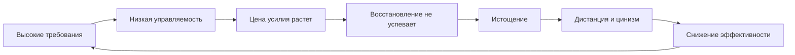
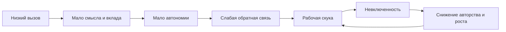

# Глава 24. Выгорание и профессиональная скука

## Два разных ответа на одну фразу

Предыдущая глава разобрала, как ломается мотивационный контур.

Главный вывод был таким:

```text
мотивация проседает не в одном месте,
а через разрыв связей между ценностью,
управляемостью, ценой усилия,
обратной связью, авторством результата
и восстановлением
```

Теперь нужно сделать следующий шаг.

Одна и та же фраза:

```text
у меня нет сил и мотивации
```

может означать два разных маршрута.

Первый:

```text
действовать слишком дорого
```

Второй:

```text
действие не собирает смысл, вызов и авторство
```

В первом случае человек перегружен. Требований, срочности, риска, WIP и внутреннего нажима слишком много. Восстановление не успевает закрывать цену. Работа все чаще воспринимается как угроза.

Во втором случае человек недогружен или плохо включен. Работы может быть мало, или она может быть пустой, слишком простой, фрагментированной, лишенной вклада, автономии и роста. Система не собирает энергию в действие, потому что действие не выглядит достаточно значимым.

Снаружи оба состояния могут быть похожи:

- человек откладывает;
- избегает входа;
- устает;
- раздражается;
- теряет интерес;
- хуже видит результат;
- начинает говорить о работе холоднее.

Но инженерный ответ разный.

Перегруз не лечится новым вызовом.

Недогруз не лечится одним отдыхом.

## Окно полезной нагрузки

В главе 15 мы уже ввели окно полезной нагрузки.

Для сложной интеллектуальной работы вредны оба края:

```text
слишком мало включенности -> задача не собирает внимание
слишком много напряжения -> задача тонет в угрозе и суете
```

Это удобно связывать с законом Йеркса-Додсона, но с оговоркой.

Его не нужно понимать как точную универсальную кривую, по которой можно измерить любой рабочий день. Исторически это исследование было гораздо уже, а популярная "перевернутая U-кривая" часто используется слишком широко.

Для учебника важна не математическая претензия, а практическая эвристика:

```text
сложная работа требует подходящего окна активации
```

В этом окне есть:

- достаточно вызова, чтобы внимание включилось;
- достаточно безопасности, чтобы угроза не захватила контроль;
- достаточно управляемости, чтобы усилие казалось разумным;
- достаточно обратной связи, чтобы результат питал следующий цикл;
- достаточно восстановления, чтобы цена не превращалась в долг.

Выгорание - это верхний перекос.

Профессиональная скука - нижний перекос.

Но это не зеркальные медицинские диагнозы.

Выгорание имеет более сильную институциональную рамку: в ICD-11 оно описано как профессиональный феномен, связанный с хроническим рабочим стрессом, который не был успешно преодолен. Профессиональная скука здесь используется осторожнее: как рабочее название хронического недогруза, скуки и потери включенности. Ее лучше опирать не на популярное слово, а на исследования рабочей скуки, скуки, связанной с работой, характеристик работы и удовлетворения базовых потребностей.

## Матрица перегруза и недогруза

Начнем с общей карты.

| Зона | Требования | Ресурсы, смысл и включенность | Типичный сбой | Первый вопрос |
| --- | --- | --- | --- | --- |
| Полезный вызов | Умеренно высокие. | Достаточно контроля, восстановления, смысла и обратной связи. | Рост и вовлеченность. | Как сохранить окно нагрузки? |
| Маршрут выгорания | Слишком высокие. | Ресурсов, контроля и восстановления мало. | Истощение, дистанция, снижение эффективности. | Что снизить и где вернуть контроль? |
| Маршрут профессиональной скуки | Слишком низкие или пустые. | Смысла, вызова, авторства и роста мало. | Скука, вялость, потеря включенности. | Где вернуть вызов, вклад и рост? |
| Смешанная зона | Много занятости. | Мало смысла и авторства. | Занятая скука, цинизм, распад качества. | Что здесь нагрузка, а что пустое трение? |

Эта таблица нужна не для самодиагностики.

Она нужна, чтобы не ошибиться уровнем вмешательства.

Если человек выше окна нагрузки, новый вызов может добить систему.

Если человек ниже окна включенности, один отдых может ничего не изменить, потому что проблема не только в цене, но и в пустоте действия.

## Выгорание: верхний перекос

Маршрут выгорания начинается там, где нагрузка долго превышает способность системы восстанавливаться и сохранять управляемость.

Это не просто:

```text
много работы
```

Много работы само по себе не обязательно ведет к выгоранию. Сложный проект может быть тяжелым, но развивающим, если у человека есть автономия, команда, ясный критерий результата, восстановление, признание и право влиять на способ работы.

Опасная связка другая:

```text
много требований
мало контроля
мало восстановления
высокая цена ошибки
мало признанного результата
мало права остановиться
```

В такой связке рабочая система сначала мобилизуется. Человек собирается, ускоряется, берет больше, держит сроки, старается не подвести.

Потом тот же режим перестает помогать.

Срочность уже не собирает, а тревожит.

Ответственность уже не дает смысл, а давит.

Обратная связь приходит в основном через проблемы.

Отдых не возвращает прежнюю доступность.

Вход в работу начинает ощущаться не как начало действия, а как вход в угрозу.

Вопрос схемы:

```text
как верхний перекос нагрузки превращает рабочее усилие
в самоподдерживающуюся петлю истощения и дистанции?
```



Граница схемы: это карта маршрута выгорания, а не инструмент самодиагностики. Выгорание имеет профессиональную и клиническую границу; по одной схеме нельзя отличить его от депрессии, нарушений сна, соматического состояния или обычной усталости после проекта.

Эта петля особенно опасна тем, что она может сама себя поддерживать.

Чем хуже эффективность, тем больше тревоги.

Чем больше тревоги, тем дороже вход.

Чем дороже вход, тем больше хвостов.

Чем больше хвостов, тем выше требования.

Чем выше требования, тем слабее восстановление.

В какой-то момент человек начинает жить не в работе, а в постоянном режиме компенсации.

## Три измерения выгорания

В классической рамке выгорание часто описывается через три измерения.

Первое - истощение.

Это не обычная усталость после рабочего блока, а состояние, где рабочая цена не закрывается восстановлением. Человек может отдохнуть формально, но следующий вход все равно начинается с долга.

Второе - ментальная дистанция, негативизм или цинизм по отношению к работе.

Выше уже было сказано: цинизм может быть защитной экономией. Когда контакт с работой слишком дорог, система снижает контакт. Это не оправдывает грубость, холодность или разрушительное поведение, но помогает понять функцию дистанции.

Третье - снижение профессиональной эффективности.

Его важно понимать аккуратно. Иногда человек действительно делает меньше и хуже. Но иногда он делает много, а результат перестает присваиваться. Он не чувствует, что его действие что-то изменило. Вклад растворяется в следующей срочности. Тогда профессиональная эффективность падает не только как внешний показатель, но и как внутреннее ощущение дееспособности.

## Профессиональная скука: нижний перекос

Теперь другой маршрут.

Профессиональную скуку не стоит подавать как такой же официальный термин, как выгорание. Это не диагноз. В учебнике это рабочая метка для нижнего перекоса: хронической рабочей скуки, недогруза, отсутствия вызова, смысла, автономии, обратной связи и ощущения вклада.

Главная ошибка - думать, что низкая нагрузка всегда восстанавливает.

Иногда да.

Если человек был перегружен, снижение нагрузки необходимо.

Но хронический недогруз - другое состояние.

В нем работа не требует настоящего усилия, не дает роста, не вызывает мастерства, не показывает вклад и не возвращает авторство. Время проходит, но человек не чувствует, что его способности участвуют в чем-то значимом.

Тогда возникает не отдых, а пустая включенность.

```text
я формально на работе,
но меня как будто не требуется
```

Это состояние тоже может истощать.

Не через избыток давления, а через дефицит осмысленного контакта.

Вопрос схемы:

```text
как нижний перекос превращает легкость не в восстановление,
а в невключенность, скуку и потерю авторства?
```



Граница схемы: профессиональная скука здесь используется как рабочая рамка хронического недогруза и рабочей скуки, а не как термин с той же институциональной силой, что выгорание.

## Почему скука не равна отдыху

Скуку легко обесценить.

Можно сказать:

```text
тебе же легко, чего ты устал
```

Но рабочая скука - не восстановление.

Восстановление выводит систему из нагрузки и возвращает доступность действия.

Рабочая скука часто оставляет человека привязанным к работе, но не включенным в нее.

Он не отдыхает, потому что должен быть доступен.

Он не развивается, потому что задача не требует реального мастерства.

Он не завершает, потому что результат не ощущается как вклад.

Он не выбирает, потому что автономии мало.

Он не может честно выйти из режима, потому что формально рабочее время продолжается.

Получается парадокс:

```text
нагрузки мало,
но свободы тоже мало
```

Это не ресурсное состояние.

Это состояние низкой включенности.

## Из чего собирается нижний перекос

Исследования рабочей скуки и скуки, связанной с работой, помогают описать этот перекос без бытового морализма.

Речь не только о монотонной конвейерной работе.

Скуку могут создавать:

- слишком простые задачи;
- отсутствие вызова;
- отсутствие разнообразия навыков;
- неясная связь работы с целым результатом;
- низкая значимость задачи;
- отсутствие автономии;
- слабая обратная связь;
- низкие возможности обучения;
- ожидание без права заняться полезным;
- формальная занятость без настоящего вклада;
- работа, где человек не может использовать свой уровень способности.

Здесь хорошо помогает модель характеристик работы: разнообразие навыков, целостность задачи, значимость задачи, автономия и обратная связь.

Если этих элементов мало, задача хуже собирает внутреннюю мотивацию. Человеку трудно почувствовать:

```text
я делаю осмысленную целую работу,
в которой могу влиять,
получать обратную связь
и развивать мастерство
```

Без этого действие не питает контур.

## Выгорание и профессиональная скука в одной таблице

| Слой | Выгорание | Профессиональная скука |
| --- | --- | --- |
| Главный перекос | Перегруз. | Недогруз. |
| Центральное переживание | "Слишком много, я не вывожу". | "Слишком пусто, я не включаюсь". |
| Цена действия | Слишком высокая. | Недостаточно связана с ценностью. |
| Угроза | Высокая: ошибка, срок, ожидания, последствия. | Фоновая: нереализованность, потеря времени, бессмысленность. |
| Управляемость | Падает под давлением. | Не развивается из-за отсутствия настоящего влияния. |
| Восстановление | Не закрывает долг. | Не возникает, потому что это не отдых, а пустой рабочий режим. |
| Обратная связь | Часто приходит как проблема или новое требование. | Слабая, редкая или незначимая. |
| Риск ошибочного вмешательства | Добавить мотивации, вызова и срочности. | Только отправить отдыхать или добавить объем без смысла. |
| Первый инженерный вопрос | Что снизить, где вернуть контроль и восстановление? | Где вернуть вызов, смысл, автономию и авторство? |

Эта таблица слишком чистая для реальной жизни.

Но она полезна как начало диагностики.

## Смешанные случаи

В реальной интеллектуальной работе часто встречаются гибриды.

Например:

```text
много встреч,
много сообщений,
много срочности,
но мало настоящего продвижения
```

Это не чистое выгорание и не чистая профессиональная скука.

Это занятая скука.

Человек устает от количества контактов, но не получает смысла от результата.

Другой вариант:

```text
много ответственности,
но мало автономии
```

Снаружи задача высокая. Внутри управляемость низкая. Человек отвечает за исход, но не может нормально влиять на условия.

Еще вариант:

```text
много задач,
но все они мелкие, реактивные и не собираются в мастерство
```

Здесь есть перегруз по WIP, но недогруз по смыслу и развитию.

Такие смешанные случаи особенно часты у разработчиков, лидов и работников знания. День может быть забит, а чувство профессионального роста и вклада падать.

Поэтому вопрос не только:

```text
много или мало работы
```

Вопрос точнее:

```text
какая работа,
с каким уровнем управляемости,
какой ценой,
с какой обратной связью,
каким смыслом
и каким восстановлением
```

## Как не ошибиться с первым вмешательством

Глава 25 даст более полный протокол восстановления управляемости.

Но уже здесь можно зафиксировать первую развилку.

| Если видно | Не спешить делать | Сначала проверить |
| --- | --- | --- |
| Перегруз, тревога, постоянная срочность | Добавлять челлендж и давление. | Что можно снять, отложить, ограничить, прояснить? |
| Истощение после отдыха не уходит | Давать новый протокол продуктивности. | Работает ли восстановление вообще? |
| Скука и пустота | Только отправлять отдыхать. | Есть ли вызов, вклад, автономия и обратная связь? |
| Мало задач | Считать, что все хорошо. | Не превращается ли рабочее время в пустое ожидание? |
| Много занятости без результата | Мерить только количество часов. | Что из занятости дает авторство и сдвиг? |
| Цинизм | Читать мораль. | От чего дистанция защищает систему? |

Верхний перекос часто требует снижения нагрузки, защиты восстановления, ограничения WIP, возвращения контроля и безопасности.

Нижний перекос часто требует не нагрузки ради нагрузки, а подходящего вызова: более цельной задачи, ясного вклада, автономии, обучения, обратной связи и возможности присвоить результат.

## Что это добавляет к учебнику

До этого места мы научились видеть поломку мотивационного контура.

Теперь мы различаем два направления этой поломки.

Маршрут выгорания:

```text
слишком высокая цена действия
при недостатке контроля, восстановления и признанного результата
```

Маршрут профессиональной скуки:

```text
слишком слабая включенность действия
в смысл, вызов, рост, автономию и авторство
```

Оба маршрута могут выглядеть как "нет мотивации".

Но это разные инженерные задачи.

При перегрузе первый инженерный вопрос обычно про возвращение безопасности, управляемости и восстановления.

При недогрузе первый инженерный вопрос обычно про возвращение подходящего вызова, смысла, обратной связи и живого участия способностей.

Практический вопрос после этого становится точнее: как восстанавливать управляемость, не путая отдых, новый вызов, снижение давления, авторизацию результата и первый маленький шаг.

## Источниковая опора

Проверенный пакет для этой главы: [[../Источники/2026-05-25 Пакет источников для главы 24]].

Ключевые источники в авторско-годовой форме:

- World Health Organization (2019/2022, 2019 FAQ), Maslach, Schaufeli & Leiter (2001), Maslach & Leiter (2016): выгорание как профессиональный феномен и трехмерная модель выгорания.
- Demerouti et al. (2001), Bakker & Demerouti (2017), Karasek (1979), Siegrist (1996): высокие требования, низкие ресурсы/контроль и дисбаланс усилия и вознаграждения как маршрут верхнего перегруза.
- Yerkes & Dodson (1908), Teigen (1994), Hanoch & Vitouch (2004): окно нагрузки и перевернутая U как историческая эвристика с важными ограничениями.
- Fisher (1993), Loukidou, Loan-Clarke & Daniels (2009), Reijseger et al. (2013), Harju, Hakanen & Schaufeli (2014), van Hooff & van Hooft (2014, 2017), Guglielmi et al. (2013): рабочая скука и скука, связанная с работой, как маршрут низкой включенности.
- Hackman & Oldham (1976), Harju, Hakanen & Schaufeli (2016): характеристики работы и пересборка работы как осторожные мосты к вызову, автономии, обратной связи и включенности.
- Husain & Roiser (2018), Costello, Husain & Roiser (2024): клиническая граница мотивации, чтобы выгорание и профессиональная скука не поглощали все случаи "нет мотивации".
- Внутренние материалы по `выгорание стресса`, `выгорание скуки`, эустрессу, дистрессу и окну нагрузки используются как авторский язык различения, а не как диагностика.

Доказательная роль блока: `strong` для выгорания как профессионального феномена, рамок Maslach/JD-R, модели требования-контроль, дисбаланса усилия и вознаграждения и данных о рабочей скуке; `context-dependent` для профессиональной скуки как рабочей рамки, а не официального диагноза; `mixed` для практических выводов про пересборку работы и поиск вызова; `clinical-boundary` для длительной потери направленного действия, апатии/ангедонии, депрессивно похожих состояний и медицинской/психотерапевтической оценки. Глава не подает выгорание и профессиональную скуку как симметричные по доказательности состояния.

Полные библиографические записи и DOI сохранены в пакете главы. В текущей редакции глава оставляет короткий авторско-годовой блок как читательский ориентир.

## Короткое резюме

- Выгорание и профессиональная скука могут выглядеть как потеря мотивации, но требуют разных первых вмешательств.
- Маршрут выгорания связан с хроническим рабочим стрессом, высокой ценой действия, низким контролем, слабым восстановлением и потерей авторства результата.
- Маршрут профессиональной скуки связан с хроническим недогрузом, скукой, низким вызовом, слабым смыслом, автономией, обратной связью и ростом.
- Скука не равна отдыху, а недогруз не равен восстановлению.
- В реальной работе со знанием часто встречаются смешанные зоны: много занятости при малом смысле, много ответственности при малой автономии, много WIP при низком авторстве.

## Вопросы для самопроверки

1. Почему выгорание нельзя использовать как синоним любой усталости?
2. Почему профессиональную скуку не стоит подавать как симметричный выгоранию диагноз?
3. Какие признаки говорят о верхнем перекосе перегруза?
4. Какие признаки говорят о нижнем перекосе недогруза и низкой включенности?
5. Почему одно и то же вмешательство может помочь в одном маршруте и навредить в другом?

## Мини-практика

Для одного рабочего трека заполните простую матрицу:

```text
требования высокие / низкие:
управляемость высокая / низкая:
вызов есть / нет:
смысл и вклад видны / нет:
обратная связь есть / нет:
восстановление возвращает / не возвращает:
больше похоже на перегруз, недогруз или смешанный случай:
какой первый ход не стоит делать:
какой первый ход стоит проверить:
```

Особенно отметьте "первый ход не стоит делать". Эта строка защищает от типичной ошибки: давить на перегруз или отправлять отдыхать там, где не хватает вызова и авторства.

## Статус

`ready-for-review`

Ревизия блока: [[../Проверки/2026-05-25 Ревизия блока 20-25]].
