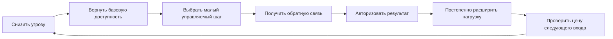

# Глава 25. Восстановление как возвращение управляемости

## После перегруза нельзя просто вернуться

Предыдущая глава развела два маршрута поломки мотивационного контура.

При маршруте выгорания действие становится слишком дорогим:

```text
много требований,
мало контроля,
мало восстановления,
высокая цена ошибки,
результат не успевает стать опорой
```

При маршруте профессиональной скуки действие становится слишком пустым:

```text
мало вызова,
мало смысла,
мало автономии,
слабая обратная связь,
способности не участвуют в живой работе
```

Теперь нужен следующий вопрос:

```text
как возвращаться?
```

Обычный ответ звучит так:

```text
надо отдохнуть
```

Иногда это правда. Если человек долго жил выше устойчивого окна нагрузки, без снижения давления и восстановления телесной базы ничего хорошего не получится.

Но для когнитивного инженерства этого ответа мало.

Человек может отдохнуть и вернуться в тот же хаос: те же WIP, те же срочности, та же низкая управляемость, та же невозможность присвоить результат. Тогда отдых был, а восстановление контура не произошло.

Другой человек может отдыхать от пустой работы, но возвращаться в ту же пустоту: мало смысла, мало вызова, мало обратной связи. Тогда проблема была не только в усталости. Отдых не вернул действие в ценность.

Поэтому восстановление здесь означает не просто паузу.

Восстановление — это возвращение условий, в которых действие снова может начаться, дать сигнал, быть скорректированным и завершиться присвоенным результатом.

Коротко:

```text
восстановление = возвращение управляемости
```

## Что значит вернуть управляемость

Управляемость мы уже вводили в главе 10.

Это не вера, что все получится.

И не ощущение, что мир под контролем.

Управляемость — это ожидаемая связь:

```text
действие -> сигнал -> корректировка -> сдвиг
```

Когда человек истощен, эта связь часто распадается.

Он может знать, что задача важна, но не чувствовать, что шаг изменит ситуацию. Может начать, но не получить ясный сигнал. Может сделать что-то, но результат сразу растворяется в следующей срочности. Может получить обратную связь только в форме новой проблемы.

Тогда система учится неприятной вещи:

```text
усилие есть,
а опоры нет
```

В этой рамке восстановление в первую очередь чинит именно это.

Не просто убрать усталость.

Не просто поднять настроение.

Не просто добавить мотивационный смысл.

А вернуть минимальную петлю:

```text
я делаю небольшой шаг
вижу, что изменилось
могу скорректироваться
могу присвоить результат
и следующий вход становится не дороже, а дешевле
```

## Четыре стороны восстановления

В исследованиях восстановления после работы полезно различать несколько типов восстановительного опыта.

Первый — психологическое отсоединение от работы.

Это состояние, где работа перестает продолжаться внутри головы. Человек не просто физически вышел из задачи, но перестал внутренне удерживать ее как угрозу, хвост или незакрытый долг.

Второй — расслабление.

Это снижение напряжения. Тело и внимание перестают жить в режиме постоянной готовности отвечать, проверять, бежать, держать удар.

Третий — mastery.

Это не рабочий героизм, а опыт посильного освоения. Человек делает что-то, где чувствует способность, рост, интерес, владение действием. Иногда это не связано с основной работой: музыка, спорт, ремесло, учебная практика, маленький домашний проект. Важно не название занятия, а то, возвращает ли оно чувство "я могу действовать и видеть сдвиг".

Четвертый — control.

Это возможность выбирать, как восстанавливаться, чем заниматься, как распоряжаться своим временем и вниманием. Если отдых навязан, фрагментирован, постоянно прерывается и не принадлежит человеку, он хуже возвращает управляемость.

Эти четыре стороны хорошо ложатся на модель учебника:

| Сторона восстановления | Что возвращает в нашей модели |
| --- | --- |
| Психологическое отсоединение | Снижает рабочую активацию и угрозу. |
| Расслабление | Снижает цену входа и телесное напряжение. |
| Опыт посильного освоения | Возвращает опыт способности и сдвига. |
| Право выбора | Возвращает право выбирать и влиять на условия. |

Здесь важно не сделать из восстановления новый список обязанностей.

Если человек говорит:

```text
я должен качественно отдохнуть,
правильно расслабиться,
эффективно восстановиться
```

то восстановление уже заражено тем же режимом нажима.

Восстановление не должно становиться еще одним проектом самоизноса.

## Петля восстановления управляемости

Для практики удобнее всего держать не список советов, а петлю.

Вопрос схемы:

```text
как возвращаться после просадки так,
чтобы отдых не стал паузой перед тем же хаосом,
а действие снова стало управляемым?
```



Граница схемы: это не протокол "быстро починить себя". Если у человека тяжелое истощение, отсутствие реальных рычагов, депрессия, апатия, нарушения сна или небезопасная среда, первым шагом может быть не малый рабочий вход, а изменение условий и профессиональная помощь.

Эта схема читается так.

Сначала нужно снизить угрозу.

Пока система живет в режиме "сейчас снова будет больно, стыдно, опасно, слишком дорого", она будет защищаться. Иногда через избегание. Иногда через раздражение. Иногда через холодность. Иногда через бесконечное планирование без входа.

Потом нужно вернуть базовую доступность.

Это слой сна, питания, пауз, предсказуемости, снижения лишнего WIP, телесной и когнитивной разгрузки. Не как культ здорового режима, а как условие, при котором действие вообще снова становится доступным.

У этого слоя есть временная сторона. Если человек пытается "восстановиться" только формальной паузой, но продолжает жить с накопленным недосыпом, плохим окном внимания и разрушенной границей вечера, следующий вход может оставаться дорогим. Тогда проблема не в том, что человек недостаточно хочет вернуться. Его система еще не получила условия, в которых внимание, торможение и гибкость снова доступны.

Потом нужен малый управляемый шаг.

Не "вернуться к полной мощности".

Не "догнать все, что накопилось".

Не "раз уж стало легче, сейчас все закрою".

А шаг, который можно начать, довести до конца и проверить.

Потом нужна обратная связь.

Человек должен увидеть, что именно изменилось. Не обязательно большой результат. Иногда достаточно:

```text
я открыл задачу
нашел главный туман
снял одно неизвестное
написал следующую контрольную точку
отправил один уточняющий вопрос
закрыл один хвост
```

Потом результат нужно авторизовать.

Это значит коротко назвать:

```text
что я сделал
что изменилось
на что теперь можно опереться
```

И только после этого нагрузку можно расширять.

Не потому, что человек "доказал, что снова пригоден".

А потому, что система получила несколько новых подтверждений:

```text
действие возможно
сигнал приходит
результат остается
следующий вход не уничтожает меня
```

## Почему малый шаг не мелочь

Малый шаг часто звучит слишком просто.

На фоне большой работы он кажется смешным:

```text
ну что изменит один маленький шаг
```

Но после перегруза или длительной неконтролируемости размер шага — это не вопрос амбиций.

Это вопрос восстановления связи между действием и исходом.

Если шаг слишком большой, система снова видит угрозу.

Если шаг слишком туманный, обратная связь не приходит.

Если шаг нельзя завершить, он добавляет новый хвост.

Если после шага результат не назван, усилие снова растворяется.

Хороший малый шаг обладает четырьмя свойствами:

| Свойство | Зачем нужно |
| --- | --- |
| Он начинается сейчас. | Снижает цену входа. |
| Он достаточно мал. | Не запускает прежний режим угрозы. |
| Он дает сигнал. | Возвращает обратную связь. |
| Он оставляет след. | Делает следующий вход дешевле. |

Такой шаг не решает всю проблему.

Он возвращает системе доказательство, что действие снова может что-то менять.

## Авторизация результата

После перегруза человек часто перестает присваивать результат.

Он может сделать полезное действие и тут же сказать:

```text
это мелочь
это случайно
надо было больше
все равно ничего не изменилось
```

Так результат исчезает.

Усилие было, а опоры не появилось.

Авторизация результата нужна, чтобы закрыть петлю.

Это не самопохвала.

И не мотивационная аффирмация.

Это короткое инженерное действие после работы:

```text
что я сделал
что изменилось
что теперь можно использовать дальше
```

Например:

```text
Я не "немного поковырял задачу".
Я нашел место, где ломается вход,
исключил две неверные гипотезы
и оставил следующий проверяемый шаг.
```

Или:

```text
Я не "просто отдохнул".
Я снизил рабочую активацию,
закрыл уведомления,
сохранил точку продолжения
и сделал следующий вход дешевле.
```

Так результат возвращается в контур.

Не как гордость ради гордости, а как факт:

```text
мое действие оставило след
```

## Разные первые ходы

После главы 24 мы не можем давать один универсальный протокол.

Сначала нужно понять, из какого перекоса человек возвращается.

| Если просадка похожа на | Первый ход | Нельзя начинать с |
| --- | --- | --- |
| Перегруз | Снизить давление, ограничить WIP, вернуть безопасность и восстановление. | Нового вызова и мотивационного нажима. |
| Недогруз | Вернуть осмысленный вызов, автономию, вклад и обратную связь. | Одного отдыха или пустого добавления задач. |
| Смешанная зона | Убрать пустую занятость и вернуть управляемый сдвиг. | Подсчета часов как главного критерия. |
| Позднее истощение | Остановить дальнейший износ и искать поддержку. | Самостоятельного героического протокола. |

При перегрузе первый ход обычно защитный.

Нужно снизить цену действия:

- убрать лишнюю срочность;
- ограничить WIP;
- договориться о приоритетах;
- снять часть неопределенности;
- уменьшить цену ошибки;
- вернуть сон и паузы;
- дать право на малый вход.

При недогрузе первый ход другой.

Нужно вернуть включенность:

- дать задаче смысл;
- сделать вклад видимым;
- добавить подходящий вызов;
- вернуть автономию;
- дать обратную связь;
- собрать более цельную задачу;
- дать возможность учиться и расти.

В смешанной зоне нужно особенно осторожно.

Там человек может быть занят весь день, но не получать ни восстановления, ни роста. Тогда решение не в том, чтобы просто "меньше работать" или "больше стараться". Нужно убрать пустое трение и вернуть работу, где есть управляемый сдвиг.

## Когда восстановление не является личной задачей

Есть важная граница.

Иногда человек не может восстановить управляемость только личными практиками.

Если нагрузка объективно слишком высока, полномочий нет, требования противоречат друг другу, обратная связь приходит только через наказание, а паузы постоянно прерываются, личный протокол будет слабым пластырем.

Восстановление управляемости иногда требует внешних изменений:

- пересмотра нагрузки;
- изменения приоритетов;
- права отказаться от части WIP;
- поддержки руководителя или команды;
- медицинской или психотерапевтической помощи;
- отпуска или больничного;
- выхода из токсичной среды;
- признания, что рычага внутри текущей рамки нет.

Это не поражение.

Это точность модели.

Когнитивное инженерство не должно делать человека виноватым за среду, где нет реального рычага.

## Минимальный протокол восстановления

Эта глава не заменяет помощь специалиста и не лечит выгорание.

Но как рабочая инженерная рамка она дает минимальный порядок.

1. Назвать маршрут просадки.

```text
перегруз,
недогруз,
смешанная зона
или позднее истощение
```

2. Снизить угрозу.

```text
что прямо сейчас делает вход опасным,
стыдным,
слишком дорогим
или безнадежным
```

3. Вернуть базовую доступность.

```text
сон,
паузы,
еда,
тишина,
ограничение WIP,
предсказуемый первый блок
```

4. Выбрать малый управляемый шаг.

```text
шаг, который можно начать,
завершить
и проверить
```

5. Получить сигнал.

```text
что изменилось,
что стало яснее,
что исключено,
какой следующий шаг появился
```

6. Авторизовать результат.

```text
что я сделал
что изменилось
на что теперь можно опереться
```

7. Расширять нагрузку только после проверки следующего входа.

Главный критерий:

```text
после шага следующий вход стал дешевле или дороже?
```

Если следующий вход устойчиво становится дешевле, восстановление, вероятно, идет в нужную сторону.

Если дороже, протокол сам стал новым источником давления.

## Что это добавляет к учебнику

До этого места мы уже знали, что мотивационный контур может ломаться.

Теперь мы знаем, как начинать его возвращать.

Не через абстрактную силу воли.

Не через героический рывок.

Не через отдых как универсальную кнопку.

А через восстановление управляемой петли:

```text
безопасность
-> доступность
-> малый шаг
-> обратная связь
-> авторизация результата
-> постепенное расширение
```

Это завершает часть о продуктивности и выгорании.

Следующая часть переведет модель к ИИ и лидерству. И здесь появится новый риск: внешний инструмент может вернуть управляемость, если помогает сделать первый шаг и получить обратную связь. Но он же может стать обходом мышления, если забирает у человека сам опыт действия.

## Источниковая опора

Проверенный пакет для этой главы: [[../Источники/2026-05-25 Пакет источников для главы 25]].

Ключевые источники в авторско-годовой форме:

- Meijman & Mulder (1998), Geurts & Sonnentag (2006), Sonnentag & Fritz (2007), Sonnentag, Venz & Casper (2017), Sonnentag, Cheng & Parker (2022), Trougakos et al. (2008), Hunter & Wu (2016): модель усилия-восстановления, восстановительные переживания и рабочие перерывы.
- McEwen (1998), McEwen & Wingfield (2003), Lim & Dinges (2010), Wüst et al. (2024), Cao, Xie & Ma (2025), Cajochen & Schmidt (2025), Muller et al. (2021): аллостатическая нагрузка, сон, циркадное время и усталость как будущие сдвиги цены усилия.
- Skinner (1996), Bandura (1977, 1997), Maier & Seligman (2016), Limbachia et al. (2021): конструкт контроля, самоэффективность, управляемость и угроза как основные механизмы возвращения действия.
- Demerouti et al. (2001), Bakker & Demerouti (2007, 2017), World Health Organization (2019/2022), Maslach et al. (2001), Maslach & Leiter (2016): JD-R и граница выгорания как причины не сводить восстановление к личной рутине.
- Hackman & Oldham (1976), Harju, Hakanen & Schaufeli (2016): маршрут недогруза, вызов, автономия, обратная связь и пересборка работы.
- Husain & Roiser (2018), Costello, Husain & Roiser (2024): клиническая граница мотивации; не всякая потеря целенаправленного поведения восстанавливается личным протоколом.
- Внутренние заметки про выгорание и авторизацию результата использованы как практический язык замыкания петли `усилие -> сдвиг -> присвоенный результат -> следующий вход`.

Доказательная роль блока: `strong` для модели усилия-восстановления, восстановительных переживаний, аллостатической нагрузки, эффектов сна/усталости на доступность действия, контроля/самоэффективности и границы выгорания; `context-dependent` для циркадного окна, малого шага, авторизации результата, пересборки работы и восстановления после разных маршрутов просадки; `clinical-boundary` для тяжелого истощения, выгорания, апатии/ангедонии, депрессивно похожих состояний, нарушений сна и ситуаций без реальных рычагов в среде. Глава не обещает, что отдых, малый шаг или авторизация результата заменят изменение условий или профессиональную помощь.

Полные библиографические записи и DOI сохранены в пакете главы. В текущей редакции глава оставляет короткий авторско-годовой блок как читательский ориентир.

## Короткое резюме

- Восстановление в этой модели - это возвращение управляемости, а не просто отдых.
- После перегруза первый ход обычно связан со снижением угрозы, цены, WIP и требований.
- Базовая доступность включает сон, снижение накопленного дефицита сна и подходящее окно состояния, а не только формальную паузу.
- После недогруза первый ход связан не с новым давлением, а с возвращением вызова, смысла, автономии, обратной связи и авторства.
- Малый шаг нужен, чтобы снова получить реальную связь действия с исходом.
- Авторизация результата превращает усилие в опору: человек видит, что сделал, что изменилось и на что теперь можно опереться.

## Вопросы для самопроверки

1. Чем восстановление отличается от отдыха?
2. Почему малый шаг не должен быть способом быстро вернуть прежний темп?
3. Что значит "авторизовать результат" без самопохвалы и риторики?
4. Какие разные первые ходы нужны при перегрузе и при недогрузе?
5. Почему формальная пауза может не вернуть управляемость, если не восстановлены сон и окно состояния?
6. Когда личный протокол восстановления должен уступить место изменению среды или профессиональной помощи?

## Мини-практика

Выберите одну зону, где нужно восстановить управляемость:

```text
маршрут просадки: перегруз / недогруз / смешанный случай / позднее истощение
что делает вход угрожающим или бесполезным:
что нужно снизить:
что нужно вернуть:
минимальный управляемый шаг:
какой сигнал покажет изменение:
как я авторизую результат:
по какому признаку пойму, что следующий вход стал дешевле:
где граница личного протокола:
```

Если в последней строке видно, что реального рычага нет, правильный вывод не "стараться сильнее", а менять рамку: нагрузку, полномочия, поддержку, расписание, среду или уровень помощи.

## Статус

`ready-for-review`

Ревизия блока: [[../Проверки/2026-05-25 Ревизия блока 20-25]].
