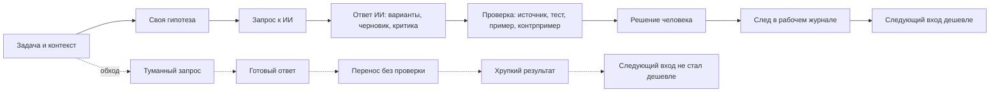

# Глава 26. ИИ как усилитель и как обход мышления

## Переход к новой части

Предыдущая часть учебника разобрала, как возвращать управляемость после перегруза, недогруза и поломки мотивационного контура.

Короткая формула была такой:

```text
безопасность
-> доступность
-> малый управляемый шаг
-> обратная связь
-> авторизация результата
```

Теперь появляется новый инструмент, который может вмешаться почти в каждый элемент этой петли.

ИИ может помочь сделать первый шаг, если задача слишком туманна. Он может предложить варианты, собрать черновик, объяснить фрагмент, найти ошибку, сжать текст, написать тест, подсветить риск. Для человека, который застрял перед дорогим входом, это может быть реальным снижением цены действия.

Но тот же инструмент может сделать противоположное. Он может дать готовый ответ до того, как человек понял задачу. Может заменить собственную гипотезу, проверку, извлечение из памяти, объяснение своими словами и авторизацию результата. Тогда человек получает текст, код или план, но не получает опыта действия.

Поэтому вопрос главы не такой:

```text
пользоваться ИИ или не пользоваться ИИ?
```

Он точнее:

```text
ИИ усиливает петлю мышления
или становится обходом мышления?
```

## ИИ не первый внешний инструмент мышления

Человек давно думает не только "в голове".

Он использует:

- записи;
- схемы;
- списки;
- калькуляторы;
- IDE;
- тесты;
- документацию;
- рабочие журналы;
- чек-листы;
- диаграммы;
- чужие вопросы;
- командные договоренности.

Все это внешние когнитивные опоры.

Они не являются слабостью мышления. Наоборот, сложная работа почти всегда требует распределить нагрузку между человеком, средой, инструментами и следами. Рабочий журнал из глав 4-6 уже был таким инструментом: он выносит состояние задачи наружу, чтобы человек не держал весь контекст в рабочей памяти.

ИИ тоже можно рассматривать как внешний когнитивный контур.

Но он отличается от обычной заметки или таблицы.

Заметка хранит след.

Таблица структурирует сравнение.

Калькулятор считает по заданной операции.

ИИ генерирует связный ответ. Он достраивает, переформулирует, предлагает, обобщает, имитирует объяснение, пишет код и держит диалог.

Именно поэтому он так полезен.

И именно поэтому он так легко создает иллюзию, что мышление уже произошло.

## Что значит "усилить мышление"

ИИ усиливает мышление, когда помогает человеку лучше пройти собственную петлю действия.

Например:

- уточнить постановку задачи;
- отделить известное от неизвестного;
- предложить несколько гипотез;
- найти недостающую проверку;
- сформулировать контрпример;
- развернуть черновик;
- сократить лишнее;
- объяснить непонятный термин;
- предложить тест;
- заметить риск;
- сравнить варианты;
- подготовить следующий шаг.

В этом режиме ИИ не забирает у человека цель, критерий и ответственность.

Он работает как усилитель:

```text
человек держит задачу
ИИ расширяет рабочее пространство
человек проверяет
человек принимает решение
человек оставляет след
```

Здесь сохраняются три вещи.

Первая - собственный контекст. Человек знает, зачем он спрашивает, что уже известно, где туман и какой ответ будет полезен.

Вторая - собственная проверка. Ответ ИИ не переносится в работу сразу. Он проходит через источник, тест, пример, контрпример, локальный контекст или объяснение своими словами.

Третья - собственная авторизация результата. Человек может сказать: что я принял, что отбросил, почему решил так и на что теперь можно опереться.

Если эти три вещи есть, ИИ часто действительно снижает цену входа и ускоряет продвижение.

## Что значит "обойти мышление"

ИИ становится обходом мышления, когда готовый ответ заменяет человеческую петлю.

Обход выглядит не драматично.

Обычно он выглядит удобно:

```text
мне трудно сформулировать задачу
-> я прошу ИИ "сделать"
-> получаю связный результат
-> результат кажется разумным
-> я переношу его дальше
```

Проблема не в том, что ответ обязательно плохой.

Он может быть хорошим.

Проблема в другом: человек не построил рабочую модель задачи. Он не проверил границы. Не понял, какие допущения были сделаны. Не получил опыта выбора. Не оставил след решения. Следующий вход в похожую задачу может стать не дешевле, а дороже, потому что внешне результат есть, а внутренней опоры нет.

Так появляется хрупкая продуктивность:

```text
результаты появляются быстрее,
но способность самостоятельно входить,
проверять
и решать
не растет
```

Для учебника это принципиально.

Когнитивное инженерство не против внешних инструментов. Оно против потери управляемости. Если инструмент помогает человеку видеть, действовать и учиться, он полезен. Если инструмент делает вид, что видение, действие и обучение уже произошли, он опасен.

## Главная схема

Вопрос схемы:

```text
когда ИИ возвращает задачу в человеческий контур мышления,
а когда дает результат без хозяина, проверки и следующего входа?
```



Эту схему нужно читать не как запрет на быстрые ответы.

Иногда быстрый ответ уместен. Например, когда человек уточняет синтаксис, просит вспомнить формат команды или проверяет знакомую мелочь.

Схема говорит о другом: на сложных задачах ответ ИИ должен возвращаться в человеческий контур. Иначе у задачи появляется результат без хозяина.

Граница схемы: она не говорит, что ИИ всегда развивает или всегда разрушает навык. Эффект зависит от задачи, цены ошибки, возможности проверки, уровня опыта и того, сохраняется ли у человека цель, критерий, решение и след.

## Почему гладкий ответ так убедителен

Автоматизация давно создает особый риск: человек начинает полагаться на систему сильнее, чем нужно.

С ИИ этот риск усиливается.

Причина не только в ошибках модели. Причина в том, как человек воспринимает уверенный ответ.

ИИ:

- пишет связно;
- держит тон уверенности;
- быстро заполняет пробелы;
- редко показывает собственную неопределенность так, как ее чувствовал бы человек;
- может объяснить неверную мысль правдоподобным языком;
- может не знать локального контекста, но отвечать так, будто знает.

Это создает опасное ощущение:

```text
раз ответ хорошо звучит,
значит, он хорошо обоснован
```

Так не работает.

Связность ответа - это свойство текста.

Обоснованность ответа - это свойство связи между текстом, источниками, задачей, проверкой и реальным миром.

Эти вещи нужно разводить.

## Уместная зависимость вместо веры и недоверия

Плохие режимы работы с ИИ часто выглядят противоположно, но устроены одинаково грубо.

Первый:

```text
ИИ умнее меня, пусть решает
```

Второй:

```text
ИИ всегда ошибается, значит, им нельзя пользоваться
```

Оба режима слабые.

Когнитивное инженерство требует не веры и не тотального недоверия, а уместной зависимости.

Уместная зависимость отвечает на вопросы:

- какая это задача;
- есть ли у меня способ проверить ответ;
- знаю ли я локальный контекст лучше ИИ;
- насколько велика цена ошибки;
- нужно ли мне сейчас решение, черновик, критика, список вариантов или обучение;
- что будет, если я приму ответ без проверки;
- что я потеряю как навык, если всегда буду отдавать эту часть работы наружу.

Иногда ИИ можно использовать почти как быстрый справочник.

Иногда - как чернового соавтора.

Иногда - как оппонента.

Иногда - как тренера, который задает вопросы, но не дает финальный ответ.

Иногда его лучше не использовать до первой самостоятельной попытки.

Один и тот же инструмент может быть полезным или вредным в зависимости от режима.

## Неровная граница применимости

Данные по ИИ в работе со знанием и разработке ПО не дают простой формулы. На момент проверки источников `2026-05-25` это быстро меняющаяся и неоднородная область: вывод зависит от задачи, метрики, уровня опыта, инструмента и способа проверки.

В некоторых задачах и метриках ИИ может ускорять работу. Особенно там, где есть:

- типовой шаблон;
- ясный критерий результата;
- много синтаксической или текстовой работы;
- низкая цена ошибки;
- быстрые тесты;
- понятная область;
- пользователь, который умеет проверять.

В других задачах ИИ может ухудшать результат или давать ложное чувство продвижения. Особенно там, где есть:

- скрытый локальный контекст;
- архитектурные ограничения;
- высокая цена ошибки;
- неполные требования;
- новые или редкие API;
- безопасность;
- ответственность перед людьми;
- задача вне знакомого паттерна;
- слабая возможность проверки.

Эту границу иногда называют неровной технологической границей.

Смысл простой: ИИ не одинаково помогает везде. Он не как ровная дорога, где любое применение дает одинаковый выигрыш. Он больше похож на ландшафт: рядом могут лежать задача, где ИИ заметно снижает цену работы в выбранной метрике, и задача, где он уверенно ведет в неверную сторону.

Поэтому важнейший навык - не "уметь промптить" вообще.

Важнейший навык:

```text
понимать, на какой стороне границы находится текущая задача
и какие проверки нужны перед переносом ответа в работу
```

## Скорость, качество и обучение - разные вопросы

Разговор об ИИ часто ломается из-за одного смешения.

Люди спрашивают:

```text
ИИ повышает продуктивность?
```

Но под этим вопросом прячутся разные вещи:

| Вопрос | Что измеряется | Почему это не то же самое |
| --- | --- | --- |
| Скорость | Быстрее ли человек завершил задачу. | Быстро завершенная задача может быть неверной, хрупкой или непонятной самому исполнителю. |
| Качество | Стал ли результат точнее, надежнее, полезнее. | Качественный результат может требовать больше времени на проверку и переработку. |
| Обучение | Выросла ли способность человека решать похожие задачи дальше. | Быстрый результат может не оставить навыка, если ИИ забрал постановку, извлечение из памяти, проверку и отладку. |
| Управляемость | Понимает ли человек, что принято, почему и как сопровождать результат. | Внешне готовый результат может скрывать потерю контроля над решением. |

Поэтому фраза "ИИ ускоряет разработчиков" слишком груба для учебника. Она может быть правдой для одной задачи, одной группы людей, одного поколения инструментов и одной метрики. Но она не доказывает, что человек лучше понимает систему, лучше проверяет результат, лучше учится или безопаснее принимает решения.

Свежие исследования по программированию показывают эту неоднородность. На момент проверки `2026-05-25` в одних экспериментах и полевых условиях виден выигрыш по времени или объему выполненной работы. В других контекстах эффект меньше, исчезает или зависит от опыта пользователя, типа задачи и способа измерения. Мета-аналитические и экспериментальные работы по обучению отдельно предупреждают: краткосрочная продуктивность не равна формированию навыка.

Для когнитивного инженерства из этого следует простой редакционный принцип:

```text
утверждение об ИИ всегда должно указывать
задачу,
метрику,
пользователя,
способ проверки
и дату проверки доказательной базы
```

Без этого разговор быстро превращается либо в рекламу, либо в страшилку.

## ИИ в работе разработчика

Разработка делает эту тему особенно наглядной.

ИИ может быть сильным помощником разработчика:

- объяснить незнакомый фрагмент кода;
- предложить гипотезы причины ошибки;
- сгенерировать тесты;
- написать типовой шаблон;
- показать альтернативную реализацию;
- подсветить пограничные случаи;
- составить план миграции;
- сравнить подходы;
- помочь войти в туманную задачу после прерывания.

Но в разработке особенно опасно принять видимость кода за понимание системы.

Код может компилироваться и все равно быть неправильным.

Он может проходить простой тест и ломать соседний сценарий.

Он может быть небезопасным.

Он может не соответствовать архитектурному направлению.

Он может использовать устаревший API.

Он может решать не ту задачу, потому что исходная постановка была неполной.

Поэтому для разработчика вопрос не такой:

```text
написал ли ИИ код?
```

А такой:

```text
восстановил ли человек модель системы,
понял ли изменение,
проверил ли его
и может ли сопровождать результат дальше?
```

## Два режима на одной задаче

Есть ошибка в сервисе. Логи непонятны, контекст утерян, задача неприятная.

Режим обхода:

```text
Вот ошибка. Почини.
```

ИИ предлагает патч. Разработчик переносит его, потому что патч выглядит правдоподобно.

Что потеряно:

- какая была гипотеза;
- какие факты поддерживают ее;
- какие альтернативы исключены;
- какой тест доказывает исправление;
- какие соседние эффекты возможны;
- почему это изменение соответствует системе.

Режим усиления:

```text
Вот симптом.
Вот факты из логов.
Вот что уже проверено.
Вот две гипотезы.
Помоги найти недостающую проверку,
предложи минимальный эксперимент
и укажи, где я могу ошибаться.
```

Здесь ИИ не решает вместо человека. Он помогает собрать следующий ход.

Разница не в длине промпта.

Разница в том, есть ли у человека собственная рабочая модель задачи.

## Как ИИ может снижать цену входа

После глав о прокрастинации, усилии и восстановлении важно увидеть честную пользу ИИ.

Иногда человек не начинает не потому, что не хочет. Он не начинает, потому что вход слишком дорогой:

- непонятно, с чего начать;
- слишком много контекста;
- страшно ошибиться;
- не видно первого проверяемого шага;
- задача расплылась;
- рабочая память перегружена;
- после прерывания не восстановлено состояние.

В таких случаях ИИ может быть хорошим входным усилителем.

Полезные запросы:

```text
разложи задачу на неизвестные места
```

```text
предложи три гипотезы и проверки для каждой
```

```text
найди самый маленький шаг, после которого появится новая информация
```

```text
проверь мой план на скрытые допущения
```

```text
сформулируй вопросы, которые я должен задать перед решением
```

```text
покажи, какие тесты нужны, чтобы не поверить красивому патчу
```

В таких режимах ИИ помогает не избежать мышления, а начать его.

## Как ИИ может разрушать обучение

Способность делать трудное растет через управляемую трудность.

Не через любой стресс.

Не через героический рывок.

А через цикл:

```text
попробовал
-> получил сигнал
-> понял ошибку
-> скорректировал
-> увидел сдвиг
-> присвоил результат
```

Если ИИ постоянно забирает самые важные элементы этого цикла, навык не растет.

Особенно опасно отдавать ИИ:

- постановку вопроса;
- первую гипотезу;
- извлечение из памяти;
- объяснение своими словами;
- выбор проверки;
- отладку;
- принятие решения;
- фиксацию результата.

Это не значит, что ИИ нельзя использовать при обучении.

Можно.

Но режим должен быть другим.

Для обучения полезнее просить:

```text
не решай, задай мне вопросы
```

```text
дай подсказку следующего уровня, но не ответ
```

```text
проверь мое объяснение и найди дыру
```

```text
составь контрпример к моему решению
```

```text
покажи, какой тест я забыл
```

```text
оцени мой план по критериям, но не переписывай его
```

Здесь ИИ становится тренажером, а не заменителем.

## Минимальный протокол работы с ИИ

Для главы 27 мы оставим подробные режимы. Здесь нужен базовый порядок.

### До обращения к ИИ

Зафиксировать минимум:

```text
цель
контекст
что уже известно
что неизвестно
моя гипотеза
какой ответ будет полезен
как я буду проверять результат
```

Если этого нет, высок риск получить гладкий ответ на плохо поставленную задачу.

### Во время работы с ИИ

Просить не только результат, но и структуру проверки:

```text
какие допущения ты сделал
```

```text
какие есть альтернативы
```

```text
что может быть неверно
```

```text
какой минимальный тест отличит варианты
```

```text
какие пограничные случаи стоит проверить
```

```text
что в моем плане слабое
```

### После ответа ИИ

Сделать обратный проход:

```text
что я принимаю
что отклоняю
что нужно проверить
какой тест или источник нужен
что я теперь понимаю лучше
какой следующий шаг
```

И оставить след в рабочем журнале.

Не весь диалог.

А решение:

```text
что спросил
что получил
что проверил
что принял
что осталось сомнительным
что делать дальше
```

Это возвращает результат в человеческую память и снижает цену следующего входа.

## Диагностика: усилитель или обход

| Вопрос | Если ответ "да" | Если ответ "нет" |
| --- | --- | --- |
| Я сформулировал задачу до запроса? | ИИ работает внутри моего контура. | ИИ, вероятно, будет формулировать задачу за меня. |
| У меня есть собственная гипотеза? | Ответ можно сравнить с моей моделью. | Я рискую принять первую связную модель. |
| Я знаю, как проверить ответ? | Можно использовать ИИ как ускоритель. | Нужно сначала построить критерий проверки. |
| Я могу объяснить результат своими словами? | Понимание частично собрано. | Вероятна иллюзия понимания. |
| Ответ оставляет след для следующего входа? | Работа укрепляет контур. | Результат может исчезнуть вместе с диалогом. |
| ИИ убирает лишнее или полезное трение? | Инструмент экономит ресурс. | Инструмент забирает тренировочный материал. |

Эта таблица нужна не для самообвинения.

Она нужна для настройки инструмента.

## Что делать, если ИИ уже стал обходом

Это будет случаться.

Иногда человек устал.

Иногда задача слишком срочная.

Иногда ответ настолько гладкий, что его легко принять.

Если это произошло, не нужно начинать с запрета на ИИ. Нужно вернуть контур.

Минимальный ремонт:

1. Остановить перенос результата.
2. Выписать, что именно принято от ИИ.
3. Назвать, какие допущения в ответе скрыты.
4. Найти одну проверку.
5. Объяснить результат своими словами.
6. Решить, что остается, что отклоняется, что нужно переписать.
7. Зафиксировать это в рабочем журнале.

Так ИИ снова становится материалом для мышления, а не его заменой.

## Границы главы

Это не каталог инструментов и не курс промпт-инжиниринга как отдельной профессии.

Инструменты будут меняться.

Модели будут становиться лучше.

Эмпирика по эффектам продуктивности будет уточняться.

Но базовый вопрос останется:

```text
где находится петля постановки, проверки, решения и авторства?
```

Если она остается у человека, ИИ может быть сильным усилителем.

Если она уходит в инструмент, человек может получить быстрый результат и одновременно потерять управляемость.

## Что это добавляет к учебнику

До этого места учебник работал с человеком, задачей, телом, состоянием, контекстом, мотивацией, восстановлением и внешним следом.

Теперь добавлен новый тип внешнего контура.

ИИ не отменяет предыдущие главы. Он делает их важнее.

Потому что без:

- контекста задачи;
- рабочего журнала;
- понимания цены усилия;
- различения управляемости и иллюзии контроля;
- полезной трудности;
- проверки уровней объяснения;
- авторизации результата

ИИ легко становится очень убедительным обходом мышления.

Дальше это различение нужно превратить в практику: как работать с ИИ так, чтобы не отдавать ему субъектность.

## Источниковая опора

Проверенный пакет для этой главы: [[../Источники/2026-05-25 Пакет источников для главы 26]].

Ключевые источники в авторско-годовой форме:

- Hutchins (1995), Norman (1991, 1993), Risko & Gilbert (2016): распределенная когниция, когнитивные артефакты и когнитивная выгрузка как базовая рамка для ИИ как внешнего когнитивного контура.
- Bainbridge (1983), Parasuraman & Riley (1997): иронии автоматизации и различение use/misuse/disuse/abuse как старая рамка автоматизации за текущим использованием ИИ.
- Parasuraman & Manzey (2010), Goddard, Roudsari & Wyatt (2012), Lee & See (2004), Hoff & Bashir (2015): смещение автоматизации, беспечность, калиброванное доверие и уместное полагание на систему.
- Peng et al. (2023), Qian & Wexler (2024), Butler et al. (2025), Cui et al. (2026), Dell'Acqua et al. (2026), Becker et al. (2025), METR (2026a, 2026b, 2026c), Maier et al. (2026): кодирование с ИИ и продуктивность работы со знанием как неоднородная, зависящая от задачи и быстро меняющаяся доказательная база.
- Hou et al. (2024), Terragni et al. (2025): карта задач разработки ПО и дорожная карта ИИ в разработке ПО.
- Lee et al. (2025), Jose et al. (2025), Klein & Klein (2025), Shen & Tamkin (2026): критическое мышление, цена когнитивной выгрузки в эпоху ИИ, базовое знание и формирование навыка как формирующиеся риски и предупреждения для дизайна практики.
- Главы 5, 12, 16, 19, 21 и 25 используются как внутренняя опора: рабочий журнал, уровни объяснения, понимание, опыт мастерства, WIP и восстановление управляемости.

Доказательная роль блока: `strong` для когнитивной выгрузки, распределенной когниции, смещения автоматизации, калибровки доверия и общих рисков автоматизации; `fast-moving` для продуктивности с ИИ, инструментов разработки ПО и свежих исследований ИИ, проверенных `2026-05-26`; `context-dependent` для переноса данных о продуктивности на конкретную задачу, команду, инструмент и уровень экспертизы; `mixed` для выводов о влиянии на обучение; `weak` для широких заявлений о долгосрочной утрате навыка, если они не опираются на конкретный дизайн исследования. Глава разводит скорость, качество, обучение и управляемость и не выводит рост понимания из факта более быстрого результата.

Полные библиографические записи и DOI сохранены в пакете главы. В текущей редакции глава оставляет короткий авторско-годовой блок как читательский ориентир.

## Короткое резюме

- ИИ - это внешний когнитивный контур, а не просто справочник и не магический партнер.
- Он усиливает мышление, когда снижает цену входа, расширяет пространство вариантов, помогает увидеть ошибки и возвращает человека к проверяемому действию.
- Он становится обходом мышления, когда забирает постановку задачи, гипотезу, извлечение из памяти, проверку, решение и авторство результата.
- Главная цель - не вера в ИИ и не запрет на ИИ, а уместная зависимость от инструмента.
- Чем слабее проверка и выше цена ошибки, тем осторожнее нужно переносить результат ИИ в действие.
- Нельзя выводить обучение, понимание и сохранение навыка только из того, что задача выполнена быстрее.

## Вопросы для самопроверки

1. Как отличить усиление мышления от обхода мышления?
2. Почему гладкость ответа ИИ не является признаком понимания или истинности?
3. Какие части когнитивной петли можно выносить в ИИ без потери субъектности?
4. Где проходит граница уместной зависимости от ИИ?
5. Почему ИИ может одновременно снижать цену входа и разрушать обучение?
6. Почему скорость выполнения задачи не доказывает рост навыка?

## Мини-практика

Возьмите один недавний диалог с ИИ и разберите его по схеме:

```text
моя постановка до запроса:
моя гипотеза до ответа:
что ИИ сделал полезно:
что ИИ сформулировал вместо меня:
как я проверил ответ:
что я могу объяснить своими словами:
какой след остался для следующего входа:
что в следующий раз нужно оставить себе:
```

Цель практики - не обвинить себя за использование ИИ, а настроить границу: какую работу инструмент делает хорошо, а какую работу нельзя отдавать до первого человеческого контакта с задачей.

## Статус

`ready-for-review`

Ревизия блока: [[../Проверки/2026-05-25 Ревизия блока 26-30]].
