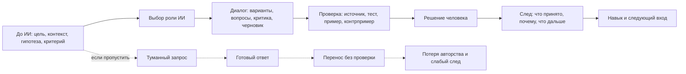

# Глава 27. Как работать с ИИ, не отдавая ему субъектность

## Зачем нужна отдельная глава

Предыдущая глава разобрала главную развилку:

```text
ИИ может усиливать мышление
или обходить мышление
```

Но сама по себе эта мысль еще не говорит, как работать.

В реальной задаче все происходит быстро. Человек устал, контекст распался, срок рядом, рабочая память забита, первый шаг неприятен. ИИ под рукой. Он отвечает связно, уверенно и почти мгновенно. Очень легко попросить:

```text
сделай
```

и получить результат раньше, чем появилась собственная постановка задачи.

Здесь нужна практика. Не для того, чтобы запрещать ИИ. И не для того, чтобы превратить работу с ним в сложный ритуал.

Нужен рабочий порядок, который удерживает простую вещь:

```text
ИИ может помогать,
но цель, критерий, проверка и решение должны оставаться у человека
```

## Что здесь называется субъектностью

Слово "субъектность" легко сделать слишком большим и туманным. Здесь оно используется в рабочем смысле.

Субъектность - это не гордость "я все сделал сам". И не отказ от внешних инструментов. Человек давно думает с записями, схемами, IDE, тестами, книгами, разговорами и рабочим журналом.

Субъектность в работе с ИИ означает, что человек удерживает пять функций:

```text
я задаю цель
я понимаю контекст
я выбираю критерий качества
я проверяю результат
я авторизую решение
```

Если эти функции остаются у человека, ИИ может быть сильным усилителем.

Если они незаметно переезжают в инструмент, человек получает готовый текст, код или план, но теряет управляемость. Он уже не до конца знает, почему задача была поставлена так, почему ответ считается хорошим, что проверено, что не проверено и на каком основании решение можно нести дальше.

Это и есть потеря субъектности в практическом смысле.

## Главная схема работы с ИИ

Рабочий контур выглядит так:

Вопрос схемы:

```text
какой порядок работы удерживает цель, критерий,
проверку и решение у человека,
оставляя ИИ внутри контура, а не вместо него?
```



В этой схеме ИИ находится внутри человеческого контура. Он может расширять варианты, формулировать черновики, критиковать, задавать вопросы, предлагать тесты, объяснять термины, помогать с синтаксисом и подсвечивать риски.

Но он не должен незаметно становиться хозяином контура.

Граница схемы: это не универсальный список промптов. Это порядок распределения ответственности: ИИ может давать варианты и материал для проверки, но субъектность держится там, где человек формулирует, проверяет, выбирает и оставляет след.

Хозяин контура отвечает на вопросы:

- зачем это делается;
- что уже известно;
- что неизвестно;
- какой ответ будет полезен;
- как отличить хороший ответ от плохого;
- что принято;
- что отклонено;
- какой след остается для следующего входа.

## До ИИ: оставить минимальный собственный след

Главная ошибка начинается до запроса.

Человек еще не понял задачу, но уже просит ИИ дать решение. Тогда инструмент получает слишком много власти: он формулирует рамку, выбирает важные признаки, предлагает критерий и часто задает направление всей работы.

Перед ИИ нужен минимальный след.

Не большой документ. Не церемония. Иногда достаточно шести строк:

```text
цель:
контекст:
что уже известно:
что непонятно:
моя первая гипотеза:
как я проверю ответ:
```

Эти строки делают две вещи.

Во-первых, они выносят состояние задачи из головы. Это снижает туман.

Во-вторых, они не дают ИИ стать первым автором постановки. Даже если гипотеза слабая, она дает точку сравнения. Ответ ИИ уже не воспринимается как первая и единственная модель реальности. Его можно сопоставить со своей рабочей версией.

Минимальный след до запроса к ИИ особенно важен в сложных задачах:

- баги и архитектурные решения;
- тексты с позицией автора;
- обучение новой теме;
- анализ конфликта;
- планирование проекта;
- ревизия чужого решения;
- решение с высокой ценой ошибки.

Если задача совсем простая, этот след может быть короче. Например, когда нужно вспомнить формат команды или синтаксис функции. Но чем выше цена ошибки и чем больше тумана, тем опаснее начинать с пустого запроса.

## Выбрать роль ИИ

ИИ часто используют так, будто у него одна роль:

```text
дай ответ
```

Это слишком грубо.

В когнитивном инженерстве вопрос звучит иначе:

```text
какую функцию в моей петле действия сейчас должен выполнить ИИ?
```

Роли могут быть разными.

| Роль ИИ | Когда уместна | Главный риск | Проверочный вопрос |
| --- | --- | --- | --- |
| Справочник | Нужно быстро вспомнить формат, термин, API, пример. | Принять неточность или устаревший ответ. | Где источник, документация или локальная проверка? |
| Черновой соавтор | Нужно развернуть набросок, получить первый текст, типовой шаблон, варианты формулировок. | Принять гладкость за качество. | Что я изменил, выбросил или переписал? |
| Оппонент | Нужно найти слабые места плана, аргумента, архитектуры. | Поверить слабой критике, потому что она звучит строго. | Какие возражения проходят проверку? |
| Тренажер | Цель - учиться, а не просто закончить. | Получить готовый ответ вместо опыта действия. | Где моя попытка, извлечение из памяти или объяснение своими словами? |
| Проверочный напарник | Нужны тесты, пограничные случаи, скрытые допущения. | Ограничиться только проверками, которые предложил ИИ. | Какие проверки я добавил независимо? |
| Генератор альтернатив | Нужно расширить пространство вариантов. | Утонуть в вариантах и увеличить WIP. | По какому критерию я выбираю? |

Иногда лучший запрос к ИИ - не "сделай", а:

```text
будь оппонентом
```

или:

```text
не решай, задай мне вопросы
```

или:

```text
предложи проверки, а не финальный вывод
```

Это не тонкость промпта. Это выбор роли инструмента в когнитивной системе.

## Во время ИИ: просить материал для проверки

Слабый запрос просит только результат:

```text
напиши решение
```

Сильный запрос просит еще и проверочную структуру:

```text
какие допущения ты сделал
```

```text
какие есть альтернативные объяснения
```

```text
что в моем плане слабое
```

```text
какой минимальный тест отличит варианты
```

```text
какие пограничные случаи стоит проверить
```

```text
какие источники или локальные факты нужны перед решением
```

```text
что может быть правдоподобным, но неверным
```

Такой диалог не гарантирует истину. ИИ может ошибиться и в критике, и в тестах, и в допущениях.

Но он меняет режим работы. Ответ становится не финальным продуктом, а материалом для проверки.

Это принципиально.

Когда ИИ выдает только готовый результат, человеку остается решить: верить или не верить. Когда ИИ помогает собрать проверки, человек возвращается в позицию исследователя задачи.

## После ИИ: вернуть результат в человеческий контур

После ответа ИИ нужна обратная операция.

Не обязательно сохранять весь диалог. Часто это лишний шум.

Нужно сохранить решение:

```text
что я спросил
что получил
что проверил
что принимаю
что отклоняю
что остается сомнительным
какой следующий шаг
```

Это можно вставить в рабочий журнал задачи.

Главная функция такого следа - не отчетность. След защищает будущий вход.

Через день или неделю диалог с ИИ уже не будет жить в голове. Останется только смутное ощущение: "мы вроде что-то решили". Это плохое состояние. Оно делает следующий вход дорогим и хрупким.

Хороший след выглядит так:

```text
ИИ предложил три причины.
Принята причина B, потому что тест T воспроизвел симптом.
Причина A отклонена: лог L противоречит ей.
Причина C не проверена, оставить как риск.
Следующий шаг: написать regression test на сценарий S.
```

Такой след возвращает результат в человеческую память и в рабочую систему.

## Что нельзя отдавать ИИ слишком рано

Не всякую трудность нужно сохранять. Лишнее трение можно и нужно снимать.

Если человек тратит двадцать минут на поиск синтаксиса, который не является предметом обучения, ИИ может помочь. Если нужно быстро получить список вариантов формулировки, ИИ может помочь. Если нужно сжать уже понятный текст, ИИ может помочь.

Но есть трудности, которые строят навык.

Их нельзя отдавать слишком рано.

| Элемент трудности | Почему его нельзя отдавать сразу | Как ИИ может помочь без подмены |
| --- | --- | --- |
| Первая постановка вопроса | Человек теряет понимание, что именно ищет. | Попросить уточнить уже написанную постановку. |
| Извлечение из памяти | Без извлечения из памяти знание остается знакомым, но слабым. | Попросить проверить собственный ответ и найти дыру. |
| Первая гипотеза | Не появляется точка сравнения с ответом ИИ. | Попросить сравнить несколько своих гипотез. |
| Выбор проверки | Человек не учится отличать объяснение от доказательства. | Попросить варианты тестов и выбрать самому. |
| Объяснение своими словами | Возникает иллюзия понимания. | Попросить оценить свое объяснение. |
| Финальное решение | Теряется авторство и ответственность. | Попросить критический разбор перед решением. |

Это особенно важно при обучении.

Если цель - просто вспомнить команду, готовый ответ нормален.

Если цель - научиться думать в теме, готовый ответ может быть вреден именно потому, что он слишком удобен.

## Учебный режим: ИИ как тренажер

Когда человек учится, ИИ часто полезнее использовать не как решатель, а как тренажер.

Плохой учебный запрос:

```text
объясни тему так, чтобы я понял
```

Он не всегда плох сам по себе. Иногда хорошее объяснение нужно. Но если вся учеба строится только на получении объяснений, появляется знакомость без владения.

Сильнее работают другие запросы:

```text
задай мне 5 вопросов по теме, от простого к сложному
```

```text
я объясню своими словами, а ты найди пробел
```

```text
дай подсказку, но не ответ
```

```text
составь контрпример к моей идее
```

```text
проверь, где я перепрыгнул через шаг рассуждения
```

```text
дай задачу на перенос знания в новый контекст
```

Так ИИ не убирает полезную трудность. Он дозирует ее.

В идеале учебный режим выглядит так:

```text
моя попытка
-> подсказка
-> новая попытка
-> обратная связь
-> объяснение своими словами
-> перенос
```

Это ближе к опыту преодоления из главы 19, чем к потреблению готового текста.

## Производственный режим: ИИ как ускоритель проверяемой работы

В рабочей задаче цель другая. Нужно не только учиться, но и двигать результат.

Здесь ИИ может заметно ускорять отдельные операции:

- сделать черновик;
- предложить варианты;
- собрать таблицу сравнения;
- указать пограничные случаи;
- написать типовой шаблон;
- помочь с тестом;
- сформулировать риск;
- сжать длинный текст;
- найти нестыковку.

Но производственный режим не отменяет проверку.

Хорошее правило:

```text
чем выше цена ошибки,
тем меньше ИИ должен быть финальным ответчиком
и тем больше он должен быть источником вопросов,
вариантов и проверок
```

Для низкорисковой задачи ИИ может дать почти готовый черновик.

Для задачи с высокой ценой ошибки ИИ лучше использовать иначе:

```text
перечисли скрытые допущения
```

```text
назови условия, при которых этот план не сработает
```

```text
предложи независимую проверку
```

```text
какие данные нужны до решения
```

```text
составь список рисков для ревью
```

Там, где ответ нельзя проверить, надо быть особенно осторожным.

ИИ может звучать уверенно именно там, где человек пока не умеет оценить уверенность.

## Разработка: код не равен пониманию

В разработке соблазн особенно сильный: ИИ может сразу написать код.

Но код - не конец задачи.

Разработчик должен понимать:

- какую проблему решает изменение;
- какие ограничения системы учтены;
- какие сценарии покрыты;
- какие тесты доказывают исправление;
- какие соседние эффекты возможны;
- как сопровождать этот код дальше.

Если ИИ написал патч, а человек не может объяснить его, задача не завершена. Она стала внешне похожа на завершенную.

Хороший режим для bugfix:

```text
не пиши патч сразу.

Вот симптом.
Вот контекст.
Вот что изменилось недавно.
Вот моя гипотеза.
Вот что уже проверено.

Предложи:
1. скрытые допущения;
2. альтернативные гипотезы;
3. минимальный воспроизводимый тест;
4. пограничные случаи;
5. вопросы, которые надо закрыть перед патчем.
```

После этого можно просить патч. Но патч должен пройти через локальное понимание и тесты.

Для рефакторинга или архитектурного решения режим еще строже. ИИ может помочь увидеть варианты, но он обычно не знает всех локальных причин, почему система устроена именно так. В таких задачах особенно важно фиксировать:

```text
какую проблему решаем
какой вариант выбран
какие варианты отклонены
почему
какие риски остаются
как проверяем миграцию
```

## Как заметить, что ИИ уже забрал субъектность

Есть несколько признаков.

| Признак | Что происходит | Как вернуть контур |
| --- | --- | --- |
| Я не могу объяснить ответ без текста ИИ. | Возникла знакомость без понимания. | Пересказать своими словами, найти пробел, задать ИИ роль проверяющего. |
| Я не знаю, какие допущения были сделаны. | Инструмент задал рамку за меня. | Выписать допущения и проверить ключевые. |
| Я не знаю, как проверить результат. | Ответ принят до критерия. | Сначала построить тест, источник, пример или контрпример. |
| Я переношу текст или код без изменения. | Черновик стал решением без авторизации. | Остановиться и назвать, что именно принимается. |
| После диалога нет следа. | Следующий вход снова будет дорогим. | Записать решение в рабочий журнал. |
| Я избегаю первой попытки и сразу прошу ИИ. | Убрана полезная трудность. | Сделать маленькую собственную попытку перед запросом. |

Здесь не нужен стыд.

Инструмент так и устроен: он очень хорошо снимает неприятный первый шаг. Иногда это полезно. Иногда он снимает именно тот шаг, который должен был построить понимание.

Задача не в том, чтобы ни разу не ошибаться. Задача - вовремя возвращать контур.

## Минимальный рабочий протокол

Если нужен короткий порядок, он такой.

### 1. Перед запросом

```text
цель:
контекст:
что уже известно:
что непонятно:
моя гипотеза:
роль ИИ:
проверка:
```

Роль ИИ лучше писать явно:

```text
будь оппонентом
```

```text
дай подсказки, но не решение
```

```text
помоги найти проверки
```

```text
сделай черновик, который я буду редактировать
```

### 2. В диалоге

Просить:

```text
альтернативы
допущения
риски
контрпримеры
минимальные проверки
пограничные случаи
вопросы до решения
```

### 3. После ответа

Записать:

```text
принято:
отклонено:
нужно проверить:
проверено:
решение:
следующий шаг:
```

Это небольшой протокол. Но он резко меняет роль ИИ: из машины готового ответа в часть управляемой рабочей системы.

## Когда лучше не начинать с ИИ

Есть ситуации, где первый ход лучше сделать без ИИ.

Например:

- нужно проверить, что ты сам помнишь;
- нужно научиться решать тип задач;
- нужно сформулировать личную позицию;
- нужно почувствовать сопротивление и понять, где именно трудно;
- нужно принять ценностное решение;
- цена ошибки высока, а способ проверки пока не ясен;
- ты уже несколько раз обходил первую попытку через ИИ и навык не растет.

В таких случаях ИИ можно подключить позже:

```text
после первой попытки
после объяснения своими словами
после списка гипотез
после выбора критерия
после минимального теста
```

Это не аскеза.

Это защита тренировочной нагрузки.

## Когда ИИ особенно полезен

Есть и обратные ситуации, где ИИ лучше подключать рано.

Например:

- задача слишком туманна, и нужен первый разбор неизвестных мест;
- человек застрял в одной рамке и нужны альтернативы;
- после прерывания нужно восстановить контекст по рабочему журналу;
- нужно быстро проверить черновик на дыры;
- нужно сгенерировать тестовые случаи;
- нужно снизить цену входа, но не отдавать решение;
- нужно перевести большой материал в структуру для дальнейшего чтения;
- нужно получить вопросы для самопроверки.

Здесь ИИ помогает войти в действие. Он снижает цену первого шага, не отменяя сам шаг.

## Матрица режима: зачем сейчас ИИ

Перед запросом полезно назвать не только роль ИИ, но и режим задачи. Это защищает от одной частой ошибки: использовать один и тот же стиль работы для справочной мелочи, обучения, производственного решения и высокорискового вывода.

| Режим | Что можно отдавать ИИ раньше | Что нужно удержать у человека | Проверка |
| --- | --- | --- | --- |
| Справочный | Формат, синтаксис, пример, черновое объяснение. | Понимание, подходит ли ответ к текущей версии инструмента и локальному контексту. | Документация, быстрый запуск, локальная проверка. |
| Учебный | Вопросы, подсказки, контрпримеры, обратную связь. | Первую попытку, извлечение из памяти, объяснение своими словами, перенос на новую задачу. | Самостоятельное решение, пересказ, задача без ИИ. |
| Производственный | Черновик, варианты, пограничные случаи, тестовые идеи, ревью рисков. | Критерий качества, решение, сопровождение результата. | Тесты, ревью, локальные факты, рабочий журнал. |
| Высокорисковый | Список вопросов, альтернатив, скрытых допущений. | Финальный вывод, ответственность, проверку источников и границ. | Первичные источники, независимая проверка, консультация с ответственным экспертом. |

Один и тот же запрос может быть хорошим в справочном режиме и плохим в учебном. Например, "дай готовое решение" нормально, если нужно вспомнить забытый флаг команды и сразу проверить его локально. Но тот же запрос вреден, если человек учится диагностировать класс ошибок и еще не сделал собственной попытки.

В быстро меняющихся темах, включая сам ИИ, к проверке добавляется дата. Ответ может быть правдоподобным и устаревшим одновременно. Поэтому для исследований, новых инструментов, API, вопросов безопасности и заявлений поставщиков нужна не только связная сводка, но и первичный источник, дата публикации, версия инструмента и понимание, что именно измерялось.

## Границы

Работа с ИИ не переносит ответственность на ИИ.

Если результат идет в код, документ, решение, обучение, коммуникацию или управление людьми, человек должен понимать, что он принял и почему.

Эта глава не учит промпт-инженерингу как отдельной дисциплине. Промпты будут меняться. Модели будут меняться. Интерфейсы будут меняться.

Но базовая инженерная проверка останется:

```text
у кого цель?
у кого критерий?
где проверка?
кто принимает решение?
какой след останется?
что происходит с навыком?
```

Если эти вопросы остаются у человека, ИИ может быть сильным инструментом.

Если они уходят в инструмент, человек может получить быстрый результат и одновременно потерять то, ради чего вообще стоило работать: понимание, управляемость и способность действовать дальше.

## Переход к лидерству

Теперь можно расширить рамку.

То, что было разобрано на уровне одного человека и ИИ, похоже на лидерство.

Лидер тоже работает не с "мотивацией вообще", а с условиями действия:

- ясность задачи;
- автономия;
- управляемость;
- обратная связь;
- цена входа;
- WIP;
- безопасность ошибки;
- авторство результата.

Дальше когнитивное инженерство переходит из индивидуального контура в командную среду.

## Источниковая опора

Проверенный пакет для этой главы: [[../Источники/2026-05-25 Пакет источников для главы 27]].

Ключевые источники в авторско-годовой форме:

- Hutchins (1995), Norman (1991, 1993), Risko & Gilbert (2016): ИИ как часть распределенной когнитивной системы, а не замена всей петли мышления.
- Bainbridge (1983), Parasuraman & Riley (1997), Parasuraman & Manzey (2010), Goddard, Roudsari & Wyatt (2012): неправильное использование автоматизации, беспечность, смещение автоматизации и снижение риска через явные проверки.
- Lee & See (2004), Hoff & Bashir (2015): калибровка доверия и уместное полагание на систему как центральный практический критерий выбора роли ИИ.
- Bandura (1977, 1997), Roediger & Butler (2011), Soderstrom & Bjork (2015), Bjork & Bjork (2011/2020): самоэффективность, опыт мастерства, практика извлечения, разрыв между выполнением и обучением и полезная трудность как границы учебного использования ИИ.
- Dell'Acqua et al. (2026), Peng et al. (2023), Qian & Wexler (2024), Butler et al. (2025), Cui et al. (2026), Maier et al. (2026), METR (2026a, 2026b, 2026c): данные о продуктивности с ИИ как причина проектировать режимы под тип задачи, а не универсальные правила.
- Lee et al. (2025), Shen & Tamkin (2026), Jose et al. (2025), Klein & Klein (2025): критическое мышление, формирование навыка и базовое знание как предупреждающий материал против чрезмерной когнитивной выгрузки.
- Главы 5, 16, 19, 21, 25 и 26 используются как внутренняя опора: след до запроса, извлечение и самообъяснение после ответа, сохранение опыта мастерства, управление WIP и возврат управляемости.

Доказательная роль блока: `strong` для когнитивной выгрузки, смещения автоматизации, калибровки доверия, самоэффективности и границ извлечения/обучения; `fast-moving` для продуктивности с ИИ и данных по конкретным инструментам, проверенных `2026-05-25`; `context-dependent` для выбора режима работы с ИИ: справочный, учебный, производственный или высокорисковый; `mixed` для вывода о влиянии ИИ на обучение; `weak` для широких утверждений об утрате навыка за пределами прямо изученных задач. Глава не превращает практику в список промптов: каждый режим требует своей проверки, следа и границы ответственности.

Полные библиографические записи и DOI сохранены в пакете главы. В текущей редакции глава оставляет короткий авторско-годовой блок как читательский ориентир.

## Короткое резюме

- Субъектность в работе с ИИ - это удержание цели, критерия, проверки, решения и авторства.
- До ИИ нужен минимальный собственный след: контекст, неизвестное место, гипотеза и критерий полезного ответа.
- Во время работы с ИИ важна роль инструмента: справочник, оппонент, тренажер, черновик, проверочный напарник.
- После ответа нужен обратный ход: проверка, объяснение своими словами, решение и фиксация следа.
- Учебный, производственный и высокорисковый режимы требуют разных границ использования ИИ.
- Для быстро меняющихся тем нужно проверять не только содержание ответа, но и дату, версию инструмента, тип доказательства и первичный источник.

## Вопросы для самопроверки

1. Что значит "отдать ИИ субъектность" в практическом, а не философском смысле?
2. Какой минимальный след стоит оставить до запроса к ИИ?
3. Чем роль "оппонент" отличается от роли "черновик"?
4. Почему после ответа ИИ нужно делать обратный проход?
5. В каких задачах полезно подключать ИИ позже, а не в самом начале?
6. Чем отличаются справочный, учебный, производственный и высокорисковый режимы работы с ИИ?

## Мини-практика

Перед следующим запросом к ИИ заполните короткий пролог:

```text
цель:
контекст:
что я уже понимаю:
что мне неясно:
моя гипотеза:
какая роль нужна от ИИ:
как я проверю ответ:
что должно остаться в моем рабочем журнале:
```

После ответа добавьте второй слой:

```text
что принято:
что отклонено:
что требует проверки:
что я теперь могу объяснить сам:
какой следующий шаг делаю я, а не ИИ:
```

## Статус

`ready-for-review`

Ревизия блока: [[../Проверки/2026-05-25 Ревизия блока 26-30]].
