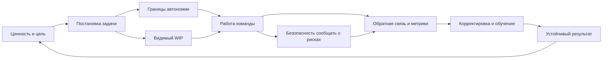

# Глава 28. Лидерство как дизайн среды действия

## Почему после ИИ мы переходим к лидерству

Предыдущие главы обсуждали ИИ как внешний инструмент мышления.

Главный вывод был такой: инструмент полезен, если он усиливает человеческую петлю действия, но не забирает цель, проверку, решение и авторство результата.

С лидерством происходит похожая вещь, только на уровне команды.

Лидер тоже может усиливать мышление и действие людей. Он может снижать туман, помогать увидеть цель, защищать фокус, настраивать обратную связь, делать риски видимыми, возвращать управляемость и создавать среду, где трудность становится обучающей.

Но лидер может сделать и противоположное. Он может забирать мышление у команды, раздавать готовые решения, держать контекст только у себя, превращать метрики в давление, а автономию - в фикцию. Тогда команда внешне работает, но не становится сильнее. Люди ждут указаний, скрывают проблемы, защищаются от ошибок, перегружаются или уходят в безразличие.

Поэтому лидерство в когнитивном инженерстве - это не вопрос харизмы.

И не вопрос того, насколько руководитель "умеет мотивировать".

Точнее так:

```text
какую среду действия создает лидер
и что эта среда делает с ясностью,
автономией,
управляемостью,
WIP,
обратной связью
и ценой усилия команды
```

## Лидер не управляет мозгами людей напрямую

Есть плохая, но очень живучая модель лидерства:

```text
руководитель должен заставить людей хотеть правильного
```

Иногда она звучит мягче:

```text
руководитель должен вдохновить
```

Иногда жестче:

```text
руководитель должен продавить результат
```

Обе версии слишком грубы.

Лидер не может напрямую включить человеку мотивацию, внимание, смысл или устойчивость. Он не сидит внутри чужой рабочей памяти и не управляет чужой ценой усилия.

Но лидер может проектировать условия, в которых людям легче или труднее действовать.

Он может менять:

- насколько ясна цель;
- видно ли, зачем задача нужна;
- есть ли у человека реальный рычаг влияния;
- понятен ли критерий качества;
- не разорван ли WIP;
- есть ли обратная связь;
- можно ли безопасно сказать о риске;
- признается ли вклад;
- не живет ли команда в хроническом перегрузе;
- есть ли ритм восстановления и обучения.

Это уже знакомые переменные. Мы вводили их раньше для одного человека. Теперь они становятся переменными командной среды.

## Главная схема

Лидерство как дизайн среды действия можно представить так:

Вопрос схемы:

```text
как лидер влияет не на "мотивационные кнопки" людей,
а на среду, где цель, автономия, WIP,
обратная связь и безопасность делают действие доступнее?
```



В этой схеме лидер не стоит над каждым действием.

Граница схемы: это не карта контроля над людьми. Она показывает, какие элементы среды лидер может сделать видимыми и управляемыми, чтобы команда сохраняла больше самостоятельности, а не меньше.

Он работает с контуром:

- переводит ценность в понятную цель;
- помогает превратить цель в задачу;
- задает границы автономии;
- делает WIP видимым;
- настраивает петли обратной связи;
- поддерживает безопасность раннего сообщения о проблемах;
- помогает команде корректировать способ действия;
- следит, чтобы результат превращался в обучение, а не только в закрытую карточку.

Команда не становится пассивным исполнителем. Наоборот, хорошая среда возвращает команде больше самостоятельности, потому что цель, границы и обратная связь становятся видимыми.

## Задача как мотивационный интерфейс

Постановка задачи - это не просто передача работы.

Это интерфейс между ценностью и действием.

Одна и та же работа может быть поставлена так, что человек видит смысл, границы и первый шаг. А может быть поставлена так, что у него появляется туман, тревога, сопротивление и желание отложить.

Слабая постановка:

```text
нужно срочно сделать интеграцию
```

В этой фразе может быть правда. Возможно, интеграция действительно срочная. Но для действия в ней слишком мало опор.

Человек не знает:

- зачем нужна интеграция;
- какой минимальный результат нужен первым;
- что точно не входит в объем;
- где можно принимать решения самостоятельно;
- по какому критерию проверят качество;
- какие риски важнее других;
- когда будет ближайшая обратная связь.

Сильная постановка выглядит иначе:

```text
цель:
интеграция нужна, чтобы закрыть конкретный пользовательский сценарий

первый результат:
минимальный end-to-end путь без полной автоматизации всех краев

границы:
не трогаем расширенные сценарии, если они не блокируют первый путь

автономия:
технический способ выбирает команда, но архитектурный риск поднимаем на контрольной точке

критерий:
сценарий S проходит, откат возможен, мониторинг видит ошибку

обратная связь:
через два дня сверяем риск, объем и первый тестовый результат
```

Такая задача не стала легкой. Но она стала рабочей.

В терминах предыдущих глав снизилась цена входа, выросла управляемость, появилась обратная связь и стало понятнее, где проявить профессиональное решение.

## Ясность не равна микроменеджменту

У руководителей часто есть страх: если я слишком подробно сформулирую задачу, я начну микроменеджить.

Это не одно и то же.

Ясность отвечает на вопросы:

```text
зачем
что считаем результатом
какие ограничения
где границы решения
какой риск важен
когда сверяемся
```

Микроменеджмент отвечает за человека:

```text
делай именно так
думай именно так
каждый шаг согласуй
не принимай решений без меня
```

Ясность увеличивает автономию, потому что человек понимает поле игры.

Микроменеджмент уменьшает автономию, потому что забирает способ действия.

Хорошая лидерская постановка дает рамку, но не забирает ремесло.

## Автономия не равна брошенности

Есть и обратная ошибка:

```text
я дал автономию, пусть сами разбираются
```

Иногда это не автономия, а брошенность.

Автономия работает, когда есть:

- понятная цель;
- доступный контекст;
- реальные права решения;
- критерий качества;
- возможность задать вопрос;
- обратная связь;
- ресурс на действие.

Если цели нет, человек не свободен. Он потерян.

Если права решения есть только на словах, человек быстро учится не рисковать.

Если обратная связь приходит только в конце, автономия превращается в лотерею: человек долго работает, а потом узнает, что шел не туда.

Поэтому автономия - это не отсутствие лидера.

Это правильно спроектированная дистанция между рамкой и способом действия.

```text
лидер держит цель, контекст и границы
команда держит способ, экспертизу и локальные решения
```

## Командный WIP - это лидерская проблема

Глава 21 ввела WIP на уровне внимания: если в голове одновременно слишком много незавершенных контекстов, человек теряет фокус и платит цену переключений.

У команды есть похожий WIP.

Он складывается из:

- активных задач;
- незавершенных решений;
- параллельных инициатив;
- ожиданий стейкхолдеров;
- срочных запросов;
- скрытых блокеров;
- незакрытых конфликтов;
- технических долгов, о которых все знают, но никто не держит явно.

Если этот WIP не виден, команда может выглядеть занятой и одновременно терять поток.

Лидер в таком случае не должен просто просить "быстрее".

Первый инженерный вопрос другой:

```text
что сейчас одновременно находится в работе
и что из этого нужно остановить, закрыть, отложить или вынести наружу
```

Командный WIP требует внешнего контура:

- доски;
- явных статусов;
- правил входа новой работы;
- ограничений на параллельность;
- формата срочности;
- контрольной точки для тяжелых задач;
- видимости блокеров.

Без этого сильные люди часто становятся буфером для всего хаоса. На них падает срочное, неясное, недодуманное и эмоционально тяжелое. Снаружи это может выглядеть как доверие к сильным. Внутри это часто путь к самоизносу.

## Каденции как петли обратной связи

Командные ритуалы легко испортить.

Ежедневная синхронизация, планирование, ревью, ретроспектива, индивидуальные встречи, встреча пополнения потока и синхронизация со стейкхолдерами - все это может быть полезным. Но само наличие встречи ничего не гарантирует.

Каденция полезна, если она замыкает петлю:

```text
увидеть состояние
-> обнаружить разрыв
-> принять решение
-> оставить след
-> проверить следующий сдвиг
```

Если встреча не меняет состояние работы, она становится шумом. Она занимает календарь, рвет фокус и создает иллюзию управляемости.

Простой тест:

```text
после этой встречи команде стало яснее,
что делать дальше,
что остановить,
что проверить,
кому помочь
или какой риск поднять?
```

Если нет, ритуал требует ремонта.

Каденции - это не календарная повинность. Это внешний контур команды.

## Безопасность сообщать о проблемах

Команда не может быть управляемой, если плохие новости приходят поздно.

А плохие новости приходят поздно, если говорить о них небезопасно.

Безопасность здесь не означает, что всем всегда приятно. И не означает, что требования отменены.

Она означает другое:

```text
можно сказать "я не понимаю"
можно сказать "мы не успеваем"
можно сказать "я ошибся"
можно сказать "это решение опасно"
можно сказать "мне нужна помощь"
можно не быть наказанным за сам факт раннего сообщения
```

Если за ранний риск человека стыдят, высмеивают или делают виноватым за саму проблему, система учится скрывать.

Тогда лидер теряет обратную связь.

А команда начинает жить в режиме:

```text
сначала терпим,
потом героически тушим,
потом делаем вид, что иначе было нельзя
```

В когнитивном инженерстве это плохая среда. Она повышает угрозу, ухудшает обучение и делает проблемы видимыми слишком поздно.

Безопасная среда не избавляет от ответственности. Наоборот, она делает ответственность возможной раньше.

## Обратная связь как сигнал, а не удар

Обратная связь нужна не для того, чтобы человек почувствовал себя хорошим или плохим.

Она нужна, чтобы действие могло корректироваться.

Хорошая обратная связь отвечает на вопросы:

- что произошло;
- с каким критерием это сравнивается;
- какое последствие это имело;
- что стоит сохранить;
- что стоит изменить;
- какой следующий шаг.

Плохая обратная связь бьет по идентичности:

```text
ты безответственный
ты невнимательный
ты не тянешь
```

Иногда за такими словами есть реальная проблема. Но формулировка не помогает человеку увидеть действие, критерий и следующий шаг. Она повышает угрозу и часто запускает защиту.

Для команды обратная связь должна быть частью нормального рабочего контура, а не редким событием наказания.

И еще важное: позитивная обратная связь тоже не должна быть пустой.

```text
молодец
```

приятно, но слабее, чем:

```text
ты рано поднял риск по интеграции,
и благодаря этому мы успели изменить план до того,
как потеряли неделю
```

Во втором случае человек получает не только признание, но и авторизацию полезного действия.

## Метрики как приборная панель

Метрики легко превратить в дубинку.

Тогда они начинают портить систему: люди оптимизируют показатель, прячут сложность, избегают важных, но плохо измеримых задач, спорят с цифрами или перестают им верить.

В инженерной модели метрики нужны иначе.

Они должны помогать принимать решения о системе:

- где копится WIP;
- где растет lead time;
- где качество падает;
- где работа возвращается;
- где команда перегружена;
- где слишком много срочного;
- где фокус разорван;
- где обещания регулярно не совпадают с возможностью.

Хорошая метрика не отвечает на все вопросы.

Она помогает задать следующий вопрос.

```text
что происходит с потоком
какая гипотеза объясняет сдвиг
что проверим
какое изменение внесем
как поймем, что стало лучше
```

Если метрика используется только для давления, команда будет защищаться от метрики.

Если метрика используется как приборная панель, команда получает еще один внешний контур управления.

## Лидерство и мотивационные области

В главе 8 мы вводили четыре области мотивации: достижение, принадлежность, влияние и безопасность.

Командная среда может поддерживать или разрушать каждую из них.

Достижение поддерживается, когда:

- есть понятная сложность;
- видно улучшение мастерства;
- результат признается;
- обратная связь приходит достаточно рано.

Принадлежность поддерживается, когда:

- человек чувствует связь с командой;
- его вклад видим;
- правила взаимодействия честны;
- конфликты не прячутся под ковром.

Влияние поддерживается, когда:

- у человека есть реальные решения;
- его экспертизу слышат;
- он может менять способ работы;
- предложения не исчезают в пустоте.

Безопасность поддерживается, когда:

- риски можно поднимать рано;
- ошибка разбирается как событие системы, а не как повод уничтожить человека;
- требования ясны;
- помощь доступна до катастрофы.

Это не значит, что лидер должен подбирать каждому человеку "мотивационную кнопку". Такой язык быстро становится манипулятивным.

Лучше думать так:

```text
какую среду мы создаем
и какие мотивы эта среда делает доступными
```

Мотивация сотрудников требует отдельного приближения. Здесь важно увидеть общий уровень: лидерство проектирует не только задачи, но и мотивационный ландшафт команды.

## Лидер как внешний контур команды

Лидер не должен быть единственным человеком, который все помнит и обо всем думает.

Если вся карта команды живет только в голове лидера, система хрупкая.

Но лидер часто отвечает за то, чтобы у команды был внешний контур:

- где лежит цель;
- где виден текущий WIP;
- где зафиксированы решения;
- где видно, что заблокировано;
- где хранятся договоренности;
- где видно, кто за что отвечает;
- где можно восстановить контекст после паузы;
- где команда видит не только задачи, но и смысл.

Это похоже на рабочий журнал из главы 5, но на уровне команды.

Хороший лидер не становится памятью вместо команды. Он помогает команде построить память, которой можно пользоваться.

## Диагностика среды действия

Когда команда буксует, полезно не сразу спрашивать:

```text
кто плохо работает?
```

Иногда нужно спросить:

```text
какой параметр среды разорван?
```

| Симптом | Возможный разрыв среды | Первый инженерный вопрос |
| --- | --- | --- |
| Команда делает много, но не туда. | Нет ясности цели и критерия ценности. | Что считается результатом и почему это важно? |
| Люди ждут указаний. | Автономия не задана или наказуема. | Где границы самостоятельного решения? |
| Все заняты, но поток стоит. | WIP скрыт, много переключений и блокеров. | Что сейчас в работе и что нужно остановить? |
| Ошибки всплывают поздно. | Небезопасно говорить о рисках рано. | Что будет с человеком, который принес плохую новость? |
| Мотивация падает. | Нет связи задачи с ценностью, ростом, принадлежностью или авторством. | Как задача связана с мотивами и развитием человека? |
| Команда устает быстрее, чем учится. | Слишком высокая цена усилия и слабое восстановление. | Какие требования нужно снизить, а какие ресурсы добавить? |

Эта таблица не отменяет личной ответственности. Люди действительно могут ошибаться, избегать, не тянуть задачу или работать ниже ожидаемого уровня.

Но лидерская работа начинается с проверки среды. Иначе можно давить на человека там, где сломана система действия.

## Антипаттерны лидерства

Несколько частых ловушек.

### Героический лидер

Лидер все помнит, все решает, всех спасает, сам закрывает разрывы.

Краткосрочно это работает. Долгосрочно команда не растет, контекст не распределяется, а лидер становится узким местом и кандидатом на выгорание.

### Диспетчер задач

Лидер принимает входящий поток и раздает людям задачи.

Проблема в том, что команда может получать работу без смысла, приоритета, границ и права влиять на способ решения.

### Псевдоавтономия

Команде говорят:

```text
вы самостоятельны
```

но наказывают за самостоятельные решения, меняют критерии задним числом или требуют согласовывать все важное.

Команда быстро учится не проявлять инициативу.

### Метрики вместо мышления

Цифры становятся заменой разговора о системе.

Люди начинают обслуживать показатель, а не ценность.

### Встречи вместо обратной связи

Календарь полон, но решения не фиксируются, риски не закрываются, WIP не уменьшается, следующий шаг не становится яснее.

### Мотивация вместо изменения условий

Человеку объясняют, почему задача важна, но не меняют туман, перегруз, отсутствие автономии или слабую обратную связь.

Это часто не мотивация, а попытка красивее упаковать плохую среду.

## Минимальный протокол лидерского действия

Если нужно быстро вернуть командной задаче управляемость, можно пройти такой порядок.

```text
1. Ценность:
   зачем эта работа нужна и кому она помогает?

2. Результат:
   что будет считаться первым рабочим исходом?

3. Границы:
   что не входит в объем и какие ограничения обязательны?

4. Автономия:
   какие решения команда принимает сама,
   а где нужна контрольная точка?

5. WIP:
   что уже в работе и что нужно остановить или отложить?

6. Риски:
   какие плохие новости мы хотим услышать раньше?

7. Обратная связь:
   когда и по каким сигналам сверяемся?

8. След:
   где фиксируем решение, критерий и следующий шаг?
```

Это не заменяет опыт руководителя. Но такой протокол возвращает лидерство из области впечатления в область проектирования среды.

## Границы главы

Эта глава не является курсом менеджмента.

Она не описывает HR-процессы, оценку результативности, найм, увольнение, компенсации или внутренние регламенты.

Она показывает только один слой:

```text
как лидерская среда меняет когнитивные и мотивационные условия действия команды
```

Иногда локальный лидер не может исправить систему. Если требования хронически выше ресурсов, если организационные решения противоречат целям, если у команды нет реальных полномочий, если люди уже находятся в тяжелом истощении, одной хорошей постановки задач недостаточно.

Это важно держать честно.

Лидерство как когнитивное инженерство не обещает всемогущества. Оно дает язык, чтобы видеть, что именно в среде помогает действовать, а что ломает действие.

## Переход к мотивации сотрудников

Теперь у нас есть рамка лидерской среды.

Следующий вопрос уже более точный:

```text
как видеть мотивацию конкретных людей
и не превращать эту работу в манипуляцию
```

Дальше мотивация сотрудников будет рассматриваться не как "продать задачу любой ценой", а как работа с ценностью, автономией, сложностью, обратной связью, принадлежностью, ростом и границами среды.

## Источниковая опора

Проверенный пакет для этой главы: [[../Источники/2026-05-25 Пакет источников для главы 28]].

Ключевые источники в авторско-годовой форме:

- Ryan & Deci (2000, 2017, 2020), Deci, Olafsen & Ryan (2017), Vansteenkiste, Ryan & Soenens (2020), Van den Broeck et al. (2021), Bandura (1977, 1997), Skinner (1996): автономия, компетентность, связанность, поддержка и фрустрация потребностей, автономная и контролируемая рабочая мотивация, самоэффективность и конструкт контроля как мотивационная база среды действия, спроектированной лидером.
- Demerouti et al. (2001), Bakker & Demerouti (2007, 2017), Karasek (1979), Siegrist (1996): рабочие требования, ресурсы, свобода решений и дисбаланс усилия/вознаграждения как организационные ограничения мотивации и устойчивой работы.
- Hackman & Oldham (1976), Harju, Hakanen & Schaufeli (2016): характеристики работы, пересборка работы и дизайн задач как мосты между структурой работы, мотивацией и обратной связью.
- Meijman & Mulder (1998), Geurts & Sonnentag (2006), Sonnentag & Fritz (2007), Sonnentag, Venz & Casper (2017), Sonnentag, Cheng & Parker (2022): восстановление после работы как свойство рабочего режима, а не только частная дисциплина человека.
- Hutchins (1995), Norman (1991, 1993), Risko & Gilbert (2016), Altmann & Trafton (2002), Czerwinski, Horvitz & Wilhite (2004): командные артефакты, каденции, WIP и поверхности состояния как внешняя когниция и управление прерываниями.
- Edmondson (1999), Edmondson & Lei (2014): психологическая безопасность как способность поднимать риски, ошибки и неопределенность без разрушительного наказания, а не комфорт без требований.
- Quirin et al. (2023): Zurich model of motivation как вспомогательная рамка социальной мотивации для безопасности, активации, власти и динамики приближения-дистанции; не использовать как управленческую типологию.
- World Health Organization (2019/2022), Maslach et al. (2001), Maslach & Leiter (2016): граница выгорания и предел локальных лидерских вмешательств при хроническом перегрузе или тяжелом истощении.
- Внутренние лидерские материалы vault используются только как санитаризированная структура тем: роль, цели, каденции, обратная связь, WIP, мотивация и командная среда.

Доказательная роль блока: `strong` для SDT, самоэффективности, конструктов контроля, JD-R, модели требований и контроля, дисбаланса усилия/вознаграждения, восстановления после работы и границы выгорания; `context-dependent` для переноса этих рамок в конкретные лидерские вмешательства, каденции, метрики и командные договоренности. Для внутренних материалов действует граница приватности и санитаризации: в главу не переносятся имена, рабочие кейсы, операционные детали, детали доступов или чувствительные HR-материалы.

Полные библиографические записи и DOI сохранены в пакете главы. В текущей редакции глава оставляет короткий авторско-годовой блок как читательский ориентир.

## Короткое резюме

- Лидерство в этой модели - это дизайн среды действия, а не прямое управление "мотивацией людей".
- Постановка задачи является когнитивным и мотивационным интерфейсом: она может снижать туман, угрозу и цену входа или усиливать их.
- Автономия в рабочих задачах обычно работает не сама по себе, а вместе с ясностью цели, границами, обратной связью и реальными полномочиями.
- Каденции, метрики, статусы и решения полезны только как петли обратной связи, а не как обслуживание управленческого шума.
- Лидерство имеет границы: локальный лидер не может одним хорошим протоколом компенсировать тяжелое истощение, отсутствие полномочий или организационный перегруз.

## Вопросы для самопроверки

1. Почему лидерство здесь описано как дизайн среды, а не как набор личных качеств?
2. Чем ясность отличается от микроменеджмента?
3. Почему автономия без границ может ухудшать управляемость?
4. Как понять, что каденция стала шумом, а не обратной связью?
5. Какие проблемы нельзя лечить хорошей постановкой задач?

## Мини-практика

Возьмите одну командную задачу и опишите ее как среду действия:

```text
ценность:
первый рабочий результат:
границы и не-цели:
решения, доступные команде:
где нужна контрольная точка:
активный WIP вокруг задачи:
главный риск:
как команда может безопасно сообщить плохую новость:
какая обратная связь покажет продвижение:
где останется след решения:
```

После этого выберите один ремонт среды: уточнить границу, снизить WIP, ввести контрольную точку, сделать риск говоримым или вернуть обратную связь по результату.

## Статус

`ready-for-review`

Ревизия блока: [[../Проверки/2026-05-25 Ревизия блока 26-30]].
