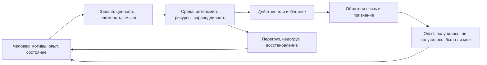

# Глава 29. Мотивация сотрудников

## После среды действия

Предыдущая глава говорила о лидерстве как о дизайне среды действия.

Лидер не управляет чужой мотивацией напрямую. Он не может залезть человеку в голову и включить смысл, интерес, устойчивость или желание сделать трудную задачу.

Но лидер может менять среду, в которой мотивация становится доступнее или недоступнее:

- ясность цели;
- границы автономии;
- WIP;
- обратную связь;
- безопасность сообщения о рисках;
- признание вклада;
- ритм восстановления;
- качество задач;
- возможность учиться на действии.

Теперь нужно приблизить масштаб.

Не команда вообще, а конкретный человек.

Не абстрактная "вовлеченность", а конкретная встреча человека с задачей:

```text
почему эта задача для него живая или мертвая
почему он входит в нее или избегает
почему он берет ответственность или ждет указаний
почему он растет на трудности или гаснет от нее
```

Здесь легко свернуть в плохой язык:

```text
как замотивировать сотрудника
```

или еще хуже:

```text
как найти его кнопку
```

В когнитивном инженерстве такой язык слишком грубый.

Мотивация сотрудника - это не кнопка. И не постоянное свойство человека. Это состояние, которое возникает на пересечении человека, задачи, среды, тела, опыта и обратной связи.

## Главная схема

Мотивацию сотрудника можно представить как петлю:

Вопрос схемы:

```text
как конкретный человек, задача, среда,
состояние и обратная связь вместе делают действие живым
или недоступным?
```



В этой схеме нет отдельной коробки "мотивация".

Потому что мотивация не лежит в одном месте.

Граница схемы: она не нужна для поиска "кнопки" сотрудника. Она нужна, чтобы строить проверяемые гипотезы о встрече человека с задачей и не превращать человека в тип или набор мотиваторов.

Она собирается из нескольких вопросов:

- что человеку сейчас ценно;
- видит ли он смысл задачи;
- есть ли у него автономия;
- чувствует ли он компетентность;
- есть ли связь с командой;
- может ли он влиять на способ действия;
- понятен ли критерий результата;
- не слишком ли высока цена входа;
- не накопился ли перегруз;
- получает ли человек обратную связь;
- становится ли опыт действия опытом роста или опытом бессилия.

Когда эти элементы складываются, человек чаще входит в действие.

Когда они расходятся, снаружи это часто называют "потерей мотивации".

Но внутри могут быть совсем разные поломки.

## Мотиватор - это гипотеза, а не ярлык

В управленческой практике часто говорят:

```text
у этого сотрудника главный мотиватор - деньги
у этого - интересные задачи
у этого - признание
у этого - влияние
```

Иногда это полезно как быстрый рабочий язык.

Но в учебнике нам нужно быть аккуратнее.

Если сказать "у него мотиватор - признание", легко начать видеть только одно. Человек перестает быть живой системой и превращается в тип. Дальше лидер начинает не наблюдать, а подтверждать уже выбранный ярлык.

Лучше говорить иначе:

```text
по текущим наблюдениям похоже,
что для него сейчас особенно важны признание и видимый вклад
```

или:

```text
похоже, он оживает там,
где есть техническая неопределенность
и возможность самому выбрать способ решения
```

или:

```text
похоже, сейчас ведущий фактор не рост,
а безопасность: человек боится ошибки,
оценки или потери контроля
```

Это не ярлыки. Это проверяемые гипотезы.

Их можно уточнять:

- по тому, какие задачи человек выбирает;
- где он говорит живее;
- где откладывает;
- где берет ответственность;
- где теряет энергию;
- на какую обратную связь реагирует;
- какие риски поднимает сам;
- где защищается;
- где просит автономии;
- где, наоборот, просит рамку.

Мотивация наблюдается не по одному разговору и не по одной анкете. Она видна в повторяющемся рисунке контакта с задачами.

## Четыре области как линзы наблюдения

В главе 8 мы ввели четыре области мотивации:

- достижение;
- принадлежность;
- влияние;
- безопасность.

В работе с сотрудниками их удобно использовать не как типологию людей, а как линзы.

Один человек может одновременно хотеть роста мастерства, принадлежности к сильной команде, влияния на технические решения и безопасности от хаотичных требований. В разные периоды одна область может становиться ведущей, но остальные не исчезают.

### Достижение

Достижение поддерживается, когда человек видит:

- сложность, которая развивает;
- понятный критерий качества;
- обратную связь по результату;
- рост мастерства;
- признание реального вклада.

Если у человека сильна область достижения, его может гасить не трудность, а бессмысленная простота. Он может скучать на задачах, где все заранее решено, где нет вызова, где нельзя стать сильнее.

Но достижение легко ломается, если сложность становится неуправляемой. Тогда задача уже не выглядит как вызов. Она выглядит как угроза провала.

### Принадлежность

Принадлежность поддерживается, когда человек чувствует:

- связь с командой;
- уважение к своему вкладу;
- честные правила взаимодействия;
- возможность быть услышанным;
- отсутствие социальной изоляции.

Если принадлежность разрушена, задача может оставаться интересной, но человек будет работать холоднее. Он перестает чувствовать, что его усилие встроено в общий смысл.

Принадлежность нельзя заменить корпоративной риторикой. Она проверяется тем, как команда реагирует на ошибки, вклад, помощь, несогласие и трудные разговоры.

### Влияние

Влияние поддерживается, когда у человека есть:

- реальные решения;
- область ответственности;
- право менять способ работы;
- доступ к обсуждению причин и последствий;
- ощущение, что его экспертиза что-то меняет.

Если человеку дают ответственность без рычагов, влияние превращается в фикцию. Если ему дают задачи без возможности влиять на способ решения, мотивация быстро сжимается до исполнения.

### Безопасность

Безопасность поддерживается, когда:

- критерии понятны;
- ошибка не уничтожает человека;
- можно рано сказать о риске;
- не меняют правила задним числом;
- нагрузка не является хронически разрушительной;
- есть предсказуемость и справедливость.

Безопасность не означает отсутствие требований. Она означает, что система не держит человека в постоянной угрозе.

Когда безопасность провалена, другие мотивы часто становятся недоступными. Человеку трудно думать о мастерстве, принадлежности или влиянии, если он занят защитой от наказания, хаоса или перегруза.

## Внутренняя и внешняя мотивация без лозунгов

Есть соблазн сказать:

```text
внутренняя мотивация хорошая,
внешняя мотивация плохая
```

Это слишком просто.

Внешние условия важны. Деньги, должность, признание, договоренности, ожидания, дедлайны, карьерные последствия - все это реально влияет на поведение.

Проблема не в том, что стимул внешний.

Проблема в том, как он действует.

Внешний стимул может поддерживать действие, если он:

- проясняет ценность;
- дает честную обратную связь;
- признает вклад;
- помогает человеку увидеть рост;
- делает правила справедливыми;
- не забирает автономию.

Но он может ломать мотивацию, если становится контролирующим:

- "делай, потому что иначе накажут";
- "тебе не нужно понимать, просто выполняй";
- "мы обещаем признание, но критерии меняются";
- "выбор формально есть, но решение уже принято";
- "твой вклад важен, но его никто не видит".

Внутренняя мотивация тоже не означает вечный энтузиазм.

Человек может быть внутренне мотивирован и при этом уставать, сомневаться, злиться, брать паузы, просить помощи. Внутренняя мотивация не отменяет тело и среду.

Лучше думать так:

```text
насколько человек переживает действие как свое,
осмысленное,
посильное,
связанное с ростом,
связанное с людьми,
и подтверждаемое обратной связью
```

## Гигиенический пол мотивации

В менеджерском языке часто используют различение гигиенических и мотивационных факторов.

Для нашего учебника это полезно, если не превращать его в догму.

Гигиенический уровень удобно понимать как пол: если он провален, мотивационная работа быстро становится фальшивой.

К нему относятся:

- справедливая оплата;
- предсказуемые правила;
- уважение;
- безопасность;
- допустимая нагрузка;
- нормальные инструменты;
- ясные ожидания;
- отсутствие хронического хаоса;
- базовое доверие;
- возможность восстановиться.

Если этот пол провален, рискованно начинать разговор с фразы:

```text
давай найдем тебе интересную задачу
```

Человек может думать не об интересе, а о несправедливости, усталости, риске, неопределенности или нарушенном доверии.

Но хороший гигиенический пол сам по себе не создает глубокой мотивации.

Справедливая оплата важна. Но она не обязательно делает задачу осмысленной.

Предсказуемые правила важны. Но они не обязательно дают рост мастерства.

Нормальная нагрузка важна. Но она не обязательно дает чувство вклада.

Поэтому у мотивационной работы два слоя:

```text
сначала не ломать пол
потом проектировать рост, смысл, автономию,
принадлежность, влияние и обратную связь
```

## Задача как мотивационный профиль

Одна и та же задача может быть поставлена так, что человек оживает, а может быть поставлена так, что он закрывается.

Важно не только содержание задачи, но и ее профиль.

Минимальный профиль можно собрать по семи вопросам:

| Вопрос | Что он проверяет |
| --- | --- |
| Зачем это нужно? | Ценность и значимость задачи. |
| Что будет результатом? | Критерий успеха и снижение тумана. |
| Где здесь рост? | Достижение, мастерство, полезная трудность. |
| Что человек решает сам? | Автономия и влияние. |
| С кем это связано? | Принадлежность, вклад в команду, связь с пользователями. |
| Когда будет обратная связь? | Замыкание петли действия и авторизация результата. |
| Какая цена входа? | Усилие, WIP, риск перегруза, состояние. |

Если задача важная, но в ней нет автономии, она может ощущаться как исполнение чужой воли.

Если есть автономия, но нет критерия результата, она может ощущаться как брошенность.

Если есть сложность, но нет обратной связи, труд может переживаться как расход в пустоту.

Если есть смысл, но цена входа слишком высока, человек может хотеть результата и все равно избегать действия.

Мотивационная постановка задачи не обязана быть длинной.

Но она должна дать человеку достаточно опор:

```text
зачем
что считается результатом
что можно решить самому
где нужна сверка
почему это посильная трудность
как будет виден вклад
когда вернется обратная связь
```

## Когда "продать задачу" - плохая формула

В рабочих материалах часто встречается идея: если сотрудник не хочет задачу, ее надо "продать" через его мотиваторы.

В этом есть рациональное зерно: задача должна быть связана с тем, что человеку действительно важно.

Но формула опасна, если ее понимать буквально.

Продавать можно честно, когда задача действительно содержит:

- ценность;
- развитие;
- влияние;
- связь с командой;
- полезную трудность;
- видимый вклад;
- справедливые условия.

Тогда лидер не манипулирует. Он помогает человеку увидеть реальную связь задачи с важной для него областью.

Но если задача плохо сформирована, если условия несправедливы, если WIP уже переполнен, если человек истощен, если автономия фиктивна, попытка "продать" становится красивой упаковкой плохой среды.

Тогда правильный вопрос другой:

```text
что в задаче или среде нужно изменить,
чтобы мотивационная связь стала честной?
```

Иногда задача правда нужна, но неприятна. Не вся работа может быть любимой.

Тогда честная постановка не притворяется:

```text
это будет интересно
```

если это не так.

Она говорит:

```text
это рутинная, но важная работа
вот почему она нужна
вот как мы ограничим объем
вот где будет поддержка
вот как мы признаем вклад
вот что после нее не должно стать постоянной нормой
```

Это не романтизация рутины. Это уважение к реальности.

## Наблюдение мотивации

Мотивацию нельзя надежно узнать одним вопросом:

```text
что тебя мотивирует?
```

Человек может не знать. Может отвечать социально ожидаемо. Может говорить про одно, а оживать в другом. Может описывать прошлую мотивацию, которая уже изменилась.

Поэтому наблюдение важнее анкеты.

Полезные сигналы:

- какие задачи человек берет быстрее;
- где просит больше автономии;
- где просит четкую рамку;
- о чем говорит с энергией;
- какую обратную связь запоминает;
- где раздражается;
- где уходит в формальность;
- в каких задачах растет качество;
- после каких задач восстанавливается, а после каких гаснет;
- где берет ответственность без просьбы;
- где избегает даже при высокой компетентности.

Эти сигналы не дают окончательного диагноза.

Они дают гипотезы для разговора.

```text
я заметил, что в задачах с технической неопределенностью
у тебя обычно больше энергии,
а в задачах с готовым решением ты быстрее гаснешь.
Похоже ли это на правду?
```

Это лучше, чем:

```text
тебе просто нужны сложные задачи
```

Первое открывает проверку.

Второе закрывает человека ярлыком.

## Разговор о мотивации

Разговор о мотивации должен начинаться с фактуры, а не с оценки личности.

Плохо:

```text
ты стал немотивированным
```

Лучше:

```text
я вижу, что последние две недели задачи чаще зависают,
а в обсуждениях стало меньше твоих предложений.
Хочу понять, что изменилось:
задачи, нагрузка, ясность, обратная связь, состояние?
```

Плохо:

```text
тебе надо проявлять больше инициативы
```

Лучше:

```text
я хочу понять, где тебе не хватает пространства для решения,
а где, наоборот, не хватает рамки или контекста
```

Плохо:

```text
эта задача важная, поэтому надо постараться
```

Лучше:

```text
задача важная вот по этой причине.
Давай проверим, что в ней понятно,
что ты можешь решать сам,
где есть риск,
и какая обратная связь нужна раньше всего
```

Разговор не должен превращаться в допрос:

```text
какой у тебя мотиватор?
почему ты не вовлечен?
что мне сделать, чтобы ты хотел?
```

Он должен быть совместной диагностикой:

```text
что мешает действию
что делает задачу живой
что делает ее чужой
что можно изменить в задаче
что можно изменить в среде
что зависит от тебя
что зависит от меня
что выше нас обоих
```

## Потеря мотивации: диагностическая таблица

Одна и та же внешняя картина может иметь разные причины.

| Внешний симптом | Возможная поломка | Что проверить | Первый ход |
| --- | --- | --- | --- |
| Не начинает задачу. | Туман, высокая цена входа, низкая управляемость, страх ошибки. | Понятны ли цель, первый шаг, критерий, права решения? | Сузить первый результат, вернуть рамку и ближайшую обратную связь. |
| Делает только минимум. | Нет авторства, смысла, роста или признания. | Видит ли человек вклад и связь с ценностью? | Показать значимость, дать область решения, вернуть обратную связь по вкладу. |
| Избегает ответственности. | Псевдоавтономия, наказание за инициативу, низкая безопасность. | Что происходило после прошлых решений и ошибок? | Уточнить границы автономии и безопасную контрольную точку. |
| Горит на новых задачах, гаснет на рутине. | Нужна сложность и рост, но рутина не авторизована. | Что в рутине обязательно, что можно автоматизировать, где виден вклад? | Ограничить объем рутины, связать ее с ценностью, добавить улучшение процесса. |
| Часто раздражается. | Дисбаланс усилия и вознаграждения, несправедливость, перегруз, конфликт ценностей. | Не расходится ли усилие с признанием, правилами и ресурсами? | Сначала признать фактуру и проверить справедливость системы. |
| Выглядит холодным и отстраненным. | Восстановительный долг, маршрут выгорания, потеря принадлежности, цинизм. | Есть ли истощение, дистанция, редукция эффективности? | Не давить мотивацией; снизить нагрузку, вернуть безопасность, искать поддержку. |
| Скучает и теряет качество. | Недогруз, маршрут профессиональной скуки, слишком низкая сложность. | Есть ли вызов, развитие, целостность задачи, обратная связь? | Добавить осмысленную сложность, пересборку работы, видимый результат. |

Эта таблица не отменяет личной ответственности.

Но она защищает от плохого вопроса:

```text
почему человек не хочет?
```

и переводит к лучшему:

```text
какой элемент мотивационного контура сейчас не работает?
```

## Индивидуальное и системное

Иногда мотивационная проблема действительно находится близко к индивидуальному уровню.

Например:

- человеку нужна более ясная обратная связь;
- задача плохо связана с его текущей зоной роста;
- он не видит, где может принимать решения;
- у него накопился неудачный опыт в этом типе задач;
- он не понимает, зачем работа нужна.

Тогда помогает индивидуальная работа:

- переупаковать задачу;
- уточнить автономию;
- дать меньший первый шаг;
- вернуть обратную связь;
- договориться о поддержке;
- подобрать полезную трудность.

Но иногда проблема системная.

Например:

- WIP команды хронически переполнен;
- срочные задачи постоянно ломают план;
- критерии успеха меняются задним числом;
- вклад не признается;
- нагрузка распределена несправедливо;
- у людей нет реальных полномочий;
- "важность" задач не подтверждается решениями сверху;
- команда не восстанавливается.

Тогда индивидуальный разговор может быть полезен, но он не решит источник.

Если среда продолжит выдавать те же сигналы, мотивация снова будет проседать.

Это одна из главных этических границ лидерства:

```text
не называть личной мотивационной проблемой то,
что является системной проблемой среды
```

## Что нельзя лечить мотивационным нажимом

Есть состояния, где дополнительная мотивация ухудшает дело.

### Перегруз

Если человек уже в хроническом перегрузе, новые слова о важности задачи могут поднять цену входа еще выше.

Тут сначала нужна не мотивация, а снижение требований, приоритизация, восстановление, малый шаг и безопасность.

### Недогруз и скука

Если человек гаснет от отсутствия вызова, новые призывы "быть ответственнее" могут только усилить отчуждение.

Тут нужна не лекция о важности, а возвращение смысла, сложности, обратной связи и возможности влиять на работу.

### Низкая управляемость

Если человек не верит, что его действие меняет исход, обещание награды не обязательно поможет.

Нужно вернуть рычаг:

```text
что именно ты можешь изменить
какой шаг даст сигнал
где твое решение реально влияет
```

### Потеря справедливости

Если человек считает обмен несправедливым, попытка "вдохновить" звучит как обход проблемы.

Сначала нужно разбирать фактуру: ожидания, вклад, признание, правила, нагрузку, компенсацию, карьерные договоренности.

### Тяжелое истощение или клинические состояния

Если речь идет о тяжелом истощении, апатии, депрессивном состоянии, серьезных проблемах со сном или здоровьем, лидер не должен превращаться в терапевта.

Он может поддержать, снизить рабочее давление, помочь с безопасной рамкой и направить к подходящим каналам помощи.

Но учебник не дает медицинского протокола.

## Минимальный протокол работы с мотивацией

Если у сотрудника просела мотивация или задача не запускается, можно пройти такой порядок.

```text
1. Фактура:
   что именно изменилось в поведении, сроках, качестве,
   инициативе, энергии или коммуникации?

2. Контекст:
   какие задачи, события, нагрузки или изменения среды
   совпали с просадкой?

3. Мотивационная область:
   где может быть разрыв:
   достижение, принадлежность, влияние, безопасность?

4. Задача:
   понятны ли ценность, результат, границы,
   автономия, сложность и обратная связь?

5. Управляемость:
   верит ли человек, что его действие реально меняет исход?

6. Цена:
   не слишком ли высока цена входа:
   WIP, усталость, риск, неопределенность, социальная угроза?

7. Гигиена:
   нет ли провала справедливости, нагрузки,
   предсказуемости, уважения или базовых условий?

8. Договоренность:
   что меняем:
   задачу, объем, автономию, поддержку, обратную связь,
   WIP, восстановление или ожидания?
```

Этот протокол не делает разговор механическим.

Он защищает от того, чтобы сразу прыгнуть к самому удобному объяснению:

```text
он не хочет
```

или:

```text
надо лучше мотивировать
```

## Как поддерживать мотивацию без манипуляции

Этичная мотивационная работа держится на нескольких правилах.

### Не скрывать цену

Если задача тяжелая, не нужно притворяться, что она легкая.

Честнее сказать:

```text
это сложная задача,
в ней есть риск,
поэтому мы заранее задаем контрольную точку,
ограничиваем первый результат
и фиксируем, где нужна помощь
```

### Не обещать смысл там, где его нет

Если задача рутинная, не надо искусственно продавать ее как вдохновляющую.

Лучше показать:

- почему она нужна;
- как ограничен ее объем;
- как будет признан вклад;
- что можно улучшить в процессе;
- как не сделать такую рутину постоянной ловушкой.

### Не использовать мотив человека против него

Если человеку важна принадлежность, нельзя постоянно нагружать его через "команда на тебя рассчитывает".

Если человеку важно достижение, нельзя бесконечно отдавать ему трудные задачи без восстановления.

Если человеку важно влияние, нельзя давать ему ответственность без полномочий.

Если человеку важна безопасность, нельзя использовать его осторожность как повод лишить сложных задач.

Мотиватор - это не рычаг эксплуатации. Это область, где человеку может быть важно и живо.

### Давать обратную связь по действию

Обратная связь должна говорить:

```text
что человек сделал
какой эффект это имело
почему это важно
что стоит сохранить
что стоит изменить
какой следующий шаг
```

Так человек получает не просто эмоцию, а карту роста.

### Делать рост видимым

Мотивация часто держится на доказательстве:

```text
мое усилие превращается во что-то
я становлюсь сильнее
команда это видит
следующий шаг доступен
```

Без такого следа даже полезная трудность может переживаться как бесконечный расход.

## Границы главы

Эта глава не учит манипулировать людьми.

Она не предлагает подбирать каждому сотруднику постоянный "тип мотивации".

Она не решает вопросы компенсации, найма, увольнения, оценки результативности или клинической помощи.

Ее задача уже:

```text
дать язык, на котором можно разбирать,
почему человек входит или не входит в действие,
что в задаче и среде поддерживает мотивацию,
а что ее ломает
```

Иногда правильное решение - изменить постановку задачи.

Иногда - дать человеку больше автономии.

Иногда - вернуть обратную связь.

Иногда - снизить WIP.

Иногда - признать, что проблема не в сотруднике, а в системе.

Иногда - честно сказать, что локальный лидер не может компенсировать организационное решение, хронический перегруз или состояние, требующее профессиональной помощи.

## Переход к командному фокусу и выгоранию

Здесь мотивация человека рассматривалась внутри задачи и среды.

Но часто мотивация падает сразу у нескольких людей.

Тогда вопрос уже не только в индивидуальных мотиваторах.

Возможно, команда живет в среде, где:

- слишком много параллельной работы;
- слишком много срочных прерываний;
- контекст постоянно рвется;
- сильные люди становятся буфером для хаоса;
- обратная связь приходит поздно;
- восстановление не встроено в режим;
- перегруз стал нормой.

Это отдельный командный уровень.

Дальше командный фокус, прерывания и выгорание будут рассматриваться не как личная слабость сотрудников, а как системный эффект среды работы.

## Источниковая опора

Проверенный пакет для этой главы: [[../Источники/2026-05-25 Пакет источников для главы 29]].

Ключевые источники в авторско-годовой форме:

- Ryan & Deci (2000, 2017, 2020), Deci, Olafsen & Ryan (2017), Vansteenkiste, Ryan & Soenens (2020), Van den Broeck et al. (2021), Morris et al. (2022): внутренняя/внешняя мотивация, качество регуляции, автономная и контролируемая рабочая мотивация, автономия, компетентность, связанность и фрустрация потребностей.
- McClelland (1961, 1987/1988), Baumeister & Leary (1995): достижение, принадлежность/связанность, влияние/власть и избегание/безопасность как поля ценности и угрозы, а не фиксированные типы сотрудников.
- Quirin et al. (2023): Zurich model of motivation как вспомогательная рамка социальной мотивации для безопасности, активации, власти и поведения приближения-дистанции; использовать только как язык гипотез, а не типирование сотрудников.
- Bandura (1977, 1997), Skinner (1996): самоэффективность, опыт мастерства, воспринимаемый контроль и субъектность как мост от ценного результата к действию.
- Hackman & Oldham (1976), Harju, Hakanen & Schaufeli (2016): характеристики работы, обратная связь, автономия, значимость задачи, вызов и пересборка работы.
- Demerouti et al. (2001), Bakker & Demerouti (2007, 2017), Karasek (1979), Siegrist (1996): рабочие требования и ресурсы, модель требования-контроль и дисбаланс усилия/вознаграждения как объяснения потери мотивации при плохо спроектированной работе.
- Meijman & Mulder (1998), Geurts & Sonnentag (2006), Sonnentag & Fritz (2007), Sonnentag et al. (2017, 2022), World Health Organization (2019/2022), Maslach et al. (2001), Maslach & Leiter (2016): восстановление и граница выгорания как причины не рассматривать истощение как проблему убеждения.
- Herzberg, Mausner & Snyderman (1959), Herzberg (1968/2003): различение гигиенических факторов и мотиваторов как полезная управленческая эвристика, а не самостоятельная причинная теория.
- Внутренние лидерские материалы используются только санитаризированно: как структура вопросов о мотивации, постановке задач, обратной связи, росте и потере включенности.

Доказательная роль блока: `strong` для SDT, самоэффективности, принадлежности, конструктов контроля, дизайна работы, JD-R, восстановления и границы выгорания; `context-dependent` для индивидуальной диагностики мотивации и управленческих вмешательств; `mixed` для линии Herzberg как практической эвристики, если она отделена от более сильной мотивационной и доказательной базы дизайна работы; `clinical-boundary` для тяжелого истощения, выгорания, депрессивно похожей потери действия, апатии/ангедонии и случаев, требующих профессионального, HR- или организационного вмешательства. Для внутренних материалов действует граница приватности и санитаризации: глава не использует детали индивидуальных встреч, оценочных материалов или чувствительные HR-материалы как примеры.

Полные библиографические записи и DOI сохранены в пакете главы. В текущей редакции глава оставляет короткий авторско-годовой блок как читательский ориентир.

## Короткое резюме

- Мотивация сотрудника - это не постоянная черта и не кнопка, а состояние внутри задачи, среды, отношений, опыта и телесного ресурса.
- Мотиваторы можно наблюдать только как гипотезы, а не как ярлыки человека.
- Внутренняя и внешняя мотивация не делятся на "хорошую" и "плохую": важно качество регуляции, автономия, компетентность, смысл и контроль.
- Потеря мотивации часто указывает не на плохого сотрудника, а на туман задачи, низкую управляемость, перегруз, недогруз, отсутствие обратной связи, конфликт ценностей или системную проблему.
- Этичная работа с мотивацией помогает человеку и задаче лучше совпасть; она не продает любую задачу любой ценой.

## Вопросы для самопроверки

1. Почему мотиватор нельзя превращать в ярлык сотрудника?
2. Чем гигиенический пол отличается от мотивационного ресурса?
3. Почему формула "продать задачу" опасна?
4. Как отличить потерю мотивации от перегруза, недогруза или слабой обратной связи?
5. Где заканчивается индивидуальный разговор и начинается системное изменение среды?

## Мини-практика

Разберите одну рабочую задачу не через вопрос "как замотивировать", а через профиль мотивации:

```text
для кого задача:
какая ценность может быть живой:
какая область мотивации затронута:
что угрожает автономии:
что угрожает компетентности:
что угрожает принадлежности или признанию:
какая цена усилия сейчас велика:
какой первый управляемый шаг доступен:
какая обратная связь покажет сдвиг:
что в среде нужно изменить:
```

Если в конце остается только "надо сильнее объяснить важность", значит диагностика еще не дошла до условий действия.

## Статус

`ready-for-review`

Ревизия блока: [[../Проверки/2026-05-25 Ревизия блока 26-30]].
