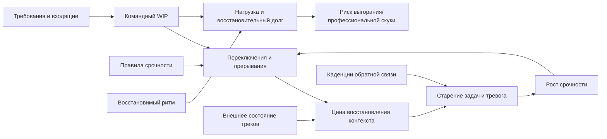

# Глава 30. Командный фокус, прерывания и выгорание

Предыдущая глава смотрела на мотивацию сотрудника внутри конкретной задачи и среды. Там было важно не превратить человека в набор "мотиваторов" и не пытаться продать ему любую задачу через его сильные стороны.

Но иногда мотивация проседает не у одного человека и не на одной задаче.

Сразу несколько людей начинают откладывать тяжелые треки. Задачи стареют. Встречи проходят, статусы обновляются, но реальный сдвиг становится тоньше. Входящие вопросы кажутся мелкими, но к концу дня никто не может объяснить, куда ушел фокус. Самые сильные участники команды постоянно оказываются в роли спасателей. После выходных команда не выглядит восстановленной. Признания результата вроде бы хватает, но у людей накапливается ощущение: "мы все время что-то тушим, а работа не становится управляемее".

В такой ситуации вопрос уже не в том, как мотивировать конкретного сотрудника.

Вопрос в том, какую среду работы создала команда.

Командный фокус - это не сумма личной дисциплины. Это свойство потока: сколько тяжелых контекстов команда держит активными, как она различает срочность, где хранит состояние задач, как возвращается после прерываний, как видит старение задач и как закрывает рабочую нагрузку восстановлением.

Если этот контур не спроектирован, люди будут платить за него своей рабочей памятью, телом, вниманием и мотивацией.

## Почему личного фокуса недостаточно

Человек может уметь входить в задачу. Он может вести рабочий журнал, оставлять контрольную точку, ограничивать личный WIP и честно защищать глубокие блоки.

Но личная система работает только до определенного предела.

Если любое сообщение может оказаться срочным, человек вынужден проверять входящее раньше, чем поймет, можно ли не проверять. Если у команды нет внешнего состояния тяжелых треков, люди держат контекст в головах. Если "в работе" означает "когда-нибудь вернусь", задачи стареют и создают фон тревоги. Если сильные участники постоянно подхватывают незапланированное, они становятся скрытым буфером хаоса.

В такой среде личный фокус быстро превращается в личную оборону.

Человек не только работает над задачей. Он еще постоянно оценивает:

- вдруг пришло срочное;
- вдруг кто-то заблокирован;
- вдруг я забыл старую задачу;
- вдруг мой трек стоит слишком долго;
- вдруг нужно ответить сразу;
- вдруг мое молчание выглядит как бездействие.

Это не глубокая работа. Это работа в режиме постоянной готовности к переключению.

Командное когнитивное инженерство начинается с признания простой вещи: если среда не различает режимы работы, внимание будет жить в самом дорогом режиме - в режиме проверки всего.

## Главная петля командного распада фокуса

Схема ниже показывает типичную петлю, в которой команда теряет фокус не потому, что люди "плохо концентрируются", а потому что сама среда производит слишком много активных контекстов и прерываний.

Вопрос схемы:

```text
как требования, WIP и неразличимая срочность
производят переключения, восстановительный долг
и риск верхнего или нижнего перекоса?
```



Читать эту схему нужно так.

Команда получает требования и входящие: задачи, баги, просьбы, инциденты, ревью, поддержку, уточнения, координацию, планирование. Часть этой работы становится активным WIP.

Если активного WIP слишком много, растет число переключений. Каждое переключение требует восстановить цель, правила задачи, текущие допущения, место остановки и следующий шаг. Когда таких восстановлений много, задачи начинают стареть. Старение задач повышает тревогу и ощущение срочности. Срочность приводит к новым переключениям.

Параллельно растет восстановительный долг: команда тратит больше, чем успевает восстанавливать. Дальше появляются риски верхнего перекоса, где слишком много требований и мало восстановления, или нижнего перекоса, где много занятости, но мало смысла, вызова и авторства.

У схемы есть и инженерные точки вмешательства:

- внешнее состояние тяжелых треков снижает цену восстановления контекста;
- правила срочности снижают ненужные прерывания;
- каденции обратной связи помогают видеть старение задач до кризиса;
- восстановимый ритм снижает восстановительный долг.

Эта схема не говорит: "нужно меньше работать". Она говорит: "нужно перестать проектировать работу так, будто внимание команды бесконечно".

Граница схемы: это не agile-инструкция и не диагностический тест на выгорание. Она показывает когнитивную цену потока и точки вмешательства; конкретные договоры зависят от роли команды, дежурств, зрелости продукта и организационных ограничений.

## Четыре вида командного WIP

Обычно WIP видят как количество задач в статусе "в работе".

Для когнитивного инженерства этого мало.

У команды есть минимум четыре разных WIP.

| Вид WIP | Что это | Чем опасен |
| --- | --- | --- |
| WIP на доске | Формально начатые задачи, карточки, тикеты, инициативы. | Может создавать иллюзию контроля: на доске видно не все, что держит внимание. |
| WIP в головах | Тяжелые контексты, которые люди пытаются удерживать активными. | Съедает рабочую память, память о целях и готовность входить глубоко. |
| Невидимый WIP | Поддержка, ревью, менторинг, ожидания, незакрытые решения, координация. | Не учитывается в планировании, но потребляет время, внимание и переключения. |
| WIP срочности | Постоянная готовность проверить входящее на предмет "а вдруг сейчас". | Держит систему в режиме тревожного мониторинга и дробит глубокую работу. |

Команда может выглядеть умеренно загруженной по доске и быть перегруженной по вниманию.

Например, у разработчика формально одна задача в работе. Но кроме нее есть ревью, помощь коллеге, ожидание решения от другой команды, незакрытый инцидентный хвост, несколько обсуждений в чатах и личная ответственность "если что, меня позовут". На доске это выглядит как один WIP. В голове - как шесть активных контекстов.

Поэтому вопрос "сколько задач в работе?" полезен, но недостаточен.

Нужны другие вопросы:

```text
сколько тяжелых контекстов сейчас требует удержания?
сколько задач не имеют внешнего состояния?
сколько ожиданий живет только в личной памяти?
сколько людей являются постоянными точками эскалации?
какие входящие заставляют всех проверять себя?
```

## "В работе" должно означать контакт

Статус "в работе" часто становится слишком широким.

Он может означать:

- человек действительно сегодня двигает задачу;
- задача начата, но человек переключился;
- задача ждет ответа;
- задача требует решения;
- задача взята заранее, чтобы показать намерение;
- задача большая и не разбита;
- задача стала фоном тревоги;
- задача уже потеряла актуальность, но ее никто не закрыл.

Для командного фокуса важно сузить смысл активного статуса.

Активная задача должна иметь ближайший кусок продвижения.

Не обязательно большой. Не обязательно финальный. Но содержательный:

```text
что изменится в состоянии задачи после ближайшего рабочего контакта?
```

Если ответа нет, задача, возможно, не готова к работе. Ей нужен не "исполнитель", а разборка: цель, контекст, решение, блокер, критерий, декомпозиция или честное ожидание.

Это меняет тон командного разговора.

Плохой вопрос:

```text
почему задача все еще в работе?
```

Лучший вопрос:

```text
какой следующий срез продвижения по этой задаче?
```

Если срез нельзя назвать, команда узнает что-то важное. Там не лень. Там туман, размер, блокер, перегруз, ожидание, конфликт приоритетов или потеря смысла.

## Старение задач без наказания

Стареющая задача - сильный сигнал, но плохой повод для автоматического обвинения.

Задача может стареть по разным причинам.

| Причина старения | Как выглядит | Первый инженерный вопрос |
| --- | --- | --- |
| Слишком большой кусок | Работа идет, но нет видимого завершения. | Какой минимальный срез можно сделать наблюдаемым? |
| Туман | Задача много обсуждается, но не начинается. | Что неизвестно и какая проверка это прояснит? |
| Нет владельца решения | Все ждут, но неясно кого. | Кто принимает следующее решение и на основании чего? |
| Скрытый блокер | Статус формально активный, фактически ожидание. | Чего именно не хватает для следующего шага? |
| Высокий личный WIP | Человек прыгает между задачами. | Что временно снять из активного внимания? |
| Прерывания | Глубокий вход постоянно рвется. | Какие входящие можно перевести в другой канал или окно? |
| Низкая управляемость | Человек не верит, что его шаг меняет исход. | Где реальный рычаг действия и обратная связь? |
| Потеря смысла | Работа идет формально, без энергии. | Как задача связана с ценностью, ростом или вкладом? |

Разбор стареющих задач должен быть не судом, а диагностикой потока.

Если команда наказывает за старение задач, люди учатся прятать реальное состояние. Они начинают держать задачи формально, обещать оптимистичнее, брать меньше риска в обсуждениях и позднее сообщать о проблемах.

Если команда разбирает старение задач как сигнал, появляется другая культура:

```text
стареющая задача - место, где поток просит внимания
```

Это не мягкость. Это точность.

## Прерывания: проблема не в самом факте

Команда не может жить без прерываний.

Есть инциденты. Есть помощь коллегам. Есть решения, которые нельзя ждать. Есть поддержка, безопасность, продакшен, клиенты, люди, сроки, зависимости.

Цель не в том, чтобы запретить прерывания.

Цель в том, чтобы перестать делать любое входящее похожим на срочное.

Прерывание дорого не только потому, что оно забирает минуты. Оно требует восстановить набор задачи: что я делал, какую гипотезу проверял, какой критерий держал, где остановился, что уже исключил, почему следующий шаг был именно таким.

Если прерывание короткое, но произошло в момент, когда человек держал сложную модель в голове, цена может быть большой. Если прерывание требует социальной реакции, оценки риска или решения под давлением, оно еще и меняет состояние тела: растет напряжение, внимание становится уже, сложнее вернуться к спокойному разбору.

В разработке эта цена часто плохо видна снаружи. Две задачи могут занимать одинаковый слот на доске, но одна требует локальной правки по знакомому шаблону, а другая - восстановления модели кода, зависимостей, причинно-следственных гипотез и уже исключенных путей. Поэтому командный WIP нельзя оценивать только количеством карточек, файлов или строк: нужен вопрос, сколько активных моделей люди вынуждены держать и насколько дорого будет восстановить каждую после разрыва.

Поэтому полезно различать:

| Событие | Что происходит | Что нужно |
| --- | --- | --- |
| Запланированное переключение | Человек выходит из одного трека и входит в другой после контрольной точки. | Нормальный выход, внешний след, следующий вход. |
| Мягкое прерывание | Входящее можно обработать позже, но оно просит внимания сейчас. | Асинхронный канал, ожидания по ответу, не ломать фокус. |
| Настоящая срочность | Есть цена ожидания и нужно быстрое действие. | Отдельный формат: влияние, срок, владелец, запрошенное действие. |
| Кризис | Нужна мобилизация команды. | Явный аварийный режим, роли, запись решений, выход из режима. |

Если все четыре события приходят одинаково, команда живет так, будто каждое сообщение может быть кризисом.

## Срочность должна иметь форму

Настоящая срочность должна быть видна до того, как человек разрушил фокус ради расшифровки сообщения.

Минимальный формат срочного сигнала:

| Поле | Зачем нужно |
| --- | --- |
| Серьезность | Насколько серьезен риск или ущерб. |
| Влияние | Что случится, если не переключиться сейчас. |
| Срок | До какого времени нужно действие или решение. |
| Владелец | Кто ведет ситуацию и собирает контекст. |
| Запрошенное действие | Что именно нужно от адресата. |
| Контекст | Где лежат факты, логи, задача, решение или обсуждение. |

Пример плохого срочного сообщения:

```text
посмотри, пожалуйста, тут проблема
```

Такое сообщение заставляет адресата самому определить все:

- срочно ли это;
- что случилось;
- кто владелец;
- чего от него хотят;
- можно ли ответить через час;
- где контекст.

Пример более здорового сообщения:

```text
[S2, нужен ответ до 15:00]
Падает сценарий X у части пользователей.
Влияние: блокирует релиз Y.
Владелец: назначенный владелец ситуации.
От тебя нужно: подтвердить, можем ли временно откатить флаг Z.
Контекст: ссылка на задачу и лог решения.
```

Такой формат не делает работу холодной. Он уважает внимание.

Человек может быстрее принять решение:

- переключиться сейчас;
- делегировать;
- ответить коротко;
- поставить в ближайшее окно;
- сказать, что нужен другой владелец;
- не разрушать текущий блок без необходимости.

## Внешнее состояние тяжелого трека

Тяжелый командный трек нельзя держать только в голове владельца.

Это риск сразу по нескольким причинам.

Во-первых, владелец становится единственной точкой хранения контекста. Если он заболел, ушел в отпуск, переключился на инцидент или перегорел, команда теряет состояние задачи.

Во-вторых, сам владелец вынужден постоянно поддерживать контекст внутренне. Даже когда он занимается другим, незакрытая модель задачи остается фоном.

В-третьих, помощь становится дорогой. Чтобы подключить другого человека, нужно заново рассказать историю.

Минимальная карточка состояния тяжелого трека может быть такой:

```text
Цель:
Зачем это важно:
Текущий срез:
Что уже известно:
Что решили:
Что исключили:
Что блокирует:
Следующий кусок продвижения:
Кто владелец:
Кому и когда нужен следующий сигнал:
Где лежат материалы:
Контрольная точка последнего контакта:
```

Это не отчетность ради отчетности.

Это рабочая память команды.

Хорошее внешнее состояние должно позволять человеку через несколько дней вернуться и понять:

```text
где мы были
почему остановились
что уже не надо повторять
какой следующий шаг имеет смысл
```

Если для возвращения нужен длинный созвон только с владельцем, внешнее состояние слабое.

## Буфер хаоса

Почти в каждой команде есть люди, которые хорошо справляются с неопределенностью.

Они быстро отвечают. Помогают. Помнят контекст. Подхватывают. Могут за вечер закрыть то, что стояло неделю. Их любят звать в сложные моменты.

Это сильная сторона команды.

Но она легко превращается в системный риск.

Если одни и те же люди постоянно становятся буфером для срочного, неясного и незакрытого, команда покупает стабильность за счет их восстановительного долга.

Снаружи это может выглядеть как надежность:

```text
если что, позовем его
```

Внутри это часто означает:

```text
его фокус всегда считается доступным для чужого хаоса
```

Буфер хаоса опасен тем, что долго выглядит полезным.

Человек может получать признание, ощущение влияния, статус и короткое подкрепление от спасения ситуаций. Но если это становится нормой, у него меньше глубокого времени, меньше восстановления, больше незавершенных контекстов и выше риск истощения или цинизма.

Командный вопрос здесь не:

```text
как сделать так, чтобы сильный человек выдерживал больше?
```

а:

```text
какой хаос мы регулярно отдаем одному и тому же человеку,
почему он возникает,
и как распределить или убрать его источник?
```

Практические ходы:

- ротация дежурства или роли поддержки;
- явный лимит на срочные переключения;
- разбор повторяющихся обращений;
- улучшение документации и внешнего состояния;
- выделение окон для помощи;
- восстановление после тяжелых дежурств;
- признание не только героического тушения, но и устранения причины пожаров.

## Снижение командного риска маршрута выгорания

Выгорание в учебнике уже было отделено от простой усталости. Здесь важно не повторять всю модель, а посмотреть на командные условия риска.

Верхний перекос появляется там, где команда долго живет в сочетании:

```text
высокие требования
низкая управляемость
постоянная срочность
мало восстановления
мало признанного результата
много незавершенности
```

В такой среде люди не обязательно сразу выглядят "выгоревшими".

Сначала они могут выглядеть даже сильнее:

- быстрее отвечают;
- берут больше;
- реже спорят с приоритетами;
- держат несколько треков;
- героически закрывают хвосты;
- становятся незаменимыми.

Но если эта продуктивность покупается будущей доступностью действия, команда накапливает долг.

Снижение командного риска выгорания - это не плакат про заботу о себе.

Это регулярная проверка:

| Командный параметр | Вопрос |
| --- | --- |
| Требования | Не живем ли мы в режиме постоянного превышения доступной мощности? |
| Управляемость | Есть ли у людей реальные рычаги решения, или только ответственность? |
| Ресурсы | Достаточно ли времени, информации, помощи, инструментов и полномочий? |
| Восстановление | Есть ли восстановление после тяжелых периодов, дежурств, инцидентов, релизов? |
| Обратная связь | Видит ли команда результат усилия или только новый список требований? |
| Авторство | Присваивает ли команда результат как свой вклад или только списывает его на случайность и долг? |
| Срочность | Отличаем ли мы настоящую срочность от тревожного шума? |

Если эти вопросы не задаются, команда может долго удерживать результат за счет скрытого истощения.

## Снижение командного риска маршрута профессиональной скуки

Нижний перекос менее очевиден.

Команда может быть занята, но гаснуть.

Люди ходят на встречи, двигают тикеты, отвечают в чатах, поддерживают процесс. Но работа не дает вызова, смысла, авторства или роста. Задачи мелкие, повторяющиеся, фрагментированные. Решения принимаются где-то еще. Обратная связь приходит только как "сделано/не сделано". Сильные люди перестают видеть, где они становятся лучше.

Это не отдых.

Это низкая включенность.

Командный маршрут профессиональной скуки не обязательно выглядит как пустота. Иногда он выглядит как занятость без живого контакта.

Проверочные вопросы:

- есть ли задачи, где люди могут расти;
- видит ли команда смысл своего результата;
- есть ли автономия в способе решения;
- получает ли команда обратную связь о влиянии работы;
- не застряли ли сильные люди в бесконечной поддержке без развития;
- есть ли возможность пересборки работы: менять способ, границы или содержание работы в разумных пределах;
- не стала ли "стабильность" способом убрать весь вызов.

Нижний перекос не стоит пытаться исправить только отдыхом.

Если человеку или команде скучно от низкого вызова и отсутствия авторства, дополнительный отдых может снизить усталость, но не вернет включенность. Нужны смысл, сложность, автономия, обратная связь и видимый вклад.

## Каденции как петли обратной связи

Командные встречи часто воспринимаются как календарная обязанность.

В когнитивном инженерстве каденция нужна только тогда, когда она меняет состояние работы.

Хорошая каденция отвечает хотя бы на один вопрос:

- что стало яснее;
- что перестало быть активным;
- где нужен следующий срез;
- какой блокер поднять;
- что стало срочным и почему;
- где накопился восстановительный долг;
- какой результат нужно авторизовать;
- что можно перестать держать в голове.

Если встреча не меняет внешнее состояние и не снижает цену будущего входа, она может быть шумом.

Разные каденции могут иметь разные функции.

| Каденция | Функция в командном контуре |
| --- | --- |
| Короткая ежедневная синхронизация | Не отчет о занятости, а проверка активного WIP, блокеров и следующего среза. |
| WIP-разбор | Ограничить начатое, увидеть старение задач, вернуть ясность активным задачам. |
| Планирование | Выбрать, что реально готово к работе, а что еще требует разборки. |
| Ретро | Найти системные источники трения, а не только собрать чувства. |
| Разбор инцидента | Снять повторяющуюся срочность через улучшение системы. |
| Разбор восстановления | Проверить, не покупается ли результат восстановительным долгом. |

Не каждой команде нужны все эти формы. Но устойчивой команде полезно понимать, какую петлю обратной связи закрывает ее ритм.

## Минимальные командные договоренности

Глава не предлагает универсальную методологию. Но можно выделить минимальный набор договоренностей, который поддерживает командный фокус.

### 1. У активной задачи есть следующий кусок продвижения

Для каждой задачи в работе команде полезно уметь назвать:

```text
что изменится после ближайшего рабочего контакта
```

Если назвать нельзя, задача требует разборки, а не героического удержания в WIP.

### 2. Тяжелый трек имеет внешнее состояние

Если задача требует нескольких дней, нескольких людей или возврата после паузы, ей обычно нужно внешнее состояние. Не обязательно большой документ. Но важно иметь место, где лежит текущее понимание.

### 3. Срочность приходит в особой форме

Лучше, когда срочное сообщение несет серьезность, влияние, срок, владельца, запрошенное действие и контекст.

Иначе команда учится проверять все.

### 4. Прерывание закрывается контрольной точкой

Если человека прервали, по возможности он оставляет короткий след:

```text
я был здесь
проверял это
следующий шаг такой
```

Если прерывание было слишком резким, после срочного события первым делом восстанавливается место разрыва.

### 5. Старение задач разбирается без наказания

Стареющая задача - повод спросить:

```text
что мешает следующему срезу?
```

А не:

```text
почему ты не справился?
```

### 6. У буфера срочности есть предел

Если в команде есть роль, которая принимает незапланированное, ей нужны:

- границы;
- ротация;
- поддержка;
- восстановление;
- право не держать все остальные треки активными.

### 7. Результат стоит делать видимым и присвоенным

Команде важно видеть не только новые требования, но и закрытые сдвиги:

```text
что изменилось
кто внес вклад
какой риск снят
что теперь легче
что можно больше не держать в голове
```

Без этого петля усилия и вознаграждения ломается. Команда устает не только от нагрузки, но и от того, что нагрузка не превращается в присвоенный результат.

## Диагностика командного фокуса

Если команда теряет фокус, полезно не начинать с общих призывов.

Ниже - рабочая таблица диагностики.

| Сигнал | Возможный механизм | Первый ход |
| --- | --- | --- |
| Задачи долго висят "в работе" | Нет следующего среза, задача слишком большая, скрытый блокер, низкий контакт внимания. | WIP-разбор: назвать следующий кусок или изменить статус задачи. |
| Много срочных сообщений | Срочность не имеет формы, ожидания ответа не проговорены. | Ввести формат серьезность / влияние / срок / владелец / действие. |
| Люди часто "не успели вернуться" | Нет контрольной точки и внешнего состояния. | Мини-шаблон выхода и карточка состояния тяжелого трека. |
| Сильные люди постоянно тушат пожары | Они стали буфером хаоса. | Ротация, разгрузка, анализ повторяющихся причин обращений. |
| Команда занята, но прогресс не чувствуется | Обратная связь не возвращает авторство результата. | Видимый срез результата и авторизация командного вклада. |
| Команда устает быстрее обычного | Высокие требования, прерывания, восстановительный долг. | Снизить активный WIP, восстановить окна фокуса, проверить нагрузку. |
| Люди гаснут без явного перегруза | Низкий вызов, смысл, автономия или обратная связь. | Вернуть осмысленный вызов, пересборку работы, рост и видимый вклад. |
| На встречах много статусов, мало решений | Каденция не меняет состояние работы. | Переписать функцию встречи: что должно стать яснее после нее. |

Эта таблица не заменяет разговоров с людьми. Она защищает от слишком быстрого вывода:

```text
люди потеряли мотивацию
```

Иногда люди потеряли не мотивацию, а управляемый поток.

## Пример: команда живет в режиме "почти срочно"

Представим команду, у которой есть продуктовый трек, технический долг, поддержка, ревью и периодические инциденты.

На бумаге все выглядит нормально:

- задачи есть на доске;
- ежедневные встречи проходят;
- люди отвечают в чатах;
- критичные проблемы закрываются;
- лид видит, что команда старается.

Но через месяц видно другое:

- продуктовый трек двигается рывками;
- технический долг почти не получает глубоких блоков;
- поддержка постоянно врывается в день;
- ревью копится к вечеру;
- решения принимаются в чатах и потом теряются;
- сильные люди знают слишком много контекстов;
- никто не может быстро восстановить, почему задача остановилась.

Если смотреть бытово, можно сказать:

```text
нам нужно лучше приоритизировать
```

Это может быть правдой, но слишком грубо.

Инженерный разбор точнее:

1. Команда не различает режимы: глубокая работа, поддержка, ревью, координация и инциденты смешаны в один день без границ.
2. Срочность не имеет формы, поэтому каждое входящее проверяется как потенциально важное.
3. Тяжелые треки держатся в памяти владельцев, а не во внешнем состоянии.
4. Старение задач воспринимается как неприятный статус, а не как диагностический сигнал.
5. Результат часто закрывается технически, но не авторизуется как командный сдвиг.
6. Восстановительный долг падает на самых сильных участников.

Первые изменения могут быть небольшими:

- выбрать один тяжелый трек как основной фокус недели;
- ограничить число активных задач без следующего среза;
- договориться о формате срочных сообщений;
- выделить роль поддержки на день или неделю;
- ввести короткое внешнее состояние для тяжелых треков;
- на еженедельном разборе смотреть на стареющие задачи без обвинения;
- после закрытия сложного куска фиксировать, какой риск снят и чей вклад это сделал.

Это не магия. Команда все равно будет сталкиваться с прерываниями.

Но теперь прерывания перестанут быть невидимой нормой, а станут управляемой частью системы.

## Роль лидера

Лидер здесь не главный диспетчер всех входящих.

Если лидер становится единственным фильтром срочности, команда получает новую точку перегруза. Лидер начинает держать слишком много контекстов, а команда теряет способность видеть поток самостоятельно.

Роль лидера другая:

- сделать WIP видимым;
- помочь команде договориться о формах срочности;
- защищать глубокие блоки там, где они нужны;
- не поощрять героическую компенсацию плохого процесса;
- замечать людей-буферы;
- задавать вопросы про восстановительный долг;
- переводить старение задач из обвинения в диагностику;
- следить, чтобы результат получал обратную связь и авторство;
- поднимать организационные ограничения выше, если локальная команда не может их решить.

Роль лидера не в том, чтобы думать за всех.

Его задача - проектировать контур, в котором команда может думать вместе.

## Границы главы

Это не инструкция по внедрению Scrum, Kanban, SRE, дежурства, управления инцидентами или конкретной системы планирования.

Она использует язык WIP, срочности, внешнего состояния и восстановления как когнитивно-инженерные элементы, а не как принадлежность к методологии.

Командная карта также не диагностирует выгорание. Если у человека тяжелое истощение, длительная апатия, серьезные нарушения сна, депрессивные симптомы, тревожное состояние или проблемы со здоровьем, команда не должна лечить это правилами WIP.

Командный дизайн может:

- снизить лишние требования;
- вернуть управляемость;
- улучшить восстановление;
- уменьшить шум;
- сделать вклад видимым;
- не превращать сильных людей в постоянные буферы.

Но он не заменяет медицинскую, психотерапевтическую, HR или организационную помощь там, где она нужна.

## Краткий итог главы

Командный фокус - это не требование к людям "быть собраннее".

Это дизайн среды, где:

- активный WIP ограничен;
- тяжелые треки имеют внешнее состояние;
- срочность узнаваема;
- прерывания получают контрольную точку;
- старение задач разбирается без наказания;
- сильные люди не становятся бесконечными буферами;
- результат получает обратную связь и авторство;
- восстановление встроено в рабочий ритм;
- перегруз и недогруз замечаются до того, как становятся привычной нормой.

Так команда сохраняет не только скорость.

Она сохраняет способность снова входить в сложные задачи.

## Переход к практикуму

Учебник прошел путь от индивидуального внешнего контура мышления к мотивации, нейрофизиологии, обучению, продуктивности, ИИ и лидерству.

Теперь можно собрать это в прикладной инструмент.

Дальше начинается практикум: как диагностировать задачу. Разбор будет идти не от абстрактной "проблемы продуктивности", а от конкретной ситуации:

```text
что здесь ценно
что угрожает
какая цена усилия
что управляемо
где внешний контур
какой первый срез
какая обратная связь нужна
и где граница личной, командной или организационной работы
```

## Источниковая опора

Проверенный пакет для этой главы: [[../Источники/2026-05-25 Пакет источников для главы 30]].

Ключевые источники в авторско-годовой форме:

- Monsell (2003), Rubinstein, Meyer & Evans (2001), Leroy (2009): переключение задач, исполнительный контроль и остаточное внимание как индивидуальный механизм командной цены WIP.
- Altmann & Trafton (2002), Trafton et al. (2003), Trafton & Monk (2008): память о целях, задержка после прерывания, подсказки возвращения и восстановление основной задачи.
- Czerwinski, Horvitz & Wilhite (2004), Mark, Gudith & Klocke (2008): прерывания в работе со знанием и стрессовые/временные эффекты прерванной работы.
- Parnin & DeLine (2010), Gonçales, Farias & da Silva (2021), Fritz et al. (2014), Peitek et al. (2021), Sharafi, Soh & Guéhéneuc (2015), Tregubov et al. (2017), Ma, Huang & Leach (2024), Shakeri Hossein Abad et al. (2018): возобновление, измерение когнитивной нагрузки и данные о прерываниях в контекстах разработки ПО.
- Demerouti et al. (2001), Bakker & Demerouti (2007, 2017), Karasek (1979), Siegrist (1996): командный перегруз, низкая свобода решений, потеря ресурсов и дисбаланс усилия/вознаграждения.
- Meijman & Mulder (1998), Geurts & Sonnentag (2006), Sonnentag & Fritz (2007), Sonnentag et al. (2017, 2022), World Health Organization (2019/2022), Maslach et al. (2001), Maslach & Leiter (2016): восстановление, граница выгорания и пределы командно-процессных вмешательств.
- Fisher (1993), Loukidou, Loan-Clarke & Daniels (2009), Reijseger et al. (2013), Harju, Hakanen & Schaufeli (2016), Hackman & Oldham (1976): скука, недогруз, характеристики работы и маршрут профессиональной скуки как путь поломки меньшей интенсивности.
- Hutchins (1995), Norman (1991, 1993), Risko & Gilbert (2016): командные доски, состояние треков, каденции и решения как распределенная когниция и когнитивная выгрузка.
- Внутренние командные материалы используются только как санитаризированные паттерны: WIP, срочность, внешнее состояние треков, старение задач, каденции и долг восстановления.

Доказательная роль блока: `strong` для переключения задач, остаточного внимания, памяти о целях, восстановления после прерывания, JD-R, модели требований и контроля, дисбаланса усилия/вознаграждения, восстановления после работы и границы выгорания; `context-dependent` для командных WIP-лимитов, интерпретации когнитивной нагрузки в разработке ПО, срочности, разбора стареющих задач, проектирования буферов и конкретных лидерских договоров; `mixed` для переноса отдельных исследований о прерываниях или биометрике в разработке ПО на любую команду или любой тип задач; `clinical-boundary` для выгорания, тяжелого истощения и состояний, требующих медицинского, психотерапевтического, HR- или организационного ответа. Для внутренних материалов действует граница приватности и санитаризации: глава не переносит рабочие кейсы, имена, закрытые ссылки или операционные детали.

Полные библиографические записи и DOI сохранены в пакете главы. В текущей редакции глава оставляет короткий авторско-годовой блок как читательский ориентир.

## Короткое резюме

- Командный фокус - это свойство среды и правил потока, а не сумма личной дисциплины сотрудников.
- Формальный WIP на доске не равен реальному WIP внимания: поддержка, ожидания, ревью, менторинг и координация тоже занимают контекст.
- Прерывания вредны не самим фактом, а неразличимостью: когда каждое входящее может оказаться срочным, команда живет в постоянной проверке угрозы.
- Старение задачи нужно читать как диагностический сигнал, а не как повод для наказания.
- Снижение риска выгорания и профессиональной скуки начинается с дизайна требований, ресурсов, автономии, обратной связи, восстановления и видимого состояния работы.

## Вопросы для самопроверки

1. Чем командный фокус отличается от личного фокуса?
2. Почему WIP на доске может не совпадать с WIP в головах?
3. Какие параметры делают срочность узнаваемой?
4. Как старение задачи может помочь диагностировать систему, а не обвинять людей?
5. Почему лидер не должен становиться единственным фильтром всех прерываний?

## Мини-практика

Составьте карту командного WIP:

```text
активные продуктовые/инженерные треки:
невидимый WIP поддержки:
WIP ревью и согласований:
WIP срочности:
кто сейчас является буфером хаоса:
какие треки стареют:
где нет внешнего состояния:
какие входящие не имеют формы срочности:
где накапливается восстановительный долг:
```

Затем выберите один командный договор: формат срочности, контрольная точка перед переключением, разбор стареющих задач без наказания, внешнее состояние тяжелого трека или защита одного глубокого блока.

## Статус

`ready-for-review`

Ревизия блока: [[../Проверки/2026-05-25 Ревизия блока 26-30]].
