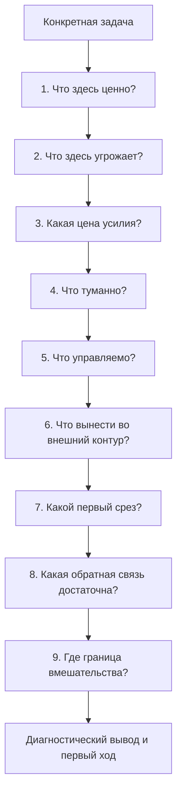

# Глава 31. Диагностика задачи

## После большой модели нужен короткий вход

К этому месту учебника уже введено много понятий.

Внешний контур мышления, рабочий журнал, ритуалы входа и выхода, мотивация, угроза, управляемость, цена усилия, усталость, прокрастинация, WIP, восстановление, ИИ и командная среда уже собраны в одну общую модель.

Это полезно, но само по себе еще не делает работу легче.

В реальной задаче человек редко сидит и думает:

```text
сейчас я проведу полный многоуровневый анализ мотивационного контура
```

Обычно ситуация проще и грубее:

```text
задача висит
я не могу войти
я хожу вокруг
я устал
я не понимаю, с чего начать
мне неприятно туда смотреть
команда ждет
```

В такой момент учебник должен дать не новую теорию, а инструмент.

Здесь начинается практикум когнитивного инженерства: предыдущие понятия собираются в одну рабочую карту диагностики задачи.

Диагностика задачи отвечает не на вопрос:

```text
что со мной не так?
```

Она отвечает на другой вопрос:

```text
какой параметр этой задачи сейчас делает действие недоступным
и какой первый ход может этот параметр изменить?
```

Это важный поворот.

Цель не в диагностике личности, а в диагностике конкретной ситуации действия.

## Почему нельзя сразу выбирать прием

Когда задача не двигается, хочется сразу найти прием.

Например:

- разбить задачу на части;
- поставить таймер;
- пообещать себе награду;
- отдохнуть;
- написать кому-то;
- попросить ИИ;
- поставить дедлайн;
- заставить себя начать;
- отменить задачу.

Все эти действия иногда могут быть хорошими.

Но они работают только тогда, когда попадают в реальное место сбоя.

Если проблема в тумане, отдых может вернуть силы, но не даст первого вопроса.

Если проблема в угрозе ошибки, таймер может только ускорить избегание.

Если проблема в низкой управляемости, новый дедлайн повысит давление, но не создаст рычаг.

Если проблема в высокой цене входа, общий совет "разбей задачу" может не помочь, пока не ясно, какая именно цена главная: когнитивная, социальная, физическая, идентичностная или восстановительная.

Если проблема в командном WIP, личная дисциплина одного человека не восстановит поток.

Поэтому когнитивное инженерство начинает практику с диагностики.

Не потому что диагностика важнее действия. А потому что без диагностики действие часто чинит не то.

## Что здесь называется задачей

Здесь задача - это не только пункт в списке дел.

Задача - это конкретная ситуация, где должно измениться внешнее или внутреннее состояние:

- разобраться в непонятной проблеме;
- написать текст;
- сделать ревью кода;
- спроектировать решение;
- подготовить разговор;
- закрыть долг;
- вернуть фокус в трек;
- восстановить рабочий ритм;
- вывести командную задачу из зависания.

У задачи есть не только название.

У нее есть:

- ценность;
- угроза;
- цена входа;
- неизвестность;
- доступные рычаги;
- ограничения;
- социальный контекст;
- способ получить обратную связь;
- место, где хранится текущее понимание;
- граница личного и системного влияния.

Если видеть только название, задача может выглядеть простой:

```text
сделать архитектурный разбор
```

Но для рабочей системы это может означать:

```text
поднять большой контекст,
не ошибиться публично,
разобраться в чужом решении,
сформулировать позицию,
не испортить отношения,
не упустить риск,
и сделать это между пятью прерываниями
```

Это уже не одна задача. Это целый узел напряжения.

Диагностика нужна, чтобы увидеть этот узел не как мутное "тяжело", а как набор рабочих параметров.

## Главная карта диагностики

Рабочий маршрут главы выглядит так:

Вопрос схемы: где именно задача теряет доступность - в ценности, угрозе, цене усилия, тумане, управляемости, внешнем контуре, первом срезе, обратной связи или границе вмешательства?



Эта схема не означает, что каждый раз нужно полчаса заполнять анкету.

Граница схемы: это инструмент первого практического разбора, а не бюрократическая форма и не клиническая диагностика состояния человека.

Она означает другое: если задача не двигается, не стоит сразу спорить с собой. Стоит пройтись по параметрам и найти, где действие теряет доступность.

Иногда достаточно двух вопросов.

Иногда нужен полный разбор.

Опытный человек со временем начинает видеть место сбоя быстрее. Но сначала лучше делать карту явно.

## 1. Что здесь ценно

Первый вопрос:

```text
зачем вообще входить в эту задачу?
```

Это не мотивационная подводка.

Ценность нужна, потому что без нее усилие теряет смысл. Если человек не понимает, что изменится благодаря задаче, система будет воспринимать действие как расход.

Ценность может быть разной:

| Область | Как звучит в задаче |
| --- | --- |
| Достижение | Закрыть сложную проблему, улучшить систему, научиться, довести до результата. |
| Принадлежность | Помочь людям, сохранить рабочий контакт, быть надежным участником команды. |
| Влияние | Изменить решение, убрать риск, защитить качество, повлиять на направление. |
| Безопасность | Снизить неопределенность, предотвратить ошибку, вернуть контроль, убрать угрозу. |

Полезно спрашивать:

```text
что станет лучше, если задача сдвинется?
какой риск уменьшится?
кто получит пользу?
какая способность у меня или у команды вырастет?
какой будущий вход станет дешевле?
```

Если ценность не находится, это тоже результат диагностики.

Возможно, задача действительно устарела. Возможно, ее смысл скрыт и требует разговора. Возможно, это чужое требование без понятной связи с результатом. Возможно, она нужна, но формулировка оторвана от реального изменения.

Тогда первый ход не "заставить себя", а вернуть смысл:

```text
уточнить цель,
найти критерий пользы,
связать задачу с более крупным результатом,
или честно поставить вопрос о необходимости задачи
```

## 2. Что здесь угрожает

Вторая часть:

```text
от чего меня защищает незапуск или откладывание?
```

Если задача ценная, это не значит, что она безопасная.

Одна и та же задача может одновременно тянуть к себе и отталкивать.

Например:

- ревью кода ценно, но угрожает конфликтом;
- публичный текст ценен, но угрожает критикой;
- архитектурное решение ценно, но угрожает ошибкой;
- разговор с сотрудником ценен, но угрожает напряжением;
- задача развития ценна, но угрожает встречей с собственной некомпетентностью.

Угроза не доказывает слабость.

Угроза показывает, что система пытается защититься.

Вопросы:

```text
какой плохой исход я ожидаю?
что я могу потерять?
какой образ себя здесь под угрозой?
чья реакция важна?
что будет, если я ошибусь?
какая часть задачи кажется социально опасной?
```

Если угроза реальна, ее нельзя просто отменить позитивной формулировкой.

Нужно спроектировать более безопасный вход:

| Угроза | Более точный первый ход |
| --- | --- |
| Ошибка | Сделать обратимую черновую проверку. |
| Критика | Показать малый фрагмент и запросить обратную связь по одному аспекту. |
| Конфликт | Разделить факты, намерение и просьбу. |
| Бессилие | Назвать реальный рычаг и границу влияния. |
| Перегруз | Ограничить рабочий блок и оставить контрольную точку. |
| Неопределенность | Сформулировать одну проверяемую гипотезу. |

Цель не в том, чтобы убрать страх.

Цель - сделать контакт с задачей достаточно безопасным, чтобы система не выбирала автоматический уход.

## 3. Какая цена усилия

Третий вопрос:

```text
сколько стоит вход в эту задачу сейчас?
```

Не вообще. Именно сейчас.

После сна, спокойного утра и понятного плана цена может быть умеренной. После дня с прерываниями, конфликтом и недосыпом та же задача может стать почти недоступной.

Цена усилия бывает разной:

| Вид цены | Как проявляется | Что может помочь |
| --- | --- | --- |
| Когнитивная | "не держу все в голове", "слишком много контекста". | Внешняя карта, схема, первый вопрос, рабочий журнал. |
| Социально-эмоциональная | "не хочу писать", "будет неприятно", "будет конфликт". | Черновик сообщения, безопасный формат, поддержка, явная рамка разговора. |
| Физическая | недосып, болезнь, боль, физическое истощение. | Реальное восстановление, снижение нагрузки, перенос тяжелого блока. |
| Идентичностная | "если не получится, значит я плохой специалист". | Режим обучения, черновой режим, малая обратная связь, отделение результата от самооценки. |
| Восстановительная | "я уже долго плачу за такие задачи и не восстанавливаюсь". | Изменение WIP, ритма, границ, поддержки, ожиданий. |

Фраза:

```text
у меня нет энергии
```

слишком грубая.

Иногда она означает усталость. Иногда - высокую цену входа. Иногда - угрозу. Иногда - низкую управляемость. Иногда - то, что задача требует слишком много контекста сразу.

Диагностический вопрос:

```text
какой тип цены сейчас закодирован как "не могу"?
```

Если цена когнитивная, нужен внешний контур.

Если цена социальная, нужен формат контакта.

Если цена физическая, нужен не героизм, а восстановление.

Если цена идентичностная, нужен черновой и обучающий режим.

Если цена восстановительная, нужен пересмотр системы нагрузки.

## 4. Что туманно

Туман - это не просто сложность.

Сложная задача может быть понятной:

```text
нужно написать тесты для трех сценариев
```

Туманная задача звучит иначе:

```text
надо разобраться, почему все как-то странно работает
```

Туман опасен тем, что может заставлять рабочую память держать слишком много возможных направлений. Человек не входит в действие, потому что не видит, какой вопрос проверять первым.

Туман полезно превращать в вопросы.

Не так:

```text
ничего не понятно
```

А так:

```text
где именно меняется состояние?
какие факты уже есть?
какая гипотеза первая?
что можно исключить за 20 минут?
какой результат проверки изменит мое понимание?
```

Полезная таблица:

| Мутная формулировка | Рабочий вопрос |
| --- | --- |
| Нужно разобраться в проблеме | Какой один сценарий воспроизводит проблему? |
| Нужно улучшить процесс | Какой сбой повторяется чаще всего? |
| Нужно понять архитектуру | Какой поток данных или решение сейчас блокирует действие? |
| Нужно написать текст | Какой тезис текст должен доказать читателю? |
| Нужно поговорить с человеком | Какое изменение после разговора будет считаться продвижением? |

Пока туман не превращен хотя бы в один вопрос, "работа над задачей" легко становится чтением, подготовкой и перемещением тревоги.

## 5. Что управляемо

Следующий вопрос:

```text
какое действие может реально изменить исход или мое понимание?
```

Управляемость - это не уверенность, что все получится.

Управляемость - это ожидаемая связь:

```text
действие -> сигнал -> корректировка -> сдвиг
```

Задача может быть трудной, но управлямой, если есть:

- первый рычаг;
- доступ к данным;
- право задать вопрос;
- возможность сделать обратимый эксперимент;
- критерий проверки;
- обратная связь, которую можно использовать;
- граница ответственности.

Задача может быть вроде бы несложной, но неуправляемой, если:

- результат зависит от чужого решения, но это не проговорено;
- человек отвечает за исход без полномочий;
- обратная связь приходит поздно или слишком общо;
- критерий успеха меняется;
- нельзя безопасно ошибиться;
- каждый шаг обесценивается новой срочностью.

Практические вопросы:

```text
какой рычаг у меня есть?
какой рычаг у команды есть?
что не находится в моей зоне влияния?
какой сигнал покажет, что шаг сработал или не сработал?
у кого нужно запросить полномочие, данные или решение?
```

Если управляемости нет, личное усилие легко превращается в расход в пустоту.

Тогда первый ход может быть не "делать", а:

```text
уточнить критерий
запросить решение
поставить границу ответственности
поднять блокер
изменить рамку задачи
```

Это тоже действие.

## 6. Что вынести во внешний контур

Если задача сложная, она не должна жить только в голове.

Диагностическая карта должна ответить:

```text
что именно нужно вынести наружу, чтобы следующий вход стал дешевле?
```

Минимальный внешний контур задачи:

```text
цель
текущий вопрос
факты
гипотезы
что уже проверено
что исключено
ограничения
следующий срез
точка продолжения
```

Это не бюрократия.

Это способ не платить каждый раз за повторное восстановление мысли.

Особенно важно выносить:

- факты, которые не надо перепроверять;
- решения, которые уже приняты;
- гипотезы, которые еще не проверены;
- исключенные пути;
- критерий продвижения;
- вопрос к другому человеку;
- контрольная точка перед паузой.

Если внешний контур отсутствует, задача быстро становится дороже при каждом возврате.

Человек может думать, что он "потерял мотивацию", хотя на самом деле он каждый раз заново поднимает холодный контекст.

## 7. Какой первый срез

Первый срез - это минимальное изменение состояния задачи, после которого задача стала понятнее, управляемее или ближе к результату.

Первый срез не обязан завершать задачу.

Он должен изменить состояние.

Плохие первые шаги:

```text
поработать над задачей
почитать материалы
подумать
посмотреть код
начать писать
```

Лучше:

```text
за 25 минут выписать факты и 3 вопроса
проверить один сценарий воспроизведения
прочитать только модуль, где меняется состояние
написать черновик первого тезиса
сформулировать один вопрос владельцу
сравнить два варианта решения по одному критерию
```

Первый срез должен иметь:

- ограничение по времени или объему;
- понятный объект работы;
- критерий, что изменится;
- место для записи результата;
- точку продолжения.

Если первый срез слишком большой, он снова становится всей задачей.

Если он слишком мелкий и не меняет состояния, он становится имитацией движения.

## 8. Какая обратная связь достаточна

Без обратной связи действие не обучает систему.

Человек сделал шаг, но не понял:

- стало ли понятнее;
- уменьшился ли риск;
- приблизился ли результат;
- нужно ли менять гипотезу;
- можно ли продолжать;
- стоит ли остановиться.

Тогда управляемость не растет.

Достаточная обратная связь не обязана быть приятной.

Она должна помогать корректировать действие.

Примеры:

| Задача | Достаточная обратная связь |
| --- | --- |
| Проверить гипотезу в коде | Сценарий воспроизводится или нет; видно место расхождения. |
| Написать текст | Тезис стал яснее; читатель понимает, что доказывается. |
| Сделать ревью | Найдены 2-3 вопроса или подтверждено, что риск не в этой области. |
| Подготовить разговор | Есть факты, намерение, просьба и граница. |
| Разобрать старение командной задачи | У задачи появился следующий срез, владелец, блокер или новый статус. |

Вопрос:

```text
после какого сигнала я смогу решить, что делать дальше?
```

Если такого сигнала нет, первый шаг нужно перепроектировать.

## 9. Где граница вмешательства

Это один из самых важных вопросов практикума.

Не всякая застрявшая задача является личной проблемой.

Иногда достаточно личного вмешательства:

- сделать карту контекста;
- снизить первый шаг;
- оставить контрольную точку;
- сформулировать вопрос;
- сменить режим работы;
- попросить обратную связь.

Иногда нужен командный уровень:

- ограничить WIP;
- уточнить приоритет;
- убрать повторяющиеся прерывания;
- договориться о формате срочности;
- сделать внешнее состояние трека;
- разобрать старение задачи без обвинения;
- распределить поддержку.

Иногда нужен организационный уровень:

- изменить ожидания;
- выровнять полномочия и ответственность;
- снять конфликт приоритетов;
- пересмотреть нагрузку;
- признать нехватку ресурсов;
- эскалировать решение;
- остановить работу, которая создает больше вреда, чем пользы.

Диагностический вопрос:

```text
я пытаюсь личным усилием решить личную, командную или организационную проблему?
```

Если это личная задача, микрошаг может быть хорош.

Если это командный WIP, микрошаг одного человека может только временно скрыть проблему.

Если это организационная противоречивость, личный героизм часто превращается в самоизнос.

Зрелая диагностика иногда заканчивается не действием внутри задачи, а изменением рамки:

```text
нужен владелец решения
нужен другой критерий
нужна разгрузка
нужно остановить параллельный трек
нужно явно принять риск
нужно сказать "это вне моей управляемости"
```

Это не уход от ответственности. Это точное признание уровня вмешательства.

## Быстрая диагностическая таблица

Когда времени мало, можно начать с таблицы сигналов.

| Сигнал | Возможное место поломки | Первый вопрос | Первый ход |
| --- | --- | --- | --- |
| Не начинаю, хотя задача важна | Угроза, цена входа, туман | От чего меня защищает незапуск? | Назвать угрозу и сделать безопасный первый контакт. |
| Читаю и уточняю без конца | Туман, нет проверяемой гипотезы | Какую одну гипотезу можно проверить? | Сформулировать проверку на 20-40 минут. |
| Делаю мелкое вместо главного | Высокая цена глубокого входа, WIP | Какой контекст я избегаю поднять? | Ограничить один глубокий блок и оставить контрольную точку. |
| Начинаю и бросаю | Шаг слишком большой, обратная связь неясна | Какой сигнал покажет продвижение? | Уменьшить срез и заранее определить сигнал. |
| Задача висит "в работе" | Старение задачи, блокер, нет следующего среза | Что мешает следующему срезу? | Назвать блокер, владельца, следующий кусок или изменить статус. |
| После отдыха не лучше | Медленная усталость, долг восстановления, системная нагрузка | Что не восстанавливается? | Проверить WIP, сон, нагрузку, границы и ожидания. |
| Шаг кажется бесполезным | Низкая управляемость | Как действие изменит исход или понимание? | Найти рычаг, данные, обратную связь или эскалировать отсутствие рычага. |
| Все зависит не от меня | Граница влияния | Что личное, что командное, что организационное? | Перенести вопрос на нужный уровень. |

Таблица не заменяет мышление.

Она защищает от автоматического вывода:

```text
я просто ленюсь
```

или:

```text
команда просто плохо фокусируется
```

В большинстве сложных ситуаций проблема точнее.

## Полный пример: туманная инженерная задача

Представим задачу:

```text
периодически объект остается в промежуточном состоянии,
нужно разобраться и предложить исправление
```

Человек третий день не входит в задачу. Он открывает код, читает соседние файлы, отвечает в чатах, смотрит старые обсуждения, но не получает сдвига.

Поверхностная формулировка:

```text
я прокрастинирую
```

Проведем диагностику.

### Задача

```text
Понять, почему объект остается в промежуточном состоянии,
и определить первый безопасный вариант исправления или дальнейшей проверки.
```

Уже видно, что задача не "починить все", а сначала понять место расхождения.

### Ценность

Что здесь ценно:

- снижается риск некорректного состояния данных;
- поддержка получит более понятный сценарий;
- команда перестанет возвращаться к одному и тому же инцидентному хвосту;
- появится знание о слабом месте процесса;
- будущие похожие задачи будут дешевле.

Ценность есть.

Задача не пустая.

### Угроза

Что угрожает:

- можно ошибиться и предложить неверное исправление;
- можно вскрыть, что предыдущие решения были неполными;
- придется задавать вопросы людям, которые уже заняты;
- есть риск потратить много времени и ничего не найти;
- задача может оказаться глубже, чем казалась.

Незапуск защищает от встречи с неопределенностью и возможной некомпетентностью.

Это не "лень". Это защитная политика.

### Цена усилия

Главная цена:

- когнитивная: большой контекст, несколько сценариев, неизвестный порядок операций;
- идентичностная: неприятно долго не понимать;
- восстановительная: задача возвращается после прерываний, каждый вход холодный.

Физическая цена сейчас не главная, но если человек уже недоспал и весь день был в срочностях, она усилит остальные.

### Туман

Мутная формулировка:

```text
непонятно, где ломается состояние
```

Рабочие вопросы:

1. Состояние меняется до внешнего вызова или после него?
2. Что происходит при тайм-ауте?
3. Есть ли обработчик ошибки, который переводит объект в безопасный статус?
4. Какие события уже есть в логах?
5. Можно ли воспроизвести один сценарий локально или на тестовой среде?

Первый вопрос:

```text
где именно меняется состояние относительно внешнего вызова?
```

### Управляемость

Что управляемо:

- можно открыть код перехода состояния;
- можно сравнить успешный сценарий и сценарий с тайм-аутом;
- можно выписать факты;
- можно задать один вопрос владельцу соседнего компонента;
- можно не обещать исправление до проверки гипотезы.

Что не управляемо прямо сейчас:

- поведение внешней системы;
- сроки ответа другого владельца;
- полное исправление без уточнения сценария.

Значит, первый шаг должен быть исследовательским, а не обещающим финальное исправление.

### Внешний контур

Нужно создать короткую карту:

```text
# Задача: объект остается в промежуточном состоянии

## Цель
Понять место расхождения и определить следующий безопасный ход.

## Факты
- Объект создается до внешнего вызова.
- В неуспешном сценарии виден тайм-аут.
- После тайм-аута объект иногда остается в промежуточном статусе.

## Вопрос
Где меняется состояние относительно внешнего вызова?

## Гипотеза
Состояние меняется до внешнего вызова, а обработка тайм-аута не закрывает переход.

## Проверка
Сравнить порядок операций в успешном сценарии и сценарии с тайм-аутом.

## Ограничения
Не менять обработку без понимания влияния на повторные вызовы.
```

Теперь задача перестала быть облаком.

Она стала внешним объектом.

### Первый срез

Первый срез:

```text
За 30 минут открыть код перехода состояния,
найти место изменения статуса,
сравнить успешный сценарий и сценарий с тайм-аутом,
записать, какая гипотеза выжила.
```

Это не вся задача.

Но после такого среза состояние задачи изменится.

### Достаточная обратная связь

После первого среза должно стать ясно одно из трех:

1. Состояние меняется до внешнего вызова, и гипотеза усилилась.
2. Состояние меняется после внешнего вызова, и нужно искать другой участок.
3. Из кода не видно, нужен лог или вопрос владельцу.

Все три исхода полезны.

Даже третий не является провалом, потому что он превращает туман в конкретный следующий запрос.

### Граница вмешательства

Личный уровень:

- собрать факты;
- проверить порядок операций;
- зафиксировать гипотезу;
- оставить контрольную точку.

Командный уровень:

- если задача стареет, вынести внешнее состояние на общее место;
- договориться, кто владеет решением;
- уточнить, кто отвечает за внешний компонент.

Организационный уровень:

- если проблема связана с отсутствием владения или конфликтом требований, это не решается одиночным глубоким блоком.

### Диагностический вывод

Задача не движется не потому, что "нет мотивации".

Основной сбой:

```text
туман + высокая когнитивная цена входа + слабый внешний контур
```

Первый ход:

```text
сделать один исследовательский срез и зафиксировать результат во внешней карте
```

После этого уже можно решать, нужно ли исправление, вопрос, эскалация или новая гипотеза.

## Пример: задача застряла у команды

Теперь короткий командный пример.

На доске есть задача:

```text
улучшить стабильность ночного процесса
```

Она висит "в работе" третью неделю.

Поверхностные объяснения:

```text
нет фокуса
не хватает ответственности
все заняты срочным
```

Диагностика:

| Параметр | Наблюдение |
| --- | --- |
| Ценность | Снизить ночные алерты и ручные вмешательства. |
| Угроза | Можно затронуть критичный процесс и получить новый инцидент. |
| Цена усилия | Высокий контекст, много владельцев, работа ночью или около дежурств. |
| Туман | Не ясно, какой именно класс сбоев самый частый. |
| Управляемость | Команда может собрать статистику по последним сбоям, но не может одна изменить соседний сервис. |
| Внешний контур | Состояние разбросано по чатам, алертам и памяти дежурных. |
| Первый срез | За неделю собрать 5 последних сбоев и классифицировать по причине. |
| Обратная связь | Появится топ-1 класс проблемы и владелец следующего решения. |
| Граница | Если топ-причина в соседнем сервисе, нужен межкомандный договор, а не локальный героизм. |

Диагностический вывод:

```text
задача стареет не из-за отсутствия ответственности,
а из-за тумана, распределенного контекста,
страха сломать критичный процесс
и неясной границы влияния команды
```

Первый ход:

```text
сделать внешнее состояние трека,
собрать последние случаи,
выбрать один класс проблемы,
назначить следующий срез,
и отдельно зафиксировать внешнюю зависимость
```

Это уже не призыв "сфокусироваться".

Это изменение командного контура задачи.

## Шаблон диагностики задачи

Этот шаблон можно вставлять в рабочий журнал.

```text
# Диагностика задачи

## Задача
<что должно измениться>

## 1. Ценность
Что станет лучше, если задача сдвинется?
Какой риск уменьшится?
Кому это важно?

## 2. Угроза
От чего меня или команду защищает незапуск?
Что может пойти плохо?
Какая социальная, профессиональная или идентичностная цена здесь есть?

## 3. Цена усилия
Какая цена главная: когнитивная, социальная, физическая, идентичностная, восстановительная?
Это усталость, высокая цена входа или системный перегруз?

## 4. Туман
Что именно непонятно?
Какие 1-3 вопроса можно проверить?
Какая гипотеза первая?

## 5. Управляемость
Какой рычаг у меня есть?
Какой рычаг у команды есть?
Что вне зоны влияния?

## 6. Внешний контур
Где лежит текущее состояние задачи?
Какие факты, гипотезы, решения и исключенные пути нужно записать?

## 7. Первый срез
Какой срез на 20-40 минут изменит состояние задачи?

## 8. Обратная связь
Какой сигнал покажет, что шаг сработал, не сработал или изменил понимание?

## 9. Граница вмешательства
Это личная, командная или организационная проблема?
Нужен микрошаг, разговор, эскалация, разгрузка, решение или отказ от неверной рамки?

## Диагностический вывод
Основное место поломки:
Первый ход:
Контрольная точка:
```

Не нужно каждый раз заполнять шаблон идеально.

Нужно, чтобы после него стало яснее:

```text
где застряло действие
и что делать первым
```

## Типовые ошибки диагностики

### Ошибка 1. Диагностировать человека вместо задачи

Плохой вопрос:

```text
почему я такой несобранный?
```

Рабочий вопрос:

```text
какой параметр задачи сейчас делает вход дорогим?
```

Человек может быть усталым, испуганным, перегруженным, раздраженным или растерянным. Это важно. Но практическая диагностика начинается с ситуации действия, а не с ярлыка личности.

### Ошибка 2. Остановиться на ценности

Иногда человек говорит:

```text
я понимаю, что задача важная
```

и делает вывод:

```text
значит, я должен просто сделать
```

Но ценность не отменяет угрозу, цену, туман и низкую управляемость.

Если задача важная и одновременно угрожающая, давление может усилить избегание.

### Ошибка 3. Принять усталость за отсутствие мотивации

Если после нескольких недель перегруза задача не идет, вопрос "почему я не хочу?" может быть неверным.

Лучше спросить:

```text
какая цена не восстановилась?
что происходит с WIP?
какой режим работы делает вход недоступным?
```

### Ошибка 4. Делать маленький шаг без обратной связи

Маленький шаг полезен не потому, что он маленький.

Он полезен, если дает контакт с задачей и обратную связь.

Если человек 20 минут перекладывал файлы, но не изменил понимание, это мог быть не первый срез, а обход.

### Ошибка 5. Личным усилием чинить системную проблему

Иногда задача не движется, потому что:

- слишком много активного WIP;
- нет владельца решения;
- конфликтуют приоритеты;
- ответственность не совпадает с полномочиями;
- обратная связь приходит только как новая срочность;
- команда живет в долге восстановления.

В такой ситуации личный микрошаг может быть полезен для ясности, но он не должен скрывать системную причину.

### Ошибка 6. Превратить диагностику в бесконечное размышление

Диагностика должна заканчиваться выводом.

Минимальный вывод:

```text
основное место поломки:
первый ход:
какой обратной связи жду:
где оставлю контрольную точку:
```

Если после диагностики нет первого хода, диагностика не завершена.

## Как понять, что диагностика хорошая

Хорошая диагностика помогает сделать хотя бы одну из этих вещей:

- уточняет ценность;
- может снизить угрозу входа;
- называет главную цену;
- превращает туман в вопрос;
- возвращает рычаг;
- создает внешний контур;
- выбирает первый срез;
- определяет обратную связь;
- переносит проблему на правильный уровень.

Плохая диагностика выглядит умной, но не меняет действия.

Она может много говорить о мотивации, дофамине, дисциплине, тревоге, прокрастинации и выгорании, но не отвечает:

```text
что именно я сделаю или изменю первым?
```

## Мини-словарь главы

| Понятие | Значение |
| --- | --- |
| Диагностика задачи | Внешний разбор конкретной ситуации действия, чтобы найти место сбоя и первый ход. |
| Место поломки действия | Параметр, из-за которого задача сейчас не движется: ценность, угроза, цена, туман, управляемость, обратная связь, WIP, граница. |
| Первый срез | Малый, проверяемый шаг, который меняет состояние задачи, но не обязан завершать ее. |
| Достаточная обратная связь | Сигнал, который позволяет корректировать следующий шаг. |
| Внешний контур | Записанное состояние задачи: цель, факты, вопросы, гипотезы, решения, ограничения, следующий шаг и контрольная точка. |
| Граница вмешательства | Различение личного, командного и организационного уровня проблемы. |
| Диагностический вывод | Короткая формулировка: где застряло действие, какой первый ход нужен и какая обратная связь ожидается. |

## Вопросы для самопроверки

1. Почему диагностика задачи не должна начинаться с вопроса "что со мной не так"?
2. Чем ценность отличается от желания входить в задачу?
3. Почему угроза не является доказательством слабости?
4. Какие виды цены усилия могут скрываться за фразой "нет энергии"?
5. Чем туман отличается от сложности?
6. Почему управляемость не равна высокой вероятности успеха?
7. Что делает первый срез полезным?
8. Чем обратная связь отличается от оценки?
9. Когда правильный вывод диагностики находится не на личном уровне?

## Мини-практика

Возьмите одну задачу, которая висит или вызывает сопротивление.

Заполните короткую форму:

| Вопрос | Ответ |
| --- | --- |
| Что должно измениться? |  |
| Что здесь ценно? |  |
| Что здесь угрожает? |  |
| Какая цена усилия главная? |  |
| Что туманно? |  |
| Что управляемо? |  |
| Что нужно вынести во внешний контур? |  |
| Какой первый срез на 20-40 минут? |  |
| Какая обратная связь будет достаточной? |  |
| Это личный, командный или организационный уровень? |  |
| Первый ход |  |
| Контрольная точка после первого хода |  |

Если вы не можете ответить на все вопросы, это нормально.

Найдите самый мутный пункт и начните с него.

Часто первый срез как раз и состоит в том, чтобы уточнить один недостающий параметр.

## Короткое резюме

1. Диагностика задачи нужна не для самокопания, а для выбора первого вмешательства.
2. Задача может не двигаться из-за разных параметров: ценности, угрозы, цены усилия, тумана, низкой управляемости, слабого внешнего контура, отсутствия обратной связи или системной границы.
3. Ценность не отменяет угрозу и цену.
4. "Нет энергии" нужно расшифровывать, а не оспаривать.
5. Туман полезно превращать в проверяемые вопросы.
6. Управляемость может расти через действие, обратную связь и корректировку.
7. Полезный первый срез меняет состояние задачи.
8. Обратная связь нужна не для оценки человека, а для следующей корректировки.
9. Не всякая застрявшая задача является личной проблемой.
10. Хорошая диагностика заканчивается выводом: где застряло действие, какой первый ход нужен и какая контрольная точка останется.

## Источниковая опора

Проверенный источниковый пакет: пакет источников для главы 31 от 2026-05-25.

Ключевые источники в авторско-годовом формате:

- Baddeley (2012), Diamond (2013), Badre (2025): рабочая память, исполнительные функции и когнитивный контроль как причина выносить диагностику задачи наружу, а не удерживать всю ситуацию внутри головы.
- Hutchins (1995), Norman (1991, 1993), Scaife & Rogers (1996), Risko & Gilbert (2016), Gilbert (2015a, 2015b), Boldt & Gilbert (2019): внешнее мышление, когнитивные артефакты, когнитивная разгрузка, отложенные намерения, напоминания и внешняя фиксация с учетом уверенности как основа диагностических карт, таблиц и состояния задачи.
- Altmann & Trafton (2002), Trafton et al. (2003), Trafton & Monk (2008), Parnin & DeLine (2010), Parnin & Rugaber (2011): память о цели, возобновление задачи, подсказки и контрольные точки как опоры возвращения к работе.
- McClelland (1961, 1987/1988), Ryan & Deci (2000, 2017), Baumeister & Leary (1995), Morris et al. (2022): ценность, потребности, принадлежность и качество мотивации за вопросом "что здесь важно?".
- Elliot & Covington (2001), Elliot (2006), McNaughton & Corr (2004), Aupperle et al. (2011), Krypotos et al. (2015), Sirois & Pychyl (2013), Steel (2007), Zhang et al. (2019): угроза, избегание, прокрастинация и краткосрочное облегчение.
- Skinner (1996), Bandura (1977, 1997), Maier & Seligman (2016), Limbachia et al. (2021), Langer (1975): конструкции контроля, самоэффективность, управляемость и граница между реальным контролем и иллюзией контроля.
- Salamone & Correa (2024), Treadway et al. (2009, 2012), Shenhav et al. (2013), Kurzban et al. (2013), Inzlicht et al. (2018), Muller et al. (2021), McEwen (1998), Barrett & Simmons (2015): цена усилия, усталость, аллостаз и интероцепция.
- Demerouti et al. (2001), Bakker & Demerouti (2007, 2017), Karasek (1979), Siegrist (1996), Sonnentag et al. (2017, 2022), World Health Organization (2019/2022), Maslach & Leiter (2016), Monsell (2003), Leroy (2009), Czerwinski, Horvitz & Wilhite (2004), Mark, Gudith & Klocke (2008), Tregubov et al. (2017), Ma, Huang & Leach (2024): устройство работы, командный WIP, прерывания, восстановление и граничные условия.

Роль источникового блока: `strong` для базовых механизмов, уже встроенных в предыдущие главы: ограничений рабочей памяти, внешнего мышления, возобновления цели, SDT, самоэффективности, управляемости, усилия, восстановления и границ выгорания; `context-dependent` для самой диагностической формы и выбора первого вмешательства; `mixed` для простых вмешательств в планирование и прокрастинацию, когда их используют как универсальные решения; `clinical-boundary` для здоровья, тяжелого истощения, выгорания и случаев, где рычаг находится на медицинском, психотерапевтическом, командном или организационном уровне, а не на личном.

Полные библиографические записи и DOI сохранены в пакете главы и в более ранних источниковых пакетах. Текущая редакция оставляет короткий авторско-годовой блок как читательский ориентир.

## Зачем нужен следующий слой

Диагностика дает инструмент для разбора отдельной задачи.

Но если каждый раз собирать его с нуля, он сам станет тяжелой задачей.

Поэтому следующий слой - личный когнитивный контур:

```text
как устроить рабочую систему так,
чтобы вход в задачи,
внешняя память,
первый срез,
обратная связь,
выход,
возвращение
и восстановление
были не случайными приемами,
а повторяемым способом работы
```

Такой контур помогает сделать диагностику не подвигом, а нормальной частью мышления.

## Статус

`ready-for-review`

Ревизия блока: служебная проверка "Ревизия блока 31-36" от 2026-05-25.
