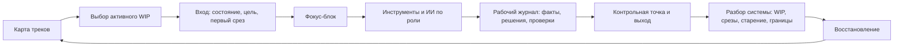

# Глава 32. Проектирование личного когнитивного контура

## От разовой диагностики к рабочей системе

Диагностическая карта задачи уже собрана.

Она помогает войти в конкретную ситуацию:

```text
что здесь ценно
что угрожает
какая цена усилия
что туманно
что управляемо
какой первый срез
какая обратная связь нужна
где граница вмешательства
```

Это уже практический инструмент.

Но в реальной работе проблема редко состоит в том, что нужно один раз хорошо разобрать одну задачу.

Обычно задач несколько. Они стареют, прерываются, возвращаются, конкурируют за внимание, оставляют тревожный фон, требуют ответов от других людей, иногда зовут ИИ, иногда требуют восстановления, иногда оказываются не личной, а командной или организационной проблемой.

Если каждый вход каждый раз приходится собирать заново, человек платит слишком высокую цену.

Он открывает задачу и снова вспоминает:

```text
что я хотел сделать
где остановился
что уже проверял
почему пошел этим путем
какой вопрос был главным
какой ответ ИИ я тогда принял
что осталось рискованным
что делать первым
```

Часть энергии уходит не на задачу, а на восстановление самой возможности думать.

Поэтому после диагностики задачи нужен следующий слой: личный когнитивный контур.

## Что такое личный когнитивный контур

Личный когнитивный контур - это повторяемая организация работы, в которой человек не держит все важное только в голове.

Контур соединяет:

- карту треков;
- выбор активного WIP;
- правила входа;
- рабочий журнал;
- фокус-блок;
- инструменты и ИИ;
- контрольную точку;
- разбор системы;
- восстановление;
- следующий вход.

Это не приложение. Не набор шаблонов. Не тайм-менеджмент. Не ритуал "идеального утра".

Инструменты могут быть какими угодно: Obsidian, бумага, доска, календарь, трекер задач, обычный текстовый файл, ИИ-диалог, таблица. Важна не марка инструмента, а функция.

Контур должен отвечать на простые рабочие вопросы:

```text
какие треки сейчас существуют?
что сейчас активно?
где лежит состояние каждого важного трека?
как я вхожу в активный трек?
что должно измениться за рабочий блок?
как я использую инструменты и ИИ?
как я выхожу, чтобы следующий вход был дешевле?
как я замечаю, что система начала ломаться?
как я восстанавливаю доступность действия?
```

Если система не отвечает на эти вопросы, она может быть красивой, но она не является рабочим контуром.

## Главная схема контура

Базовый цикл выглядит так:

Вопрос схемы: как собрать повторяемый контур, который удерживает треки, может снижать цену входа, сохраняет ход мысли и не превращает ИИ или инструменты в замену субъектности?



Эту схему не нужно понимать как длинный чеклист на каждый час.

Граница схемы: это не проект идеальной системы продуктивности. Важно, чтобы контур был достаточно маленьким, чтобы им реально пользоваться, и достаточно полным, чтобы следующий вход не начинался с нуля.

Это цикл сохранения управляемости.

Карта треков показывает, что существует. Выбор активного WIP говорит, что получает глубокий контакт сейчас. Вход поднимает внешнее состояние. Фокус-блок дает срез продвижения. Инструменты и ИИ помогают, но не забирают постановку и проверку. Журнал хранит ход мысли. Контрольная точка готовит будущий вход. Разбор системы помогает чинить правила. Восстановление может делать следующий вход возможным.

Если один элемент выпадает, контур может какое-то время работать, но цена растет.

Нет карты треков - важные задачи живут тревожным фоном.

Нет активного WIP - человек прыгает между тем, что громче.

Нет входа - каждый блок начинается с холодного разгона.

Нет среза - день занят, но состояние задачи не изменилось.

Нет контрольной точки - следующий вход снова дорогой.

Нет разбора системы - система незаметно стареет.

Нет восстановления - контур держится нажимом.

## Контур начинается не с инструментов

Самая частая ошибка - начинать с вопроса:

```text
где вести систему?
```

Это вторичный вопрос.

Сначала нужно понять:

```text
какие функции система должна выполнять?
```

Плохой путь:

```text
найти приложение
-> перенести туда все задачи
-> настроить красивые статусы
-> через неделю перестать открывать
```

Так происходит не потому, что приложение плохое. Часто оно просто не встроено в петлю действия.

Если человек не открывает систему на входе, она становится архивом.

Если не оставляет контрольную точку на выходе, система не защищает будущий вход.

Если разбор системы не приводит к ремонту правил, система становится отчетностью.

Если восстановление не встроено, система превращается в машину нажима.

Поэтому проектировать нужно не место хранения, а контур:

```text
вход
-> действие
-> след
-> выход
-> разбор системы
-> восстановление
-> следующий вход
```

## Карта треков: что живет в системе

Первый элемент - карта треков.

Трек - это не отдельный пункт списка дел. Это рабочий контекст, который может требовать внимания во времени.

Например:

- сложная инженерная задача;
- текст или исследовательская глава;
- регулярные ревью;
- координация с людьми;
- обучение;
- семейное или личное обязательство;
- восстановление после плотной недели;
- фоновый долг, который нельзя забыть;
- ожидающее решение от другого человека.

Если все это лежит в одном TODO-списке, система видит только действия.

Но человеку нужно видеть состояние треков.

Минимальная карта треков:

| Трек | Режим | Где состояние | Следующий срез | Следующий контакт | Риск старения |
| --- | --- | --- | --- | --- | --- |
| Архитектурный разбор | глубокий | Журнал задачи | Проверить гипотезу A | Сегодня 10:00 | Высокий: нет среза 3 дня |
| Ревью кода | оперативный | Очередь ревью | Закрыть 2 риска | После глубокого блока | Средний |
| Учебный текст | фоновый/глубокий | План главы | Собрать примеры | Среда утром | Низкий |
| Вопрос к человеку | ожидание | Заметка/чат | Дождаться ответа | Завтра | Средний |
| Восстановление | восстановление | Календарь/ритм | Вечер без рабочего хвоста | Сегодня вечером | Высокий, если сорвать |

Такая карта не нужна, чтобы любоваться порядком.

Она нужна, чтобы не держать все треки в голове как одинаково активные.

Важное различение:

```text
трек может быть важным,
но не быть активным прямо сейчас
```

Если у неактивного трека есть контейнер и следующий контакт, он перестает тревожно висеть в памяти.

Если контейнера нет, мозг вынужден напоминать о нем через беспокойство.

## Слои личного WIP

Полезно разделять пять слоев.

| Слой | Что это | Какой вопрос задавать |
| --- | --- | --- |
| Глубокий | Треки, требующие анализа, письма, проектирования, понимания. | Какой один глубокий срез сейчас главный? |
| Оперативный | Быстрые ответы, ревью, координация, мелкие решения. | Когда я этим занимаюсь, чтобы не съесть глубокий вход? |
| Ожидание | Ожидание ответа, события, решения, данных. | Где записан следующий контакт и условие возврата? |
| Фоновый | Важное, но не активное сейчас. | Оно хранится во внешнем контейнере или тревожит из головы? |
| Восстановление | Сон, паузы, вечер, движение, отключение, восстановление после нагрузки. | Что защищает будущую доступность действия? |

Слой восстановления важен.

Если восстановление не считается частью системы, оно часто проигрывает срочному и видимому. Тогда личный контур начинает жить в долг.

В краткосрочной перспективе человек может продолжать нажимать. В долгосрочной - следующий вход дорожает, WIP в голове растет, туман становится неприятнее, ИИ все чаще используется как обход, а разбор системы превращается в разговор о том, почему опять не получилось.

## Выбор активного WIP

Полезно, чтобы личная система каждый рабочий период отвечала:

```text
какой трек сейчас получает глубокий контакт?
```

Не "что вообще важно", а именно:

```text
что сейчас получит срез продвижения?
```

Срез продвижения - это изменение состояния трека.

Он не обязан закрывать всю задачу.

Примеры срезов:

| Трек | Срез продвижения |
| --- | --- |
| Исправление ошибки | Проверена одна гипотеза и записан результат. |
| Архитектура | Сравнены два варианта по одному критерию. |
| Текст | Сформулирован главный тезис раздела. |
| Разговор | Выписаны факты, намерение, просьба и граница. |
| Обучение | Извлечено из памяти и проверено одно понятие. |
| Восстановление | Вечер завершен без рабочего хвоста и нового открытого контура. |

Если день дает много активности, но ни одного среза по важным трекам, контур не работает.

Он может быть занятым. Но он не сохраняет управляемость.

## Правило входа

Вход в работу не должен начинаться с вопроса:

```text
есть ли у меня настроение?
```

Настроение может помочь. Но оно слишком ненадежно как точка запуска.

Лучше иметь короткое правило входа.

Минимальный вход:

```text
1. Открыть карту треков.
2. Выбрать один активный срез.
3. Открыть контейнер или журнал трека.
4. Прочитать последнюю контрольную точку.
5. Сформулировать первый проверяемый вопрос.
6. Начать блок.
```

Для тяжелой задачи вход может быть чуть полнее:

```text
Трек:
Почему он сейчас активен:
Последняя контрольная точка:
Ценность текущего среза:
Главная угроза:
Цена входа:
Первый вопрос:
Обратная связь:
Граница блока:
```

Это не стоит заполнять каждый раз как бюрократическую форму.

Полный вход нужен, когда задача не пускает, вызывает сопротивление, распалась после паузы или стала слишком туманной.

В обычный день достаточно короткого входа.

Хорошее правило:

```text
чем хуже состояние,
тем меньше стоит делать вход,
но тем важнее внешнее состояние
```

В плохой день система не должна требовать идеальной дисциплины. Она должна помогать сделать минимальный контакт.

## Фокус-блок: не время, а изменение состояния

Многие системы строятся вокруг времени:

```text
работать 25 минут
работать 2 часа
работать 6 часов в фокусе
```

Время полезно как ограничитель. Но оно не является главным результатом.

Главный вопрос:

```text
что изменилось в состоянии трека?
```

Фокус-блок должен иметь:

- один рабочий вопрос;
- ограничение по времени или объему;
- внешний журнал;
- критерий среза;
- место для результата;
- выход с контрольной точкой.

Например:

```text
За 40 минут проверить,
где меняется состояние объекта относительно внешнего вызова.

Результат блока:
одна схема порядка операций,
одна подтвержденная или отвергнутая гипотеза,
один следующий вопрос.
```

Это лучше, чем:

```text
поработать над задачей
```

Потому что после блока можно увидеть, изменилось ли состояние задачи.

## Рабочий журнал как память контура

Рабочий журнал в личном контуре выполняет не архивную, а операционную функцию.

Он хранит:

- зачем трек активен;
- что уже известно;
- что проверено;
- что исключено;
- какие решения приняты;
- какие допущения открыты;
- где использовался ИИ;
- что принято из ответа ИИ;
- что проверено;
- какой следующий срез;
- где точка продолжения.

Плохой журнал:

```text
Сегодня опять занимался задачей.
Много читал.
Надо продолжить.
```

Он почти не помогает будущему входу.

Хороший журнал:

```text
Проверил гипотезу A: не подтвердилась.
Причина: в сценарии тайм-аута состояние уже изменено до внешнего вызова.
Исключено: обработчик B не влияет на этот переход.
Осталось туманным: почему retry не возвращает безопасный статус.
Следующий срез: сравнить путь повторной попытки в успешном сценарии и сценарии тайм-аута.
Начать с файла X и лога Y.
```

Такой журнал может снижать цену будущего входа.

Главный тест журнала:

```text
будущий я сможет войти в задачу быстрее благодаря этой записи?
```

Если нет, это может быть ценная заметка, но контур не замкнулся.

## ИИ внутри контура

ИИ должен входить в личный контур как инструмент с ролью.

Не так:

```text
вот задача, реши
```

А так:

```text
контекст:
что известно, что проверено, где туман

моя гипотеза:
...

роль ИИ:
помоги найти скрытые допущения
или предложи проверки
или выступи оппонентом
или помоги переписать уже готовый черновик

проверка:
как я пойму, что ответ полезен
```

После ИИ нужен обратный ход в контур:

```text
что ИИ предложил
что я принял
что отверг
что требует проверки
какое решение мое
какой след остался
```

Если этого нет, ИИ может внешне ускорить работу, но внутренне ухудшить следующий вход.

Через день останется не понимание, а смутное:

```text
мы вроде что-то решили
```

Это опасное состояние. Оно похоже на завершение, но не дает управляемого продолжения.

Правило:

```text
ИИ может ускорять контур,
но не должен заменять цель, критерий, проверку, решение и след
```

## Правило выхода

Выход из задачи - это начало следующего входа.

Плохой выход:

```text
устал, закрываю
```

или:

```text
вроде понятно, потом продолжу
```

Такие выходы оставляют будущему человеку холодный контекст.

Хороший выход оставляет контрольную точку.

Минимальная контрольная точка:

```text
Что изменилось:
Что проверено:
Что исключено:
Что осталось туманным:
Следующий срез:
С чего начать:
Когда следующий контакт:
```

Для короткого блока можно использовать еще короче:

```text
сделал:
узнал:
дальше:
```

Главное - чтобы поле "дальше" было физическим или проверяемым.

Не:

```text
продолжить разбираться
```

А:

```text
открыть файл X,
проверить ветку Y,
сравнить два сценария,
написать вопрос владельцу Z
```

Если выход не оставляет следующего действия, система платит за это при следующем входе.

## Разбор системы: ремонт, а не суд над человеком

Разбор системы нужен, чтобы увидеть, работает ли контур.

Но разбор легко испортить.

Плохой разбор спрашивает:

```text
почему я опять не справился?
почему я такой недисциплинированный?
почему я не сделал все, что запланировал?
```

После такого разбора часто больше вины, но не больше управляемости.

Хороший разбор спрашивает:

```text
какой трек получил срез?
какой трек стареет?
где WIP стал слишком широким?
где не было контрольной точки?
где ИИ оставил непроверенный хвост?
где разбор показывает не личный сбой, а системную границу?
что нужно изменить в правилах входа, WIP, коммуникации или восстановлении?
```

Разбор нужен, чтобы ремонтировать контур.

Он может быть коротким.

Ежедневный разбор:

```text
1. Какой срез сегодня появился?
2. Где остался открытый WIP в голове?
3. Какая контрольная точка нужна перед завтра?
4. Что должно восстановить следующий вход?
```

Недельный разбор:

```text
1. Какие треки активны?
2. Какие треки стареют без контакта?
3. Где слишком много глубокого WIP?
4. Где оперативный слой съедает глубокий вход?
5. Где ИИ или инструменты создали непроверенные хвосты?
6. Где нагрузка превышает восстановление?
7. Какой один ремонт системы важнее всего?
```

Разбор системы не должен становиться большим отчетом.

Если его долго писать, он сам станет отдельным треком и начнет конкурировать с работой.

## Восстановление как часть контура

Личный контур не должен заканчиваться на контрольной точке.

После выхода нужен вопрос:

```text
что должно произойти,
чтобы следующий вход был возможен?
```

Иногда достаточно короткой паузы.

Иногда нужен вечер без рабочего хвоста.

Иногда нужно закрыть чат, выйти из операционного режима, поспать, пройтись, поесть, убрать открытые вкладки, перенести непосильный WIP или честно сказать, что еще один глубокий блок сегодня будет фикцией.

Восстановление не является наградой.

Оно является обслуживанием будущей доступности действия.

Если восстановление постоянно вытесняется, контур превращается в петлю самоизноса:

```text
много WIP
-> мало восстановления
-> дороже вход
-> больше избегания и срочности
-> еще больше нажима
-> еще меньше восстановления
```

Это не проблема "неправильного настроя". Это сбой режима.

Поэтому в карте треков восстановление стоит сделать видимым слоем.

Не обязательно в пафосном виде. Достаточно простого вопроса:

```text
что сегодня защищает завтрашний вход?
```

## Как понять, что контур работает

Контур работает не тогда, когда человек идеально следует системе.

Он работает, когда после обычных сбоев есть путь возврата.

Наблюдаемые признаки:

| Признак | Что он означает |
| --- | --- |
| Важные треки видны снаружи. | Они не живут только тревогой и памятью. |
| У активного трека есть следующий срез. | Фокус направлен на изменение состояния, а не на занятость. |
| Неактивные треки имеют следующий контакт. | Их не нужно постоянно удерживать в голове. |
| Вход начинается с внешнего состояния. | Рабочая память не платит каждый раз полную цену восстановления. |
| После блока есть контрольная точка. | Следующий вход подготовлен. |
| ИИ оставляет проверяемый след. | Инструмент усиливает контур, а не стирает авторство решения. |
| Разбор системы приводит к одному ремонту. | Система становится управляемее, а не просто оценивает человека. |
| Восстановление может снижать цену следующего входа. | Контур не живет на долге. |

Если признаки не выполняются, это не повод обвинять себя.

Это повод искать место поломки.

## Типичные поломки личного контура

| Сигнал | Что может быть сломано | Первый ремонт |
| --- | --- | --- |
| Важные задачи тревожат фоном | Нет карты треков или следующего контакта | Выписать треки, контейнеры и следующий контакт. |
| Каждый вход начинается с "что вообще было?" | Слабая контрольная точка | Усилить выход: факты, решение, следующее действие. |
| День занят, но нет сдвига | Нет срезов продвижения | Ввести правило одного среза для активного трека. |
| ИИ дает ответы, но навык не растет | ИИ стал первым автором | Вернуть собственный след до запроса к ИИ и проверку после ответа ИИ. |
| Разбор вызывает вину | Разбор стал судом | Переписать разбор как ремонт среды и правил. |
| После отдыха вход не дешевле | Восстановление не включено в контур | Проверить WIP, границы, сон, паузы и нагрузку. |
| Система работает только в хороший день | Контур слишком тяжелый | Сжать до минимального контура. |

Последняя строка особенно важна.

Система, которая работает только в хороший день, не является устойчивой.

Хорошему контуру нужна минимальная версия для плохого дня.

## Минимальный личный контур

Начинать лучше не с полной системы, а с минимального контура.

Он может выглядеть так:

```text
1. Одна карта треков.
2. Один активный глубокий срез на день или рабочий период.
3. Один рабочий журнал для активного трека.
4. Короткий вход.
5. Короткий выход с контрольной точкой.
6. Разбор системы 1-2 раза в неделю.
7. Явное правило для ИИ.
8. Защищенное восстановление.
```

Этого уже достаточно, чтобы изменить поведение системы.

Не потому что все стало идеально.

А потому что теперь есть внешний контур:

- видно, что активно;
- видно, что отложено;
- видно, где следующий срез;
- видно, что стареет;
- видно, где нет контрольной точки;
- видно, где ИИ оставил непроверенный хвост;
- видно, где восстановление исчезло;
- видно, где проблема вышла за личный уровень.

Такой контур можно расширять.

Но нельзя начинать с системы, которую нужно поддерживать как отдельную работу.

## Пример: неделя с несколькими треками

Представим человека, у которого есть:

- сложная инженерная задача;
- несколько ревью;
- текст или учебный материал;
- разговор, к которому нужно подготовиться;
- срочные входящие;
- необходимость не сорвать восстановление после плотной недели.

Без контура день может начаться так:

```text
открыть чат
ответить на срочное
увидеть ревью
перейти к ревью
вспомнить сложную задачу
открыть код
не понять, где остановился
попросить ИИ "помоги разобраться"
получить связный ответ
не успеть проверить
вечером почувствовать, что день был занят,
но главный трек не сдвинулся
```

С контуром день начинается иначе:

```text
Карта треков:
- глубокий: инженерная задача, срез "проверить гипотезу A";
- оперативный: два ревью после глубокого блока;
- ожидание: вопрос к соседнему владельцу, следующий контакт завтра;
- фоновый: текст, следующий контакт в среду;
- восстановление: вечер без рабочего хвоста.
```

Вход:

```text
Открыть журнал инженерной задачи.
Прочитать контрольную точку.
Первый вопрос: где меняется состояние относительно внешнего вызова?
Обратная связь: после блока должна быть схема порядка операций.
ИИ: не писать патч, а помочь найти недостающие проверки после моей первой схемы.
```

Блок:

```text
40 минут на один вопрос.
```

Выход:

```text
Сделал: собрал схему.
Узнал: состояние меняется до внешнего вызова.
Исключил: обработчик B не главный.
ИИ предложил две дополнительные проверки; принята одна, вторая требует данных.
Дальше: сравнить путь повторной попытки в успешном сценарии и сценарии тайм-аута.
Начать с файла X и лога Y.
```

После этого ревью уже не конкурируют с глубоким треком за ту же память. Глубокий трек получил срез и контрольную точку. Ревью можно делать в операционном слое. Текст остается в фоновом слое с назначенным контактом. Вечернее восстановление защищает следующий вход.

День не стал пустым от срочности. Но срочность перестала быть единственным диспетчером внимания.

## Когда личный контур не решает проблему

Личный контур имеет границы.

Он не чинит:

- хроническую организационную перегрузку;
- отсутствие полномочий при ответственности за результат;
- постоянные прерывания без права на фокус;
- токсичную среду;
- тяжелое истощение;
- депрессию, тревожное состояние, соматические причины усталости;
- задачи, где критерий успеха намеренно скрыт или постоянно меняется;
- конфликт приоритетов, который должен решаться выше личного уровня.

Хороший контур не должен заставлять человека героически компенсировать эти вещи.

Наоборот, он помогает сделать границу видимой:

```text
это не чинится личным ритуалом
здесь нужен разговор о WIP
здесь нужен владелец решения
здесь нужна разгрузка
здесь нужен внешний ресурс или помощь
здесь нужно остановить неверную рамку
```

Если система не показывает такие границы, она превращается в еще один механизм самообвинения.

## Практический шаблон

Минимальный шаблон личного контура:

```markdown
# Карта треков

| Трек | Режим | Где состояние | Следующий срез | Следующий контакт | Риск старения |
| --- | --- | --- | --- | --- | --- |
|  | глубокий / оперативный / ожидание / фоновый / восстановление |  |  |  |  |

## Активный WIP

Сегодня / сейчас активен:

Почему:

Первый срез:

Обратная связь:

Граница блока:

## Вход

Последняя контрольная точка:

Что туманно:

Что управляемо:

С чего начать:

## ИИ и инструменты

Нужен ли ИИ:

Роль ИИ:

Что проверять:

Что не отдавать ИИ:

## Выход

Сделал:

Узнал:

Проверил:

Исключил:

Осталось:

Дальше:

Следующий контакт:

## Разбор системы

Какой трек получил срез:

Где WIP в голове:

Где нет контрольной точки:

Где ИИ оставил хвост:

Что восстановит следующий вход:

Какой один ремонт контура нужен:
```

Этот шаблон не нужно использовать целиком каждый день.

Он нужен как запасная структура.

В обычный день можно брать только нужные поля.

В плохой день он помогает не собирать систему из памяти.

## Главный вывод

Личный когнитивный контур нужен не для того, чтобы стать идеально организованным человеком.

Он нужен для более простой вещи:

```text
сохранять состояние мысли,
защищать важные входы,
получать срезы продвижения,
оставлять будущему себе точки продолжения,
использовать ИИ без потери субъектности,
видеть границы личного влияния
и восстанавливать возможность действовать
```

Хороший контур не убирает трудность.

Он может делать трудность переносимой, видимой и управляемой.

После проектирования личного контура диагностика отдельной задачи перестает быть разовым усилием и встраивается в повторяемую систему. Дальше модель нужно проверить на практических кейсах: туманная инженерная задача, прокрастинация, перегруз треками, потеря мотивации, ИИ как обход мышления, командные прерывания и восстановление после перегруза.

## Источниковая опора

Проверенный источниковый пакет: пакет источников для главы 32 от 2026-05-25.

Ключевые источники в авторско-годовой форме:

- Baddeley (2012), Diamond (2013), Badre (2025): рабочая память, исполнительные функции и когнитивный контроль как функции, которые личный контур помогает защищать и частично выносить наружу.
- Hutchins (1995), Norman (1991, 1993), Scaife & Rogers (1996), Risko & Gilbert (2016), Gilbert (2015a, 2015b), Boldt & Gilbert (2019): распределенная когниция, когнитивные артефакты, внешние представления, когнитивная выгрузка, отложенные намерения, напоминания и метакогнитивно управляемая внешняя опора.
- Altmann & Trafton (2002), Trafton et al. (2003), Trafton & Monk (2008), Parnin & DeLine (2010), Parnin & Rugaber (2011): память о целях, возвращение к задаче, задержка после прерывания, подсказки возвращения и контрольные точки.
- Monsell (2003), Rubinstein, Meyer & Evans (2001), Kiesel et al. (2010), Leroy (2009), Czerwinski, Horvitz & Wilhite (2004), Gonzalez & Mark (2004), Mark, Gudith & Klocke (2008): переключение задач, остаточное внимание и паттерны прерываний в работе со знанием.
- Wood & Neal (2007), Wood & Runger (2016), Lally et al. (2010), Gardner et al. (2012), Gollwitzer (1999), Gollwitzer & Sheeran (2006), Adriaanse et al. (2011), Duckworth, Gendler & Gross (2016): привычки, планирование по схеме "если - то" и ситуационный самоконтроль как опоры для ритуалов входа и выхода.
- Meijman & Mulder (1998), Geurts & Sonnentag (2006), Sonnentag & Fritz (2007), Sonnentag et al. (2017, 2022), Demerouti et al. (2001), Bakker & Demerouti (2007, 2017): восстановление после работы и граница JD-R для личных систем.
- Skinner (1996), Bandura (1977, 1997), Maier & Seligman (2016), Limbachia et al. (2021), Parasuraman & Riley (1997), Parasuraman & Manzey (2010), Lee & See (2004), Hoff & Bashir (2015), Goddard et al. (2012), Bainbridge (1983): управляемость, самоэффективность и доверие к автоматизации внутри личного контура.
- Roediger & Butler (2011), Soderstrom & Bjork (2015), Bandura (1977, 1997): обучение, извлечение из памяти, разрыв между выполнением и обучением, сохранение навыка при работе с инструментами и ИИ.
- Внутренние заметки о продуктивности используются как сырье для общих принципов, а не как персональные рецепты.

Роль источникового блока: `strong` для рабочей памяти, внешней когниции, возвращения к задаче, переключения задач, восстановления, JD-R, самоэффективности и границ доверия к автоматизации; `context-dependent` для конкретного дизайна личного контура, WIP-лимитов, разбора системы и правил использования инструментов; `mixed` для эффектов привычек и планирования по схеме "если - то", когда их подают как универсальное решение; `clinical-boundary` для состояний и сред, которые личный контур не может чинить один. Раздел не продает систему продуктивности как лечение перегруза или универсальный способ жизни.

Полные библиографические записи и DOI сохранены в пакете главы и в более ранних источниковых пакетах. Текущая редакция оставляет короткий авторско-годовой блок как читательский ориентир.

## Короткое резюме

- Личный когнитивный контур - это повторяемая система входа, действия, выхода, следа, разбора системы и восстановления.
- Контур начинается не с приложения, а с карты треков и выбора активного WIP.
- Хороший вход поднимает внешнее состояние задачи, а не заставляет человека заново собирать все из памяти.
- Хороший выход оставляет контрольную точку, иначе следующий вход снова платит полную цену восстановления.
- ИИ и инструменты полезны только внутри человеческого контура: с ролью, проверкой, решением и следом.
- Разбор системы нужен для ремонта системы, а не для самообвинения.

## Вопросы для самопроверки

1. Чем личный когнитивный контур отличается от системы продуктивности?
2. Почему карта треков важнее списка задач?
3. Что должен делать вход в задачу?
4. Почему выход из блока является началом следующего входа?
5. Как понять, что разбор системы стал судом над человеком, а не ремонтом контура?

## Мини-практика

Соберите минимальный контур для одного тяжелого трека:

```text
трек:
почему он важен:
текущее состояние:
первый активный срез:
что вынесено во внешний журнал:
роль ИИ или инструментов:
что нельзя отдавать ИИ:
контрольная точка после блока:
сигнал, что следующий вход стал дешевле:
один вопрос для недельного разбора:
```

Не добавляйте вторую систему, пока этот минимальный контур не пережил хотя бы несколько реальных входов и один сбой.

## Статус

`ready-for-review`

Ревизия блока: служебная проверка "Ревизия блока 31-36" от 2026-05-25.
