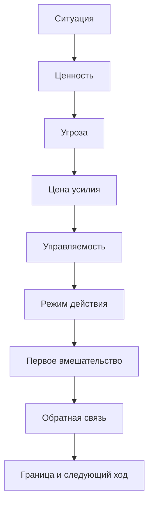

# Глава 33. Практические кейсы

## Практика начинается там, где сигналы смешаны

Перед практическими кейсами уже есть две рабочие формы.

Первая - диагностика конкретной задачи:

```text
ценность
-> угроза
-> цена усилия
-> туман
-> управляемость
-> внешний контур
-> первый срез
-> обратная связь
-> граница вмешательства
```

Вторая - личный когнитивный контур:

```text
карта треков
-> активный WIP
-> вход
-> фокус-блок
-> инструменты и ИИ
-> рабочий журнал
-> контрольная точка
-> разбор системы
-> восстановление
```

На бумаге эти схемы выглядят аккуратно.

В жизни сигналы почти никогда не приходят в чистом виде.

Человек говорит:

```text
не могу войти в задачу
```

Но за этим может быть потерянный контекст, страх ошибки, слабая контрольная точка, слишком широкий WIP, недосып, конфликт приоритетов, низкая управляемость, усталость от прошлых попыток или привычный уход в более легкие задачи.

Команда говорит:

```text
у нас слишком много срочного
```

Но это может означать разные вещи:

- нет формата срочности;
- слишком много активного WIP;
- тяжелые треки живут в головах;
- каждый входящий сигнал выглядит как потенциальный пожар;
- нет видимого aging задач;
- сильные люди стали буфером хаоса;
- восстановление вытеснено рабочей срочностью.

Сотрудник говорит:

```text
мне стало неинтересно
```

И это тоже не объяснение. Это входной сигнал.

Причина может быть в задаче, среде, усталости, потере автономии, слабой обратной связи, низкой управляемости, недогрузе, перегрузе, конфликте ценностей или состоянии, которое уже выходит за рамки рабочей мотивации.

Поэтому практикум нужен не для того, чтобы дать еще семь советов.

Он нужен, чтобы показать, как модель работает на смешанных ситуациях.

## Единая схема разбора

Все кейсы разбираются по одной схеме.

Вопрос схемы: какой параметр смешанной ситуации делает действие недоступным и какой первый ход меняет именно этот параметр?



Схема нужна не для красоты.

Граница схемы: она не заменяет живой разбор случая и не гарантирует один правильный ответ. Ее задача - удержать маршрут от сигнала к проверяемому первому вмешательству.

Она защищает от слишком быстрого вывода.

Например:

```text
не начинаю -> поставь таймер
нет мотивации -> вдохнови
много срочного -> запрети прерывания
ИИ помог -> можно не разбираться
устал -> просто отдохни
```

Иногда эти ходы полезны. Но без диагностики они часто чинят не тот параметр.

Практический вопрос звучит иначе:

```text
что именно делает действие недоступным
и какой первый ход изменит этот параметр?
```

У первого хода есть три требования:

- он должен быть меньше всей задачи;
- он должен менять состояние ситуации, а не только создавать занятость;
- после него должна появиться обратная связь.

Если обратная связь не появилась, вмешательство не обучило систему. Человек мог потратить время, но управляемость не выросла.

## Карта кейсов

| Кейс | Главный сигнал | Возможное место сбоя | Первый ход | Обратная связь | Граница |
| --- | --- | --- | --- | --- | --- |
| Разработчик возвращается к сложной задаче после прерывания | "Не помню, где остановился" | Потеряно состояние цели, слабая контрольная точка, высокая когнитивная цена входа | Восстановить внешнее состояние задачи и выбрать один исследовательский срез | Есть гипотеза, исключенный путь или следующий вопрос | Если нет владельца, данных или доступа, нужен командный уровень |
| Прокрастинация из-за высокой цены входа | "Я все понимаю, но не начинаю" | Угроза, туман, идентичностная цена, краткое облегчение от ухода | Безопасный контакт с задачей и первый проверяемый вопрос | Задача стала конкретнее или выявлена настоящая угроза | Если цена связана с перегрузом или здоровьем, микрошаг не решает причину |
| Лид перегружен несколькими треками | "Весь день занят, но ничего не продвигается" | Слишком широкий WIP, невидимая работа, остаточное внимание | Карта треков, один глубокий срез, следующий контакт для остальных | Видно, что активно, что ждет и что стареет | Если поток требований бесконечен, нужна договоренность о WIP и приоритетах |
| Сотрудник потерял мотивацию | "Раньше включался, теперь гаснет" | Туман задачи, потеря автономии, слабая компетентность, мало обратной связи, перегруз или недогруз | Разговор о конкретной петле действия, а не мотивационная речь | Появился проверяемый фактор: задача, среда, нагрузка, обратная связь или восстановление | Не диагностировать человека; при тяжелом состоянии нужна помощь вне этой модели |
| ИИ используется как обход мышления | "ИИ быстро написал, но я не могу продолжить" | Нет собственного следа до запроса к ИИ, слабая проверка после ответа, потеря авторства, снята полезная трудность | Вернуть собственную постановку, роль ИИ, проверку и след решения | Есть принятое, отвергнутое, требующее проверки и мое решение | В высокорисковых задачах нужен более строгий уровень проверки |
| Команда живет в срочных переключениях | "Любое входящее может сорвать фокус" | Срочность не различима, WIP размытый, внешнее состояние тяжелых треков слабое | Формат срочности и внешнее состояние тяжелых треков | Меньше шума, понятнее владелец, влияние, срок и ожидаемое действие | Если организация требует постоянной реактивности, локальные правила ограничены |
| Восстановление после перегруза | "Отдохнул, но вход не стал дешевле" | Долг восстановления, страх возврата, высокий WIP, слабая безопасность, потеря управляемости | Сначала безопасность и малый управляемый шаг, затем разбор нагрузки | Вход стал дешевле или стала видна системная причина | Тяжелое истощение не чинится учебным протоколом |

Дальше каждый кейс разбирается подробнее.

Кейсы синтетические. Они собраны из типовых паттернов, а не из приватных рабочих историй.

## Кейс 1. Разработчик возвращается к сложной задаче после прерывания

### Ситуация

Разработчик исследовал сложную проблему.

Объект иногда остается в промежуточном состоянии. Нужно понять, где именно ломается переход, и предложить безопасный следующий ход.

В первый день он успел открыть несколько файлов, посмотреть логи, сформулировать две гипотезы. Потом его прервали: срочное ревью, встреча, короткая помощь соседней задаче. Через два дня он возвращается и видит только название задачи.

Внутреннее состояние:

```text
что я вообще понял?
какой файл был главным?
я вроде что-то исключил, но не помню что
надо снова открыть все
сейчас нет сил это поднимать
```

Поверхностный вывод:

```text
я потерял фокус
```

Точный разбор другой.

### Диагностика

| Параметр | Разбор |
| --- | --- |
| Ценность | Найти место расхождения, снизить риск повторной ошибки, оставить команде знание о слабом участке. |
| Угроза | Предложить неверное исправление, потратить время без результата, вскрыть собственное непонимание, снова уйти в туман. |
| Цена усилия | Главная цена когнитивная: нужно восстановить порядок операций, факты, гипотезы, исключенные пути и модель участка кода. Размер файла тут вторичен: маленькая правка может быть дорогой, если требует восстановить причинную схему. Есть идентичностная цена: неприятно возвращаться туда, где уже было непонятно. |
| Управляемость | Управляемо восстановить состояние задачи, открыть один участок кода, сравнить два сценария, записать результат. Не управляемо сразу гарантировать исправление. |
| Режим действия | Система выбирает избегание и подготовительное чтение: открыть много вкладок, перечитать обсуждения, но не сделать проверяемый срез. |

Главный сбой:

```text
потеряно состояние цели + слабая внешняя контрольная точка + высокая цена повторного входа
```

### Первое вмешательство

Не начинать с кода.

Сначала восстановить внешнее состояние задачи за 10-15 минут:

```text
# Возврат к задаче

Цель:
Понять, где объект остается в промежуточном состоянии.

Что уже известно:
- объект создается до внешнего вызова;
- в проблемном сценарии виден timeout;
- два обработчика могут влиять на финальный статус.

Что я, возможно, уже исключил:
- проверить по журналу или коммитам, был ли исключен обработчик B.

Текущая гипотеза:
переход в промежуточное состояние происходит до внешнего вызова,
а timeout-path не закрывает статус.

Первый срез:
за 30 минут сравнить порядок операций в успешном и timeout-сценарии.

Обратная связь:
после блока должно быть ясно,
где меняется состояние относительно внешнего вызова.
```

После этого можно открыть только нужный участок, а не всю задачу сразу.

Если прошлой контрольной точки нет, ее нельзя восстановить магически. Но можно создать новую прямо сейчас и начать снижать эту цену при следующем входе.

### Обратная связь

После первого среза возможны три хороших исхода:

| Исход | Что он дает |
| --- | --- |
| Гипотеза подтвердилась | Появился следующий проверяемый шаг: посмотреть обработку timeout. |
| Гипотеза не подтвердилась | Исключен путь, задача стала уже. |
| Данных не хватает | Сформулирован точный запрос: какой лог, сценарий или владелец нужен. |

Все три исхода лучше, чем "еще раз долго читал код".

### Границы

Если у разработчика нет доступа к нужным данным, нет владельца соседнего компонента или задача зависит от чужого решения, это уже не только личный фокус.

Тогда следующий ход:

```text
зафиксировать внешний блокер,
сформулировать вопрос,
передать состояние трека в командный контур
```

Личный фокус не должен компенсировать отсутствие владельца, данных или решения.

### Что проверяет кейс

Кейс проверяет главы 4-6, 21, 31 и 32.

Трудность возвращения после прерывания часто связана не с характером, а с тем, что состояние задачи не было сохранено как внешний объект. Хорошая контрольная точка не делает задачу простой. Она может делать возвращение дешевле.

## Кейс 2. Прокрастинация из-за высокой цены входа

### Ситуация

Человек должен подготовить важный текст: аналитическую записку, проектное предложение, учебный раздел или технический разбор.

Он понимает, что задача ценная. Срок не прямо сейчас, но уже близко. Несколько дней он открывает файл, перечитывает материалы, добавляет ссылки, меняет заголовки, отвечает на другие сообщения и закрывает файл.

Внутреннее объяснение:

```text
я ленюсь
у меня нет дисциплины
надо просто сесть и написать
```

Но если присмотреться, задача не похожа на простое действие.

Она требует:

- выбрать позицию;
- признать, что часть материала еще не ясна;
- сделать текст видимым для других;
- рискнуть качеством;
- столкнуться с критикой;
- отделить черновик от финального результата.

### Диагностика

| Параметр | Разбор |
| --- | --- |
| Ценность | Текст должен прояснить решение, передать знание, защитить позицию или помочь другим действовать точнее. |
| Угроза | Критика, ошибка, ощущение некомпетентности, слишком ранняя видимость сырой мысли. |
| Цена усилия | Когнитивная цена: нужно собрать тезис, структуру и доказательства. Идентичностная цена: "если выйдет плохо, это скажет что-то обо мне". |
| Управляемость | Управляемо написать черновой тезис, выбрать один вопрос, сделать плохой первый абзац, запросить обратную связь по одному аспекту. Не управляемо сразу написать сильный финальный текст. |
| Режим действия | Уход в подготовку: читать, собирать ссылки, улучшать структуру без контакта с главным тезисом. |

Главный сбой:

```text
высокая цена входа + угроза оценки + туман первого тезиса
```

Прокрастинация дает краткое облегчение:

```text
не написал -> не столкнулся с плохим черновиком -> стало легче сейчас
```

Но будущий вход дорожает:

```text
срок ближе
стыда больше
контекст мутнее
угроза выше
```

### Первое вмешательство

Не начинать с требования:

```text
написать нормальный текст
```

Первый ход лучше строить так, чтобы он снижал идентичностную цену и превращал туман в вопрос.

Пример входа:

```text
Режим: черновик без права быть хорошим.

За 20 минут:
1. написать главный вопрос текста;
2. написать 5 плохих тезисов;
3. выбрать один тезис, который стоит проверить;
4. оставить следующий срез.

Критерий:
после блока должно быть яснее,
какую мысль текст будет доказывать или опровергать.
```

Можно добавить защиту:

```text
этот черновик никому не показывается;
обратная связь будет запрошена позже только по структуре, не по стилю
```

Если угроза социальная, первую обратную связь лучше делать узкой:

```text
проверь, понятен ли главный вопрос
```

а не:

```text
оцени весь текст
```

### Обратная связь

После первого блока должны появиться признаки:

| Обратная связь | Что делать дальше |
| --- | --- |
| Главный тезис появился | Следующий срез - набросать аргументы и контраргументы. |
| Тезис не появился, но появился главный вопрос | Следующий срез - собрать 3 возможных ответа. |
| Стало ясно, что не хватает данных | Следующий срез - найти один источник или один пример. |
| Стало ясно, что страшна оценка | Следующий срез - определить безопасный формат обратной связи. |

Даже если текст не написан, задача уже перестала быть одной темной массой.

### Границы

Если человек не пишет не из-за тумана, а из-за сильного истощения, тревожного состояния, конфликта требований или реального отсутствия времени, двадцатиминутный черновик не решит причину.

Тогда первый ход должен быть другим:

```text
снизить WIP,
пересогласовать срок,
получить поддержку,
разделить задачу,
или признать, что сейчас нужен восстановительный шаг
```

### Что проверяет кейс

Кейс проверяет главы 9, 11, 18, 19 и 31.

Прокрастинация не объясняется одним словом. Иногда человек откладывает потому, что задача одновременно ценная и угрожающая, а первый вход слишком дорогой. Тогда вмешательство должно делать контакт безопаснее и уже, а не просто повышать давление.

## Кейс 3. Лид перегружен несколькими тяжелыми треками

### Ситуация

У лида одновременно идут:

- сложное техническое решение;
- несколько ревью;
- координация с соседними командами;
- помощь людям;
- регулярные встречи;
- срочные входящие;
- подготовка следующего квартала;
- собственная глубокая задача, которая постоянно откладывается.

День выглядит заполненным. Но вечером остается ощущение:

```text
я много реагировал,
но не продвинул главное
и теперь все важное висит в голове
```

Поверхностный вывод:

```text
нужно лучше планировать день
```

Иногда да. Но чаще проблема глубже: слишком много треков находятся в активном состоянии одновременно.

### Диагностика

| Параметр | Разбор |
| --- | --- |
| Ценность | Сохранить качество решений, поддержать людей, не потерять важные риски, двигать стратегический трек. |
| Угроза | Что-то упустить, подвести людей, пропустить риск, выглядеть недоступным, потерять контроль над ситуацией. |
| Цена усилия | Основная цена - переключение между контекстами. Дополнительно: социально-эмоциональная цена отказов и границ. |
| Управляемость | Управляемо вынести треки наружу, выбрать один активный глубокий срез, назначить следующий контакт для ожиданий, явно ограничить оперативный слот. Не управляемо одновременно глубоко держать все. |
| Режим действия | Реактивное сканирование: проверять входящие, закрывать быстрые хвосты, держать тревожный WIP в голове. |

Главный сбой:

```text
слишком широкий WIP внимания + невидимая работа + отсутствие внешней карты треков
```

### Первое вмешательство

Первый ход - не "стать дисциплинированнее", а вынести WIP наружу.

Минимальная карта:

| Трек | Режим | Где состояние | Следующий срез | Следующий контакт | Риск |
| --- | --- | --- | --- | --- | --- |
| Техническое решение | глубокий | Документ/журнал | Сравнить 2 варианта по риску | Сегодня 11:00 | Высокий |
| Ревью | оперативный | Очередь | Закрыть 2 критичных вопроса | После глубокого блока | Средний |
| Соседняя команда | ожидание | Заметка/чат | Дождаться ответа по критерию | Завтра | Средний |
| Поддержка человека | оперативный/развивающий | Заметка встречи | Сформулировать следующий шаг | Сегодня 16:00 | Высокий |
| Стратегический трек | фоновый/глубокий | План | Вернуться к разделу 2 | Среда | Низкий |
| Восстановление | восстановление | Календарь/граница дня | Не оставлять открытый хвост вечером | Сегодня | Высокий |

После карты выбрать один активный глубокий срез:

```text
Сегодня глубокий срез только один:
сравнить два варианта технического решения по риску отката.
```

Остальные треки не исчезают. Они получают контейнер и следующий контакт.

Это может снижать тревожную необходимость держать их активными в голове.

### Обратная связь

Через день или два смотреть не на количество закрытых мелких задач, а на состояние контура:

| Вопрос разбора | Хороший сигнал |
| --- | --- |
| Был ли один глубокий срез? | Да, состояние главного трека изменилось. |
| Стало ли меньше WIP в голове? | У треков есть контейнер и следующий контакт. |
| Перестали ли быстрые входящие съедать первый глубокий блок? | У оперативного слоя появилось свое окно. |
| Появились ли честные границы? | Видно, что требует решения, делегирования или остановки. |

### Границы

Если после карты видно, что активных тяжелых треков объективно больше, чем человек может вести, это не решается личным тайм-менеджментом.

Тогда следующий ход:

```text
пересогласовать приоритеты,
показать WIP,
снять часть ожиданий,
найти владельцев,
перенести или остановить трек,
обсудить недостающие ресурсы
```

Карта треков не должна стать инструментом героизма.

Ее зрелая функция - показать, что именно не помещается в управляемый контур.

### Что проверяет кейс

Кейс проверяет главы 21, 28, 30 и 32.

Лидерская перегрузка часто возникает не от отсутствия планирования, а от попытки одновременно удерживать слишком много активных контекстов. Когнитивное инженерство помогает переводить это из внутренней тревоги во внешний WIP, срезы и границы.

## Кейс 4. Сотрудник потерял мотивацию

### Ситуация

Сотрудник раньше включался в задачи, задавал вопросы, предлагал решения. Теперь он делает только минимум, реже проявляет инициативу, откладывает задачи, хуже реагирует на новые предложения.

Самый быстрый управленческий ярлык:

```text
потерял мотивацию
```

Но это не причина. Это наблюдение.

Если сразу пытаться "мотивировать", легко промахнуться:

- дать больше давления при перегрузе;
- дать вдохновляющую речь при низкой управляемости;
- дать новую сложную задачу человеку, который потерял безопасность;
- дать больше автономии там, где нет компетентности или ясности;
- дать похвалу там, где человеку нужна реальная обратная связь и полномочия.

### Диагностика

| Параметр | Разбор |
| --- | --- |
| Ценность | Что для человека в этой работе раньше было живым: мастерство, польза, влияние, принадлежность, стабильность, развитие? Что из этого исчезло или стало недоступным? |
| Угроза | Чем теперь опасна задача: провалом, критикой, бессилием, перегрузом, потерей статуса, бессмысленностью? |
| Цена усилия | Возможно, задача стала дороже: больше тумана, меньше поддержки, больше переключений, хуже восстановление, выше социальная цена. |
| Управляемость | Есть ли у человека рычаги, ясные критерии, право принимать решения, доступ к помощи и обратной связи? |
| Режим действия | Минимизация контакта: делать только безопасный минимум, не брать инициативу, не предлагать, не вкладываться в рост. |

Главный сбой может быть разным.

Примеры:

| Сигнал | Возможная причина |
| --- | --- |
| Человек молчит на обсуждениях | Низкая безопасность или ощущение, что мнение не влияет. |
| Делает только формально | Потеря авторства результата или слабая связь задачи со смыслом. |
| Не берет новые задачи | Перегруз, страх провала, низкая самоэффективность. |
| Быстро скучает | Недогруз, низкий вызов, мало обратной связи, нет роста. |
| Раздражается на задачи | Долг восстановления, несправедливость, дисбаланс усилия и вознаграждения. |

### Первое вмешательство

Первый ход - не мотивационная речь.

Нужен разговор о конкретной петле действия.

Пример рамки:

```text
Я вижу, что последние задачи идут тяжелее.
Хочу понять не "что с тобой не так",
а где в самой работе сейчас пропала управляемость.

Давай разберем одну конкретную задачу:
что в ней понятно,
что туманно,
где есть рычаг,
где нет обратной связи,
что мешает входу,
что делает ее ценной или неценной.
```

Задача разговора - найти один проверяемый фактор.

Например:

- задача слишком мутная;
- не хватает полномочий;
- обратная связь приходит слишком поздно;
- человек не видит смысла результата;
- задача ниже уровня и не дает роста;
- нагрузка слишком высокая;
- есть внешний конфликт приоритетов;
- восстановление уже сорвано.

Первый ремонт должен быть маленьким и честным:

```text
уточнить критерий успеха,
разделить задачу на управляемый срез,
добавить раннюю обратную связь,
дать право на решение,
снять лишний WIP,
поменять уровень сложности,
вернуть видимость результата
```

### Обратная связь

Через короткий цикл смотреть:

| Обратная связь | Что он означает |
| --- | --- |
| Человек начал задавать вопросы | Вернулась часть управляемости и контакта. |
| Появился срез продвижения | Задача стала доступнее. |
| Сохраняется избегание | Возможно, причина не в тумане, а в угрозе, перегрузе или низкой безопасности. |
| Человек ожил на другом типе задач | Исходная задача могла быть недогрузом, слабым смыслом или неподходящим уровнем вызова. |
| Ничего не меняется после ремонта среды | Нужно смотреть глубже: состояние, роль, конфликт, помощь вне этой модели. |

### Границы

Этот кейс не учит диагностировать человека.

Потеря мотивации может пересекаться с выгоранием, тревогой, депрессивным состоянием, личными обстоятельствами, соматическими причинами, конфликтом роли или несправедливостью среды.

Лидерская работа здесь ограничена:

```text
сделать задачу яснее,
дать управляемость,
наладить обратную связь,
согласовать нагрузку,
поддержать автономию и компетентность,
увидеть границу
```

Если проблема выходит за рабочую петлю действия, нельзя превращать учебную модель в самодельную диагностику.

### Что проверяет кейс

Кейс проверяет главы 8, 10, 23-25, 28 и 29.

Мотивация сотрудника - это не кнопка и не постоянная черта. Это состояние в конкретной среде задач, смысла, автономии, компетентности, принадлежности, обратной связи, нагрузки и восстановления.

## Кейс 5. Человек использует ИИ как обход мышления

### Ситуация

Человек берет сложную задачу и сразу пишет в ИИ:

```text
разберись и предложи решение
```

ИИ дает связный ответ. Ответ выглядит убедительно. Человек копирует структуру, немного правит и идет дальше.

Проблема проявляется позже:

```text
я не могу объяснить, почему выбран этот вариант
я не помню, какие допущения там были
я не знаю, что проверено, а что просто звучало разумно
я не могу продолжить без нового запроса к ИИ
```

Снаружи был выигрыш времени.

Внутри контур мог ослабнуть.

### Диагностика

| Параметр | Разбор |
| --- | --- |
| Ценность | Быстро получить варианты, снизить туман, увидеть слепые зоны, ускорить черновую работу. |
| Угроза | Столкнуться с непониманием, ошибиться самому, долго входить в сложный контекст, признать слабую гипотезу. |
| Цена усилия | Снята полезная трудность первого контакта: постановка задачи, свои гипотезы, критерий проверки. |
| Управляемость | Управляемо задать роль ИИ, сначала оставить собственный след, проверить ответ, записать решение. Не управляемо считать гладкость ответа доказательством. |
| Режим действия | Когнитивная выгрузка превращается в обход: ИИ становится первым автором цели, структуры и решения. |

Главный сбой:

```text
нет собственного следа до запроса к ИИ + нет проверки после ответа ИИ + потеря авторства решения
```

### Первое вмешательство

Вернуть ИИ внутрь человеческого контура.

Перед запросом:

```text
Моя постановка:
...

Что я уже понял:
...

Мои 2 гипотезы:
1.
2.

Критерий хорошего ответа:
...

Что нельзя отдавать ИИ:
финальное решение, оценку риска, проверку фактов.
```

Запрос к ИИ:

```text
Роль:
выступи оппонентом и найди слабые места в моих гипотезах.

Не пиши финальное решение.
Предложи проверки и вопросы, которые я мог пропустить.
```

После ответа:

```text
Что ИИ предложил:

Что я принимаю:

Что отвергаю:

Что требует проверки:

Какое решение остается моим:

Какой следующий срез:
```

Это медленнее, чем "сделай за меня".

Но быстрее, чем через день заново просить ИИ восстановить смысл решения, которое человек не присвоил.

### Обратная связь

Хорошие сигналы:

| Сигнал | Значение |
| --- | --- |
| Человек может объяснить решение без ИИ | Авторство не потеряно. |
| В журнале есть принятые и отвергнутые предложения | Ответ не проглочен целиком. |
| Есть список проверок | Гладкость текста не заменяет валидацию. |
| Следующий вход начинается с собственной контрольной точки | ИИ усилил контур, а не стер его. |

Плохой сигнал:

```text
каждый следующий шаг требует снова спросить ИИ,
потому что собственного состояния задачи нет
```

### Границы

Чем выше цена ошибки, тем жестче должен быть проверочный контур.

Для учебной задачи достаточно объяснить своими словами и проверить ключевые утверждения.

Для инженерного изменения нужны тесты, ревью, фактические проверки, контекст системы.

Для медицинских, юридических, финансовых, security или других высокорисковых решений нельзя полагаться на ИИ как на источник окончательного вывода.

### Что проверяет кейс

Кейс проверяет главы 19, 26, 27 и 32.

ИИ становится когнитивным усилителем, когда помогает человеку увидеть, проверить и оформить мысль. Он становится обходом, когда снимает именно ту трудность, через которую строятся понимание, навык и ответственность за решение.

## Кейс 6. Команда живет в постоянных срочных переключениях

### Ситуация

В команде постоянно что-то срочное:

- вопросы в чатах;
- внезапные просьбы;
- ревью "на минуту";
- уточнения от соседей;
- маленькие пожары;
- задачи, которые давно висят и вдруг становятся критичными.

Люди пытаются фокусироваться, но любое входящее может оказаться важным. Поэтому все регулярно проверяют каналы и держат часть внимания в режиме ожидания.

Поверхностный вывод:

```text
у нас никто не умеет концентрироваться
```

Более точный вопрос:

```text
почему среда может заставлять всех считать любое входящее потенциально срочным?
```

### Диагностика

| Параметр | Разбор |
| --- | --- |
| Ценность | Быстро реагировать на реальные риски, помогать друг другу, не упускать критичные проблемы. |
| Угроза | Пропустить пожар, задержать другого человека, выглядеть неотзывчивым, сломать процесс. |
| Цена усилия | Высокая цена переключений, остаточное внимание, постоянная готовность, слабое восстановление глубокого контекста. |
| Управляемость | Управляемо различать срочность, ввести формат входящего, держать внешнее состояние тяжелых треков, назначить окна реакции. Не управляемо полностью убрать все прерывания. |
| Режим действия | Команда живет в режиме реактивного сканирования: каждый немного сторожит все. |

Главный сбой:

```text
неразличимая срочность + размытый командный WIP + слабое внешнее состояние тяжелых треков
```

### Первое вмешательство

Не запрещать прерывания вообще.

Команде нужен формат срочности.

Минимальный шаблон входящего:

```text
Серьезность:
Влияние:
Срок:
Владелец:
Что нужно от адресата:
Контекст:
Что уже проверено:
Можно ли ответить позже:
```

Для тяжелых треков нужно внешнее состояние:

```text
Трек:
Цель:
Текущий статус:
Следующий срез:
Блокер:
Кто владеет решением:
Когда следующий контакт:
Что считается срочным прерыванием:
```

Это меняет среду.

Теперь входящее не просто шумит. Оно классифицируется.

### Обратная связь

Смотреть через 1-2 недели:

| Обратная связь | Хороший сигнал |
| --- | --- |
| Стало меньше "просто быстро посмотри" | Входящие чаще содержат влияние и ожидаемое действие. |
| Тяжелые задачи реже теряются после прерывания | У них есть внешнее состояние и контрольная точка. |
| Срочное стало заметнее, а шум тише | Реальные риски не маскируются общей тревогой. |
| Старение задач разбирается раньше | Задачи не становятся срочными только потому, что долго висели. |
| Люди меньше держат все в голове | Есть общий контейнер состояния треков. |

### Границы

Если организация реально требует постоянной реактивности от команды, локальный формат срочности поможет только частично.

Тогда нужно поднимать вопрос выше:

```text
какой уровень сервиса ожидается,
кто дежурит,
какой WIP допустим,
какие задачи останавливаются при срочности,
что считается критичным,
какие ресурсы нужны
```

Команда не должна изображать глубокий фокус в среде, которая фактически требует непрерывного дежурства от всех одновременно.

### Что проверяет кейс

Кейс проверяет главы 21, 28, 30 и 31.

Командный фокус - это свойство среды. Если срочность не имеет формы, люди вынуждены сами держать тревожный фильтр. Тогда личная дисциплина становится плохой заменой командному дизайну потока.

## Кейс 7. Человек восстанавливается после перегруза

### Ситуация

Человек несколько недель работал в режиме повышенной нагрузки.

Было много задач, коротких сроков, переключений, ответственности, недосыпа, слабого восстановления. Потом он берет паузу: выходные, отпуск, несколько спокойных дней.

После паузы он ожидает:

```text
теперь должно стать легче
```

Но вход в работу все равно тяжелый.

Тело сопротивляется, задачи неприятны, фокус не держится, любое обязательство кажется угрозой возврата в прежний режим.

Поверхностный вывод:

```text
я даже отдыхать не умею
```

или:

```text
надо быстрее возвращаться в форму
```

Оба вывода могут ухудшить ситуацию.

### Диагностика

| Параметр | Разбор |
| --- | --- |
| Ценность | Вернуть способность действовать без самоизноса, восстановить доверие к работе, снова получать управляемые срезы. |
| Угроза | Любой вход похож на начало прежнего перегруза. Система защищается от повторного расхода. |
| Цена усилия | Высокая восстановительная цена: усталость не полностью ушла, а рабочая среда может ассоциироваться с долгом и давлением. |
| Управляемость | Управляемо начать с малого безопасного контакта, снизить WIP, оставить контрольную точку, пересмотреть нагрузку. Не управляемо мгновенно вернуться к прежней мощности. |
| Режим действия | Защитное торможение, избегание, осторожность, низкая готовность платить цену усилия. |

Главный сбой:

```text
восстановление еще не вернуло безопасность и управляемость входа
```

Отдых мог снизить часть усталости, но не изменить рабочую рамку, WIP, страх возврата или отсутствие границ.

### Первое вмешательство

Не начинать с полного плана продуктивности.

Первый ход:

```text
1. Снизить WIP до минимального.
2. Выбрать один безопасный трек.
3. Сделать малый срез на 15-30 минут.
4. Остановиться до повторного самопродавливания.
5. Записать контрольную точку.
6. Проверить, стал ли следующий вход дешевле.
```

Пример:

```text
Сегодня не "вернуться в рабочий режим".

Сегодня:
- открыть карту треков;
- выбрать один трек с низкой угрозой;
- сделать один срез, который не требует публичной оценки;
- записать результат;
- закрыть рабочий контур без вечернего хвоста.
```

Если главная угроза - возврат в прежний хаос, нужно отдельно зафиксировать границы:

```text
какие задачи сейчас не активны
какие сроки пересогласованы
какой объем работы допустим
что будет считаться перегрузочным сигналом
к кому идти, если WIP снова растет
```

### Обратная связь

Через несколько дней смотреть:

| Обратная связь | Что он означает |
| --- | --- |
| Следующий вход стал чуть дешевле | Восстановление управляемости началось. |
| После малого среза возникает резкий откат | Срез все еще слишком большой или угроза прежнего режима слишком сильна. |
| Тело остается в сопротивлении | Нужны сон, снижение нагрузки, медицинская или психологическая помощь, если состояние тяжелое или длительное. |
| WIP снова разрастается | Проблема не в личном восстановлении, а в среде требований. |
| Появляется интерес к малым задачам | Можно осторожно расширять сложность и обратную связь. |

### Границы

Восстановление после перегруза - зона, где особенно опасны красивые протоколы продуктивности.

Если состояние тяжелое, длительное, сопровождается выраженной тревогой, депрессивными симптомами, соматическими проявлениями, нарушением сна или невозможностью выполнять базовые дела, учебная модель не является достаточной.

Тогда нужны:

- медицинская помощь;
- психотерапевтическая помощь;
- изменение условий работы;
- снижение нагрузки;
- пересборка ожиданий;
- поддержка среды.

Когнитивное инженерство может помочь увидеть границы. Оно не должно маскировать их.

### Что проверяет кейс

Кейс проверяет главы 23-25, 31 и 32.

Восстановление - это не возвращение к прежнему темпу любой ценой. Это возвращение безопасности, управляемости, малых срезов, обратной связи и доверия к следующему входу.

## Как читать эти кейсы

Эти кейсы не нужно запоминать как семь рецептов.

Их нужно читать как семь проверок одной модели.

| Если видишь сигнал | Не спеши думать | Сначала проверь |
| --- | --- | --- |
| Не могу начать | "ленюсь" | Угроза, цена входа, туман, управляемость. |
| Не помню задачу | "плохой фокус" | Состояние цели, контрольная точка, внешний контур. |
| Все срочно | "люди отвлекают" | Формат срочности, WIP, внешнее состояние, старение задач. |
| Нет мотивации | "не хочет" | Задача, автономия, компетентность, обратная связь, нагрузка. |
| ИИ помог | "можно быстрее" | Собственный след, проверка, авторство, сохранение навыка. |
| Отдых не помог | "надо собраться" | Долг восстановления, WIP, безопасность, состояние, границы. |

Когнитивное инженерство не обещает, что после правильной таблицы человек всегда начнет действовать.

Его обещание скромнее и полезнее:

```text
не перепутать сигнал с причиной,
не чинить личным нажимом системную проблему,
не лечить туман таймером,
не лечить перегруз вдохновением,
не лечить потерю авторства новым ИИ-ответом,
не лечить восстановление новым рывком
```

## Главный вывод

Практическая сила модели не в том, что она дает один правильный прием.

Сила в том, что она помогает задать правильный следующий вопрос:

```text
какой параметр сейчас делает действие недоступным?
```

После этого можно искать первый ход:

```text
снизить цену входа
вынести состояние наружу
сузить WIP
сделать безопасный контакт
вернуть обратную связь
задать роль ИИ
оставить контрольную точку
перенести вопрос на командный уровень
восстановить управляемость
признать границу
```

Кейсы показывают еще одну вещь: хорошая модель не только помогает действовать. Она помогает вовремя остановиться и не делать вид, что все проблемы являются задачами личной дисциплины.

Из этого следует отдельная тема: что модель когнитивного инженерства не объясняет, где она ограничена и когда нужно переходить к другим уровням помощи, исследования или решения.

## Источниковая опора

Проверенный источниковый пакет: пакет источников для главы 33 от 2026-05-25.

Ключевые источники в авторско-годовой форме:

- Baddeley (2012), Diamond (2013), Badre (2025), Hutchins (1995), Norman (1991, 1993), Scaife & Rogers (1996), Risko & Gilbert (2016): рабочая память, контроль, внешнее состояние задачи, когнитивные артефакты и когнитивная выгрузка в практических кейсах.
- Altmann & Trafton (2002), Trafton et al. (2003), Trafton & Monk (2008), Parnin & DeLine (2010), Parnin & Rugaber (2011): прерванная работа, подсказки для возвращения и контрольные точки в кейсе разработчика.
- McClelland (1961, 1987/1988), Ryan & Deci (2000, 2017), Baumeister & Leary (1995), Morris et al. (2022), Elliot (2006), McNaughton & Corr (2004), Sirois & Pychyl (2013), Steel (2007): ценность, потребности, угроза, избегание и прокрастинация.
- Skinner (1996), Bandura (1977, 1997), Maier & Seligman (2016), Limbachia et al. (2021), Salamone & Correa (2024), Treadway et al. (2009, 2012), Muller et al. (2021), McEwen (1998), Barrett & Simmons (2015): управляемость, самоэффективность, цена усилия, усталость, аллостаз и восстановление действия.
- Monsell (2003), Leroy (2009), Czerwinski, Horvitz & Wilhite (2004), Mark, Gudith & Klocke (2008), Tregubov et al. (2017), Ma, Huang & Leach (2024), Demerouti et al. (2001), Bakker & Demerouti (2007, 2017): WIP, прерывания, невидимая работа, перегруз и командные кейсы.
- Parasuraman & Manzey (2010), Lee & See (2004), Hoff & Bashir (2015), Goddard et al. (2012), Bainbridge (1983), Roediger & Butler (2011), Soderstrom & Bjork (2015): ИИ как обход мышления, доверие к автоматизации и сохранение навыка.
- World Health Organization (2019/2022), Maslach et al. (2001), Maslach & Leiter (2016), Sonnentag et al. (2017, 2022): восстановление, граница выгорания и случаи, где личного вмешательства недостаточно.

Роль источникового блока: `strong` для механизмов и границ, уже встроенных в предыдущие главы; `context-dependent` для всех практических кейсов, потому что каждый кейс является синтетическим учебным сценарием, а не прямым эмпирическим доказательством; `clinical-boundary` для выгорания, тяжелого истощения, депрессивно похожей потери действия и других состояний, где нужна профессиональная или организационная помощь. Кейсы синтетические и санитаризированные: они не переносят реальные имена, внутренние системы, детали индивидуальных встреч, оценочных материалов, операционные заметки или узнаваемые рабочие эпизоды.

Полные библиографические записи и DOI сохранены в источниковых пакетах предыдущих глав и в пакете текущей главы. Текущая редакция оставляет короткий авторско-годовой блок как читательский ориентир.

## Короткое резюме

- Практический кейс нужен не для красивой истории, а для проверки модели на смешанных сигналах.
- Один и тот же сигнал может иметь разные причины: туман, угроза, усталость, низкая управляемость, WIP, слабая обратная связь или системная граница.
- Первый ход должен менять конкретный параметр ситуации и давать обратную связь.
- Если вмешательство не дает обратной связи, оно не обучает систему.
- Хорошая модель помогает не только действовать, но и вовремя остановиться, когда проблема находится не на личном уровне.

## Вопросы для самопроверки

1. Почему кейс нельзя читать как рецепт?
2. Что значит "найти параметр, делающий действие недоступным"?
3. Чем первый ход отличается от общего намерения?
4. Почему обратная связь обязательна в практическом кейсе?
5. Как понять, что ситуация требует командного, организационного или профессионального уровня помощи?

## Мини-практика

Возьмите одну ситуацию из своей работы и разберите ее по той же схеме:

```text
сигнал:
не спешить думать:
ценность:
угроза:
цена усилия:
управляемость:
внешнее состояние:
первый ход:
обратная связь:
граница:
что делать, если первый ход не сработал:
```

Затем проверьте: ваш первый ход действительно меняет параметр ситуации или просто звучит как правильный совет?

## Статус

`ready-for-review`

Ревизия блока: служебная проверка "Ревизия блока 31-36" от 2026-05-25.
