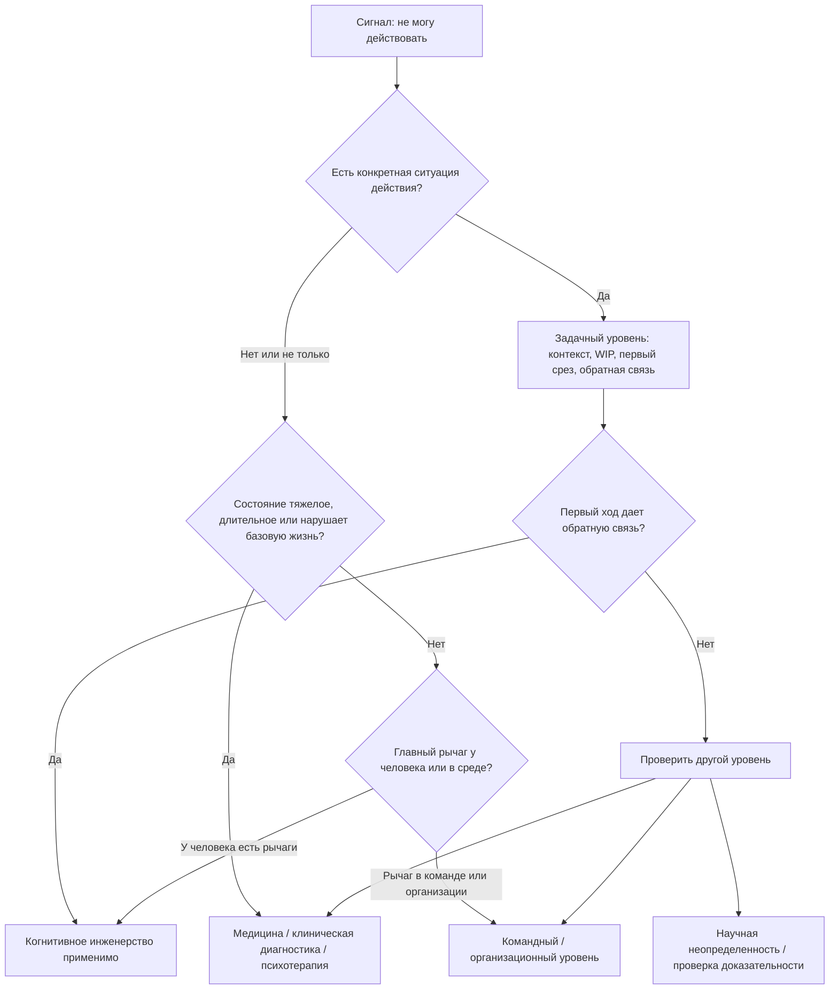

# Глава 34. Чего эта модель не объясняет

Практические кейсы могут создать опасное впечатление: если модель достаточно хороша, любую ситуацию можно разобрать по одной схеме и найти первый ход.

Иногда это правда.

Человек потерял контекст задачи - ему нужно внешнее состояние. Задача не начинается из-за тумана - ей нужен первый проверяемый срез. Команда живет в постоянных срочных переключениях - ей нужен формат срочности, WIP и общий контейнер состояния. ИИ стал обходом мышления - нужно вернуть собственный след до запроса к ИИ, проверку и авторство решения.

Но есть граница.

Когнитивное инженерство не является медициной, психотерапией, клинической диагностикой, организационной политикой или универсальной теорией человеческой жизни. Оно помогает проектировать условия действия, мышления, восстановления и обратной связи. Оно может показать, где действие стало недоступным. Оно может подсказать первый честный ход. Но оно не должно изображать, что все человеческие состояния являются задачами личной настройки.

Раздел о границах нужен не для того, чтобы ослабить учебник. Наоборот: без границ модель быстро превращается в новый язык самонажима.

## Что модель действительно умеет

Сначала нужно зафиксировать сильную область модели.

Когнитивное инженерство полезно там, где есть ситуация действия:

- человек должен войти в задачу;
- нужно удержать контекст;
- нужно снизить цену первого шага;
- нужно не потерять состояние задачи после прерывания;
- нужно понять, что делает действие угрожающим;
- нужно отличить ценность от желания;
- нужно ограничить WIP;
- нужно вернуть обратную связь;
- нужно встроить ИИ в человеческий контур;
- нужно спроектировать командную среду, где людям легче действовать ясно.

В таких ситуациях модель задает полезные вопросы:

```text
что здесь ценно?
что здесь угрожает?
какая цена усилия?
что туманно?
что управляемо?
что нужно вынести наружу?
какой первый срез даст обратную связь?
где граница личного уровня?
```

Это рабочие вопросы. Они не диагностируют человека. Они диагностируют доступность действия в конкретной ситуации.

Разница принципиальная.

Когда человек говорит:

```text
я не могу начать
```

модель может спросить:

```text
какую именно задачу?
что в ней непонятно?
чего ты опасаешься?
какой минимальный безопасный контакт возможен?
что покажет продвижение?
```

Но она не имеет права автоматически решить:

```text
значит, у тебя прокрастинация,
значит, нужно сделать ритуал,
значит, дело в дофамине,
значит, нужно просто снизить WIP
```

Один сигнал может жить на разных уровнях.

## Карта границ

Главная схема границ проста: сначала определить уровень вопроса, потом выбирать инструмент.

Вопрос схемы: остается ли вопрос на уровне задачи и среды действия или уже требует медицинского, психотерапевтического, организационного либо научного разбора?



Эта схема не должна становиться жестким алгоритмом. Ее задача - замедлить слишком быстрый вывод.

Граница схемы: это защитная карта от самонажима, а не способ самостоятельно поставить диагноз или доказать, что помощь извне не нужна.

Если есть конкретная задача, понятный контекст и хоть какой-то рычаг действия, модель может работать. Если первый ход дает обратную связь, можно продолжать. Если обратная связь не появляется, состояние не меняется, задача не конкретизируется, а цена только растет, нужно проверить: возможно, вопрос находится не на уровне личной практики.

## Медицинская граница

Медицинская граница возникает не только тогда, когда "совсем плохо".

Она появляется всякий раз, когда состояние может быть связано со здоровьем, телом, лекарствами, сном, веществами, риском или клиническим состоянием.

Сигналы, при которых модель не должна оставаться единственным инструментом:

| Сигнал | Почему это граница |
| --- | --- |
| Состояние длится долго и не улучшается от разумного снижения нагрузки | Возможно, вопрос не в входе в задачу, а в здоровье, психическом состоянии или среде. |
| Нарушены сон, аппетит, базовая энергия, концентрация, память, телесное самочувствие | Это уже не только когнитивная организация работы. |
| Человек не справляется с базовыми делами | Нужна оценка нарушения повседневного функционирования, а не новый протокол продуктивности. |
| Есть панические состояния, сильная тревога, выраженная подавленность, резкая потеря интереса | Это может требовать профессиональной оценки и помощи. |
| Есть мысли о самоповреждении, вреде себе или другим | Нужна немедленная помощь через местные экстренные службы или кризисный канал. |
| Есть психотические переживания, потеря контакта с реальностью, резкие изменения поведения | Это медицинская и клиническая зона. |
| Есть вопросы лекарств, отмены лекарств, БАДов, веществ, гормонов | Это не решается учебником и рабочим журналом. |
| Есть желание "починить состояние" кофеином, практиками осознанности, БАДами или метриками | Это может быть полезным сигналом для разбора, но не заменяет оценку сна, нагрузки, здоровья и контекста. |

Когнитивное инженерство может помочь подготовиться к обращению за помощью:

- записать, когда началось состояние;
- описать, что изменилось;
- отделить рабочую нагрузку от сна, тела и эмоций;
- зафиксировать, что уже пробовали;
- показать, где состояние нарушает жизнь.

Но это подготовка материала, а не постановка диагноза.

## Психотерапевтическая граница

Психотерапия нужна не только тогда, когда человек "не справился". Часто она нужна там, где разумная организация задачи упирается в устойчивый паттерн переживания, отношений или поведения.

Например:

- человек понимает задачу, но каждый раз переживает оценку как угрозу;
- любая ошибка запускает стыд и самонаказание;
- конфликт воспринимается как опасность отвержения;
- отдых вызывает вину;
- просьба о помощи воспринимается как доказательство слабости;
- успех не присваивается, а сразу обесценивается;
- рабочая ситуация снова и снова воспроизводит старый сценарий беспомощности;
- человек видит паттерн, но не может изменить его одним планированием.

В таких случаях внешний контур все еще может помогать. Рабочий журнал может дать материал: что произошло, что человек почувствовал, как отреагировал, какой вывод сделал, где повторился сценарий.

Но журнал не заменяет терапевтический процесс.

Психотерапия работает не только с задачей. Она работает с тем, как человек воспринимает угрозу, себя, других людей, право на ошибку, близость, границы, контроль, стыд, страх, злость, утрату и повторяющиеся способы защиты.

Когнитивное инженерство может поддержать терапию структурой наблюдения. Но если оно начинает говорить:

```text
просто сделай маленький шаг
```

там, где человек снова и снова сталкивается с травматическим, тревожным или отношенческим паттерном, оно становится грубым инструментом.

## Клиническая диагностика - не диагностика задачи

В учебнике уже есть диагностика задачи. Она спрашивает:

```text
что делает конкретное действие недоступным?
```

Клиническая диагностика спрашивает другое:

```text
каково состояние человека,
соответствует ли оно диагностическим критериям,
как долго оно длится,
насколько нарушает жизнь,
что еще может его объяснять,
какие риски есть,
какие состояния могут сочетаться друг с другом?
```

Это разные виды диагностики.

Диагностика задачи может сказать:

```text
в этой задаче высокая угроза ошибки,
низкая управляемость и слабая обратная связь
```

Она не может сказать:

```text
у человека депрессия
у человека тревожное расстройство
у человека ADHD
у человека клиническое выгорание
```

Даже если бытовые признаки похожи.

Похожесть сигналов - одна из причин, почему граница важна. Потеря мотивации может быть скукой, перегрузом, низкой автономией, отсутствием обратной связи, конфликтом роли, недосыпом, депрессивным состоянием, побочным эффектом лекарства, соматической проблемой или нормальной реакцией на тяжелую жизненную ситуацию.

Один язык не должен захватывать все объяснение.

То же относится к биомаркерам. В исследованиях и клинической практике словарь биомаркеров полезен: можно различать маркер риска, диагностический маркер, мониторинговый маркер, прогностический маркер, предиктивный маркер и клиническую конечную точку. Но это не означает, что одиночный показатель сам по себе объясняет состояние человека или заменяет клиническую оценку. В психиатрии кандидатные биомаркеры могут помогать исследованию механизмов, стратификации, прогноза и будущих решений, но в учебнике они служат границей против бытовой самодиагностики, а не новым способом назвать свою проблему.

## Нейромедиаторы не являются бытовой диагностикой

Нейромедиаторы и гормоны уже введены как регуляторы режимов контуров. Это важный слой. Но именно поэтому с ним легко ошибиться.

Популярные формулы звучат просто:

```text
нет мотивации - мало дофамина
тревожно - высокий кортизол
грустно - мало серотонина
не хватает близости - нужен окситоцин
```

Эти формулы соблазнительны, потому что дают ощущение точности. Но точность здесь ложная.

Нейромедиаторы и гормоны:

- работают в контурах, а не в одиночку;
- зависят от зоны мозга, рецепторов, времени, контекста и истории обучения;
- могут иметь разные эффекты в разных системах;
- измеряются непрямо и с ограничениями;
- не дают простого ответа "что со мной";
- не превращаются автоматически в план "что делать".

Можно говорить:

```text
дофаминовые системы участвуют в обучении, значимости, усилии, выборе действия и ошибке предсказания
```

Нельзя превращать это в:

```text
сегодня у меня низкий дофамин, поэтому мне нужен такой-то прием
```

Можно говорить:

```text
стрессовые медиаторы влияют на префронтальный контроль, внимание и телесную цену действия
```

Нельзя делать вывод:

```text
если я устал и тревожен, значит причина в кортизоле
```

Можно осторожно обсуждать серотониновые модели настроения, аверсии, торможения и эмоционального контроля. Нельзя использовать "серотонин" как бытовой ярлык для сложного депрессивного состояния.

Нейрохимический язык полезен, когда он помогает понять режим системы. Он вреден, когда заменяет наблюдение за поведением, контекстом, средой, историей, телом и клиническими признаками.

То же относится к интероцепции и телесным сигналам. Здесь они помогают объяснить, почему задача может ощущаться дорогой до явного решения: тело, прогноз нагрузки, прошлый стресс и восстановительный долг входят в оценку действия. Но из этого нельзя делать вывод, что любое телесное ощущение сразу показывает причину проблемы. Напряжение, усталость, тяжесть, учащенное сердцебиение или "не могу собраться" могут относиться к нагрузке, тревоге, сну, соматике, лекарствам, среде, горю, конфликту, клиническому состоянию или обычной неопределенности задачи.

## Организационная граница

Часть проблем не живет внутри человека.

Если команда постоянно живет в режиме срочности, личный WIP-лимит поможет только частично. Если у человека нет полномочий, обратной связи и безопасного права сообщить о риске, нельзя называть его состояние "низкой мотивацией". Если требования хронически выше ресурсов, нельзя лечить это утренним ритуалом.

Организационные границы часто выглядят как личные проблемы:

| Как выглядит | Что может быть на самом деле |
| --- | --- |
| Человек "не фокусируется" | Среда требует непрерывной реактивности. |
| Сотрудник "потерял мотивацию" | Низкая автономия, слабая обратная связь, бессмысленный дизайн задачи, отсутствие роста. |
| Лид "не умеет отдыхать" | Роль устроена как постоянный прием незавершенного WIP. |
| Команда "не держит сроки" | Старение задач невидимо, WIP раздут, приоритеты конфликтуют. |
| Люди "избегают ответственности" | За раннее сообщение о проблемах их наказывают. |
| Все "устали" | Требования выше ресурсов, восстановление не встроено в систему. |

Личный контур может сделать такую проблему видимой:

```text
вот WIP
вот срочности
вот повторяющиеся прерывания
вот где нет владельца
вот где нет полномочий
вот где обратная связь не возвращается
вот где восстановление невозможно
```

Но после этого вопрос должен перейти на уровень команды, роли, менеджмента, ресурсов, ожиданий, HR-процесса или организационного решения.

Когнитивное инженерство не должно превращать человека в амортизатор плохой системы.

## Социальные и личные состояния не сводятся к практикам продуктивности

Есть состояния, которые нельзя честно описать как "сбой продуктивности".

Горе, одиночество, конфликт в семье, кризис смысла, болезнь близкого, тяжелая жизненная перемена, травматический опыт, дискриминация, небезопасность, бедность времени и ресурсов, страх потерять работу, конфликт ценностей - все это влияет на внимание, мотивацию, тело и способность действовать.

Модель может помочь не усугубить ситуацию:

- снизить лишний WIP;
- сохранить внешнее состояние;
- не требовать прежней производительности;
- оставить минимальные опоры;
- увидеть, где нужна поддержка;
- отличить задачу от жизненного состояния.

Но она не должна говорить:

```text
разбей это на маленькие шаги
```

как будто человеческая боль всегда является плохо сформулированной задачей.

Иногда правильный ход не в том, чтобы оптимизировать действие, а в том, чтобы признать тяжесть ситуации, снизить требования, попросить помощи, выйти из небезопасной среды, лечиться, горевать, восстанавливаться или дать жизни время.

## Научная граница

Есть еще одна граница: доказательность.

Учебник использует нейронауку, психологию, организационные исследования, исследования разработки ПО и работы по ИИ. Но не все источники дают одинаковую силу вывода.

Нужно различать:

| Тип утверждения | Как его читать |
| --- | --- |
| Хорошо установленная рабочая рамка | Можно использовать как основу, но без чрезмерных обещаний. |
| Полезная модель | Помогает думать, но не является полным описанием реальности. |
| Одно исследование | Дает сигнал, не закрывает вопрос. |
| Мета-анализ | Сильнее одиночной работы, но зависит от качества включенных исследований. |
| Доклиническая модель | Может дать механизм, но перенос на человека требует осторожности. |
| fMRI-находка | Не является прямым чтением мысли или диагноза. |
| Гормональный или физиологический маркер | Контекстен и редко говорит сам по себе. |
| Быстро меняющаяся эмпирика ИИ | Требует даты проверки и осторожных выводов. |
| Заявление поставщика | Не является научной опорой без независимой проверки. |

Полная методология чтения исследований требует отдельного разбора.

Здесь важно одно: если модель опирается на слабое или контекстное доказательство, практический вывод должен быть слабее. Нельзя брать яркую нейроисторию и строить на ней строгий совет.

## Практический протокол остановки

Когда ситуация кажется подходящей для когнитивного инженерства, полезно пройти короткий протокол.

### 1. Назвать сигнал

Не диагноз, а сигнал:

```text
не могу начать
быстро бросаю
нет мотивации
после отдыха не легче
все срочно
ИИ помогает, но я не понимаю результат
```

### 2. Найти конкретную ситуацию действия

Спросить:

```text
о какой задаче речь?
что должно произойти?
какой первый наблюдаемый срез возможен?
```

Если конкретной ситуации действия нет, а есть общее тяжелое состояние, уже нужна осторожность.

### 3. Проверить длительность, тяжесть и нарушение жизни

Спросить:

```text
как долго это длится?
становится ли хуже?
нарушены ли сон, тело, базовые дела, работа, отношения?
есть ли риск для безопасности?
есть ли резкое изменение состояния?
```

Если ответ тревожный, не усиливать личный протокол. Менять уровень.

### 4. Найти уровень рычага

| Уровень | Вопрос |
| --- | --- |
| Задача | Что туманно, угрожающе или дорого во входе? |
| Личный контур | Какой WIP, контрольная точка, ритуал, восстановление или ИИ-роль сломаны? |
| Команда | Как правила потока, срочности, обратная связь и владельцы влияют на ситуацию? |
| Организация | Какие требования, ресурсы, полномочия, безопасность и ожидания заданы средой? |
| Медицина | Нужна ли оценка здоровья, сна, риска, медикаментов или клинического состояния? |
| Психотерапия | Есть ли устойчивый эмоциональный, поведенческий или отношенческий паттерн? |
| Наука | Достаточно ли доказательств для практического вывода? |

### 5. Делать первый ход только там, где есть рычаг

Если рычаг на уровне задачи, можно сделать первый срез.

Если рычаг на уровне команды, нужен разговор, правило, владелец, WIP-решение или формат срочности.

Если рычаг на уровне организации, личная дисциплина может только временно компенсировать проблему.

Если рычаг на медицинском или терапевтическом уровне, самостоятельная модель должна стать вспомогательной записью наблюдений, а не заменой помощи.

### 6. Не превращать отсутствие результата в личную вину

Если человек применил разумный ход, но ситуация не меняется, это не всегда значит:

```text
я плохо старался
```

Возможно, выбран не тот уровень.

## Пример: после отдыха не стало легче

Допустим, человек после перегруза берет несколько спокойных дней. Он ожидает, что вернется в рабочий режим, но вход остается тяжелым. Задачи вызывают сопротивление. Тело напряжено. В голове появляется мысль:

```text
я даже восстановиться не могу
```

Когнитивное инженерство может сделать первый разбор:

| Вопрос | Возможный ответ |
| --- | --- |
| Есть ли конкретный активный трек? | Нет, все задачи шумят сразу. |
| Есть ли безопасный вход? | Нет, любой вход похож на возвращение в прежний перегруз. |
| Какой WIP можно заморозить? | Несколько треков можно перевести в ожидание. |
| Какой первый срез возможен? | 20 минут карты состояния без обязательства закрыть задачу. |
| Какая обратная связь нужна? | Стало ли понятнее, что активно, что отложено и где следующий контакт. |

Если после этого вход становится немного дешевле, модель работает.

Но возможен другой результат:

- состояние длится неделями;
- сон не восстанавливается;
- концентрация резко хуже обычного;
- тело постоянно в напряжении;
- базовые дела стали трудными;
- появляется отчаяние;
- любые рабочие мысли вызывают панику или оцепенение;
- человек не видит возможности жить в прежнем режиме.

Тогда это уже не только вопрос входа.

Правильный вывод:

```text
модель помогла увидеть границу;
теперь нужен другой уровень помощи и изменения условий
```

Это не провал модели. Это ее зрелое применение.

## Что модель может делать у границы

Даже когда когнитивное инженерство не является главным инструментом, оно может быть полезным вспомогательным слоем.

Оно может:

- помочь описать состояние без самообвинения;
- отделить рабочие факты от интерпретаций;
- показать врачу или терапевту динамику сна, нагрузки, настроения и функционирования;
- подготовить разговор с руководителем о WIP и ресурсах;
- зафиксировать, какие вмешательства уже пробовали;
- снизить хаос вокруг человека;
- защитить от дополнительных ненужных задач;
- оставить маленький безопасный контур жизни, пока идет помощь.

Но тон должен измениться.

Не:

```text
сейчас починим продуктивность
```

а:

```text
сейчас уменьшим хаос,
сохраним наблюдения
и поможем подключить правильный уровень поддержки
```

## Главный вывод

Когнитивное инженерство не объясняет всего человека.

Оно объясняет и проектирует часть человеческой работы:

```text
как входить в задачу,
как удерживать контекст,
как снижать цену действия,
как возвращать обратную связь,
как не отдавать мышление инструментам,
как строить среду,
где действие становится доступнее
```

Но человеческое состояние шире задачи.

Есть медицина. Есть психотерапия. Есть клиническая диагностика. Есть организационные условия. Есть социальные обстоятельства. Есть методологическая неопределенность. Есть горе, болезнь, конфликт, безопасность, смысл и жизнь, которая не обязана помещаться в схему продуктивности.

Зрелая модель не спорит с этим.

Она помогает задать честный вопрос:

```text
на каком уровне находится основной рычаг?
```

И если рычаг не на уровне личного действия, она не заставляет человека героически давить сильнее. Она показывает границу и помогает перейти к тому уровню, где помощь действительно возможна.

Та же дисциплина нужна и для источников, на которых стоит модель. Нельзя строить новый нейромиф на красивой фМРТ-картинке, одном медиаторе, животной модели, одиночном эксперименте или громком исследовании ИИ.

## Источниковая опора

Проверенный источниковый пакет: пакет источников для главы 34 от 2026-05-25.

Ключевые источники в авторско-годовой форме:

- World Health Organization (2019/2022), World Health Organization (2022): выгорание как профессиональный феномен, а психическое здоровье на работе - как зона организационных и психосоциальных рисков.
- American Psychiatric Association (DSM-5-TR), National Institute of Mental Health (depression; psychotherapies): клинические и психотерапевтические границы, которые учебник не должен заменять.
- APA Presidential Task Force on Evidence-Based Practice (2006): доказательная практика как сочетание данных, профессиональной экспертизы и контекста человека, а не одна техника, оторванная от оценки ситуации.
- Husain & Roiser (2018), Costello, Husain & Roiser (2024): апатия, ангедония и снижение целенаправленного поведения как клинические границы темы мотивации.
- Moncrieff et al. (2023): зонтичный обзор серотониновой теории как предупреждение против простых объяснений через "химический дисбаланс", а не как руководство по лечению.
- Kendler (2012), Poldrack (2006), Krakauer et al. (2017), Badre (2025): уровни объяснения, обратный вывод, граница между поведением и нейронаукой, ограничения языка когнитивного контроля.
- Abi-Dargham et al. (2023), FDA-NIH Biomarker Working Group (2016/updated): психиатрические биомаркеры и словарь биомаркеров как клинико-методологическая граница; тип маркера, конечная точка, диагноз и решение о лечении не взаимозаменяемы.
- Barrett & Simmons (2015), Barrett (2017), Seth (2013), Seth & Friston (2016), Zhang et al. (2025): интероцепция и аллостаз как пограничный случай; телесные и сетевые данные не являются самодиагностикой.
- Goyal et al. (2014), Van Dam et al. (2018), Lao, Kissane & Meadows (2016), McLellan, Caldwell & Lieberman (2016), Brainard et al. (2020): практики осознанности, кофеин и omega-3/добавки как пограничные случаи; вмешательства требуют уровня доказательности, контекста и границы здоровья.
- Parasuraman & Manzey (2010), Lee & See (2004), Hoff & Bashir (2015), Goddard et al. (2012), Dell'Acqua et al. (2026), METR (2026a, 2026b, 2026c): ИИ и автоматизация как еще одна область, где модель не должна обещать больше, чем позволяют данные.
- Главы 12, 14, 23-27 и 31-33 используются как внутренняя опора для уровней объяснения, медиаторов, поломки мотивации, выгорания и профессиональной скуки, ИИ, диагностики задачи и практических границ.

Роль источникового блока: `clinical-boundary` для DSM/NIMH/WHO/APA и источников по апатии/ангедонии; `strong` для уровней объяснения, обратного вывода и предупреждения о том, что нейронауке нужен поведенческий уровень; `mixed` для спорных популярных интерпретаций моноаминовых/серотониновых моделей и широких утверждений о добавках или когнитивном усилении; `fast-moving` для границ доказательности в теме ИИ; `context-dependent` для выбора внешнего уровня помощи, вмешательства или организационного действия. Раздел не дает диагностику, рекомендации по лечению, дозировкам или HR-предписания: он отмечает уровень, на котором когнитивное инженерство должно остановиться.

Полные библиографические записи и DOI сохранены в пакете главы. Текущая редакция оставляет короткий авторско-годовой блок как читательский ориентир.

## Короткое резюме

- Когнитивное инженерство объясняет и проектирует доступность действия, но не объясняет всего человека.
- Сигнал "не могу действовать" может быть задачей входа, но может быть медицинским, психотерапевтическим, клиническим, организационным или социальным вопросом.
- Нейромедиаторы, гормоны, HRV, фМРТ и другие маркеры не являются бытовой диагностикой.
- Личная система не должна подменять изменение условий там, где главный рычаг находится в среде.
- Зрелая модель умеет не только предлагать действие, но и показывать границу своего применения.

## Вопросы для самопроверки

1. Что когнитивное инженерство действительно умеет объяснять?
2. Когда диагностика задачи должна остановиться?
3. Почему "нет мотивации" не является достаточным диагнозом?
4. Чем медицинская и психотерапевтическая границы отличаются от личного когнитивного процесса?
5. Почему признание границы модели не является ее провалом?

## Мини-практика

Возьмите одну трудную ситуацию и заполните карту уровня:

```text
сигнал:
что можно разобрать как задачу:
что похоже на состояние тела или здоровья:
что похоже на устойчивый эмоциональный или отношенческий паттерн:
что задано организационной средой:
что требует проверки доказательности:
какой личный шаг допустим:
какой внешний уровень помощи или решения нужен:
чего нельзя чинить личным нажимом:
```

Главный результат практики - не найти прием, а честно определить уровень основного рычага.

## Статус

`ready-for-review`

Ревизия блока: служебная проверка "Ревизия блока 31-36" от 2026-05-25.
