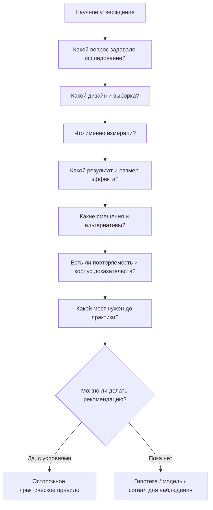

# Глава 35. Как читать исследования и не построить нейромиф

Границы модели когнитивного инженерства уже зафиксированы. Модель полезна, когда помогает выбрать уровень вопроса: задача, человек, команда, организация, медицина, психотерапия, научная неопределенность. Она становится опасной, когда начинает чинить личной практикой то, что находится на другом уровне.

Но есть еще одна граница.

Можно признать, что модель не всемогуща, и сказать:

```text
тогда будем опираться на исследования
```

Это правильное движение. Учебник не должен держаться на личных ощущениях, красивых метафорах и убедительных схемах. Но исследование тоже не превращается в практическое правило автоматически.

Научная статья может быть хорошей, но узкой. Обзор может быть полезным, но зависеть от качества включенных работ. Мета-анализ может выглядеть как сильное доказательство, но объединять неоднородные исследования. ФМРТ-картинка может быть настоящей, но не означать того психологического процесса, который в нее вложил популярный пересказ. Работа на животных может показывать важный механизм, но еще не говорить, что человеку нужно делать в понедельник утром. Свежий бенчмарк ИИ может быть честным и при этом устареть быстрее, чем его успеют переписать в корпоративную практику.

Разговор здесь не про недоверие к науке.

Она про дисциплину перевода:

```text
исследование -> утверждение -> ограничения -> мост -> практика
```

Когнитивное инженерство должно быть достаточно научным, чтобы не стать магией, и достаточно инженерным, чтобы не остаться списком цитат.

## Исследование отвечает на свой вопрос, а не на ваш целиком

Первое, что нужно спрашивать при чтении исследования:

```text
какой вопрос оно задавало?
```

Не:

```text
как мне теперь жить?
```

А:

```text
что именно авторы пытались узнать?
```

Например, исследование может спрашивать:

- как недосып влияет на устойчивое внимание в лабораторной задаче;
- связан ли высокий WIP с большим числом переключений у работников интеллектуального труда;
- меняется ли активность определенной сети мозга при задаче выбора усилия;
- ускоряет ли конкретная версия ИИ-инструмента выполнение конкретного набора задач;
- снижает ли конкретная техника прокрастинацию в выборке студентов;
- связан ли HRV с показателями исполнительных функций;
- изменяется ли уровень кортизола в заданной стрессовой процедуре.

Это разные вопросы. Они не дают один и тот же вид знания.

Исследование про лабораторную задачу не отвечает напрямую на вопрос о вашей рабочей неделе. Исследование на студентах не всегда переносится на разработчиков, лидов, родителей, людей в хроническом перегрузе или клиническую выборку. Исследование про среднее изменение в группе не говорит, что конкретный человек получит тот же эффект. Исследование про механизм не всегда дает доступный рычаг вмешательства.

Практический вывод:

```text
сначала восстанови вопрос исследования;
только потом решай, какой вывод оно может поддерживать
```

## Карта перехода от источника к практике

Перед тем как превращать источник в практическое правило, нужно пройти несколько ступеней.

Вопрос схемы: какой мост нужен, чтобы из конкретного источника сделать честный практический вывод, не потеряв вопрос исследования, дизайн, выборку, измерение, ограничения и силу доказательств?



Эта схема не нужна для того, чтобы парализовать действие. Она нужна, чтобы не перепрыгивать.

Граница схемы: не каждое бытовое решение требует академического обзора; глубина проверки должна соответствовать риску, новизне утверждения и цене ошибки.

Плохой переход выглядит так:

```text
в исследовании нашли X
-> X звучит нейронаучно
-> значит, X объясняет мою проблему
-> значит, мне нужен прием против X
```

Хороший переход медленнее:

```text
в исследовании нашли X
-> X относится к такому-то уровню
-> X измеряли таким-то способом
-> в такой-то выборке
-> с такими-то ограничениями
-> практический вывод возможен только при таких условиях
```

В учебнике это особенно важно. Мы постоянно связываем психологию, нейронауку, биохимию, продуктивность, лидерство и ИИ. Чем богаче связка, тем легче сделать красивый, но неверный скачок.

## Корреляция не является причиной

Самая частая ошибка чтения:

```text
X связано с Y
```

превращается в:

```text
X вызывает Y
```

Например:

```text
люди с плохим сном чаще прокрастинируют
```

Из этого нельзя сразу сделать вывод:

```text
плохой сон вызывает прокрастинацию,
значит, достаточно наладить сон
```

Возможны разные объяснения:

| Возможность | Что это значит |
| --- | --- |
| Сон влияет на контроль | Недосып ухудшает внимание, рабочую память, торможение и готовность входить в трудные задачи. |
| Прокрастинация влияет на сон | Человек откладывает, тревожится, работает поздно, сбивает режим. |
| Третья переменная влияет на оба | Хронический стресс, рабочая среда, тревога или перегруз одновременно ухудшают сон и действие. |
| Связь зависит от группы | У студентов, сменных работников, родителей маленьких детей и инженеров на дежурствах причины могут отличаться. |
| Измерение грубое | Сон мог измеряться самоотчетом, а не объективным трекингом; прокрастинация - шкалой, а не поведением. |

Корреляция не бесполезна. Она может показать, куда смотреть. Она может поддержать гипотезу. Она может быть частью корпуса доказательств. Но сама по себе она еще не доказывает причинный механизм и не дает план вмешательства.

Практический вопрос:

```text
это исследование показывает связь,
причинное влияние
или только совместное изменение?
```

Если показывает связь, то в тексте нужно писать "связано с", "наблюдается вместе с", "ассоциировано с".

Не нужно писать:

```text
вызывает
лечит
чинит
доказывает
```

если дизайн этого не поддерживает.

## Причинность требует более сильного моста

Причинный вывод становится сильнее, когда есть:

- экспериментальное вмешательство;
- случайное распределение;
- контроль альтернативных объяснений;
- временной порядок: причина раньше следствия;
- повторяемость результата;
- правдоподобный механизм;
- зависимость от дозы или интенсивности;
- совпадение нескольких линий доказательств;
- эффект на значимый результат, а не только на промежуточный маркер.

Но даже эксперимент не является магией.

Если техника помогла группе студентов сдать задания вовремя, это еще не значит, что она поможет инженеру с большим количеством неопределенных задач, лидеру с командными прерываниями или человеку в состоянии сильного истощения.

Эксперимент отвечает:

```text
при этих условиях это вмешательство изменило этот результат в этой группе
```

Практика спрашивает:

```text
похожа ли моя ситуация на эти условия,
имеет ли тот же результат смысл,
какова цена ошибки,
что нужно изменить в среде,
и как я пойму, что вмешательство работает?
```

## ФМРТ не читает мысли

Нейровизуализация кажется особенно убедительной, потому что дает картинку. Видно, что "что-то активировалось". Мозг выглядит как доказательство.

Но фраза:

```text
при задаче активировалась область X
```

не равна фразе:

```text
человек испытывал процесс Y
```

Это ошибка обратного вывода: выводить психологический процесс только из активности области мозга.

Проблема в том, что одна область может участвовать во многих процессах. Одна и та же сеть может включаться в разные задачи. А один психологический процесс может быть распределен по нескольким областям и зависеть от задачи, инструкции, поведения, контекста и анализа данных.

Например, если в исследовании есть активность островковой коры, нельзя автоматически писать:

```text
человек чувствовал тревогу
```

Островок связан с интероцепцией, значимостью, вниманием к телесным сигналам, неприятными ощущениями, ошибками прогноза, переключением сетей и другими процессами. Чтобы сделать вывод, нужно смотреть дизайн, задачу, поведение, сравнение условий, анализ и связь с другими данными.

Даже когда современная работа аккуратно картирует аллостатическо-интероцептивную систему, это не превращает карту сети в бытовой прибор. Такая работа может показать, какие корковые и подкорковые области связаны с аллостазом и интероцепцией на уровне группы, метода и конкретного анализа. Она не говорит, что у конкретного человека "активировалась усталость", "телу нужен отдых" или "причина прокрастинации найдена". Между данными на уровне сетей и личным практическим выводом всегда нужен мост: поведение, задача, состояние, измерение, альтернативные объяснения и граница применимости.

То же касается популярной формулы:

```text
активировалась миндалина, значит, страх
```

Миндалина важна для обработки значимости и угрозы, но это не маленькая лампочка "страх включен". Защитное поведение, субъективное переживание страха, внимание к угрозе, обучение опасности и телесная мобилизация - не одно и то же.

Правильная позиция не в том, что фМРТ бесполезна.

Правильная позиция:

```text
нейровизуализация полезна,
когда она отвечает на точно поставленный вопрос
и согласована с поведением, задачей, статистикой и другими данными
```

Она становится нейромифом, когда картинка мозга заменяет объяснение.

## Нейромедиатор не является бытовым диагнозом

Глава 14 уже ввела дофамин, норадреналин, серотонин, ацетилхолин, ГАМК, глутамат, кортизол, окситоцин, опиоидные системы и другие регуляторы как часть режимов контуров. Это важный уровень. Но именно здесь особенно легко построить миф.

Миф выглядит так:

```text
нет мотивации - низкий дофамин
тревожно - высокий кортизол
грустно - мало серотонина
не хватает близости - нужен окситоцин
```

Такие формулы кажутся научными. На деле они часто стирают главное: контур, рецепторы, область мозга, время, задачу, контекст, историю обучения, состояние тела, социальную ситуацию и способ измерения.

Исследование может показывать:

- дофаминовые сигналы участвуют в ошибке предсказания;
- дофаминовые системы связаны с выбором с учетом усилия;
- норадреналин участвует в уровне возбуждения и управлении усилением сигнала;
- кортизол меняется в стрессовых процедурах;
- HRV связан с автономной регуляцией;
- окситоцин модулирует социальную значимость в некоторых контекстах.

Это не равно:

```text
я знаю свой дофамин
я знаю причину моего состояния
я знаю, какой прием мне нужен
```

Нейромедиаторный или гормональный язык полезен, если он помогает понять режим системы.

Он вреден, если становится ярлыком:

```text
у меня дофаминовая проблема
```

без поведения, контекста, сна, нагрузки, среды, истории и клинических границ.

## Маркер не всегда причина и не всегда рычаг

Маркер - это показатель. Он может быть полезным. Но нужно понять, что именно он показывает.

Например:

| Сигнал | Чем может быть | Чем не является автоматически |
| --- | --- | --- |
| HRV | Индикатор автономной регуляции, восстановления, нагрузки, стресса в контексте. | Прямая мера силы воли или готовности к трудной задаче. |
| Кортизол | Часть стрессовой регуляции, зависящая от времени суток, задачи, контекста, истории. | Универсальный показатель "мне плохо" или "я перегорел". |
| BOLD-сигнал | Непрямой нейровизуализационный сигнал, связанный с кровотоком и задачей. | Чтение мысли или точное измерение психологического процесса. |
| Сон по трекеру | Приближенная картина режима, движений, пульса, стадий по модели устройства. | Полная медицинская оценка сна. |
| Метрика продуктивности ИИ-инструмента | Конкретная метрика скорости, объема или качества в заданной среде. | Доказательство, что ИИ улучшает любую разработку. |

Хороший вопрос:

```text
маркер показывает причину,
риск,
состояние,
промежуточный процесс
или только косвенный сигнал?
```

Еще один вопрос:

```text
если маркер изменится,
изменится ли важный для человека результат?
```

Например, можно повысить метрику активности, но не улучшить понимание. Можно сократить время выполнения задачи, но увеличить число незамеченных ошибок. Можно улучшить субъективное чувство контроля на один день, но не изменить хронический WIP. Можно получить красивый график сна, но не решить причину ночного стресса.

Маркер полезен, когда помогает наблюдать систему. Он опасен, когда начинает подменять саму систему.

## Одиночная статья - это сигнал, а не закон

Одна статья может быть важной. Многие сильные линии знания начинались с одиночных работ. Но практический вывод редко должен опираться только на одну статью.

Нужно смотреть:

- размер выборки;
- кто участвовал;
- как набирали участников;
- был ли контроль;
- была ли рандомизация;
- было ли ослепление, если оно нужно;
- какой результат измеряли;
- была ли предварительная регистрация;
- сколько анализов проводили;
- насколько эффект велик;
- насколько широка неопределенность;
- были ли независимые повторы;
- нет ли конфликта интересов;
- не слишком ли вывод шире данных.

Особенно осторожно нужно читать яркие исследования с малой выборкой.

Малые выборки не просто "меньше". Они чаще дают нестабильные оценки, завышенные эффекты и больше случайных находок. В нейронауке это особенно важно, потому что измерения сложные, данные дорогие, анализ многослойный, а соблазн яркой интерпретации высок.

Если исследование маленькое и красивое, правильная реакция:

```text
интересный сигнал;
нужно посмотреть, повторяется ли он,
на каких выборках,
с каким размером эффекта
и с какими ограничениями
```

## p-значение не говорит "это правда"

Один из самых вредных способов читать статью:

```text
p < 0.05, значит работает
p > 0.05, значит не работает
```

Так читать нельзя.

p-значение не говорит, что гипотеза истинна. Оно не говорит, что эффект важен. Оно не говорит, что результат повторится. Оно не говорит, что вмешательство полезно в жизни.

Чтобы понять результат, нужно смотреть:

| Вопрос | Зачем |
| --- | --- |
| Какой размер эффекта? | Малый эффект может быть статистически значимым, но практически слабым. |
| Какова неопределенность? | Широкий интервал означает, что оценка хрупкая. |
| Насколько велика выборка? | Малые выборки чаще дают нестабильные выводы. |
| Сколько сравнений проводили? | Много анализов повышают шанс случайной находки. |
| Был ли анализ заранее запланирован? | Выводы, сделанные после просмотра данных, требуют осторожности. |
| Какой результат? | Значимый балл шкалы не всегда равен важному изменению жизни. |
| Какова цена вмешательства? | Малый эффект при высокой цене может быть плохой практикой. |

Для когнитивного инженерства главный вопрос:

```text
этот эффект достаточно велик, надежен и применим,
чтобы менять практику?
```

Иногда ответ будет "да". Например, практика извлечения и распределенная практика имеют достаточно сильную опору, чтобы учебник мог использовать их как важные принципы обучения.

Иногда ответ будет "возможно, но с условиями". Например, практики осознанности, кофеин как краткосрочная поддержка бодрости, HRV-биообратная связь, отдельные нейротренировочные практики или данные о продуктивности с ИИ могут быть полезны в конкретных условиях, но не должны становиться универсальной рекомендацией.

Иногда ответ будет "пока нет". Особенно если речь о БАДах, омега-3 как универсальном когнитивном усилителе, слишком широких обещаниях "улучшения мозга" или переносе свежего механистического результата в бытовой совет.

## Обзор и мета-анализ тоже нужно читать

Мета-анализ часто воспринимают как верхний этаж доказательности:

```text
это же мета-анализ, значит вопрос закрыт
```

Не обязательно.

Мета-анализ объединяет исследования. Если исследования хорошие, сопоставимые и отвечают на один вопрос, он может сильно повысить уверенность. Если исследования слабые, разные, с плохими измерениями, публикационным смещением и разными результатами, итоговая цифра может создать ложную точность.

При чтении обзора или мета-анализа нужно спросить:

| Вопрос | Что проверяет |
| --- | --- |
| Какой вопрос задан? | Не слишком ли широко объединены разные явления. |
| Как искали исследования? | Не пропущены ли неудобные или неопубликованные данные. |
| Какие критерии включения? | Не смешаны ли разные группы, вмешательства и результаты. |
| Как оценивали риск смещения? | Не считаются ли слабые исследования как надежные. |
| Есть ли неоднородность? | Не скрывает ли средний эффект разные эффекты в разных условиях. |
| Есть ли публикационное смещение? | Не видим ли мы только опубликованные положительные результаты. |
| Какой размер эффекта? | Насколько эффект велик, а не только значим. |
| Что с практической значимостью? | Дает ли эффект реальное изменение поведения, обучения, здоровья или работы. |

Пример: мета-анализ может показать, что определенная интервенция снижает прокрастинацию. Это полезно. Но дальше нужно смотреть, какие интервенции включены, как измеряли прокрастинацию, на каких выборках, насколько длителен эффект, есть ли последующее наблюдение, насколько результаты переносятся из академического контекста в работу разработчика или лида.

## Лестница доказательности: что можно сказать на каждом уровне

Полезно держать простую лестницу.

| Уровень доказательности | Что можно сказать | Чего нельзя делать |
| --- | --- | --- |
| Одиночное наблюдение | Есть интересный сигнал или кейс. | Строить правило для всех. |
| Корреляционное исследование | Переменные связаны в этой выборке и измерениях. | Делать причинный вывод без дополнительных оснований. |
| Лабораторный эксперимент | При этих условиях изменился конкретный результат. | Переносить без проверки на другие группы, сроки и реальные задачи. |
| Полевое исследование | Эффект наблюдался в более живой среде. | Игнорировать смешивающие факторы, особенности организации и контекст. |
| Животная модель | Возможен механизм, путь влияния или причинное вмешательство. | Давать прямую человеческую рекомендацию без трансляционного моста. |
| Нейровизуализация | Есть связь задачи/состояния с активностью, сетью или паттерном. | Читать психику по картинке мозга. |
| Систематический обзор | Есть карта найденной литературы по вопросу. | Верить выводу без проверки отбора, качества и ограничений. |
| Мета-анализ | Есть количественная сводка эффектов. | Игнорировать неоднородность, публикационное смещение и слабость включенных исследований. |
| Клиническая или практическая рекомендация | Есть мост от доказательств к действию с учетом пользы, вреда, контекста и качества данных. | Прятать условия применимости и цену ошибки. |

Эта лестница не должна становиться механическим рейтингом.

Для разных вопросов нужны разные дизайны. Если вопрос о прожитом опыте, качественное исследование может быть важнее рандомизированного контролируемого испытания. Если вопрос о причинном эффекте вмешательства, нужен другой дизайн. Если вопрос о механизме в клетках или животных, это не хуже и не лучше полевого исследования на людях: это другой уровень вопроса.

Главное - не путать уровни.

## Животные модели: важны, но требуют перевода

Многие знания о мотивации, стрессе, обучении, предсказании награды, избегании, привычках и контролируемости опираются на животные модели. Это не слабость науки. Часто именно такие модели позволяют увидеть механизмы, которые нельзя или нельзя этично изучать у людей напрямую.

Но перенос должен быть осторожным.

Например, если в животной модели стресс смещает поведение к привычному контролю, нельзя просто написать:

```text
стресс всегда переводит человека в привычки
```

У человека есть язык, социальный смысл, роль, культура, саморефлексия, рабочая среда, долгие проекты, страх оценки, отношения, деньги, семья, статус, личная история. Человеческие привычки трудно измерять так же чисто, как в лабораторной модели. Сама задача может быть другой.

Правильный перенос:

```text
животная модель показывает возможный механизм;
у человека нужно проверить,
как этот механизм проявляется в поведении,
какие условия его усиливают,
и что это значит для практики
```

То же относится к выученной беспомощности, управляемости, дофаминовым сигналам обучения, избеганию и конфликту угрозы и награды. Эти линии важны для учебника. Но они должны приходить в практику через человеческие данные, поведенческие наблюдения, ограничения и аккуратный язык.

## Рецензирование не является печатью истины

Рецензирование полезно. Оно отсекает часть слабых текстов, заставляет авторов уточнять метод, отвечает за минимальный уровень научной коммуникации.

Но рецензирование не делает вывод окончательным.

Рецензенты могут не увидеть ошибку. Журнальная статья может содержать слабую статистику, слишком широкий вывод, публикационное смещение, конфликт интересов или результат, который потом не повторится. Иногда сильная работа выходит как препринт до рецензирования. Иногда слабая работа проходит рецензирование, потому что выглядит убедительно.

Поэтому читать нужно не статусом публикации, а вопросами:

```text
что за дизайн?
что за данные?
каков результат?
каков размер эффекта?
каков риск смещения?
что говорят независимые источники?
```

Препринт - это не мусор. Это ранняя версия научного утверждения.

Заявление поставщика - это не исследовательское доказательство. Это утверждение заинтересованной стороны.

Эти три типа текста требуют разной осторожности.

| Тип текста | Как читать |
| --- | --- |
| Рецензированная статья | Как источник с фильтром, но не как финальную истину. |
| Препринт | Как быстрый сигнал: полезен, если метод прозрачен, но вывод нужно держать обновляемым. |
| Заявление поставщика | Как заявление заинтересованной стороны: искать независимую проверку, метрики, дизайн и конфликт интересов. |

## Быстро меняющаяся зона доказательности: ИИ

ИИ - отдельный случай, потому что данные устаревают быстро.

Исследование может быть честным и сильным, но говорить о:

- конкретной версии инструмента;
- конкретном типе задач;
- конкретной группе пользователей;
- конкретном уровне опыта;
- конкретной метрике продуктивности;
- конкретной организационной среде;
- конкретном времени развития технологий.

Если в одном исследовании ИИ ускорил выполнение лабораторной задачи, нельзя делать вывод:

```text
ИИ ускоряет разработчиков
```

Если в другом исследовании опытные разработчики замедлились на задачах из проектов с открытым исходным кодом с ранними инструментами, нельзя делать вывод:

```text
ИИ мешает разработчикам
```

Правильный вывод должен быть уже:

```text
в таком-то классе задач,
с такой-то версией инструмента,
у такой-то группы людей,
по такой-то метрике,
при таком-то режиме работы
наблюдался такой-то эффект
```

Для практики когнитивного инженерства это означает:

- использовать ИИ как внешний контур, но сохранять собственный след до запроса к ИИ;
- различать учебные, производственные и высокорисковые задачи;
- проверять качество результата, а не только скорость;
- смотреть на сохранение навыка;
- обновлять выводы по мере изменения инструментов;
- не переносить результаты демонстраций поставщиков в личную или командную политику без проверки.

В ИИ-литературе дата является частью утверждения.

Фраза:

```text
исследования показывают, что ИИ ускоряет разработку
```

слишком широкая.

Лучше:

```text
часть исследований 2023-2026 годов показывает выигрыши в отдельных задачах и средах,
часть показывает ограничения или ухудшение,
поэтому практическая политика должна зависеть от типа задачи,
с проверкой качества, роли ИИ и сохранения навыка
```

## Как читать популярный нейротекст

Популярный текст не обязан быть плохим.

Плохая популяризация делает сложное ложным.

Хорошая популяризация делает сложное доступным, но сохраняет структуру вывода.

Проверка популярного текста:

| Если текст пишет | Спросить |
| --- | --- |
| "Ученые доказали" | Что именно доказали, каким дизайном и с какими ограничениями? |
| "Мозг выбирает" | На каком уровне: поведение, модель, нейронный коррелят, вычислительный механизм? |
| "Дофамин отвечает за..." | Какой аспект: обучение, усилие, значимость, желание или выбор действия? |
| "Кортизол вызывает..." | В какой процедуре, в какое время, у какой группы, с каким результатом? |
| "ФМРТ показала..." | Что была за задача, сравнение условий, статистика и поведение? |
| "Мета-анализ подтвердил..." | Какие исследования включены, какая неоднородность, какой размер эффекта? |
| "ИИ повышает продуктивность" | Какая версия, какая задача, какая метрика, какой пользователь, какой контроль качества? |

Хорошая формулировка часто звучит менее эффектно, зато полезнее:

```text
есть данные, что...
в таких условиях...
вероятно связано с...
может участвовать в...
этот вывод ограничен...
пока неясно...
практически это означает не X, а вопрос Y
```

Да, такие фразы менее яркие. Зато они не воруют у читателя реальность.

## Пример 1. "Дофамин отвечает за мотивацию"

Возьмем утверждение:

```text
дофамин отвечает за мотивацию
```

Оно не полностью ложное. Именно поэтому опасное.

Дофаминовые системы действительно связаны с обучением, ошибкой предсказания награды, вложением усилия, значимостью, выбором действия и мотивационной активацией. Нейрохимический блок уже развернул это различение.

Но если из этого сделать:

```text
нет мотивации = мало дофамина
```

практический вывод потеряет почти все важное.

Нужно спросить:

| Вопрос | Почему важен |
| --- | --- |
| О каком исследовании речь? | Разные работы измеряют разные аспекты дофаминовых систем. |
| Люди или животные? | Перенос уровня механизма в человеческую жизнь требует моста. |
| Что было задачей? | Награда, усилие, обучение, избегание, неопределенность - разные вещи. |
| Было ли причинное вмешательство? | Коррелят не равен причине. |
| Какой результат? | Нейронный сигнал, выбор действия, самоотчет, клинический симптом - не одно и то же. |
| Что можно сделать на практике? | "Повысить дофамин" не является аккуратным инженерным вмешательством. |

Более точный вывод:

```text
дофаминовые системы участвуют в нескольких механизмах мотивационного выбора;
для практики чаще доступнее работать с задачей, обратной связью, ценностью,
угрозой, ценой усилия, сном, WIP и управляемостью,
чем пытаться бытово "управлять дофамином"
```

## Пример 2. "HRV показывает, готов ли я работать"

HRV может быть полезным индикатором автономной регуляции. Но если человек говорит:

```text
у меня низкий HRV, значит сегодня нельзя делать трудное
```

он сделал слишком быстрый вывод.

Нужно спросить:

- как измерено HRV;
- насколько стабилен прибор;
- какая индивидуальная база;
- каков сон, болезнь, алкоголь, нагрузка, стресс, время суток;
- о какой задаче речь;
- что говорит субъективное состояние;
- есть ли поведенческие данные;
- что будет ценой отказа от задачи;
- можно ли изменить формат входа вместо полного отказа.

Осторожный вывод:

```text
HRV может быть одним из сигналов состояния,
но не должен единолично управлять решением о сложной работе
```

Даже если обзор или мета-анализ показывает связь HRV с исполнительными функциями, это не превращает показатель в кнопку управления. Связь может быть небольшой, зависеть от протокола измерения, возраста, задачи, дыхания, состояния, выбора HRV-метрики и качества включенных исследований. HRV-биообратную связь тоже нельзя превращать в универсальную "прокачку исполнительных функций": это возможное вмешательство с условиями, а не доказательство, что любой человек станет лучше думать после любой дыхательной практики.

Когнитивное инженерство не запрещает метрики. Оно запрещает отдавать метрике больше власти, чем она заслуживает.

## Пример 3. "ИИ ускоряет программирование"

Утверждение:

```text
ИИ ускоряет программирование
```

слишком широкое.

Нужно уточнить:

| Вопрос | Что меняет |
| --- | --- |
| Какая версия инструмента? | Инструменты меняются быстро. |
| Какая задача? | Шаблонный код, отладка, архитектура, незнакомая кодовая база, тесты, ревью - разные режимы. |
| Какой пользователь? | Новичок, разработчик среднего уровня, синьор, эксперт домена получают разные эффекты. |
| Какая метрика? | Время, число PR, принятые строки, корректность, сопровождаемость, обучение, ошибки. |
| Как проверяли качество? | Быстрее не значит лучше. |
| Что с навыком? | Когнитивная разгрузка может помогать или убирать тренировочную нагрузку. |
| Какой контекст? | Лабораторная задача, задача в проекте с открытым исходным кодом, корпоративная среда, риск для промышленного контура. |

Практический вывод должен звучать так:

```text
ИИ может ускорять часть задач и ухудшать другие;
его нужно использовать через роль, собственный след, проверку и границу применимости,
а не как универсальный ускоритель
```

## Протокол чтения исследования

Для обычной работы не нужен полный методологический разбор каждой статьи. Но нужен короткий протокол, который не дает мозгу слишком быстро поверить красивому выводу.

```text
1. Выпиши утверждение одним предложением.
2. Определи вопрос исследования.
3. Определи дизайн.
4. Посмотри выборку.
5. Посмотри, что именно измеряли.
6. Найди результат.
7. Посмотри размер эффекта и неопределенность.
8. Найди ограничения.
9. Спроси, какие альтернативные объяснения остались.
10. Проверь, есть ли корпус доказательств.
11. Определи мост до практики.
12. Сформулируй вывод с условиями.
```

Для учебника это можно превратить в короткую форму:

| Поле | Вопрос |
| --- | --- |
| Утверждение | Что утверждается? |
| Уровень | На каком уровне: поведение, механизм, маркер, практика? |
| Дизайн | Как это изучали? |
| Выборка | На ком? |
| Результат | Что считали результатом? |
| Эффект | Насколько велик эффект? |
| Смещение | Где возможны смещения? |
| Корпус доказательств | Это одиночная работа или часть линии? |
| Мост | Что нужно, чтобы перенести это в практику? |
| Формулировка | Какая формулировка будет честной? |

## Как формулировать выводы без нейромифа

В учебнике и собственных заметках полезно держать словарь осторожности.

| Если данные показывают | Писать лучше так | Не писать так |
| --- | --- | --- |
| Корреляцию | "связано с", "ассоциировано с" | "вызывает" |
| Возможный механизм | "может участвовать", "похоже, является частью" | "это причина" |
| Нейронный коррелят | "в этой задаче наблюдалась активность..." | "мозг хотел..." |
| Животную модель | "в модели показан возможный механизм" | "людям нужно..." |
| Малый эксперимент | "полезный сигнал, требует проверки" | "доказано" |
| Мета-анализ с неоднородностью | "в среднем эффект есть, но условия важны" | "работает для всех" |
| Свежая работа про ИИ | "для этой версии инструмента и этих задач" | "ИИ теперь..." |
| Смешанные данные | "данные неоднородны" | "ученые спорят, значит можно выбрать что нравится" |

Осторожный язык не делает текст слабым. Он делает его пригодным для мышления.

Слабый текст обещает больше, чем знает.

Сильный текст показывает, где знание заканчивается и что с этим делать.

## Что делать, если доказательства слабые, но практика нужна

Иногда ждать идеальных данных невозможно. Человек все равно должен работать, учиться, спать, планировать, пользоваться ИИ, разговаривать с командой и восстанавливаться.

В таких случаях не нужно притворяться, что доказательная база сильнее, чем есть.

Нужно менять статус вывода:

| Статус | Как действовать |
| --- | --- |
| Сильная база | Использовать как принцип, но следить за условиями применимости. |
| Средняя или контекстная база | Пробовать как гипотезу с наблюдением результата. |
| Слабая база | Не строить на ней центральную систему; максимум - осторожный эксперимент с низкой ценой ошибки. |
| Быстро меняющаяся база | Помечать дату, версию, задачу и обновлять вывод. |
| Клиническая зона | Не превращать в самостоятельный протокол; подключать профессиональный уровень. |

Например, если данные по какой-то практике смешанные, но практика безопасна, дешева и помогает человеку наблюдать себя, ее можно использовать как личный эксперимент:

```text
попробую две недели,
заранее определю результат,
посмотрю, стало ли легче входить в задачу,
не буду делать из этого универсальный закон
```

Если практика дорогая, медицински рискованная, влияет на лекарства, сон, питание, психическое состояние или обещает сильный эффект без хороших данных, уровень осторожности должен быть другим.

## Нейромиф рождается из слишком короткого моста

Нейромиф редко начинается с полной лжи.

Чаще он начинается с настоящего фрагмента:

```text
дофамин связан с обучением и усилием
стресс влияет на префронтальный контроль
сон важен для консолидации
движение связано с когнитивной функцией
ИИ может ускорять часть задач
HRV отражает автономную регуляцию
```

Потом мост сокращается:

```text
дофамин = мотивация
стресс = кортизол
сон = запись знаний
движение = прокачка мозга
ИИ = универсальный ускоритель
HRV = готовность к работе
```

И практический вывод становится слишком уверенным.

Задача этого разбора - не запретить мосты. Без мостов наука не попадет в практику.

Задача - делать мосты видимыми:

```text
какой уровень?
какая доказательная база?
какое ограничение?
какая цена ошибки?
какой первый безопасный способ проверить?
```

## Главный вывод

Читать исследования для когнитивного инженерства - значит не искать готовые лозунги, а восстанавливать путь вывода.

Не:

```text
ученые доказали, значит делаем
```

А:

```text
исследование отвечает на такой-то вопрос,
таким-то способом,
в такой-то группе,
с таким-то эффектом,
с такими-то ограничениями;
для практики это означает осторожное правило,
гипотезу или необходимость дальнейшей проверки
```

Такой подход медленнее. Но он защищает от ложной точности.

Когнитивное инженерство не должно быть ни нейропопом, ни академической витриной. Его задача - строить практические контуры действия, которые честно знают, на какой доказательной базе стоят.

После доказательной дисциплины учебник можно использовать не как набор советов, а как систему маршрутов. Разработчику, лиду, человеку в перегрузе, человеку, который учится, и человеку, который работает с ИИ, нужны разные входы в один и тот же материал. Но каждый маршрут должен сохранять уровень вопроса, границы модели и честный мост от знания к действию.

## Источниковая опора

Проверенный источниковый пакет: пакет источников для главы 35 от 2026-05-25.

Ключевые источники в авторско-годовом формате:

- Poldrack (2006), Krakauer et al. (2017), Kendler (2012): обратный вывод, граница между поведением и нейронаукой, уровни объяснения.
- Barrett & Simmons (2015), Barrett (2017), Seth (2013), Seth & Friston (2016), Zhang et al. (2025): интероцепция и аллостаз как полезная рамка уровня механизма, но не как готовый диагностический или практический короткий путь.
- Button et al. (2013), Ioannidis (2005), Munafo et al. (2017): статистическая мощность, малые выборки, завышенные эффекты, воспроизводимость и риск смещений в одиночных исследованиях.
- Wasserstein & Lazar (2016), Wasserstein, Schirm & Lazar (2019): p-значения, размеры эффектов, неопределенность и проблема бинарного статистического мышления.
- Page et al. (2021), Sterne et al. (2011), Higgins et al. (2011), Schulz, Altman & Moher (2010), von Elm et al. (2007), Guyatt et al. (2008): PRISMA, публикационное смещение, риск смещения, CONSORT, STROBE и GRADE как методологические фильтры для обзоров, испытаний, наблюдательных исследований и рекомендаций.
- Percie du Sert et al. (2020), Hooijmans et al. (2014), van der Worp et al. (2010): ARRIVE, риск смещения в исследованиях на животных и граница переноса от животных к человеку.
- Smeets et al. (2023), Nebe et al. (2024): пример человеческих привычек, где даже правдоподобные утверждения о переходе от стресса к привычкам и о лабораторном измерении привычек требуют повторения, операционализации и границ применимости.
- Kane et al. (2007), Mooneyham & Schooler (2013): пример блуждания ума, где практические выводы требуют границ по результату и контексту; издержки и польза могут сосуществовать.
- FDA-NIH Biomarker Working Group (2016; updated), APA Presidential Task Force on Evidence-Based Practice (2006): словарь биомаркеров и практика как сочетание данных, экспертизы и контекста конкретного человека.
- Task Force (1996), Laborde, Mosley & Thayer (2017), Magnon, Dutheil & Vallet (2022), Tinello, Kliegel & Zuber (2022): HRV как пример маркера; протокол измерения, размер эффекта, индивидуальная база и мост к поведению важнее одного числа готовности.
- Goyal et al. (2014), Van Dam et al. (2018), Lao, Kissane & Meadows (2016), McLellan, Caldwell & Lieberman (2016), Brainard et al. (2020): практики осознанности, кофеин и омега-3 как примеры разных уровней доказательности; эффект, результат, контекст и граница безопасности важнее знакомой метки.
- Parasuraman & Manzey (2010), Lee & See (2004), Hoff & Bashir (2015), Dell'Acqua et al. (2026), Peng et al. (2023), Cui et al. (2026), Qian & Wexler (2024), METR (2026a, 2026b, 2026c): данные об ИИ и автоматизации как быстро меняющийся пример, где дата, задача, поколение инструмента и метрика являются частью утверждения.

Роль источникового блока: `strong` для методологических предостережений об обратном выводе, малых выборках, p-значениях, смещениях, стандартах отчетности, обзорах и переносе выводов; `context-dependent` для перехода от доказательств к практике и для смешанных явлений вроде блуждания ума, HRV, HRV-биообратной связи, практик осознанности и кофеина; `weak/mixed` для широких заявлений о БАДах и омега-3 как когнитивных усилителях; `fast-moving` для данных об ИИ и разработке ПО; `clinical-boundary` для утверждений рядом с диагностикой, лечением, дозировками или рекомендациями по психическому здоровью. Раздел не является курсом статистики: он дает практический фильтр, который помогает не превращать данные в нейромиф или чрезмерно уверенный совет.

Полные библиографические записи и DOI сохранены в пакете главы. Текущая редакция оставляет короткий авторско-годовой блок как читательский ориентир.

## Короткое резюме

- Исследование не равно рекомендация.
- Корреляция не является причиной, механизм не является рычагом, маркер не является диагнозом.
- Одиночная статья редко достаточна для уверенного практического правила.
- Мета-анализ полезен, но его нужно читать через вопрос, качество включенных работ, неоднородность и публикационное смещение.
- Физиологическая метрика вроде HRV может помогать наблюдать состояние, но требует протокола, индивидуальной базы, контекста и поведенческого моста.
- В быстро меняющихся зонах, особенно ИИ, дата, версия инструмента, тип задачи и метрика являются частью вывода.
- Практический мост от доказательств к действию должен быть видимым и ограниченным.

## Вопросы для самопроверки

1. Какой вопрос исследования нужно восстановить перед практическим выводом?
2. Почему фраза "связано с" не дает права писать "вызывает"?
3. Что опасно в прямом выводе от фМРТ-картинки к человеческому состоянию?
4. Почему p-значение не говорит, что результат практически важен?
5. Почему HRV или показатель готовности нельзя читать как прямую готовность к работе?
6. Как формулировать практическое правило, если доказательства слабые, но действие нужно выбрать?

## Мини-практика

Возьмите одно научное или популярное утверждение и разберите его:

```text
утверждение:
какой источник:
какой дизайн:
какая выборка или область:
что измеряли:
какой эффект:
какие ограничения:
какой уровень вывода допустим:
чего нельзя утверждать:
какая безопасная практика или гипотеза возможна:
как проверить это на себе или в работе без универсального вывода:
```

Если после разбора вывод стал скромнее, это не слабость. Это и есть доказательная грамотность.

## Статус

`ready-for-review`

Ревизия блока: служебная проверка "Ревизия блока 31-36" от 2026-05-25.
