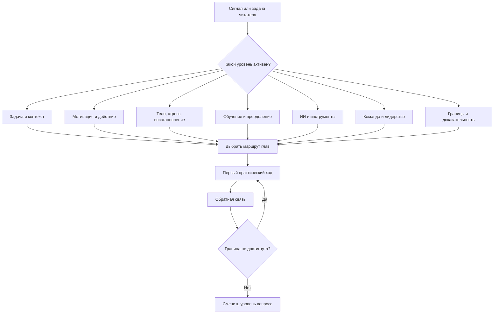
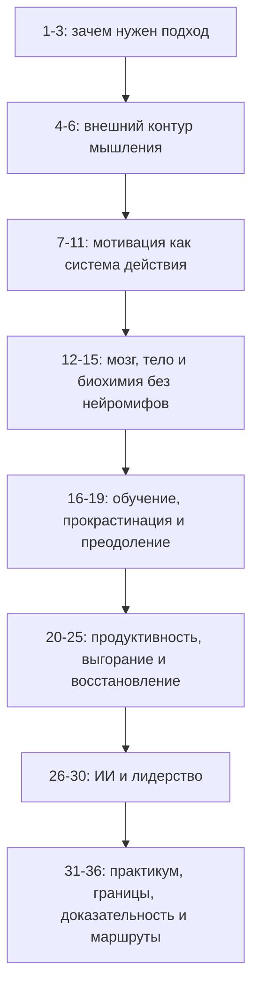

# Глава 36. Как пользоваться учебником

Этот учебник можно читать подряд. Так даже лучше, если вы входите в тему впервые.

Порядок глав построен не случайно. Сначала появляется узнаваемая проблема: человек теряет не только время, но и состояние мысли. Потом вводится внешний контур мышления. Затем - мотивация как система действия. После этого можно аккуратно добавить мозг, тело, биохимию, обучение, преодоление, продуктивность, выгорание, ИИ, лидерство, практикум, границы и доказательность.

Если начать с середины, легко исказить смысл.

Например, если открыть главу про дофамин до главы про уровни объяснения, можно снова получить "дофамин = мотивация". Если читать главу про продуктивность без глав про цену усилия и восстановление, можно принять устойчивый режим за более умный самоизнос. Если читать главу про ИИ без главы про опыт преодоления, можно решить, что главная задача - быстрее получить ответ, а не сохранить способность думать.

Но учебник нужен не только для первого чтения.

После первого прохода он должен работать как карта. Человек приходит не с абстрактным желанием "изучить когнитивное инженерство", а с конкретным сигналом:

```text
я не могу начать
я потерял контекст
я устал и не восстанавливаюсь
команда тонет в срочностях
ИИ стал думать вместо меня
сотрудник потерял мотивацию
я читаю исследование и не понимаю, насколько ему верить
```

В такие моменты учебник нужно открывать не как энциклопедию, а как навигационную систему.

Главная формула использования:

```text
сигнал -> уровень вопроса -> маршрут -> глава -> первый ход -> обратная связь -> граница
```

## Сначала уровень, потом глава

Самая частая ошибка - искать главу по слову.

Если нет сил, человек идет в главу про ресурсность. Если нет мотивации - в главу про мотивацию. Если тревожно - в главу про стресс. Если задача не начинается - в главу про прокрастинацию. Иногда это сработает. Но часто сигнал похож на одно, а причина живет на другом уровне.

Поэтому первый вопрос:

```text
какой уровень сейчас активен?
```

Не какой термин звучит знакомо, а где находится основной рычаг.

Вопрос схемы: с какого уровня начинать чтение, чтобы не чинить потерю контекста мотивационным нажимом, истощение продуктивностью или организационную проблему личным ритуалом?



Эта схема нужна не для красивого финала. Она защищает от неправильного применения книги.

Граница схемы: маршрут не обязан быть окончательным. Если первый ход не дает обратную связь или сигнал выходит за выбранный уровень, стоит вернуться к выбору уровня, а не давить сильнее тем же приемом.

Если сигнал "не могу начать" связан с потерей контекста, нужен рабочий журнал. Если он связан с угрозой оценки, нужно разбирать угрозу и управляемость. Если он связан с истощением, нужен маршрут восстановления. Если он связан с организационной средой, личный ритуал входа поможет только частично. Если он связан с тяжелым состоянием, учебник должен помочь увидеть границу, а не дать еще один протокол продуктивности.

## Основной линейный маршрут

Если вы читаете учебник впервые, лучше идти по порядку.

Лестница такая:

Вопрос схемы: какую последовательность понятий лучше пройти в первый раз, чтобы поздние практические главы не висели в воздухе?



Первый проход не обязан быть глубоким. Его задача - собрать карту.

Граница схемы: линейный маршрут нужен для первого знакомства, а не для запрета возвращаться к нужной главе по задаче.

На первом чтении достаточно после каждой части ответить:

```text
какую проблему эта часть решает?
какое понятие она вводит?
какой тип ошибки предотвращает?
какой практический вопрос я теперь могу задать точнее?
```

Не нужно сразу превращать каждую главу в практику. Иначе учебник станет набором незавершенных экспериментов.

Лучший первый проход:

1. Прочитать часть.
2. Выписать 3-5 понятий.
3. Нарисовать или пересказать ключевую схему.
4. Найти один пример из своей жизни или работы.
5. Не менять систему сразу, если непонятно, какую обратную связь смотреть.

## Маршруты по задачам

После первого знакомства учебник можно использовать как справочник. Но справочник здесь не значит "таблица приемов".

Маршрут должен вести через понятия и границы.

| Задача читателя | Начать с | Затем читать | Обязательно проверить |
| --- | --- | --- | --- |
| Войти в туманную задачу | 1, 4-6 | 21, 31-33 | Цена входа, WIP, контрольная точка, обратная связь. |
| Разобрать мотивацию | 7-11 | 18-19, 23-25, 29 | Угроза, управляемость, состояние, границы. |
| Работать с ИИ | 26-27 | 5, 16, 19, 31, 35 | Собственный след до запроса к ИИ, проверка, сохранение навыка. |
| Восстановиться после перегруза | 11, 15, 23-25 | 31-34 | Медицинская, организационная граница и граница восстановления. |
| Учиться сложному | 16-19 | 17, 26-27, 35 | Извлечение из памяти, полезная трудность, перенос, ИИ-обход. |
| Вести команду | 28-30 | 7-11, 20-25, 31, 34 | WIP, автономия, обратная связь, выгорание и профессиональная скука. |
| Собрать личный контур | 4-6, 20-22 | 31-32, 34-35 | Не превратить систему в бюрократию или самоизнос. |

В этой таблице важно слово "проверить". Маршрут не считается примененным, если после чтения не появилась обратная связь.

Не:

```text
прочитал главу про прокрастинацию, значит понял проблему
```

А:

```text
прочитал главу,
сформулировал гипотезу,
сделал первый проверяемый ход,
посмотрел, изменилась ли доступность действия
```

## Маршрут разработчика: туманная задача и потеря контекста

Если вы разработчик, архитектор, исследователь или любой человек, который работает с длинными неопределенными задачами, главный вход - главы 1 и 4-6.

Типовой сигнал:

```text
я знаю, что задача важная,
но не могу в нее войти
и каждый раз заново вспоминаю, где остановился
```

Не начинайте с мотивации.

Сначала проверьте контекст:

- есть ли цель;
- что известно;
- что непонятно;
- какие гипотезы уже проверялись;
- где последний рабочий след;
- что является ближайшим проверяемым срезом;
- что нужно оставить будущему себе.

Главы маршрута:

| Главы | Что взять |
| --- | --- |
| 1 | Понять проблему потери состояния мысли. |
| 4 | Собрать состояние задачи как внешний объект. |
| 5 | Вести рабочий журнал как контур мышления. |
| 6 | Делать вход и выход через ритуал, а не через героическое вспоминание. |
| 21 | Ограничить WIP и цену переключений. |
| 26-27 | Подключать ИИ без потери постановки, проверки и собственного следа. |
| 31-33 | Диагностировать конкретный сбой и выбрать первый ход. |

Первый практический ход:

```text
создать запись состояния задачи на 20 минут:
цель, контекст, туман, гипотезы, проверенные тупики,
следующий срез, критерий обратной связи
```

Обратная связь:

```text
стало ли дешевле снова войти в задачу?
понятнее ли следующий контакт?
меньше ли повторного вспоминания?
```

Граница:

если проблема не в контексте, а в хронической перегрузке, страхе оценки, невозможности выделить время, конфликте приоритетов или отсутствии полномочий, маршрут разработчика нужно соединить с маршрутами мотивации, восстановления или лидерства.

## Маршрут тимлида: среда, а не мотивационный нажим

Для тимлида или инженерного руководителя учебник особенно важен тем, что запрещает сводить проблемы команды к "люди не хотят".

Типовые сигналы:

```text
команда не держит фокус
задачи стареют
люди не проявляют инициативу
все постоянно срочно
мотивация просела
```

Первый вопрос:

```text
какая среда действия построена?
```

Главы маршрута:

| Главы | Что взять |
| --- | --- |
| 7-11 | Мотивация как контекст: ценность, угроза, управляемость, цена усилия. |
| 20-21 | Продуктивность и WIP как свойства режима, а не количества нажима. |
| 23-25 | Выгорание, профессиональная скука, долг восстановления и границы восстановления. |
| 28 | Лидерство как дизайн среды действия. |
| 29 | Мотивация сотрудника без типологии и манипуляции. |
| 30 | Командный фокус, срочность, прерывания и долг восстановления. |
| 31, 34 | Диагностика задачи и границы личного/организационного уровня. |

Первый практический ход:

```text
выбрать один командный симптом
и разобрать его не как черту людей,
а как среду:
цель, автономия, WIP, срочность, обратная связь, ресурсы, безопасность сообщения о риске
```

Обратная связь:

```text
стало ли команде понятнее,
что активно,
что срочно,
что заблокировано,
кто принимает решение,
и какой следующий срез продвижения?
```

Граница:

лидерство как когнитивное инженерство не является способом выжать из людей больше. Если требования хронически выше ресурсов, если нет полномочий, если среда небезопасна, если есть дискриминация, травля или системная несправедливость, личная мотивация сотрудников не является главным уровнем решения.

## Маршрут перегруза: не чинить истощение продуктивностью

Если вы пришли к учебнику в состоянии перегруза, не начинайте с глав про продуктивность.

Типовой сигнал:

```text
я устал,
но если правильно настрою систему,
может быть, снова смогу работать нормально
```

Осторожно. Иногда система действительно поможет. Иногда это начало нового самоизноса.

Главы маршрута:

| Главы | Что взять |
| --- | --- |
| 11 | Цена усилия, усталость и ощущаемая энергия. |
| 15 | Стресс, аллостаз и окно полезной нагрузки. |
| 20 | Продуктивность без самоизноса. |
| 23 | Как ломается мотивационный контур. |
| 24 | Выгорание и профессиональная скука. |
| 25 | Восстановление как возвращение управляемости. |
| 34 | Границы модели: медицина, психотерапия, организация. |

Первый практический ход:

```text
не планировать рывок;
составить карту нагрузки:
что требует усилия,
что восстанавливает,
что висит в WIP,
где нет управляемости,
какой минимальный безопасный шаг возможен
```

Обратная связь:

```text
уменьшился ли хаос?
появился ли безопасный следующий шаг?
стало ли легче отличать активное от замороженного?
появилось ли восстановление после снижения нагрузки?
```

Граница:

если состояние тяжелое, длительное, нарушает сон, аппетит, базовые дела, концентрацию, телесное самочувствие или безопасность, учебник не должен становиться заменой помощи. В этом режиме он может помочь описать состояние и подготовить разговор с врачом, терапевтом, руководителем или близкими, но не должен изображать лечение.

## Маршрут обучения: понимание, трудность и ИИ

Если ваша задача - учиться сложному, главный риск не в том, что вы мало читаете. Главный риск - принять знакомость за понимание.

Типовые сигналы:

```text
я читаю, но не могу применить
я понимаю объяснение, пока смотрю на него
я избегаю сложных задач
ИИ быстро объясняет, но навык не растет
```

Главы маршрута:

| Главы | Что взять |
| --- | --- |
| 3 | Минимальная модель внимания, памяти, тела и среды. |
| 16 | Понимание: фрагмент, чанк, извлечение из памяти, перенос. |
| 17 | Сон, консолидация, интервальные возвраты. |
| 18 | Прокрастинация как конфликт систем. |
| 19 | Опыт преодоления и полезная трудность. |
| 26-27 | ИИ как репетитор, оппонент, ускоритель, но не обход. |
| 35 | Дисциплина доказательности для учебных техник и нейромифов. |

Первый практический ход:

```text
после чтения темы закрыть материал
и восстановить из памяти:
что было главным,
какой пример,
какой вопрос я теперь могу решить,
где осталось непонимание
```

Обратная связь:

```text
могу ли я применить понятие в новой задаче?
могу ли объяснить без текста?
где ломается извлечение из памяти?
какая трудность полезная, а какая перегружает?
```

Граница:

ИИ может помогать учиться, если он работает после вашей попытки. Если он снимает всю трудность до того, как вы построили внутренний след, он может дать скорость без компетентности.

## Маршрут работы с ИИ

В этом учебнике ИИ не враг и не спаситель. Он внешний когнитивный контур. Как любой внешний контур, он может усилить мышление или заменить его видимостью мышления.

Типовой сигнал:

```text
с ИИ я двигаюсь быстрее,
но хуже понимаю, что именно решил
```

Главы маршрута:

| Главы | Что взять |
| --- | --- |
| 5-6 | Рабочий журнал, вход, выход, контрольная точка. |
| 16 | Понимание и иллюзия компетентности. |
| 19 | Полезная трудность и опыт овладения. |
| 26 | ИИ как усилитель или обход. |
| 27 | Практический режим работы с ИИ. |
| 31-33 | Диагностика задачи и практические кейсы. |
| 35 | Доказательства по ИИ, заявления поставщиков, быстро меняющаяся литература. |

Первый практический ход:

```text
перед запросом к ИИ записать:
цель,
контекст,
свою гипотезу,
критерий хорошего ответа,
что нельзя отдавать ИИ,
как буду проверять
```

Обратная связь:

```text
после ответа я лучше понимаю задачу?
могу объяснить решение?
знаю, что проверил?
остался след для будущего входа?
навык вырос или только задача закрылась?
```

Граница:

в высокорисковых задачах, медицинских, юридических, финансовых, безопасностных, приватных или организационно чувствительных вопросах ИИ не должен быть последним уровнем проверки. Даже в обычной разработке ИИ-ответ без собственного следа и проверки может увеличить скорость ошибки.

## Маршрут личного когнитивного контура

Если вы хотите собрать личную систему работы, не начинайте с выбора приложения.

Личный контур - это не набор инструментов. Это повторяемая петля:

```text
вход -> срез -> действие -> след -> выход -> восстановление -> разбор системы
```

Главы маршрута:

| Главы | Что взять |
| --- | --- |
| 4-6 | Контекст задачи, рабочий журнал, ритуалы входа/выхода. |
| 20-22 | Продуктивность, WIP, ресурсность, ритуалы. |
| 31 | Диагностика задачи. |
| 32 | Проектирование личного когнитивного контура. |
| 34-35 | Границы модели и дисциплина доказательности. |

Первый практический ход:

```text
выбрать один тяжелый трек
и сделать для него минимальный контур:
карта состояния,
правило входа,
правило выхода,
формат контрольной точки,
разбор системы раз в неделю
```

Обратная связь:

```text
снизилась ли цена входа?
меньше ли повторного вспоминания?
виден ли сдвиг?
не стала ли система бюрократией?
есть ли восстановление?
```

Граница:

если личный контур начинает требовать больше энергии, чем возвращает, он стал частью проблемы. Его нужно упростить, а не героически обслуживать.

## Маршрут "нет мотивации"

Фраза:

```text
нет мотивации
```

слишком широкая. Она может означать:

- нет ценности;
- ценность есть, но действие недоступно;
- высокая угроза;
- низкая управляемость;
- слишком высокая цена усилия;
- нет обратной связи;
- недосып;
- перегруз;
- недогруз;
- конфликт роли;
- выгорание;
- депрессивное или тревожное состояние;
- организационную проблему;
- отсутствие безопасного первого шага.

Маршрут:

| Если похоже на | Читать |
| --- | --- |
| "не понимаю, что делать" | 4-6, 31 |
| "важно, но страшно" | 8-10, 18-19 |
| "хочу результат, но нет сил" | 11, 15, 20-25 |
| "не вижу смысла" | 7-8, 24, 29 |
| "команда/среда не дает действовать" | 28-30, 34 |
| "состояние тяжелое и долгое" | 34 |

Первый практический ход:

```text
не спрашивать "как мотивироваться";
спросить:
что ценно,
что угрожает,
какова цена,
что управляемо,
какая обратная связь покажет сдвиг
```

## Как возвращаться к учебнику как к справочнику

Для повторного использования можно держать короткий протокол:

```text
1. Назови сигнал.
2. Определи уровень вопроса.
3. Выбери маршрут.
4. Прочитай одну-две опорные главы.
5. Выпиши один практический ход.
6. Заранее определи обратную связь.
7. Проверь границу.
8. Оставь след в рабочем журнале.
```

Пример:

```text
Сигнал: не могу вернуться к задаче после двух дней паузы.
Уровень: задача и контекст.
Маршрут: главы 4-6, затем 31.
Первый ход: восстановить карту состояния задачи за 20 минут.
Обратная связь: появился ли следующий проверяемый шаг.
Граница: если сопротивление связано не с контекстом, а с перегрузом, перейти к главам 11, 23-25 и 34.
```

Так учебник становится не полкой знаний, а рабочей картой.

## Как не пользоваться учебником

Есть несколько плохих способов.

### 1. Искать быстрый прием

```text
у меня прокрастинация, где техника?
```

Прокрастинация может быть дорогим входом, угрозой, усталостью, привычным уходом, недогрузом, перегрузом или клинической границей. Если сразу взять технику, можно усилить не тот контур.

### 2. Начинать с биохимии

```text
какой гормон отвечает за это состояние?
```

Этот вопрос редко первый. Сначала нужно понять поведение, задачу, состояние, среду и уровень вмешательства.

### 3. Чинить себя вместо среды

```text
как мне стать дисциплинированнее в постоянной срочности?
```

Иногда ответ - не стать жестче, а изменить WIP, серьезность входящих сигналов, роли, ожидания и право на фокус.

### 4. Использовать границы как оправдание бездействия

Раздел о границах не говорит:

```text
все сложно, ничего не делай
```

Она говорит:

```text
выбери правильный уровень помощи и действия
```

### 5. Читать доказательность как запрет на практику

Раздел о доказательности не говорит:

```text
если доказательство не идеальное, нельзя действовать
```

Она говорит:

```text
подбери силу вывода к силе доказательства
```

## Что делать после первого полного прохода

Если вы действительно проходите учебник как учебный курс, после линейного чтения стоит сделать не конспект всего, а личную карту применения.

Минимальная форма:

| Вопрос | Ответ |
| --- | --- |
| Какие три сигнала я теперь вижу точнее? | Например: потеря контекста, дорогой вход, долг восстановления. |
| Какие главы стали для меня опорными? | Не больше 5-7 глав. |
| Какая одна практика уже просится в работу? | Рабочий журнал, WIP-лимит, собственный след до запроса к ИИ, карта восстановления. |
| Какая обратная связь покажет, что практика помогает? | Снижение цены входа, меньше повторного вспоминания, яснее следующий шаг. |
| Где моя граница? | Медицинская, терапевтическая, организационная, доказательная или приватная граница. |

Не нужно строить всю систему сразу.

Система растет лучше, если начинать с одного контура:

```text
один тяжелый трек
один рабочий журнал
один ритуал входа
одна контрольная точка
один недельный разбор
```

Если это работает, можно расширять.

Если не работает, нужно не давить сильнее, а диагностировать:

```text
не тот уровень?
слишком много WIP?
нет обратной связи?
слишком высокая цена?
состояние не позволяет?
среда ломает контур?
```

## Второй проход

После полного чтения книга начинает работать иначе.

Первый проход нужен, чтобы собрать общий язык: контекст, ценность, угрозу, цену усилия, управляемость, тело, среду, инструменты, обратную связь и границы. Второй проход нужен не для повторения всего подряд, а для уточнения своей рабочей системы.

На втором проходе стоит задавать уже не вопрос:

```text
что здесь написано?
```

А вопрос:

```text
где это меняет мой следующий ход?
```

Хороший второй проход выглядит как выбор нескольких живых мест, а не как попытка внедрить всю книгу:

- один повторяющийся сбой входа в задачу;
- один перегруженный трек;
- одна ситуация, где ИИ помогает слишком рано;
- одна командная петля прерываний;
- одна зона восстановления, которую человек постоянно откладывает;
- одна граница, где нужно перестать чинить себя инструментами и перейти к другому уровню помощи.

Для каждого такого места достаточно пройти короткую петлю:

```text
сигнал -> глава -> понятие -> первый ход -> обратная связь -> граница
```

Если после этого ситуация стала понятнее, контур работает. Если нет, это тоже результат: значит, выбран не тот уровень объяснения, не тот первый ход, не та граница или не та единица работы.

Так учебник превращается из текста в прибор для повторного наведения резкости.

## Главный вывод

Пользоваться учебником - значит не запоминать все ответы, а учиться задавать правильный следующий вопрос.

Когда задача туманна:

```text
что нужно вынести из головы?
```

Когда нет мотивации:

```text
что происходит с ценностью, угрозой, ценой усилия и управляемостью?
```

Когда нет сил:

```text
это усталость, перегруз, недогруз, долг восстановления, среда или граница помощи?
```

Когда ИИ помогает:

```text
он усиливает мою петлю мышления или обходит ее?
```

Когда команда не держит фокус:

```text
какая среда действия делает фокус невозможным?
```

Когда исследование звучит убедительно:

```text
какой мост от доказательства к практике?
```

В этом и состоит практическая суть когнитивного инженерства.

Не заставить себя всегда быть сильнее.

Не найти один гормон, одну технику, один инструмент или один режим.

А научиться видеть систему:

```text
контекст,
ценность,
угрозу,
усилие,
управляемость,
тело,
среду,
инструменты,
обратную связь
и границы
```

И проектировать следующий честный шаг там, где он действительно доступен.

## Источниковая опора

Проверенный источниковый пакет: пакет источников для главы 36 от 2026-05-25.

Ключевые источники и внутренние опоры в авторско-годовой и артефактной форме:

- Внутренний контракт учебника, архитектура оглавления, карта понятий, визуальная система, критерии глав и реестр глав: рабочая опора для маршрутов чтения.
- Baddeley (2012), Hutchins (1995), Norman (1991, 1993), Risko & Gilbert (2016), Altmann & Trafton (2002): источники, унаследованные маршрутами разработчика и внешней когниции.
- McClelland (1961, 1987/1988), Ryan & Deci (2000, 2017), Baumeister & Leary (1995), Bandura (1977, 1997), Skinner (1996), Salamone & Correa (2024), Treadway et al. (2009, 2012): источники, унаследованные маршрутами мотивации, усилия, управляемости и действия.
- McEwen (1998), Barrett & Simmons (2015), Diamond (2013), Badre (2025), Roediger & Butler (2011), Soderstrom & Bjork (2015), Bjork & Bjork (2011/2020): источники, унаследованные маршрутами тела, состояния, контроля, понимания, обучения и полезной трудности.
- Sonnentag et al. (2017, 2022), Demerouti et al. (2001), Bakker & Demerouti (2007, 2017), World Health Organization (2019/2022), Maslach & Leiter (2016): источники, унаследованные маршрутами перегруза, восстановления, выгорания, профессиональной скуки и устойчивости команды.
- Parasuraman & Manzey (2010), Lee & See (2004), Hoff & Bashir (2015), Dell'Acqua et al. (2026), Poldrack (2006), Krakauer et al. (2017), Ioannidis (2005), Wasserstein & Lazar (2016), Page et al. (2021): источники, унаследованные маршрутами ИИ, доказательной дисциплины и проверки границ.

Роль источникового блока: навигационный раздел не вводит новых внешних утверждений; он собирает уже проверенные источниковые пакеты в маршруты чтения. Метки `strong`, `context-dependent`, `mixed`, `fast-moving` и `clinical-boundary` унаследованы от глав, стоящих за каждым маршрутом. Практическое правило: выбор маршрута никогда не отменяет последовательность понятий, проверку обратной связи и проверку границы.

Полные библиографические записи и DOI сохранены в соответствующих источниковых пакетах глав. Текущая редакция оставляет короткую карту источников как читательский ориентир, а не как новую библиографию.

## Короткое резюме

- Учебник можно читать линейно, но можно использовать как карту маршрутов.
- Маршрут выбирается по уровню вопроса: задача, мотивация, тело, обучение, продуктивность, ИИ, команда, граница или доказательность.
- Быстрый маршрут не отменяет базовые понятия: если понятие не введено, нужно вернуться к его главе.
- Любое применение должно заканчиваться проверкой обратной связи и границы.
- После первого полного чтения полезен второй проход по нескольким живым ситуациям, где понятия меняют следующий ход.

## Вопросы для самопроверки

1. Когда лучше читать учебник линейно, а когда маршрутом?
2. Почему нельзя начинать с практического приема, не определив уровень вопроса?
3. Какие главы нужны разработчику в туманной задаче?
4. Какие главы нужны человеку в перегрузе?
5. Что значит "проверка обратной связи и границы" после практического шага?

## Мини-практика

Выберите один живой сигнал и подберите маршрут:

```text
сигнал:
уровень вопроса:
первые 2-3 главы маршрута:
какое понятие нужно перечитать:
какой первый ход доступен:
какая обратная связь покажет сдвиг:
какая граница может быть активна:
когда вернуться к учебнику:
```

Эта практика превращает книгу из линейного текста в рабочую карту.

## Статус

`ready-for-review`

Ревизия блока: служебная проверка "Ревизия блока 31-36" от 2026-05-25.
