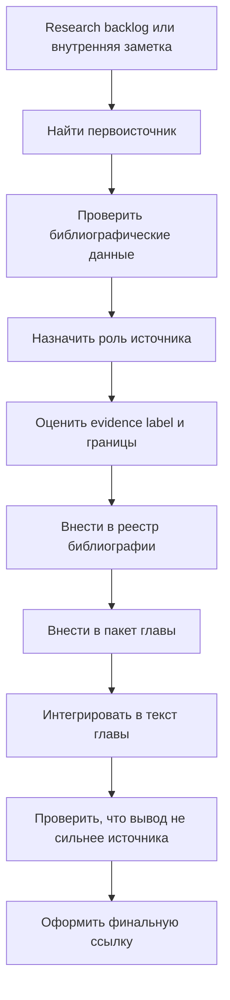

# Библиографический аппарат и правила ссылок

Дата фиксации: `2026-05-25`.

## Назначение

Эта заметка задает правила, по которым источники переходят из research backlog в текст учебника и финальную библиографию.

Главная задача аппарата ссылок - защитить учебник от трех ошибок:

- переноса непроверенных ссылок из внешнего research-пакета в основной текст;
- слишком уверенных практических выводов из слабого или контекстно-зависимого evidence;
- превращения поздних глав в краткий пересказ без первоисточников.

Учебник может быть написан живым человеческим языком, но его утверждения должны иметь ясную опору: где мы объясняем модель, где пересказываем данные, где предлагаем инженерное вмешательство, а где честно останавливаемся.

## Слои источников

| Слой | Что это | Можно ли цитировать в тексте учебника |
| --- | --- | --- |
| Research backlog | [[2026-05-25 Исходный research-пакет ChatGPT - карта источников]] и [[2026-05-24 Карта источников для большого учебника]] | Нет. Использовать только для планирования чтения и проверки полноты. |
| Рабочий реестр | [[00-Реестр-библиографии]] | Да, как навигацию внутри vault, но не как научный источник. |
| Пакет главы | Заметка вида `Пакет источников для главы N` | Да, как рабочую опору черновика; финальная глава должна ссылаться на первоисточники. |
| Первоисточник | Книга, статья, обзор, мета-анализ, классификация, guideline, эксперимент | Да, если проверены авторы, год, название, место публикации и роль источника. |
| Внутренний материал vault | Собственные заметки, статьи, карты, leadership-материалы, практические кейсы | Да, как авторский материал или пример; чувствительные детали должны быть санитаризированы. |

Research-пакет важен как карта местности, но не является картой доказательств. Следы вида `turn...` остаются только внутри сохраненного исходного пакета и не переходят в главы, source packets или финальную библиографию.

## Статусная лестница

| Статус | Что должно быть сделано |
| --- | --- |
| `backlog` | Источник назван в research-пакете или внутренней заметке, но еще не проверен. |
| `located` | Найден первоисточник или надежная страница издателя, журнала, DOI, библиотеки, организации. |
| `verified` | Проверены авторы, год, название, место публикации, тип источника и доступность. |
| `read` | Источник прочитан достаточно для понимания тезиса и ограничений. |
| `excerpted` | Выписаны ключевые идеи, границы, риски переноса и пригодные формулировки. |
| `integrated` | Источник использован в главе, с указанием роли и без расширения вывода за пределы данных. |
| `final-cited` | В тексте и финальной библиографии оформлена нормальная ссылка без рабочих следов. |

Минимальный статус для использования в черновике как содержательной опоры - `verified`. Минимальный статус для сильного практического вывода - `read` плюс явная оценка evidence.

## Формат ссылки в учебном тексте

Внутри русского текста использовать авторско-годовую форму:

```text
Бандура описывает самоэффективность как ожидание способности организовать и выполнить действия, необходимые для результата (Bandura, 1977, 1997).
```

Для нескольких источников указывать их функцию, а не складывать длинную гирлянду фамилий:

```text
Эту связку поддерживают классическая теория self-efficacy, обзоры источников самоэффективности и более поздние эмпирические уточнения (Bandura, 1977, 1997; Usher & Pajares, 2008; Pfitzner-Eden, 2016).
```

Прямые цитаты использовать редко. Для прямой цитаты нужны проверенное издание и страница. Если страницы нет, лучше пересказать смысл своими словами и указать источник.

В черновых главах допустимы Obsidian-ссылки на source packets, но финальная редакция должна постепенно переводить их в нормальные библиографические ссылки на первоисточники.

## Роли источников

Каждый источник в пакете главы должен иметь роль. Без роли ссылка превращается в декоративный хвост.

| Роль | Как использовать |
| --- | --- |
| Фундаментальная теория | Задает язык и основные различения; не доказывает все практические выводы сама по себе. |
| Обзор | Показывает состояние области и основные споры; требует проверки, какие выводы устойчивы. |
| Систематический обзор / мета-анализ | Дает более сильную опору для общего вывода, но все равно зависит от качества включенных исследований. |
| Эксперимент | Поддерживает конкретный механизм или эффект в конкретном дизайне; не превращается в универсальный совет. |
| Клиническая или медицинская граница | Помогает показать, где когнитивное инженерство должно остановиться. Не превращается в самодиагностику или лечение. |
| Методологический источник | Учит читать данные, уровни объяснения, bias, uncertainty and bridge to practice. |
| Emerging evidence | Помогает обозначить современный риск или направление, но требует осторожной модальности и даты проверки. |
| Внутренний авторский материал | Дает язык, кейсы и инженерный опыт; не заменяет внешний evidence там, где заявлен научный вывод. |

## Evidence labels для практических утверждений

Для каждого практического вывода редактор должен мысленно ответить на пять вопросов:

1. Что именно утверждается?
2. На каком типе источника это держится?
3. Для какой популяции, задачи, контекста и метрики это показано?
4. Что из этого можно перенести в инженерную практику без чрезмерного обещания?
5. Где нужно поставить границу или предупреждение?

Рабочие labels:

| Label | Как писать |
| --- | --- |
| `strong` | Можно формулировать как устойчивый принцип, но без абсолютов. |
| `context-dependent` | Указывать условия применимости и не обещать одинакового эффекта всем. |
| `mixed` | Писать как возможность или спорную зону, не как рекомендацию по умолчанию. |
| `weak` | Не делать практический совет; использовать только как гипотезу или пример ограничения. |
| `fast-moving` | Указывать дату проверки, версию инструмента/области и обновляемость вывода. |
| `clinical-boundary` | Прямо обозначать, что учебник не заменяет диагностику, лечение, психотерапию или организационное вмешательство. |

## Быстро меняющиеся области

Для ИИ, software engineering, новой нейронауки, препринтов и свежих обзоров обязательны:

- дата проверки;
- тип источника: peer-reviewed article, preprint, working paper, report, guideline, official classification;
- задача и метрика, на которых сделан вывод;
- поколение инструмента или состояние области на момент проверки;
- формулировка с ограничением: `на момент проверки`, `в этих условиях`, `в этой метрике`, `как emerging concern`.

Нельзя писать "ИИ ускоряет разработчиков" без уточнения: каких разработчиков, в каких задачах, каким инструментом, в какой метрике, на какой дате evidence и с какой ценой для качества, обучения и управляемости.

## Процесс интеграции источника



## Gate для главы

Перед переводом главы из `ready-for-review` в `done` проверить:

- в тексте нет `turn...`-следов и псевдоссылок внешнего поиска;
- ключевые утверждения опираются на первоисточники, а не только на research-карту;
- источник не используется шире своей роли;
- практические советы имеют evidence label и границы применимости;
- быстро меняющиеся выводы имеют дату проверки;
- клинические, медицинские и организационные границы не стерты;
- внутренние рабочие и leadership-примеры санитаризированы;
- финальный список литературы можно восстановить из ссылок главы и source packet.

## Редакционные запреты

- Не писать `дофамин = мотивация`, `серотонин = настроение`, `окситоцин = доверие`, `кортизол = стресс`, если дальше не раскрыта реальная многоконтурная роль.
- Не превращать одну статью в объяснение целой области.
- Не использовать мета-анализ как разрешение обещать эффект конкретному человеку в любой ситуации.
- Не превращать emerging concerns по ИИ и deskilling в окончательный приговор.
- Не превращать mixed evidence по mindfulness, HRV, БАДам, кофеину или нейротренингам в универсальные рекомендации.
- Не заменять главу списком источников: источник должен помогать объяснить механизм, а не закрывать дыру ссылкой.

## Связанные артефакты

- [[00-Реестр-библиографии]]
- [[2026-05-25 Исходный research-пакет ChatGPT - карта источников]]
- [[2026-05-24 Карта источников для большого учебника]]
- [[../04-Порядок-написания-и-критерии-глав]]
- [[../05-Реестр-глав]]
- [[../Главы/35-Как-читать-исследования-и-не-построить-нейромиф]]
