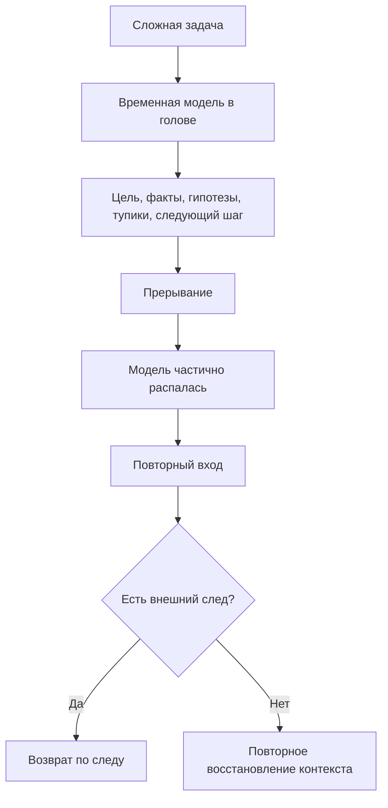

# Карта объяснения главы 1. Проблема: человек теряет не только время, но и состояние мысли

## Назначение карты

Эта карта переводит [[../Паспорта/01-Проблема-человек-теряет-состояние-мысли]] в маршрут будущей главы. Глава должна открыть учебник через узнаваемую боль: человек возвращается к сложной задаче и обнаруживает, что потерял не желание и не только время, а рабочее состояние мысли.

Главная защита от водянистого текста: не начинать с определения дисциплины. Сначала показать ситуацию, затем назвать сбой, затем объяснить, почему это инженерная проблема.

## Движение объяснения

| Шаг | Что объяснить | Какой вопрос закрывает |
| --- | --- | --- |
| 1 | Узнаваемая сцена возврата к задаче после прерывания. | Почему читателю вообще нужно читать дальше? |
| 2 | Разница между потерей времени, потерей мотивации и потерей состояния задачи. | Почему обычные объяснения не подходят? |
| 3 | Что именно распадается: цель, факты, гипотезы, тупики, следующий шаг. | Что значит "состояние мысли" без туманных слов? |
| 4 | Почему TODO-список хранит действие, но не всегда хранит понимание. | Почему привычный инструмент не решает проблему? |
| 5 | Почему восстановление контекста — настоящая когнитивная работа. | Почему час "разгона" не всегда прокрастинация? |
| 6 | Внешний след как инженерный ответ первого уровня. | Что можно проектировать уже сейчас? |
| 7 | Ограничения: журнал не заменяет отдых, приоритеты, навыки и здоровую среду. | Где не надо переобещать? |

## Скелет будущей главы

### 1. Сцена входа

Начать с конкретного, почти бытового эпизода:

```text
Ты открываешь задачу после встреч или выходных. Вчера казалось, что всё понятно. Сегодня перед тобой те же файлы, тот же тикет, те же логи, но внутренняя модель исчезла: непонятно, где остановился, какие варианты уже проверял и с какого шага продолжать.
```

Сразу убрать моральный оттенок. Не писать "каждый сталкивался" как пустую подводку. Лучше показать один точный эпизод и перейти к разбору.

### 2. Назвать сбой

Ввести формулировку:

```text
В такой момент теряется не только время. Теряется состояние мысли: временная рабочая модель задачи, которая была собрана в голове во время прошлого подхода.
```

После этого объяснить, из чего состоит состояние мысли:

- цель;
- текущая картина происходящего;
- важные факты;
- ограничения;
- гипотезы;
- проверенные тупики;
- открытые вопросы;
- следующий безопасный шаг.

### 3. Развести похожие причины

Обязательно показать, что "я не начинаю" может иметь разные причины:

- человек не знает, зачем задача нужна;
- человек истощен;
- задача пугает;
- шаг не определен;
- контекст распался.

Глава не должна решать все эти причины. Она фокусируется на последней: контекст распался, и вход в задачу стал отдельной работой.

### 4. Показать недостаточность TODO

Контраст:

```text
В списке задач: разобраться с интеграцией.
```

Против:

```text
Мы проверили два correlation_id, подозрение сместилось с потери события на обработку timeout, следующий шаг — посмотреть место перехода состояния после внешнего вызова.
```

Вывод: первая запись говорит, что делать в общем; вторая возвращает человека в ход расследования.

### 5. Объяснить цену восстановления

Показать, почему повторный вход дорог:

- рабочая память не держит сложную модель долго;
- часть следов остается, но без связей;
- человек вынужден заново искать источники;
- уже проверенные тупики снова кажутся возможными;
- неприятное ощущение "я опять ничего не понимаю" повышает сопротивление.

Здесь можно мягко подвести к памяти, но не уходить в подробную нейронауку. Подробная модель будет в главе 3.

### 6. Дать первую инженерную рамку

Формула:

```text
Если состояние задачи распадается, нужно проектировать способ его сохранения.
```

Это первый смысловой мост к когнитивному инженерству. Пока не нужно раскрывать всю дисциплину. Достаточно показать тип мышления: повторяющийся сбой рассматривается как конструкционная проблема.

### 7. Закрыть границы

Глава должна честно сказать:

- внешний след не заменяет сон;
- рабочий журнал не исправляет плохие приоритеты;
- заметки не лечат выгорание;
- иногда проблема в навыке, среде, перегрузе или полном отсутствии полномочий.

Так учебник сразу задает зрелый тон и не становится продуктивностной проповедью.

## Визуальная опора главы

Использовать схему из паспорта как первую диаграмму учебника.



Как читать схему в тексте:

1. Пока человек работает, задача существует не только в файлах и тикете, но и во временной модели в голове.
2. Прерывание разрушает не всю память, а связность модели.
3. Без внешнего следа возврат начинается с повторного восстановления.
4. С внешним следом человек возвращается не к пустому экрану, а к сохраненной точке продолжения.

## Основной пример

Один пример должен пройти через главы 1, 4, 5 и 6:

```text
Сервис получает событие из системы A, создает запись в базе, но иногда не создает связанный объект в системе B. После перерыва разработчик помнит только общую формулировку, но не помнит, что уже проверялось и какая гипотеза стала основной.
```

В главе 1 пример используется коротко: показать потерю состояния.

В главах 4-6 этот же пример будет расширен:

- глава 4: карта контекста;
- глава 5: рабочий журнал;
- глава 6: вход, выход и контрольная точка.

## Проверка полноты перед черновиком

Глава будет готова к черновику, если по карте можно ответить:

- чем состояние задачи отличается от задачи как записи в таск-трекере;
- почему потеря контекста не равна лени;
- что именно нужно сохранять;
- почему TODO может быть недостаточен;
- где граница метода.

## Риск слабого текста

Главный риск — написать мотивационную статью о том, что "важно фиксировать мысли". Это нельзя считать главой учебника. В главе должен быть механизм: временная модель задачи распадается, повторный вход становится отдельной когнитивной работой, внешний след снижает цену восстановления.

## Статус

`ready-for-review`

Черновик главы создан: [[../Главы/01-Проблема-человек-теряет-состояние-мысли]].

Следующий шаг: при финальной редактуре использовать эту карту как контроль: определение когнитивного инженерства должно вырастать из проблемы потери состояния мысли.
