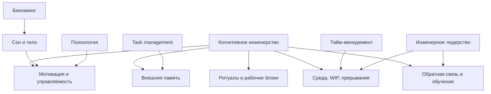

# Карта объяснения главы 2. Что такое когнитивное инженерство

## Назначение карты

Эта карта переводит [[../Паспорта/02-Что-такое-когнитивное-инженерство]] в маршрут будущей главы. После главы 1 читатель уже видел конкретный сбой: потерю состояния задачи. Теперь нужно дать название подходу и объяснить, почему он инженерный.

Глава должна быть определяющей, но не декларативной. Нельзя начинать с большой претензии на новую дисциплину. Нужно показать: если мышление регулярно ломается в узнаваемых местах, можно проектировать условия, в которых оно работает устойчивее.

## Движение объяснения

| Шаг | Что объяснить | Какой вопрос закрывает |
| --- | --- | --- |
| 1 | Вернуться к примеру потери контекста из главы 1. | Откуда появляется необходимость в подходе? |
| 2 | Сформулировать рабочее определение. | Что здесь называется когнитивным инженерством? |
| 3 | Раскрыть слово "инженерство": система, интерфейс, ограничение, обратная связь. | Почему это не просто "вести заметки"? |
| 4 | Показать объекты проектирования: задачи, среда, ритуалы, внешняя память, восстановление, команда. | Что именно можно проектировать? |
| 5 | Развести подход с соседними практиками. | Почему это не тайм-менеджмент, GTD или биохакинг? |
| 6 | Задать границы: не медицина, не психотерапия, не универсальная теория мозга. | Где заканчивается модель? |
| 7 | Подготовить переход к минимальной модели человека. | Что нужно понять дальше? |

## Скелет будущей главы

### 1. От сбоя к проектированию

Начать с короткого возвращения:

```text
В прошлой главе проблема выглядела просто: человек открыл задачу и не смог быстро восстановить ход мысли. Но если такой сбой повторяется, его можно рассматривать не как случайность, а как свойство конструкции работы.
```

Здесь важно не обвинять человека. Смена рамки: от самоупрека к проектированию.

### 2. Рабочее определение

Дать определение близко к корневой заметке:

```text
Когнитивное инженерство — это проектирование условий, в которых мышлению, вниманию, памяти, мотивации и действию легче работать точно, устойчиво и воспроизводимо.
```

Сразу пояснить каждое слово:

- проектирование — не вдохновение, а изменение конструкции;
- условия — не только внутренние качества, но среда и инструменты;
- мышление, внимание, память, мотивация и действие — разные части одной рабочей системы;
- устойчиво и воспроизводимо — не "всегда идеально", а с меньшей ценой повторного запуска.

### 3. Почему "инженерство"

Разобрать четыре инженерных слова:

| Инженерное слово | Как переводится в работу с мышлением |
| --- | --- |
| Система | Есть элементы, связи, ограничения и сбои. |
| Интерфейс | Человек взаимодействует с задачей через заметки, тикеты, файлы, ритуалы, людей. |
| Ограничение | Внимание, память, время, тело и среда не бесконечны. |
| Обратная связь | Система должна показывать, стало ли легче входить, продолжать и завершать. |

### 4. Что становится объектом проектирования

Показать список без раздутой теории:

- как задача формулируется;
- где хранится контекст;
- как выбирается первый шаг;
- как человек выходит из работы;
- как он возвращается после прерывания;
- как устроены переключения;
- как видна обратная связь;
- где проходят границы нагрузки.

Это готовит главы 4-6 и весь дальнейший учебник.

### 5. Отличие от соседних практик

Таблица из паспорта должна стать центральным различением главы. Важно не обесценить соседние практики:

- тайм-менеджмент нужен, когда проблема во времени;
- GTD помогает разгружать обязательства;
- биохакинг напоминает, что тело участвует в действии;
- психотерапия и медицина нужны там, где есть клинический или глубоко личный уровень;
- инженерное лидерство работает с командной средой.

Когнитивное инженерство соединяет эти плоскости вокруг вопроса: какая конструкция помогает человеку или группе лучше мыслить, действовать и восстанавливаться.

### 6. Границы и честность

Обязательно проговорить:

- это не медицинский протокол;
- это не клиническая диагностика;
- это не обещание постоянной продуктивности;
- это не способ обходить отдых;
- это не теория, которая объясняет всё поведение.

Границы нужно дать не в конце как скучное предупреждение, а как часть зрелости подхода.

### 7. Переход к главе 3

Финальный мост:

```text
Чтобы проектировать условия работы, нужно понимать хотя бы минимально, какая система работает внутри этих условий: внимание, память, тело, среда, действие и обратная связь. Этим займется следующая глава.
```

## Визуальная опора главы

Использовать карту пересечений.



Как читать схему:

1. Когнитивное инженерство не заменяет соседние области.
2. Оно берет из них не готовые лозунги, а элементы конструкции.
3. Центральный вопрос — не "какая практика правильная", а "какая часть системы сейчас требует проектирования".

## Основной пример

Продолжить пример из главы 1:

```text
Проблема "я не возвращаюсь к расследованию интеграции" может быть рассмотрена как календарная, мотивационная, телесная, организационная или когнитивно-инженерная. В этой главе нужно показать, что инженерный вопрос звучит так: какая конструкция входа, выхода и хранения контекста делает возврат дорогим?
```

## Проверка полноты перед черновиком

Глава будет готова к черновику, если она отвечает:

- что такое когнитивное инженерство в одной рабочей формулировке;
- почему это инженерный подход;
- что именно можно проектировать;
- чем он отличается от соседних практик;
- где его границы;
- почему для продолжения нужна минимальная модель человека.

## Риск слабого текста

Главный риск — написать рекламную главу о "новом подходе". Этого нельзя делать. Глава должна быть спокойной: есть повторяющиеся сбои сложной работы, есть элементы системы, есть способы менять конструкцию, есть границы метода.

## Статус

`ready-for-review`

Черновик главы создан: [[../Главы/02-Что-такое-когнитивное-инженерство]].

Следующий шаг: при финальной редактуре проверить, что глава остается спокойным рабочим определением, а не рекламной главой о новом подходе.
