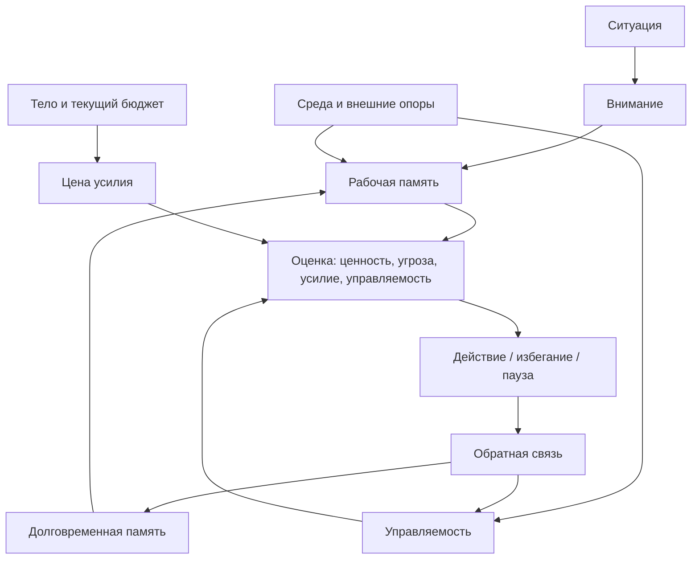

# Карта объяснения главы 3. Минимальная модель человека как работающей системы

## Назначение карты

Эта карта переводит [[../Паспорта/03-Минимальная-модель-человека-как-системы]] в маршрут будущей главы. После определения когнитивного инженерства нужно показать, какую систему мы проектируем вокруг человека.

Глава не должна становиться обзором мозга. Ее задача — дать минимальную рабочую модель, достаточную для следующих глав: внимание, рабочая память, долговременная память, тело, среда, действие, обратная связь.

## Движение объяснения

| Шаг | Что объяснить | Какой вопрос закрывает |
| --- | --- | --- |
| 1 | Почему для проектирования нужна модель человека. | Зачем эта глава между определением и практикой? |
| 2 | Внимание как ограниченный канал. | Почему нельзя просто "держать всё в голове"? |
| 3 | Рабочая память как узкое окно текущего удержания. | Почему состояние задачи распадается? |
| 4 | Долговременная память как сеть следов, а не идеальный архив. | Почему человек помнит куски, но теряет структуру? |
| 5 | Тело как часть оценки доступности действия. | Почему усталость, тревога и нагрузка меняют вход в задачу? |
| 6 | Среда как внешний контур мышления. | Почему заметки и инструменты являются частью системы, а не украшением? |
| 7 | Действие как итог оценки ценности, угрозы, усилия и управляемости. | Почему "желание" не равно действию? |
| 8 | Обратная связь как обновление будущего прогноза. | Как система учится? |

## Скелет будущей главы

### 1. Зачем нужна минимальная модель

Начать с перехода:

```text
Если мы собираемся проектировать условия мышления, нужно понимать, что именно эти условия разгружают, поддерживают или перегружают.
```

Не обещать полную научную карту. Сразу сказать: это рабочая модель для учебника, а не анатомический атлас.

### 2. Внимание

Объяснить внимание как ограниченный канал выбора. Важно не уходить в метафору прожектора слишком далеко. Главная мысль: внимание не может удерживать все элементы сложной задачи одновременно.

Связка с главой 1:

```text
Когда человек возвращается к задаче, внимание сначала тратится не на решение, а на восстановление значимых элементов.
```

### 3. Рабочая память

Ввести рабочую память как узкое окно, где временно удерживается и преобразуется информация. Здесь объяснить, почему "я же вчера понимал" не означает "модель будет доступна сегодня".

Не перегружать цифрами о слотах. Достаточно различения:

- отдельные фрагменты держатся плохо;
- собранные смысловые блоки держатся лучше;
- сложная задача без внешней опоры быстро перегружает окно удержания.

### 4. Долговременная память

Показать, что долговременная память хранит не готовую папку с полной задачей, а следы, связи и смысловые блоки. Поэтому при возврате человек может помнить отдельные детали, но не помнить структуру рассуждения.

Связать с чанкингом:

```text
Чанк — это не красивое сокращение, а способ превратить несколько элементов в одну рабочую единицу.
```

### 5. Тело и текущий бюджет

Ввести тело аккуратно, без биохакинга. Тело участвует в оценке допустимости действия: усталость, напряжение, сон, тревога и восстановление меняют ощущаемую цену шага.

Здесь не раскрывать кортизол, дофамин, аллостаз. Это будет позже. Сейчас важно одно: тело не фон, а часть рабочей системы.

### 6. Среда и внешний контур

Показать среду как часть мышления:

- заметки;
- тикеты;
- структура файлов;
- календарь;
- ритуалы;
- договоренности с людьми;
- инструменты поиска и проверки.

Главная связка: если рабочая память узкая, внешняя среда может удерживать то, что не стоит держать в голове.

### 7. Действие

Ввести простую формулу без углубления:

```text
действие зависит не только от желания, а от оценки ценности, угрозы, усилия и управляемости
```

Сказать, что эти параметры будут раскрыты в мотивационном блоке. В этой главе они нужны как место в общей модели.

### 8. Обратная связь

Показать, что после действия система обновляется:

- что сработало;
- что не сработало;
- стало ли понятнее;
- выросла или упала управляемость;
- стал ли будущий вход легче.

Это готовит главы про обучение, преодоление и лидерство.

## Визуальная опора главы

Главная схема — "человек как рабочая система".



Как читать схему:

1. Ситуация не идет напрямую в действие.
2. Она проходит через внимание, память, тело, среду и оценку.
3. Среда может помогать системе, потому что часть работы вынесена наружу.
4. Обратная связь меняет будущую доступность действия.

## Основной пример

Использовать тот же возврат к интеграционной задаче:

- внимание цепляется за ощущение тумана;
- рабочая память не держит старую гипотезу;
- долговременная память дает следы: "там был timeout", "какой-то correlation_id";
- тело может усиливать сопротивление, если человек устал;
- среда либо содержит рабочую заметку, либо заставляет собирать модель заново;
- действие запускается только если появляется достаточно управляемый первый шаг.

## Проверка полноты перед черновиком

Глава готова к черновику, если она:

- вводит все элементы модели простым языком;
- не использует нейромедиаторы раньше времени;
- не сводит человека к мозгу;
- показывает, почему внешняя память естественно следует из ограничений рабочей памяти;
- готовит переход к контексту задачи.

## Риск слабого текста

Главный риск — сделать или слишком примитивную модель, или преждевременную лекцию по нейронауке. Нужно удержать середину: достаточно точно, чтобы на этой модели можно было строить, но достаточно просто, чтобы читатель не застрял перед практическим блоком.

## Статус

`ready-for-review`

Черновик главы: [[../Главы/03-Минимальная-модель-человека-как-работающей-системы]].

Связка с первым практическим блоком проверена: [[../Проверки/2026-05-24 Связка глав 3-6]].

Следующий шаг: при финальной редактуре использовать эту карту для проверки, что глава 3 ведет к внешнему контуру, но не забирает материал глав 4-6.
