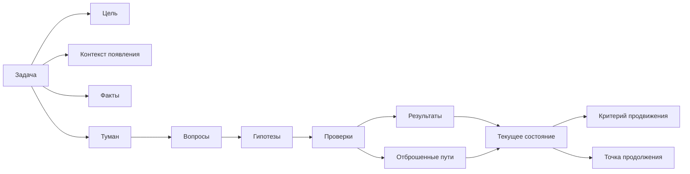

# Карта объяснения главы 4. Контекст задачи: что нужно вынести из головы

## Назначение карты

Эта карта переводит [[../Паспорта/04-Контекст-задачи]] в маршрут будущей главы. Глава открывает практический блок: если человек как система ограничен вниманием и рабочей памятью, нужно решить, что именно выносить наружу.

Глава должна научить читателя видеть контекст задачи как рабочий объект. Не "завести красивую заметку", а отделить цель, факты, туман, гипотезы, проверки, ограничения и точку продолжения.

## Движение объяснения

| Шаг | Что объяснить | Какой вопрос закрывает |
| --- | --- | --- |
| 1 | Почему после модели человека первым делом идет контекст задачи. | Что практически делать с ограниченной памятью? |
| 2 | Разница между задачей, действием и состоянием задачи. | Почему TODO недостаточен? |
| 3 | Цель и контекст появления. | Зачем задача существует? |
| 4 | Известные факты и неизвестные места. | Что уже опора, а что еще туман? |
| 5 | Гипотезы, проверки и отброшенные пути. | Как не ходить по кругу? |
| 6 | Ограничения и критерий продвижения. | Как действовать безопасно и видеть прогресс? |
| 7 | Точка продолжения. | Как снизить цену следующего входа? |
| 8 | Минимальная версия для старта. | Как не превратить контекст в бюрократию? |

## Скелет будущей главы

### 1. Переход от модели к практике

Начать с вывода из главы 3:

```text
Если рабочая память узкая, то сложная задача не должна целиком жить в голове. Но выносить нужно не всё подряд, а те элементы, без которых повторный вход превращается в новое расследование.
```

### 2. Три разных объекта

Ввести различение:

| Объект | Пример | Зачем различать |
| --- | --- | --- |
| Задача | "Разобраться с промежуточным состоянием объекта". | Это контейнер проблемы. |
| Действие | "Сравнить логи по двум correlation_id". | Это ближайший шаг. |
| Состояние задачи | "Событие не теряется, подозрение сместилось на обработку timeout". | Это текущая модель понимания. |

### 3. Цель

Объяснить, что цель — не формальность. Она отвечает на вопрос, что должно измениться после работы. Без цели человек может делать технически полезные действия, которые не продвигают задачу.

Пример плохой цели:

```text
Разобраться с интеграцией.
```

Пример рабочей цели:

```text
Понять, почему объект иногда остается в промежуточном состоянии, и выбрать безопасный способ исправления.
```

### 4. Факты и туман

Дать строгое различение:

- факт — подтвержденная опора;
- туман — место, где пока нет достаточной модели;
- вопрос — формулировка тумана в проверяемом виде.

Показать, что "непонятно" нужно не ругать, а дробить.

### 5. Гипотезы и проверки

Объяснить, что гипотеза — не истина, а временное объяснение, которое направляет проверку. Проверка должна менять состояние задачи: подтверждать, ослаблять или отбрасывать гипотезу.

Обязательно ввести "отброшенный путь". Это защита от повторного хождения по кругу.

### 6. Ограничения

Показать, что ограничения — это часть контекста, а не внешний бюрократический слой:

- нельзя потерять данные;
- нельзя повторить операцию без идемпотентности;
- нельзя ломать совместимость;
- нельзя опираться на внутреннюю рабочую конкретику в публичном тексте.

### 7. Критерий продвижения

Сильная мысль главы:

```text
В туманной задаче прогресс часто наступает раньше решения: когда стало ясно, какая гипотеза слабее, какой путь закрыт или какой следующий шаг безопасен.
```

Это важно, чтобы читатель не чувствовал, что работает "без результата", пока финальный фикс еще не найден.

### 8. Точка продолжения

Показать точку продолжения как антидот к будущему туману. Она должна быть физическим или проверяемым шагом:

- открыть конкретный файл;
- сравнить два лога;
- проверить конкретную гипотезу;
- спросить конкретное уточнение;
- запустить конкретный тест.

Не писать "продолжить разбираться".

## Визуальная опора главы

Использовать схему "состояние задачи как внешний объект".



Как читать схему:

1. Контекст задачи не равен списку действий.
2. Туман полезен, когда превращен в вопросы и гипотезы.
3. Проверки должны обновлять текущее состояние.
4. Точка продолжения связывает текущий подход со следующим.

## Основной пример

Продолжить пример с промежуточным состоянием объекта. В этой главе он впервые раскрывается как карта контекста:

```markdown
## Цель
Понять, почему объект иногда остается в промежуточном состоянии, и выбрать безопасный способ исправления.

## Факты
- событие приходит из системы A;
- запись в базе создается;
- объект в системе B создается не всегда;
- неуспешный сценарий связан с timeout внешнего вызова.

## Туман
- что происходит после timeout;
- есть ли компенсация;
- можно ли безопасно повторить операцию.

## Гипотезы
- состояние меняется до внешнего вызова;
- timeout обрабатывается как частичный успех;
- ретрай отсутствует или не видит промежуточное состояние.

## Точка продолжения
Найти код перехода состояния и обработку ошибки внешнего вызова.
```

## Проверка полноты перед черновиком

Глава готова к черновику, если она:

- различает задачу, действие и состояние задачи;
- показывает каждый элемент контекста через пример;
- объясняет, зачем фиксировать отброшенные пути;
- вводит критерий продвижения до финального результата;
- дает минимальную форму, которую можно реально применить.

## Риск слабого текста

Главный риск — превратить главу в шаблон заметки без объяснения. Нужно не просто перечислить поля, а показать, какую когнитивную нагрузку снимает каждое поле.

## Статус

`ready-for-review`

Черновик главы: [[../Главы/04-Контекст-задачи]].

Следующий шаг: при финальной редактуре удержать пример как мост к главе 5 и не расширять карту контекста до полноценного рабочего журнала.
