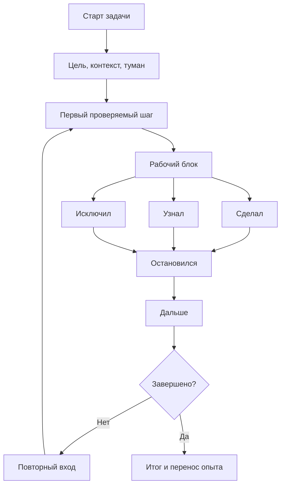

# Карта объяснения главы 5. Рабочий журнал как внешний контур мышления

## Назначение карты

Эта карта переводит [[../Паспорта/05-Рабочий-журнал]] в маршрут будущей главы. После главы 4 читатель знает, какой контекст нужно вынести из головы. Теперь нужно показать форму, в которой этот контекст живет во времени: рабочий журнал.

Глава должна защищать важное различение: рабочий журнал — не дневник, не архив, не отчет и не конспект. Это интерфейс к продолжающейся задаче.

## Движение объяснения

| Шаг | Что объяснить | Какой вопрос закрывает |
| --- | --- | --- |
| 1 | Почему разовой карты контекста недостаточно. | Что меняется во времени? |
| 2 | Рабочий журнал как внешний контур мышления. | Что это такое по функции, а не по форме? |
| 3 | Отличие от дневника, TODO, конспекта и отчета. | С чем его нельзя путать? |
| 4 | Жизненный цикл журнала: старт, блок, выход, возврат, завершение. | Когда и как его вести? |
| 5 | Минимальный шаблон. | Как начать без тяжелой системы? |
| 6 | Пример заполнения на той же инженерной задаче. | Как это выглядит живо? |
| 7 | Критерии качества записи. | Как понять, что журнал помогает? |
| 8 | Границы: когда журнал сжать или не применять. | Как не сделать бюрократию? |

## Скелет будущей главы

### 1. Контекст меняется

Начать с перехода:

```text
Карта контекста полезна, но сложная задача не стоит на месте. Каждый рабочий блок меняет картину: что-то подтверждается, что-то отбрасывается, появляются новые вопросы. Поэтому нужен не только снимок, но и способ вести историю изменений состояния задачи.
```

### 2. Функция рабочего журнала

Определение:

```text
Рабочий журнал — это внешний контур мышления, который хранит ход работы с задачей так, чтобы человек мог продолжить ее после прерывания без повторного восстановления всей модели.
```

Пояснить "внешний контур":

- часть состояния хранится не в голове;
- журнал направляет повторный вход;
- запись обновляется после проверок;
- будущий читатель — сам автор.

### 3. Не дневник, не TODO, не отчет

Использовать таблицу из паспорта. В тексте обязательно показать:

- дневник может быть честным, но неоперациональным;
- TODO может быть ясным, но без состояния;
- конспект может хранить информацию, но не ход решения;
- отчет может быть полезен другим, но слишком сглажен для продолжения.

Рабочий журнал сохраняет рабочую шероховатость: что проверялось, что не получилось, где остановились.

### 4. Жизненный цикл

Разобрать пять моментов:

1. старт задачи — цель, контекст, туман;
2. перед блоком — первый проверяемый шаг;
3. после блока — сделал, узнал, исключил;
4. перед выходом — где остановился, что дальше;
5. завершение — итог, уроки, перенос.

Не требовать полной формы всегда. Показать, что объем записи зависит от сложности задачи.

### 5. Минимальный шаблон

Дать короткую форму:

```markdown
## Перед началом
- Что пытаюсь сделать:
- Что сейчас непонятно:
- Первый проверяемый шаг:

## После блока
- Сделал:
- Узнал:
- Исключил:
- Остановился на:
- Дальше:
```

Пояснить каждое поле через функцию:

- "сделал" фиксирует действие;
- "узнал" фиксирует изменение модели;
- "исключил" защищает от повторов;
- "остановился" возвращает место;
- "дальше" снижает цену входа.

### 6. Пример заполнения

Продолжить пример:

```markdown
### После блока
- Сделал: сравнил логи по успешному и неуспешному correlation_id.
- Узнал: в неуспешном сценарии внешний вызов получает timeout, но объект уже переведен в промежуточное состояние.
- Исключил: событие не теряется до обработчика.
- Остановился на: нужно понять, как обрабатывается ошибка внешнего вызова.
- Дальше: открыть код перехода состояния и проверить ветку обработки timeout.
```

### 7. Критерии хорошего журнала

Хорошая запись:

- помогает начать следующий блок;
- показывает, что изменилось в понимании;
- отделяет факт от гипотезы;
- фиксирует отброшенные пути;
- не требует перечитать огромный текст;
- достаточно короткая, чтобы ее реально вести.

### 8. Границы

Глава должна честно сказать:

- если запись не помогает продолжать, она стала архивом;
- если запись слишком длинная, ее нужно сжать;
- если проблема в перегрузе, журнал не заменяет восстановление;
- если задача простая, полная форма не нужна.

## Визуальная опора главы

Использовать схему жизненного цикла.



Как читать схему:

1. Журнал не заканчивается на первой записи.
2. Каждый блок обновляет состояние задачи.
3. Выход из блока готовит следующий вход.
4. Завершение фиксирует переносимый опыт, а не только закрытие задачи.

## Проверка полноты перед черновиком

Глава готова к черновику, если она:

- объясняет функцию журнала, а не только форму;
- разводит журнал с похожими типами записей;
- показывает жизненный цикл;
- дает минимальный шаблон;
- содержит живой пример;
- вводит критерии хорошей записи и границы метода.

## Риск слабого текста

Главный риск — сделать главу инструкцией по Obsidian или шаблоном ради шаблона. Нужно удержать учебную задачу: журнал является внешним контуром мышления, потому что сохраняет состояние задачи между рабочими блоками.

## Статус

`ready-for-review`

Черновик главы написан: [[../Главы/05-Рабочий-журнал-как-внешний-контур-мышления]].

Следующий шаг: при финальной редактуре проверить, что глава 5 остается учебным объяснением внешнего контура мышления, а не инструкцией по шаблону.
