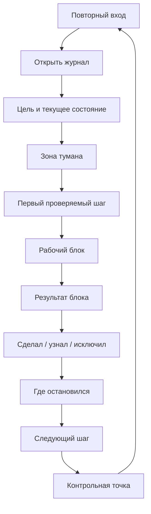

# Карта объяснения главы 6. Ритуалы входа и выхода

## Назначение карты

Эта карта переводит [[../Паспорта/06-Ритуалы-входа-и-выхода]] в маршрут будущей главы. Глава завершает первый практический блок: читатель уже знает, что такое контекст задачи и рабочий журнал, теперь нужно встроить их в повторяемое действие.

Глава должна показать ритуал как короткий рабочий протокол, а не как декоративную привычку. Вход возвращает человека в задачу. Выход защищает будущий вход.

## Движение объяснения

| Шаг | Что объяснить | Какой вопрос закрывает |
| --- | --- | --- |
| 1 | Почему журнал сам по себе не гарантирует применения. | Почему нужна практика, а не только артефакт? |
| 2 | Ритуал как повторяемая короткая последовательность. | Что здесь называется ритуалом? |
| 3 | Ритуал входа: цель, состояние, туман, первый проверяемый шаг. | Как начать туманную задачу? |
| 4 | Рабочий блок: удержать один проверяемый шаг. | Как не пытаться решить всё сразу? |
| 5 | Ритуал выхода: результат, новое знание, исключения, контрольная точка. | Как не потерять состояние? |
| 6 | Цикл входа и выхода. | Почему каждый выход готовит следующий вход? |
| 7 | Минимальная версия на 60-90 секунд. | Как начать без большой системы? |
| 8 | Антибюрократический критерий и границы. | Когда ритуал нужно упростить или остановить? |

## Скелет будущей главы

### 1. От артефакта к действию

Начать с точного перехода:

```text
Рабочий журнал помогает только тогда, когда он встроен в работу. Если запись существует отдельно, а вход в задачу каждый раз начинается с пустого экрана и внутреннего сопротивления, контур не замкнут.
```

### 2. Что такое ритуал

Определение:

```text
Ритуал в этой главе — это короткая повторяемая последовательность действий, которая переводит человека в нужный режим работы и снижает цену переключения.
```

Сразу отделить от мистики, мотивационной церемонии и бюрократии. Ритуал проверяется полезностью: после него легче начать, продолжить или завершить без потери состояния.

### 3. Ритуал входа

Структура входа:

1. открыть рабочий журнал;
2. прочитать цель и текущее состояние;
3. назвать текущую зону тумана;
4. выбрать один проверяемый шаг;
5. ограничить шаг по времени или объему;
6. начать не с финального решения, а с уменьшения неопределенности.

Пояснить, почему "первый проверяемый шаг" важнее "идеального плана".

### 4. Рабочий блок

Показать, что рабочий блок должен быть достаточно узким. Если человек пытается за один подход решить всю туманную задачу, он снова перегружает внимание и рабочую память.

Формула:

```text
на один блок — один главный вопрос или одна проверяемая гипотеза
```

### 5. Ритуал выхода

Структура выхода:

1. что сделал;
2. что узнал;
3. что подтвердил или исключил;
4. где остановился;
5. что открыть или проверить первым при следующем входе.

Показать, что выход — не отчет, а контрольная точка.

### 6. Цикл

Главная мысль:

```text
Хороший выход — это уже начало следующего входа.
```

Цикл должен быть виден в схеме и тексте. Это не две независимые привычки, а один контур сохранения состояния.

### 7. Минимальная версия

Дать честную минимальную форму:

```text
Перед началом: что я пытаюсь сделать и какой первый шаг?
После блока: где остановился и что делать дальше?
```

Расширенная форма добавляет "что узнал" и "что исключил". Полная форма нужна для сложных задач, а не для каждого мелкого действия.

### 8. Антибюрократический критерий

Ритуал хорош, если:

- снижает цену входа;
- уменьшает повторное восстановление;
- помогает удерживать один шаг;
- занимает меньше сил, чем экономит;
- остается применимым в обычный день.

Если ритуал стал сопротивлением сам по себе, его нужно сократить.

## Визуальная опора главы

Использовать циклическую диаграмму входа и выхода.



Как читать схему:

1. Вход начинается не с усилия в пустоту, а с журнала.
2. Туман называется до действия.
3. Рабочий блок ограничивается проверяемым шагом.
4. Выход сохраняет контрольную точку.
5. Контрольная точка становится началом следующего входа.

## Основной пример

Продолжить задачу с интеграцией:

```text
Вход: открыть журнал, увидеть, что основная гипотеза теперь связана с обработкой timeout, выбрать первый шаг — найти код перехода состояния.

Выход: зафиксировать, что переход состояния происходит до внешнего вызова; исключить потерю события до обработчика; оставить следующий шаг — проверить компенсацию при ошибке внешнего вызова.
```

Важно показать, что это занимает меньше времени, чем повторное восстановление всего расследования.

## Проверка полноты перед черновиком

Глава готова к черновику, если она:

- объясняет, зачем нужен ритуал после журнала;
- дает короткий вход и короткий выход;
- показывает цикл, а не отдельные чек-листы;
- вводит первый проверяемый шаг;
- содержит антибюрократический критерий;
- честно говорит, что ритуал не заменяет восстановление, полномочия и смысл задачи.

## Риск слабого текста

Главный риск — сделать главу похожей на советы о привычках. Здесь ритуалы нужны не ради "утренней продуктивности", а как инженерный способ сохранить состояние задачи между подходами.

## Статус

`ready-for-review`

Черновик главы написан: [[../Главы/06-Ритуалы-входа-и-выхода]].

Следующий шаг: при ревизии глав 7-11 использовать эту карту как мост: мотивационный блок должен отвечать, почему даже при хорошем внешнем контуре действие иногда не запускается.
