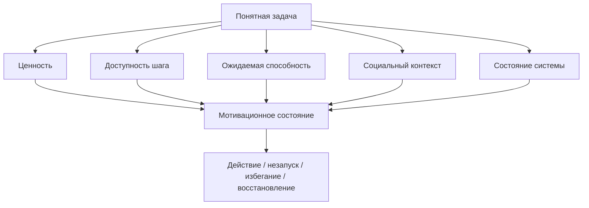

# Карта объяснения главы 7. Мотивация — это не желание

## Назначение карты

Эта карта переводит [[../Паспорта/07-Мотивация-это-не-желание]] в маршрут главы. Глава открывает мотивационный блок и должна мягко, но точно сменить оптику: после внешнего контура мышления читатель видит, что ясная задача все равно может не запускаться.

Главная задача — не пересказать все теории мотивации, а дать первый рабочий слой: мотивация как система параметров действия.

## Движение объяснения

| Шаг | Что объяснить | Какой вопрос закрывает |
| --- | --- | --- |
| 1 | Внешний контур помогает, но не запускает действие автоматически. | Почему после главы 6 нужна мотивация? |
| 2 | Бытовая модель "хочется / не хочется" слишком бедна. | Что в ней ломается? |
| 3 | Мотивация как конфигурация параметров. | Что такое мотивационное состояние? |
| 4 | Ценность результата и потребности. | Почему задача может быть важной по-разному? |
| 5 | Доступность первого шага. | Почему важная цель может не иметь входа? |
| 6 | Ожидаемая способность действовать. | Почему ценность не равна запуску? |
| 7 | Социальный контекст и состояние системы. | Почему мотивация не находится только "в голове"? |
| 8 | Минимальная диагностика незапуска действия. | Что делать с этой моделью практически? |

## Скелет будущей главы

### 1. Переход от ритуала к мотивации

Начать с ситуации:

```text
У задачи есть контекст. Есть журнал. Есть следующий шаг. И все равно человек не начинает.
```

Показать: это не опровержение внешнего контура, а граница его действия. Он сохраняет состояние мысли, но не отменяет ценность, угрозу, управляемость и цену усилия.

### 2. Почему "желание" не объясняет действие

Разобрать три случая:

- человек хочет результата, но не начинает;
- человек не хочет процесса, но делает;
- человек начинает действие, потому что оно снижает угрозу, а не потому что привлекательно.

Вывод: желание — только один возможный сигнал, а не модель мотивации.

### 3. Рабочая модель мотивационного состояния

Ввести формулу:

```text
мотивация = ценность + потребности + ожидаемая способность действовать + доступность шага + социальный контекст + состояние системы
```

Пояснить, что формула учебная: она нужна не для измерения, а для диагностики.

### 4. Ценность и потребности

Дать краткий вход:

- McClelland: мотивы организуют внимание и критерии успеха;
- SDT: качество мотивации зависит от автономии, компетентности и связанности;
- belonging: принадлежность нельзя считать украшением.

Не разворачивать главы 8-9 заранее.

### 5. Доступность действия

Показать разницу:

```text
цель важна != первый шаг доступен
```

Доступность шага зависит от ясности, размера, обратимости, угрозы и входного контекста.

### 6. Ожидаемая способность действовать

Ввести Bandura только в нужном объеме: человек может ценить исход, но не верить, что способен выполнить действие или повлиять на результат.

Главу 10 не пересказывать.

### 7. Социальный контекст и состояние системы

Показать два коротких фактора:

- социальная цена может менять доступность действия;
- усталость, недосып и напряжение меняют цену входа.

Глубокую нейробиологию оставить главам 11-15.

### 8. Практическая диагностика

Дать короткую форму:

```text
Что здесь ценно?
Что здесь угрожает?
Какой шаг доступен?
Верю ли я, что могу повлиять?
Что с телом и средой?
```

## Визуальная опора главы

Использовать схему запуска действия из паспорта.



Как читать схему: понятная задача входит в систему, но итог зависит от нескольких параметров. Поэтому "сделай нормальный план" не всегда решает проблему.

## Основной пример

Использовать задачу разработчика с ясной контрольной точкой, но незапуском утром. Разобрать не как "плохую дисциплину", а как сочетание высокой угрозы, низкой управляемости и плохого состояния.

## Проверка полноты перед черновиком

Глава готова к черновику, если она:

- объясняет границу внешнего контура;
- разрушает модель "мотивация = хочется";
- вводит формулу мотивационного состояния;
- не перегружает нейробиологией;
- дает пример незапуска действия;
- заканчивается практической диагностикой.

## Риск слабого текста

Главный риск — сделать главу набором общих фраз про мотивацию. Нужна механика: какие параметры меняют доступность действия и как их различать.

## Статус

`ready-for-review`

Черновик главы написан: [[../Главы/07-Мотивация-это-не-желание]].

Следующий шаг: при финальной редактуре проверить, что глава 7 действительно остается мостом от внешнего контура к мотивационной модели, а не отдельным обзором теорий мотивации.
