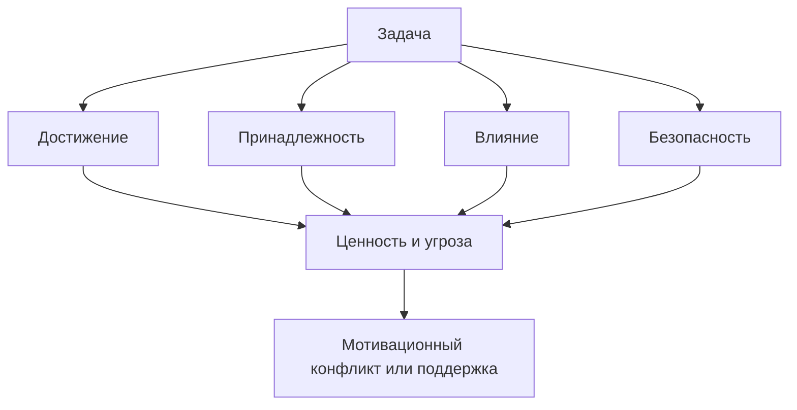

# Карта объяснения главы 8. Четыре области мотивации

## Назначение карты

Эта карта переводит [[../Паспорта/08-Четыре-области-мотивации]] в маршрут главы. После главы 7 читатель понимает, что ценность — один из параметров мотивации. Теперь нужно показать, что ценность сама имеет разные области.

Глава должна дать карту, а не типологию личности.

## Движение объяснения

| Шаг | Что объяснить | Какой вопрос закрывает |
| --- | --- | --- |
| 1 | Ценность не является одной шкалой. | Почему "важно / не важно" недостаточно? |
| 2 | Область мотивации как фокус внимания и критерий успеха. | Что такое область мотивации? |
| 3 | Достижение. | Что дает мотив мастерства и результата? |
| 4 | Принадлежность. | Почему связь с людьми — базовый мотив? |
| 5 | Влияние. | Почему человеку важно менять ситуацию? |
| 6 | Безопасность. | Почему защита тоже ценность? |
| 7 | Одна задача может включать несколько областей. | Почему возникают мотивационные конфликты? |
| 8 | Как использовать карту для диагностики. | Что делать с этой схемой практически? |

## Скелет будущей главы

### 1. Ценность не плоская

Начать с примера задачи, которая одновременно важна для качества, отношений, влияния и безопасности.

### 2. Что такое область мотивации

Определение:

```text
Область мотивации — это тип ценности, который делает одни сигналы заметнее, одни исходы важнее, а одни угрозы болезненнее.
```

Сразу запретить типологизацию людей.

### 3. Достижение

Показать не карьерную амбицию, а чувствительность к мастерству, прогрессу, качеству и проверке способности.

### 4. Принадлежность

Опираясь на Baumeister & Leary и SDT, показать принадлежность как базовую мотивационную потребность, а не приятное дополнение.

### 5. Влияние

Развести влияние, власть, статус и контроль. Для учебника "влияние" — способность менять ситуацию, задавать направление и защищать важное.

### 6. Безопасность

Показать безопасность как ценность предсказуемости, защиты и снижения вреда. Не смешивать ее с избеганием: избегание будет режимом в главе 9.

### 7. Несколько областей в одной задаче

Дать пример архитектурного решения или code review. Разложить одну задачу по четырем областям.

### 8. Практическая диагностика

Вопросы:

```text
Какая область делает задачу ценной?
Какая область делает ее опасной?
Какая область сейчас не получает поддержки?
Какую область я ошибочно считаю единственной?
```

## Визуальная опора главы

Использовать таблицу областей из паспорта и, при необходимости, компактную схему:



## Основной пример

Подготовка архитектурного решения:

- достижение: сделать качественно;
- принадлежность: не потерять контакт с командой;
- влияние: изменить направление;
- безопасность: не вызвать конфликт и не сломать систему.

## Проверка полноты перед черновиком

Глава готова к черновику, если она:

- объясняет каждую область через ценность и угрозу;
- не превращает области в типы людей;
- показывает конфликт областей на одном примере;
- не смешивает безопасность и избегание;
- готовит главу 9.

## Риск слабого текста

Главный риск — сделать красивую, но плоскую таблицу. Нужно показать, как области меняют реальное поведение: что человек замечает, чего боится, какую обратную связь ищет.

## Статус

`ready-for-review`

Черновик главы написан: [[../Главы/08-Четыре-области-мотивации]].

Перед черновиком создано уточнение: [[../Проверки/2026-05-24 Уточнение областей мотивации для главы 8]].

Следующий шаг: при финальной редактуре проверить, что глава 8 продолжает главу 7 и готовит главу 9, не превращая области мотивации в типологию людей.
