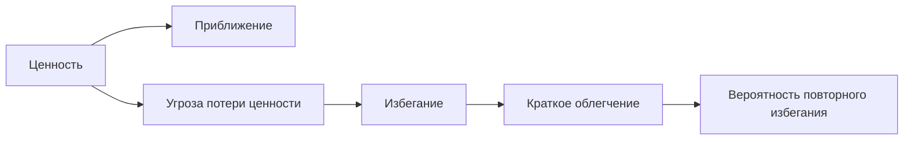

# Карта объяснения главы 9. Приближение и избегание

## Назначение карты

Эта карта переводит [[../Паспорта/09-Приближение-и-избегание]] в маршрут главы. После главы 8 читатель знает области ценности. Теперь нужно показать, что внутри каждой области человек может двигаться к ценности или от угрозы.

Глава должна снять моральную рамку с избегания, но не романтизировать его.

## Движение объяснения

| Шаг | Что объяснить | Какой вопрос закрывает |
| --- | --- | --- |
| 1 | Одна ценность может запускать два режима. | Почему важная задача иногда отталкивает? |
| 2 | Приближение. | Что значит двигаться к ценности? |
| 3 | Избегание. | Что значит двигаться от угрозы? |
| 4 | Избегание как активная политика. | Почему это не просто пустота действия? |
| 5 | Облегчение как подкрепление ухода. | Почему избегание закрепляется? |
| 6 | Матрица областей и режимов. | Как увидеть разные формы избегания? |
| 7 | Полезное и хроническое избегание. | Когда защита уместна, а когда сужает жизнь? |
| 8 | Практическая диагностика угрозы. | Как проектировать более безопасный вход? |

## Скелет будущей главы

### 1. Важное может отталкивать

Начать с парадокса:

```text
Чем важнее задача, тем больше она может пугать.
```

Это не противоречие, если ценность и угроза активны одновременно.

### 2. Приближение

Приближение — режим, в котором система организует действие вокруг получения ценности: сделать, освоить, встретиться, повлиять, защитить.

### 3. Избегание

Избегание — режим, в котором система организует действие вокруг снижения ожидаемого вреда: не столкнуться с провалом, критикой, бессилием, перегрузом.

### 4. Активность избегания

Показать формы:

- бесконечная подготовка;
- мелкая продуктивность;
- переключение на безопасные задачи;
- спор о форме;
- ожидание идеального момента;
- отказ задавать вопрос.

### 5. Облегчение

Кратко объяснить цикл:

```text
угроза -> уход -> облегчение -> закрепление ухода
```

Не перегружать нейробиологией. Это подготовка к прокрастинации и привычкам.

### 6. Матрица областей и режимов

Разобрать таблицу из паспорта. На каждом примере показать, от какой угрозы защищает избегание.

### 7. Полезное и хроническое избегание

Полезное избегание снижает реальный риск и сохраняет способность действовать. Хроническое избегание снижает тревогу сейчас, но уменьшает опыт управляемости позже.

### 8. Практическая диагностика

Вопросы:

```text
Какую угрозу я пытаюсь не встретить?
Что станет безопаснее, если я не начну?
Какой вход уменьшит угрозу, но не уничтожит движение?
```

## Визуальная опора главы

Использовать две схемы:



и матрицу "область x режим" из паспорта.

## Основной пример

Code review, который откладывается не из-за отсутствия ценности, а из-за социальной угрозы и риска конфликта.

## Проверка полноты перед черновиком

Глава готова к черновику, если она:

- объясняет избегание как активный режим;
- показывает цикл облегчения;
- разводит отдых и избегание;
- показывает формы избегания в разных областях мотивации;
- не превращает избегание в диагноз.

## Риск слабого текста

Главный риск — написать "избегание нормально" и на этом остановиться. Нужно показать механизм, пользу, цену и способ сделать следующий вход безопаснее без капитуляции перед задачей.

## Статус

`ready-for-review`

Черновик главы создан: [[../Главы/09-Приближение-и-избегание]].

Пакет источников создан: [[../Источники/2026-05-24 Пакет источников для главы 9]].

Проверка связки глав 8-9: [[../Проверки/2026-05-24 Связка глав 8-9]].

Глава 10 написана: [[../Главы/10-Управляемость-действия]].

Следующий шаг: при финальной редактуре проверить плотность главы и оставить материал о прокрастинации как мост к главе 18, а не как ее замену.
