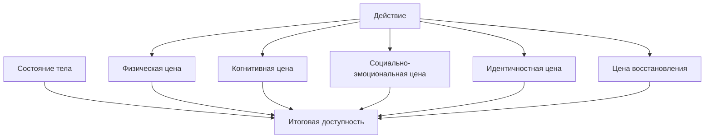

# Карта объяснения главы 11. Цена усилия, усталость и ощущаемая энергия

## Назначение карты

Эта карта переводит [[../Паспорта/11-Цена-усилия-усталость-и-ощущаемая-энергия]] в маршрут главы. После главы 10 читатель понимает управляемость. Теперь нужно добавить цену действия: даже ценный и управляемый шаг может быть слишком дорогим в текущем состоянии.

Глава завершает мотивационный блок и готовит переход к мозгу, телу и биохимии.

## Движение объяснения

| Шаг | Что объяснить | Какой вопрос закрывает |
| --- | --- | --- |
| 1 | Действие оценивается по цене, а не только по ценности. | Почему "важно" не значит "доступно"? |
| 2 | Цена усилия как субъективная стоимость действия. | Что именно дорого? |
| 3 | Виды цены: физическая, когнитивная, социально-эмоциональная, идентичностная. | Почему час работы может быть разным по цене? |
| 4 | Усталость как снижение готовности вкладывать усилие. | Почему "нет энергии" слишком грубо? |
| 5 | Восстанавливаемая и медленно восстанавливаемая усталость. | Когда помогает перерыв, а когда нет? |
| 6 | Аллостатический бюджет и интероцептивная оценка как рабочий мост к телу. | Почему тело входит в мотивацию? |
| 7 | Снижение цены без обесценивания задачи. | Как проектировать более доступное действие? |
| 8 | Границы: клиника, burnout, восстановление. | Где учебная модель заканчивается? |

## Скелет будущей главы

### 1. Цена рядом с ценностью

Начать с простого сравнения:

```text
Две задачи могут быть одинаково важными и одинаково короткими, но одна требует только внимания, а другая требует внимания, социального риска и восстановления после конфликта.
```

### 2. Определение цены усилия

Цена усилия — субъективная стоимость действия в текущем состоянии системы.

Важно: субъективная не значит "выдуманная". Она зависит от тела, опыта, угрозы, управляемости, среды и ожидаемого восстановления.

### 3. Виды цены

Разобрать:

- физическую;
- когнитивную;
- социально-эмоциональную;
- идентичностную;
- временную и восстановительную.

### 4. Усталость

Показать усталость как изменение готовности вкладывать усилие. Не спорить с усталостью как с моральной ошибкой.

### 5. Разные темпы восстановления

Ввести различение:

- короткая восстанавливаемая усталость;
- медленно восстанавливаемая накопленная цена.

Это подготовит главы про восстановление и выгорание.

### 6. Тело как часть оценки действия

Очень осторожно ввести аллостатический бюджет и интероцептивную оценку как рабочие термины. Не уходить в подробную нейробиологию до глав 12-15.

### 7. Снижение цены

Приемы:

- уменьшить первый шаг;
- сделать действие обратимым;
- снизить социальный риск;
- получить поддержку;
- уточнить критерий;
- отложить действие ради восстановления, если цена состояния слишком высока.

### 8. Границы

Обозначить, что длительная потеря энергии, клинические симптомы и burnout требуют отдельного разговора и иногда профессиональной помощи.

## Визуальная опора главы

Использовать карту видов цены:



Как читать схему: "нет энергии" часто является итогом нескольких видов цены, а не одним параметром.

## Основной пример

Сравнить две задачи по часу: техническую правку и неприятный разговор с признанием ошибки. Показать, что одинаковое время не означает одинаковую мотивационную стоимость.

## Проверка полноты перед черновиком

Глава готова к черновику, если она:

- не говорит об энергии как об одном баке;
- вводит несколько видов цены;
- различает отдых и избегание;
- осторожно вводит аллостатический бюджет;
- связывает цену усилия с управляемостью и угрозой;
- готовит переход к уровням объяснения в главе 12.

## Риск слабого текста

Главный риск — уйти либо в банальную продуктивность, либо в слишком раннюю биохимию. Глава должна остаться мостом: от мотивационной модели к телу и нейрофизиологии.

## Статус

`ready-for-review`

Черновик главы написан: [[../Главы/11-Цена-усилия-усталость-и-ощущаемая-энергия]].

Источниковый пакет создан: [[../Источники/2026-05-24 Пакет источников для главы 11]].

Следующий шаг: при финальной редактуре проверить, что глава 11 остается мостом к уровням объяснения, а не уходит в бытовые советы про энергию или преждевременную биохимию.
