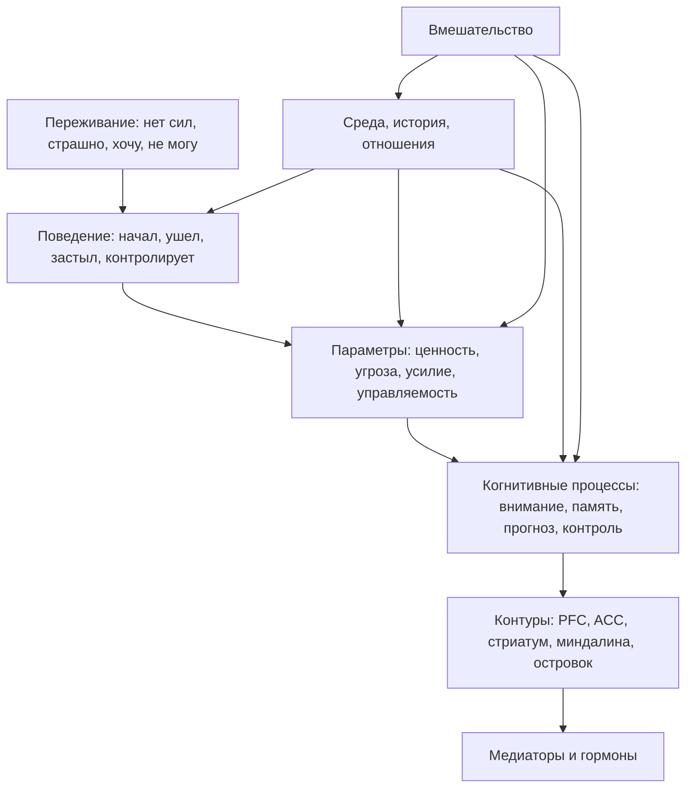

# Карта объяснения главы 12. Уровни объяснения

## Назначение карты

Эта карта переводит [[../Паспорта/12-Уровни-объяснения]] в маршрут главы. После главы 11 читатель уже видел телесный и нейрофизиологический мост. Теперь нужно остановиться и объяснить, как пользоваться этими уровнями без нейромифов.

## Движение объяснения

| Шаг | Что объяснить | Какой вопрос закрывает |
| --- | --- | --- |
| 1 | После мотивационного блока появился риск редукционизма. | Почему нужна отдельная глава про уровни? |
| 2 | Один эпизод можно описывать на нескольких уровнях. | Почему "нет энергии" не имеет одного правильного языка? |
| 3 | Уровни отвечают на разные вопросы. | Почему мозг не отменяет психологию, а психология не отменяет тело? |
| 4 | Пример "нет энергии". | Как применять уровни на знакомом материале? |
| 5 | Типичные ошибки: reverse inference, один медиатор, коррелят вместо причины. | Где рождаются нейромифы? |
| 6 | Как выбирать уровень вмешательства. | Почему иногда менять нужно не "дофамин", а задачу, среду или контрольную точку? |
| 7 | Переход к главам 13-14. | Как читать контуры и медиаторы дальше? |

## Скелет будущей главы

### 1. Почему эта глава стоит перед нейрофизиологией

Глава должна начать с честного предупреждения: после слов "дофамин", "миндалина", "кортизол", "интероцепция" легко начать объяснять слишком быстро.

### 2. Что такое уровень объяснения

Ввести рабочее определение:

```text
уровень объяснения - это слой вопроса, на котором мы описываем, почему явление возникло, как оно устроено и где его можно изменить
```

### 3. Лестница уровней

Уровни:

- субъективный опыт;
- поведение;
- параметры выбора;
- когнитивные процессы;
- нейронные контуры;
- медиаторы и гормоны;
- среда, история и отношения;
- уровень вмешательства.

### 4. Разбор "нет энергии"

Один пример на всю главу:

```text
мне дорого входить в задачу
```

Показать, как один эпизод выглядит на разных уровнях, и почему "низкий дофамин" не является достаточным ответом.

### 5. Три ошибки

1. Скачок к мозгу.
2. Один медиатор вместо системы.
3. Уровень реализации вместо уровня вмешательства.

### 6. Как пользоваться уровнями

Дать практическую процедуру:

```text
назвать переживание -> описать поведение -> выделить параметры -> проверить контекст -> выбрать уровень вмешательства -> только потом уточнять контуры и медиаторы
```

### 7. Переход к контурам

Глава 13 сможет вводить PFC, ACC, стриатум, миндалину и островок как контуры, участвующие в системе, а не как персонажей, которые "делают" поведение.

## Визуальная опора главы

Использовать схему уровней:



Как читать схему: верхние уровни не "менее настоящие", а нижние не "более настоящие". Они отвечают на разные вопросы.

## Основной пример

Ситуация:

```text
человек не открывает важную задачу и говорит "нет энергии"
```

Разбор:

- субъективно: нет доступности;
- поведенчески: не входит;
- параметрически: высокая цена усилия, низкая управляемость, угроза ошибки;
- когнитивно: потерян контекст, не виден первый шаг;
- контурно: вероятно участвуют контроль, угроза и интероцепция;
- нейрохимически: медиаторы меняют режим, но не дают одного объяснения;
- средово: прерывания, недосып, отсутствие контрольной точки.

## Проверка полноты перед черновиком

Глава готова к черновику, если она:

- объясняет уровни простым языком;
- не превращается в философскую лекцию;
- дает анти-нейромифный пример;
- объясняет reverse inference без перегруза;
- показывает, как выбирать уровень вмешательства;
- готовит главы 13 и 14.

## Риск слабого текста

Главный риск — написать правильный, но сухой методологический фрагмент. Глава должна быть практической: она учит читателя не ошибаться при чтении следующих глав и при объяснении своих состояний.

## Статус

`ready-for-review`

Черновик главы написан: [[../Главы/12-Уровни-объяснения]].

Источниковый пакет создан: [[../Источники/2026-05-24 Пакет источников для главы 12]].

Ревизия блока: [[../Проверки/2026-05-25 Ревизия блока 12-15]].

Следующий шаг: при финальной редактуре проверить, что глава остается практической дисциплиной объяснения, а не сухой методологической вставкой.
